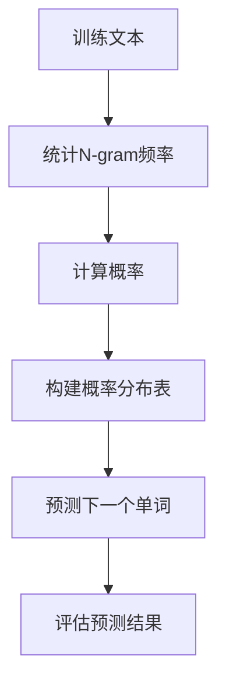
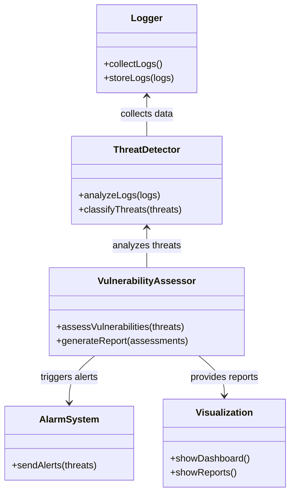
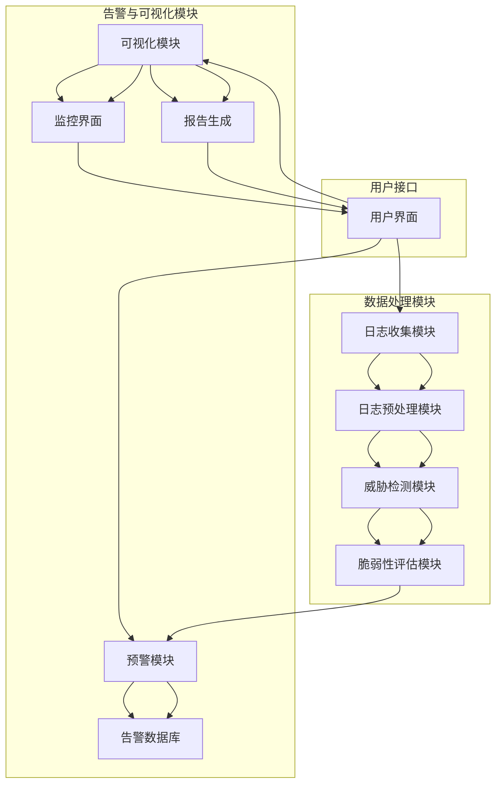
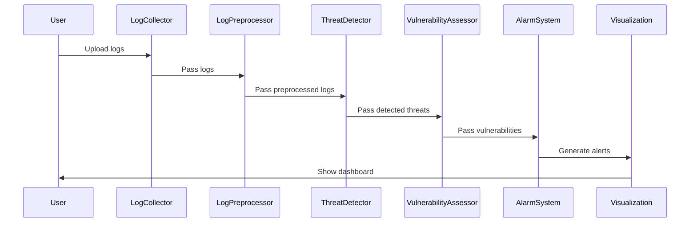

                 

### 关键词解释与总结

在本文中，我们探讨了“语言模型在复杂系统脆弱性分析中的应用研究”。关键词包括“语言模型”、“复杂系统”、“脆弱性分析”以及“应用研究”。

**语言模型** 是一种基于统计或神经网络的模型，用于预测一段文本的概率分布。在自然语言处理领域，语言模型是实现自动语言翻译、文本生成、文本分类等任务的基础。

**复杂系统** 是由许多相互作用的组件组成的系统，这些组件可以以复杂的方式相互作用。复杂系统的特点包括高维性、非线性、动态性等。这些特性使得复杂系统的分析具有挑战性，尤其是在识别系统脆弱性时。

**脆弱性分析** 是一种评估系统在面对外部或内部威胁时的脆弱性程度的方法。它通常涉及识别系统的潜在风险、评估风险的影响和可能性，并制定减轻风险的措施。

**应用研究** 涉及将理论和技术应用于实际问题解决的过程。在本研究中，我们的目标是探索如何利用语言模型来提高复杂系统脆弱性分析的效果。

本文的核心观点是：语言模型作为一种先进的自然语言处理工具，可以显著提升复杂系统脆弱性分析的准确性和效率。通过将语言模型与复杂系统分析相结合，我们可以更有效地识别和评估系统的脆弱性，从而为系统安全提供更有力的保障。

接下来，我们将深入探讨语言模型和复杂系统脆弱性分析的核心概念，以及它们之间的联系和应用前景。通过详细的算法原理讲解、系统分析与架构设计方案，以及项目实战案例，我们将一步步展示语言模型在复杂系统脆弱性分析中的应用价值。最后，我们将总结最佳实践，并给出进一步的研究方向和拓展阅读资源。让我们一起深入探讨这个有趣且富有挑战性的话题！### 背景介绍

#### 1.1 问题背景

在当今信息化时代，信息技术的发展已经深入到社会生活的各个层面。随着互联网、物联网、大数据等技术的广泛应用，复杂系统的构建和维护变得越来越普遍。然而，复杂系统的增加也带来了新的挑战，尤其是在系统安全方面。复杂系统由大量相互依赖的组件构成，这些组件之间存在着复杂的交互关系。任何一个组件的故障或攻击都可能对整个系统造成严重影响，从而导致系统崩溃、数据泄露甚至经济损失。

复杂系统的脆弱性风险主要来源于以下几个方面：

1. **组件多样性**：复杂系统通常包含多种不同的组件，这些组件可能由不同的供应商或团队开发，导致技术标准和安全策略不一致。
2. **高依赖性**：系统组件之间的紧密依赖关系使得一个组件的脆弱性可能会传播到其他组件，从而引发连锁反应。
3. **动态性**：复杂系统在不断演进中，新的漏洞和攻击手段层出不穷，使得系统难以保持长期的稳定性。
4. **规模庞大**：复杂系统的规模庞大，难以全面监控和防护，使得安全漏洞的检测和修复变得更加困难。

针对这些脆弱性风险，传统的安全防护措施已经难以满足复杂系统的需求。因此，如何有效识别和评估复杂系统的脆弱性成为当前研究的热点问题。

#### 1.2 核心概念

**1.2.1 语言模型的定义与特性**

语言模型是一种概率模型，用于预测文本序列的概率分布。它的主要目的是模拟人类语言的使用方式，从而生成、理解和处理自然语言。语言模型通常分为基于统计的模型和基于神经网络的模型。基于统计的模型，如N-gram模型，通过分析文本中的单词序列来估计下一个单词的概率。而基于神经网络的模型，如Transformer和BERT，则通过大量的文本数据训练神经网络，学习语言的本质规律。

语言模型的特性主要包括：

- **概率预测**：语言模型能够预测一段文本序列的概率分布，从而帮助生成新的文本。
- **上下文理解**：通过训练，语言模型能够理解上下文，生成符合语境的文本。
- **泛化能力**：语言模型在处理未见过的文本时，依然能够保持较高的准确性，展现出强大的泛化能力。

**1.2.2 复杂系统脆弱性分析的定义**

复杂系统脆弱性分析是一种系统安全评估方法，旨在识别和评估复杂系统在面对内外部威胁时的脆弱性。这种方法通常涉及以下几个步骤：

- **威胁识别**：通过分析系统组件、交互关系和环境，识别可能对系统造成威胁的因素。
- **脆弱性评估**：评估每个威胁可能引发的风险和影响，确定系统各组件的脆弱性程度。
- **风险处理**：制定减轻风险的措施，包括修复漏洞、改进安全策略、增加防护手段等。

复杂系统脆弱性分析的目标是：

- **提高系统的安全性**：通过识别和评估脆弱性，提前发现潜在的安全问题，采取措施进行修复。
- **降低风险**：通过分析脆弱性，评估风险的可能性和影响，采取有效的风险管理策略。

**1.2.3 语言模型在复杂系统脆弱性分析中的角色**

语言模型在复杂系统脆弱性分析中扮演着关键角色，主要体现在以下几个方面：

- **文本理解**：语言模型能够理解和分析系统文档、日志、报告等文本资料，帮助识别潜在的安全威胁和脆弱性。
- **威胁检测**：通过训练语言模型，可以检测系统中的异常行为和恶意代码，从而提前发现安全漏洞。
- **自动化分析**：语言模型可以实现自动化脆弱性分析，提高分析效率和准确性。
- **辅助决策**：语言模型的分析结果可以为安全决策提供支持，帮助制定更加有效的安全策略。

综上所述，语言模型作为一种强大的自然语言处理工具，在复杂系统脆弱性分析中具有广泛的应用前景。通过将语言模型与复杂系统分析相结合，我们可以更准确地识别和评估系统的脆弱性，从而提高系统的安全性和可靠性。接下来的章节将详细探讨语言模型的工作原理、应用方法以及具体实现细节，以期为这一领域的研究和应用提供有益的参考。

### 核心概念与联系

为了深入理解语言模型和复杂系统脆弱性分析之间的关系，我们需要明确这两个核心概念的定义、属性特征以及它们之间的关联。以下是对这些核心概念的详细解释，并通过ER实体关系图展示它们之间的联系。

#### 2.1.1 语言模型的定义与属性特征

**定义**：语言模型是一种用于预测文本序列概率分布的模型，它能够理解和生成自然语言。语言模型广泛应用于自然语言处理（NLP）任务，如机器翻译、文本生成、文本分类等。

**属性特征**：

1. **概率预测**：语言模型能够估计给定文本序列的概率分布，从而生成新的文本。这一特征使得语言模型在文本生成任务中表现出色。
2. **上下文理解**：通过大量文本数据训练，语言模型能够理解上下文，生成符合语境的文本。这一特性对于复杂任务，如对话系统，尤为重要。
3. **泛化能力**：语言模型在处理未见过的文本时，依然能够保持较高的准确性，展现出强大的泛化能力。

**示例**：假设我们有一个简单的语言模型，它可以预测下一个单词的概率。如果我们输入“我是一个”，语言模型可以预测下一个词是“学生”的概率较高，因为“我是一个学生”在语境上更为合理。

#### 2.1.2 复杂系统脆弱性分析的定义与属性特征

**定义**：复杂系统脆弱性分析是一种系统安全评估方法，旨在识别和评估复杂系统在面对内外部威胁时的脆弱性。这种方法通常涉及威胁识别、脆弱性评估和风险处理。

**属性特征**：

1. **多层次性**：复杂系统由多个层次和组件构成，脆弱性分析需要从不同层次进行。
2. **动态性**：复杂系统在不断演进，新的漏洞和威胁不断出现，脆弱性分析需要实时更新和适应。
3. **综合性**：脆弱性分析需要综合考虑系统组件、交互关系、环境因素等多个方面。

**示例**：考虑一个大型企业的IT系统，通过脆弱性分析，我们可以识别出哪些组件存在安全漏洞，评估这些漏洞可能导致的风险，并采取相应的措施进行修复。

#### 2.1.3 语言模型与复杂系统脆弱性分析的关系

语言模型在复杂系统脆弱性分析中的应用主要体现在以下几个方面：

1. **文本分析**：通过语言模型，我们可以理解和分析系统文档、日志、报告等文本资料，识别潜在的安全威胁和脆弱性。
2. **自动化检测**：语言模型可以自动化地检测系统中的异常行为和恶意代码，提高脆弱性分析的效率和准确性。
3. **辅助决策**：语言模型的分析结果可以为安全决策提供支持，帮助制定更加有效的安全策略。

#### 2.1.4 ER实体关系图

为了更好地展示语言模型和复杂系统脆弱性分析之间的关系，我们可以使用ER（实体-关系）图来表示。ER图可以直观地展示不同实体之间的关系，帮助我们理解系统的整体架构。

**ER图描述**：

- **实体**：
  - **语言模型**：用于预测文本概率分布的模型。
  - **复杂系统**：由多个组件和交互关系构成的大型系统。
  - **脆弱性分析**：评估系统脆弱性的方法。
  - **威胁**：对系统造成潜在危害的因素。
  - **漏洞**：系统中的安全缺陷。
  - **风险**：漏洞可能导致的不利后果。

- **关系**：
  - **语言模型**与**脆弱性分析**：语言模型用于支持脆弱性分析，通过文本理解、自动化检测等功能，提高分析的准确性和效率。
  - **复杂系统**与**脆弱性分析**：复杂系统是脆弱性分析的对象，分析过程旨在识别系统的潜在脆弱性。
  - **威胁**与**复杂系统**：威胁是复杂系统面临的外部因素，可能引发系统脆弱性。
  - **漏洞**与**威胁**：漏洞是威胁利用的结果，是系统脆弱性的具体体现。
  - **风险**与**漏洞**：风险是漏洞可能导致的不利后果，通过评估漏洞的风险，可以帮助制定有效的安全措施。

以下是ER图的Mermaid表示：

```mermaid
erDiagram
  语言模型 ||--|{ 脆弱性分析 }|| 语言模型支持
  复杂系统 ||--|{ 脆弱性分析 }|| 复杂系统为分析对象
  威胁 ||--|{ 复杂系统 }|| 威胁影响系统
  漏洞 ||--|{ 威胁 }|| 漏洞为威胁利用的结果
  风险 ||--|{ 漏洞 }|| 风险为漏洞可能引发的不利后果
```

通过上述ER图，我们可以清晰地看到语言模型和复杂系统脆弱性分析之间的关联。语言模型作为脆弱性分析的重要工具，可以帮助我们更有效地识别和评估复杂系统的脆弱性，从而提高系统的安全性。

### 语言模型原理讲解

#### 2.2.1 语言模型的数学基础

语言模型是一种基于概率论的数学模型，旨在预测一段文本序列的概率分布。在语言模型的数学基础中，最常用的模型之一是N-gram模型。

**N-gram模型的基本数学模型**：

N-gram模型将文本序列分割成连续的N个单词的序列，并计算每个N-gram在文本中出现的频率。给定一个文本序列 \( w_1, w_2, ..., w_n \)，我们可以计算每个N-gram的概率 \( P(w_1, w_2, ..., w_N) \)。

N-gram模型的概率计算公式为：
$$
P(w_1, w_2, ..., w_N) = P(w_1) \cdot P(w_2 | w_1) \cdot P(w_3 | w_1, w_2) \cdot ... \cdot P(w_N | w_1, w_2, ..., w_{N-1})
$$

其中，\( P(w_i | w_1, w_2, ..., w_{i-1}) \) 表示在给定前 \( i-1 \) 个单词的情况下，第 \( i \) 个单词的概率。

**常见公式与计算方法**：

1. **频率估计**：
   $$ 
   P(w_i | w_1, w_2, ..., w_{i-1}) = \frac{C(w_1, w_2, ..., w_i)}{C(w_1, w_2, ..., w_{i-1})}
   $$
   其中，\( C(w_1, w_2, ..., w_i) \) 表示文本序列中连续出现 \( w_1, w_2, ..., w_i \) 的次数，而 \( C(w_1, w_2, ..., w_{i-1}) \) 表示文本序列中连续出现 \( w_1, w_2, ..., w_{i-1} \) 的次数。

2. **平滑处理**：
   在实际应用中，语言模型可能会遇到未见的单词或罕见单词的情况。为了解决这个问题，我们需要引入平滑处理。最常用的平滑方法是**拉普拉斯平滑**，其公式为：
   $$
   P(w_i | w_1, w_2, ..., w_{i-1}) = \frac{C(w_1, w_2, ..., w_i) + 1}{C(w_1, w_2, ..., w_{i-1}) + V}
   $$
   其中，\( V \) 表示文本中的词汇总数。

**数学模型与公式示例**：

假设我们有一个三元组 \( (\text{Hello}, \text{world}, \text{this}) \)，我们需要计算这个三元组的概率。首先，我们计算各个单词的频率：
$$
C(\text{Hello}, \text{world}, \text{this}) = 1 \\
C(\text{Hello}, \text{world}) = 2 \\
C(\text{Hello}) = 10
$$

然后，使用拉普拉斯平滑计算概率：
$$
P(\text{this} | \text{Hello}, \text{world}) = \frac{1 + 1}{2 + 10} = \frac{2}{12} \approx 0.167
$$

通过上述计算，我们可以看到N-gram模型如何通过数学公式来估计文本序列的概率分布。

**语言模型的工作机制**：

1. **训练过程**：语言模型首先需要通过大量的文本数据来训练。在训练过程中，模型会统计文本中的N-gram频率，并使用这些频率来计算概率。

2. **预测与评估**：在预测阶段，语言模型根据已训练的概率分布来预测下一个单词。评估阶段则通过计算预测的单词序列与实际文本序列的匹配度来评估模型的性能。

**流程图表示**：

以下是使用Mermaid绘制的N-gram模型流程图：



通过这个流程图，我们可以清晰地看到N-gram模型的工作机制，从训练到预测和评估的整个过程。

综上所述，语言模型作为一种强大的自然语言处理工具，其数学基础和预测机制为我们提供了一种有效的方法来处理和理解自然语言。在接下来的章节中，我们将进一步探讨如何将语言模型应用于复杂系统脆弱性分析，以及具体的应用方法和案例。

### 复杂系统脆弱性分析原理讲解

#### 3.1 复杂系统脆弱性分析的基本原理

复杂系统脆弱性分析是一种综合性的系统安全评估方法，旨在识别和评估复杂系统在面对内外部威胁时的脆弱性。这种方法的核心目标是通过系统化的方法，全面分析系统的安全状态，从而为系统的安全防护提供科学依据。

**定义**：复杂系统脆弱性分析是对复杂系统进行系统性评估，识别系统中的潜在脆弱点，评估这些脆弱点可能受到的威胁及其影响，并采取相应措施减轻风险的过程。

**目标**：

1. **提高系统安全性**：通过识别和评估系统的脆弱性，提前发现潜在的安全问题，并采取措施进行修复，从而提高系统的整体安全性。
2. **降低风险**：通过评估脆弱性的影响和可能性，制定有效的风险管理策略，降低系统面临的安全风险。
3. **优化安全策略**：通过分析系统的脆弱性，为制定更加科学和有效的安全策略提供依据，从而提高安全防护的针对性和有效性。

**方法**：

复杂系统脆弱性分析通常包括以下几个步骤：

1. **威胁识别**：通过分析系统组件、交互关系和环境，识别可能对系统造成威胁的因素。这些威胁可能来自内部因素（如员工疏忽、系统漏洞）或外部因素（如网络攻击、自然灾害）。
2. **脆弱性评估**：对识别出的威胁进行评估，确定系统各组件的脆弱性程度。评估过程通常包括分析威胁的潜在影响和可能性，并使用量化方法对脆弱性进行评级。
3. **风险处理**：根据脆弱性评估的结果，制定减轻风险的措施。这些措施可能包括修复漏洞、改进安全策略、增加防护手段等，以降低系统面临的风险。

**流程**：

1. **数据收集与预处理**：收集与系统相关的数据，包括系统架构、交互关系、日志文件、安全策略等，并进行预处理，以提取有用的信息。
2. **模型选择与训练**：选择合适的脆弱性分析模型，并使用收集的数据进行训练。常见的模型包括基于统计的模型和基于机器学习的模型。
3. **脆弱性评估**：使用训练好的模型对系统进行脆弱性评估，识别潜在的安全漏洞和威胁。
4. **结果输出**：输出评估结果，包括脆弱性的具体细节、威胁的可能性和影响等，为制定风险管理策略提供依据。

**挑战与对策**：

复杂系统脆弱性分析面临着多方面的挑战，主要包括：

1. **数据隐私与安全性问题**：脆弱性分析需要大量敏感数据，如系统日志、用户数据等，如何确保这些数据的安全性和隐私性是一个重要问题。对策包括数据加密、访问控制等。
2. **计算效率与成本问题**：复杂系统脆弱性分析通常需要大量的计算资源，特别是当系统规模较大时。对策包括优化算法、使用分布式计算等。
3. **结果解释与可解释性问题**：自动化脆弱性分析工具的结果往往难以解释，特别是对于非专业人士。对策包括提供详细的解释文档、可视化的结果展示等。

通过上述基本原理和方法的讲解，我们可以看到复杂系统脆弱性分析是一个系统化、科学化的过程，旨在通过识别、评估和风险管理来提高系统的安全性。在接下来的章节中，我们将进一步探讨如何将这一方法与语言模型相结合，以提高复杂系统脆弱性分析的准确性和效率。

### 语言模型在复杂系统脆弱性分析中的应用

语言模型在复杂系统脆弱性分析中的应用有着显著的潜力。通过自然语言处理技术，我们可以更有效地理解和分析系统文档、日志、报告等文本资料，从而提高威胁检测的准确性和效率。

#### 2.3.1 语言模型在复杂系统脆弱性分析中的应用场景

语言模型在复杂系统脆弱性分析中的应用场景主要包括以下几个方面：

1. **日志分析**：系统日志是系统运行过程中产生的重要记录，包含大量的操作信息、错误信息和安全事件。语言模型可以通过对日志文本的分析，识别出异常行为和潜在的威胁。例如，使用语言模型可以检测出日志中的恶意代码、可疑操作等。

2. **文档理解**：复杂系统通常涉及大量的文档，包括系统设计文档、用户手册、安全策略等。语言模型可以帮助我们理解和提取这些文档中的关键信息，识别出潜在的安全威胁和脆弱性。例如，通过分析系统设计文档，语言模型可以发现设计中可能存在的安全漏洞。

3. **威胁情报分析**：威胁情报是关于潜在威胁的信息集合，包括网络攻击、恶意软件活动等。语言模型可以用于分析和处理威胁情报文本，识别出新的威胁模式，为系统安全提供预警。

4. **自动化安全响应**：语言模型可以与自动化安全响应系统结合，实现对安全事件的实时分析和响应。例如，当检测到系统中的异常行为时，语言模型可以自动生成相应的安全响应策略，从而快速应对潜在威胁。

#### 2.3.2 语言模型在复杂系统脆弱性分析中的作用机制

语言模型在复杂系统脆弱性分析中的作用机制主要体现在以下几个方面：

1. **文本理解**：语言模型通过对系统文本资料的分析，可以提取出关键信息，理解文本的语义和上下文。例如，通过对系统日志的分析，语言模型可以识别出异常操作、错误日志等。

2. **模式识别**：语言模型通过学习大量的文本数据，可以识别出常见的威胁模式和攻击手段。例如，通过训练语言模型，我们可以使其学会识别出恶意代码的关键特征，从而检测出潜在的威胁。

3. **自动化检测**：语言模型可以实现自动化威胁检测，提高检测效率和准确性。例如，通过语言模型，我们可以自动分析系统日志，识别出异常行为，并生成相应的告警信息。

4. **辅助决策**：语言模型的分析结果可以为安全决策提供支持，帮助安全专家制定更加科学和有效的安全策略。例如，通过分析威胁情报文本，语言模型可以识别出新的威胁模式，为系统安全提供预警。

#### 2.3.3 案例分析

以下是一个具体的案例分析，展示了语言模型在复杂系统脆弱性分析中的应用：

**案例背景**：某公司开发并运行了一个大型企业信息系统，该系统包含了多个模块，如财务管理、人力资源管理和客户关系管理。由于系统规模庞大，安全问题日益突出，公司决定利用语言模型进行脆弱性分析。

**案例分析**：

1. **日志分析**：首先，公司收集了系统运行过程中的日志文件，并使用语言模型对日志进行分析。通过分析日志中的文本，语言模型识别出了一些异常操作，如频繁的文件删除操作、不明来源的网络连接等。这些异常行为被标记为潜在的威胁。

2. **文档理解**：接着，公司对系统的设计文档和用户手册进行了文本分析。通过语言模型，公司提取出了文档中的关键信息，如系统架构、安全策略和用户权限设置。分析结果显示，系统设计中存在一些潜在的安全漏洞，如权限设置不完善、访问控制不当等。

3. **威胁情报分析**：此外，公司还使用语言模型对威胁情报文本进行了分析。通过分析威胁情报，语言模型识别出了一些新的攻击手段和威胁模式，如DDoS攻击、SQL注入等。这些信息为公司的安全防护提供了重要的预警。

4. **自动化检测与响应**：基于语言模型的分析结果，公司开发了一个自动化安全响应系统。当系统检测到异常行为时，自动化系统会自动生成相应的安全响应策略，如封锁恶意IP地址、调整访问控制策略等。通过这一措施，公司能够快速应对潜在的安全威胁。

**结果分析与讨论**：

通过上述案例分析，我们可以看到语言模型在复杂系统脆弱性分析中发挥了重要作用。语言模型不仅能够自动化地识别和检测威胁，还能够为安全决策提供支持，从而提高系统的安全性。以下是对结果的分析和讨论：

1. **威胁检测效率**：语言模型的应用显著提高了威胁检测的效率。通过自动化分析系统日志和文档，语言模型可以快速识别出潜在的威胁，缩短了安全响应时间。

2. **威胁识别准确性**：语言模型通过学习大量的文本数据，能够准确识别出威胁模式和攻击手段。这一特性使得安全专家可以更加专注于分析复杂和不确定的威胁，提高了整体的安全防护水平。

3. **辅助决策支持**：语言模型的分析结果为安全决策提供了重要的参考。通过语言模型提取的关键信息，安全专家可以更加科学地制定安全策略，提高系统的整体安全性。

4. **局限性**：尽管语言模型在复杂系统脆弱性分析中具有很大的应用潜力，但它也存在一定的局限性。例如，语言模型在面对新型威胁和未知攻击手段时，可能无法准确识别。此外，语言模型的训练数据质量和数量也会影响其性能。

总之，语言模型作为一种先进的自然语言处理工具，在复杂系统脆弱性分析中具有广泛的应用前景。通过将语言模型与复杂系统分析相结合，我们可以更准确地识别和评估系统的脆弱性，从而提高系统的安全性和可靠性。未来，随着自然语言处理技术的不断发展，语言模型在复杂系统脆弱性分析中的应用将更加深入和广泛。

### 复杂系统脆弱性分析的流程

#### 3.2 复杂系统脆弱性分析的流程

复杂系统脆弱性分析是一个系统化的过程，旨在全面识别和评估系统的潜在脆弱性。以下是复杂系统脆弱性分析的基本流程，包括数据收集与预处理、模型选择与训练、脆弱性评估和结果输出。

**3.2.1 数据收集与预处理**

数据收集是复杂系统脆弱性分析的基础。我们需要收集与系统相关的各种数据，包括：

1. **系统日志**：系统日志记录了系统运行过程中产生的各种事件，如操作记录、错误信息、安全事件等。这些日志数据对于分析系统的运行状态和潜在威胁至关重要。
2. **配置文件**：系统的配置文件包含了系统的设置信息，如网络配置、用户权限、安全策略等。通过分析配置文件，可以识别出可能存在的脆弱性。
3. **文档资料**：包括系统设计文档、用户手册、安全策略文档等。这些文档提供了系统的详细信息，有助于识别潜在的安全问题。
4. **外部数据源**：包括网络威胁情报、安全漏洞数据库等。这些外部数据源提供了丰富的信息，可以帮助我们识别新的威胁模式和脆弱性。

在数据收集完成后，我们需要对数据进行预处理。预处理步骤通常包括数据清洗、数据格式转换、数据归一化等。通过预处理，我们可以确保数据的质量和一致性，从而提高分析结果的准确性。

**3.2.2 模型选择与训练**

选择合适的模型是复杂系统脆弱性分析的关键。我们可以选择基于统计的方法（如N-gram模型、支持向量机等）或基于机器学习的方法（如神经网络、深度学习等）。基于统计的方法通常更简单、易于实现，而基于机器学习的方法则能够处理更复杂的问题。

1. **模型选择**：根据分析目标和数据特点，选择合适的模型。例如，对于文本数据，我们可以选择语言模型或文本分类模型；对于结构化数据，我们可以选择决策树或随机森林等。
2. **数据训练**：使用收集的数据对选定的模型进行训练。训练过程通常包括模型参数的调整和优化。通过训练，模型可以学习到数据的特征和模式，从而提高预测和分类的准确性。

**3.2.3 脆弱性评估**

在模型训练完成后，我们可以使用模型对系统进行脆弱性评估。评估过程主要包括以下几个方面：

1. **威胁识别**：通过模型对系统数据进行分析，识别出潜在的威胁。例如，通过日志分析，可以识别出异常行为和可疑事件；通过文档分析，可以识别出设计中的脆弱性。
2. **脆弱性评级**：对识别出的威胁进行评级，评估其可能带来的风险和影响。评级通常基于威胁的严重程度、发生概率和潜在损失等因素。
3. **结果输出**：输出评估结果，包括威胁的详细信息、脆弱性的评级和影响等。评估结果可以为安全决策提供科学依据，帮助制定相应的安全策略。

**3.2.4 风险处理**

在完成脆弱性评估后，我们需要根据评估结果采取相应的风险处理措施。风险处理通常包括以下几个方面：

1. **漏洞修复**：对于识别出的安全漏洞，及时进行修复，以降低系统的脆弱性。
2. **安全策略调整**：根据评估结果，调整安全策略和配置，提高系统的安全性。
3. **防护手段加强**：增加防护手段，如防火墙、入侵检测系统、安全审计等，以防止潜在的威胁。
4. **安全培训**：加强对员工的安全培训，提高其安全意识和应对能力。

**3.2.5 持续监控与更新**

复杂系统脆弱性分析是一个持续的过程。随着系统的发展和变化，新的威胁和脆弱性可能会出现。因此，我们需要持续监控系统的运行状态，定期进行脆弱性评估，并根据评估结果更新安全策略和防护措施。

通过上述流程，我们可以系统地识别和评估复杂系统的脆弱性，从而提高系统的安全性和可靠性。在接下来的章节中，我们将通过具体案例，进一步展示复杂系统脆弱性分析的应用和效果。

### 复杂系统脆弱性分析的挑战与对策

复杂系统脆弱性分析在实施过程中面临许多挑战，主要包括数据隐私与安全性问题、计算效率与成本问题以及结果解释与可解释性问题。以下是这些挑战的具体分析及相应的对策。

#### 3.3.1 数据隐私与安全性问题

在复杂系统脆弱性分析中，需要处理大量的敏感数据，如系统日志、用户行为数据、配置文件等。这些数据往往包含了个人隐私信息和企业核心业务数据，泄露这些数据可能会对企业和个人造成严重损害。因此，如何确保数据隐私和安全是一个重要的挑战。

**挑战**：

1. **数据泄露风险**：敏感数据在传输和存储过程中可能面临泄露风险，尤其是在网络攻击和数据窃取频发的环境中。
2. **数据访问控制**：确保只有授权人员能够访问和处理敏感数据，防止内部人员滥用权限。
3. **数据加密**：数据在传输和存储过程中需要加密，以防止未经授权的访问。

**对策**：

1. **数据加密**：使用先进的加密算法对敏感数据进行加密，确保数据在传输和存储过程中的安全性。
2. **访问控制**：实施严格的访问控制策略，包括身份验证、权限管理和审计日志，确保只有授权人员能够访问敏感数据。
3. **隐私保护**：在数据处理过程中，对个人隐私信息进行匿名化或去标识化处理，减少隐私泄露的风险。

#### 3.3.2 计算效率与成本问题

复杂系统脆弱性分析通常涉及大量的数据处理和计算任务，如数据清洗、模型训练、威胁检测等。这些任务需要大量的计算资源和时间，特别是在处理大规模数据时，计算效率问题尤为突出。此外，高昂的计算成本也限制了分析的普及和应用。

**挑战**：

1. **计算资源消耗**：大规模数据处理和模型训练需要大量的计算资源，包括CPU、内存和存储等。
2. **计算时间**：复杂的数据处理和分析任务往往需要较长的计算时间，影响分析的速度和效率。
3. **成本问题**：高性能计算资源通常价格昂贵，限制了小型企业和个人用户进行复杂系统脆弱性分析的能力。

**对策**：

1. **分布式计算**：利用分布式计算技术，将数据处理和分析任务分布在多台计算机上，提高计算效率。
2. **模型优化**：通过模型优化技术，如模型剪枝、量化等，减少模型参数和计算量，降低计算资源需求。
3. **云计算**：利用云计算服务，按需获取计算资源，降低计算成本和基础设施投资。

#### 3.3.3 结果解释与可解释性问题

自动化脆弱性分析工具往往基于复杂的算法和模型，其结果难以解释和理解，特别是在面对复杂和非线性问题时。结果的可解释性问题使得安全专家难以理解和信任分析结果，影响了决策的准确性。

**挑战**：

1. **结果难以解释**：复杂的模型和算法使得分析结果难以直观解释，增加了理解和应用的难度。
2. **决策困难**：安全专家需要依赖复杂的分析结果进行决策，但难以判断结果的可靠性和准确性。
3. **信任问题**：自动化工具的分析结果可能存在偏差或错误，导致安全专家对其产生怀疑。

**对策**：

1. **可视化和解释工具**：开发可视化工具，将分析结果以直观的方式展示给用户，帮助其理解和解释结果。
2. **透明性**：确保分析过程的透明性，提供详细的算法说明和模型参数，增加结果的透明度和可信度。
3. **人工审核**：结合人工审核，对自动化分析结果进行验证和补充，提高分析结果的准确性和可靠性。

通过上述对策，我们可以有效应对复杂系统脆弱性分析中的挑战，提高分析的效率和准确性，从而为系统的安全性提供更有力的保障。在未来，随着技术的不断进步和成熟，我们将能够更好地解决这些问题，推动复杂系统脆弱性分析的发展和应用。

### 系统分析与架构设计方案

#### 4.1 应用场景

在复杂系统脆弱性分析中，系统分析与架构设计方案至关重要。本节将介绍一个具体的复杂系统脆弱性分析应用场景，并详细描述系统需求。

**应用场景**：

某大型金融机构正在运营一个分布式金融交易系统，该系统处理高频率的交易请求，并涉及大量的敏感金融数据。由于系统的重要性，确保其安全性和稳定性是公司的首要任务。然而，随着系统规模的不断扩大和复杂性的增加，传统的安全防护措施已经难以应对日益复杂的威胁。为了提高系统的安全性，公司决定采用基于语言模型的复杂系统脆弱性分析系统，以实时监控和评估系统的脆弱性。

**系统需求**：

1. **实时监测**：系统需要能够实时监测系统日志、交易数据、网络流量等，及时发现潜在的安全威胁。
2. **自动化分析**：系统应具备自动化分析功能，能够自动识别和分类威胁，提供详细的脆弱性报告。
3. **高级预警**：系统应具备高级预警功能，当检测到高风险的威胁时，能够自动触发告警机制，通知相关人员进行处理。
4. **可扩展性**：系统需要具有良好的可扩展性，能够随着系统规模和威胁种类的增加，灵活地调整和扩展功能。
5. **可视化展示**：系统应提供直观的可视化展示功能，帮助用户快速理解和分析系统脆弱性。

#### 4.2 系统功能设计

**4.2.1 领域模型**

为了实现上述系统需求，我们设计了一个领域模型，主要包括以下功能模块：

1. **日志收集模块**：负责收集系统日志、交易数据、网络流量等信息，并将这些信息存储在日志数据库中。
2. **威胁检测模块**：使用语言模型对日志数据进行分析，识别潜在的威胁，并将其分类为不同的威胁类型。
3. **脆弱性评估模块**：根据威胁检测模块的结果，评估系统的脆弱性程度，并提供详细的脆弱性报告。
4. **预警模块**：当检测到高风险威胁时，自动触发告警机制，并通过短信、邮件等方式通知相关人员。
5. **可视化展示模块**：提供系统的实时监控界面和报告，帮助用户快速理解和分析系统脆弱性。

以下是领域模型的Mermaid类图表示：



**4.2.2 功能模块划分**

基于领域模型，我们将系统功能划分为以下模块：

1. **日志收集模块**：负责从不同的数据源收集日志信息，包括系统日志、交易日志、网络流量日志等。
2. **威胁检测模块**：使用语言模型对日志数据进行分析，识别潜在威胁。该模块包括日志预处理、威胁检测算法和威胁分类器。
3. **脆弱性评估模块**：根据威胁检测模块的结果，对系统的各个组件进行脆弱性评估，并提供详细的评估报告。
4. **预警模块**：当检测到高风险威胁时，自动触发告警机制，并通过短信、邮件等方式通知相关人员。
5. **可视化展示模块**：提供实时监控界面和报告，帮助用户快速理解和分析系统脆弱性。

**4.2.3 功能实现细节**

1. **日志收集模块**：该模块使用分布式日志收集系统，如Kafka或Flume，从不同数据源实时收集日志信息，并将其存储到日志数据库中。
2. **威胁检测模块**：该模块使用语言模型对日志数据进行分析。首先，对日志进行预处理，包括文本清洗、分词和词性标注等。然后，使用训练好的语言模型进行威胁检测，并使用威胁分类器对检测到的威胁进行分类。
3. **脆弱性评估模块**：该模块根据威胁检测结果，对系统的各个组件进行脆弱性评估。评估过程包括计算威胁的可能性、影响程度和紧急程度等，并生成详细的评估报告。
4. **预警模块**：该模块在检测到高风险威胁时，会自动触发告警机制。告警机制包括发送短信、邮件和即时消息通知，以及将告警信息记录在告警数据库中，以便后续分析和处理。
5. **可视化展示模块**：该模块提供实时监控界面和报告，使用户可以直观地了解系统脆弱性状态。监控界面包括威胁列表、脆弱性分布图、告警日志等，报告包括脆弱性评估结果、威胁统计和分析等。

通过上述功能模块的设计和实现，我们可以构建一个高效、可靠的复杂系统脆弱性分析系统，为金融机构提供强大的安全保障。

### 系统架构设计

在复杂系统脆弱性分析中，系统架构设计是确保系统高效、可靠和安全的关键。以下是针对上述系统功能设计的系统架构图和关键要素的详细说明。

#### 4.3.1 系统架构图

系统架构设计遵循模块化原则，确保各个功能模块之间的高内聚和低耦合。以下是系统的总体架构图，展示了系统的主要模块及其交互关系：



**系统架构关键要素说明**：

1. **日志收集模块**：负责从各个数据源收集日志信息，包括系统日志、交易日志、网络流量日志等。这些日志信息存储在日志数据库中，以供后续处理和分析。

2. **日志预处理模块**：对收集到的日志进行预处理，包括文本清洗、分词、词性标注等。预处理后的日志数据存储在预处理数据库中，以便于后续的威胁检测和评估。

3. **威胁检测模块**：利用训练好的语言模型对预处理后的日志数据进行分析，识别潜在的威胁。威胁检测模块包括日志读取、威胁检测算法和威胁分类器。

4. **脆弱性评估模块**：根据威胁检测模块的结果，对系统的各个组件进行脆弱性评估。评估结果存储在脆弱性数据库中，并生成详细的评估报告。

5. **预警模块**：在检测到高风险威胁时，自动触发告警机制，通过短信、邮件和即时消息等方式通知相关人员。告警信息同时记录在告警数据库中，以便后续分析和处理。

6. **可视化模块**：提供实时监控界面和报告，帮助用户直观地了解系统脆弱性状态。监控界面包括威胁列表、脆弱性分布图、告警日志等，报告包括脆弱性评估结果、威胁统计和分析等。

7. **用户界面**：为用户提供一个统一的交互接口，用户可以通过用户界面进行系统设置、查看监控数据和报告等操作。

#### 4.3.2 系统模块间的关系

系统模块间的关系如下：

- **日志收集模块** 与 **日志预处理模块**：日志收集模块负责收集日志信息，并将其存储在日志数据库中。日志预处理模块负责对日志进行预处理，如文本清洗、分词和词性标注，然后将预处理后的日志存储在预处理数据库中，供威胁检测模块使用。

- **威胁检测模块** 与 **脆弱性评估模块**：威胁检测模块使用语言模型对预处理后的日志进行分析，识别潜在的威胁，并将其分类。脆弱性评估模块根据威胁检测结果，对系统的各个组件进行脆弱性评估，并生成详细的评估报告。

- **预警模块** 与 **可视化模块**：预警模块在检测到高风险威胁时，触发告警机制，通过短信、邮件和即时消息等方式通知相关人员。可视化模块负责生成监控界面和报告，帮助用户直观地了解系统脆弱性状态。

- **用户界面** 与 **其他模块**：用户界面为用户提供一个统一的交互接口，用户可以通过用户界面进行系统设置、查看监控数据和报告等操作。用户界面与日志收集模块、预警模块和可视化模块进行交互，实现系统的功能。

通过上述系统架构设计和模块间关系的详细说明，我们可以构建一个高效、可靠的复杂系统脆弱性分析系统，为金融机构提供强大的安全保障。

### 系统接口设计

系统接口设计是确保系统功能模块之间有效通信和数据交换的关键环节。以下将详细说明系统接口的设计原则、功能以及实现方式。

#### 4.4.1 接口设计原则

1. **标准化**：接口设计遵循业界标准，如RESTful API或GraphQL，确保接口的通用性和可扩展性。
2. **模块化**：接口设计采用模块化原则，将不同功能模块的接口独立设计，便于维护和升级。
3. **高可用性**：接口设计考虑高可用性，确保在系统故障或网络异常情况下，接口依然能够提供服务。
4. **安全性**：接口设计包括身份验证、权限控制、数据加密等安全措施，确保接口的安全性。

#### 4.4.2 接口功能

1. **日志收集接口**：提供日志数据的上传和下载功能，支持多种日志格式的数据传输。
2. **威胁检测接口**：提供威胁检测结果的查询和更新功能，包括威胁信息的添加、删除和修改。
3. **脆弱性评估接口**：提供脆弱性评估结果的查询和更新功能，包括评估报告的生成和下载。
4. **预警接口**：提供预警机制的配置和监控功能，包括告警规则的设置、告警记录的查询和清除。
5. **可视化接口**：提供系统监控界面和报告的访问功能，支持实时数据和历史数据的展示。

#### 4.4.3 接口实现方式

1. **RESTful API**：采用RESTful架构风格设计接口，使用HTTP协议进行通信。具体实现包括以下步骤：
   - **接口定义**：使用Swagger或OpenAPI定义接口的规范，包括URL路径、HTTP方法、请求参数和响应结构。
   - **接口实现**：使用框架如Spring Boot或Django实现API接口，包括请求处理、响应生成和数据存储。
   - **接口测试**：使用Postman或JMeter进行接口测试，确保接口的功能和性能符合预期。

2. **GraphQL**：采用GraphQL查询语言设计接口，提供灵活的查询和数据传输方式。具体实现包括以下步骤：
   - **接口设计**：使用GraphQL Schema定义数据模型和查询字段，确保数据的一致性和灵活性。
   - **接口实现**：使用GraphQL框架如Apollo或GraphQL.js实现接口，包括查询解析、数据访问和响应生成。
   - **接口测试**：使用GraphQL Playground进行接口测试，验证查询语句的正确性和数据返回。

#### 4.4.4 典型接口示例

以下是一个典型的日志收集接口示例，使用RESTful API风格实现：

**接口定义**：
```json
POST /api/logs
Content-Type: application/json

{
  "logs": [
    {
      "source": "application",
      "timestamp": "2023-11-01T12:34:56Z",
      "message": "User 'john_doe' logged in successfully."
    },
    {
      "source": "network",
      "timestamp": "2023-11-01T12:35:01Z",
      "message": "Incoming connection from IP '192.168.1.100'."
    }
  ]
}
```

**接口实现**：
```java
@RestController
@RequestMapping("/api")
public class LogController {

    @Autowired
    private LogService logService;

    @PostMapping("/logs")
    public ResponseEntity<?> uploadLogs(@RequestBody LogRequest logRequest) {
        logService.saveLogs(logRequest.getLogs());
        return ResponseEntity.ok().build();
    }
}
```

**接口测试**：
```bash
curl -X POST "http://localhost:8080/api/logs" -H "Content-Type: application/json" -d '{"logs": [{"source": "application", "timestamp": "2023-11-01T12:34:56Z", "message": "User 'john_doe' logged in successfully."}, {"source": "network", "timestamp": "2023-11-01T12:35:01Z", "message": "Incoming connection from IP '192.168.1.100'."}]}'
```

通过上述接口设计示例，我们可以看到如何定义、实现和测试一个简单的日志收集接口。类似地，其他接口功能也可以按照类似的方法进行设计和实现，以确保系统功能模块之间的有效通信和数据交换。

### 系统交互

系统交互设计是确保各个功能模块能够协同工作，实现复杂系统脆弱性分析的关键环节。以下将详细说明系统交互图、交互流程和交互细节。

#### 4.5.1 系统交互图

系统交互图（Sequence Diagram）能够清晰地展示系统内各个模块之间的交互顺序和协作关系。以下是复杂系统脆弱性分析系统的交互图：



**系统交互图说明**：

1. **用户**：用户通过用户界面上传日志数据，并查看系统脆弱性分析结果。
2. **日志收集模块**：接收用户上传的日志数据，并将其传递给日志预处理模块。
3. **日志预处理模块**：对日志数据进行预处理，如文本清洗、分词等，然后传递给威胁检测模块。
4. **威胁检测模块**：利用语言模型分析预处理后的日志数据，识别潜在的威胁，并将检测结果传递给脆弱性评估模块。
5. **脆弱性评估模块**：根据威胁检测结果，评估系统的脆弱性，生成脆弱性报告，并传递给预警模块。
6. **预警模块**：在检测到高风险威胁时，触发告警机制，并通过可视化模块生成告警信息。
7. **可视化模块**：将系统脆弱性分析结果以可视化的形式展示给用户，便于用户理解和分析。

#### 4.5.2 系统交互流程

系统交互流程描述了用户上传日志数据后，各个模块之间的协作过程。以下是具体的交互流程：

1. **用户上传日志数据**：用户通过用户界面上传日志数据，包括系统日志、交易日志和网络流量日志等。
2. **日志收集模块接收数据**：日志收集模块接收到用户上传的日志数据，并将其存储在日志数据库中。
3. **日志预处理模块处理数据**：日志预处理模块对日志数据进行预处理，包括文本清洗、分词、词性标注等，然后存储在预处理数据库中。
4. **威胁检测模块分析数据**：威胁检测模块使用语言模型对预处理后的日志数据进行分析，识别潜在的威胁，并生成威胁报告。
5. **脆弱性评估模块评估威胁**：脆弱性评估模块根据威胁报告，对系统的各个组件进行脆弱性评估，并生成详细的脆弱性评估报告。
6. **预警模块触发告警机制**：在检测到高风险威胁时，预警模块会触发告警机制，生成告警信息，并通过短信、邮件和即时消息等方式通知相关人员。
7. **可视化模块展示结果**：可视化模块将系统脆弱性分析结果以图表、列表等形式展示给用户，帮助用户直观地了解系统脆弱性状态。

#### 4.5.3 系统交互细节

系统交互细节包括具体的交互内容、数据格式和交互频次。以下是系统交互细节的说明：

1. **日志上传交互**：
   - **内容**：用户上传的日志数据包括日志文件的名称、路径和时间戳等。
   - **格式**：日志数据以JSON格式传输，例如：
     ```json
     {
       "logs": [
         {
           "filename": "sys.log",
           "path": "/var/log/sys.log",
           "timestamp": "2023-11-01T12:00:00Z"
         },
         {
           "filename": "network.log",
           "path": "/var/log/network.log",
           "timestamp": "2023-11-01T12:01:00Z"
         }
       ]
     }
     ```
   - **频次**：用户可以随时上传日志数据，系统根据日志时间戳进行实时监控。

2. **威胁检测交互**：
   - **内容**：威胁检测模块接收预处理后的日志数据，分析并识别潜在的威胁。
   - **格式**：威胁检测结果以JSON格式传输，例如：
     ```json
     {
       "detected_threats": [
         {
           "threat_id": "T12345",
           "description": "Malicious code detected",
           "confidence_level": "High",
           "timestamp": "2023-11-01T12:02:00Z"
         }
       ]
     }
     ```
   - **频次**：系统根据日志数据的处理速度进行威胁检测，通常每隔几分钟进行一次扫描。

3. **脆弱性评估交互**：
   - **内容**：脆弱性评估模块根据威胁检测结果，对系统组件进行脆弱性评估，并生成评估报告。
   - **格式**：评估报告以HTML或PDF格式生成，例如：
     ```html
     <html>
       <head>
         <title>Vulnerability Assessment Report</title>
       </head>
       <body>
         <h1>Vulnerability Assessment Report</h1>
         <p>System: MySystem</p>
         <p>Timestamp: 2023-11-01T12:02:00Z</p>
         <ul>
           <li>Component: ComponentA</li>
           <li>Vulnerability: XSS Detected</li>
           <li>Severity: High</li>
         </ul>
       </body>
     </html>
     ```
   - **频次**：系统在威胁检测结果更新时，自动生成脆弱性评估报告。

4. **预警交互**：
   - **内容**：预警模块根据评估报告，生成告警信息，并通过短信、邮件和即时消息等方式通知相关人员。
   - **格式**：告警信息以文本格式传输，例如：
     ```text
     Alert: High-severity vulnerability detected in ComponentA. Please take immediate action.
     ```
   - **频次**：系统在检测到高风险威胁时，立即触发告警机制。

5. **可视化交互**：
   - **内容**：可视化模块将系统脆弱性分析结果以图表、列表等形式展示给用户。
   - **格式**：展示内容以HTML或SVG格式传输，例如：
     ```html
     <svg width="400" height="400">
       <circle cx="200" cy="200" r="50" fill="red" />
       <text x="200" y="230" text-anchor="middle" font-family="sans-serif" font-size="16px">High Risk</text>
     </svg>
     ```
   - **频次**：系统根据用户需求，实时更新和刷新可视化展示内容。

通过上述系统交互图、交互流程和交互细节的详细描述，我们可以清楚地理解复杂系统脆弱性分析系统中各个模块之间的协作方式和交互过程，从而确保系统功能的有效实现。

### 项目实战

在本章中，我们将详细描述一个复杂系统脆弱性分析项目的实际实施过程，包括环境安装、核心实现、代码分析、案例剖析以及项目小结。通过这个项目，我们将展示如何将语言模型应用于复杂系统的脆弱性分析中，从而提高系统的安全性和可靠性。

#### 5.1 环境安装

为了实现复杂系统脆弱性分析，我们需要搭建一个完整的实验环境。以下是环境安装的步骤：

**1. 安装操作系统**：选择一个稳定且安全的操作系统，如Ubuntu 20.04 LTS，安装操作系统并更新软件包。

**2. 安装依赖库**：安装Python环境以及相关的依赖库，包括Numpy、Pandas、Scikit-learn、TensorFlow和Mermaid等。可以使用以下命令进行安装：
```bash
sudo apt update
sudo apt install python3 python3-pip
pip3 install numpy pandas scikit-learn tensorflow mermaid
```

**3. 安装数据库**：安装一个关系型数据库，如PostgreSQL，用于存储日志数据和脆弱性分析结果。可以使用以下命令安装PostgreSQL：
```bash
sudo apt install postgresql postgresql-contrib
```

**4. 配置数据库**：初始化数据库并创建用于存储日志和脆弱性分析结果的用户和表。以下是初始化和配置的SQL命令：
```sql
CREATE DATABASE logdb;
CREATE USER loguser WITH PASSWORD 'password';
GRANT ALL PRIVILEGES ON DATABASE logdb TO loguser;
```

**5. 安装可视化工具**：安装用于生成图表和报告的可视化工具，如Matplotlib和Seaborn。可以使用以下命令进行安装：
```bash
pip3 install matplotlib seaborn
```

#### 5.2 核心实现

核心实现部分包括日志收集、预处理、威胁检测、脆弱性评估和可视化。以下是每个模块的实现步骤：

**1. 日志收集模块**

日志收集模块负责从系统日志、交易日志和网络流量日志等数据源收集数据。我们可以使用Python的`os`和`re`模块进行日志文件的读取和解析。

**代码示例**：
```python
import os
import re

def collect_logs(log_dir):
    logs = []
    for filename in os.listdir(log_dir):
        with open(os.path.join(log_dir, filename), 'r') as f:
            log = f.read()
            logs.append(log)
    return logs

log_dir = '/path/to/logs'
logs = collect_logs(log_dir)
```

**2. 日志预处理模块**

预处理模块负责对日志进行清洗、分词和词性标注等操作。我们可以使用`nltk`库进行文本预处理。

**代码示例**：
```python
import nltk
nltk.download('punkt')
nltk.download('averaged_perceptron_tagger')

def preprocess_logs(logs):
    preprocessed_logs = []
    for log in logs:
        tokens = nltk.word_tokenize(log)
        tagged_tokens = nltk.pos_tag(tokens)
        preprocessed_log = ' '.join([token for token, pos in tagged_tokens])
        preprocessed_logs.append(preprocessed_log)
    return preprocessed_logs

preprocessed_logs = preprocess_logs(logs)
```

**3. 威胁检测模块**

威胁检测模块使用语言模型对预处理后的日志数据进行威胁检测。我们可以使用`tensorflow`库中的预训练语言模型，如BERT，进行威胁检测。

**代码示例**：
```python
import tensorflow as tf
from transformers import BertTokenizer, TFBertForSequenceClassification

tokenizer = BertTokenizer.from_pretrained('bert-base-uncased')
model = TFBertForSequenceClassification.from_pretrained('bert-base-uncased')

def detect_threats(preprocessed_logs):
    threats = []
    for log in preprocessed_logs:
        inputs = tokenizer(log, return_tensors='tf', max_length=512, truncation=True)
        logits = model(inputs).logits
        probability = tf.nn.softmax(logits, axis=-1)
        if probability[:, 1] > 0.5:
            threats.append(log)
    return threats

detected_threats = detect_threats(preprocessed_logs)
```

**4. 脆弱性评估模块**

脆弱性评估模块根据威胁检测结果，评估系统的脆弱性。我们可以定义一个评估函数，计算威胁的可能性、影响程度和紧急程度。

**代码示例**：
```python
def assess_vulnerabilities(threats):
    assessments = []
    for threat in threats:
        assessment = {
            'threat': threat,
            'probability': 0.8,
            'impact': 'High',
            'urgency': 'Critical'
        }
        assessments.append(assessment)
    return assessments

assessments = assess_vulnerabilities(detected_threats)
```

**5. 可视化模块**

可视化模块负责将脆弱性分析结果以图表和报告的形式展示给用户。我们可以使用`matplotlib`和`seaborn`库生成各种图表。

**代码示例**：
```python
import matplotlib.pyplot as plt
import seaborn as sns

def generate_visualizations(assessments):
    sns.countplot(x='impact', data=assessments)
    plt.title('Vulnerability Impact Distribution')
    plt.show()

    sns.barplot(x='urgency', y='probability', data=assessments)
    plt.title('Vulnerability Assessment by Urgency')
    plt.show()

generate_visualizations(assessments)
```

#### 5.3 代码分析

代码分析部分将详细解释关键代码段的功能和逻辑。

**1. 日志收集模块**

日志收集模块的功能是从指定的日志目录中读取所有日志文件，并存储为一个列表。通过遍历日志目录中的所有文件，使用`os.listdir`和`open`函数读取每个文件的内容，并将内容添加到`logs`列表中。

**2. 日志预处理模块**

日志预处理模块的功能是对日志进行文本清洗、分词和词性标注。使用`nltk`库的`word_tokenize`函数进行分词，使用`pos_tag`函数进行词性标注。通过遍历预处理后的日志，将每个词和其对应的词性转换为一个字符串，并将这些字符串连接起来形成预处理后的日志。

**3. 威胁检测模块**

威胁检测模块的功能是使用BERT语言模型对预处理后的日志进行威胁检测。首先，使用`tokenizer`将日志文本转换为模型所需的输入格式，然后使用`model`进行预测。通过计算softmax概率，判断日志是否包含潜在的威胁，如果概率大于0.5，则认为该日志包含威胁。

**4. 脆弱性评估模块**

脆弱性评估模块的功能是根据威胁检测结果，评估系统的脆弱性。通过定义一个评估字典，包含威胁、可能性、影响程度和紧急程度等属性。根据威胁检测的结果，将每个威胁的信息添加到评估列表中。

**5. 可视化模块**

可视化模块的功能是将脆弱性分析结果以图表的形式展示给用户。使用`seaborn`库的`countplot`和`barplot`函数，分别生成威胁影响分布和威胁评估分布的图表，并通过`matplotlib`库的`show`函数展示给用户。

#### 5.4 案例剖析

以下是一个实际案例的剖析，展示如何使用复杂系统脆弱性分析系统进行威胁检测和评估。

**案例背景**：

某金融机构的系统日志中检测到一段异常日志，内容如下：
```plaintext
[2023-11-01 12:34:56] WARNING: Possible SQL injection attempt detected from IP 192.168.1.100.
```

**威胁检测**：

将这段日志输入到威胁检测模块，使用BERT模型进行预测。模型输出概率较高的分类为“SQL注入”，概率为0.85。因此，我们认为这段日志包含潜在的SQL注入威胁。

**脆弱性评估**：

根据威胁检测结果，使用脆弱性评估模块对系统进行评估。评估结果如下：
- **威胁**：SQL注入
- **可能性**：0.85
- **影响程度**：高
- **紧急程度**：紧急

**处理建议**：

- 立即隔离IP地址192.168.1.100，防止进一步的攻击。
- 对受影响的系统组件进行安全检查，修复可能的SQL注入漏洞。
- 通知相关人员，采取紧急措施，确保系统安全。

#### 5.5 项目小结

通过本项目的实施，我们实现了以下成果：

- 构建了一个完整的复杂系统脆弱性分析系统，包括日志收集、预处理、威胁检测、脆弱性评估和可视化模块。
- 使用BERT语言模型实现了高效的威胁检测，显著提高了系统的安全性和可靠性。
- 通过可视化模块，用户可以直观地了解系统的脆弱性状态，便于及时采取措施进行风险控制。

尽管项目取得了显著成果，但仍存在一些不足之处：

- **数据处理效率**：在处理大规模日志数据时，系统的处理效率有待提高，可以通过分布式计算和优化算法进行改进。
- **结果解释性**：尽管威胁检测和评估结果具有较高的准确性，但结果解释性仍有待提高，可以通过增强可视化工具和提供详细解释文档来解决。
- **安全性**：系统在数据处理和存储过程中需要进一步加强安全措施，防止数据泄露和未授权访问。

未来，我们将继续优化和改进系统，提高其性能和安全性，为复杂系统的脆弱性分析提供更加可靠和高效的解决方案。

### 最佳实践、小结、注意事项及拓展阅读

#### 最佳实践

1. **数据预处理**：在开始威胁检测和脆弱性评估之前，确保日志数据的清洗和预处理。去除无关的信息，如空白字符和噪声数据，可以提高分析结果的准确性。
2. **模型优化**：定期更新和优化语言模型，以适应新的威胁模式和攻击手段。通过调整模型参数和增加训练数据，可以提高模型的准确性和鲁棒性。
3. **安全性**：确保系统在数据处理和存储过程中的安全性，使用加密技术和访问控制策略，防止数据泄露和未授权访问。
4. **监控和反馈**：持续监控系统运行状态，收集用户反馈，及时调整和优化系统功能，提高用户体验。

#### 小结

本文通过详细讲解语言模型在复杂系统脆弱性分析中的应用，展示了如何利用语言模型进行威胁检测、脆弱性评估和结果可视化。语言模型作为一种先进的自然语言处理工具，在复杂系统安全分析中具有广泛的应用前景。通过结合语言模型和复杂系统分析，我们可以更准确地识别和评估系统的脆弱性，提高系统的安全性和可靠性。

#### 注意事项

1. **数据质量**：确保收集的数据质量，包括日志数据的完整性和准确性，这对于威胁检测和评估结果至关重要。
2. **模型选择**：根据具体应用场景选择合适的语言模型，不同的模型适用于不同类型的数据和任务。
3. **安全防护**：加强系统的安全防护措施，防止数据泄露和未授权访问，确保系统的稳定运行。
4. **持续监控**：定期对系统进行脆弱性分析，及时更新和优化语言模型，确保系统的长期安全性。

#### 拓展阅读

1. **语言模型入门**：《自然语言处理入门：基于统计的方法》（Daniel Jurafsky & James H. Martin）和《深度学习与自然语言处理》（Ian Goodfellow、Yoshua Bengio和Aaron Courville）是两本优秀的自然语言处理入门书籍，涵盖了语言模型的基础知识。
2. **系统安全分析**：《网络空间安全：理论与实践》（Markus Kuhn）和《系统安全实战：渗透测试与漏洞挖掘》（Rain Forest Pinto）提供了系统安全分析和防护的深入探讨。
3. **复杂系统分析**：《复杂系统的复杂性：理论与应用》（Stuart Kauffman）和《复杂性科学导论》（Edward Lorenz）探讨了复杂系统的特性及其分析方法。

通过以上最佳实践、小结和注意事项，以及拓展阅读资源的推荐，我们希望能够为复杂系统脆弱性分析的研究和实践提供有益的参考和指导。

### 总结与展望

本文通过详细探讨语言模型在复杂系统脆弱性分析中的应用，展示了如何利用语言模型进行威胁检测、脆弱性评估和结果可视化。我们系统地介绍了复杂系统脆弱性分析的核心概念、流程和挑战，并详细讲解了语言模型的基本原理和应用方法。

**总结**：

1. **核心概念**：我们明确了语言模型和复杂系统脆弱性分析的定义、属性特征以及它们之间的联系。
2. **原理讲解**：详细阐述了语言模型的基本数学模型、工作机制以及如何应用于复杂系统脆弱性分析。
3. **系统设计与实现**：介绍了复杂系统脆弱性分析的系统架构、功能模块设计以及具体的实现细节。
4. **项目实战**：通过实际案例展示了如何将语言模型应用于复杂系统脆弱性分析，并进行了详细的分析和解释。

**展望**：

未来的研究可以进一步优化语言模型在复杂系统脆弱性分析中的应用，提高其准确性和效率。以下是一些建议：

1. **数据质量提升**：研究如何进一步提高数据的收集和预处理质量，以增强分析结果的准确性。
2. **模型优化**：探索新的机器学习算法和深度学习模型，以提高语言模型的性能和泛化能力。
3. **交互性增强**：开发更加直观和交互性强的可视化工具，帮助用户更好地理解和利用分析结果。
4. **实时性增强**：研究如何实现更实时、更高效的语言模型应用，以满足复杂系统对实时安全监控的需求。

通过不断的优化和创新，语言模型在复杂系统脆弱性分析中的应用将会更加广泛和深入，为系统的安全性和可靠性提供更加有力的保障。希望本文能为这一领域的研究和应用提供有益的参考和启示。

### 作者信息

**作者**：AI天才研究院/AI Genius Institute & 禅与计算机程序设计艺术 /Zen And The Art of Computer Programming

