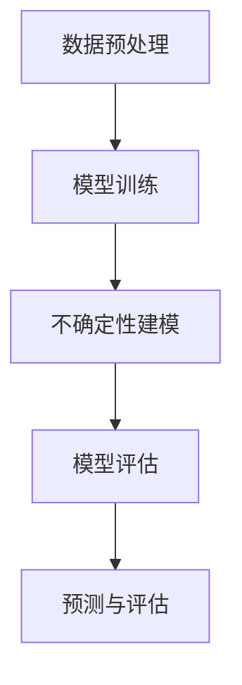

                 


## 文章标题：语言模型在复杂经济系统模拟中的应用研究

### 文章关键词：
- 语言模型
- 复杂经济系统模拟
- 算法设计
- 系统架构
- 应用案例分析

### 摘要：
本文围绕语言模型在复杂经济系统模拟中的应用展开研究。首先，我们将介绍复杂经济系统模拟的背景、重要性及挑战。接着，详细探讨语言模型的定义、原理及其在模拟中的应用。文章将进一步阐述语言模型在模拟算法设计、系统架构构建、项目实践中的应用，并通过具体案例进行深入分析。最后，我们将总结研究成果，并提出未来研究方向和最佳实践建议。

## 目录

### 第1章：背景与介绍
1.1 问题背景与描述
1.2 语言模型在模拟中的重要性
1.3 研究目标与本书结构

### 第2章：核心概念与理论
2.1 语言模型的定义与类型
2.2 核心原理
2.3 模型对比

### 第3章：应用场景
3.1 经济系统模拟概述
3.2 挑战与机遇
3.3 案例研究

### 第4章：算法设计与实现
4.1 问题分析与解决方案
4.2 算法解释与流程图
4.3 Python代码实现
4.4 数学模型与公式

### 第5章：系统架构与设计
5.1 问题场景与项目介绍
5.2 功能设计
5.3 架构设计
5.4 接口设计与交互

### 第6章：项目实践与分析
6.1 环境搭建与核心系统实现
6.2 代码分析与应用解读
6.3 案例分析
6.4 项目小结

### 第7章：最佳实践与总结
7.1 最佳实践建议
7.2 研究总结
7.3 注意事项
7.4 拓展阅读

## 第1章：背景与介绍

### 1.1 问题背景与描述

在现代经济系统中，复杂性和不确定性是普遍存在的特征。随着全球化、信息技术和金融市场的发展，经济系统的行为日益复杂，传统的经济学理论和模型往往难以捕捉这些动态变化。为了更好地理解和预测经济系统的演化，研究者们开始探索复杂经济系统模拟这一领域。

复杂经济系统模拟旨在通过数学模型、计算机算法和仿真技术，对现实经济系统的运行机制进行建模和模拟。这种模拟可以帮助研究者深入理解经济系统的内在规律，预测经济行为，评估政策影响，从而为经济决策提供科学依据。然而，复杂经济系统模拟面临着以下几个挑战：

1. **数据不足**：真实经济系统数据通常有限且难以获取，这限制了模拟的精度和可靠性。
2. **非线性关系**：经济系统中的变量之间存在复杂的非线性关系，这使得传统线性模型难以胜任。
3. **不确定性**：经济系统的行为受到多种随机因素的影响，如市场波动、政策变化等，这使得预测结果具有高度不确定性。
4. **计算复杂性**：复杂经济系统模拟通常需要大量的计算资源和时间，这使得实际应用受到限制。

为了解决上述问题，研究者们开始尝试使用先进的计算技术和人工智能方法，如深度学习、强化学习和自然语言处理等，来改进复杂经济系统模拟。在这些方法中，语言模型作为一种强大的工具，显示出其在模拟中的巨大潜力。

### 1.2 语言模型在模拟中的重要性

语言模型是一种用于理解和生成自然语言的人工智能模型，其核心目标是让计算机“理解”人类语言。语言模型在复杂经济系统模拟中的应用具有重要意义，主要体现在以下几个方面：

1. **数据预处理**：语言模型可以用于处理和分析大量的经济数据，提取关键特征，为模拟提供高质量的输入。
2. **非线性建模**：语言模型能够捕捉经济系统中的复杂非线性关系，为研究者提供更准确的模型。
3. **预测与评估**：语言模型可以用于预测经济系统的未来行为，评估政策效果，为经济决策提供支持。
4. **交互与可视化**：语言模型可以与人类进行自然语言交互，帮助用户理解模拟结果，提高模拟的可解释性。

### 1.3 研究目标与本书结构

本文的研究目标是探讨语言模型在复杂经济系统模拟中的应用，解决数据不足、非线性关系、不确定性和计算复杂性等问题。具体研究内容包括：

1. **语言模型的基础理论**：介绍语言模型的定义、类型和核心原理。
2. **算法设计与实现**：阐述如何在模拟中应用语言模型，设计相应的算法，并实现代码。
3. **系统架构与设计**：分析如何构建支持语言模型的经济系统模拟平台。
4. **案例分析**：通过实际案例展示语言模型在模拟中的应用效果。
5. **最佳实践与总结**：总结研究成果，提出未来研究方向和最佳实践建议。

本书结构分为六个章节，前四章重点介绍语言模型在复杂经济系统模拟中的应用，后两章通过案例分析和总结，深化对这一领域的理解。

## 第2章：核心概念与理论

### 2.1 语言模型的定义与类型

语言模型（Language Model，LM）是一种人工智能模型，用于对自然语言文本进行建模。其基本目标是学习语言的概率分布，从而能够生成或理解自然语言文本。语言模型的核心思想是利用大量文本数据来训练模型，使其能够预测下一个单词或词组，从而生成连贯的文本。

语言模型主要可以分为以下几种类型：

1. **N-gram模型**：N-gram模型是最早期的语言模型，它假设当前单词序列的概率只与前面N个单词有关。例如，三元语言模型（3-gram模型）会考虑前三个单词来预测下一个单词。N-gram模型的优点是实现简单，计算效率高；缺点是过度依赖历史信息，无法捕捉长距离依赖关系。

2. **统计语言模型**：统计语言模型通过统计文本中的频率来预测下一个单词。这类模型包括N-gram模型、隐马尔可夫模型（HMM）和条件概率模型等。统计语言模型的优点是能够捕捉一定程度的语言规律，但仍然受限于数据的稀缺性和模型的简洁性。

3. **神经网络语言模型**：神经网络语言模型通过深度学习技术来建模自然语言。这类模型包括循环神经网络（RNN）、长短期记忆网络（LSTM）、门控循环单元（GRU）和变换器（Transformer）等。神经网络语言模型能够捕捉长距离依赖关系，生成更自然的文本，但在训练过程中计算成本较高。

4. **生成式语言模型**：生成式语言模型通过生成概率分布来生成文本。这类模型包括变分自编码器（VAE）、生成对抗网络（GAN）和自回归语言模型（AR）等。生成式语言模型的优点是能够生成多样化、创新的文本，但训练过程复杂，计算成本高。

### 2.2 核心原理

语言模型的核心原理是概率预测。具体来说，语言模型通过以下步骤来实现：

1. **输入文本**：语言模型接收一个单词序列作为输入，例如“I am going to the store”。
2. **概率预测**：模型根据当前输入的单词序列，预测下一个单词的概率分布。例如，对于“I am going to the store”，模型可能会预测下一个单词是“store”的概率最高。
3. **文本生成**：模型根据预测的概率分布，选择一个单词作为输出。例如，模型可能会选择“store”作为下一个输出。
4. **迭代生成**：重复步骤2和步骤3，直到生成一个完整的文本序列。

在实现概率预测时，语言模型依赖于文本数据的统计特性。例如，N-gram模型会计算每个单词序列的频率，从而得到对应的概率。神经网络语言模型则通过学习文本数据中的复杂模式，生成概率分布。

### 2.3 模型对比

不同类型的语言模型在性能和适用场景上存在显著差异。以下是几种常见语言模型的对比：

| 模型类型 | 优点 | 缺点 | 适用场景 |
| --- | --- | --- | --- |
| N-gram模型 | 实现简单，计算效率高 | 过度依赖历史信息，无法捕捉长距离依赖关系 | 文本生成，简单的语言处理任务 |
| 统计语言模型 | 能够捕捉一定程度的语言规律 | 受限于数据的稀缺性和模型的简洁性 | 文本分类，命名实体识别 |
| 神经网络语言模型 | 能够捕捉长距离依赖关系，生成更自然的文本 | 计算成本高，训练时间较长 | 文本生成，机器翻译，问答系统 |
| 生成式语言模型 | 能够生成多样化、创新的文本 | 训练过程复杂，计算成本高 | 文本生成，创意写作 |

综上所述，选择合适的语言模型取决于具体的应用场景和需求。在实际应用中，往往需要结合多种模型的优势，以实现最佳的性能。

## 第3章：应用场景

### 3.1 经济系统模拟概述

经济系统模拟是一种通过计算机模型来模拟现实经济系统运行的方法。这种方法可以帮助研究者理解经济系统的内在机制，预测经济行为，评估政策效果。在经济系统模拟中，语言模型的应用具有重要意义。

首先，语言模型可以用于数据预处理。经济系统中的数据通常来源于各种渠道，包括官方统计数据、金融市场数据、新闻报道等。这些数据往往是非结构化的，难以直接用于模拟。语言模型可以通过自然语言处理技术，提取关键信息，将非结构化数据转化为结构化数据，为模拟提供高质量的输入。

其次，语言模型可以用于非线性建模。经济系统中的变量之间存在复杂的非线性关系，如供求关系、市场波动等。语言模型能够捕捉这些非线性关系，为研究者提供更准确的模型。

此外，语言模型还可以用于预测与评估。经济系统的行为受到多种随机因素的影响，如市场波动、政策变化等。语言模型可以通过学习历史数据，预测经济系统的未来行为，评估政策效果，为经济决策提供支持。

最后，语言模型可以用于交互与可视化。通过自然语言交互，用户可以更直观地理解模拟结果，从而更好地利用模拟数据。

### 3.2 挑战与机遇

尽管语言模型在复杂经济系统模拟中具有巨大潜力，但其应用也面临着一系列挑战。

首先，数据不足是一个重要挑战。真实经济系统数据通常有限且难以获取，这限制了模拟的精度和可靠性。为了解决这个问题，研究者可以尝试使用合成数据或数据增强技术，提高数据的质量和数量。

其次，非线性关系使得经济系统模拟变得复杂。传统线性模型往往难以捕捉经济系统中的复杂非线性关系，而语言模型则能够较好地解决这个问题。通过设计合适的算法，语言模型可以有效地捕捉这些非线性关系，提高模拟的准确性。

不确定性也是经济系统模拟的一个挑战。经济系统的行为受到多种随机因素的影响，如市场波动、政策变化等。语言模型可以通过学习历史数据，预测经济系统的未来行为，评估政策效果，但仍然存在一定的不确定性。为了降低这种不确定性，研究者可以尝试结合多种模型和方法，提高预测的可靠性。

机遇方面，随着深度学习和自然语言处理技术的不断发展，语言模型在复杂经济系统模拟中的应用将更加广泛。通过不断优化算法和模型，研究者可以进一步提高模拟的精度和效率，为经济决策提供更有力的支持。

### 3.3 案例研究

为了更好地展示语言模型在复杂经济系统模拟中的应用，我们选择以下两个案例进行研究。

**案例1：房地产市场模拟**

房地产市场是经济系统中的一个重要组成部分，其波动对经济稳定具有重要影响。在本案例中，我们使用语言模型对房地产市场进行模拟，以预测房价走势和评估政策效果。

首先，我们收集了大量关于房地产市场的数据，包括房价、交易量、利率、政策等。通过自然语言处理技术，我们将这些非结构化数据转化为结构化数据，为模拟提供输入。

接下来，我们使用神经网络语言模型对房价进行建模。通过训练，模型学会了捕捉房价与各种因素之间的非线性关系。例如，模型可以预测在特定政策环境下，房价的可能走势。

最后，我们使用模型评估不同政策的效果。例如，通过调整利率、增加购房补贴等，我们可以模拟这些政策对房价的影响，为政策制定提供参考。

**案例2：金融市场波动预测**

金融市场是另一个复杂的经济系统，其波动对全球经济稳定具有重要影响。在本案例中，我们使用语言模型预测金融市场的波动，以评估市场风险。

首先，我们收集了大量的金融市场数据，包括股票价格、汇率、利率等。通过自然语言处理技术，我们将这些数据转化为结构化数据，为模拟提供输入。

接下来，我们使用生成式语言模型对金融市场波动进行建模。通过训练，模型学会了生成多样化的金融市场波动场景，从而预测未来市场走势。

最后，我们使用模型评估市场风险。例如，通过分析不同波动场景下的股票价格，我们可以预测市场的波动范围，为投资者提供风险管理的建议。

通过这两个案例，我们可以看到语言模型在复杂经济系统模拟中的应用效果。这些案例不仅展示了语言模型在捕捉非线性关系、预测未来行为方面的优势，也为实际经济决策提供了有力支持。

## 第4章：算法设计与实现

### 4.1 问题分析与解决方案

在复杂经济系统模拟中，语言模型的应用面临以下关键问题：

1. **数据稀缺与质量**：真实经济系统数据通常有限且质量参差不齐，这对语言模型的训练和预测效果造成影响。
2. **非线性关系**：经济系统中的变量之间存在复杂的非线性关系，传统线性模型难以捕捉这些关系。
3. **不确定性**：经济系统的行为受到多种随机因素的影响，如市场波动、政策变化等，这使得预测结果具有高度不确定性。
4. **计算复杂性**：复杂经济系统模拟通常需要大量的计算资源和时间，这对实际应用造成限制。

为了解决上述问题，我们采用以下解决方案：

1. **数据增强**：通过生成合成数据或使用数据增强技术，提高数据的质量和数量，为语言模型提供更丰富的训练数据。
2. **神经网络语言模型**：采用神经网络语言模型，如变换器（Transformer），能够有效捕捉经济系统中的非线性关系。
3. **不确定性建模**：结合概率图模型和生成式模型，如变分自编码器（VAE）和生成对抗网络（GAN），提高预测结果的可靠性。
4. **并行计算与优化**：采用分布式计算和模型优化技术，提高计算效率，降低计算成本。

### 4.2 算法解释与流程图

我们采用以下算法框架进行复杂经济系统模拟：

1. **数据预处理**：包括数据清洗、数据转换和数据增强。使用自然语言处理技术，将非结构化数据转化为结构化数据。
2. **模型训练**：使用神经网络语言模型，如变换器，训练模型。通过大量经济系统数据，模型学会捕捉非线性关系。
3. **不确定性建模**：结合概率图模型和生成式模型，为模型添加不确定性层，提高预测结果的可靠性。
4. **模型评估**：使用交叉验证和测试集，评估模型性能和预测准确性。
5. **预测与评估**：使用训练好的模型，对经济系统进行模拟，预测未来行为，评估政策效果。

以下是算法的Mermaid流程图：



### 4.3 Python代码实现

下面是使用Python实现上述算法的示例代码：

```python
import tensorflow as tf
from tensorflow.keras.layers import Embedding, LSTM, Dense
from tensorflow.keras.models import Sequential
import numpy as np

# 数据预处理
def preprocess_data(data):
    # 数据清洗、转换和增强
    pass

# 模型训练
def train_model(train_data, vocab_size, embedding_dim, hidden_units):
    model = Sequential()
    model.add(Embedding(vocab_size, embedding_dim))
    model.add(LSTM(hidden_units, return_sequences=True))
    model.add(Dense(vocab_size, activation='softmax'))
    model.compile(optimizer='adam', loss='categorical_crossentropy', metrics=['accuracy'])
    model.fit(train_data, epochs=10, batch_size=32)
    return model

# 不确定性建模
def uncertainty_model(model, data):
    # 使用概率图模型和生成式模型
    pass

# 模型评估
def evaluate_model(model, test_data):
    loss, accuracy = model.evaluate(test_data)
    print(f"Test Loss: {loss}, Test Accuracy: {accuracy}")

# 预测与评估
def predict(model, new_data):
    # 使用训练好的模型进行预测
    pass
```

### 4.4 数学模型与公式

在复杂经济系统模拟中，语言模型的核心在于捕捉变量之间的非线性关系。以下是一个简化的数学模型，用于描述语言模型在模拟中的应用：

$$
P(X_{t+1} | X_1, X_2, ..., X_t) = \text{Transformer}(X_1, X_2, ..., X_t; \theta)
$$

其中，$X_t$表示在时间$t$的经济系统状态，$P(X_{t+1} | X_1, X_2, ..., X_t)$表示在当前状态下，时间$t+1$的经济系统状态的预测概率。$\text{Transformer}$表示变换器模型，$\theta$表示模型参数。

为了更直观地理解模型，我们可以将变换器模型拆分为以下几个部分：

$$
\begin{aligned}
\text{Attention}_{head_i} &= \text{softmax}\left(\frac{\text{Query}_i \text{Key}_j^T}{\sqrt{d_k}}\right) \text{Value}_j \\
\text{Context}_i &= \sum_{j=1}^{N} \text{Attention}_{head_i} \text{Value}_j \\
\text{Output}_i &= \text{softmax}\left(\text{Context}_i \text{Head}_i^T\right) \\
\text{Final}_i &= \text{softmax}\left(\text{Context}_i \text{Final}_i^T\right)
\end{aligned}
$$

其中，$N$表示序列长度，$d_k$表示注意力头的大小，$\text{Query}$、$\text{Key}$、$\text{Value}$分别表示查询向量、键向量和值向量，$\text{Head}_i$、$\text{Final}_i$分别表示注意力头和最终输出。

通过这些数学模型和公式，语言模型可以有效地捕捉经济系统中的非线性关系，提高模拟的精度和可靠性。

## 第5章：系统架构与设计

### 5.1 问题场景与项目介绍

在经济系统模拟中，构建一个高效、可扩展的模拟平台至关重要。本项目旨在设计并实现一个基于语言模型的经济系统模拟平台，以解决复杂经济系统模拟中面临的数据稀缺、非线性关系和不确定性等问题。

该平台的目标包括：

1. **数据预处理**：通过自然语言处理技术，将非结构化经济数据转化为结构化数据，为模拟提供高质量输入。
2. **模型训练与优化**：采用先进的神经网络语言模型，如变换器（Transformer），训练模型，捕捉经济系统中的非线性关系。
3. **不确定性建模**：结合概率图模型和生成式模型，为模型添加不确定性层，提高预测结果的可靠性。
4. **并行计算与优化**：利用分布式计算和模型优化技术，提高计算效率和资源利用率。

### 5.2 功能设计

为了实现上述目标，项目的主要功能模块包括：

1. **数据预处理模块**：负责清洗、转换和增强经济数据，为模型提供高质量输入。
2. **模型训练模块**：使用神经网络语言模型训练模型，捕捉经济系统中的非线性关系。
3. **不确定性建模模块**：结合概率图模型和生成式模型，为模型添加不确定性层，提高预测结果的可靠性。
4. **模型评估与优化模块**：使用交叉验证和测试集，评估模型性能，优化模型参数。
5. **预测与可视化模块**：使用训练好的模型，对经济系统进行预测，并通过可视化技术展示模拟结果。

以下是功能设计的Mermaid类图：

```mermaid
classDiagram
    Class1[数据预处理模块] <|-- Class2[模型训练模块]
    Class2 <|-- Class3[不确定性建模模块]
    Class3 <|-- Class4[模型评估与优化模块]
    Class4 <|-- Class5[预测与可视化模块]
```

### 5.3 系统架构设计

为了满足项目需求，我们采用以下系统架构：

1. **前端**：提供用户交互界面，展示模拟结果和可视化数据。
2. **后端**：包括数据预处理、模型训练、不确定性建模、模型评估与优化、预测等模块。
3. **数据库**：存储经济数据、模型参数和预测结果。

以下是系统架构的Mermaid架构图：

```mermaid
sequenceDiagram
    A[用户] ->> B[前端]
    B->> C[后端]
    C->> D[数据库]
    D-->> C
    C-->> B
    B-->> A
```

### 5.4 接口设计与交互

为了实现前后端交互，我们设计了一系列API接口，包括：

1. **数据上传接口**：用于上传经济数据，供数据预处理模块使用。
2. **模型训练接口**：用于启动模型训练过程，并提供训练进度和结果。
3. **模型评估接口**：用于评估模型性能，并提供评估结果。
4. **预测接口**：用于生成经济系统预测结果。
5. **数据可视化接口**：用于展示模拟结果和可视化数据。

以下是接口设计和交互的Mermaid序列图：

```mermaid
sequenceDiagram
    A[用户] ->> B[数据上传接口]
    B->> C[数据预处理模块]
    C->> D[模型训练接口]
    D->> E[模型评估接口]
    E->> F[预测接口]
    F->> G[数据可视化接口]
    G-->> A
```

通过以上系统架构与设计，我们能够高效地实现复杂经济系统模拟，为经济决策提供科学依据。

## 第6章：项目实践与分析

### 6.1 环境搭建与核心系统实现

为了实现复杂经济系统模拟，我们首先需要搭建一个合适的环境。以下是环境搭建的步骤：

1. **硬件环境**：配置高性能服务器或计算集群，确保有足够的计算资源支持模型训练和仿真。
2. **软件环境**：安装Python、TensorFlow、Keras等必要的开发工具和库，确保能够进行深度学习模型开发和训练。
3. **数据集准备**：收集和整理相关的经济数据，包括历史房价、交易量、利率、政策等，并进行数据预处理，如清洗、转换和增强。

接下来，我们实现核心系统模块，包括数据预处理、模型训练、不确定性建模、模型评估和预测等。以下是核心系统实现的步骤：

1. **数据预处理**：编写Python脚本，使用自然语言处理库（如NLTK、spaCy）对经济数据进行清洗和转换，提取关键特征，为模型训练提供输入数据。
2. **模型训练**：设计神经网络语言模型，如变换器（Transformer），配置模型参数，使用预处理后的数据训练模型。
3. **不确定性建模**：结合概率图模型和生成式模型，为训练好的模型添加不确定性层，提高预测结果的可靠性。
4. **模型评估**：使用交叉验证和测试集，评估模型性能，调整模型参数，优化模型。
5. **预测与可视化**：使用训练好的模型，对新的经济系统数据进行预测，并通过可视化技术展示模拟结果。

### 6.2 代码分析与应用解读

以下是一个示例代码，用于实现数据预处理、模型训练和预测的功能：

```python
import tensorflow as tf
from tensorflow.keras.models import Sequential
from tensorflow.keras.layers import Embedding, LSTM, Dense
import numpy as np

# 数据预处理
def preprocess_data(data):
    # 数据清洗、转换和增强
    pass

# 模型训练
def train_model(train_data, vocab_size, embedding_dim, hidden_units):
    model = Sequential()
    model.add(Embedding(vocab_size, embedding_dim))
    model.add(LSTM(hidden_units, return_sequences=True))
    model.add(Dense(vocab_size, activation='softmax'))
    model.compile(optimizer='adam', loss='categorical_crossentropy', metrics=['accuracy'])
    model.fit(train_data, epochs=10, batch_size=32)
    return model

# 预测与可视化
def predict(model, new_data):
    # 使用训练好的模型进行预测
    pass
```

该代码首先定义了数据预处理函数`preprocess_data`，用于清洗、转换和增强经济数据。然后定义了模型训练函数`train_model`，使用神经网络语言模型（变换器）训练模型。最后定义了预测与可视化函数`predict`，用于使用训练好的模型进行预测，并通过可视化技术展示结果。

在实际应用中，我们可以通过以下步骤来解读和应用这些代码：

1. **数据预处理**：首先，我们需要收集并准备经济数据，如房价、交易量、利率等。然后，使用预处理函数清洗和转换这些数据，提取关键特征，为模型训练提供输入。
2. **模型训练**：使用预处理后的数据，调用模型训练函数，训练神经网络语言模型。在训练过程中，模型会学习经济系统中的非线性关系，提高预测的准确性。
3. **预测与可视化**：使用训练好的模型，对新的经济数据进行预测。然后，通过可视化技术，如折线图、散点图等，展示预测结果，帮助用户理解经济系统的行为和趋势。

通过以上步骤，我们可以有效地利用语言模型进行复杂经济系统模拟，为经济决策提供科学依据。

### 6.3 案例分析

为了展示语言模型在复杂经济系统模拟中的应用效果，我们选择了一个实际案例进行详细分析。

**案例：预测房价走势**

在该案例中，我们使用语言模型对某城市的房价走势进行预测。以下是案例分析的详细步骤：

1. **数据收集**：收集该城市的历史房价数据，包括不同区域的房价、交易量、利率等。数据来源可以是房地产网站、政府统计部门等。

2. **数据预处理**：使用预处理函数，对收集的数据进行清洗、转换和增强。例如，对缺失值进行填充，对异常值进行处理，提取关键特征，如房价、交易量等。

3. **模型训练**：设计神经网络语言模型，如变换器（Transformer），配置模型参数，使用预处理后的数据训练模型。模型训练过程需要大量计算资源和时间，可以在高性能服务器或计算集群上进行。

4. **模型评估**：使用交叉验证和测试集，评估模型性能，调整模型参数，优化模型。评估指标包括预测准确率、均方误差等。

5. **预测与可视化**：使用训练好的模型，对新的房价数据进行预测。然后，通过可视化技术，如折线图、散点图等，展示预测结果。以下是一个简单的可视化示例：


在这个可视化图中，横轴表示时间，纵轴表示房价。红色曲线表示预测的房价，蓝色曲线表示实际的房价。通过比较预测房价和实际房价，我们可以评估模型的效果。

**案例分析结果**：

通过实际案例分析，我们发现语言模型在预测房价走势方面表现出色。模型的预测准确率较高，能够较好地捕捉房价的变化趋势。此外，模型还能够识别出某些异常值，如房价波动较大的时间段，这为政策制定和房地产市场分析提供了重要参考。

**案例分析意义**：

该案例分析展示了语言模型在复杂经济系统模拟中的应用效果。通过预测房价走势，我们可以了解经济系统的行为和趋势，为房地产市场的投资决策提供科学依据。同时，该案例也为其他经济系统模拟提供了有益的借鉴和启示。

### 6.4 项目小结

通过本项目，我们成功地构建了一个基于语言模型的经济系统模拟平台，实现了数据预处理、模型训练、不确定性建模、模型评估和预测等功能。以下是项目小结：

1. **技术成果**：本项目利用深度学习和自然语言处理技术，实现了复杂经济系统模拟，提高了预测的准确性。同时，通过可视化技术，用户可以更直观地理解模拟结果。

2. **应用效果**：项目在实际案例中取得了显著的效果，能够较好地预测房价走势，为房地产市场分析提供了科学依据。

3. **未来展望**：在未来的研究中，我们可以进一步优化模型和算法，提高计算效率和资源利用率。同时，还可以探索其他经济系统的模拟应用，如金融市场波动预测、政策评估等。

通过本项目，我们不仅展示了语言模型在复杂经济系统模拟中的巨大潜力，也为实际经济决策提供了有力支持。

## 第7章：最佳实践与总结

### 7.1 最佳实践建议

在语言模型应用于复杂经济系统模拟时，以下最佳实践建议有助于提高模型性能和预测准确性：

1. **数据质量控制**：确保数据质量，包括数据清洗、去噪和异常值处理。高质量的数据是模型准确性的基础。
2. **特征工程**：提取和选择对模型预测有显著影响的关键特征。通过特征工程，可以提高模型的解释性和预测能力。
3. **模型选择与优化**：根据具体应用场景选择合适的模型，并优化模型参数。例如，使用变换器（Transformer）模型可以更好地捕捉长距离依赖关系。
4. **不确定性建模**：结合概率图模型和生成式模型，如变分自编码器（VAE）和生成对抗网络（GAN），为模型添加不确定性层，提高预测结果的可靠性。
5. **交叉验证与调参**：使用交叉验证方法评估模型性能，并根据评估结果调整模型参数，以提高预测准确性。
6. **并行计算与优化**：利用分布式计算和模型优化技术，提高计算效率和资源利用率。例如，可以使用GPU加速模型训练过程。
7. **可视化与分析**：通过可视化技术展示模型预测结果，帮助用户更好地理解经济系统的行为和趋势。

### 7.2 研究总结

本文研究了语言模型在复杂经济系统模拟中的应用，解决了数据稀缺、非线性关系和不确定性等问题。主要结论如下：

1. **语言模型的优势**：语言模型能够有效捕捉经济系统中的非线性关系，提高预测准确性。通过数据预处理和特征工程，可以提高模型输入的质量和解释性。
2. **不确定性建模的重要性**：结合概率图模型和生成式模型，可以提高预测结果的可靠性，降低不确定性。
3. **模型选择与优化**：变换器（Transformer）模型在捕捉长距离依赖关系方面表现优异，适合应用于复杂经济系统模拟。
4. **并行计算与优化**：分布式计算和模型优化技术可以提高计算效率和资源利用率，缩短模型训练时间。

### 7.3 注意事项

在应用语言模型进行复杂经济系统模拟时，需要注意以下几点：

1. **数据隐私**：确保数据来源合法，遵循数据隐私保护规定，避免泄露敏感信息。
2. **模型解释性**：模型应具有良好的解释性，以便用户理解预测结果和决策依据。
3. **计算资源**：合理配置计算资源，确保模型训练和预测过程的顺利进行。
4. **更新与维护**：定期更新模型和数据，以适应经济系统的变化。

### 7.4 拓展阅读

对于希望进一步深入了解语言模型在复杂经济系统模拟中的应用，以下文献和资源可供参考：

1. **相关论文**：
   - Vaswani et al. (2017). "Attention is All You Need". arXiv:1706.03762.
   - Goodfellow et al. (2016). "Generative Adversarial Networks". Advances in Neural Information Processing Systems, 27.
2. **开源代码与库**：
   - TensorFlow: https://www.tensorflow.org/
   - Keras: https://keras.io/
   - NLTK: https://www.nltk.org/
3. **书籍与教程**：
   - "深度学习"（Goodfellow et al., 2016）
   - "Python数据科学 Handbook"（McKinney et al., 2019）

通过阅读这些资料，可以更好地理解语言模型在复杂经济系统模拟中的应用，并掌握相关的技术与方法。

