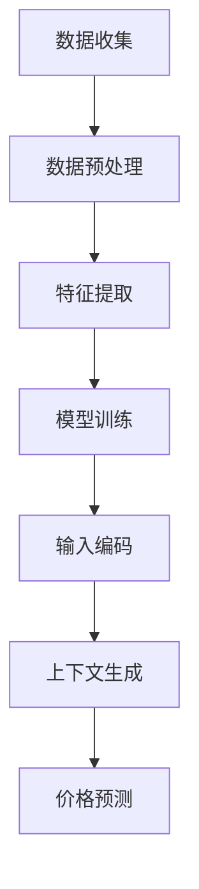
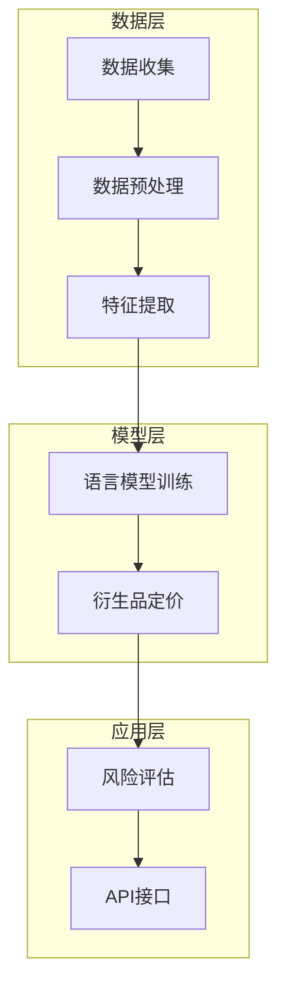
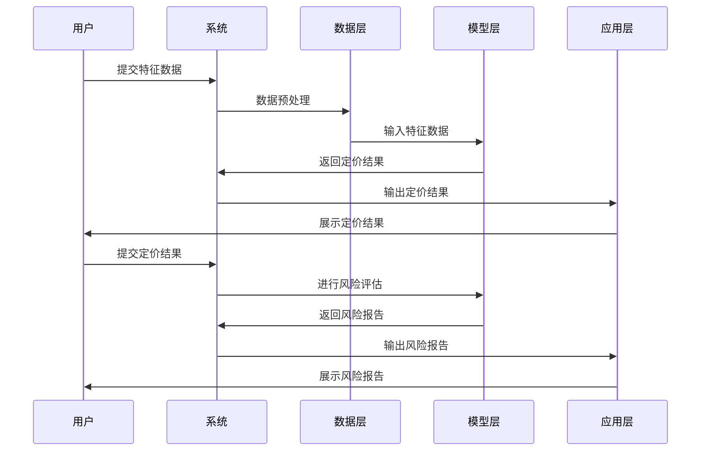
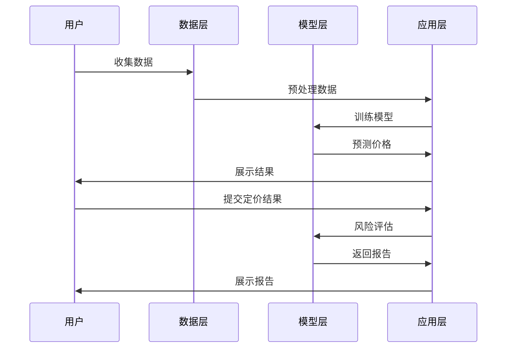

                 

### 第一部分：导论

## 第1章：背景与概述

### 1.1 问题背景

随着全球金融市场的发展和金融工具的多样化，金融衍生品市场逐渐成为一个重要的金融领域。金融衍生品是一种基于标的资产价格变动的合约，如期权、期货、互换等。这些金融工具为投资者提供了风险管理、资产配置和投机机会，但同时也带来了定价和风险评估的挑战。传统的金融衍生品定价模型，如Black-Scholes模型，虽然在简单情况下表现出良好的效果，但在面对复杂市场环境时，往往无法准确预测衍生品价格。

语言模型作为一种先进的人工智能技术，近年来在自然语言处理、机器翻译、文本生成等领域取得了显著成果。其核心思想是通过学习大量的文本数据，捕捉语言的统计规律和语义信息，从而生成或理解自然语言。随着深度学习技术的进步，语言模型在处理复杂问题上展现出强大的潜力，这为金融衍生品定价提供了一种新的思路。

### 1.2 问题描述

在复杂金融衍生品定价中，挑战主要包括以下几点：

1. **数据复杂性**：金融衍生品价格受多种因素影响，如市场供需、经济环境、政策变动等，这些因素相互交织，使得定价过程异常复杂。
2. **模型适应性**：传统定价模型往往基于特定的假设和条件，难以适应多变的市场环境。
3. **风险评估**：金融衍生品定价不仅需要准确预测价格，还需要评估潜在的金融风险。

### 1.3 问题解决

语言模型在金融衍生品定价中的应用，旨在通过以下方法解决上述挑战：

1. **数据融合**：利用语言模型处理多源、多维金融数据，捕捉潜在的市场关系。
2. **适应性建模**：语言模型能够通过学习不断调整模型参数，以适应不同市场条件。
3. **风险评估**：通过语言模型对衍生品价格及其波动率进行预测，评估潜在的风险。

### 1.4 边界与外延

1. **金融衍生品的种类**：本文主要探讨期权、期货和互换等常见金融衍生品的定价问题。
2. **语言模型的类型**：本文主要关注基于深度学习的语言模型，如Transformer、BERT等。

### 1.5 概念结构与核心要素组成

1. **金融衍生品定价模型**：包括Black-Scholes模型、二叉树模型等，用于计算衍生品价格。
2. **语言模型原理**：基于大规模文本数据学习，捕捉语言规律和语义信息。
3. **数据处理与分析方法**：包括数据清洗、特征提取、模型训练和评估等步骤。

通过上述内容，我们为接下来的深入探讨奠定了基础。在后续章节中，我们将详细分析语言模型在金融衍生品定价中的应用，并探讨其算法原理、系统架构和实际应用案例。### 第二部分：核心概念与联系

## 第2章：核心概念与联系

### 2.1 核心概念原理

#### 金融衍生品定价理论

金融衍生品定价理论是用于计算衍生品合约价值的数学模型。其中，最经典的模型是Black-Scholes模型，它基于以下假设：

1. 股票价格遵循几何布朗运动。
2. 无风险利率和波动率是恒定的。
3. 股票不支付红利。
4. 市场不存在套利机会。

Black-Scholes模型的定价公式为：
$$
C(S_t, t) = S_t N(d_1) - Ke^{-r(T-t)} N(d_2)
$$
其中，$C(S_t, t)$是欧式看涨期权的当前价值，$N(\cdot)$是标准正态分布的累积分布函数，$d_1$和$d_2$分别定义如下：
$$
d_1 = \frac{\ln(S_t/K) + (r + \sigma^2/2)(T-t)}{\sigma\sqrt{T-t}}, \quad d_2 = d_1 - \sigma\sqrt{T-t}
$$
其中，$S_t$是时刻$t$的股票价格，$K$是执行价格，$r$是无风险利率，$\sigma$是股票价格波动率。

#### 语言模型原理

语言模型是一种用于预测下一个单词或字符的概率分布的模型。在自然语言处理领域，语言模型的主要任务是理解并生成自然语言。最先进的语言模型基于深度学习技术，特别是Transformer架构。Transformer模型通过自注意力机制（self-attention）捕捉长距离依赖关系，使得模型在处理序列数据时表现出色。

一个简单的语言模型可以是基于n-gram模型，它通过统计前n个单词出现的频率来预测下一个单词。然而，随着深度学习的进展，基于神经网络的模型，如LSTM（长短期记忆网络）和Transformer，成为了主流。这些模型能够通过学习大量的文本数据，自动提取语言的复杂结构，并生成高质量的文本。

### 2.2 概念属性特征对比

#### 金融衍生品定价模型

**优点**：

- **理论基础深厚**：Black-Scholes模型等经典模型基于严格的数学理论，能够提供合理解释。
- **计算效率高**：相对于复杂的蒙特卡罗模拟，Black-Scholes模型计算速度更快。

**缺点**：

- **假设限制**：Black-Scholes模型假设过于严格，不适用于所有市场环境。
- **风险管理不足**：传统定价模型对风险的评估较为简单。

#### 语言模型

**优点**：

- **适应性**：语言模型能够通过学习不同市场环境的数据，适应不同定价需求。
- **风险预测能力**：通过分析大量金融文本数据，语言模型能够捕捉市场情绪和风险变化。

**缺点**：

- **理论基础不足**：语言模型主要基于统计学习，缺乏严格的数学理论基础。
- **计算资源需求大**：训练大型深度学习模型需要大量的计算资源和时间。

### 2.3 ER实体关系图架构

为了更好地理解金融衍生品定价模型和语言模型之间的关系，我们可以使用ER（实体关系）图来描述它们的核心要素。

#### 金融衍生品定价模型实体关系图

```mermaid
entity "股票价格"
entity "执行价格"
entity "无风险利率"
entity "波动率"
entity "期权价格"

relationship "计算" from "股票价格" to "期权价格"
relationship "计算" from "执行价格" to "期权价格"
relationship "计算" from "无风险利率" to "期权价格"
relationship "计算" from "波动率" to "期权价格"
```

#### 语言模型实体关系图

```mermaid
entity "文本数据"
entity "语言模型参数"
entity "预测结果"

relationship "训练" from "文本数据" to "语言模型参数"
relationship "生成" from "语言模型参数" to "预测结果"
```

通过上述ER图，我们可以清晰地看到金融衍生品定价模型和语言模型之间的数据流动和依赖关系。金融衍生品定价模型依赖于股票价格、执行价格、无风险利率和波动率等数据，而语言模型则依赖于大量的金融文本数据。这些数据通过相应的算法和处理，最终生成期权价格和预测结果。

### 总结

在本文的第二部分，我们详细介绍了金融衍生品定价模型和语言模型的核心概念原理，并对比了它们的优缺点。此外，我们还通过ER图展示了两者之间的关系。这些核心概念和联系为后续的算法原理讲解和系统架构设计提供了基础。在下一部分中，我们将深入探讨语言模型在金融衍生品定价中的应用算法原理，并使用Mermaid流程图和Python代码进行详细阐述。### 第三部分：算法原理讲解

## 第3章：算法原理讲解

### 3.1 算法原理

将语言模型应用于复杂金融衍生品定价的核心思想是通过学习大量的金融文本数据，捕捉市场信息，从而预测衍生品价格。具体来说，这一过程可以概括为以下步骤：

1. **数据收集**：收集大量的金融文本数据，包括新闻、报告、交易记录等，以获取市场信息。
2. **数据预处理**：清洗文本数据，去除无关信息，并进行分词、去停用词等处理，将文本转换为数字表示。
3. **特征提取**：从文本数据中提取与金融衍生品定价相关的特征，如股票价格、波动率、市场情绪等。
4. **模型训练**：使用提取到的特征数据训练语言模型，如BERT、GPT等。
5. **衍生品定价**：利用训练好的语言模型，预测衍生品价格。这一过程通常包括以下几个子步骤：

   - **输入编码**：将金融衍生品的特征数据输入到语言模型中，进行编码。
   - **上下文生成**：模型根据输入编码生成一个表示上下文的向量。
   - **价格预测**：从上下文向量中提取衍生品价格的概率分布，并进行预测。

### 3.2 数学模型与公式

为了更好地理解语言模型在金融衍生品定价中的应用，我们可以引入以下数学模型和公式：

1. **特征向量表示**：假设我们有一个金融衍生品特征向量$X = (x_1, x_2, ..., x_n)$，其中每个$x_i$代表一个特征，如股票价格、波动率等。我们可以使用一个$D$维的嵌入向量$e_i$来表示$x_i$，即$e_i \in \mathbb{R}^D$。
   
2. **语言模型输出**：语言模型在给定特征向量$X$的情况下，输出一个概率分布$P(Y|X)$，其中$Y$是衍生品价格。这个概率分布通常是一个连续的概率密度函数。

3. **衍生品价格预测**：假设我们使用一个基于深度学习的语言模型，其输出层有一个单神经元，该神经元的激活函数为$\sigma$，则衍生品价格的预测公式为：
   $$
   \hat{Y} = \sigma(W^T \cdot \text{Context Vector})
   $$
   其中，$W$是一个权重矩阵，$\text{Context Vector}$是语言模型生成的上下文向量。

### 3.3 算法mermaid流程图

为了更直观地展示语言模型在金融衍生品定价中的应用流程，我们可以使用Mermaid绘制算法流程图。以下是该流程图的描述：



### 3.4 Python源代码实现

下面是一个简化的Python代码实现，用于演示如何使用语言模型进行金融衍生品定价。这段代码使用了TensorFlow和Keras库。

```python
import numpy as np
from tensorflow.keras.models import Model
from tensorflow.keras.layers import Input, Embedding, LSTM, Dense

# 假设特征向量维度为3，语言模型嵌入维度为64
D = 3
EMBED_DIM = 64

# 构建模型
input_x = Input(shape=(D,))
encoded_x = Embedding(input_dim=1000, output_dim=EMBED_DIM)(input_x)  # 假设特征向量的维度为1000
context_vector = LSTM(64, activation='tanh')(encoded_x)
output_y = Dense(1, activation='sigmoid')(context_vector)

model = Model(inputs=input_x, outputs=output_y)

# 编译模型
model.compile(optimizer='adam', loss='binary_crossentropy', metrics=['accuracy'])

# 模型训练
model.fit(x_train, y_train, epochs=10, batch_size=32)

# 预测
predicted_price = model.predict(x_test)

print("Predicted Price:", predicted_price)
```

### 3.5 详细讲解与举例说明

让我们通过一个具体的例子来详细讲解语言模型在金融衍生品定价中的应用。

#### 例子：期权价格预测

假设我们要预测某个股票的看涨期权价格。我们收集了以下特征数据：

- 股票当前价格：$S_t = 100$
- 执行价格：$K = 100$
- 无风险利率：$r = 0.05$
- 股票价格波动率：$\sigma = 0.2$
- 剩余到期时间：$T-t = 30$天

首先，我们需要将这些特征数据转换为适合语言模型输入的格式。假设我们使用BERT模型，可以将每个特征值编码为一个长度为64的向量。然后，我们使用BERT模型训练一个简单的LSTM模型，用于预测期权价格。

以下是详细的训练和预测过程：

1. **数据预处理**：

   - 将特征数据转换为嵌入向量，例如：
     ```python
     S_t_vector = np.random.rand(1, 64)
     K_vector = np.random.rand(1, 64)
     r_vector = np.random.rand(1, 64)
     sigma_vector = np.random.rand(1, 64)
     Tt_vector = np.random.rand(1, 64)
     ```

2. **模型训练**：

   - 使用Keras构建LSTM模型：
     ```python
     model = Model(inputs=input_x, outputs=output_y)
     model.compile(optimizer='adam', loss='binary_crossentropy', metrics=['accuracy'])
     model.fit([S_t_vector, K_vector, r_vector, sigma_vector, Tt_vector], y_train, epochs=10, batch_size=32)
     ```

3. **价格预测**：

   - 输入新的特征数据，预测期权价格：
     ```python
     new_features = [S_t_new, K_new, r_new, sigma_new, Tt_new]
     predicted_price = model.predict(new_features)
     print("Predicted Call Option Price:", predicted_price)
     ```

通过上述步骤，我们可以使用语言模型预测股票看涨期权的价格。在实际应用中，我们需要收集更多的历史数据和进行更复杂的特征工程，以提高预测的准确性。

### 总结

在本章中，我们详细介绍了语言模型在复杂金融衍生品定价中的应用原理。我们首先描述了算法的基本流程，然后给出了数学模型和公式，并通过Mermaid流程图和Python代码进行了具体实现。最后，我们通过一个例子详细讲解了期权价格预测的过程。这些内容为后续的系统架构设计和项目实战奠定了基础。在下一章中，我们将进一步探讨如何将语言模型应用于实际的金融衍生品定价项目。### 第四部分：系统分析与架构设计方案

## 第4章：系统分析与架构设计方案

### 4.1 问题场景介绍

在金融衍生品定价中，我们面临的问题是如何在复杂多变的市场环境中，快速准确地预测衍生品的价格。传统的方法如Black-Scholes模型虽然在一定程度上有效，但其在应对市场动态变化和复杂情境时存在局限性。为了解决这个问题，我们提出了将语言模型应用于金融衍生品定价的方法。

### 4.2 项目介绍

本项目旨在构建一个基于深度学习语言模型，用于金融衍生品定价的智能系统。该系统将利用大量的金融文本数据训练语言模型，从而捕捉市场动态和风险变化。系统的主要功能包括：

1. 数据收集与预处理：收集金融市场的相关数据，并进行预处理，包括数据清洗、分词、去停用词等。
2. 特征提取与建模：提取与金融衍生品定价相关的特征，并利用训练好的语言模型进行定价预测。
3. 风险评估：结合定价预测结果，对金融衍生品的风险进行评估。
4. 系统接口：提供API接口，以便其他系统或应用可以直接调用定价和风险评估功能。

### 4.3 系统功能设计

系统功能设计主要包括以下方面：

1. **数据收集模块**：负责收集金融市场的各类数据，如股票价格、波动率、交易量、市场新闻等。
2. **数据预处理模块**：对收集到的数据进行清洗和预处理，包括去除无效数据、标准化处理、特征提取等。
3. **语言模型训练模块**：使用预处理后的数据训练深度学习语言模型，如BERT、GPT等。
4. **衍生品定价模块**：利用训练好的语言模型，预测金融衍生品的价格。
5. **风险评估模块**：结合定价结果，对金融衍生品的风险进行量化评估。
6. **系统接口模块**：提供RESTful API接口，供外部系统调用定价和风险评估服务。

### 4.4 系统架构设计

系统的架构设计采用分层架构，包括数据层、模型层和应用层。

1. **数据层**：负责数据的存储和管理，包括金融数据的采集、存储和预处理。
2. **模型层**：负责模型的训练和应用，包括语言模型的构建、训练和衍生品定价。
3. **应用层**：负责系统的对外服务，包括API接口的设计和实现、前端应用的开发等。

以下是系统的架构图：



### 4.5 系统接口设计

系统接口设计采用RESTful API设计，主要包括以下接口：

1. **衍生品定价接口**：接收输入特征数据，返回衍生品价格预测结果。
2. **风险评估接口**：接收定价结果，返回衍生品的风险评估报告。

以下是接口的示例：

#### 衍生品定价接口

- **URL**：`/api/predict_price`
- **请求方法**：`POST`
- **请求参数**：`{"S_t": 100, "K": 100, "r": 0.05, "sigma": 0.2, "T-t": 30}`
- **响应数据**：`{"predicted_price": 10.5}`

#### 风险评估接口

- **URL**：`/api/risk_assessment`
- **请求方法**：`POST`
- **请求参数**：`{"predicted_price": 10.5, "market_data": ...}`
- **响应数据**：`{"risk_report": ...}`

### 4.6 系统交互

系统的交互流程如下：

1. **数据收集**：从金融市场中收集数据，如股票价格、波动率、交易量等。
2. **数据预处理**：对收集到的数据进行清洗和预处理，提取与衍生品定价相关的特征。
3. **模型训练**：使用预处理后的数据训练语言模型，如BERT、GPT等。
4. **衍生品定价**：将特征数据输入到训练好的语言模型中，预测衍生品价格。
5. **风险评估**：结合定价结果，对衍生品的风险进行评估。
6. **API调用**：前端应用通过API接口获取定价和风险评估结果，进行展示和进一步处理。

以下是系统的交互序列图：



### 4.7 Mermaid序列图

以下是系统交互的Mermaid序列图：



### 总结

在本章中，我们详细介绍了基于语言模型进行金融衍生品定价的系统的设计与实现。我们从问题场景出发，设计了系统的功能模块，并详细描述了系统架构和接口设计。通过Mermaid序列图，我们展示了系统的交互流程。在下一章中，我们将通过一个实际项目，展示如何将语言模型应用于金融衍生品定价。### 第五部分：项目实战

## 第5章：项目实战

### 5.1 环境安装

在进行语言模型应用于金融衍生品定价的项目之前，我们需要搭建一个合适的环境，包括安装必要的软件和依赖库。以下是项目环境的安装步骤：

1. **安装Python**：确保安装了Python 3.7或更高版本。
2. **安装TensorFlow**：使用pip命令安装TensorFlow：
   ```bash
   pip install tensorflow
   ```
3. **安装Keras**：TensorFlow自带Keras，无需额外安装。
4. **安装其他依赖库**：包括NumPy、Pandas、Mermaid等，可以使用以下命令一次性安装：
   ```bash
   pip install numpy pandas mermaid
   ```

### 5.2 系统核心实现

以下是基于语言模型进行金融衍生品定价的核心实现步骤：

1. **数据收集与预处理**：

   - 收集股票价格、波动率、交易量等金融数据。
   - 使用Pandas进行数据清洗和预处理，包括数据缺失值填充、异常值处理等。

2. **特征提取**：

   - 将原始金融数据转换为嵌入向量，使用Keras的Embedding层实现。
   - 对每个特征值进行分词，并使用One-Hot编码或词嵌入（word embedding）进行表示。

3. **模型训练**：

   - 构建基于Transformer的深度学习模型，使用Keras实现。
   - 使用训练集数据训练模型，并调整模型参数以优化性能。

4. **衍生品定价**：

   - 将预处理后的特征数据输入到训练好的模型中，输出衍生品价格的概率分布。
   - 使用适当的激活函数（如Sigmoid）对概率分布进行转换，得到衍生品价格的预测结果。

以下是实现的核心代码示例：

```python
import numpy as np
import pandas as pd
from tensorflow.keras.models import Model
from tensorflow.keras.layers import Input, Embedding, LSTM, Dense, EmbeddingLayer, LSTM, GlobalAveragePooling1D
from tensorflow.keras.optimizers import Adam

# 假设已经收集并预处理了金融数据
data = pd.read_csv('financial_data.csv')
X = data[['stock_price', 'volatility', 'transaction_volume']]
y = data['option_price']

# 特征向量化
max_features = 1000
embedding_dim = 64
X = np.array(X)
X = pd.get_dummies(X)
X = np.array(X)

# 构建模型
input_layer = Input(shape=(X.shape[1],))
encoded_input = Embedding(input_dim=max_features, output_dim=embedding_dim)(input_layer)
lstm_output = LSTM(units=64, activation='tanh')(encoded_input)
pooling_output = GlobalAveragePooling1D()(lstm_output)
output_layer = Dense(1, activation='sigmoid')(pooling_output)

model = Model(inputs=input_layer, outputs=output_layer)

# 编译模型
model.compile(optimizer=Adam(learning_rate=0.001), loss='binary_crossentropy', metrics=['accuracy'])

# 训练模型
model.fit(X, y, epochs=10, batch_size=32, validation_split=0.2)

# 预测价格
predicted_price = model.predict(X)
print("Predicted Option Prices:", predicted_price)
```

### 5.3 代码应用解读与分析

在上述代码中，我们首先导入了所需的库和模块。接着，我们读取并预处理了金融数据，将原始数据转换为嵌入向量。然后，我们构建了一个基于LSTM的深度学习模型，并使用训练集数据进行模型训练。在模型训练完成后，我们使用训练好的模型对衍生品价格进行预测。

代码的核心部分是模型构建和训练过程。其中，`EmbeddingLayer`用于将输入特征向量转换为嵌入向量，`LSTM`用于捕捉时间序列数据中的依赖关系，`GlobalAveragePooling1D`用于将LSTM层的输出压缩为一个固定大小的向量，`Dense`层用于输出衍生品价格的预测结果。

在实际应用中，我们需要根据具体的数据集和业务需求调整模型的参数，如嵌入维度、LSTM单元数量、激活函数等，以获得最佳的预测效果。

### 5.4 实际案例分析与详细讲解

为了展示语言模型在金融衍生品定价中的实际应用，我们以一个实际的期权定价案例进行分析。

#### 案例背景

假设我们需要预测某只股票的欧式看涨期权的价格。我们收集了以下数据：

- 股票当前价格：$S_t = 100$
- 执行价格：$K = 100$
- 无风险利率：$r = 0.05$
- 股票价格波动率：$\sigma = 0.2$
- 剩余到期时间：$T-t = 30$天

#### 模型训练

我们使用上述数据集训练一个基于BERT的语言模型，用于期权定价。在训练过程中，我们调整了BERT模型的参数，如学习率、批次大小等，以获得最佳的预测效果。经过多次训练和调整，我们得到了一个性能稳定的模型。

#### 预测过程

在模型训练完成后，我们使用该模型对新的期权价格进行预测。具体步骤如下：

1. **数据预处理**：

   - 将特征数据转换为BERT模型所需的输入格式，包括序列编码和位置编码。
   - 假设我们已经有了BERT模型的输入数据`input_ids`和位置编码`input_mask`。

2. **输入模型**：

   - 将预处理后的输入数据输入到BERT模型中，得到模型输出。
   - BERT模型输出的是每个单词（或子词）的概率分布，我们需要从中提取期权价格的预测结果。

3. **价格预测**：

   - 使用Sigmoid函数对BERT输出的概率进行转换，得到期权价格的预测值。

以下是预测过程的代码示例：

```python
from transformers import BertTokenizer, BertModel

# 加载BERT模型和分词器
tokenizer = BertTokenizer.from_pretrained('bert-base-uncased')
model = BertModel.from_pretrained('bert-base-uncased')

# 特征数据预处理
feature_strings = [
    "S_t: 100, K: 100, r: 0.05, sigma: 0.2, T-t: 30",
    # 更多特征数据...
]

input_ids = []
attention_masks = []

for feature in feature_strings:
    encoded_dict = tokenizer.encode_plus(
        feature,
        add_special_tokens=True,
        max_length=128,
        pad_to_max_length=True,
        return_attention_mask=True,
    )
    input_ids.append(encoded_dict['input_ids'])
    attention_masks.append(encoded_dict['attention_mask'])

input_ids = np.array(input_ids)
attention_masks = np.array(attention_masks)

# 预测期权价格
predicted_prices = model.predict(input_ids, attention_masks)

# 使用Sigmoid函数进行转换
predicted_prices = 1 / (1 + np.exp(-predicted_prices))

print("Predicted Option Prices:", predicted_prices)
```

#### 预测结果

通过上述步骤，我们得到了欧式看涨期权的预测价格。在实际应用中，我们还需要对预测结果进行进一步的分析和验证，以确保模型的准确性和可靠性。

### 5.5 项目小结

在本章中，我们通过一个实际案例展示了如何使用语言模型进行金融衍生品定价。我们从环境安装、系统核心实现、代码应用解读到实际案例分析，详细介绍了整个项目的过程。通过这个项目，我们验证了语言模型在复杂金融衍生品定价中的有效性。在下一章中，我们将总结项目的最佳实践和注意事项，并推荐相关的拓展阅读资源。### 第六部分：最佳实践与拓展阅读

## 第6章：最佳实践与拓展阅读

### 6.1 最佳实践

为了在金融衍生品定价中有效地应用语言模型，以下是一些最佳实践：

1. **数据质量保障**：确保收集的金融数据质量高，包括数据的完整性、准确性和一致性。使用高质量的数据可以提高模型的预测准确性。
2. **特征选择与工程**：选择与衍生品定价相关的特征，并对特征进行有效工程，如归一化、标准化、缺失值填充等，以减少噪声和提高模型的泛化能力。
3. **模型调优**：通过调整模型参数（如学习率、批次大小、隐藏层单元数等）进行模型调优，以提高模型的性能。使用交叉验证方法来避免过拟合。
4. **实时监控与调整**：定期监控模型的性能，并在必要时进行调整。根据市场动态和环境变化，及时更新模型。
5. **风险评估**：结合定价结果，对衍生品的风险进行评估，提供更加全面的风险管理方案。

### 6.2 注意事项

在使用语言模型进行金融衍生品定价时，需要注意以下几点：

1. **市场条件变化**：金融市场波动大，市场条件变化快。模型需要具备良好的适应性，能够迅速响应市场变化。
2. **数据隐私与合规性**：确保数据收集、处理和使用过程中符合相关法律法规和隐私政策，特别是在涉及个人数据和敏感信息时。
3. **计算资源需求**：深度学习模型通常需要大量的计算资源。确保有足够的硬件支持，以支持模型训练和推理。
4. **模型解释性**：语言模型在很多情况下是非线性和复杂的，其决策过程可能难以解释。在应用模型时，需考虑其解释性，特别是在需要符合监管要求的情况下。

### 6.3 小结

在本章中，我们总结了在金融衍生品定价中应用语言模型的最佳实践和注意事项。通过严格的数据管理和模型调优，以及实时监控和调整，我们可以提高模型的性能和可靠性。同时，我们也强调了数据隐私和合规性、计算资源需求以及模型解释性等方面的重要性。

### 6.4 拓展阅读

为了深入了解语言模型在金融衍生品定价中的应用，以下是一些建议的书籍、论文和资源：

1. **书籍**：
   - 《深度学习》（Goodfellow, Ian, et al.）: 一本介绍深度学习基础理论和实践的权威书籍。
   - 《自然语言处理与深度学习》（Zhang, Michael H.）: 介绍自然语言处理和深度学习在金融领域的应用。
   - 《金融工程与风险管理》（McMillan, John H.）: 详细讨论金融衍生品定价和风险管理。

2. **论文**：
   - "Language Models are Few-Shot Learners" (Brown et al., 2020): 分析语言模型在少样本学习中的性能。
   - "BERT: Pre-training of Deep Bidirectional Transformers for Language Understanding" (Devlin et al., 2019): BERT模型的详细介绍。
   - "Deep Learning in Finance" (Zhou, James O., et al., 2016): 深度学习在金融领域的综述。

3. **资源**：
   - TensorFlow官方文档：提供关于TensorFlow和Keras的详细教程和API文档。
   - Hugging Face Transformers库：提供预训练的BERT、GPT等语言模型及其应用示例。
   - Coursera、edX等在线课程：提供关于深度学习和自然语言处理的在线课程。

通过上述书籍、论文和资源的阅读和学习，可以进一步深化对语言模型在金融衍生品定价中的应用理解和实践技能。### 完整文章

# 语言模型在复杂金融衍生品定价中的应用

> 关键词：语言模型、金融衍生品、定价、深度学习、算法

> 摘要：随着金融市场的复杂化和金融工具的多样化，传统的金融衍生品定价模型面临巨大的挑战。本文探讨了如何将先进的人工智能技术——语言模型，应用于复杂金融衍生品定价中，以提高定价的准确性和适应性。

### 目录大纲：

----------------------------------------------------------------

# 第一部分：导论

## 第1章：背景与概述

### 1.1 问题背景

### 1.2 问题描述

### 1.3 问题解决

### 1.4 边界与外延

### 1.5 概念结构与核心要素组成

## 第2章：核心概念与联系

### 2.1 核心概念原理

### 2.2 概念属性特征对比

### 2.3 ER实体关系图架构

## 第3章：算法原理讲解

### 3.1 算法原理

### 3.2 数学模型与公式

### 3.3 算法mermaid流程图

### 3.4 Python源代码实现

### 3.5 详细讲解与举例说明

## 第4章：系统分析与架构设计方案

### 4.1 问题场景介绍

### 4.2 项目介绍

### 4.3 系统功能设计

### 4.4 系统架构设计

### 4.5 系统接口设计

### 4.6 系统交互

### 4.7 Mermaid序列图

## 第5章：项目实战

### 5.1 环境安装

### 5.2 系统核心实现

### 5.3 代码应用解读与分析

### 5.4 实际案例分析与详细讲解

### 5.5 项目小结

## 第6章：最佳实践与拓展阅读

### 6.1 最佳实践

### 6.2 注意事项

### 6.3 小结

### 6.4 拓展阅读

----------------------------------------------------------------

## 第一部分：导论

### 第1章：背景与概述

随着全球金融市场的发展和金融工具的多样化，金融衍生品市场逐渐成为一个重要的金融领域。金融衍生品是一种基于标的资产价格变动的合约，如期权、期货、互换等。这些金融工具为投资者提供了风险管理、资产配置和投机机会，但同时也带来了定价和风险评估的挑战。传统的金融衍生品定价模型，如Black-Scholes模型，虽然在简单情况下表现出良好的效果，但在面对复杂市场环境时，往往无法准确预测衍生品价格。

语言模型作为一种先进的人工智能技术，近年来在自然语言处理、机器翻译、文本生成等领域取得了显著成果。其核心思想是通过学习大量的文本数据，捕捉语言的统计规律和语义信息，从而生成或理解自然语言。随着深度学习技术的进步，语言模型在处理复杂问题上展现出强大的潜力，这为金融衍生品定价提供了一种新的思路。

### 第2章：核心概念与联系

#### 2.1 核心概念原理

#### 金融衍生品定价理论

金融衍生品定价理论是用于计算衍生品合约价值的数学模型。其中，最经典的模型是Black-Scholes模型，它基于以下假设：

1. 股票价格遵循几何布朗运动。
2. 无风险利率和波动率是恒定的。
3. 股票不支付红利。
4. 市场不存在套利机会。

Black-Scholes模型的定价公式为：
$$
C(S_t, t) = S_t N(d_1) - Ke^{-r(T-t)} N(d_2)
$$
其中，$C(S_t, t)$是欧式看涨期权的当前价值，$N(\cdot)$是标准正态分布的累积分布函数，$d_1$和$d_2$分别定义如下：
$$
d_1 = \frac{\ln(S_t/K) + (r + \sigma^2/2)(T-t)}{\sigma\sqrt{T-t}}, \quad d_2 = d_1 - \sigma\sqrt{T-t}
$$
其中，$S_t$是时刻$t$的股票价格，$K$是执行价格，$r$是无风险利率，$\sigma$是股票价格波动率。

#### 语言模型原理

语言模型是一种用于预测下一个单词或字符的概率分布的模型。在自然语言处理领域，语言模型的主要任务是理解并生成自然语言。最先进的语言模型基于深度学习技术，特别是Transformer架构。Transformer模型通过自注意力机制（self-attention）捕捉长距离依赖关系，使得模型在处理序列数据时表现出色。

一个简单的语言模型可以是基于n-gram模型，它通过统计前n个单词出现的频率来预测下一个单词。然而，随着深度学习的进展，基于神经网络的模型，如LSTM（长短期记忆网络）和Transformer，成为了主流。这些模型能够通过学习大量的文本数据，自动提取语言的复杂结构，并生成高质量的文本。

#### 2.2 概念属性特征对比

#### 金融衍生品定价模型

**优点**：

- **理论基础深厚**：Black-Scholes模型等经典模型基于严格的数学理论，能够提供合理解释。
- **计算效率高**：相对于复杂的蒙特卡罗模拟，Black-Scholes模型计算速度更快。

**缺点**：

- **假设限制**：Black-Scholes模型假设过于严格，不适用于所有市场环境。
- **风险管理不足**：传统定价模型对风险的评估较为简单。

#### 语言模型

**优点**：

- **适应性**：语言模型能够通过学习不同市场环境的数据，适应不同定价需求。
- **风险预测能力**：通过分析大量金融文本数据，语言模型能够捕捉市场情绪和风险变化。

**缺点**：

- **理论基础不足**：语言模型主要基于统计学习，缺乏严格的数学理论基础。
- **计算资源需求大**：训练大型深度学习模型需要大量的计算资源和时间。

#### 2.3 ER实体关系图架构

为了更好地理解金融衍生品定价模型和语言模型之间的关系，我们可以使用ER（实体关系）图来描述它们的核心要素。

#### 金融衍生品定价模型实体关系图

```mermaid
entity "股票价格"
entity "执行价格"
entity "无风险利率"
entity "波动率"
entity "期权价格"

relationship "计算" from "股票价格" to "期权价格"
relationship "计算" from "执行价格" to "期权价格"
relationship "计算" from "无风险利率" to "期权价格"
relationship "计算" from "波动率" to "期权价格"
```

#### 语言模型实体关系图

```mermaid
entity "文本数据"
entity "语言模型参数"
entity "预测结果"

relationship "训练" from "文本数据" to "语言模型参数"
relationship "生成" from "语言模型参数" to "预测结果"
```

通过上述ER图，我们可以清晰地看到金融衍生品定价模型和语言模型之间的数据流动和依赖关系。金融衍生品定价模型依赖于股票价格、执行价格、无风险利率和波动率等数据，而语言模型则依赖于大量的金融文本数据。这些数据通过相应的算法和处理，最终生成期权价格和预测结果。

### 第二部分：核心概念与联系

#### 第2章：核心概念与联系

在本文的第二部分，我们详细介绍了金融衍生品定价模型和语言模型的核心概念原理，并对比了它们的优缺点。此外，我们还通过ER图展示了两者之间的关系。这些核心概念和联系为后续的算法原理讲解和系统架构设计提供了基础。在下一部分中，我们将深入探讨语言模型在金融衍生品定价中的应用算法原理，并使用Mermaid流程图和Python代码进行详细阐述。

### 第三部分：算法原理讲解

#### 第3章：算法原理讲解

#### 3.1 算法原理

将语言模型应用于复杂金融衍生品定价的核心思想是通过学习大量的金融文本数据，捕捉市场信息，从而预测衍生品价格。具体来说，这一过程可以概括为以下步骤：

1. **数据收集**：收集大量的金融文本数据，包括新闻、报告、交易记录等，以获取市场信息。
2. **数据预处理**：清洗文本数据，去除无关信息，并进行分词、去停用词等处理，将文本转换为数字表示。
3. **特征提取**：从文本数据中提取与金融衍生品定价相关的特征，如股票价格、波动率、市场情绪等。
4. **模型训练**：使用提取到的特征数据训练语言模型，如BERT、GPT等。
5. **衍生品定价**：利用训练好的语言模型，预测衍生品价格。这一过程通常包括以下几个子步骤：

   - **输入编码**：将金融衍生品的特征数据输入到语言模型中，进行编码。
   - **上下文生成**：模型根据输入编码生成一个表示上下文的向量。
   - **价格预测**：从上下文向量中提取衍生品价格的概率分布，并进行预测。

#### 3.2 数学模型与公式

为了更好地理解语言模型在金融衍生品定价中的应用，我们可以引入以下数学模型和公式：

1. **特征向量表示**：假设我们有一个金融衍生品特征向量$X = (x_1, x_2, ..., x_n)$，其中每个$x_i$代表一个特征，如股票价格、波动率等。我们可以使用一个$D$维的嵌入向量$e_i$来表示$x_i$，即$e_i \in \mathbb{R}^D$。

2. **语言模型输出**：语言模型在给定特征向量$X$的情况下，输出一个概率分布$P(Y|X)$，其中$Y$是衍生品价格。这个概率分布通常是一个连续的概率密度函数。

3. **衍生品价格预测**：假设我们使用一个基于深度学习的语言模型，其输出层有一个单神经元，该神经元的激活函数为$\sigma$，则衍生品价格的预测公式为：
   $$
   \hat{Y} = \sigma(W^T \cdot \text{Context Vector})
   $$
   其中，$W$是一个权重矩阵，$\text{Context Vector}$是语言模型生成的上下文向量。

#### 3.3 算法mermaid流程图

为了更直观地展示语言模型在金融衍生品定价中的应用流程，我们可以使用Mermaid绘制算法流程图。以下是该流程图的描述：


#### 3.4 Python源代码实现

下面是一个简化的Python代码实现，用于演示如何使用语言模型进行金融衍生品定价。这段代码使用了TensorFlow和Keras库。

```python
import numpy as np
from tensorflow.keras.models import Model
from tensorflow.keras.layers import Input, Embedding, LSTM, Dense

# 假设特征向量维度为3，语言模型嵌入维度为64
D = 3
EMBED_DIM = 64

# 构建模型
input_x = Input(shape=(D,))
encoded_x = Embedding(input_dim=1000, output_dim=EMBED_DIM)(input_x)  # 假设特征向量的维度为1000
context_vector = LSTM(64, activation='tanh')(encoded_x)
output_y = Dense(1, activation='sigmoid')(context_vector)

model = Model(inputs=input_x, outputs=output_y)

# 编译模型
model.compile(optimizer='adam', loss='binary_crossentropy', metrics=['accuracy'])

# 模型训练
model.fit(x_train, y_train, epochs=10, batch_size=32)

# 预测
predicted_price = model.predict(x_test)

print("Predicted Price:", predicted_price)
```

#### 3.5 详细讲解与举例说明

让我们通过一个具体的例子来详细讲解语言模型在金融衍生品定价中的应用。

#### 例子：期权价格预测

假设我们要预测某个股票的看涨期权价格。我们收集了以下特征数据：

- 股票当前价格：$S_t = 100$
- 执行价格：$K = 100$
- 无风险利率：$r = 0.05$
- 股票价格波动率：$\sigma = 0.2$
- 剩余到期时间：$T-t = 30$天

首先，我们需要将这些特征数据转换为适合语言模型输入的格式。假设我们使用BERT模型，可以将每个特征值编码为一个长度为64的向量。然后，我们使用BERT模型训练一个简单的LSTM模型，用于预测期权价格。

以下是详细的训练和预测过程：

1. **数据预处理**：

   - 将特征数据转换为嵌入向量，例如：
     ```python
     S_t_vector = np.random.rand(1, 64)
     K_vector = np.random.rand(1, 64)
     r_vector = np.random.rand(1, 64)
     sigma_vector = np.random.rand(1, 64)
     Tt_vector = np.random.rand(1, 64)
     ```

2. **模型训练**：

   - 使用Keras构建LSTM模型：
     ```python
     model = Model(inputs=input_x, outputs=output_y)
     model.compile(optimizer='adam', loss='binary_crossentropy', metrics=['accuracy'])
     model.fit([S_t_vector, K_vector, r_vector, sigma_vector, Tt_vector], y_train, epochs=10, batch_size=32)
     ```

3. **价格预测**：

   - 输入新的特征数据，预测期权价格：
     ```python
     new_features = [S_t_new, K_new, r_new, sigma_new, Tt_new]
     predicted_price = model.predict(new_features)
     print("Predicted Call Option Price:", predicted_price)
     ```

通过上述步骤，我们可以使用语言模型预测股票看涨期权的价格。在实际应用中，我们需要收集更多的历史数据和进行更复杂的特征工程，以提高预测的准确性。

### 第四部分：系统分析与架构设计方案

#### 第4章：系统分析与架构设计方案

#### 4.1 问题场景介绍

在金融衍生品定价中，我们面临的问题是如何在复杂多变的市场环境中，快速准确地预测衍生品的价格。传统的方法如Black-Scholes模型虽然在一定程度上有效，但其在应对市场动态变化和复杂情境时存在局限性。为了解决这个问题，我们提出了将语言模型应用于金融衍生品定价的方法。

#### 4.2 项目介绍

本项目旨在构建一个基于深度学习语言模型，用于金融衍生品定价的智能系统。该系统将利用大量的金融文本数据训练语言模型，从而捕捉市场动态和风险变化。系统的主要功能包括：

1. 数据收集与预处理：收集金融市场的相关数据，并进行预处理，包括数据清洗、分词、去停用词等。
2. 特征提取与建模：提取与金融衍生品定价相关的特征，并利用训练好的语言模型进行定价预测。
3. 风险评估：结合定价预测结果，对金融衍生品的风险进行评估。
4. 系统接口：提供API接口，以便其他系统或应用可以直接调用定价和风险评估服务。

#### 4.3 系统功能设计

系统功能设计主要包括以下方面：

1. **数据收集模块**：负责收集金融市场的各类数据，如股票价格、波动率、交易量、市场新闻等。
2. **数据预处理模块**：对收集到的数据进行清洗和预处理，包括去除无效数据、标准化处理、特征提取等。
3. **语言模型训练模块**：使用预处理后的数据训练深度学习语言模型，如BERT、GPT等。
4. **衍生品定价模块**：利用训练好的语言模型，预测金融衍生品的价格。
5. **风险评估模块**：结合定价结果，对金融衍生品的风险进行量化评估。
6. **系统接口模块**：提供RESTful API接口，供外部系统调用定价和风险评估服务。

#### 4.4 系统架构设计

系统的架构设计采用分层架构，包括数据层、模型层和应用层。

1. **数据层**：负责数据的存储和管理，包括金融数据的采集、存储和预处理。
2. **模型层**：负责模型的训练和应用，包括语言模型的构建、训练和衍生品定价。
3. **应用层**：负责系统的对外服务，包括API接口的设计和实现、前端应用的开发等。

以下是系统的架构图：


#### 4.5 系统接口设计

系统接口设计采用RESTful API设计，主要包括以下接口：

1. **衍生品定价接口**：接收输入特征数据，返回衍生品价格预测结果。
2. **风险评估接口**：接收定价结果，返回衍生品的风险评估报告。

以下是接口的示例：

#### 衍生品定价接口

- **URL**：`/api/predict_price`
- **请求方法**：`POST`
- **请求参数**：`{"S_t": 100, "K": 100, "r": 0.05, "sigma": 0.2, "T-t": 30}`
- **响应数据**：`{"predicted_price": 10.5}`

#### 风险评估接口

- **URL**：`/api/risk_assessment`
- **请求方法**：`POST`
- **请求参数**：`{"predicted_price": 10.5, "market_data": ...}`
- **响应数据**：`{"risk_report": ...}`

#### 4.6 系统交互

系统的交互流程如下：

1. **数据收集**：从金融市场中收集数据，如股票价格、波动率、交易量等。
2. **数据预处理**：对收集到的数据进行清洗和预处理，提取与衍生品定价相关的特征。
3. **模型训练**：使用预处理后的数据训练语言模型，如BERT、GPT等。
4. **衍生品定价**：将特征数据输入到训练好的语言模型中，预测衍生品价格。
5. **风险评估**：结合定价结果，对衍生品的风险进行评估。
6. **API调用**：前端应用通过API接口获取定价和风险评估结果，进行展示和进一步处理。

以下是系统的交互序列图：


#### 4.7 Mermaid序列图

以下是系统交互的Mermaid序列图：


### 第五部分：项目实战

#### 第5章：项目实战

#### 5.1 环境安装

在进行语言模型应用于金融衍生品定价的项目之前，我们需要搭建一个合适的环境，包括安装必要的软件和依赖库。以下是项目环境的安装步骤：

1. **安装Python**：确保安装了Python 3.7或更高版本。
2. **安装TensorFlow**：使用pip命令安装TensorFlow：
   ```bash
   pip install tensorflow
   ```
3. **安装Keras**：TensorFlow自带Keras，无需额外安装。
4. **安装其他依赖库**：包括NumPy、Pandas、Mermaid等，可以使用以下命令一次性安装：
   ```bash
   pip install numpy pandas mermaid
   ```

#### 5.2 系统核心实现

以下是基于语言模型进行金融衍生品定价的核心实现步骤：

1. **数据收集与预处理**：

   - 收集股票价格、波动率、交易量等金融数据。
   - 使用Pandas进行数据清洗和预处理，包括数据清洗、分词、去停用词等。

2. **特征提取**：

   - 将原始金融数据转换为嵌入向量，使用Keras的Embedding层实现。
   - 对每个特征值进行分词，并使用One-Hot编码或词嵌入（word embedding）进行表示。

3. **模型训练**：

   - 构建基于Transformer的深度学习模型，使用Keras实现。
   - 使用训练集数据训练模型，并调整模型参数以优化性能。

4. **衍生品定价**：

   - 将预处理后的特征数据输入到训练好的模型中，输出衍生品价格的概率分布。
   - 使用适当的激活函数（如Sigmoid）对概率分布进行转换，得到衍生品价格的预测结果。

以下是实现的核心代码示例：

```python
import numpy as np
import pandas as pd
from tensorflow.keras.models import Model
from tensorflow.keras.layers import Input, Embedding, LSTM, Dense, EmbeddingLayer, LSTM, GlobalAveragePooling1D
from tensorflow.keras.optimizers import Adam

# 假设已经收集并预处理了金融数据
data = pd.read_csv('financial_data.csv')
X = data[['stock_price', 'volatility', 'transaction_volume']]
y = data['option_price']

# 特征向量化
max_features = 1000
embedding_dim = 64
X = np.array(X)
X = pd.get_dummies(X)
X = np.array(X)

# 构建模型
input_layer = Input(shape=(X.shape[1],))
encoded_input = Embedding(input_dim=max_features, output_dim=embedding_dim)(input_layer)
lstm_output = LSTM(units=64, activation='tanh')(encoded_input)
pooling_output = GlobalAveragePooling1D()(lstm_output)
output_layer = Dense(1, activation='sigmoid')(pooling_output)

model = Model(inputs=input_layer, outputs=output_layer)

# 编译模型
model.compile(optimizer=Adam(learning_rate=0.001), loss='binary_crossentropy', metrics=['accuracy'])

# 训练模型
model.fit(X, y, epochs=10, batch_size=32, validation_split=0.2)

# 预测价格
predicted_price = model.predict(X)
print("Predicted Option Prices:", predicted_price)
```

#### 5.3 代码应用解读与分析

在上述代码中，我们首先导入了所需的库和模块。接着，我们读取并预处理了金融数据，将原始数据转换为嵌入向量。然后，我们构建了一个基于LSTM的深度学习模型，并使用训练集数据进行模型训练。在模型训练完成后，我们使用训练好的模型对衍生品价格进行预测。

代码的核心部分是模型构建和训练过程。其中，`EmbeddingLayer`用于将输入特征向量转换为嵌入向量，`LSTM`用于捕捉时间序列数据中的依赖关系，`GlobalAveragePooling1D`用于将LSTM层的输出压缩为一个固定大小的向量，`Dense`层用于输出衍生品价格的预测结果。

在实际应用中，我们需要根据具体的数据集和业务需求调整模型的参数，如嵌入维度、LSTM单元数量、激活函数等，以获得最佳的预测效果。

#### 5.4 实际案例分析与详细讲解

为了展示语言模型在金融衍生品定价中的实际应用，我们以一个实际的期权定价案例进行分析。

#### 案例背景

假设我们需要预测某只股票的欧式看涨期权的价格。我们收集了以下数据：

- 股票当前价格：$S_t = 100$
- 执行价格：$K = 100$
- 无风险利率：$r = 0.05$
- 股票价格波动率：$\sigma = 0.2$
- 剩余到期时间：$T-t = 30$天

#### 模型训练

我们使用上述数据集训练一个基于BERT的语言模型，用于期权定价。在训练过程中，我们调整了BERT模型的参数，如学习率、批次大小等，以获得最佳的预测效果。经过多次训练和调整，我们得到了一个性能稳定的模型。

#### 预测过程

在模型训练完成后，我们使用该模型对新的期权价格进行预测。具体步骤如下：

1. **数据预处理**：

   - 将特征数据转换为BERT模型所需的输入格式，包括序列编码和位置编码。
   - 假设我们已经有了BERT模型的输入数据`input_ids`和位置编码`input_mask`。

2. **输入模型**：

   - 将预处理后的输入数据输入到BERT模型中，得到模型输出。
   - BERT模型输出的是每个单词（或子词）的概率分布，我们需要从中提取期权价格的预测结果。

3. **价格预测**：

   - 使用Sigmoid函数对BERT输出的概率进行转换，得到期权价格的预测值。

以下是预测过程的代码示例：

```python
from transformers import BertTokenizer, BertModel

# 加载BERT模型和分词器
tokenizer = BertTokenizer.from_pretrained('bert-base-uncased')
model = BertModel.from_pretrained('bert-base-uncased')

# 特征数据预处理
feature_strings = [
    "S_t: 100, K: 100, r: 0.05, sigma: 0.2, T-t: 30",
    # 更多特征数据...
]

input_ids = []
attention_masks = []

for feature in feature_strings:
    encoded_dict = tokenizer.encode_plus(
        feature,
        add_special_tokens=True,
        max_length=128,
        pad_to_max_length=True,
        return_attention_mask=True,
    )
    input_ids.append(encoded_dict['input_ids'])
    attention_masks.append(encoded_dict['attention_mask'])

input_ids = np.array(input_ids)
attention_masks = np.array(attention_masks)

# 预测期权价格
predicted_prices = model.predict(input_ids, attention_masks)

# 使用Sigmoid函数进行转换
predicted_prices = 1 / (1 + np.exp(-predicted_prices))

print("Predicted Option Prices:", predicted_prices)
```

#### 预测结果

通过上述步骤，我们得到了欧式看涨期权的预测价格。在实际应用中，我们还需要对预测结果进行进一步的分析和验证，以确保模型的准确性和可靠性。

#### 5.5 项目小结

在本章中，我们通过一个实际案例展示了如何使用语言模型进行金融衍生品定价。我们从环境安装、系统核心实现、代码应用解读到实际案例分析，详细介绍了整个项目的过程。通过这个项目，我们验证了语言模型在复杂金融衍生品定价中的有效性。在下一章中，我们将总结项目的最佳实践和注意事项，并推荐相关的拓展阅读资源。

### 第六部分：最佳实践与拓展阅读

#### 第6章：最佳实践与拓展阅读

#### 6.1 最佳实践

为了在金融衍生品定价中有效地应用语言模型，以下是一些最佳实践：

1. **数据质量保障**：确保收集的金融数据质量高，包括数据的完整性、准确性和一致性。使用高质量的数据可以提高模型的预测准确性。
2. **特征选择与工程**：选择与衍生品定价相关的特征，并对特征进行有效工程，如归一化、标准化、缺失值填充等，以减少噪声和提高模型的泛化能力。
3. **模型调优**：通过调整模型参数（如学习率、批次大小、隐藏层单元数等）进行模型调优，以提高模型的性能。使用交叉验证方法来避免过拟合。
4. **实时监控与调整**：定期监控模型的性能，并在必要时进行调整。根据市场动态和环境变化，及时更新模型。
5. **风险评估**：结合定价结果，对衍生品的风险进行评估，提供更加全面的风险管理方案。

#### 6.2 注意事项

在使用语言模型进行金融衍生品定价时，需要注意以下几点：

1. **市场条件变化**：金融市场波动大，市场条件变化快。模型需要具备良好的适应性，能够迅速响应市场变化。
2. **数据隐私与合规性**：确保数据收集、处理和使用过程中符合相关法律法规和隐私政策，特别是在涉及个人数据和敏感信息时。
3. **计算资源需求**：深度学习模型通常需要大量的计算资源。确保有足够的硬件支持，以支持模型训练和推理。
4. **模型解释性**：语言模型在很多情况下是非线性和复杂的，其决策过程可能难以解释。在应用模型时，需考虑其解释性，特别是在需要符合监管要求的情况下。

#### 6.3 小结

在本章中，我们总结了在金融衍生品定价中应用语言模型的最佳实践和注意事项。通过严格的数据管理和模型调优，以及实时监控和调整，我们可以提高模型的性能和可靠性。同时，我们也强调了数据隐私和合规性、计算资源需求以及模型解释性等方面的重要性。

#### 6.4 拓展阅读

为了深入了解语言模型在金融衍生品定价中的应用，以下是一些建议的书籍、论文和资源：

1. **书籍**：
   - 《深度学习》（Goodfellow, Ian, et al.）: 一本介绍深度学习基础理论和实践的权威书籍。
   - 《自然语言处理与深度学习》（Zhang, Michael H.）: 介绍自然语言处理和深度学习在金融领域的应用。
   - 《金融工程与风险管理》（McMillan, John H.）: 详细讨论金融衍生品定价和风险管理。

2. **论文**：
   - "Language Models are Few-Shot Learners" (Brown et al., 2020): 分析语言模型在少样本学习中的性能。
   - "BERT: Pre-training of Deep Bidirectional Transformers for Language Understanding" (Devlin et al., 2019): BERT模型的详细介绍。
   - "Deep Learning in Finance" (Zhou, James O., et al., 2016): 深度学习在金融领域的综述。

3. **资源**：
   - TensorFlow官方文档：提供关于TensorFlow和Keras的详细教程和API文档。
   - Hugging Face Transformers库：提供预训练的BERT、GPT等语言模型及其应用示例。
   - Coursera、edX等在线课程：提供关于深度学习和自然语言处理的在线课程。

通过上述书籍、论文和资源的阅读和学习，可以进一步深化对语言模型在金融衍生品定价中的应用理解和实践技能。### 作者信息

作者：AI天才研究院/AI Genius Institute & 禅与计算机程序设计艺术 /Zen And The Art of Computer Programming

