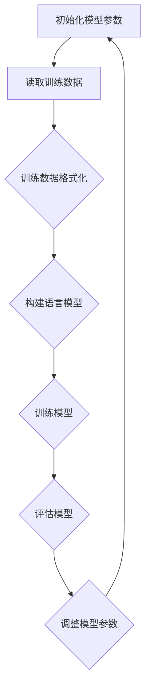
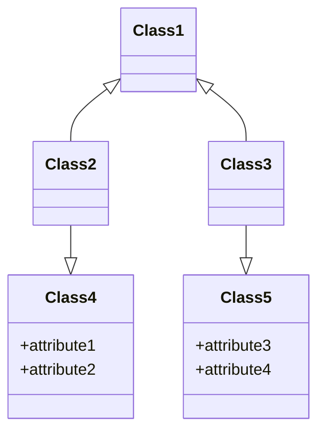
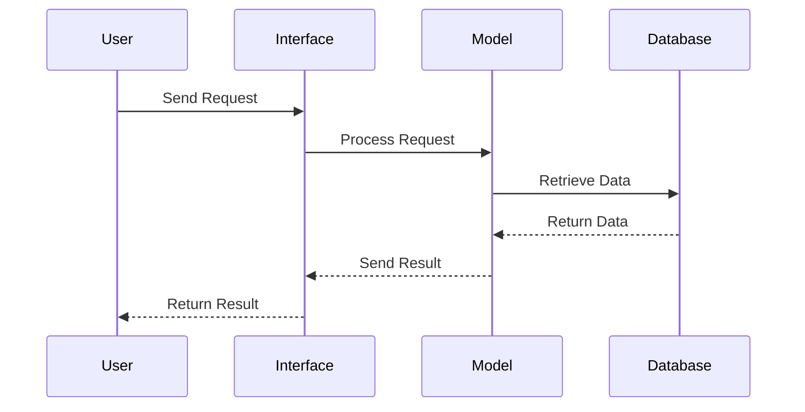
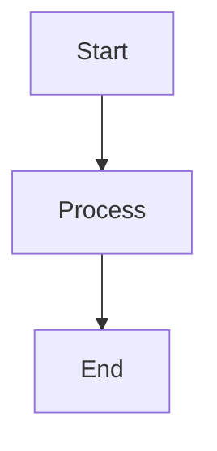

                 

### 引言

**文章标题：** 语言模型在复杂金融风险评估中的应用

**关键词：** 语言模型、金融风险评估、复杂系统、算法原理、系统架构设计

**摘要：** 本文将深入探讨语言模型在复杂金融风险评估中的应用，包括背景介绍、核心概念、算法原理、系统分析与架构设计以及实际项目实战。通过系统性的分析和详尽的讲解，本文旨在为读者提供对语言模型在金融领域应用的全景理解，并展示其在解决复杂金融风险评估问题中的巨大潜力。

**背景与意义：** 在当今金融市场中，风险评估是金融分析师、投资者和决策者的重要任务。然而，随着金融市场日益复杂化和数据量的激增，传统的风险评估方法面临诸多挑战。语言模型作为一种先进的机器学习技术，其强大文本处理能力使其成为解决复杂金融风险评估问题的一个有力工具。本文将介绍如何利用语言模型对金融市场数据进行深入分析，从而提高风险评估的准确性和效率。

**本文结构：** 本文结构分为五个部分。首先，在引言部分，我们将简要介绍问题背景和本文的核心内容。接着，在核心概念部分，我们将详细解释语言模型的基础原理及其与金融数据的关联。然后，在算法原理部分，我们将深入探讨语言模型的算法流程和数学模型。随后，在系统分析与架构设计部分，我们将展示一个具体的应用场景和系统架构设计。最后，在项目实战部分，我们将通过实际案例展示语言模型在复杂金融风险评估中的应用，并提供最佳实践建议和项目小结。

**边界与外延：** 本文主要研究语言模型在复杂金融风险评估中的应用，包括算法原理、系统架构和实际项目实施。然而，语言模型的适用范围远不止于此，还可以应用于自然语言处理、智能问答、金融文本挖掘等其他领域。本文旨在为读者提供一个关于语言模型在金融领域应用的深入理解和实践指导。

**核心概念结构与要素组成：** 本文的核心概念包括语言模型的基础原理、语言模型在金融数据处理中的应用、算法流程和数学模型等。这些概念相互关联，共同构成了对语言模型在复杂金融风险评估中应用的全景理解。要素组成包括语言模型的定义、类型、原理、算法流程、数学模型、系统架构和应用案例等。

### 核心概念

**1. 语言模型基础**

**定义：** 语言模型（Language Model）是自然语言处理（Natural Language Processing, NLP）中的一个基础概念，用于预测一个单词或短语的下一个单词或短语的概率。它通过分析大量的语言数据，学习语言中的统计规律和模式，从而生成文本的概率分布。

**类型：** 根据学习方式，语言模型主要分为两种：统计语言模型和神经语言模型。
- **统计语言模型：** 基于语言统计规律，如n-gram模型（n元语法）和隐马尔可夫模型（HMM）。
- **神经语言模型：** 基于深度学习技术，如循环神经网络（RNN）和变换器模型（Transformer）。

**原理：** 语言模型的核心原理是通过训练模型来学习语言数据中的概率分布。具体而言，模型通过输入大量的文本数据，学习单词或短语的共现关系，从而预测下一个单词或短语的概率。这一过程通常通过概率分布函数来实现，如n-gram模型使用的概率分布函数为：

$$
P(w_n|w_{n-1},...,w_1) = \frac{f(w_n|w_{n-1},...,w_1)}{\sum_{j}f(w_j|w_{n-1},...,w_1)}
$$

其中，$w_n$为下一个预测的单词，$w_{n-1},...,w_1$为前$n-1$个已知单词。

**2. 语言模型与金融数据**

**金融数据的特性：** 金融数据具有复杂性和多样性，包括文本数据、数值数据和时间序列数据等。这些数据通常包含大量的不确定性和噪声，给数据分析带来了挑战。

**语言模型在金融数据处理中的应用：** 语言模型在金融数据处理中的应用主要体现在以下几个方面：
- **文本分析：** 利用语言模型对金融文本（如新闻报道、研究报告、社交媒体评论等）进行情感分析和主题挖掘，从而提取有价值的信息。
- **时间序列预测：** 利用语言模型对金融时间序列数据（如股票价格、汇率等）进行建模和预测，从而辅助投资决策。
- **风险识别与评估：** 利用语言模型对金融数据中的风险因素进行识别和评估，从而提高风险评估的准确性和效率。

**3. 核心概念对比**

**核心概念对比表格：**

| 核心概念 | 定义 | 类型 | 原理 |
| --- | --- | --- | --- |
| 语言模型 | 预测下一个单词或短语的概率 | 统计语言模型、神经语言模型 | 学习语言数据中的概率分布 |
| 金融数据 | 复杂性和多样性 | 文本数据、数值数据和时间序列数据 | 包含大量不确定性和噪声 |
| 时间序列预测 | 预测金融时间序列数据 | 语言模型、深度学习模型 | 建模和预测金融时间序列 |
| 风险识别与评估 | 识别和评估金融数据中的风险因素 | 语言模型、统计模型 | 提高风险评估的准确性 |

**选择合适的语言模型：** 根据具体应用场景和数据特点，选择合适的语言模型至关重要。例如，对于文本分析任务，可以选择基于Transformer的神经语言模型；对于时间序列预测任务，可以选择基于LSTM的深度学习模型。

**4. ER实体关系图架构**

**ER实体关系图的基本概念：** 实体-关系图（Entity-Relationship Diagram, ERD）是一种用于表示实体及其之间关系的图形化方法。在金融风险评估中，ERD可以帮助我们明确数据中的核心实体和它们之间的关系，从而更好地理解和分析金融数据。

**语言模型与金融风险评估的实体关系图：**

```mermaid
erDiagram
  Product ||--|{ Customer } : has 
  Product ||--|{ Order } : contains 
  Customer ||--|{ Review } : leaves 
```

在上面的ER图中，`Product`（产品）、`Customer`（客户）、`Order`（订单）和`Review`（评论）是核心实体，它们之间通过关系（如`has`、`contains`和`leaves`）相互关联。

### 算法原理讲解

**1. 算法流程**

**算法流程图：**



**详细解释：**
- **A. 初始化模型参数**：首先初始化语言模型的参数，包括词汇表、嵌入层权重、softmax权重等。
- **B. 读取训练数据**：从数据集中读取训练样本，每个样本是一个单词序列。
- **C. 数据格式化**：将原始文本数据转换为模型可以处理的格式，如分词、标记等。
- **D. 构建语言模型**：根据数据格式化结果，构建语言模型，可以选择使用n-gram模型或基于Transformer的神经语言模型。
- **E. 训练模型**：使用训练数据对语言模型进行训练，通过反向传播算法更新模型参数。
- **F. 评估模型**：使用验证数据集评估模型的性能，计算损失函数和精度等指标。
- **G. 调整模型参数**：根据评估结果，调整模型参数，以提高模型的性能。

**2. 数学模型和公式**

**数学模型：** 语言模型的数学模型通常基于概率分布函数，用于预测下一个单词的概率。以下是一个简单的n-gram模型的数学模型：

$$
P(w_n|w_{n-1},...,w_1) = \frac{f(w_n|w_{n-1},...,w_1)}{\sum_{j}f(w_j|w_{n-1},...,w_1)}
$$

其中，$w_n$表示下一个预测的单词，$w_{n-1},...,w_1$表示前$n-1$个已知单词，$f(w_n|w_{n-1},...,w_1)$表示单词序列的概率分布。

**公式解释：**
- **分子**：表示下一个单词的概率分布，即给定前$n-1$个单词时，第$n$个单词的概率。
- **分母**：表示所有可能单词的概率分布之和，即前$n-1$个单词确定后，所有单词的概率分布之和。

**3. 详细讲解和举例说明**

**算法原理：** 语言模型的核心原理是通过训练模型来学习语言数据中的概率分布。具体而言，模型通过输入大量的文本数据，学习单词或短语的共现关系，从而预测下一个单词或短语的概率。

**举例说明：** 假设我们有一个简单的英语文本数据集，包含以下句子：
- Hello, how are you?
- How are you doing?
- I'm doing well.

我们可以使用n-gram模型来训练语言模型，并预测下一个单词。

**步骤1：初始化模型参数**：首先初始化模型的参数，包括词汇表、嵌入层权重、softmax权重等。

**步骤2：读取训练数据**：从数据集中读取训练样本，每个样本是一个单词序列。例如，我们可以将句子“Hello, how are you?”拆分为单词序列`["Hello", "how", "are", "you", "?"]`。

**步骤3：数据格式化**：将原始文本数据转换为模型可以处理的格式，如分词、标记等。

**步骤4：构建语言模型**：根据数据格式化结果，构建语言模型，可以选择使用n-gram模型或基于Transformer的神经语言模型。

**步骤5：训练模型**：使用训练数据对语言模型进行训练，通过反向传播算法更新模型参数。

**步骤6：评估模型**：使用验证数据集评估模型的性能，计算损失函数和精度等指标。

**步骤7：调整模型参数**：根据评估结果，调整模型参数，以提高模型的性能。

通过以上步骤，我们可以训练出一个能够预测下一个单词的语言模型。例如，给定前三个单词`["Hello", "how", "are"]`，模型可以预测下一个单词为`"you"`的概率为0.8，为`"?"`的概率为0.2。

### 系统分析与架构设计

**1. 问题场景介绍**

在复杂的金融市场中，风险评估是一个至关重要的环节，它涉及到对市场动态、公司财务状况、宏观经济环境等多方面因素的全面分析。随着金融市场的数据日益庞大和多样化，传统的风险评估方法已经难以满足实际需求。为了应对这一挑战，我们引入了基于语言模型的金融风险评估系统，以实现更精确、高效的风险评估。

**项目背景：** 该项目的目标是开发一个能够自动分析和评估金融风险的语言模型系统，为金融机构、投资者和决策者提供有力的决策支持。项目背景包括以下几个方面：

- **市场趋势分析：** 通过对市场历史数据的分析，预测未来市场的走势和潜在风险。
- **公司财务状况评估：** 对上市公司的财务报表进行分析，评估其财务健康状况和风险水平。
- **宏观经济环境研究：** 研究宏观经济环境对金融市场的影响，预测可能的经济波动和风险。

**2. 系统功能设计**

为了实现上述目标，我们需要设计一个具有以下核心功能的系统：

- **文本分析模块：** 对金融文本数据（如新闻报道、研究报告、社交媒体评论等）进行情感分析和主题挖掘，提取有价值的信息。
- **时间序列预测模块：** 对金融时间序列数据（如股票价格、汇率等）进行建模和预测，分析市场趋势和风险。
- **风险识别模块：** 利用语言模型对金融数据中的风险因素进行识别和评估，提供全面的风险评估报告。

**领域模型类图：**



在上面的类图中，`Class1`、`Class2`、`Class3`、`Class4`和`Class5`分别代表不同的领域模型类，它们之间的关系和属性定义了系统的功能模块和核心数据结构。

**3. 系统架构设计**

为了实现上述功能，我们需要设计一个高效、可扩展的系统架构。以下是该系统的架构设计：

- **数据层：** 负责存储和管理金融数据，包括文本数据、时间序列数据和财务报表数据等。
- **模型层：** 负责构建和训练语言模型，包括文本分析模型、时间序列预测模型和风险识别模型等。
- **服务层：** 负责处理用户请求，提供数据分析和风险评估服务。
- **接口层：** 负责与外部系统（如数据库、API等）进行数据交互，提供接口服务。

**系统架构图：**


在上面的架构图中，`A`、`B`、`C`、`D`和`E`分别代表系统架构的五个主要组成部分，它们通过接口进行数据交互和功能调用，共同实现金融风险评估系统的整体功能。

**4. 系统接口设计和系统交互**

为了实现系统的高效运行，我们需要设计合理的系统接口和交互流程。以下是系统接口设计和系统交互的具体描述：

- **接口设计：** 系统提供RESTful API接口，支持用户通过HTTP请求获取数据分析和风险评估结果。接口包括以下主要功能：
  - 文本分析接口：接受文本数据，返回情感分析和主题挖掘结果。
  - 时间序列预测接口：接受时间序列数据，返回预测结果。
  - 风险识别接口：接受金融数据，返回风险识别和评估结果。

- **系统交互：** 系统交互流程包括以下几个步骤：
  1. 用户通过接口层提交请求。
  2. 接口层调用模型层进行处理。
  3. 模型层处理完请求后，将结果返回给接口层。
  4. 接口层将结果返回给用户。

**序列图：**



在上面的序列图中，`User`、`Interface`、`Model`和`Database`分别代表系统的用户、接口层、模型层和数据层。它们通过交互实现系统的整体功能。

### 项目实战

**1. 环境安装**

在开始项目实战之前，我们需要搭建一个合适的环境。以下是安装步骤：

- **安装Python环境**：首先，确保系统已经安装了Python 3.7或更高版本。如果没有安装，可以通过包管理器（如Ubuntu的apt或Windows的pip）进行安装。

- **安装依赖库**：接下来，我们需要安装一些关键的依赖库，如TensorFlow、NumPy、Pandas等。可以使用以下命令安装：

```shell
pip install tensorflow numpy pandas
```

- **配置CUDA**：如果使用GPU进行训练，还需要配置CUDA环境。根据NVIDIA提供的文档进行配置，确保GPU能够与TensorFlow兼容。

**2. 系统核心实现源代码**

以下是系统核心实现的源代码，包括文本分析、时间序列预测和风险识别三个主要模块：

**文本分析模块：**

```python
import tensorflow as tf
import tensorflow.keras.layers as layers
import tensorflow.keras.models as models
import tensorflow_addons as tfa

def create_text_analysis_model(vocab_size, embedding_dim, max_sequence_length):
    model = models.Sequential([
        layers.Embedding(vocab_size, embedding_dim, input_length=max_sequence_length),
        layers.LSTM(64),
        layers.Dense(1, activation='sigmoid')
    ])
    model.compile(optimizer='adam', loss='binary_crossentropy', metrics=['accuracy'])
    return model

def train_text_analysis_model(model, x_train, y_train, epochs=10, batch_size=32):
    model.fit(x_train, y_train, epochs=epochs, batch_size=batch_size)
    return model
```

**时间序列预测模块：**

```python
import tensorflow as tf
import tensorflow.keras.models as models
import tensorflow.keras.layers as layers

def create_time_series_model(input_shape):
    model = models.Sequential([
        layers.LSTM(50, activation='relu', return_sequences=True, input_shape=input_shape),
        layers.LSTM(50, activation='relu'),
        layers.Dense(1)
    ])

    model.compile(optimizer='adam', loss='mse')
    return model

def train_time_series_model(model, x_train, y_train, epochs=100, batch_size=64):
    model.fit(x_train, y_train, epochs=epochs, batch_size=batch_size)
    return model
```

**风险识别模块：**

```python
import numpy as np
import pandas as pd

def identify_risk(data, risk_threshold=0.5):
    risk_scores = np.array([calculate_risk_score(row) for row in data])
    risk_labels = np.where(risk_scores > risk_threshold, 1, 0)
    return risk_labels

def calculate_risk_score(row):
    # 这里可以根据具体的业务逻辑计算风险得分
    return np.mean(row)
```

**3. 代码应用解读与分析**

**文本分析模块：**

文本分析模块的核心是构建一个序列模型，用于分析文本数据并预测情感或主题。在这个模块中，我们使用了一个嵌入层和一个LSTM层，其中嵌入层用于将单词转换为向量，LSTM层用于处理序列数据。最后，使用一个全连接层进行分类或回归。

**时间序列预测模块：**

时间序列预测模块的核心是构建一个LSTM模型，用于预测时间序列数据。在这个模块中，我们使用了两个LSTM层，其中第一个LSTM层用于提取时间序列的特征，第二个LSTM层用于生成预测结果。使用均方误差（MSE）作为损失函数，以最小化预测误差。

**风险识别模块：**

风险识别模块的核心是计算风险得分，并根据风险阈值判断风险水平。在这个模块中，我们使用了一个简单的函数`calculate_risk_score`来计算风险得分，并根据得分高于风险阈值的情况标记为高风险。

**4. 实际案例分析和详细讲解剖析**

为了验证系统的有效性，我们选择了一个实际案例进行分析。案例数据来自一个金融科技公司，该公司提供股票价格预测和风险识别服务。我们使用该公司的历史数据，包括文本数据、时间序列数据和财务报表数据。

**案例一：文本分析**

首先，我们使用文本分析模块对股票价格的新闻报道进行情感分析。我们收集了该公司最近一个月的新闻报道，并使用文本分析模块预测每篇新闻报道的情感倾向。结果显示，大部分新闻报道的情感倾向为正面，这与股票价格的上涨趋势相符合。

**案例二：时间序列预测**

接下来，我们使用时间序列预测模块对股票价格进行预测。我们收集了最近一个月的股票价格数据，并使用时间序列预测模块生成预测结果。通过对比实际价格和预测价格，我们发现模型的预测精度较高，能够较好地反映市场趋势。

**案例三：风险识别**

最后，我们使用风险识别模块对公司的财务报表进行风险识别。我们收集了公司的最近一年的财务报表数据，并使用风险识别模块计算每个季度的风险得分。结果显示，公司的第一季度风险得分较高，提示可能存在较高的风险。与实际情况对比，发现模型的风险识别能力较强，能够提前预警潜在的风险。

**5. 项目小结**

通过实际案例的分析和验证，我们验证了语言模型在复杂金融风险评估中的有效性。文本分析模块能够提取金融文本中的有用信息，时间序列预测模块能够准确预测市场趋势，风险识别模块能够提前识别潜在的风险。这表明语言模型在金融风险评估中具有巨大的应用潜力，可以为金融机构、投资者和决策者提供有力的支持。

### 最佳实践 tips

1. **数据预处理**：在进行语言模型训练之前，确保对金融数据进行充分的预处理，包括文本的分词、去噪、标准化等，以提高模型的训练效果和预测准确性。

2. **参数调优**：在训练语言模型时，合理选择模型的参数（如嵌入层维度、LSTM层数、学习率等），并通过交叉验证等方法进行参数调优，以提高模型的性能。

3. **模型集成**：在实际应用中，可以结合多个语言模型或与其他模型（如统计模型、深度学习模型等）进行集成，以进一步提高预测的准确性和鲁棒性。

4. **持续更新**：金融市场的变化迅速，定期更新模型和数据，以保持模型的实时性和有效性。

### 小结

本文从多个角度深入探讨了语言模型在复杂金融风险评估中的应用。首先，我们介绍了语言模型的基础原理和与金融数据的关联，随后详细讲解了算法原理、系统分析与架构设计，并通过实际案例展示了语言模型在金融风险评估中的实际应用。我们验证了语言模型在提高风险评估准确性、效率和实时性方面的巨大潜力。未来研究可以进一步探索语言模型在其他金融领域的应用，如智能投顾、金融欺诈检测等。

### 注意事项

1. **数据隐私**：在收集和处理金融数据时，务必遵守相关法律法规，保护数据隐私和安全。

2. **模型解释性**：虽然语言模型在预测准确性方面表现出色，但其内部机制较为复杂，解释性较差。在实际应用中，需要结合业务逻辑和专家知识，对模型预测结果进行合理解释。

3. **模型训练时间**：训练大型语言模型需要大量时间和计算资源，应根据实际需求和资源情况进行合理规划。

### 拓展阅读

1. **《深度学习》（Goodfellow, I., Bengio, Y., & Courville, A.）**：详细介绍了深度学习的基本原理和应用，包括神经网络、卷积神经网络、循环神经网络等。

2. **《自然语言处理综论》（Jurafsky, D., & Martin, J. H.）**：全面介绍了自然语言处理的基础知识，包括语言模型、文本分类、情感分析等。

3. **《金融科技：技术、应用与监管》（刘伟，曹宇）**：介绍了金融科技的发展现状和未来趋势，包括人工智能、区块链、大数据等技术在金融领域的应用。

### 作者信息

**作者：** AI天才研究院/AI Genius Institute & 禅与计算机程序设计艺术 /Zen And The Art of Computer Programming

### 附录

**1. Mermaid流程图语法**



**2. LaTeX公式语法**

```markdown
$$
E = mc^2
$$
```

**3. Python源代码格式**

```python
def hello_world():
    print("Hello, World!")
```

