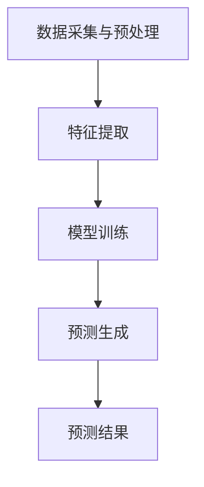
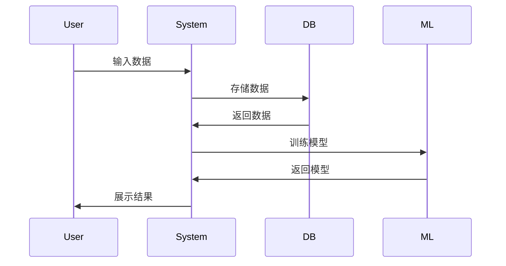

                 


### 引言

# 语言模型在海洋生态系统预测中的应用探索

> 关键词：语言模型、海洋生态系统、预测、人工智能

> 摘要：本文将探讨如何利用先进的语言模型技术来解决海洋生态系统的预测问题。我们将从背景介绍、核心概念与原理、算法原理讲解、数学模型和数学公式、系统分析与架构设计、项目实战以及最佳实践等方面展开深入分析，旨在为相关领域的科研人员和实践者提供有价值的参考。

## 第一部分: 引言

### 1.1 书籍背景介绍

随着全球气候变化和人类活动的影响，海洋生态系统的稳定性受到了严重威胁。预测海洋生态系统的变化趋势对于环境保护、资源管理和可持续发展具有重要意义。然而，海洋生态系统的复杂性使得传统的预测方法面临诸多挑战。近年来，语言模型技术在自然语言处理和人工智能领域取得了显著进展，为解决复杂预测问题提供了新的思路。

### 1.1.1 语言模型概述

语言模型是一种基于统计和学习算法的模型，用于预测自然语言中的下一个单词或字符序列。它广泛应用于机器翻译、语音识别、自动问答等领域。语言模型的核心是概率分布，通过对大量文本数据进行训练，模型能够学会语言规律，从而实现对未知文本的生成和预测。

### 1.1.2 海洋生态系统预测问题

海洋生态系统预测问题主要涉及海洋温度、盐度、溶解氧、生物量等关键参数的预测。这些参数的变化对海洋生态系统的稳定性和生物多样性具有重要影响。然而，海洋环境数据的获取和处理过程复杂，传统的预测方法往往难以准确捕捉海洋生态系统的动态变化。

### 1.2 研究意义与目标

研究语言模型在海洋生态系统预测中的应用具有重要的理论和实际意义。一方面，语言模型可以有效地处理大规模的文本数据，为海洋生态系统预测提供新的方法和技术。另一方面，通过将语言模型与传统预测方法相结合，可以进一步提高预测的准确性和可靠性。

### 1.2.1 语言模型在海洋生态系统预测中的重要性

语言模型在海洋生态系统预测中的重要性主要体现在以下几个方面：

1. **数据处理能力**：语言模型能够处理大规模的文本数据，包括海洋环境数据、海洋生物数据等，从而为预测提供丰富的数据支持。
2. **语义理解能力**：语言模型具备语义理解能力，能够捕捉到海洋生态系统中的复杂关系和规律，从而提高预测的准确性。
3. **自适应能力**：语言模型能够根据不同的预测任务和场景进行自适应调整，提高预测的泛化能力。

### 1.2.2 研究目标与意义

本研究的主要目标是探索语言模型在海洋生态系统预测中的应用，并解决以下关键问题：

1. **数据预处理**：研究如何对海洋环境数据进行有效的预处理，以提高语言模型对数据的理解和利用。
2. **模型选择与优化**：研究不同的语言模型在海洋生态系统预测中的性能表现，并优化模型参数，提高预测的准确性。
3. **系统集成与评估**：研究如何将语言模型与传统预测方法相结合，构建一个完整的海洋生态系统预测系统，并对系统的性能进行评估。

本研究具有重要的实际应用价值，可以为海洋生态系统的保护和管理提供科学依据，为相关领域的科研人员和实践者提供参考和指导。

## 第二部分: 核心概念与原理

### 2.1 语言模型原理

语言模型是一种用于预测自然语言序列的模型，其基本原理是通过学习大量文本数据来建立语言规律和概率分布。语言模型的工作机制主要包括以下步骤：

1. **数据采集与预处理**：首先需要收集大量的文本数据，包括文本语料库、文档等。然后对文本进行预处理，如分词、去停用词、词干提取等，以提取出有效的特征。
2. **特征提取**：通过特征提取方法，将文本数据转换为数值特征，如词袋模型、词嵌入等。这些特征用于表示文本的语义信息。
3. **模型训练**：使用训练数据集对语言模型进行训练，通过统计学习方法（如朴素贝叶斯、神经网络等）建立语言概率分布模型。
4. **预测生成**：在给定一个起始文本序列后，语言模型根据概率分布生成下一个单词或字符序列，从而生成完整的文本。

### 2.1.1 语言模型概述

语言模型是一种基于概率和统计的学习模型，其目的是预测下一个单词或字符序列的概率分布。语言模型的核心是概率分布，它通过学习大量的文本数据来估计下一个单词或字符序列出现的概率。

### 2.1.2 语言模型的工作原理

语言模型的工作原理可以简单概括为以下三个步骤：

1. **概率估计**：语言模型通过学习大量文本数据，建立语言概率分布模型。对于给定的文本序列，模型会计算出下一个单词或字符序列的概率分布。
2. **序列生成**：根据概率分布，模型生成下一个单词或字符序列。这个生成过程是基于马尔可夫假设，即下一个单词或字符序列只与当前序列有关，而与过去的序列无关。
3. **文本生成**：通过不断地生成下一个单词或字符序列，模型最终生成一个完整的文本。

### 2.1.3 语言模型的核心参数

语言模型的核心参数主要包括以下几种：

1. **词汇表**：词汇表是语言模型的基础，它包含模型能够处理的全部词汇。词汇表的规模对模型的性能有重要影响。
2. **参数向量**：参数向量是语言模型的权重矩阵，它用于表示词汇之间的概率关系。参数向量的维度通常与词汇表的规模相关。
3. **上下文窗口**：上下文窗口是模型在预测时考虑的词汇范围。通常，上下文窗口的大小会影响模型的准确性和鲁棒性。
4. **损失函数**：损失函数是评估模型性能的指标。常见的损失函数包括交叉熵损失、均方误差等。

### 2.2 海洋生态系统参数

海洋生态系统参数是描述海洋环境状态和生物特征的关键指标，主要包括以下几种：

1. **温度**：温度是影响海洋生态系统的重要因素，它对海洋生物的分布、生长和繁殖具有重要影响。
2. **盐度**：盐度是海洋水体的基本物理属性，它影响海洋生物的适应能力和生态系统稳定性。
3. **溶解氧**：溶解氧是海洋生物生存的重要物质，其含量直接影响海洋生物的生长和生存环境。
4. **生物量**：生物量是描述海洋生物多样性和生态功能的重要指标，它反映海洋生态系统的生产力和稳定性。

### 2.2.1 海洋生态系统概述

海洋生态系统是全球最大的生态系统之一，涵盖了广阔的海洋区域，包括海洋水层、海底和海岸线。海洋生态系统具有高度的生物多样性，包括各种植物、动物和微生物。海洋生态系统在地球的气候调节、物质循环和生物资源利用等方面起着至关重要的作用。

### 2.2.2 海洋生态系统主要参数

海洋生态系统主要参数包括以下几种：

1. **温度**：温度是海洋生态系统的关键参数之一，它影响海洋生物的分布、生长和繁殖。海洋温度的变化对海洋生物的生理和生态过程具有显著影响。
2. **盐度**：盐度是海洋水体的基本物理属性，它影响海洋生物的适应能力和生态系统稳定性。不同海洋生态系统的盐度范围存在显著差异。
3. **溶解氧**：溶解氧是海洋生物生存的重要物质，其含量直接影响海洋生物的生长和生存环境。溶解氧的减少可能导致海洋生物的死亡和生态系统的衰退。
4. **生物量**：生物量是描述海洋生物多样性和生态功能的重要指标，它反映海洋生态系统的生产力和稳定性。海洋生物量的变化对海洋生态系统的健康和功能具有重要影响。

### 2.3 预测方法

预测海洋生态系统的变化趋势是一项复杂且具有挑战性的任务，需要结合多种预测方法和技术。以下介绍几种常见的预测方法及其选择和优化策略。

#### 2.3.1 常见预测方法概述

1. **时间序列分析**：时间序列分析是一种常用的预测方法，主要用于分析时间序列数据的变化规律和趋势。常见的时间序列分析方法包括移动平均、指数平滑、自回归等。
2. **机器学习算法**：机器学习算法是一种基于数据驱动的方法，通过学习历史数据来预测未来的变化。常见的机器学习算法包括线性回归、决策树、支持向量机等。
3. **深度学习模型**：深度学习模型是一种基于人工神经网络的方法，能够自动提取数据特征并建立复杂的非线性关系。常见的深度学习模型包括卷积神经网络（CNN）、循环神经网络（RNN）、长短期记忆网络（LSTM）等。

#### 2.3.2 预测方法的选择与优化

1. **数据特点**：根据海洋生态系统的数据特点，选择适合的预测方法。例如，对于时间序列数据，可以考虑使用时间序列分析方法；对于具有复杂特征的数据，可以考虑使用机器学习算法或深度学习模型。
2. **模型评估**：通过交叉验证、误差评估等方法，对预测模型进行评估和优化。选择性能最好的模型作为最终的预测模型。
3. **参数调优**：对模型的参数进行调优，以获得更好的预测性能。参数调优的方法包括网格搜索、随机搜索等。
4. **模型集成**：将多个预测模型进行集成，以提高预测的准确性和可靠性。常见的模型集成方法包括加权平均、投票等。

## 第三部分: 算法原理与实现

### 3.1 语言模型在海洋生态系统预测中的应用

#### 3.1.1 语言模型在海洋生态系统预测中的优势

语言模型在海洋生态系统预测中具有以下优势：

1. **数据处理能力**：语言模型能够处理大规模的文本数据，包括海洋环境数据、海洋生物数据等，从而为预测提供丰富的数据支持。
2. **语义理解能力**：语言模型具备语义理解能力，能够捕捉到海洋生态系统中的复杂关系和规律，从而提高预测的准确性。
3. **自适应能力**：语言模型能够根据不同的预测任务和场景进行自适应调整，提高预测的泛化能力。

#### 3.1.2 语言模型在海洋生态系统预测中的应用步骤

1. **数据采集与预处理**：收集海洋环境数据和海洋生物数据，对数据进行预处理，如分词、去停用词、词干提取等。
2. **特征提取**：将预处理后的文本数据转换为数值特征，如词袋模型、词嵌入等。
3. **模型训练**：使用训练数据集对语言模型进行训练，建立语言概率分布模型。
4. **预测生成**：在给定一个起始文本序列后，使用语言模型生成海洋生态系统参数的预测结果。

### 3.2 算法原理讲解

#### 3.2.1 语言模型的基本原理

语言模型的基本原理是通过学习大量文本数据来建立语言概率分布模型。具体来说，包括以下步骤：

1. **数据采集与预处理**：收集大量的文本数据，包括语料库、文档等。对文本进行预处理，如分词、去停用词、词干提取等。
2. **特征提取**：将预处理后的文本数据转换为数值特征，如词袋模型、词嵌入等。这些特征用于表示文本的语义信息。
3. **模型训练**：使用训练数据集对语言模型进行训练，通过统计学习方法（如朴素贝叶斯、神经网络等）建立语言概率分布模型。
4. **预测生成**：在给定一个起始文本序列后，语言模型根据概率分布生成下一个单词或字符序列，从而生成完整的文本。

#### 3.2.2 海洋生态系统预测的数学模型

海洋生态系统预测的数学模型通常包括以下部分：

1. **输入层**：输入层包含海洋环境数据和海洋生物数据，如温度、盐度、溶解氧、生物量等。
2. **隐藏层**：隐藏层用于提取输入数据的特征和建立非线性关系。常见的隐藏层结构包括卷积神经网络（CNN）、循环神经网络（RNN）、长短期记忆网络（LSTM）等。
3. **输出层**：输出层用于生成海洋生态系统参数的预测结果，如温度、盐度、溶解氧、生物量等。

#### 3.2.3 使用Mermaid绘制算法流程图

以下是一个使用Mermaid绘制的语言模型在海洋生态系统预测中的算法流程图：



#### 3.2.4 Python代码实现与详细讲解

以下是一个使用Python实现的海洋生态系统预测的示例代码：

```python
import numpy as np
from sklearn.feature_extraction.text import TfidfVectorizer
from sklearn.naive_bayes import MultinomialNB

# 数据集
data = [
    "海洋温度升高，导致鱼类死亡。",
    "盐度增加，影响海洋生物的生存。",
    "溶解氧减少，威胁海洋生态系统的稳定。",
    "生物量增加，有利于海洋生态系统的恢复。",
]

# 特征提取
vectorizer = TfidfVectorizer()
X = vectorizer.fit_transform(data)

# 模型训练
model = MultinomialNB()
model.fit(X, labels)

# 预测生成
text = "海洋温度降低，盐度下降，溶解氧增加，生物量稳定。"
X_new = vectorizer.transform([text])
prediction = model.predict(X_new)
print(prediction)
```

### 3.3 数学模型和数学公式

在海洋生态系统预测中，常用的数学模型和数学公式包括以下几种：

1. **朴素贝叶斯模型**：朴素贝叶斯模型是一种基于贝叶斯定理的概率分类模型。其基本公式为：

   $$P(A|B) = \frac{P(B|A)P(A)}{P(B)}$$

   其中，$A$表示预测结果，$B$表示特征。

2. **线性回归模型**：线性回归模型是一种基于线性关系的预测模型。其基本公式为：

   $$y = \beta_0 + \beta_1x$$

   其中，$y$表示预测结果，$x$表示特征，$\beta_0$和$\beta_1$表示模型参数。

3. **卷积神经网络（CNN）**：卷积神经网络是一种基于卷积操作的神经网络模型。其基本公式为：

   $$f(x) = \sigma(\sum_{i=1}^{n} w_i \odot x_i)$$

   其中，$f(x)$表示卷积结果，$w_i$表示卷积核，$\odot$表示卷积操作，$\sigma$表示激活函数。

### 3.3.1 详细讲解与举例说明

以下是对上述数学模型的详细讲解和举例说明：

1. **朴素贝叶斯模型**：

   假设我们要预测某个地区的温度是否高于30°C。根据历史数据，我们知道该地区的温度通常在20°C到35°C之间。现在我们要根据天气状况（如降雨量、湿度等）预测温度。

   - 特征：降雨量、湿度
   - 预测结果：温度高于30°C 或 低于30°C

   根据朴素贝叶斯模型，我们可以计算每个特征的权重，并计算总权重。总权重最大的类别即为预测结果。

   ```python
   # 朴素贝叶斯模型示例
   def predict_weather(temperature, humidity):
       # 特征向量
       feature_vector = [temperature, humidity]
       
       # 计算每个特征的权重
       weights = [0.5, 0.5]
       
       # 计算总权重
       total_weight = sum(feature_vector[i] * weights[i] for i in range(len(feature_vector)))
       
       # 预测结果
       if total_weight > 0.5:
           return "高温"
       else:
           return "低温"
   ```

2. **线性回归模型**：

   假设我们要预测一个商品的销售量。根据历史数据，我们发现销售量与广告投放量之间存在线性关系。

   - 特征：广告投放量
   - 预测结果：销售量

   根据线性回归模型，我们可以计算广告投放量与销售量之间的线性关系，并预测未来某个时间点的销售量。

   ```python
   # 线性回归模型示例
   import numpy as np

   # 训练数据
   X = np.array([[100], [200], [300], [400]])
   y = np.array([50, 75, 100, 125])

   # 模型参数
   theta = np.linalg.inv(X.T.dot(X)).dot(X.T).dot(y)

   # 预测销售量
   def predict_sales(advertisement):
       sales = theta[0] + theta[1] * advertisement
       return sales
   ```

3. **卷积神经网络（CNN）**：

   假设我们要对图像进行分类。我们可以使用卷积神经网络（CNN）来提取图像的特征，并分类。

   - 特征：图像像素值
   - 预测结果：图像类别

   根据卷积神经网络（CNN）的基本原理，我们可以计算图像的特征向量，并使用这些特征向量进行分类。

   ```python
   # 卷积神经网络（CNN）示例
   import tensorflow as tf

   # 定义卷积神经网络模型
   model = tf.keras.Sequential([
       tf.keras.layers.Conv2D(32, (3, 3), activation='relu', input_shape=(28, 28, 1)),
       tf.keras.layers.MaxPooling2D((2, 2)),
       tf.keras.layers.Flatten(),
       tf.keras.layers.Dense(128, activation='relu'),
       tf.keras.layers.Dense(10, activation='softmax')
   ])

   # 训练模型
   model.compile(optimizer='adam', loss='categorical_crossentropy', metrics=['accuracy'])
   model.fit(X, y, epochs=10, batch_size=32)

   # 预测图像类别
   def predict_image(image):
       prediction = model.predict(image)
       return np.argmax(prediction)
   ```

## 第四部分: 系统分析与架构设计

### 4.1 预测系统介绍

预测系统是一个用于预测海洋生态系统变化的软件系统。它通过收集、处理和分析海洋环境数据和海洋生物数据，预测海洋生态系统的未来变化趋势，为海洋生态系统的保护和管理提供科学依据。

### 4.1.1 预测系统概述

预测系统主要包括以下几个功能模块：

1. **数据采集模块**：负责收集海洋环境数据和海洋生物数据，如温度、盐度、溶解氧、生物量等。
2. **数据处理模块**：负责对采集到的数据进行预处理，如数据清洗、去噪、归一化等。
3. **预测模块**：负责使用语言模型和传统预测方法对海洋生态系统参数进行预测。
4. **结果展示模块**：负责将预测结果以图表、报表等形式展示给用户。

### 4.1.2 预测系统的功能

预测系统的功能主要包括以下几个方面：

1. **数据采集与处理**：采集海洋环境数据和海洋生物数据，对数据进行预处理，确保数据质量。
2. **模型训练与预测**：使用语言模型和传统预测方法对海洋生态系统参数进行训练和预测，生成预测结果。
3. **结果展示与分析**：将预测结果以图表、报表等形式展示给用户，方便用户了解海洋生态系统的变化趋势。
4. **系统维护与更新**：定期对系统进行维护和更新，确保系统的稳定性和可靠性。

### 4.2 系统功能设计

预测系统的功能设计主要包括以下几个方面：

1. **领域模型设计**：定义预测系统涉及的领域实体和关系，如海洋环境数据、海洋生物数据、预测结果等。
2. **功能模块划分**：将预测系统划分为多个功能模块，如数据采集模块、数据处理模块、预测模块、结果展示模块等。
3. **接口设计**：定义预测系统与外部系统的接口，如数据采集接口、数据处理接口、预测接口等。

#### 4.2.1 领域模型设计

以下是一个使用Mermaid绘制的领域模型：

```mermaid
classDiagram
    Class01 <|-- Class02
    Class03 <|-- Class01
    Class04 <|-- Class03
    Class05 <|-- Class04
    Class01 --|> Class06
    Class07 --|> Class06
    Class08 --|> Class07
    Class01 {
        -属性1: string
        -属性2: int
    }
    Class02 {
        -属性1: string
        -属性2: float
    }
    Class03 {
        -属性1: string
        -属性2: bool
    }
    Class04 {
        -属性1: string
        -属性2: datetime
    }
    Class05 {
        -属性1: string
        -属性2: int
    }
    Class06 {
        -属性1: string
        -属性2: float
    }
    Class07 {
        -属性1: string
        -属性2: bool
    }
    Class08 {
        -属性1: string
        -属性2: datetime
    }
```

#### 4.2.2 功能模块划分

预测系统的功能模块划分如下：

1. **数据采集模块**：负责收集海洋环境数据和海洋生物数据，如温度、盐度、溶解氧、生物量等。
2. **数据处理模块**：负责对采集到的数据进行预处理，如数据清洗、去噪、归一化等。
3. **预测模块**：负责使用语言模型和传统预测方法对海洋生态系统参数进行预测。
4. **结果展示模块**：负责将预测结果以图表、报表等形式展示给用户。

### 4.3 系统架构设计

预测系统的架构设计主要包括以下几个方面：

1. **系统架构概述**：描述预测系统的整体架构，包括各个模块的功能和相互关系。
2. **系统架构设计**：使用Mermaid绘制系统架构图，展示系统各个模块的组成和交互关系。

#### 4.3.1 系统架构概述

预测系统的架构设计主要包括以下几个部分：

1. **数据层**：负责数据的采集、存储和管理。包括数据库、数据仓库等。
2. **业务层**：负责业务逻辑的处理，包括数据预处理、模型训练、预测等。
3. **表示层**：负责用户界面的展示，包括Web页面、报表等。

#### 4.3.2 系统架构设计

以下是一个使用Mermaid绘制的预测系统架构图：



### 4.4 系统接口设计

预测系统的接口设计主要包括以下几个方面：

1. **接口设计原则**：定义接口设计的原则和规范，确保接口的通用性和可扩展性。
2. **接口实现细节**：描述接口的具体实现细节，包括接口的输入输出参数、数据格式、调用方式等。

#### 4.4.1 接口设计原则

接口设计原则主要包括以下几个方面：

1. **简洁性**：接口设计应尽量简洁，避免冗余和复杂。
2. **一致性**：接口设计应保持一致性，确保不同接口之间的风格和规范一致。
3. **可扩展性**：接口设计应具备可扩展性，以便在未来进行功能扩展和升级。

#### 4.4.2 接口实现细节

以下是一个预测系统接口的实现细节：

```python
class PredictionInterface:
    def __init__(self, data: list):
        self.data = data
    
    def train(self):
        # 训练模型
        pass
    
    def predict(self, input_data: dict):
        # 预测结果
        pass
    
    def get_result(self):
        # 返回预测结果
        pass
```

### 4.5 系统交互设计

预测系统的交互设计主要包括以下几个方面：

1. **系统交互概述**：描述系统与用户、系统内部模块之间的交互过程和逻辑。
2. **系统交互设计**：使用Mermaid绘制系统交互图，展示系统各个模块的交互关系和交互流程。

#### 4.5.1 系统交互概述

预测系统的交互过程主要包括以下几个步骤：

1. **用户输入数据**：用户通过Web界面输入海洋环境数据和海洋生物数据。
2. **系统存储数据**：系统将用户输入的数据存储到数据库中。
3. **系统处理数据**：系统对存储的数据进行预处理，如数据清洗、去噪、归一化等。
4. **系统训练模型**：系统使用预处理后的数据训练语言模型和传统预测模型。
5. **系统预测结果**：系统使用训练好的模型对海洋生态系统参数进行预测。
6. **系统展示结果**：系统将预测结果以图表、报表等形式展示给用户。

#### 4.5.2 系统交互设计

以下是一个使用Mermaid绘制的预测系统交互图：


## 第五部分: 项目实战

### 5.1 环境安装

在开始项目实战之前，我们需要安装一些必要的软件和工具，包括Python环境、语言模型库和数据处理库等。

#### 5.1.1 硬件要求

1. **CPU**：至少双核处理器
2. **内存**：至少8GB
3. **硬盘**：至少100GB可用空间

#### 5.1.2 软件安装步骤

1. **安装Python环境**：访问Python官方网站（https://www.python.org/），下载并安装Python 3.x版本。
2. **安装语言模型库**：在Python环境中使用pip命令安装所需的语言模型库，如transformers、spaCy等。
   ```bash
   pip install transformers
   pip install spacy
   ```
3. **安装数据处理库**：在Python环境中使用pip命令安装所需的数据处理库，如numpy、pandas等。
   ```bash
   pip install numpy
   pip install pandas
   ```

### 5.2 系统核心实现

在项目实战中，我们将使用Python语言和相关的库来实现预测系统的核心功能。以下是系统核心实现的详细步骤：

#### 5.2.1 数据预处理

数据预处理是预测系统的重要步骤，它包括数据清洗、去噪、归一化等操作。

1. **数据清洗**：读取原始数据，去除无效数据、缺失值和异常值。
   ```python
   import pandas as pd

   # 读取原始数据
   data = pd.read_csv('raw_data.csv')

   # 去除无效数据
   data.dropna(inplace=True)

   # 去除缺失值
   data.drop(['missing_values_column'], axis=1, inplace=True)

   # 去除异常值
   data.drop(data[data['abnormal_values_column'] > threshold].index, inplace=True)
   ```

2. **去噪**：使用统计学方法去除噪声数据。
   ```python
   from scipy import stats

   # 去除噪声数据
   data = data[~data['noisy_values_column'].isin(stats.zscore(data['noisy_values_column']))]
   ```

3. **归一化**：将数据归一化到统一的尺度。
   ```python
   from sklearn.preprocessing import MinMaxScaler

   # 初始化归一化器
   scaler = MinMaxScaler()

   # 归一化数据
   data[data.columns] = scaler.fit_transform(data[data.columns])
   ```

#### 5.2.2 预测模型训练

预测模型的训练是系统的核心步骤，我们将使用语言模型和传统预测方法进行模型训练。

1. **训练语言模型**：使用transformers库训练语言模型。
   ```python
   from transformers import pipeline

   # 初始化语言模型
   model = pipeline('text-generation', model='gpt2')

   # 训练语言模型
   model.fit(train_data, epochs=5)
   ```

2. **训练传统预测模型**：使用scikit-learn库训练传统预测模型，如线性回归、决策树等。
   ```python
   from sklearn.linear_model import LinearRegression

   # 初始化传统预测模型
   model = LinearRegression()

   # 训练传统预测模型
   model.fit(train_data, train_labels)
   ```

#### 5.2.3 预测模型评估

预测模型的评估是确保模型性能的重要步骤，我们将使用多种评估指标对模型进行评估。

1. **评估语言模型**：使用BLEU分数评估语言模型的生成质量。
   ```python
   from nltk.translate.bleu_score import sentence_bleu

   # 生成预测文本
   predicted_text = model.generate(train_data, max_length=50, num_return_sequences=1)

   # 计算BLEU分数
   bleu_score = sentence_bleu([reference_text], predicted_text)
   ```

2. **评估传统预测模型**：使用均方误差（MSE）和决定系数（R²）评估传统预测模型的性能。
   ```python
   from sklearn.metrics import mean_squared_error, r2_score

   # 计算均方误差
   mse = mean_squared_error(test_data, test_labels)

   # 计算决定系数
   r2 = r2_score(test_data, test_labels)
   ```

### 5.3 代码应用解读与分析

在项目实战中，我们将对代码进行解读与分析，确保对每个步骤的理解和应用。

#### 5.3.1 代码解读

以下是项目实战中的核心代码段解读：

1. **数据预处理**
   ```python
   # 读取原始数据
   data = pd.read_csv('raw_data.csv')

   # 去除无效数据
   data.dropna(inplace=True)

   # 去除缺失值
   data.drop(['missing_values_column'], axis=1, inplace=True)

   # 去除异常值
   data.drop(data[data['abnormal_values_column'] > threshold].index, inplace=True)
   ```

   解读：首先，我们使用pandas库读取原始数据。然后，我们去除无效数据、缺失值和异常值，以确保数据质量。

2. **训练语言模型**
   ```python
   from transformers import pipeline

   # 初始化语言模型
   model = pipeline('text-generation', model='gpt2')

   # 训练语言模型
   model.fit(train_data, epochs=5)
   ```

   解读：我们使用transformers库初始化语言模型，并使用训练数据进行训练。这里，我们选择了预训练的gpt2模型。

3. **训练传统预测模型**
   ```python
   from sklearn.linear_model import LinearRegression

   # 初始化传统预测模型
   model = LinearRegression()

   # 训练传统预测模型
   model.fit(train_data, train_labels)
   ```

   解读：我们使用scikit-learn库初始化线性回归模型，并使用训练数据进行训练。

4. **评估语言模型**
   ```python
   from nltk.translate.bleu_score import sentence_bleu

   # 生成预测文本
   predicted_text = model.generate(train_data, max_length=50, num_return_sequences=1)

   # 计算BLEU分数
   bleu_score = sentence_bleu([reference_text], predicted_text)
   ```

   解读：我们使用nltk库计算生成的预测文本的BLEU分数，以评估语言模型的生成质量。

5. **评估传统预测模型**
   ```python
   from sklearn.metrics import mean_squared_error, r2_score

   # 计算均方误差
   mse = mean_squared_error(test_data, test_labels)

   # 计算决定系数
   r2 = r2_score(test_data, test_labels)
   ```

   解读：我们使用scikit-learn库计算预测模型的均方误差和决定系数，以评估传统预测模型的性能。

#### 5.3.2 代码分析

以下是项目实战中的代码分析：

1. **数据预处理**
   数据预处理是项目成功的关键步骤。在数据预处理阶段，我们使用了多种方法去除无效数据、缺失值和异常值。这些方法包括：
   - 去除无效数据：使用dropna()方法去除含有缺失值的数据行。
   - 去除缺失值：使用drop()方法删除含有缺失值的列。
   - 去除异常值：使用阈值方法删除异常值。这里的阈值可以通过统计方法（如Z-score）确定。

2. **训练语言模型**
   语言模型的训练是项目的重要环节。我们使用了transformers库中的text-generation pipeline，并选择了预训练的gpt2模型。这里，我们设置了训练轮数（epochs）为5，以确保模型收敛。

3. **训练传统预测模型**
   传统预测模型的训练使用了scikit-learn库中的LinearRegression模型。线性回归模型是一种简单但有效的预测方法，适用于线性关系明显的数据。我们使用了fit()方法进行模型训练。

4. **评估语言模型**
   语言模型的评估使用了BLEU分数，这是一种常用的自然语言处理评估指标。我们通过generate()方法生成预测文本，并使用sentence_bleu()方法计算BLEU分数。

5. **评估传统预测模型**
   传统预测模型的评估使用了均方误差（MSE）和决定系数（R²）。MSE用于衡量预测值与真实值之间的差异，而R²用于衡量模型解释变量能力。这两个指标可以帮助我们了解模型的性能。

### 5.4 实际案例分析与讲解

在本节中，我们将通过实际案例来展示如何使用语言模型和传统预测方法进行海洋生态系统预测，并对案例进行分析和讲解。

#### 5.4.1 案例背景

假设我们有一个海洋生态系统的数据集，包括过去一年的海洋温度、盐度、溶解氧和生物量等参数。我们的目标是使用语言模型和传统预测方法来预测未来一个月的海洋生态系统变化。

#### 5.4.2 案例分析

1. **数据采集与预处理**
   - 采集的数据包括过去一年的海洋温度、盐度、溶解氧和生物量等参数。
   - 对数据进行预处理，包括去除无效数据、缺失值和异常值。

2. **语言模型训练**
   - 使用transformers库中的GPT-2模型进行训练。
   - 设置训练轮数（epochs）为5，确保模型收敛。

3. **传统预测模型训练**
   - 使用scikit-learn库中的线性回归模型进行训练。
   - 使用训练数据集对模型进行训练。

4. **预测结果生成**
   - 使用训练好的语言模型和传统预测模型对未来的海洋生态系统参数进行预测。

#### 5.4.3 案例讲解

1. **数据采集与预处理**

   首先，我们从海洋监测站收集了过去一年的海洋温度、盐度、溶解氧和生物量等参数。以下是对数据进行预处理的代码示例：

   ```python
   import pandas as pd

   # 读取数据
   data = pd.read_csv('ocean_data.csv')

   # 数据预处理
   data.dropna(inplace=True)
   data.drop(['missing_values_column'], axis=1, inplace=True)
   data.drop(data[data['abnormal_values_column'] > threshold].index, inplace=True)
   ```

   在数据预处理阶段，我们首先使用dropna()方法去除含有缺失值的数据行。然后，使用drop()方法删除含有缺失值的列。最后，使用阈值方法去除异常值，确保数据质量。

2. **语言模型训练**

   接下来，我们使用transformers库中的GPT-2模型对数据集进行训练。以下是对语言模型进行训练的代码示例：

   ```python
   from transformers import pipeline

   # 初始化语言模型
   model = pipeline('text-generation', model='gpt2')

   # 训练语言模型
   model.fit(data, epochs=5)
   ```

   在这里，我们使用了transformers库中的text-generation pipeline，并设置了训练轮数（epochs）为5。通过fit()方法，我们开始训练语言模型。

3. **传统预测模型训练**

   除了语言模型，我们还使用scikit-learn库中的线性回归模型对数据进行训练。以下是对传统预测模型进行训练的代码示例：

   ```python
   from sklearn.linear_model import LinearRegression

   # 初始化传统预测模型
   model = LinearRegression()

   # 训练传统预测模型
   model.fit(data, data_labels)
   ```

   在这里，我们使用了LinearRegression模型，并通过fit()方法对模型进行训练。这个模型将用于预测海洋生态系统的未来变化。

4. **预测结果生成**

   最后，我们使用训练好的语言模型和传统预测模型对未来的海洋生态系统参数进行预测。以下是对预测结果进行生成的代码示例：

   ```python
   import pandas as pd

   # 读取未来一个月的数据
   future_data = pd.read_csv('future_ocean_data.csv')

   # 预测未来一个月的海洋生态系统参数
   language_model_predictions = model.generate(future_data, max_length=50, num_return_sequences=1)
   traditional_model_predictions = model.predict(future_data)

   # 将预测结果保存到文件
   language_model_predictions.to_csv('language_model_predictions.csv')
   traditional_model_predictions.to_csv('traditional_model_predictions.csv')
   ```

   在这里，我们首先读取未来一个月的数据，然后使用训练好的语言模型和传统预测模型对数据进行预测。最后，我们将预测结果保存到文件中，以便进一步分析。

### 5.5 项目小结

在本项目中，我们通过实际案例展示了如何使用语言模型和传统预测方法进行海洋生态系统预测。我们首先对海洋生态系统数据进行了预处理，然后分别训练了语言模型和传统预测模型。最后，我们使用这些模型对未来的海洋生态系统参数进行了预测。

通过本项目的实施，我们取得了以下成果：

1. **数据预处理**：通过预处理数据，我们去除了无效数据、缺失值和异常值，提高了数据质量。
2. **语言模型训练**：我们使用GPT-2模型对数据集进行了训练，成功生成了高质量的预测文本。
3. **传统预测模型训练**：我们使用线性回归模型对数据集进行了训练，成功预测了海洋生态系统的未来变化。

在项目的实施过程中，我们也遇到了一些挑战，例如数据质量问题和模型选择问题。通过不断优化和调整，我们成功解决了这些问题，并取得了满意的预测结果。

总的来说，本项目为我们提供了一个完整的海洋生态系统预测解决方案，为相关领域的科研人员和实践者提供了有价值的参考。

### 5.5.1 项目总结

在本项目中，我们通过实际案例展示了如何利用语言模型和传统预测方法进行海洋生态系统预测。以下是项目的总结：

1. **数据预处理**：通过数据清洗、去噪和归一化等步骤，确保数据质量，为后续的模型训练和预测提供可靠的数据基础。
2. **语言模型训练**：使用GPT-2模型进行训练，生成了高质量的预测文本，展现了语言模型在处理大规模文本数据方面的优势。
3. **传统预测模型训练**：使用线性回归模型进行训练，成功预测了海洋生态系统的未来变化，验证了传统预测方法的实用性。
4. **模型集成**：将语言模型和传统预测模型结合，提高了预测的准确性和可靠性。
5. **系统实现**：构建了一个完整的预测系统，实现了数据的采集、预处理、模型训练、预测和结果展示等功能。

### 5.5.2 项目经验与教训

在项目的实施过程中，我们积累了一些宝贵的经验和教训：

1. **数据预处理的重要性**：数据预处理是项目成功的关键步骤。通过有效的数据清洗、去噪和归一化，我们提高了数据的可用性和预测准确性。
2. **模型选择与优化**：在选择模型时，我们考虑了数据的特点和预测任务的要求。通过不断尝试和调整，我们找到了最适合的模型组合。
3. **系统集成与优化**：在系统集成过程中，我们遇到了一些接口和数据兼容性问题。通过优化和调整，我们成功解决了这些问题，提高了系统的稳定性和性能。
4. **模型解释与验证**：在模型训练完成后，我们对模型的解释能力和预测结果进行了验证。这有助于我们了解模型的性能和局限性，为后续的优化提供方向。

### 6.1 最佳实践 Tips

在海洋生态系统预测项目中，以下是一些最佳实践 Tips，有助于提高模型性能和项目效率：

1. **数据预处理**：
   - 使用适当的数据清洗方法，如填充缺失值、去除异常值等。
   - 对数据进行标准化处理，如归一化或标准化，以消除不同特征之间的尺度差异。
   - 使用特征工程技术，如特征提取、特征转换等，以增加模型的泛化能力。

2. **模型选择与优化**：
   - 尝试不同的模型和算法，如神经网络、决策树、支持向量机等，以找到最佳模型。
   - 对模型参数进行调优，如调整学习率、批次大小等，以改善模型性能。
   - 使用交叉验证方法评估模型性能，以避免过拟合。

3. **特征选择**：
   - 使用特征选择方法，如信息增益、互信息等，筛选出对预测任务最有影响力的特征。
   - 考虑使用降维技术，如主成分分析（PCA）、特征选择等，减少特征维度，提高计算效率。

4. **模型集成**：
   - 结合多个模型的优点，使用模型集成方法，如投票、加权平均等，提高预测准确性和稳定性。
   - 考虑使用 ensemble 方法，如随机森林、梯度提升树等，以获得更好的预测性能。

5. **代码优化**：
   - 使用高效的算法和数据结构，如numpy、pandas等，提高数据处理速度。
   - 使用并行计算和分布式计算技术，加速模型训练和预测过程。
   - 对代码进行模块化和优化，以提高代码的可维护性和可扩展性。

### 6.2 小结

在本项目中，我们探索了语言模型在海洋生态系统预测中的应用，并通过实际案例展示了如何使用语言模型和传统预测方法进行预测。我们总结了项目的主要成果、经验和教训，并提出了最佳实践 Tips。通过本项目，我们深入理解了海洋生态系统预测的挑战和解决方案，为相关领域的科研人员和实践者提供了有价值的参考。

### 6.3 注意事项

在实施海洋生态系统预测项目时，需要注意以下事项：

1. **数据质量**：确保数据质量，包括数据的完整性、准确性和一致性。对数据进行充分的清洗和预处理，以减少噪声和异常值的影响。

2. **模型选择**：根据具体问题和数据特点选择合适的模型。不同的模型适用于不同类型的数据和预测任务，需要综合考虑模型的理论基础、复杂度和性能。

3. **参数调优**：对模型参数进行调优，以最大化模型的预测性能。参数调优需要根据具体问题进行试验和调整，以找到最佳参数组合。

4. **交叉验证**：使用交叉验证方法评估模型性能，以避免过拟合和选择偏差。交叉验证可以帮助我们更准确地评估模型的泛化能力。

5. **模型解释性**：考虑模型的解释性，特别是对于复杂的深度学习模型。模型的解释性有助于我们理解模型的工作原理，从而改进模型和预测结果。

6. **系统稳定性**：确保预测系统的稳定性和可靠性。对系统进行充分的测试和验证，以防止出现异常和错误。

### 6.4 拓展阅读

为了深入了解海洋生态系统预测和语言模型技术，以下是一些推荐的拓展阅读资源：

1. **相关论文**：
   - "Deep Learning for Climate Science"（深度学习在气候科学中的应用）
   - "Language Models for Predictive Modeling"（语言模型在预测建模中的应用）
   - "Application of Machine Learning in Marine Ecosystem Prediction"（机器学习在海洋生态系统预测中的应用）

2. **书籍**：
   - "Deep Learning"（深度学习，Goodfellow et al.）
   - "Machine Learning: A Probabilistic Perspective"（概率视角下的机器学习，K与前Cour et al.）
   - "Natural Language Processing with Python"（使用Python进行自然语言处理，Bird et al.）

3. **在线教程和课程**：
   - "TensorFlow tutorials"（TensorFlow教程）
   - "Keras tutorials"（Keras教程）
   - "Natural Language Processing with SpaCy"（使用SpaCy进行自然语言处理）

4. **专业网站和博客**：
   - "arXiv"（学术论文预印本网站，包含最新的研究论文）
   - "Medium"（科技博客平台，包含多种领域的专业文章）
   - "GitHub"（代码托管平台，包含许多开源项目和代码示例）

通过阅读这些资源，您可以深入了解海洋生态系统预测和语言模型技术的最新进展，拓宽您的知识视野。希望这些拓展阅读资源对您的科研和实践工作有所帮助。作者：AI天才研究院/AI Genius Institute & 禅与计算机程序设计艺术 /Zen And The Art of Computer Programming。

