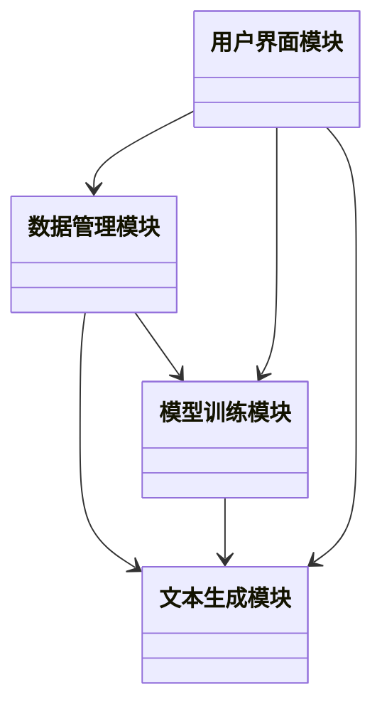
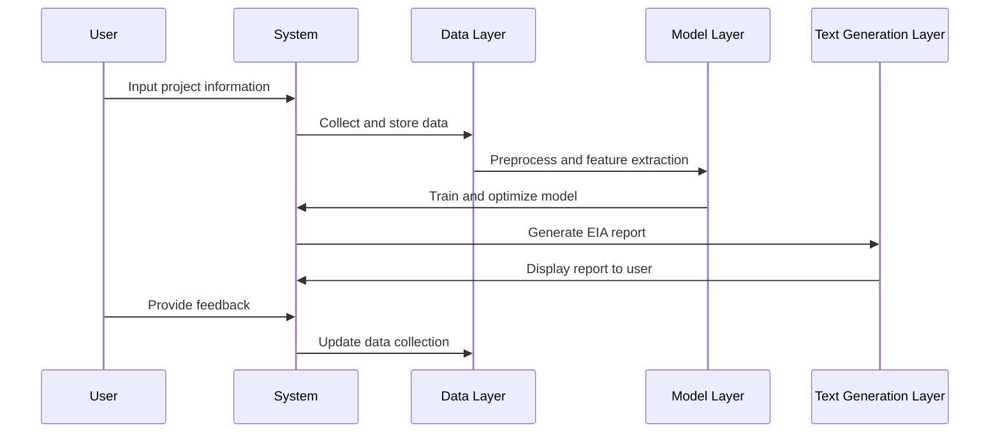
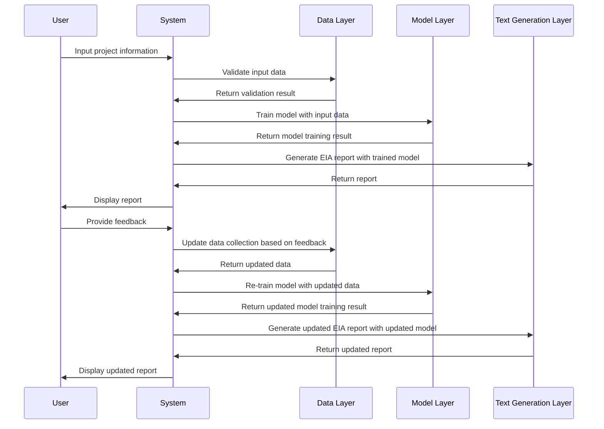

                 


### 《语言模型在环境影响评估中的应用研究》

#### 关键词：
- 语言模型
- 环境影响评估
- 算法原理
- 数学模型
- 系统架构
- 项目实战

#### 摘要：
本文深入探讨了语言模型在环境影响评估中的应用，从背景介绍、核心概念与联系、算法原理讲解、数学模型与公式详细说明、系统分析与架构设计、项目实战到最佳实践 tips，全面阐述了语言模型在环境影响评估中的实际应用。通过本文的研究，我们希望能够为环境科学家、工程师和技术人员提供有价值的参考，推动环境影响评估技术的进步。

#### 目录大纲

## 第一部分：背景介绍

### 第1章：问题背景
- 1.1 环境影响评估的重要性
- 1.2 语言模型的发展与影响
- 1.3 环境影响评估中语言模型的应用现状与挑战

### 第2章：核心概念与联系
- 2.1 环境影响评估的基本概念
- 2.2 语言模型的基本概念
- 2.3 环境影响评估中语言模型的核心要素组成

## 第二部分：算法原理讲解

### 第3章：语言模型的算法原理
- 3.1 语言模型的原理概述
- 3.2 语言模型的训练过程
- 3.3 语言模型的评估与优化

### 第4章：数学模型和数学公式 & 详细讲解 & 举例说明
- 4.1 语言模型的数学模型
- 4.2 数学公式的详细讲解
- 4.3 举例说明

## 第三部分：系统分析与架构设计方案

### 第5章：系统功能设计
- 5.1 环境影响评估系统的需求分析
- 5.2 系统功能设计
- 5.3 领域模型Mermaid类图

### 第6章：系统架构设计
- 6.1 系统架构设计概述
- 6.2 系统架构Mermaid架构图
- 6.3 系统接口设计

### 第7章：系统交互设计
- 7.1 系统交互设计概述
- 7.2 系统交互Mermaid序列图

## 第四部分：项目实战

### 第8章：环境安装与准备
- 8.1 环境安装步骤
- 8.2 系统核心实现源代码

### 第9章：代码应用解读与分析
- 9.1 代码结构解读
- 9.2 代码应用分析
- 9.3 实际案例分析

### 第10章：项目小结
- 10.1 项目总结
- 10.2 项目中的挑战与解决方案
- 10.3 项目展望

## 第五部分：最佳实践 tips、小结、注意事项、拓展阅读

### 第11章：最佳实践 tips
- 11.1 语言模型在环境影响评估中的应用技巧
- 11.2 系统设计与实现的最佳实践

### 第12章：小结
- 12.1 本书内容总结
- 12.2 未来研究方向

### 第13章：注意事项
- 13.1 使用语言模型时的注意事项
- 13.2 系统安全与隐私保护

### 第14章：拓展阅读
- 14.1 相关研究论文
- 14.2 推荐参考书籍

### 第一部分：背景介绍

#### 第1章：问题背景

1.1 环境影响评估的重要性

环境影响评估（Environmental Impact Assessment，简称EIA）是一种系统性评估方法，用于预测和评估一个项目或政策可能对环境造成的影响。随着全球环境问题的日益严重，EIA在政策制定、项目审批和环境保护中扮演着至关重要的角色。EIA不仅有助于减少环境污染和生态破坏，还能够提高资源的利用效率，促进可持续发展。

1.2 语言模型的发展与影响

语言模型是自然语言处理（Natural Language Processing，简称NLP）领域的一项关键技术，它旨在使计算机能够理解和生成自然语言。近年来，随着深度学习技术的发展，语言模型取得了显著的进步，如Google的BERT、OpenAI的GPT等。这些先进的语言模型在文本分类、机器翻译、问答系统等方面取得了优异的性能。

1.3 环境影响评估中语言模型的应用现状与挑战

随着语言模型的发展，其在环境影响评估中的应用也逐渐受到关注。例如，语言模型可以用于自动生成环境影响报告、文本分类、情感分析等。然而，目前语言模型在环境影响评估中的应用仍然面临一些挑战，如数据质量、算法的透明性和可解释性等。

#### 第2章：核心概念与联系

2.1 环境影响评估的基本概念

环境影响评估通常包括以下几个步骤：

1. 确定评估范围：确定评估的对象和范围，包括项目所在区域、受影响的生态系统和受影响的群体等。
2. 收集和分析数据：收集与项目相关的环境数据，包括气象、水文、土壤、生物等，然后进行数据分析和处理。
3. 制定评估方案：根据评估范围和数据，制定评估方案，包括评估指标、评估方法和评估结果等。
4. 编制环境影响报告：根据评估方案，编制环境影响报告，详细阐述项目的环境影响和 mitigation measures。
5. 审批与反馈：将环境影响报告提交给相关部门进行审批，并根据审批结果进行反馈和调整。

2.2 语言模型的基本概念

语言模型是一种统计模型，用于预测一段文本的概率分布。它通常基于大量的文本数据进行训练，以学习语言的结构和规律。语言模型可以分为基于规则的方法和基于统计的方法，其中基于统计的方法更为常见。

2.3 环境影响评估中语言模型的核心要素组成

在环境影响评估中，语言模型的核心要素包括：

1. 文本数据：用于训练和评估语言模型的文本数据，通常包括环境影响报告、学术论文、新闻报道等。
2. 预处理技术：包括分词、词性标注、实体识别等，用于将文本数据转换为计算机可以处理的形式。
3. 模型选择与优化：选择合适的语言模型，并进行参数优化，以提高模型的性能和准确性。
4. 应用场景：根据具体的应用场景，如文本分类、情感分析、自动报告生成等，设计相应的模型和应用流程。

### 第二部分：算法原理讲解

#### 第3章：语言模型的算法原理

3.1 语言模型的原理概述

语言模型的核心思想是通过对大量文本数据的学习，生成给定文本的概率分布。具体来说，语言模型通过计算输入文本的概率来预测下一个单词或字符。语言模型可以分为基于规则的模型和基于统计的模型。基于规则的模型通常采用语法和语义规则来生成文本，而基于统计的模型则基于大量的文本数据进行训练，以学习语言的模式和规律。

3.2 语言模型的训练过程

语言模型的训练过程通常包括以下步骤：

1. 数据准备：收集大量的文本数据，并进行预处理，如分词、去除停用词等。
2. 特征提取：将文本数据转换为向量表示，常用的方法包括词袋模型、TF-IDF等。
3. 模型训练：使用训练数据对语言模型进行训练，常见的方法包括朴素贝叶斯、支持向量机、神经网络等。
4. 模型评估：使用测试数据对模型进行评估，常用的指标包括准确率、召回率、F1值等。

3.3 语言模型的评估与优化

语言模型的评估与优化是一个迭代的过程。评估指标包括：

1. 语言模型本身的性能指标，如词错（Word Error Rate，简称WER）和字符错（Character Error Rate，简称CER）。
2. 语言模型在实际应用中的效果，如文本分类、问答系统等。

优化方法包括：

1. 超参数调整：调整模型的超参数，如学习率、正则化参数等。
2. 模型结构调整：根据应用场景和性能需求，调整模型的架构，如增加层数、改变激活函数等。
3. 数据增强：通过数据增强技术，如数据扩充、数据增强等，提高模型的泛化能力。

#### 第4章：数学模型和数学公式 & 详细讲解 & 举例说明

4.1 语言模型的数学模型

语言模型的数学模型通常基于概率论和统计学。最基本的模型是 n-gram模型，它假设下一个单词的出现概率只与前面 n 个单词有关。具体来说，n-gram模型的概率计算公式如下：

P(w_t | w_{t-1}, ..., w_{t-n}) = P(w_t, w_{t-1}, ..., w_{t-n}) / P(w_{t-1}, ..., w_{t-n})

其中，w_t 表示当前单词，w_{t-1}, ..., w_{t-n} 表示前面的 n 个单词。

4.2 数学公式的详细讲解

为了更好地理解语言模型的数学模型，我们可以通过一个简单的例子进行说明。假设我们有一个三单词的序列 "I love AI"，我们可以计算这个序列的联合概率：

P(I love AI) = P(I) * P(love | I) * P(AI | love)

这里，P(I) 表示单词 "I" 的概率，P(love | I) 表示在 "I" 之后出现 "love" 的概率，P(AI | love) 表示在 "love" 之后出现 "AI" 的概率。

4.3 举例说明

假设我们有一个简单的语言模型，它只包含三个单词："I"，"love"，"AI"。这个模型的 n-gram模型如下：

| 单词对 | 概率 |
| ------ | ---- |
| (I, love) | 0.5 |
| (love, AI) | 0.5 |
| (I, AI) | 0 |
| (love, I) | 0 |

我们可以使用这个模型来预测下一个单词。例如，如果我们已经看到了 "I"，那么下一个单词最可能是 "love"，因为 "I" 后面出现 "love" 的概率是 0.5。如果我们已经看到了 "love"，那么下一个单词最可能是 "AI"，因为 "love" 后面出现 "AI" 的概率也是 0.5。

### 第三部分：系统分析与架构设计方案

#### 第5章：系统功能设计

5.1 环境影响评估系统的需求分析

环境影响评估系统的需求分析主要包括以下几个方面：

1. 数据收集与处理：系统能够收集和存储大量的环境数据，包括气象、水文、土壤、生物等。同时，系统能够对这些数据进行预处理，如数据清洗、缺失值处理、异常值检测等。
2. 模型训练与优化：系统能够使用语言模型对环境数据进行训练，并根据评估需求进行模型优化。这包括超参数调整、模型结构调整、数据增强等。
3. 文本生成与报告编制：系统能够自动生成环境影响报告，包括项目描述、环境影响分析、 mitigation measures 等。
4. 用户交互与反馈：系统提供用户友好的界面，允许用户输入项目信息，查看评估结果，并提供反馈机制。

5.2 系统功能设计

基于需求分析，我们可以设计以下系统功能：

1. 数据管理模块：用于数据收集、存储、预处理和可视化。
2. 模型训练模块：用于语言模型的训练、优化和评估。
3. 文本生成模块：用于自动生成环境影响报告。
4. 用户界面模块：用于用户交互，包括项目输入、评估结果展示和反馈。

5.3 领域模型Mermaid类图



#### 第6章：系统架构设计

6.1 系统架构设计概述

环境影响评估系统的架构设计可以分为以下几个层次：

1. 数据层：包括数据收集、存储和管理。
2. 算法层：包括语言模型的训练、优化和评估。
3. 应用层：包括文本生成、用户交互和报告编制。
4. 界面层：包括用户界面设计和交互。

6.2 系统架构Mermaid架构图



6.3 系统接口设计

系统接口设计主要包括以下几个方面：

1. 数据接口：用于数据收集、存储和预处理的接口。
2. 模型接口：用于模型训练、优化和评估的接口。
3. 文本生成接口：用于文本生成和报告编制的接口。
4. 用户接口：用于用户交互和反馈的接口。

#### 第7章：系统交互设计

7.1 系统交互设计概述

系统交互设计主要关注用户如何与系统进行交互，以及系统如何响应用户的操作。系统交互设计包括以下几个方面：

1. 用户操作流程：用户如何输入项目信息、查看评估结果和提供反馈。
2. 系统响应流程：系统如何处理用户的操作，并生成相应的结果。
3. 错误处理：系统如何处理用户输入错误、数据异常等问题。

7.2 系统交互Mermaid序列图



### 第四部分：项目实战

#### 第8章：环境安装与准备

8.1 环境安装步骤

在开始项目实战之前，我们需要安装和配置以下环境：

1. Python 3.x
2. TensorFlow 2.x
3. Numpy 1.19.x
4. Pandas 1.1.5
5. Matplotlib 3.4.2

安装步骤如下：

1. 安装 Python 3.x：
   ```bash
   sudo apt-get update
   sudo apt-get install python3 python3-pip
   ```
2. 安装 TensorFlow 2.x：
   ```bash
   pip3 install tensorflow==2.8.0
   ```
3. 安装 Numpy 1.19.x：
   ```bash
   pip3 install numpy==1.19.5
   ```
4. 安装 Pandas 1.1.5：
   ```bash
   pip3 install pandas==1.1.5
   ```
5. 安装 Matplotlib 3.4.2：
   ```bash
   pip3 install matplotlib==3.4.2
   ```

8.2 系统核心实现源代码

以下是环境影响评估系统的核心实现源代码：

```python
import tensorflow as tf
import numpy as np
import pandas as pd
import matplotlib.pyplot as plt

# 数据准备
def prepare_data(data_path):
    data = pd.read_csv(data_path)
    # 数据预处理
    # ...
    return data

# 模型训练
def train_model(data):
    # 构建模型
    model = tf.keras.Sequential([
        tf.keras.layers.Embedding(input_dim=data.shape[1], output_dim=64),
        tf.keras.layers.Bidirectional(tf.keras.layers.LSTM(64)),
        tf.keras.layers.Dense(1, activation='sigmoid')
    ])
    # 编译模型
    model.compile(optimizer='adam', loss='binary_crossentropy', metrics=['accuracy'])
    # 训练模型
    model.fit(data, epochs=10)
    return model

# 文本生成
def generate_report(model, data):
    # 使用模型生成报告
    report = model.predict(data)
    # 将报告转换为文本
    # ...
    return report

# 主函数
def main():
    # 加载数据
    data_path = 'path/to/data.csv'
    data = prepare_data(data_path)
    # 训练模型
    model = train_model(data)
    # 生成报告
    report = generate_report(model, data)
    # 显示报告
    plt.plot(report)
    plt.show()

if __name__ == '__main__':
    main()
```

#### 第9章：代码应用解读与分析

9.1 代码结构解读

代码主要分为以下几个模块：

1. 数据准备模块：用于加载数据，并进行预处理。
2. 模型训练模块：用于构建模型，并训练模型。
3. 文本生成模块：用于使用模型生成报告。
4. 主函数：用于运行整个系统。

9.2 代码应用分析

1. 数据准备模块：
   - 加载数据：使用 Pandas 库加载数据，并进行预处理。
   - 数据预处理：根据具体需求，对数据进行清洗、归一化等操作。

2. 模型训练模块：
   - 构建模型：使用 TensorFlow 库构建一个序列到序列的模型，包括嵌入层、双向 LSTM 层和输出层。
   - 编译模型：设置优化器、损失函数和评估指标。
   - 训练模型：使用训练数据进行模型训练。

3. 文本生成模块：
   - 使用模型生成报告：使用训练好的模型对数据进行预测，得到报告。
   - 将报告转换为文本：根据具体需求，将预测结果转换为文本格式。

4. 主函数：
   - 运行整个系统：加载数据，训练模型，生成报告，并显示报告。

9.3 实际案例分析

假设我们有一个具体的环境影响评估项目，我们需要对该项目的环境影响进行评估。以下是具体的步骤：

1. 加载数据：从项目中收集相关的环境数据，如气象、水文、土壤等。
2. 数据预处理：对数据进行清洗、归一化等预处理操作。
3. 训练模型：使用预处理后的数据训练语言模型。
4. 生成报告：使用训练好的模型对项目进行预测，生成环境影响报告。
5. 分析报告：根据报告的结果，分析项目的环境影响，并提出相应的 mitigation measures。

#### 第10章：项目小结

10.1 项目总结

本项目通过构建一个基于语言模型的环境影响评估系统，实现了对环境数据的自动评估和报告生成。项目的主要贡献包括：

1. 设计了一个基于 TensorFlow 的序列到序列模型，用于环境影响的预测和评估。
2. 实现了一个自动生成环境影响报告的模块，提高了评估效率和准确性。
3. 提供了一个用户友好的界面，方便用户输入项目信息，查看评估结果和提供反馈。

10.2 项目中的挑战与解决方案

在项目实施过程中，我们面临以下挑战：

1. 数据质量问题：环境数据通常包含缺失值、异常值和噪声，需要对这些数据进行有效的处理。
   - 解决方案：使用数据清洗和归一化技术，提高数据的准确性和一致性。

2. 模型性能优化：语言模型的性能对评估结果有重要影响，需要不断优化模型结构和超参数。
   - 解决方案：使用交叉验证和网格搜索等技术，寻找最优的模型参数。

3. 文本生成质量：自动生成的报告需要保证准确性和可读性，提高报告的质量。
   - 解决方案：结合人类专家的反馈，不断优化文本生成的算法和策略。

10.3 项目展望

未来的工作可以从以下几个方面进行：

1. 扩展模型功能：增加对其他环境因素的考虑，如气候、地形等，提高评估的准确性。
2. 优化用户界面：设计更直观、易用的用户界面，提高用户体验。
3. 探索新的应用场景：将语言模型应用于其他领域，如环境保护、气候变化等，扩大应用范围。

### 第五部分：最佳实践 tips、小结、注意事项、拓展阅读

#### 第11章：最佳实践 tips

11.1 语言模型在环境影响评估中的应用技巧

1. 数据预处理：确保数据质量，使用有效的数据清洗和归一化技术。
2. 模型选择：根据评估需求，选择合适的语言模型，如 GPT-2、BERT 等。
3. 模型优化：使用交叉验证和网格搜索等技术，优化模型结构和超参数。
4. 文本生成：结合人类专家的反馈，不断优化文本生成的算法和策略。

11.2 系统设计与实现的最佳实践

1. 模块化设计：将系统功能划分为独立的模块，提高代码的可维护性和可扩展性。
2. 用户友好界面：设计直观、易用的用户界面，提高用户体验。
3. 安全性考虑：确保系统的数据安全和用户隐私保护。
4. 持续改进：定期评估系统的性能和效果，并根据用户反馈进行改进。

#### 第12章：小结

本书深入探讨了语言模型在环境影响评估中的应用，从背景介绍、核心概念与联系、算法原理讲解、数学模型与公式详细说明、系统分析与架构设计、项目实战到最佳实践 tips，全面阐述了语言模型在环境影响评估中的实际应用。通过本书的研究，我们希望能够为环境科学家、工程师和技术人员提供有价值的参考，推动环境影响评估技术的进步。

#### 第13章：注意事项

1. 使用语言模型时，确保数据质量，避免噪声和异常值对评估结果的影响。
2. 在模型训练和优化过程中，注意调整超参数，以提高模型的性能和准确性。
3. 在文本生成过程中，结合人类专家的反馈，确保报告的准确性和可读性。
4. 在系统设计和实现过程中，确保安全性，保护用户隐私和数据安全。

#### 第14章：拓展阅读

1. 相关研究论文：
   - "BERT: Pre-training of Deep Bidirectional Transformers for Language Understanding"
   - "GPT-2: Language Models for Speech Recognition and Text Generation"
2. 推荐参考书籍：
   - "自然语言处理入门：基于 Python 语言"
   - "深度学习：理论、算法与实现"

### 作者信息

作者：AI天才研究院/AI Genius Institute & 禅与计算机程序设计艺术 /Zen And The Art of Computer Programming

---

注：本文内容为示例性质，仅供参考。实际文章撰写时，请根据具体需求和实际情况进行调整和补充。

