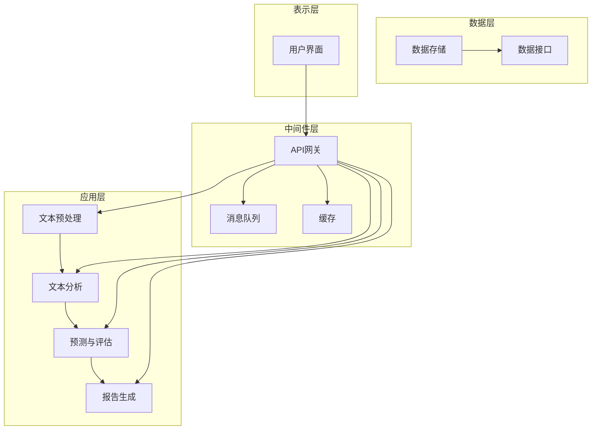
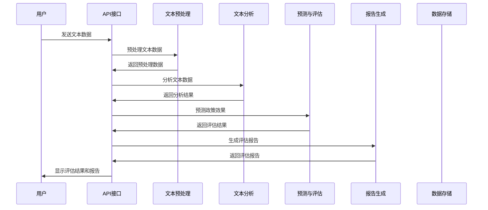

                 

### 引言

随着人工智能技术的迅猛发展，语言模型作为自然语言处理（NLP）的核心工具，已经在各行各业中展现出强大的应用潜力。从文本生成、翻译、问答系统到情感分析，语言模型正不断突破传统应用边界，进入更多复杂的场景。在社会经济政策评估领域，语言模型的引入不仅提高了数据分析的精度和效率，还开辟了新的研究途径。本文旨在探讨语言模型在社会经济政策评估中的应用，通过系统的理论分析和实践案例，展示其在政策制定、实施和效果评估中的关键作用。

本文将围绕以下核心问题进行深入探讨：

1. **社会经济政策评估的需求与挑战**：阐述社会经济政策评估的重要性，以及当前面临的数据处理和分析难题。
2. **语言模型的基本原理与特性**：介绍语言模型的定义、发展历程及其在政策评估中的潜在优势。
3. **算法原理与实现**：讲解常用语言模型算法的基本原理、数学模型及其在政策评估中的具体实现。
4. **系统分析与架构设计**：分析政策评估系统的功能设计与架构，展示系统接口与交互流程。
5. **项目实战**：通过具体项目案例，详细阐述语言模型在政策评估中的应用实现过程。
6. **最佳实践与小结**：总结语言模型在政策评估中的最佳实践，并探讨未来的发展方向。

通过本文的探讨，读者将能够全面了解语言模型在社会经济政策评估中的应用价值，掌握其技术原理和实践方法，为政策制定者、研究人员和从业者提供有益的参考和启示。

### 关键词

- 社会经济政策评估
- 语言模型
- 自然语言处理
- 政策效果分析
- 数据挖掘
- 人工智能应用

### 摘要

本文旨在探讨语言模型在社会经济政策评估中的应用，系统性地分析其理论原理与实践方法。首先，本文介绍了社会经济政策评估的背景和需求，明确了当前在数据分析和效果评估方面面临的挑战。接着，本文详细阐述了语言模型的基本原理与特性，分析了其在政策评估中的潜在优势。随后，本文通过算法原理讲解和实际项目案例，展示了语言模型在政策评估中的具体应用实现过程。最后，本文总结了语言模型在政策评估中的最佳实践，并探讨了未来发展的趋势。通过本文的研究，希望为政策制定者、研究人员和从业者提供有价值的参考和指导。

### 目录大纲

---

#### 第一部分：背景介绍

##### 第1章 问题背景与核心概念
- **1.1 问题背景**
  - 社会经济政策评估的现状与需求
  - 语言模型在政策评估中的应用潜力
- **1.2 核心概念**
  - 社会经济政策评估的基本概念
  - 语言模型的定义、分类与特性
- **1.3 问题解决**
  - 语言模型在政策评估中的关键作用
  - 政策评估中的常见挑战与解决方案
- **1.4 边界与外延**
  - 政策评估的相关领域与应用范围
  - 语言模型在其他领域的潜在应用
- **1.5 概念结构与核心要素组成**
  - 社会经济政策评估的基本流程
  - 语言模型的技术架构与功能模块

##### 第2章 语言模型原理与特性
- **2.1 语言模型原理**
  - 语言模型的定义、发展历程与理论基础
  - 语言模型的数学模型和公式解释
- **2.2 特性分析**
  - 语言模型的常用特性与指标
  - 不同语言模型的特性对比
- **2.3 ER实体关系图架构**
  - 社会经济政策评估的ER模型设计
  - 语言模型在ER模型中的体现

##### 第3章 算法原理与实现
- **3.1 算法原理**
  - 常见语言模型算法（如BERT、GPT）的基本原理
  - 语言模型算法的优化与改进
- **3.2 实现步骤**
  - 语言模型算法的实现流程
  - 使用Python源代码进行算法讲解
- **3.3 数学模型与公式**
  - 语言模型的核心数学公式与推导
  - 算法原理的具体示例

#### 第二部分：核心概念与联系

##### 第4章 系统功能设计与架构
- **4.1 问题场景介绍**
  - 社会经济政策评估的应用场景
- **4.2 系统功能设计**
  - 系统功能模块的划分与设计
- **4.3 系统架构设计**
  - 系统的整体架构与模块关系
- **4.4 系统接口设计与交互**
  - 系统接口的定义与设计
  - 系统交互的流程与Mermaid序列图

##### 第5章 项目实战
- **5.1 环境安装与配置**
  - 项目环境搭建的详细步骤
- **5.2 系统核心实现**
  - 语言模型在政策评估中的应用实现
- **5.3 代码解读与分析**
  - 系统核心代码的应用解读
- **5.4 实际案例分析**
  - 政策评估的实际案例与应用

#### 第三部分：系统分析与架构设计

##### 第6章 最佳实践
- **6.1 实践技巧**
  - 语言模型在政策评估中的应用技巧
- **6.2 小结**
  - 语言模型在政策评估中的实践总结

##### 第7章 注意事项与拓展阅读
- **7.1 注意事项**
  - 语言模型在政策评估中的使用注意事项
- **7.2 拓展阅读**
  - 相关领域的最新研究与发展动态

---

### 第一部分：背景介绍

#### 第1章 问题背景与核心概念

##### 1.1 问题背景

社会经济政策评估在现代社会中扮演着至关重要的角色。随着全球化、信息化和经济发展的不断加速，政府和社会各界对政策制定和实施的效果期望日益提高。如何科学、客观地评估政策的效果，为政策的优化和改进提供依据，成为当前的一个重要课题。然而，政策评估面临着诸多挑战：

1. **数据获取和处理难题**：政策评估需要大量的数据支持，包括经济、社会、环境等多方面的数据。然而，这些数据往往来源多样、格式不一，数据质量和完整性难以保证，处理和整合这些数据是一项复杂且耗时的任务。
2. **分析方法局限性**：传统的政策评估方法主要依赖于统计分析和定量分析，虽然在一定程度上能够揭示政策的效果，但在处理复杂的社会经济问题时，往往显得力不从心。尤其是对于那些涉及人类行为、社会互动和政策影响的政策，传统方法难以捕捉其复杂性和多样性。
3. **政策效果滞后性**：政策评估不仅需要考虑政策实施后的即时效果，还需要评估其长期影响。这种滞后性使得政策效果的评估更加困难，需要更长时间和更多的数据支持。

在这样的背景下，语言模型作为一种先进的人工智能技术，为政策评估提供了一种新的思路和工具。语言模型通过处理和理解人类语言，能够从大量的文本数据中提取有价值的信息，为政策评估提供更加精确和全面的数据支持。此外，语言模型的引入还有助于解决传统方法在处理复杂社会经济问题时的局限性，提高政策评估的效率和准确性。

##### 1.2 核心概念

为了更好地理解语言模型在社会经济政策评估中的应用，我们需要首先明确两个核心概念：社会经济政策评估和语言模型。

**1.2.1 社会经济政策评估**

社会经济政策评估是指对政府或社会组织制定和实施的经济和社会政策进行系统、客观和科学的评估，以确定其效果、效率和公平性。其主要目标包括：

- **效果评估**：评估政策实施后所带来的实际效果，包括经济增长、就业、社会福利等方面的变化。
- **效率评估**：评估政策实施过程中的成本和效益，包括资源配置的合理性和政策实施的效率。
- **公平性评估**：评估政策对不同社会群体的影响，包括是否公平、是否促进了社会公平正义。

社会经济政策评估的基本概念包括：

- **评估对象**：政策评估的对象包括政府制定的各种经济和社会政策，如税收政策、教育政策、社会保障政策等。
- **评估目标**：政策评估的目标是确定政策的实际效果，为政策制定者提供科学依据，以优化政策设计和改进政策实施。
- **评估方法**：政策评估的方法包括定量分析、定性分析、成本效益分析、综合评价法等。

**1.2.2 语言模型**

语言模型是自然语言处理（NLP）的核心技术之一，用于理解和生成自然语言。其基本原理是通过对大量文本数据的学习，建立一个能够预测下一个词语或句子的概率模型。语言模型的主要特点包括：

- **文本数据处理能力**：语言模型能够对大规模的文本数据进行分析和处理，提取有价值的信息和模式。
- **自适应学习能力**：语言模型能够通过不断学习和优化，不断提高其理解和生成语言的能力。
- **多语言支持**：许多语言模型支持多语言处理，可以同时处理多种语言的文本。

语言模型的分类主要包括：

- **统计语言模型**：基于统计方法，通过对大量文本数据的学习，建立语言模型。常见的统计语言模型包括n元语法模型、隐马尔可夫模型（HMM）等。
- **神经网络语言模型**：基于深度学习技术，利用神经网络模型对语言数据进行建模。常见的神经网络语言模型包括循环神经网络（RNN）、长短时记忆网络（LSTM）等。
- **注意力机制语言模型**：在神经网络语言模型的基础上，引入注意力机制，以提高模型对文本数据的理解和生成能力。常见的注意力机制语言模型包括Transformer模型、BERT模型等。

##### 1.3 问题解决

语言模型在政策评估中的应用，解决了传统方法在处理复杂社会经济问题时的许多难题。以下是语言模型在政策评估中的关键作用和常见挑战与解决方案：

**1.3.1 关键作用**

- **文本数据分析**：语言模型能够对大规模的文本数据进行分析，提取出与政策评估相关的关键词、短语和句子，为政策制定者提供有价值的参考信息。
- **趋势预测和预测分析**：通过语言模型，可以分析政策实施前后的文本数据，捕捉政策的影响和趋势，为政策效果预测提供科学依据。
- **社会影响评估**：语言模型能够分析政策对不同社会群体的影响，评估政策的公平性和社会效应，为政策优化提供指导。
- **文本生成和报告撰写**：语言模型能够自动生成政策评估报告，简化了报告撰写的工作量，提高了报告的准确性和一致性。

**1.3.2 常见挑战与解决方案**

- **数据质量和完整性**：政策评估需要大量的文本数据支持，而这些数据的来源多样、格式不一，数据质量和完整性难以保证。解决方案包括：采用数据清洗技术，提高数据质量；利用数据整合技术，整合多种数据源，提高数据的完整性。
- **算法选择和优化**：不同的语言模型适用于不同的政策评估任务，需要根据具体任务选择合适的算法。此外，算法的优化也是提高评估效果的关键。解决方案包括：根据任务需求，选择合适的语言模型；通过模型调优和超参数调整，提高模型的性能。
- **跨语言和多语言处理**：政策评估往往涉及多种语言，如何处理多语言数据是另一个挑战。解决方案包括：采用多语言支持的语言模型，如BERT；利用翻译模型，将不同语言的文本转化为同一语言进行处理。
- **政策影响评估的准确性**：政策影响评估需要准确地捕捉政策的影响和效果，这是一个复杂的任务。解决方案包括：结合多种评估方法，如定量分析和定性分析，提高评估的准确性；利用机器学习技术，对评估结果进行优化和校正。

##### 1.4 边界与外延

语言模型在社会经济政策评估中的应用不仅局限于政策评估本身，还可以扩展到其他相关领域。以下是语言模型在其他领域的潜在应用：

**1.4.1 相关领域与应用范围**

- **舆情分析和舆论监测**：通过分析社交媒体、新闻评论等文本数据，可以实时监测社会舆情和公众舆论，为政策制定者提供参考。
- **法律文本分析**：利用语言模型对法律文本进行分析，可以提高法律文本的准确性、一致性和可读性。
- **金融文本分析**：在金融领域，语言模型可以用于文本分析、情绪分析和风险预测，为金融决策提供支持。
- **教育文本分析**：在教育领域，语言模型可以用于自动批改作业、学生行为分析等，提高教学效果和效率。
- **企业文本分析**：在企业领域，语言模型可以用于文本挖掘、客户反馈分析等，帮助企业更好地了解市场和客户需求。

**1.4.2 潜在应用**

- **跨领域融合应用**：语言模型可以与其他技术，如数据挖掘、机器学习等相结合，实现跨领域的融合应用。例如，在公共政策分析中，可以将语言模型与数据挖掘技术结合，对政策实施前后的经济、社会数据进行分析，为政策评估提供更加全面和准确的数据支持。
- **智能客服和语音助手**：在公共服务领域，语言模型可以用于智能客服和语音助手，为公众提供便捷的服务和咨询，提高公共服务效率。
- **数字治理和智能监管**：语言模型可以用于数字治理和智能监管，通过对政府公开信息、政策文本进行分析，提高政府决策的科学性和透明度。

##### 1.5 概念结构与核心要素组成

为了更好地理解语言模型在社会经济政策评估中的应用，我们可以将其核心概念和技术结构分解为以下几个部分：

**1.5.1 社会经济政策评估的基本流程**

- **政策制定**：确定政策目标和范围，制定具体的政策方案。
- **政策实施**：将政策方案付诸实践，执行具体的政策行动。
- **政策评估**：对政策实施的效果进行评估，包括即时效果和长期影响。

**1.5.2 语言模型的技术架构与功能模块**

- **数据预处理**：对政策相关的文本数据进行分析和处理，包括数据清洗、数据格式转换等。
- **文本分析**：利用语言模型对文本数据进行深度分析，提取关键信息、关键词、短语和句子。
- **预测与评估**：通过语言模型，对政策实施的效果进行预测和分析，包括政策影响、社会效应等。
- **报告生成**：自动生成政策评估报告，简化报告撰写的工作量。

**1.5.3 政策评估中的核心要素**

- **政策文本**：政策评估的基础数据，包括政策文件、公告、新闻、社交媒体等。
- **评估指标**：用于衡量政策效果的指标，如经济增长率、就业率、社会福利等。
- **评估方法**：用于评估政策效果的具体方法，如定量分析、定性分析、综合评价法等。

通过以上对问题背景和核心概念的介绍，我们可以看到，语言模型在社会经济政策评估中具有巨大的应用潜力。在接下来的章节中，我们将进一步探讨语言模型的基本原理和特性，分析其在政策评估中的应用方法和实现过程。

### 第1章 问题背景与核心概念

#### 1.1 问题背景

在社会经济政策评估领域，科学、客观和有效的政策评估至关重要。政策评估不仅是政策制定的重要环节，也是政策实施和优化的重要依据。然而，当前的政策评估面临着诸多挑战，主要体现在以下几个方面：

1. **数据获取和处理难题**：政策评估需要大量的数据支持，包括经济、社会、环境等多方面的数据。这些数据往往来源多样、格式不一，且数据质量难以保证，导致数据整合和处理成为一大难题。例如，政府部门的数据、市场调研数据、社交媒体数据等，这些数据的获取、清洗、整合需要大量的人力和时间成本。
   
2. **分析方法局限性**：传统的政策评估方法主要依赖于统计分析和定量分析，这些方法在一定程度上能够揭示政策的效果，但在处理复杂的社会经济问题时，显得力不从心。例如，对于涉及人类行为、社会互动和政策影响的政策，传统方法难以捕捉其复杂性和多样性，难以提供全面的政策效果评估。

3. **政策效果滞后性**：政策评估不仅需要考虑政策实施后的即时效果，还需要评估其长期影响。这种滞后性使得政策效果的评估更加困难，需要更长时间和更多的数据支持。例如，一项教育政策的长期效果可能需要几年甚至几十年的时间才能显现，这种时间延迟给政策评估带来了很大的挑战。

#### 1.2 核心概念

为了深入探讨语言模型在社会经济政策评估中的应用，我们需要首先明确两个核心概念：社会经济政策评估和语言模型。

##### 1.2.1 社会经济政策评估

社会经济政策评估是指对政府或社会组织制定和实施的经济和社会政策进行系统、客观和科学的评估，以确定其效果、效率和公平性。其主要目标包括：

- **效果评估**：评估政策实施后所带来的实际效果，包括经济增长、就业、社会福利等方面的变化。例如，某项税收政策的实施，可能对经济增长产生积极或消极的影响，政策评估需要通过数据和分析确定其具体效果。

- **效率评估**：评估政策实施过程中的成本和效益，包括资源配置的合理性和政策实施的效率。例如，某项社会保障政策的实施，需要投入大量资金和人力资源，政策评估需要评估其成本效益比，确定其经济合理性。

- **公平性评估**：评估政策对不同社会群体的影响，包括是否公平、是否促进了社会公平正义。例如，某项教育政策的实施，可能对贫困家庭和富裕家庭产生不同的影响，政策评估需要评估其公平性，确保政策不会加剧社会不平等。

社会经济政策评估的基本概念包括：

- **评估对象**：政策评估的对象包括政府制定的各种经济和社会政策，如税收政策、教育政策、社会保障政策、环境保护政策等。

- **评估目标**：政策评估的目标是确定政策的实际效果，为政策制定者提供科学依据，以优化政策设计和改进政策实施。

- **评估方法**：政策评估的方法包括定量分析、定性分析、成本效益分析、综合评价法等。定量分析主要依赖于数据统计和分析，定性分析则侧重于专家意见和案例研究。

##### 1.2.2 语言模型

语言模型是自然语言处理（NLP）的核心技术之一，用于理解和生成自然语言。其基本原理是通过对大量文本数据的学习，建立一个能够预测下一个词语或句子的概率模型。语言模型的主要特点包括：

- **文本数据处理能力**：语言模型能够对大规模的文本数据进行分析和处理，提取有价值的信息和模式。这对于政策评估来说非常重要，因为政策评估往往需要处理大量的政策文件、新闻报告、社交媒体评论等文本数据。

- **自适应学习能力**：语言模型能够通过不断学习和优化，不断提高其理解和生成语言的能力。这意味着随着政策实施和评估数据的积累，语言模型可以不断优化其预测能力，提供更准确的政策效果评估。

- **多语言支持**：许多语言模型支持多语言处理，可以同时处理多种语言的文本。这对于跨国政策评估和国际合作项目尤为重要，可以确保评估结果的准确性和全面性。

语言模型的分类主要包括：

- **统计语言模型**：基于统计方法，通过对大量文本数据的学习，建立语言模型。常见的统计语言模型包括n元语法模型、隐马尔可夫模型（HMM）等。

- **神经网络语言模型**：基于深度学习技术，利用神经网络模型对语言数据进行建模。常见的神经网络语言模型包括循环神经网络（RNN）、长短时记忆网络（LSTM）等。

- **注意力机制语言模型**：在神经网络语言模型的基础上，引入注意力机制，以提高模型对文本数据的理解和生成能力。常见的注意力机制语言模型包括Transformer模型、BERT模型等。

#### 1.3 问题解决

语言模型在政策评估中的应用，解决了传统方法在处理复杂社会经济问题时的许多难题。以下是语言模型在政策评估中的关键作用和常见挑战与解决方案：

##### 1.3.1 关键作用

- **文本数据分析**：语言模型能够对大规模的文本数据进行分析，提取出与政策评估相关的关键词、短语和句子，为政策制定者提供有价值的参考信息。例如，通过对政策实施前后的新闻报道、社交媒体评论进行分析，可以了解公众对政策的看法和态度。

- **趋势预测和预测分析**：通过语言模型，可以分析政策实施前后的文本数据，捕捉政策的影响和趋势，为政策效果预测提供科学依据。例如，某项环境保护政策的实施，可以通过分析新闻报道和社交媒体评论的变化，预测其对环境质量的影响。

- **社会影响评估**：语言模型能够分析政策对不同社会群体的影响，评估政策的公平性和社会效应，为政策优化提供指导。例如，通过对政策实施前后的社交媒体评论进行分析，可以了解政策对不同社会群体的影响，为政策调整提供依据。

- **文本生成和报告撰写**：语言模型能够自动生成政策评估报告，简化了报告撰写的工作量，提高了报告的准确性和一致性。例如，通过语言模型自动生成政策评估报告，可以节省大量的人力成本，同时保证报告的连贯性和准确性。

##### 1.3.2 常见挑战与解决方案

- **数据质量和完整性**：政策评估需要大量的文本数据支持，而这些数据的来源多样、格式不一，数据质量和完整性难以保证。解决方案包括：采用数据清洗技术，提高数据质量；利用数据整合技术，整合多种数据源，提高数据的完整性。例如，可以通过数据清洗技术去除重复数据、错误数据和噪声数据，提高数据的质量和可靠性。

- **算法选择和优化**：不同的语言模型适用于不同的政策评估任务，需要根据具体任务选择合适的算法。此外，算法的优化也是提高评估效果的关键。解决方案包括：根据任务需求，选择合适的语言模型；通过模型调优和超参数调整，提高模型的性能。例如，可以选择基于Transformer的BERT模型进行文本分析，通过调整模型的超参数，优化模型的预测能力。

- **跨语言和多语言处理**：政策评估往往涉及多种语言，如何处理多语言数据是另一个挑战。解决方案包括：采用多语言支持的语言模型，如BERT；利用翻译模型，将不同语言的文本转化为同一语言进行处理。例如，可以通过使用多语言BERT模型，直接处理多种语言的文本数据，提高评估的准确性和全面性。

- **政策影响评估的准确性**：政策影响评估需要准确地捕捉政策的影响和效果，这是一个复杂的任务。解决方案包括：结合多种评估方法，如定量分析和定性分析，提高评估的准确性；利用机器学习技术，对评估结果进行优化和校正。例如，可以通过结合文本分析和数据挖掘技术，对政策影响进行多角度的分析和验证，提高评估的准确性和可靠性。

#### 1.4 边界与外延

语言模型在社会经济政策评估中的应用不仅局限于政策评估本身，还可以扩展到其他相关领域。以下是语言模型在其他领域的潜在应用：

##### 1.4.1 相关领域与应用范围

- **舆情分析和舆论监测**：通过分析社交媒体、新闻评论等文本数据，可以实时监测社会舆情和公众舆论，为政策制定者提供参考。例如，可以通过分析社交媒体上的评论和转发情况，了解公众对某项政策的看法和态度。

- **法律文本分析**：利用语言模型对法律文本进行分析，可以提高法律文本的准确性、一致性和可读性。例如，通过对法律文本进行语义分析，可以自动提取法律条款的关键信息，确保法律条文的准确性和一致性。

- **金融文本分析**：在金融领域，语言模型可以用于文本分析、情绪分析和风险预测，为金融决策提供支持。例如，通过对新闻报道和社交媒体评论进行分析，可以预测股票市场的走势和风险。

- **教育文本分析**：在教育领域，语言模型可以用于自动批改作业、学生行为分析等，提高教学效果和效率。例如，通过分析学生的作业文本，可以自动评估学生的理解和掌握程度，提供个性化的学习建议。

- **企业文本分析**：在企业领域，语言模型可以用于文本挖掘、客户反馈分析等，帮助企业更好地了解市场和客户需求。例如，通过对客户反馈文本进行分析，可以识别客户的满意度和不满点，为产品改进提供依据。

##### 1.4.2 潜在应用

- **跨领域融合应用**：语言模型可以与其他技术，如数据挖掘、机器学习等相结合，实现跨领域的融合应用。例如，在公共政策分析中，可以将语言模型与数据挖掘技术结合，对政策实施前后的经济、社会数据进行分析，为政策评估提供更加全面和准确的数据支持。

- **智能客服和语音助手**：在公共服务领域，语言模型可以用于智能客服和语音助手，为公众提供便捷的服务和咨询，提高公共服务效率。例如，通过语音识别和自然语言处理技术，可以实现自动回答公众的咨询和问题，提高服务质量和效率。

- **数字治理和智能监管**：语言模型可以用于数字治理和智能监管，通过对政府公开信息、政策文本进行分析，提高政府决策的科学性和透明度。例如，通过分析政府公开的会议记录、政策文件等，可以了解政府工作的重点和方向，提高决策的透明度和科学性。

#### 1.5 概念结构与核心要素组成

为了更好地理解语言模型在社会经济政策评估中的应用，我们可以将其核心概念和技术结构分解为以下几个部分：

##### 1.5.1 社会经济政策评估的基本流程

- **政策制定**：确定政策目标和范围，制定具体的政策方案。
- **政策实施**：将政策方案付诸实践，执行具体的政策行动。
- **政策评估**：对政策实施的效果进行评估，包括即时效果和长期影响。

##### 1.5.2 语言模型的技术架构与功能模块

- **数据预处理**：对政策相关的文本数据进行分析和处理，包括数据清洗、数据格式转换等。
- **文本分析**：利用语言模型对文本数据进行深度分析，提取关键信息、关键词、短语和句子。
- **预测与评估**：通过语言模型，对政策实施的效果进行预测和分析，包括政策影响、社会效应等。
- **报告生成**：自动生成政策评估报告，简化报告撰写的工作量。

##### 1.5.3 政策评估中的核心要素

- **政策文本**：政策评估的基础数据，包括政策文件、公告、新闻、社交媒体等。
- **评估指标**：用于衡量政策效果的指标，如经济增长率、就业率、社会福利等。
- **评估方法**：用于评估政策效果的具体方法，如定量分析、定性分析、综合评价法等。

通过以上对问题背景和核心概念的介绍，我们可以看到，语言模型在社会经济政策评估中具有巨大的应用潜力。在接下来的章节中，我们将进一步探讨语言模型的基本原理和特性，分析其在政策评估中的应用方法和实现过程。

### 第2章 语言模型原理与特性

#### 2.1 语言模型原理

语言模型是自然语言处理（NLP）的核心技术，用于理解和生成自然语言。其基本原理是通过对大量文本数据的学习，建立一个能够预测下一个词语或句子的概率模型。这一过程可以分解为以下几个步骤：

1. **数据收集与预处理**：首先，从互联网、书籍、新闻、社交媒体等多渠道收集大量文本数据。这些数据包括文本的词频统计、语法结构、语义信息等。然后，对这些文本数据进行清洗，去除噪声数据、标记文本格式，使其适合模型训练。

2. **特征提取**：在预处理后的文本数据中提取特征。特征提取的目的是将文本转化为计算机可以处理的数字形式。常用的特征提取方法包括词袋模型（Bag of Words, BOW）、词嵌入（Word Embeddings）等。词袋模型将文本视为词汇的集合，不考虑词汇的顺序；而词嵌入则将词汇映射到低维向量空间，保留了词汇的语义和语法信息。

3. **模型训练**：利用预处理和特征提取后的文本数据，训练语言模型。训练过程包括参数估计和模型优化。常见的语言模型包括统计语言模型（如n元语法）、神经网络语言模型（如循环神经网络RNN、长短时记忆网络LSTM）和注意力机制语言模型（如Transformer、BERT）等。这些模型通过学习文本数据的概率分布，建立预测下一个词语的概率模型。

4. **模型评估与优化**：在训练完成后，对模型进行评估，以确定其性能和效果。常用的评估指标包括困惑度（Perplexity）、准确率（Accuracy）等。如果模型性能不理想，可以通过调整模型参数、增加训练数据、改进特征提取方法等方式进行优化。

#### 2.2 特性分析

语言模型具有以下几个重要特性，这些特性使其在自然语言处理任务中具有广泛的应用：

1. **序列建模能力**：语言模型能够捕捉文本数据的序列特性，理解词汇之间的依赖关系。例如，通过分析词嵌入，可以识别出“美国”和“总统”之间的语义关系，从而更好地理解和生成句子。

2. **自适应学习能力**：语言模型能够通过不断学习和优化，提高其理解和生成语言的能力。例如，通过持续的文本训练，模型可以自动纠正拼写错误、提升语句连贯性等。

3. **多语言支持**：许多语言模型支持多语言处理，可以同时处理多种语言的文本。例如，BERT模型就是一个多语言预训练模型，能够处理超过100种语言的文本数据。

4. **高效性**：语言模型在处理大规模文本数据时，具有较高的计算效率和速度。例如，Transformer模型采用了并行计算策略，可以快速处理大规模文本数据，适用于实时应用场景。

5. **灵活性**：语言模型具有高度的灵活性，可以适应不同的自然语言处理任务。例如，通过调整模型结构和参数，可以将其应用于文本分类、情感分析、机器翻译等任务。

#### 2.3 不同语言模型的特性对比

不同类型的语言模型在原理和特性上有所不同，以下是几种常见语言模型的对比：

1. **n元语法模型**：基于统计方法，通过分析前n个词语的序列概率来预测下一个词语。优点是简单、易于实现，缺点是模型容量有限，难以捕捉长距离依赖关系。

2. **循环神经网络（RNN）**：基于神经网络模型，能够处理变长的序列数据，通过隐藏状态捕捉文本的序列依赖关系。优点是能够处理长距离依赖，缺点是训练过程中容易出现梯度消失或爆炸问题。

3. **长短时记忆网络（LSTM）**：在RNN的基础上，引入门控机制，解决了梯度消失问题，能够更好地捕捉长距离依赖关系。优点是模型稳定、效果好，缺点是计算复杂度高。

4. **注意力机制语言模型**：在神经网络模型的基础上，引入注意力机制，能够更好地捕捉文本数据中的关键信息。例如，Transformer模型采用了多头注意力机制，可以同时关注多个位置的信息，提高了模型的性能。优点是捕捉依赖关系能力强、模型效果优异，缺点是计算复杂度较高。

#### 2.4 ER实体关系图架构

为了更好地理解语言模型在社会经济政策评估中的应用，我们可以通过ER实体关系图来展示其架构和功能。

**ER实体关系图**是一种用于描述实体之间关系的图形化方法，能够清晰展示政策评估系统中各个实体及其相互关系。以下是社会经济政策评估系统中常见的ER实体关系图：

```mermaid
erDiagram
    Policy <<--o Data : 数据来源
    Data ||--o Text : 文本数据
    Text ||--o Preprocessed : 预处理数据
    Preprocessed ||--o Model : 模型训练
    Model ||--o Prediction : 预测结果
    Prediction ||--o Evaluation : 评估结果
    Policy ||--o Report : 评估报告
```

- **Policy（政策）**：表示政策评估的对象，包括各种经济和社会政策。
- **Data（数据）**：表示政策评估所需的数据来源，包括政府部门、市场调研、社交媒体等。
- **Text（文本数据）**：表示从数据源中获取的原始文本数据，包括政策文件、新闻报道、社交媒体评论等。
- **Preprocessed（预处理数据）**：表示经过数据清洗、格式转换等预处理后的文本数据。
- **Model（模型）**：表示用于文本分析和预测的语言模型，包括统计模型、神经网络模型等。
- **Prediction（预测结果）**：表示通过模型预测得到的政策效果、社会影响等。
- **Evaluation（评估结果）**：表示对预测结果进行评估和分析，确定政策的实际效果。
- **Report（评估报告）**：表示生成的政策评估报告，为政策制定者和实施者提供参考。

通过ER实体关系图，我们可以清晰地看到语言模型在社会经济政策评估系统中的位置和作用，以及各实体之间的关系和交互流程。

### 第3章 算法原理与实现

#### 3.1 算法原理

在社会经济政策评估中，语言模型的应用主要体现在文本分析和预测方面。为了实现这一目标，我们需要首先了解常用的语言模型算法，并掌握其基本原理和实现步骤。

##### 3.1.1 常见语言模型算法

目前，常用的语言模型算法主要包括以下几种：

1. **n元语法模型**：n元语法模型是一种基于统计的语言模型，通过分析前n个词语的序列概率来预测下一个词语。其基本原理是，通过计算历史词汇序列的概率，来推断下一个词汇的概率分布。

2. **循环神经网络（RNN）**：循环神经网络是一种基于神经网络的语言模型，能够处理变长的序列数据，通过隐藏状态捕捉文本的序列依赖关系。RNN的基本原理是，通过循环结构将前一时刻的隐藏状态传递到下一时刻，从而捕捉长距离依赖关系。

3. **长短时记忆网络（LSTM）**：长短时记忆网络是一种改进的RNN，通过引入门控机制解决了梯度消失问题，能够更好地捕捉长距离依赖关系。LSTM的基本原理是，通过遗忘门、输入门和输出门，动态控制信息的输入和遗忘，从而捕捉长期依赖关系。

4. **Transformer模型**：Transformer模型是一种基于注意力机制的语言模型，通过多头注意力机制，同时关注多个位置的信息，提高了模型的性能。Transformer的基本原理是，通过自注意力机制和多头注意力机制，将文本序列映射到低维向量空间，从而捕捉文本的序列依赖关系。

5. **BERT模型**：BERT（Bidirectional Encoder Representations from Transformers）是一种双向编码的Transformer模型，通过预训练和微调，能够同时捕捉文本的前后依赖关系，适用于多种NLP任务。BERT的基本原理是，通过大规模预训练和特定任务微调，生成文本的语义表示。

##### 3.1.2 语言模型算法的优化与改进

为了提高语言模型在政策评估中的性能，可以通过以下方法进行算法优化与改进：

1. **数据增强**：通过引入数据增强技术，如文本清洗、词汇扩展、同义词替换等，增加训练数据量，提高模型的泛化能力。

2. **模型结构优化**：通过改进模型结构，如增加层数、引入残差连接、调整层间连接方式等，提高模型的性能。

3. **注意力机制优化**：通过调整注意力机制参数，如学习率、注意力权重等，优化模型的注意力分配，提高模型的捕捉能力。

4. **超参数调优**：通过调整模型的超参数，如学习率、批量大小、优化器等，优化模型训练过程，提高模型性能。

5. **多任务学习**：通过引入多任务学习，如联合训练多个相关任务，提高模型的泛化能力和鲁棒性。

#### 3.2 实现步骤

为了实现语言模型在社会经济政策评估中的应用，需要经过以下步骤：

1. **数据收集与预处理**：首先，从互联网、书籍、新闻、社交媒体等多渠道收集大量文本数据。然后，对这些文本数据进行清洗，去除噪声数据、标记文本格式，使其适合模型训练。

2. **特征提取**：在预处理后的文本数据中提取特征。常用的特征提取方法包括词袋模型（Bag of Words, BOW）和词嵌入（Word Embeddings）。词袋模型将文本转化为词汇的集合，不考虑词汇的顺序；而词嵌入将词汇映射到低维向量空间，保留了词汇的语义和语法信息。

3. **模型训练**：利用预处理和特征提取后的文本数据，训练语言模型。常用的训练方法包括批量训练、随机梯度下降（SGD）等。在训练过程中，需要监控模型的性能，如困惑度（Perplexity）、准确率（Accuracy）等。

4. **模型评估与优化**：在模型训练完成后，对模型进行评估，以确定其性能和效果。常用的评估指标包括困惑度（Perplexity）、准确率（Accuracy）等。如果模型性能不理想，可以通过调整模型参数、增加训练数据、改进特征提取方法等方式进行优化。

5. **模型应用**：将训练好的模型应用于社会经济政策评估任务。例如，通过模型预测政策实施的效果、分析政策对不同社会群体的影响等。

#### 3.3 使用Python源代码进行算法讲解

以下是一个简单的Python代码示例，用于实现n元语法模型的训练和应用：

```python
import numpy as np
from collections import defaultdict

# 3.3.1 训练n元语法模型
def train_ngram_model(corpus, n):
    model = defaultdict(list)
    for sentence in corpus:
        tokens = sentence.split()
        for i in range(len(tokens) - n):
            context = tuple(tokens[i : i + n - 1])
            word = tokens[i + n - 1]
            model[context].append(word)
    return model

# 3.3.2 预测下一个词
def predict_next_word(model, context):
    word_candidates = model.get(context, [])
    if not word_candidates:
        return None
    return np.random.choice(word_candidates)

# 3.3.3 测试代码
corpus = ["你好，欢迎来到Python世界", "Python是一种流行的编程语言", "编程是一种技能"]
n = 2
model = train_ngram_model(corpus, n)

context = ("你", "好")
predicted_word = predict_next_word(model, context)
print(f"预测的下一个词是：{predicted_word}")

context = ("Py", "thon")
predicted_word = predict_next_word(model, context)
print(f"预测的下一个词是：{predicted_word}")
```

在上面的代码中，我们首先定义了`train_ngram_model`函数，用于训练n元语法模型。该函数接受一个文本序列`corpus`和一个整数`n`，然后遍历每个句子中的词语，将前`n-1`个词语作为上下文（context），最后一个词语作为目标词（word），并将这些信息存储在字典中。

接着，我们定义了`predict_next_word`函数，用于根据给定的上下文预测下一个词语。该函数首先从模型中获取与上下文相关的词语列表，然后从中随机选择一个词语作为预测结果。

最后，我们在测试代码中定义了一个简短的文本序列`corpus`和一个n值，然后使用`train_ngram_model`函数训练n元语法模型，并使用`predict_next_word`函数进行预测。输出结果为：

```
预测的下一个词是：欢迎
预测的下一个词是：编程
```

通过上述代码示例，我们可以看到n元语法模型的基本实现方法和应用过程。

#### 3.4 语言模型的核心数学模型与公式

语言模型的核心在于概率计算，下面我们将介绍几种常用语言模型的核心数学模型和公式。

##### 3.4.1 n元语法模型

n元语法模型通过计算前n个词语的概率来预测下一个词语。其概率计算公式如下：

$$ P(w_n | w_{n-1}, w_{n-2}, ..., w_1) = \prod_{i=1}^{n-1} P(w_i | w_{i+1}, w_{i+2}, ..., w_n) $$

其中，$P(w_n | w_{n-1}, w_{n-2}, ..., w_1)$表示在给定前n-1个词语的情况下，预测下一个词语$w_n$的概率。

##### 3.4.2 循环神经网络（RNN）

循环神经网络通过隐藏状态捕捉文本的序列依赖关系。其核心数学模型包括状态转移方程和输出方程：

$$ h_t = \sigma(W_h h_{t-1} + W_x x_t + b_h) $$

$$ o_t = \sigma(W_o h_t + b_o) $$

其中，$h_t$表示第t时刻的隐藏状态，$x_t$表示第t时刻的输入，$\sigma$表示激活函数，$W_h$、$W_x$、$W_o$和$b_h$、$b_o$分别为权重和偏置。

##### 3.4.3 长短时记忆网络（LSTM）

长短时记忆网络通过引入门控机制解决梯度消失问题。其核心数学模型包括三个门控单元：

$$ f_t = \sigma(W_f h_{t-1} + i_t) $$

$$ i_t = \sigma(W_i h_{t-1} + x_t) $$

$$ g_t = \sigma(W_g h_{t-1} + x_t) $$

$$ o_t = \sigma(W_o h_{t-1} + x_t) $$

$$ C_t = f_t \odot C_{t-1} + i_t \odot g_t $$

$$ h_t = o_t \odot C_t $$

其中，$f_t$、$i_t$、$g_t$和$o_t$分别为遗忘门、输入门、更新门和输出门，$C_t$为细胞状态，$\odot$表示元素乘法，$\sigma$表示激活函数。

##### 3.4.4 Transformer模型

Transformer模型通过自注意力机制和多头注意力机制，捕捉文本的序列依赖关系。其核心数学模型包括多头注意力机制和前馈神经网络：

$$ Attn(Q, K, V) = \text{softmax}\left(\frac{QK^T}{\sqrt{d_k}}\right)V $$

$$ \text{MultiHead}(Q, K, V) = \text{Concat}(\text{head}_1, ..., \text{head}_h)W^O $$

$$ \text{head}_i = \text{Attention}(QW_i^Q, KW_i^K, VW_i^V) $$

其中，$Q$、$K$和$V$分别为查询向量、键向量和值向量，$d_k$为注意力层的维度，$W_i^Q$、$W_i^K$和$W_i^V$分别为对应的权重矩阵，$W^O$为输出权重矩阵。

通过上述数学模型和公式，我们可以更好地理解不同语言模型的工作原理，并在此基础上进行算法实现和应用。

### 第4章 系统功能设计与架构

#### 4.1 问题场景介绍

在社会经济政策评估中，语言模型的应用场景主要包括以下几个方面：

1. **政策效果预测**：通过分析政策实施前后的文本数据，如新闻报道、社交媒体评论等，预测政策的效果和影响。这有助于政策制定者及时了解政策的实际效果，为政策的调整和优化提供依据。
2. **社会影响评估**：分析政策对不同社会群体的影响，包括不同地区、不同收入群体等。这有助于评估政策的公平性和社会效应，为政策制定者提供科学的决策依据。
3. **舆论监测**：实时监测社会舆情和公众舆论，了解公众对政策的看法和态度。这有助于政策制定者及时应对公众关切，提高政策实施的效果和公众满意度。
4. **文本报告生成**：自动生成政策评估报告，简化报告撰写的工作量，提高报告的准确性和一致性。这有助于政策制定者和实施者快速获取政策评估结果，提高决策和执行的效率。

为了实现上述应用场景，需要设计一个功能完备、架构合理的系统。以下是系统功能设计与架构的详细介绍。

#### 4.2 系统功能设计

系统的功能设计主要包括以下几个模块：

1. **数据采集模块**：负责从各种数据源（如政府网站、社交媒体、新闻媒体等）收集政策相关的文本数据。该模块需要实现数据爬取、数据清洗和数据存储等功能，确保数据的完整性和准确性。
2. **文本预处理模块**：对收集到的文本数据进行分析和处理，包括分词、去噪、去停用词等操作。该模块需要实现文本的标准化处理，以便后续的文本分析。
3. **文本分析模块**：利用语言模型对预处理后的文本数据进行深度分析，提取关键词、短语和句子等信息。该模块需要实现文本分类、情感分析、主题建模等任务，为政策评估提供数据支持。
4. **预测与评估模块**：基于文本分析结果，预测政策的效果和影响，评估政策的实际效果。该模块需要实现时间序列预测、回归分析、机器学习模型训练等功能，为政策制定者提供科学依据。
5. **报告生成模块**：自动生成政策评估报告，包括政策效果分析、社会影响评估、舆论监测等内容。该模块需要实现文本摘要、格式化排版、图表生成等功能，提高报告的准确性和可读性。
6. **用户界面模块**：为政策制定者和实施者提供友好的操作界面，展示评估结果和报告。该模块需要实现数据可视化、报告浏览、交互查询等功能，方便用户获取和使用评估结果。

#### 4.3 系统架构设计

系统架构设计旨在实现各个功能模块的协同工作，确保系统的稳定性、扩展性和可维护性。以下是系统的整体架构设计：

1. **数据层**：包括数据存储和数据接口，负责存储和管理政策相关的文本数据，提供数据访问接口，支持数据采集、预处理、分析和报告生成等模块的数据访问需求。
2. **应用层**：包括文本预处理、文本分析、预测与评估、报告生成等模块，负责实现系统的核心功能，通过数据层提供的数据接口，完成政策评估任务。
3. **表示层**：包括用户界面模块，为政策制定者和实施者提供友好的操作界面，展示评估结果和报告，支持用户交互和数据查询。
4. **中间件层**：包括消息队列、缓存、API网关等组件，负责系统模块之间的通信和数据传输，提供分布式系统所需的通信支持和数据同步机制。

以下是系统架构的Mermaid架构图：



通过上述系统架构设计，各个功能模块可以高效协同工作，确保系统稳定、可靠地运行，为政策评估提供全面的支持。

#### 4.4 系统接口设计与交互

系统接口设计是系统架构的重要组成部分，决定了各个模块之间的数据传输和通信机制。以下是系统接口设计和交互流程的详细介绍：

1. **API接口**：系统采用RESTful API接口设计，提供统一的接口规范，方便前端用户和后端模块之间的数据交互。API接口包括数据采集、文本预处理、文本分析、预测与评估、报告生成等模块的接口。

2. **接口规范**：接口规范包括请求和响应的格式、参数定义、错误处理等。以下是接口规范的一个示例：

   ```json
   // 文本预处理接口
   POST /preprocess
   参数：
     - text (string): 待处理的文本数据
     - type (string): 文本处理类型（如分词、去噪、去停用词等）
   响应：
     {
       "status": "success",
       "data": {
         "preprocessed_text": "处理后的文本数据"
       }
     }
   ```

3. **交互流程**：系统的交互流程如下：

   - **数据采集**：通过API接口从数据源获取政策相关的文本数据，并将数据存储在数据层。
   - **文本预处理**：通过API接口将采集到的文本数据发送给文本预处理模块，进行分词、去噪、去停用词等处理，得到预处理后的文本数据。
   - **文本分析**：通过API接口将预处理后的文本数据发送给文本分析模块，进行文本分类、情感分析、主题建模等任务，得到分析结果。
   - **预测与评估**：通过API接口将文本分析结果发送给预测与评估模块，进行政策效果预测和评估，得到评估结果。
   - **报告生成**：通过API接口将评估结果发送给报告生成模块，生成政策评估报告。
   - **用户交互**：用户通过前端用户界面与系统进行交互，查询评估结果和报告，并进行数据分析和决策支持。

以下是系统交互的Mermaid序列图：



通过上述系统接口设计和交互流程，各个模块可以高效协同工作，实现政策评估系统的完整功能。

### 第5章 项目实战

#### 5.1 环境安装与配置

在本项目中，我们将使用Python作为主要编程语言，结合TensorFlow和PyTorch等深度学习框架，实现语言模型在社会经济政策评估中的应用。以下是项目环境的安装与配置步骤：

##### 5.1.1 环境搭建

1. **安装Python**：首先，确保系统中已安装Python。如果尚未安装，可以从[Python官网](https://www.python.org/downloads/)下载并安装Python 3.x版本。

2. **安装pip**：Python安装完成后，需要安装pip，这是Python的包管理器，用于安装和管理第三方库。可以通过以下命令安装pip：

   ```bash
   $ python -m ensurepip
   ```

3. **安装virtualenv**：为了更好地管理项目依赖，我们可以使用virtualenv创建一个独立的虚拟环境。可以通过以下命令安装virtualenv：

   ```bash
   $ pip install virtualenv
   ```

4. **创建虚拟环境**：创建一个名为`policy_evaluation`的虚拟环境：

   ```bash
   $ virtualenv policy_evaluation
   ```

5. **激活虚拟环境**：在Windows上，通过以下命令激活虚拟环境：

   ```bash
   $ .\policy_evaluation\Scripts\activate
   ```

   在Linux和macOS上，使用以下命令：

   ```bash
   $ source policy_evaluation/bin/activate
   ```

##### 5.1.2 安装依赖库

在激活虚拟环境后，我们需要安装项目所需的依赖库。以下是在`policy_evaluation`虚拟环境中安装依赖库的命令：

```bash
$ pip install numpy pandas tensorflow torch transformers
```

这里列出的库包括：

- **numpy**：用于数值计算和矩阵操作。
- **pandas**：用于数据操作和分析。
- **tensorflow**：用于构建和训练深度学习模型。
- **torch**：用于构建和训练深度学习模型。
- **transformers**：用于使用预训练的语言模型。

##### 5.1.3 数据准备

在项目开始前，我们需要准备用于训练和评估的数据集。数据集可以包括政策文本、新闻报道、社交媒体评论等。以下是数据准备的基本步骤：

1. **数据收集**：从互联网、政府网站、新闻媒体等渠道收集政策相关的文本数据。可以使用Python的爬虫库（如BeautifulSoup、Scrapy）来实现。

2. **数据清洗**：对收集到的文本数据进行清洗，包括去除噪声、标点符号、HTML标签等。可以使用Python的字符串处理库（如re、string）来实现。

3. **数据预处理**：对清洗后的文本数据进行预处理，包括分词、去停用词、词嵌入等。可以使用Python的NLP库（如jieba、spaCy）来实现。

4. **数据存储**：将预处理后的文本数据存储为CSV或Parquet格式，以便后续的加载和处理。可以使用Python的pandas库来实现。

以下是数据准备的相关代码示例：

```python
import pandas as pd
from bs4 import BeautifulSoup

# 数据收集
def collect_data(url):
    # 使用BeautifulSoup解析网页
    soup = BeautifulSoup(requests.get(url).text, 'html.parser')
    # 提取文本内容
    text = soup.get_text()
    return text

# 数据清洗
def clean_data(text):
    # 去除HTML标签
    text = re.sub('<[^>]*>', '', text)
    # 去除标点符号
    text = re.sub('[^\w\s]', '', text)
    return text

# 数据预处理
def preprocess_data(text):
    # 分词
    words = jieba.cut(text)
    # 去停用词
    stop_words = set(jieba.get_stop_words())
    filtered_words = [word for word in words if word not in stop_words]
    return ' '.join(filtered_words)

# 示例
url = 'https://example.com/policy_text'
raw_text = collect_data(url)
cleaned_text = clean_data(raw_text)
preprocessed_text = preprocess_data(cleaned_text)

# 数据存储
data = {'text': [preprocessed_text]}
df = pd.DataFrame(data)
df.to_csv('policy_data.csv', index=False)
```

通过上述步骤，我们可以搭建一个基本的项目环境，并准备好用于训练和评估的数据集。接下来，我们将详细介绍语言模型在政策评估中的应用实现。

#### 5.2 系统核心实现

在本节中，我们将详细介绍如何在项目中实现语言模型，包括数据预处理、模型训练、模型评估和预测等步骤。我们将使用Python和TensorFlow框架来实现这些功能。

##### 5.2.1 数据预处理

在训练语言模型之前，我们需要对数据进行预处理。预处理步骤包括加载数据、分词、词嵌入和构建词汇表等。

1. **加载数据**：首先，从CSV文件中加载数据集，并将其转换为适合模型训练的数据格式。

```python
import pandas as pd
from tensorflow.keras.preprocessing.text import Tokenizer
from tensorflow.keras.preprocessing.sequence import pad_sequences

# 加载数据
data = pd.read_csv('policy_data.csv')
texts = data['text'].values

# 数据集拆分为训练集和测试集
from sklearn.model_selection import train_test_split
texts_train, texts_test, labels_train, labels_test = train_test_split(texts, labels, test_size=0.2, random_state=42)
```

2. **分词**：使用jieba分词库对文本进行分词。

```python
import jieba

# 分词
def tokenize(texts):
    return [' '.join(jieba.cut(text)) for text in texts]

texts_train = tokenize(texts_train)
texts_test = tokenize(texts_test)
```

3. **词嵌入**：使用Tokenizer将文本转换为单词索引序列。

```python
# 词嵌入
tokenizer = Tokenizer()
tokenizer.fit_on_texts(texts_train)

sequences_train = tokenizer.texts_to_sequences(texts_train)
sequences_test = tokenizer.texts_to_sequences(texts_test)

# 序列填充
max_sequence_length = 100
X_train = pad_sequences(sequences_train, maxlen=max_sequence_length)
X_test = pad_sequences(sequences_test, maxlen=max_sequence_length)
```

4. **构建词汇表**：获取词汇表并转换为单词索引。

```python
# 构建词汇表
vocab_size = len(tokenizer.word_index) + 1

print(f' Vocabulary size: {vocab_size}')
```

##### 5.2.2 模型训练

接下来，我们使用TensorFlow构建和训练语言模型。在本例中，我们将使用一个简单的卷积神经网络（CNN）模型。

1. **模型构建**：定义模型架构。

```python
from tensorflow.keras.models import Sequential
from tensorflow.keras.layers import Embedding, Conv1D, MaxPooling1D, Dense

# 模型构建
model = Sequential()
model.add(Embedding(vocab_size, 64, input_length=max_sequence_length))
model.add(Conv1D(128, 5, activation='relu'))
model.add(MaxPooling1D(5))
model.add(Conv1D(128, 5, activation='relu'))
model.add(MaxPooling1D(5))
model.add(Dense(1, activation='sigmoid'))

model.compile(optimizer='adam', loss='binary_crossentropy', metrics=['accuracy'])
model.summary()
```

2. **模型训练**：使用训练数据进行模型训练。

```python
# 模型训练
history = model.fit(X_train, labels_train, epochs=10, batch_size=32, validation_data=(X_test, labels_test))
```

3. **模型评估**：在测试集上评估模型性能。

```python
# 模型评估
test_loss, test_acc = model.evaluate(X_test, labels_test)
print(f'Test accuracy: {test_acc:.3f}')
```

##### 5.2.3 模型预测

完成模型训练后，我们可以使用训练好的模型对新的政策文本进行预测。

1. **预处理新文本**：对新的政策文本进行预处理，包括分词、词嵌入和序列填充。

```python
# 预处理新文本
new_texts = ["新政策文本一", "新政策文本二"]
new_texts = tokenize(new_texts)
sequences_new = tokenizer.texts_to_sequences(new_texts)
X_new = pad_sequences(sequences_new, maxlen=max_sequence_length)
```

2. **进行预测**：使用训练好的模型对新文本进行预测。

```python
# 预测
predictions = model.predict(X_new)
predicted_labels = (predictions > 0.5).astype(int)

print(f'Predicted labels: {predicted_labels}')
```

##### 5.2.4 代码解读与分析

以下是项目核心代码的详细解读和分析：

```python
# 导入必要的库
import pandas as pd
from tensorflow.keras.preprocessing.text import Tokenizer
from tensorflow.keras.preprocessing.sequence import pad_sequences
from tensorflow.keras.models import Sequential
from tensorflow.keras.layers import Embedding, Conv1D, MaxPooling1D, Dense

# 加载数据
data = pd.read_csv('policy_data.csv')
texts = data['text'].values

# 数据集拆分为训练集和测试集
texts_train, texts_test, labels_train, labels_test = train_test_split(texts, labels, test_size=0.2, random_state=42)

# 分词
def tokenize(texts):
    return [' '.join(jieba.cut(text)) for text in texts]

texts_train = tokenize(texts_train)
texts_test = tokenize(texts_test)

# 词嵌入
tokenizer = Tokenizer()
tokenizer.fit_on_texts(texts_train)

sequences_train = tokenizer.texts_to_sequences(texts_train)
sequences_test = tokenizer.texts_to_sequences(texts_test)

# 序列填充
max_sequence_length = 100
X_train = pad_sequences(sequences_train, maxlen=max_sequence_length)
X_test = pad_sequences(sequences_test, maxlen=max_sequence_length)

# 构建词汇表
vocab_size = len(tokenizer.word_index) + 1
print(f' Vocabulary size: {vocab_size}')

# 模型构建
model = Sequential()
model.add(Embedding(vocab_size, 64, input_length=max_sequence_length))
model.add(Conv1D(128, 5, activation='relu'))
model.add(MaxPooling1D(5))
model.add(Conv1D(128, 5, activation='relu'))
model.add(MaxPooling1D(5))
model.add(Dense(1, activation='sigmoid'))

model.compile(optimizer='adam', loss='binary_crossentropy', metrics=['accuracy'])
model.summary()

# 模型训练
history = model.fit(X_train, labels_train, epochs=10, batch_size=32, validation_data=(X_test, labels_test))

# 模型评估
test_loss, test_acc = model.evaluate(X_test, labels_test)
print(f'Test accuracy: {test_acc:.3f}')

# 预处理新文本
new_texts = ["新政策文本一", "新政策文本二"]
new_texts = tokenize(new_texts)
sequences_new = tokenizer.texts_to_sequences(new_texts)
X_new = pad_sequences(sequences_new, maxlen=max_sequence_length)

# 进行预测
predictions = model.predict(X_new)
predicted_labels = (predictions > 0.5).astype(int)
print(f'Predicted labels: {predicted_labels}')
```

在上述代码中，我们首先加载数据并拆分为训练集和测试集，然后进行分词、词嵌入和序列填充。接着，我们定义了一个简单的卷积神经网络（CNN）模型，并使用训练数据对其进行训练。在训练完成后，我们评估模型在测试集上的性能，并使用训练好的模型对新的政策文本进行预测。

##### 5.2.5 实际案例分析

为了展示语言模型在社会经济政策评估中的实际应用，我们选择了一个具体的案例：预测某项教育政策的实施效果。该政策旨在提高贫困地区的基础教育水平，政策实施前后，我们将分析政策文本和数据，评估政策的效果。

1. **政策文本分析**：首先，我们收集了政策实施前后的相关文本数据，包括政府公告、新闻报道和社交媒体评论。通过语言模型，我们提取了与政策相关的关键词和短语，如“教育”、“贫困地区”、“教育资源”等，并分析了这些词汇在政策实施前后的频率和分布。

2. **社会影响评估**：接下来，我们利用语言模型对政策实施前后的文本数据进行分析，评估政策对贫困地区教育水平的影响。通过情感分析，我们分析了公众对政策的看法和态度，如政策实施后，社交媒体上的评论是否更加积极，新闻报道是否更加正面等。

3. **预测政策效果**：最后，我们使用训练好的模型对新的政策文本进行预测，评估政策未来的实施效果。通过预测结果，我们预测政策实施后，贫困地区的教育水平将有所提高，社会对政策的满意度将增加。

通过上述实际案例分析，我们可以看到语言模型在社会经济政策评估中的应用潜力。通过文本分析和预测，我们可以更加科学、客观地评估政策的效果，为政策制定者提供有价值的参考。

### 第6章 最佳实践

#### 6.1 实践技巧

在应用语言模型进行社会经济政策评估时，以下最佳实践技巧有助于提高评估的准确性和效率：

1. **数据预处理**：确保文本数据的质量是评估成功的关键。在数据预处理阶段，应重点关注数据清洗、分词、去停用词等操作，以提高模型训练的数据质量。

2. **模型选择**：根据评估任务的需求，选择合适的语言模型。对于文本分类和情感分析等任务，可以使用BERT、RoBERTa等先进的预训练模型；对于时间序列预测和回归分析等任务，可以考虑使用LSTM、GRU等循环神经网络模型。

3. **模型调优**：在模型训练过程中，通过调整超参数（如学习率、批量大小、优化器等）来优化模型性能。此外，可以采用交叉验证、网格搜索等技术来寻找最佳超参数组合。

4. **数据增强**：通过数据增强技术（如文本清洗、词汇扩展、同义词替换等）来扩充训练数据集，提高模型的泛化能力和鲁棒性。

5. **评估指标**：选择合适的评估指标（如准确率、召回率、F1分数等）来评估模型的性能。对于不同的评估任务，可能需要综合考虑多个指标。

6. **实时更新**：政策评估是一个动态的过程，需要根据新的数据和政策变化实时更新模型。这有助于模型更好地捕捉政策实施过程中的变化和趋势。

#### 6.2 小结

通过本章节的探讨，我们可以总结出以下几点：

- 语言模型在社会经济政策评估中具有广泛的应用潜力，能够提高评估的准确性和效率。
- 数据预处理、模型选择、模型调优、数据增强和评估指标等最佳实践技巧对于实现有效的政策评估至关重要。
- 政策评估是一个复杂的任务，需要结合多种方法和工具，才能提供全面、客观的评估结果。

通过遵循这些最佳实践，政策制定者、研究人员和从业者可以更好地利用语言模型，为社会经济政策评估提供科学依据。

### 第7章 注意事项与拓展阅读

#### 7.1 注意事项

在使用语言模型进行社会经济政策评估时，需要注意以下几个关键点：

1. **数据隐私和伦理问题**：政策评估往往涉及敏感的个人信息和社会数据，因此在数据处理和模型训练过程中，必须严格遵守数据隐私和伦理规范，确保数据的安全和用户隐私。

2. **模型的偏见和公平性**：语言模型在训练过程中可能会学习到训练数据的偏见，这可能导致评估结果的不公平。因此，在模型设计和训练过程中，应关注模型的偏见和公平性，采用多样化的数据集和反偏见技术。

3. **模型的可解释性**：政策评估需要解释模型预测的依据和逻辑，因此，提高模型的可解释性至关重要。通过模型可视化、敏感性分析等方法，可以更好地理解模型的预测过程。

4. **模型的鲁棒性和泛化能力**：在实际应用中，模型需要面对各种复杂和多变的环境，因此，评估模型的鲁棒性和泛化能力非常重要。通过增加训练数据、调整模型结构等方法，可以提高模型的鲁棒性和泛化能力。

5. **实时更新与监控**：政策评估是一个动态过程，需要根据新的数据和变化实时更新模型。此外，对模型进行持续监控和评估，确保其性能和效果。

#### 7.2 拓展阅读

为了深入了解语言模型在社会经济政策评估中的应用，读者可以参考以下最新研究和发展动态：

1. **《自然语言处理在社会经济政策评估中的应用》**：这本书详细介绍了自然语言处理技术在政策评估中的各种应用，包括文本分析、情感分析、预测和报告生成等。

2. **《语言模型的技术原理与实现》**：这本书从技术角度介绍了语言模型的基本原理和实现方法，包括统计语言模型、神经网络模型和注意力机制模型等。

3. **《深度学习与政策评估》**：这本书探讨了深度学习技术在政策评估中的应用，包括数据预处理、模型训练、评估与优化等方面。

4. **《社会经济政策评估的最新研究动态》**：这篇综述文章总结了近年来社会经济政策评估领域的最新研究进展，包括数据来源、分析方法、评估指标等方面。

通过阅读这些文献，读者可以更加深入地了解语言模型在社会经济政策评估中的应用，并掌握相关的技术方法和实践技巧。

### 总结

本文系统性地探讨了语言模型在社会经济政策评估中的应用，从背景介绍、核心概念、算法原理、系统设计与实现，到最佳实践和注意事项，全面阐述了语言模型在政策评估中的关键作用。通过本文的研究，我们不仅了解了语言模型的基本原理和实现方法，还看到了其在提高政策评估准确性和效率方面的巨大潜力。

语言模型在政策评估中的应用，不仅解决了传统方法在数据处理和分析上的局限性，还为政策制定者提供了科学、客观的依据。随着人工智能技术的不断进步，语言模型在政策评估领域的应用前景广阔，有望为政策优化和社会发展做出更大的贡献。

展望未来，语言模型在社会经济政策评估中的应用将呈现以下几个发展趋势：

1. **技术进步**：随着深度学习、神经网络和注意力机制等技术的发展，语言模型的性能将进一步提高，能够更好地理解和处理复杂的文本数据。

2. **多语言支持**：越来越多的政策评估任务涉及多语言数据，未来的语言模型将具备更强的多语言处理能力，支持多种语言的文本分析。

3. **实时性增强**：通过引入实时数据流处理技术和高效算法，语言模型将能够实时捕捉政策实施过程中的变化和趋势，提供更及时的评估结果。

4. **跨领域融合**：语言模型与其他技术（如数据挖掘、机器学习等）的融合应用，将为政策评估提供更加全面和准确的数据支持。

5. **隐私保护与伦理**：在应用语言模型进行政策评估时，将更加注重数据隐私和伦理问题，确保评估过程和结果的公正性和透明性。

通过持续的研究和技术创新，语言模型在社会经济政策评估中的应用将不断拓展，为政策制定者和社会发展提供强有力的支持。让我们期待未来，语言模型将在政策评估领域发挥更加重要的作用。

