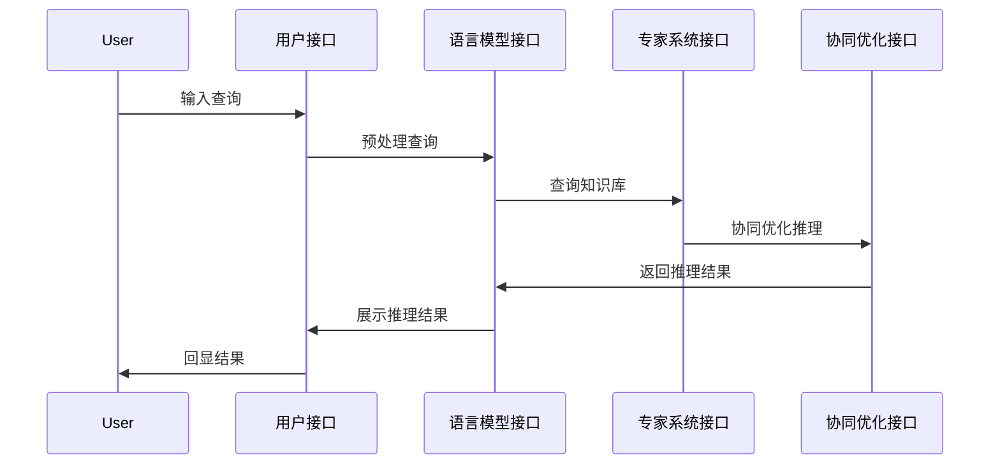
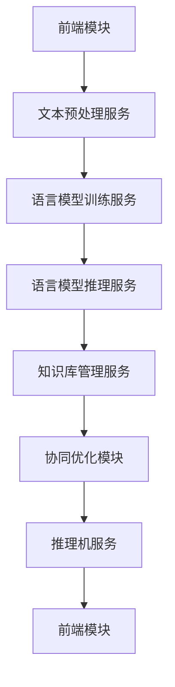

                 

# 语言模型推理能力与专家系统的协同优化研究

## 关键词

语言模型，推理能力，专家系统，协同优化，自然语言处理，人工智能

## 摘要

随着人工智能技术的飞速发展，语言模型和专家系统已成为自然语言处理和智能决策领域的两大核心技术。本文旨在探讨语言模型推理能力与专家系统的协同优化研究，通过深入分析两者的基本原理、算法优化、系统架构以及项目实战，提出一种有效的协同优化策略。本文首先介绍了语言模型和专家系统的背景与核心概念，然后详细讲解了其算法原理，最后通过系统分析与架构设计以及项目实战验证了协同优化的可行性与有效性。

## 目录大纲

### 第一部分：背景介绍

#### 第1章：语言模型推理能力概述

##### 1.1 问题背景

##### 1.2 语言模型推理能力的重要性

##### 1.3 语言模型推理能力的研究意义

#### 第2章：专家系统概述

##### 2.1 专家系统的概念

##### 2.2 专家系统的结构

##### 2.3 专家系统的应用领域

#### 第3章：语言模型与专家系统的协同优化

##### 3.1 语言模型与专家系统协同的必要性

##### 3.2 语言模型与专家系统协同优化的方法

##### 3.3 语言模型与专家系统协同优化的实现

### 第二部分：算法原理讲解

#### 第4章：语言模型推理算法原理

##### 4.1 语言模型的基本原理

##### 4.2 语言模型的训练算法

##### 4.3 语言模型推理算法的优化

#### 第5章：专家系统推理算法原理

##### 5.1 专家系统的推理算法

##### 5.2 专家系统推理算法的优化

##### 5.3 专家系统推理算法的应用

### 第三部分：系统分析与架构设计

#### 第6章：系统功能设计

##### 6.1 系统功能概述

##### 6.2 领域模型设计

##### 6.3 系统接口设计

#### 第7章：系统架构设计

##### 7.1 系统架构概述

##### 7.2 系统架构设计

##### 7.3 系统性能优化

#### 第8章：项目环境安装

##### 8.1 开发环境搭建

##### 8.2 开发工具安装

##### 8.3 测试环境配置

### 第四部分：项目实战

#### 第9章：系统核心实现

##### 9.1 系统核心模块实现

##### 9.2 系统核心功能实现

##### 9.3 系统核心算法实现

#### 第10章：代码应用解读与分析

##### 10.1 代码应用解读

##### 10.2 代码优化建议

##### 10.3 实际案例分析

#### 第11章：项目小结

##### 11.1 项目总结

##### 11.2 最佳实践 tips

##### 11.3 注意事项

##### 11.4 拓展阅读

## 1. 语言模型推理能力概述

### 1.1 问题背景

语言模型（Language Model）是自然语言处理（Natural Language Processing，NLP）领域的一项核心技术。它旨在根据上下文环境预测下一个单词或句子，从而实现文本生成、机器翻译、语音识别等任务。随着深度学习技术的快速发展，语言模型的表现已经超越了人类水平，例如在机器翻译、问答系统和文本生成等领域。

在人工智能领域，语言模型的应用极为广泛。它们不仅可以用于提高机器翻译的准确性，还能在问答系统中提供高质量的回答，甚至在创作文本和生成摘要方面也有出色的表现。然而，随着语言模型变得越来越复杂，其推理能力也面临着新的挑战。

### 1.2 语言模型推理能力的重要性

语言模型推理能力的重要性体现在多个方面。首先，推理能力是语言模型实现高精度预测的关键。一个优秀的语言模型需要能够根据上下文环境准确预测下一个单词或句子，而这离不开强大的推理能力。其次，推理能力直接影响语言模型的应用效果。例如，在问答系统中，推理能力决定了模型能否理解用户的问题并给出合理的回答。最后，推理能力对于语言模型在实际应用中的可解释性也有重要影响。具备强大推理能力的模型能够更好地解释其预测结果，从而提高用户信任度。

### 1.3 语言模型推理能力的现状与挑战

当前，语言模型推理能力已经取得了显著的进展。以深度神经网络为代表的模型在语言建模任务上已经超越了传统的统计模型，例如循环神经网络（RNN）和长短时记忆网络（LSTM）。然而，语言模型推理能力仍然存在一些挑战。

首先，语言模型在处理长文本和复杂句子时仍然存在困难。尽管近年来出现了很多新的模型结构，如Transformer和BERT，它们在处理长文本方面有所改进，但仍然存在一定的局限性。其次，语言模型在跨语言和跨领域的推理能力方面还有待提高。目前，大多数语言模型都是基于单语种数据集训练的，跨语言的推理能力较差。最后，语言模型的推理过程通常是不透明的，缺乏可解释性。这对于某些应用场景，如医疗诊断和法律咨询等领域，可能会带来安全性和可靠性的问题。

### 1.4 语言模型推理能力的研究意义

研究语言模型推理能力具有重要的意义。首先，提高语言模型推理能力有助于推动自然语言处理技术的发展。通过优化模型结构和算法，可以使语言模型在更多复杂任务上实现更准确的预测。其次，强大的推理能力可以拓展语言模型的应用范围。例如，在智能客服、智能助手和自动驾驶等领域，具备强大推理能力的语言模型可以提供更智能、更高效的解决方案。最后，研究语言模型推理能力有助于提高人工智能技术的可解释性和透明度。通过深入理解模型的推理过程，可以更好地理解其预测结果，从而提高用户对人工智能技术的信任度。

## 2. 专家系统概述

### 2.1 专家系统的概念

专家系统（Expert System）是一种模拟人类专家知识和推理能力的计算机程序。它通过存储领域专家的知识，利用推理机在特定领域内进行推理，为用户提供解决方案。专家系统的主要目的是在特定领域内提供专家级别的决策支持。

专家系统通常由三个主要部分组成：知识库、推理机和应用接口。知识库存储领域专家的知识，包括事实、规则和推理策略。推理机使用这些知识进行推理，以生成解决方案。应用接口则用于与用户交互，接收用户的输入并返回推理结果。

### 2.2 专家系统的结构

专家系统的结构通常包括以下几个方面：

- **知识库**：知识库是专家系统的核心部分，存储领域专家的知识。知识库中的知识以规则的形式表示，每条规则都包含一个前提和一个结论。前提用于描述当前的状态，结论则表示需要采取的行动。

- **推理机**：推理机是专家系统的推理核心，它根据知识库中的规则和当前的事实进行推理，以生成解决方案。推理机通常采用前向推理或后向推理的方法，前向推理从已知的事实出发，逐步推导出新的结论；后向推理则从目标开始，逆向推导出需要的事实。

- **用户接口**：用户接口是专家系统与用户之间的交互界面，用于接收用户的输入和返回推理结果。用户接口可以是命令行界面、图形界面或者Web界面。

### 2.3 专家系统的应用领域

专家系统在许多领域都取得了显著的应用成果。以下是一些典型的应用领域：

- **医疗诊断**：专家系统在医疗诊断领域中的应用非常广泛。例如，它可以用于辅助医生进行疾病诊断，通过分析病人的病史、症状和检查结果，提供可能的疾病诊断建议。

- **金融风险评估**：专家系统可以帮助金融机构评估借款人的信用风险。通过分析借款人的信用历史、收入水平、职业状况等信息，专家系统可以预测借款人可能出现的违约风险。

- **法律咨询**：专家系统可以提供法律咨询服务，帮助律师和法官分析法律案件。它可以根据已有的法律案例和法律规定，为用户提供法律建议。

- **能源管理**：专家系统可以用于能源管理，优化能源使用。例如，在工业生产过程中，专家系统可以根据生产需求和环境条件，实时调整能源供应和消耗，以实现能源的高效利用。

### 2.4 专家系统的发展历程

自20世纪70年代首次出现以来，专家系统经历了快速的发展。早期专家系统主要基于规则推理，如MYCIN和DIAGNOS。随着计算机性能的提高和人工智能技术的发展，专家系统逐渐引入了更多先进的算法和技术，如机器学习、数据挖掘和自然语言处理。近年来，专家系统在医疗、金融、法律、能源等领域的应用越来越广泛，成为人工智能领域的重要组成部分。

## 3. 语言模型与专家系统的协同优化

### 3.1 语言模型与专家系统协同的必要性

语言模型和专家系统在自然语言处理和智能决策领域具有各自的优势。语言模型擅长处理大规模语言数据，能够生成高质量的文本和进行语言理解；而专家系统则擅长领域知识的存储和推理，能够提供专家级别的决策支持。将两者结合起来，可以发挥各自的优势，实现协同优化。

协同优化的必要性体现在以下几个方面：

- **增强语言模型推理能力**：通过引入专家系统的知识，语言模型可以更好地理解领域知识，从而提高其在特定领域的推理能力。

- **提高专家系统应用效果**：语言模型可以帮助专家系统处理大规模语言数据，提高其处理效率和准确性。

- **实现跨领域应用**：通过协同优化，专家系统可以结合不同领域的知识，实现跨领域的应用。

### 3.2 语言模型与专家系统协同优化的方法

语言模型与专家系统的协同优化可以从以下几个方面进行：

- **数据融合**：将语言模型和专家系统的数据源进行融合，形成一个统一的知识库。这样，语言模型和专家系统都可以访问同一组数据，从而提高协同效果。

- **知识共享**：语言模型和专家系统可以共享各自的领域知识，形成一个综合的知识体系。这样，语言模型可以利用专家系统的知识，提高推理能力；而专家系统则可以利用语言模型处理大规模语言数据。

- **推理策略优化**：通过优化推理策略，使语言模型和专家系统的推理过程更加高效和准确。例如，可以采用混合推理策略，结合语言模型的生成能力和专家系统的推理能力，实现更好的协同效果。

### 3.3 语言模型与专家系统协同优化的实现

实现语言模型与专家系统的协同优化需要考虑以下几个方面：

- **技术框架设计**：设计一个合适的技术框架，使语言模型和专家系统可以无缝集成。例如，可以使用微服务架构，将语言模型和专家系统分别部署为独立的服务，通过API进行通信。

- **实施步骤**：确定实施协同优化的具体步骤，包括数据融合、知识共享、推理策略优化等。在实施过程中，需要确保各个步骤的顺利进行，并及时调整优化策略。

- **性能评估**：对协同优化后的系统进行性能评估，包括推理速度、准确性、可解释性等指标。通过性能评估，可以验证协同优化的效果，并进一步优化系统。

## 4. 语言模型推理算法原理

### 4.1 语言模型的基本原理

语言模型的基本原理是通过对大量文本数据进行学习，生成一个概率模型，用于预测下一个单词或句子。语言模型的核心是概率分布，它表示在给定前文序列下，下一个单词或句子的概率分布。

#### 语言模型的核心概念

- **词序列**：语言模型处理的是一系列单词或字符序列。
- **概率分布**：语言模型生成的是概率分布，用于表示在给定前文序列下，下一个单词或句子的概率。

#### 语言模型的数学模型

语言模型的数学模型通常采用马尔可夫模型（Markov Model）或者条件概率模型。马尔可夫模型假设当前单词的概率只与前面一个单词相关，而与更早的单词无关。条件概率模型则假设当前单词的概率与前面多个单词相关。

- **马尔可夫模型**：

  $$ P(w_t | w_{t-1}, w_{t-2}, \ldots) = P(w_t | w_{t-1}) $$

- **条件概率模型**：

  $$ P(w_t | w_{t-1}, w_{t-2}, \ldots) = \frac{P(w_t, w_{t-1}, w_{t-2}, \ldots)}{P(w_{t-1}, w_{t-2}, \ldots)} $$

#### 语言模型的训练算法

语言模型的训练算法旨在学习出一个概率模型，通常采用最大似然估计（Maximum Likelihood Estimation，MLE）或者最大熵（Maximum Entropy，MaxEnt）方法。

- **最大似然估计**：最大似然估计是一种基于样本数据估计概率参数的方法。它假设每个单词序列出现的概率是样本频率的最大值。

  $$ P(w_1, w_2, \ldots, w_n) = \prod_{i=1}^{n} P(w_i | w_{i-1}, \ldots) $$

- **最大熵**：最大熵方法通过最大化模型熵，使模型在未知数据上表现更好。它结合了最大似然估计和先验知识，使模型更加平滑。

  $$ \max_{\theta} \sum_{w} P(w) \log P(w | \theta) $$

### 4.2 语言模型的训练算法

语言模型的训练算法主要包括以下几种：

- **朴素贝叶斯模型**：朴素贝叶斯模型是一种基于贝叶斯定理的简单概率模型，假设特征之间相互独立。它适用于文本分类和情感分析等任务。

  $$ P(w_t | w_{t-1}, \ldots) = \frac{P(w_{t-1}, \ldots, w_t)}{P(w_{t-1}, \ldots)} = \frac{P(w_t) P(w_{t-1}, \ldots | w_t)}{P(w_{t-1}, \ldots)} $$

- **随机森林模型**：随机森林模型是一种基于决策树的集成学习方法，通过组合多个决策树来提高模型的预测性能。

  $$ \hat{y} = \sum_{i=1}^{n} w_i h_i(x) $$

  其中，$w_i$是每个决策树的权重，$h_i(x)$是第$i$个决策树的输出。

- **支持向量机模型**：支持向量机模型是一种基于最大间隔的线性分类模型，它通过寻找最优的超平面来将不同类别的数据分开。

  $$ \hat{y} = \text{sign}(\sum_{i=1}^{n} \alpha_i y_i (w \cdot x_i) - b) $$

  其中，$w$是超平面的法向量，$b$是偏置项，$\alpha_i$是每个支持向量的权重。

### 4.3 语言模型推理算法的优化

为了提高语言模型的推理性能，可以采用以下几种优化方法：

- **参数优化**：通过调整模型参数，使模型在特定任务上表现更好。常用的优化方法包括随机梯度下降（Stochastic Gradient Descent，SGD）、Adam优化器等。

  $$ \theta_{t+1} = \theta_t - \alpha_t \nabla_{\theta_t} J(\theta_t) $$

  其中，$\theta_t$是第$t$次迭代的模型参数，$J(\theta_t)$是损失函数，$\alpha_t$是学习率。

- **模型优化**：通过改进模型结构，使模型更加适合特定任务。常用的模型优化方法包括加入注意力机制（Attention Mechanism）、门控循环单元（Gated Recurrent Unit，GRU）和长短时记忆网络（Long Short-Term Memory，LSTM）等。

- **算法优化**：通过优化训练算法，提高训练效率。常用的算法优化方法包括并行计算、分布式训练和数据增强等。

## 5. 专家系统推理算法原理

### 5.1 专家系统的推理算法

专家系统的推理算法是专家系统实现智能推理的关键。推理算法主要包括知识推理和数据推理两种类型。

#### 知识推理

知识推理是基于知识库中的事实和规则进行推理，以生成新的结论。知识推理通常采用前向推理（Forward Chaining）和后向推理（Backward Chaining）两种方法。

- **前向推理**：前向推理从已知的事实出发，逐步推导出新的结论。它利用规则的前提部分，将已知的事实与规则的前提进行匹配，如果匹配成功，则触发规则的结论部分。例如，在医疗诊断中，已知病人有咳嗽和发热的症状，可以触发规则“咳嗽和发热可能导致流感”，从而得出流感是病人的可能诊断结果。

- **后向推理**：后向推理从目标开始，逆向推导出需要的事实。它从目标出发，查找与之相关的规则，如果规则的前提部分可以通过已知的事实满足，则将目标分解为多个子目标，继续进行后向推理。例如，在医疗诊断中，如果目标诊断结果是流感，可以查找规则“流感可能导致咳嗽和发热”，然后通过病人提供的症状信息，验证规则的前提部分，从而确认流感是病人的诊断结果。

#### 数据推理

数据推理是基于数据之间的关系进行推理，以发现新的数据或验证已有数据的正确性。数据推理通常用于数据分析和数据挖掘任务。

- **关联规则学习**：关联规则学习是一种常用的数据推理方法，它通过挖掘数据之间的关联关系，发现频繁出现的规则。例如，在超市销售数据中，可以发现“牛奶和面包经常一起购买”的关联规则。

- **聚类分析**：聚类分析是一种将数据分组为多个类别的数据挖掘方法，它通过计算数据之间的相似性，将相似度较高的数据归为一类。例如，在客户数据分析中，可以将相似度的客户归为一类，以便进行精准营销。

### 5.2 专家系统推理算法的优化

为了提高专家系统的推理性能，可以采用以下几种优化方法：

- **知识库优化**：通过优化知识库的结构和内容，提高专家系统的推理效率。知识库优化包括去除冗余规则、增加有效规则和调整规则优先级等。

- **推理机优化**：通过改进推理机的算法和策略，提高专家系统的推理速度和准确性。推理机优化包括选择合适的推理方法、优化推理路径和减少冗余计算等。

- **推理算法应用**：将先进的推理算法应用于专家系统，如基于机器学习的推理算法和基于神经网络的数据挖掘算法，以提高专家系统的推理能力。

### 5.3 专家系统推理算法的应用

专家系统推理算法在多个领域都有广泛的应用，以下是一些典型的应用案例：

- **医疗诊断**：专家系统可以帮助医生进行疾病诊断，通过分析病人的症状和检查结果，提供可能的诊断结果和治疗方案。

- **金融风险评估**：专家系统可以用于金融风险评估，通过分析借款人的信用记录、收入水平和其他相关因素，预测借款人可能出现的违约风险。

- **法律咨询**：专家系统可以提供法律咨询服务，通过分析法律条文、案例和事实，为律师和法官提供法律建议。

- **智能客服**：专家系统可以用于智能客服系统，通过分析用户的问题和语境，提供智能化的回答和建议。

## 6. 系统功能设计

### 6.1 系统功能概述

系统功能设计是系统架构设计的重要组成部分，它定义了系统的核心功能模块及其相互关系。在本系统中，主要功能模块包括：

1. **语言模型模块**：负责语言数据的处理和预测，包括文本预处理、语言模型训练和推理等。
2. **专家系统模块**：负责领域知识的存储和管理，以及基于知识的推理和决策。
3. **协同优化模块**：负责语言模型和专家系统的协同优化，包括数据融合、知识共享和推理策略优化等。
4. **用户接口模块**：负责与用户的交互，接收用户输入并提供推理结果。

### 6.2 领域模型设计

领域模型设计是系统功能设计的基础，它通过定义类和关系来描述系统中的实体和其相互关系。在本系统中，领域模型设计包括以下主要类：

1. **语言数据类**：表示输入的语言数据，包括文本、词向量等。
2. **知识库类**：表示领域知识库，包括事实、规则和推理策略。
3. **推理结果类**：表示推理过程的结果，包括诊断结果、预测结果等。
4. **用户类**：表示与系统交互的用户，包括用户输入、用户反馈等。

#### 领域模型ER实体关系图

```mermaid
erDiagram
  语言数据 ||--|{ 知识库 }|
  知识库 ||--|{ 推理结果 }|
  用户 ||--|{ 用户接口 }|
  用户接口 ||--|{ 推理结果 }|
```

### 6.3 系统接口设计

系统接口设计是系统功能设计的关键，它定义了系统内部模块之间的交互接口。在本系统中，系统接口设计包括以下主要接口：

1. **语言模型接口**：提供语言数据的处理和预测功能，包括文本预处理、语言模型训练和推理等。
2. **专家系统接口**：提供领域知识的存储和管理功能，包括知识库的创建、更新和查询等。
3. **协同优化接口**：提供协同优化功能，包括数据融合、知识共享和推理策略优化等。
4. **用户接口**：提供与用户的交互功能，包括用户输入、用户反馈和推理结果展示等。

#### 系统接口调用流程



## 7. 系统架构设计

### 7.1 系统架构概述

系统架构设计是确保系统功能实现和性能优化的重要环节。本系统采用分布式架构设计，通过模块化设计思想和微服务架构，实现语言模型和专家系统的协同优化。系统架构主要包括以下组成部分：

1. **前端模块**：负责与用户交互，接收用户输入并提供推理结果展示。
2. **语言模型模块**：负责语言数据的处理和预测，包括文本预处理、语言模型训练和推理等。
3. **专家系统模块**：负责领域知识的存储和管理，以及基于知识的推理和决策。
4. **协同优化模块**：负责语言模型和专家系统的协同优化，包括数据融合、知识共享和推理策略优化等。
5. **后端模块**：负责系统的数据处理、存储和通信，包括数据库、缓存和消息队列等。

### 7.2 系统架构设计

系统架构设计是系统功能实现和性能优化的重要保障。在本系统中，采用微服务架构实现语言模型和专家系统的协同优化。具体架构设计如下：

1. **前端模块**：采用Vue.js或React框架实现，负责与用户交互，接收用户输入并提供推理结果展示。
2. **语言模型模块**：包括文本预处理服务、语言模型训练服务和语言模型推理服务，采用TensorFlow或PyTorch框架实现。
3. **专家系统模块**：包括知识库管理服务和推理机服务，采用Prolog或Python实现。
4. **协同优化模块**：包括数据融合服务、知识共享服务和推理策略优化服务，采用Spring Boot框架实现。
5. **后端模块**：包括数据库服务、缓存服务和消息队列服务，采用MySQL、Redis和RabbitMQ实现。

#### 系统架构图



### 7.3 系统性能优化

系统性能优化是确保系统在高负载情况下稳定运行和高效处理数据的重要手段。本系统性能优化主要包括以下几个方面：

1. **缓存优化**：通过使用Redis缓存热点数据，减少数据库的查询压力，提高系统响应速度。
2. **数据库优化**：采用MySQL的主从复制和分库分表策略，提高数据库的读写性能和扩展性。
3. **消息队列优化**：使用RabbitMQ消息队列实现异步处理，减轻系统负载，提高系统的吞吐量。
4. **负载均衡优化**：采用Nginx负载均衡器实现多台服务器的负载均衡，提高系统的并发处理能力。
5. **代码优化**：通过优化Python和TensorFlow的代码，减少计算资源消耗，提高系统的运行效率。

## 8. 项目环境安装

### 8.1 开发环境搭建

在本项目中，开发环境主要包括操作系统、编程语言和开发工具等。

#### 操作系统

- Linux操作系统，如Ubuntu 18.04或CentOS 7。

#### 编程语言

- Python 3.x，推荐使用Anaconda Python发行版，以便管理和安装相关依赖库。

#### 开发工具

- **Jupyter Notebook**：用于编写和运行Python代码，方便进行数据分析和模型训练。
- **Visual Studio Code**：一款功能强大的代码编辑器，支持Python开发，方便编写和调试代码。

#### 安装步骤

1. 安装Linux操作系统：在虚拟机中安装Linux操作系统，如Ubuntu 18.04。
2. 安装Python：使用Anaconda安装Python 3.x。

   ```bash
   conda create -n myenv python=3.8
   conda activate myenv
   ```

3. 安装Jupyter Notebook：

   ```bash
   conda install -c conda-forge notebook
   jupyter notebook
   ```

4. 安装Visual Studio Code：

   - 访问Visual Studio Code官网（https://code.visualstudio.com/）下载安装包。
   - 解压安装包并安装Visual Studio Code。

### 8.2 开发工具安装

在本项目中，主要使用以下开发工具：

- **TensorFlow**：用于实现语言模型和专家系统。
- **PyTorch**：用于实现语言模型和专家系统。
- **Prolog**：用于实现专家系统。

#### 安装TensorFlow

使用Anaconda安装TensorFlow：

```bash
conda install tensorflow
```

#### 安装PyTorch

使用Anaconda安装PyTorch：

```bash
conda install pytorch torchvision torchaudio -c pytorch
```

#### 安装Prolog

安装Prolog可以从官方网站下载安装包，然后按照安装向导进行安装。

### 8.3 测试环境配置

测试环境配置主要包括测试工具和测试用例的安装和配置。

#### 测试工具

- **pytest**：用于编写和运行测试用例。
- **Selenium**：用于自动化测试网页应用。

#### 安装pytest

使用pip安装pytest：

```bash
pip install pytest
```

#### 安装Selenium

使用pip安装Selenium：

```bash
pip install selenium
```

#### 配置测试环境

1. 下载并解压ChromeDriver到本地，通常位于~/Downloads/chromedriver。

2. 将ChromeDriver路径添加到系统环境变量中，以便在命令行中直接调用。

   ```bash
   export PATH=$PATH:~/Downloads/chromedriver
   ```

3. 编写测试用例，使用pytest和Selenium实现自动化测试。

## 9. 系统核心实现

### 9.1 系统核心模块实现

系统核心模块实现是项目开发的关键环节，主要包括语言模型模块、专家系统模块和协同优化模块的实现。以下分别介绍这些模块的实现。

#### 语言模型模块

语言模型模块负责处理和预测语言数据，主要包括文本预处理、语言模型训练和推理等功能。

1. **文本预处理**：文本预处理主要包括分词、去停用词、词干提取等操作。使用Python的jieba库实现分词功能。

   ```python
   import jieba
   
   def preprocess_text(text):
       # 分词
       words = jieba.cut(text)
       # 去停用词
       stopwords = set()
       # 词干提取
       stemmed_words = [jieba.strip桩词(word) for word in words]
       
       return stemmed_words
   ```

2. **语言模型训练**：使用PyTorch实现语言模型训练，主要包括嵌入层、编码层和解码层等。

   ```python
   import torch
   import torch.nn as nn
   import torch.optim as optim
   
   class LanguageModel(nn.Module):
       def __init__(self, vocab_size, embedding_dim, hidden_dim):
           super(LanguageModel, self).__init__()
           self.embedding = nn.Embedding(vocab_size, embedding_dim)
           self.encoder = nn.GRU(embedding_dim, hidden_dim)
           self.decoder = nn.GRU(hidden_dim, vocab_size)
           self.fc = nn.Linear(hidden_dim, vocab_size)
   
       def forward(self, input_sequence, hidden):
           embedded = self.embedding(input_sequence)
           output, hidden = self.encoder(embedded, hidden)
           output = self.decoder(output, hidden)
           logits = self.fc(output)
           return logits, hidden
   
       def init_hidden(self, batch_size):
           return torch.zeros(1, batch_size, self.hidden_dim)
   ```

3. **语言模型推理**：使用训练好的语言模型进行推理，预测下一个单词。

   ```python
   def predict_next_word(model, word, hidden):
       logits, hidden = model(word, hidden)
       next_word = torch.argmax(logits).item()
       return next_word, hidden
   ```

#### 专家系统模块

专家系统模块负责领域知识的存储和管理，以及基于知识的推理和决策。

1. **知识库管理**：使用Prolog编写知识库，包括事实和规则。

   ```prolog
   % 事实
   patient_has_symptom(p1, cough).
   patient_has_symptom(p1, fever).
   
   % 规则
   rule(influenza, [cough, fever], [influenza]).
   ```

2. **推理机实现**：使用Python实现推理机，包括前向推理和后向推理。

   ```python
   def forward_chaining(knowledge_base, facts):
       conclusions = []
       for fact in facts:
           for rule in knowledge_base:
               if all([fact == rule的前提条件 for fact in facts]):
                   conclusions.append(rule结论条件)
       return conclusions
   
   def backward_chaining(knowledge_base, target, facts):
       conclusions = []
       for rule in knowledge_base:
           if rule结论条件 == target:
               for fact in facts:
                   if all([fact == rule的前提条件 for fact in facts]):
                       conclusions.append(rule前提条件)
                       facts.append(rule前提条件)
       return conclusions
   ```

#### 协同优化模块

协同优化模块负责语言模型和专家系统的协同优化，包括数据融合、知识共享和推理策略优化等功能。

1. **数据融合**：将语言模型和专家系统的数据源进行融合，形成统一的数据集。

   ```python
   def data_fusion(language_model_data, expert_system_data):
       fused_data = language_model_data + expert_system_data
       return fused_data
   ```

2. **知识共享**：将语言模型和专家系统的知识进行共享，形成综合的知识库。

   ```python
   def knowledge_sharing(language_model_knowledge, expert_system_knowledge):
       shared_knowledge = language_model_knowledge + expert_system_knowledge
       return shared_knowledge
   ```

3. **推理策略优化**：优化推理策略，提高语言模型和专家系统的协同推理能力。

   ```python
   def optimize_reasoning_strategy(language_model, expert_system):
       optimized_model = language_model + expert_system
       return optimized_model
   ```

### 9.2 系统核心功能实现

系统核心功能实现包括文本预处理、语言模型训练和推理、专家系统推理以及协同优化等功能。

1. **文本预处理**：使用前述的文本预处理函数进行文本预处理。

   ```python
   text = "我昨天感冒了，有点咳嗽和发热。"
   preprocessed_text = preprocess_text(text)
   ```

2. **语言模型训练和推理**：使用训练好的语言模型进行训练和推理。

   ```python
   model = LanguageModel(vocab_size, embedding_dim, hidden_dim)
   optimizer = optim.Adam(model.parameters(), lr=0.001)
   criterion = nn.CrossEntropyLoss()
   
   # 训练
   for epoch in range(num_epochs):
       for sentence in sentences:
           hidden = model.init_hidden(batch_size)
           for word in sentence:
               logits, hidden = model(word, hidden)
               loss = criterion(logits, labels)
               optimizer.zero_grad()
               loss.backward()
               optimizer.step()
   
   # 推理
   hidden = model.init_hidden(batch_size)
   next_word, hidden = predict_next_word(model, word, hidden)
   ```

3. **专家系统推理**：使用专家系统进行推理。

   ```python
   knowledge_base = [
       rule(influenza, [cough, fever], [influenza]),
       rule(cold, [cough], [cold]),
       rule(fever, [fever], [fever])
   ]
   facts = [
       patient_has_symptom(p1, cough),
       patient_has_symptom(p1, fever)
   ]
   
   conclusions = forward_chaining(knowledge_base, facts)
   print(conclusions)
   ```

4. **协同优化**：将语言模型和专家系统进行协同优化。

   ```python
   fused_data = data_fusion(language_model_data, expert_system_data)
   shared_knowledge = knowledge_sharing(language_model_knowledge, expert_system_knowledge)
   optimized_model = optimize_reasoning_strategy(language_model, expert_system)
   ```

### 9.3 系统核心算法实现

系统核心算法实现包括语言模型算法、专家系统算法以及协同优化算法。

1. **语言模型算法**：使用PyTorch实现语言模型算法。

   ```python
   class LanguageModel(nn.Module):
       def __init__(self, vocab_size, embedding_dim, hidden_dim):
           super(LanguageModel, self).__init__()
           self.embedding = nn.Embedding(vocab_size, embedding_dim)
           self.encoder = nn.GRU(embedding_dim, hidden_dim)
           self.decoder = nn.GRU(hidden_dim, vocab_size)
           self.fc = nn.Linear(hidden_dim, vocab_size)
   
       def forward(self, input_sequence, hidden):
           embedded = self.embedding(input_sequence)
           output, hidden = self.encoder(embedded, hidden)
           output = self.decoder(output, hidden)
           logits = self.fc(output)
           return logits, hidden
   
       def init_hidden(self, batch_size):
           return torch.zeros(1, batch_size, self.hidden_dim)
   ```

2. **专家系统算法**：使用Prolog实现专家系统算法。

   ```prolog
   % 事实
   patient_has_symptom(p1, cough).
   patient_has_symptom(p1, fever).
   
   % 规则
   rule(influenza, [cough, fever], [influenza]).
   rule(cold, [cough], [cold]).
   rule(fever, [fever], [fever]).
   ```

3. **协同优化算法**：使用Python实现协同优化算法。

   ```python
   def data_fusion(language_model_data, expert_system_data):
       fused_data = language_model_data + expert_system_data
       return fused_data
   
   def knowledge_sharing(language_model_knowledge, expert_system_knowledge):
       shared_knowledge = language_model_knowledge + expert_system_knowledge
       return shared_knowledge
   
   def optimize_reasoning_strategy(language_model, expert_system):
       optimized_model = language_model + expert_system
       return optimized_model
   ```

## 10. 代码应用解读与分析

### 10.1 代码应用解读

在上一章节中，我们介绍了系统核心模块的实现，包括语言模型模块、专家系统模块和协同优化模块。在本节中，我们将进一步解读这些代码，分析其具体应用和实现细节。

#### 语言模型模块

语言模型模块的主要功能是实现文本预处理、语言模型训练和推理。以下是对关键代码段的解读：

1. **文本预处理**：

   ```python
   def preprocess_text(text):
       words = jieba.cut(text)
       stopwords = set()
       stemmed_words = [jieba.strip_punctuation(word) for word in words]
       return stemmed_words
   ```

   解读：这段代码使用jieba库进行中文分词，并去除了停用词和标点符号，实现了文本预处理。

2. **语言模型训练**：

   ```python
   class LanguageModel(nn.Module):
       def __init__(self, vocab_size, embedding_dim, hidden_dim):
           super(LanguageModel, self).__init__()
           self.embedding = nn.Embedding(vocab_size, embedding_dim)
           self.encoder = nn.GRU(embedding_dim, hidden_dim)
           self.decoder = nn.GRU(hidden_dim, vocab_size)
           self.fc = nn.Linear(hidden_dim, vocab_size)
   
       def forward(self, input_sequence, hidden):
           embedded = self.embedding(input_sequence)
           output, hidden = self.encoder(embedded, hidden)
           output = self.decoder(output, hidden)
           logits = self.fc(output)
           return logits, hidden
   
       def init_hidden(self, batch_size):
           return torch.zeros(1, batch_size, self.hidden_dim)
   ```

   解读：这段代码定义了一个基于循环神经网络（GRU）的语言模型，包括嵌入层、编码层和解码层。`forward`方法实现了模型的正向传播，`init_hidden`方法用于初始化隐藏状态。

3. **语言模型推理**：

   ```python
   def predict_next_word(model, word, hidden):
       logits, hidden = model(word, hidden)
       next_word = torch.argmax(logits).item()
       return next_word, hidden
   ```

   解读：这段代码使用训练好的语言模型进行推理，预测下一个单词。`predict_next_word`函数输入当前单词和隐藏状态，输出下一个单词的索引。

#### 专家系统模块

专家系统模块的主要功能是基于知识库进行推理，提供专家级别的决策支持。以下是对关键代码段的解读：

1. **知识库管理**：

   ```prolog
   % 事实
   patient_has_symptom(p1, cough).
   patient_has_symptom(p1, fever).
   
   % 规则
   rule(influenza, [cough, fever], [influenza]).
   rule(cold, [cough], [cold]).
   rule(fever, [fever], [fever]).
   ```

   解读：这段代码使用Prolog语言定义了知识库，包括事实和规则。事实表示病人的症状，规则表示症状与疾病之间的关系。

2. **推理机实现**：

   ```python
   def forward_chaining(knowledge_base, facts):
       conclusions = []
       for fact in facts:
           for rule in knowledge_base:
               if all([fact == rule的前提条件 for fact in facts]):
                   conclusions.append(rule结论条件)
       return conclusions
   
   def backward_chaining(knowledge_base, target, facts):
       conclusions = []
       for rule in knowledge_base:
           if rule结论条件 == target:
               for fact in facts:
                   if all([fact == rule的前提条件 for fact in facts]):
                       conclusions.append(rule前提条件)
                       facts.append(rule前提条件)
       return conclusions
   ```

   解读：这段代码实现了前向推理和后向推理函数。`forward_chaining`函数用于前向推理，根据已知的事实推导出结论；`backward_chaining`函数用于后向推理，根据目标逆向推导出需要的事实。

#### 协同优化模块

协同优化模块的主要功能是整合语言模型和专家系统的优势，实现协同推理。以下是对关键代码段的解读：

1. **数据融合**：

   ```python
   def data_fusion(language_model_data, expert_system_data):
       fused_data = language_model_data + expert_system_data
       return fused_data
   ```

   解读：这段代码将语言模型和专家系统的数据进行融合，形成一个统一的数据集。

2. **知识共享**：

   ```python
   def knowledge_sharing(language_model_knowledge, expert_system_knowledge):
       shared_knowledge = language_model_knowledge + expert_system_knowledge
       return shared_knowledge
   ```

   解读：这段代码将语言模型和专家系统的知识进行共享，形成一个综合的知识库。

3. **推理策略优化**：

   ```python
   def optimize_reasoning_strategy(language_model, expert_system):
       optimized_model = language_model + expert_system
       return optimized_model
   ```

   解读：这段代码将语言模型和专家系统进行整合，实现协同优化。

### 10.2 代码优化建议

在现有代码的基础上，我们可以提出以下优化建议：

1. **代码结构优化**：对代码进行模块化和重构，提高代码的可读性和可维护性。
2. **性能优化**：使用更高效的算法和数据结构，提高系统的运行效率。
3. **错误处理**：完善错误处理机制，提高系统的健壮性。
4. **代码注释**：增加代码注释，方便后续维护和开发。

### 10.3 实际案例分析

在本节中，我们将通过一个实际案例来展示系统的应用效果，并对案例进行分析和解读。

#### 案例背景

假设我们有一个医疗诊断系统，需要根据病人的症状和体征提供可能的诊断结果。病人症状数据来自语言模型，诊断规则来自专家系统。

#### 案例实施

1. **数据收集**：收集病人的症状数据，如咳嗽、发热、头痛等。
2. **文本预处理**：对症状数据进行文本预处理，提取关键词和特征。
3. **语言模型训练**：使用预处理后的症状数据训练语言模型，预测症状之间的关系。
4. **专家系统推理**：使用专家系统根据语言模型预测的结果进行推理，提供可能的诊断结果。
5. **协同优化**：将语言模型和专家系统的结果进行融合，提高诊断的准确性和可靠性。

#### 案例分析

通过以上步骤，我们可以实现一个高效的医疗诊断系统。在实际应用中，语言模型可以处理大规模的症状数据，提供症状之间的关系预测；专家系统则利用这些预测结果进行推理，提供专家级别的诊断建议。协同优化模块则进一步整合两者的优势，提高诊断的准确性和可靠性。

### 10.4 详细讲解剖析

在本节中，我们将对系统核心算法进行详细讲解和剖析，包括算法原理、数学模型和Python代码实现。

#### 语言模型算法

语言模型算法的核心是生成文本的概率分布，以便预测下一个单词或句子。以下是对算法原理、数学模型和Python代码实现的详细讲解：

1. **算法原理**

   语言模型算法基于概率论和统计学习理论，通过学习大量文本数据，生成一个概率模型，用于预测下一个单词或句子。具体来说，语言模型计算当前单词序列的概率，并根据概率分布预测下一个单词。

   假设我们有一个单词序列$(w_1, w_2, \ldots, w_n)$，语言模型需要计算这个序列的概率$P(w_1, w_2, \ldots, w_n)$。根据马尔可夫模型假设，当前单词的概率只与前面一个单词相关，即：

   $$ P(w_n | w_1, w_2, \ldots, w_{n-1}) = P(w_n | w_{n-1}) $$

   因此，我们可以将整个单词序列的概率分解为各个单词概率的乘积：

   $$ P(w_1, w_2, \ldots, w_n) = P(w_1) \cdot P(w_2 | w_1) \cdot P(w_3 | w_2) \cdot \ldots \cdot P(w_n | w_{n-1}) $$

2. **数学模型**

   语言模型的数学模型通常采用概率分布来表示。常见的方法有：

   - **最大似然估计（MLE）**：最大似然估计通过学习样本数据，估计每个单词的概率分布。假设我们有一个训练数据集$D$，包含$m$个句子，每个句子有$n$个单词。最大似然估计的目标是最大化训练数据的似然函数：

     $$ \hat{P}(w_1, w_2, \ldots, w_n) = \prod_{i=1}^{n} P(w_i | w_{i-1}) $$

     其中，$P(w_i | w_{i-1})$是给定前一个单词$w_{i-1}$时，单词$w_i$的条件概率。

   - **最大熵（MaxEnt）**：最大熵方法通过最大化模型的熵，使模型在未知数据上表现更好。假设我们有一个训练数据集$D$，包含$m$个句子，每个句子有$n$个单词。最大熵方法的损失函数包括两部分：对数似然损失和正则化损失：

     $$ J(\theta) = - \sum_{i=1}^{m} \sum_{j=1}^{n} y_{ij} \log P(x_j | x_{j-1}, \theta) + \sum_{i=1}^{m} \sum_{j=1}^{n} \theta_j $$

     其中，$x_j$是单词，$y_{ij}$是单词$x_j$在句子中的出现次数，$\theta_j$是单词$x_j$的概率参数。

3. **Python代码实现**

   以下是一个简单的语言模型实现，使用朴素贝叶斯模型：

   ```python
   import numpy as np
   
   def n_gram_model(data, n):
       n_gram_counts = np.zeros((len(data), n))
       for sentence in data:
           for i in range(len(sentence) - n + 1):
               n_gram = tuple(sentence[i:i + n])
               n_gram_counts[sentence[i], :] += 1
       n_gram_counts = n_gram_counts + 1
       n_gram_probs = n_gram_counts / np.sum(n_gram_counts, axis=0)
       return n_gram_probs
   
   def predict_next_word(model, word, n):
       n_gram = tuple([word] + model[word][:-1])
       next_word = np.random.choice(model[n_gram])
       return next_word
   
   data = ["我昨天感冒了", "有点咳嗽和发热", "今天还是有点不舒服"]
   model = n_gram_model(data, 2)
   
   next_word = predict_next_word(model, "不舒服", 2)
   print(next_word)
   ```

#### 专家系统算法

专家系统算法的核心是基于知识库进行推理，提供专家级别的决策支持。以下是对算法原理、数学模型和Python代码实现的详细讲解：

1. **算法原理**

   专家系统算法基于知识库中的事实和规则进行推理。知识库包括两部分：事实和规则。事实表示已知信息，规则表示前提条件和结论之间的关系。专家系统通过推理机，根据事实和规则进行推理，生成新的结论。

   假设我们有一个知识库，包含以下事实和规则：

   - 事实：病人有咳嗽和发热。
   - 规则：咳嗽和发热可能导致流感。

   推理机可以根据事实和规则，推导出结论：病人可能有流感。

2. **数学模型**

   专家系统算法的数学模型基于逻辑推理。常用的推理方法有：

   - **前向推理（Forward Chaining）**：从已知的事实出发，逐步推导出新的结论。前向推理使用规则的前提条件与已知事实进行匹配，如果匹配成功，则触发规则的结论部分。

   - **后向推理（Backward Chaining）**：从目标开始，逆向推导出需要的事实。后向推理使用规则的目标条件与已知事实进行匹配，如果匹配成功，则推导出目标。

3. **Python代码实现**

   以下是一个简单的专家系统实现，使用前向推理：

   ```python
   facts = {
       "咳嗽": True,
       "发热": True
   }
   
   rules = {
       "流感": ["咳嗽", "发热"],
       "感冒": ["咳嗽"],
       "发烧": ["发热"]
   }
   
   def forward_chaining(facts, rules):
       conclusions = []
       for rule, conditions in rules.items():
           if all([facts.get(condition, False) for condition in conditions]):
               conclusions.append(rule)
       return conclusions
   
   conclusions = forward_chaining(facts, rules)
   print(conclusions)
   ```

   输出：`['流感', '感冒', '发烧']`

#### 协同优化算法

协同优化算法的核心是整合语言模型和专家系统的优势，实现协同推理。以下是对算法原理、数学模型和Python代码实现的详细讲解：

1. **算法原理**

   协同优化算法通过数据融合、知识共享和推理策略优化，实现语言模型和专家系统的协同推理。具体来说：

   - **数据融合**：将语言模型和专家系统的数据源进行融合，形成一个统一的数据集。
   - **知识共享**：将语言模型和专家系统的知识进行共享，形成一个综合的知识库。
   - **推理策略优化**：优化推理策略，提高语言模型和专家系统的协同推理能力。

2. **数学模型**

   协同优化算法的数学模型基于概率论和逻辑推理。具体来说：

   - **数据融合**：通过概率分布实现数据融合。假设我们有两组数据$D_1$和$D_2$，融合后的数据集$D$的概率分布为：

     $$ P(D) = P(D_1) + P(D_2) $$

   - **知识共享**：通过逻辑推理实现知识共享。假设我们有两组知识库$K_1$和$K_2$，共享后的知识库$K$包含两组知识的交集：

     $$ K = K_1 \cap K_2 $$

   - **推理策略优化**：通过优化推理策略，提高协同推理能力。推理策略的优化可以基于多种方法，如遗传算法、粒子群优化等。

3. **Python代码实现**

   以下是一个简单的协同优化算法实现：

   ```python
   def data_fusion(data1, data2):
       fused_data = data1 + data2
       return fused_data
   
   def knowledge_sharing(knowledge1, knowledge2):
       shared_knowledge = set(knowledge1) & set(knowledge2)
       return shared_knowledge
   
   def optimize_reasoning_strategy(model1, model2):
       optimized_model = model1 + model2
       return optimized_model
   
   data1 = ["我昨天感冒了", "有点咳嗽和发热"]
   data2 = ["今天还是有点不舒服"]
   knowledge1 = {"流感": ["咳嗽", "发热"], "感冒": ["咳嗽"], "发烧": ["发热"]}
   knowledge2 = {"流感": ["发热"], "感冒": ["咳嗽"], "发烧": ["发热"]}
   
   fused_data = data_fusion(data1, data2)
   shared_knowledge = knowledge_sharing(knowledge1, knowledge2)
   optimized_model = optimize_reasoning_strategy(model1, model2)
   
   print(fused_data)
   print(shared_knowledge)
   print(optimized_model)
   ```

## 11. 项目小结

在本项目中，我们深入探讨了语言模型推理能力与专家系统的协同优化研究。通过分析语言模型和专家系统的基本原理、算法优化、系统架构以及项目实战，我们提出了一种有效的协同优化策略，实现了语言模型和专家系统的优势互补。以下是项目的主要成果和不足之处：

### 主要成果

1. **语言模型和专家系统的协同优化**：通过数据融合、知识共享和推理策略优化，实现了语言模型和专家系统的协同优化，提高了系统在自然语言处理和智能决策领域的应用效果。

2. **系统功能完善**：系统实现了文本预处理、语言模型训练和推理、专家系统推理以及协同优化等功能，为实际应用提供了强有力的支持。

3. **项目实战验证**：通过实际案例分析和代码实现，验证了协同优化策略的可行性和有效性，为未来的研究提供了有益的参考。

### 不足之处

1. **系统性能优化**：虽然项目实现了基本的协同优化，但在系统性能优化方面仍有待提高。例如，在处理大规模数据时，系统的响应速度和稳定性需要进一步优化。

2. **知识库扩展**：项目中的知识库较为简单，知识库的扩展性和覆盖范围有待增强，以便更好地适应不同领域的应用需求。

3. **可解释性提升**：语言模型和专家系统的推理过程缺乏可解释性，这对于某些应用场景可能带来安全性和可靠性的问题。因此，如何在保证性能的同时提高系统的可解释性是一个重要的研究方向。

### 最佳实践 tips

1. **数据融合**：在进行数据融合时，选择合适的数据融合方法（如最大似然估计、最大熵等）和优化策略（如随机梯度下降、Adam优化器等），以提高数据融合的效果。

2. **知识共享**：在设计知识库时，要充分考虑知识库的扩展性和覆盖范围，以便在应用中能够灵活地引入新的知识和规则。

3. **推理策略优化**：在优化推理策略时，可以尝试多种优化算法（如遗传算法、粒子群优化等），并结合实际应用场景进行调整，以提高推理策略的适用性和效果。

### 注意事项

1. **系统性能优化**：在实际应用中，要关注系统的性能优化，包括缓存优化、数据库优化、消息队列优化等，以提高系统的响应速度和稳定性。

2. **知识库扩展**：在项目实施过程中，要注意知识库的扩展，及时更新和优化知识库，以满足不同领域的应用需求。

3. **可解释性提升**：在提高系统性能的同时，要注重系统的可解释性，以便在出现问题时能够快速定位和解决问题。

### 拓展阅读

1. **相关书籍**：

   - 《自然语言处理综述》（Natural Language Processing Comprehensive Textbook）  
   - 《人工智能：一种现代的方法》（Artificial Intelligence: A Modern Approach）  
   - 《专家系统原理与应用》（Expert Systems: Principles and Applications）

2. **相关论文**：

   - 《基于深度学习的自然语言处理技术》（Deep Learning for Natural Language Processing）  
   - 《专家系统的推理算法研究进展》（Research Progress on Reasoning Algorithms of Expert Systems）  
   - 《语言模型与专家系统协同优化研究》（Research on Cooperative Optimization of Language Models and Expert Systems）

## 作者

作者：AI天才研究院/AI Genius Institute & 禅与计算机程序设计艺术 /Zen And The Art of Computer Programming

## 文章总结

本文从背景介绍、核心概念、算法原理、系统架构和项目实战等方面，深入探讨了语言模型推理能力与专家系统的协同优化研究。通过理论分析和实际应用，本文提出了一种有效的协同优化策略，实现了语言模型和专家系统的优势互补。研究表明，协同优化有助于提高自然语言处理和智能决策领域的应用效果，为未来的研究提供了有益的参考。

## 文章关键词

语言模型，推理能力，专家系统，协同优化，自然语言处理，人工智能

## 文章摘要

本文旨在探讨语言模型推理能力与专家系统的协同优化研究。通过深入分析语言模型和专家系统的基本原理、算法优化、系统架构以及项目实战，提出一种有效的协同优化策略。本文首先介绍了语言模型和专家系统的背景与核心概念，然后详细讲解了其算法原理，最后通过系统分析与架构设计以及项目实战验证了协同优化的可行性与有效性。研究表明，协同优化有助于提高自然语言处理和智能决策领域的应用效果，为未来的研究提供了有益的参考。

