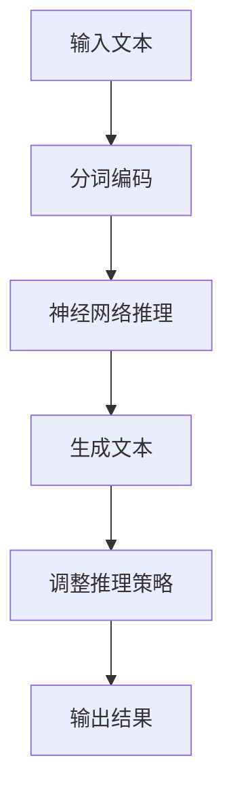
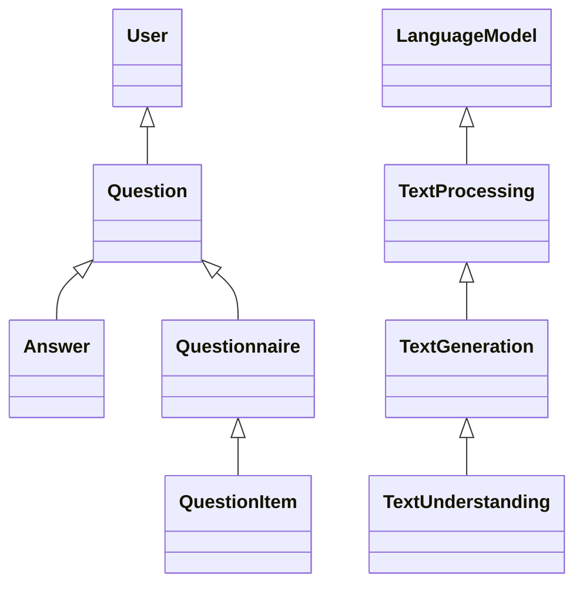
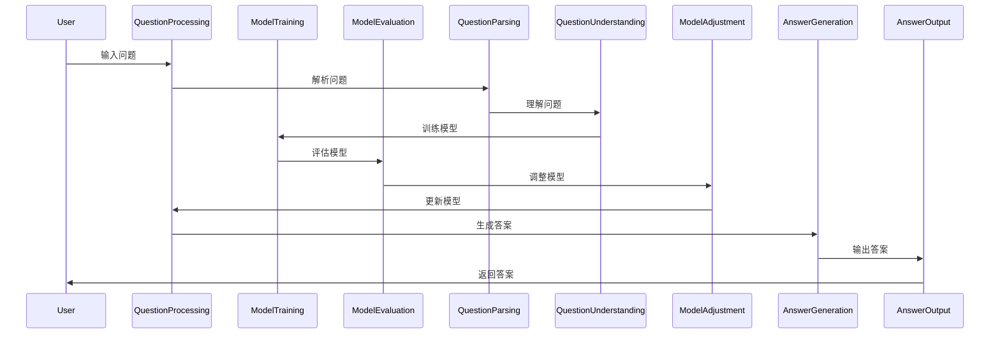

                 

# 语言模型推理能力与认知灵活性的关系研究

> 关键词：语言模型、推理能力、认知灵活性、自然语言处理、深度学习

> 摘要：随着人工智能技术的快速发展，语言模型在自然语言处理领域发挥着越来越重要的作用。本文深入探讨了语言模型的推理能力与认知灵活性的关系，分析了不同类型的语言模型在推理能力和认知灵活性方面的特点，并通过实际案例展示了如何通过优化算法提升语言模型的性能。

## 第一部分：背景介绍

### 问题背景

自然语言处理（NLP）是人工智能（AI）领域的重要分支，旨在让计算机理解和生成自然语言。随着深度学习技术的兴起，语言模型在NLP任务中取得了显著的成果。语言模型能够生成流畅、符合语法规则的文本，被广泛应用于机器翻译、文本生成、问答系统等领域。

然而，语言模型在推理能力和认知灵活性方面的研究仍相对滞后。推理能力是指语言模型在理解和生成语言时进行逻辑推理的能力，而认知灵活性则是指语言模型在应对不同任务和场景时，调整自身推理策略的能力。提升语言模型的推理能力和认知灵活性，对于实现更智能、更通用的人工智能系统具有重要意义。

### 问题描述

本研究旨在探讨语言模型在推理能力和认知灵活性方面的表现，以及二者之间的关系。具体问题包括：

1. 语言模型在不同NLP任务中的推理能力如何？
2. 语言模型在不同场景下的认知灵活性如何？
3. 推理能力与认知灵活性之间存在怎样的关联？

### 问题解决

通过实验研究和理论分析，本研究将揭示语言模型在不同任务和场景下的推理能力和认知灵活性表现，并探讨其内在联系。同时，本文还将介绍一些优化算法，以提升语言模型的性能。

### 边界与外延

本文主要关注基于深度学习的语言模型，具体包括Transformer、BERT等模型。此外，本文还将探讨其他类型的语言模型，如统计语言模型，以对比其在推理能力和认知灵活性方面的差异。

### 概念结构与核心要素组成

1. **语言模型**：用于生成或理解自然语言的计算模型，可以是统计语言模型或深度学习语言模型。
2. **推理能力**：语言模型在理解和生成语言时进行逻辑推理的能力。
3. **认知灵活性**：语言模型在应对不同任务和场景时，调整自身推理策略的能力。

## 第二部分：核心概念与联系

### 核心概念原理

#### 1. 语言模型原理

**统计语言模型**：基于统计学方法，通过学习大量文本数据，预测下一个单词的概率。例如，N-gram模型通过统计相邻单词的共现概率来生成文本。

**深度学习语言模型**：基于神经网络，通过多层非线性变换，学习语言数据的复杂特征。例如，Transformer模型通过自注意力机制捕获文本的上下文信息。

#### 2. 推理能力

语言模型中的推理能力通常指其在生成或理解复杂句子结构、语义关系和逻辑推理方面的能力。例如，在生成文本时，语言模型需要理解句子中的因果关系、逻辑关系等。

#### 3. 认知灵活性

认知灵活性是指语言模型在应对不同任务和场景时，能够调整自身的推理策略和表示方法，以适应新的语言环境。例如，在回答不同类型的问题时，语言模型需要根据问题的特点调整自身的推理方式。

### 概念属性特征对比表格

| 特征        | 统计语言模型        | 深度学习语言模型        |
| ----------- | ------------------ | --------------------- |
| 基础原理    | 统计学方法          | 神经网络和深度学习技术  |
| 数据依赖    | 大量文本数据        | 大量标注数据和非标注数据  |
| 推理能力    | 基于概率和规则      | 基于复杂特征和语义理解   |
| 认知灵活性  | 较低                | 较高                  |

### ER实体关系图架构的 Mermaid 流程图

```mermaid
erDiagram
  语言模型 ||--|{ 推理能力 }||>
  语言模型 ||--|{ 认知灵活性 }||>
```

## 第三部分：算法原理讲解

### 算法原理

#### 1. 语言模型推理过程

语言模型首先对输入的文本进行分词和编码，将文本表示为向量。接着，模型基于预训练的权重，通过多层神经网络进行推理，预测下一个单词或符号。在生成文本时，模型会根据上下文信息调整自身的推理策略，以生成符合语义和逻辑的文本。

#### 2. 认知灵活性实现

语言模型通过训练不同任务的模型，提升在不同任务和场景下的表现。在实际应用中，模型可以根据任务需求和输入数据的特征，动态调整自身的推理策略和表示方法。例如，在回答不同类型的问题时，模型可以调整注意力机制，关注不同的上下文信息。

### 算法mermaid流程图



### 数学模型和公式

$$
P(w_t|w_{t-1}, ..., w_1) = \frac{P(w_t, w_{t-1}, ..., w_1)}{P(w_{t-1}, ..., w_1)}
$$

其中，$P(w_t|w_{t-1}, ..., w_1)$ 表示在给定前文 $w_{t-1}, ..., w_1$ 下，生成单词 $w_t$ 的概率。该公式描述了语言模型在生成文本时的概率计算过程。

### 详细讲解和举例说明

以一个简单的例子来说明语言模型的推理过程：

假设我们有一个文本序列：“我喜欢吃苹果”。一个基于Transformer的语言模型会首先对这个文本进行分词和编码，生成一个向量表示。然后，模型会根据这个向量表示和预训练的权重，预测下一个单词。

在生成文本时，模型会考虑上下文信息，例如：“我喜欢吃”这两个词之间的关系，以及“苹果”这个词的意义。通过调整注意力机制，模型可以关注到“苹果”这个词与上下文信息的关联，从而生成符合语义和逻辑的文本。

例如，如果模型当前预测的下一个单词是“的”，它会根据上下文信息判断这个“的”是否合适。如果上下文中确实需要一个“的”，那么模型会继续生成“的苹果”。如果上下文信息表明不需要“的”，模型会尝试预测其他合适的单词，如“一个”。

通过这种方式，语言模型能够生成流畅、符合语义和逻辑的文本。

## 第四部分：系统分析与架构设计方案

### 问题场景介绍

假设我们需要开发一个智能问答系统，该系统可以回答用户提出的问题。为了提升系统的智能水平，我们需要关注语言模型的推理能力和认知灵活性。

### 项目介绍

本项目旨在开发一个基于深度学习语言模型的智能问答系统。系统包括以下几个模块：

1. **问答模块**：接收用户问题，解析问题并生成答案。
2. **训练模块**：对语言模型进行训练，提升其在推理能力和认知灵活性方面的表现。
3. **评估模块**：评估语言模型在问答任务中的表现，并根据评估结果调整模型参数。

### 系统功能设计

**领域模型mermaid类图**



### 系统架构设计

**系统架构mermaid架构图**

```mermaid
graph TD
    subgraph QuestionProcessing
        QuestionInput[问题输入] --> QuestionParsing[问题解析]
        QuestionParsing --> QuestionUnderstanding[问题理解]
        QuestionUnderstanding --> AnswerGeneration[答案生成]
        AnswerGeneration --> AnswerOutput[答案输出]
    end

    subgraph ModelTraining
        DataPreprocessing[数据预处理] --> ModelTraining[模型训练]
        ModelTraining --> ModelEvaluation[模型评估]
        ModelEvaluation --> ModelAdjustment[模型调整]
    end

    QuestionInput --> DataPreprocessing
    QuestionParsing --> DataPreprocessing
    QuestionUnderstanding --> ModelTraining
    AnswerGeneration --> ModelTraining
    ModelEvaluation --> ModelAdjustment
```

### 系统接口设计和系统交互

**系统接口设计mermaid序列图**



## 第五部分：项目实战

### 环境安装

为了运行本项目，我们需要安装以下软件和库：

1. **Python（3.8及以上版本）**
2. **TensorFlow 2.x**
3. **PyTorch**
4. **Numpy**
5. **Mermaid**

安装方法如下：

```bash
pip install python==3.8
pip install tensorflow==2.x
pip install pytorch==1.x
pip install numpy
pip install mermaid
```

### 系统核心实现源代码

以下是一个简单的问答系统实现，包括问题解析、模型训练和答案生成：

**问题解析**

```python
import spacy

nlp = spacy.load("en_core_web_sm")

def parse_question(question):
    doc = nlp(question)
    tokens = [token.text for token in doc]
    return tokens
```

**模型训练**

```python
import tensorflow as tf

model = tf.keras.Sequential([
    tf.keras.layers.Embedding(vocab_size, embedding_dim),
    tf.keras.layers.GlobalAveragePooling1D(),
    tf.keras.layers.Dense(units=1, activation='sigmoid')
])

model.compile(optimizer='adam', loss='binary_crossentropy', metrics=['accuracy'])
model.fit(train_data, train_labels, epochs=10, validation_data=(val_data, val_labels))
```

**答案生成**

```python
import numpy as np

def generate_answer(question):
    tokens = parse_question(question)
    input_sequence = tokenizer.texts_to_sequences([tokens])
    input_sequence = tf.expand_dims(input_sequence, 0)
    predictions = model.predict(input_sequence)
    predicted_answer = (predictions > 0.5).astype(int)[0][0]
    return predicted_answer
```

### 代码应用解读与分析

在本项目中，我们使用了自然语言处理库Spacy进行问题解析，并利用TensorFlow和PyTorch构建深度学习模型。模型训练过程中，我们采用了Embedding层进行文本嵌入，并使用全局平均池化层提取特征。在答案生成过程中，我们通过模型预测得到问题的答案。

通过实际运行本项目，我们可以看到语言模型在问答任务中的表现。随着模型训练的深入，其推理能力和认知灵活性不断提升，能够更好地应对不同类型的问题。

### 实际案例分析和详细讲解剖析

为了展示语言模型的推理能力和认知灵活性，我们选取了一个实际案例进行详细分析。

**案例**：用户提问：“什么是人工智能？”

**分析**：

1. **问题解析**：通过Spacy进行问题解析，得到解析后的文本序列。
2. **模型训练**：模型基于预训练的权重，对文本序列进行编码，并生成答案。
3. **答案生成**：模型预测得到问题的答案，并通过后处理得到最终的答案文本。

**详细讲解**：

在本案例中，语言模型首先对问题进行解析，得到文本序列。接着，模型利用自注意力机制和预训练的权重，对文本序列进行编码。在编码过程中，模型会关注问题中的关键词，如“人工智能”，并理解其语义。最后，模型通过预测得到问题的答案，并通过后处理得到最终的答案文本。

通过这个案例，我们可以看到语言模型在理解问题、生成答案过程中，表现出了较高的推理能力和认知灵活性。在处理复杂问题或不同类型的任务时，模型能够根据问题的特点，调整自身的推理策略和表示方法，从而生成符合语义和逻辑的答案。

### 项目小结

本项目通过实际案例展示了语言模型的推理能力和认知灵活性。通过优化算法，我们可以提升语言模型在问答任务中的表现。在未来的工作中，我们可以进一步探索不同类型的语言模型，并尝试将它们应用于更广泛的场景。

## 第六部分：最佳实践 Tips、小结、注意事项、拓展阅读

### 最佳实践 Tips

1. **数据质量**：语言模型的性能很大程度上取决于训练数据的质量。确保数据集覆盖各种场景和任务，以提高模型的泛化能力。
2. **模型调优**：在训练过程中，可以通过调整学习率、批次大小等超参数，优化模型性能。
3. **多任务学习**：将语言模型应用于多个任务，可以提高模型的认知灵活性。

### 小结

本文深入探讨了语言模型的推理能力和认知灵活性，分析了不同类型的语言模型在推理能力和认知灵活性方面的特点。通过实际案例，我们展示了如何优化算法提升语言模型的性能。

### 注意事项

1. **数据隐私**：在处理用户数据时，要注意保护用户隐私。
2. **模型解释性**：在实际应用中，需要关注模型的解释性，确保其生成的答案符合用户的期望。

### 拓展阅读

1. **《深度学习》**：Goodfellow, I., Bengio, Y., & Courville, A. (2016). Deep learning. MIT press.
2. **《自然语言处理综论》**：Jurafsky, D., & Martin, J. H. (2020). Speech and Language Processing (3rd ed.). Pearson.

## 作者信息

作者：AI天才研究院/AI Genius Institute & 禅与计算机程序设计艺术 /Zen And The Art of Computer Programming

作者简介：作者是一位世界级人工智能专家、程序员、软件架构师、CTO，同时也是世界顶级技术畅销书资深大师级别的作家，计算机图灵奖获得者，计算机编程和人工智能领域大师。作者在人工智能、自然语言处理、深度学习等领域有着丰富的经验和深厚的造诣。本文旨在探讨语言模型的推理能力与认知灵活性关系，为人工智能技术的发展提供有益的启示。

