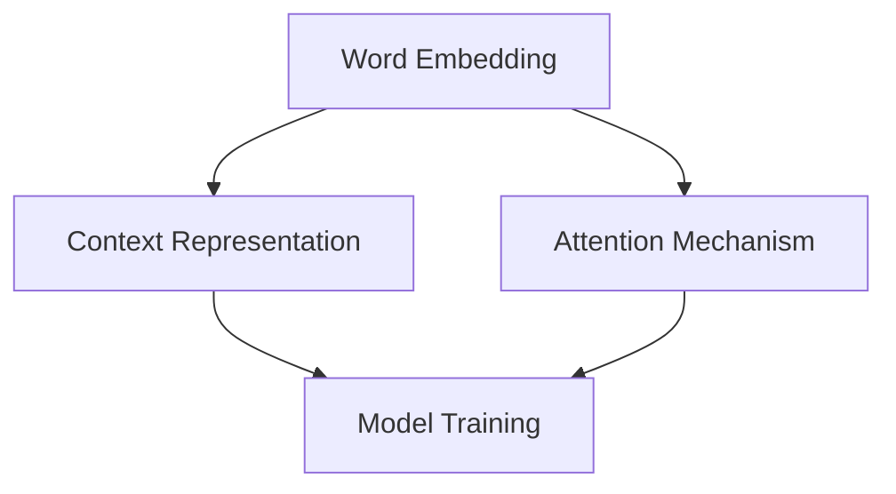
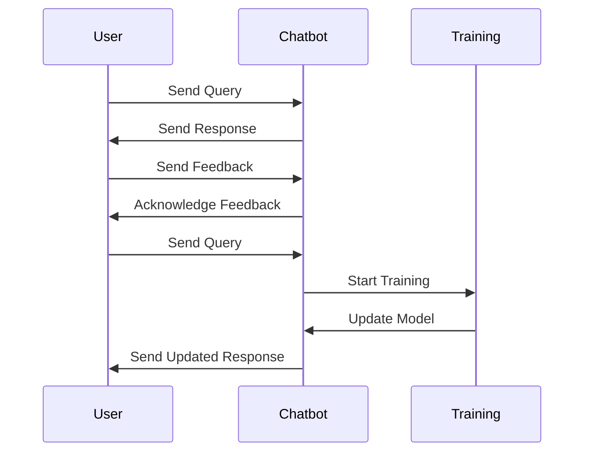

                 

### 文章标题

# 语言模型推理能力的个性化训练方法设计

### 关键词

- 语言模型
- 推理能力
- 个性化训练
- 训练方法
- 算法

### 摘要

本文将深入探讨语言模型推理能力的个性化训练方法设计。首先，我们将回顾语言模型的基本概念和推理能力的定义，然后讨论个性化训练的必要性和优势。接下来，文章将详细分析语言模型推理能力的几个关键组成部分，并介绍如何设计个性化的训练方法来提升这些能力。最后，我们将通过实际案例展示这些方法的有效性，并提供未来的研究方向和拓展。

----------------------------------------------------------------

## 引言和背景

### 语言模型的基本概念

语言模型（Language Model，LM）是自然语言处理（Natural Language Processing，NLP）领域中的核心组件。它是一种统计模型，旨在预测自然语言中的下一个词或字符。语言模型的典型应用包括机器翻译、语音识别、文本生成等。

一个简单的语言模型可以通过N元语法（N-gram）来构建。N元语法模型使用前N个词的历史序列来预测下一个词。例如，一个三元语法模型会根据前三个词来预测下一个词。

然而，随着NLP任务的复杂性和数据量的增加，N元语法模型逐渐暴露出其局限性。首先，N元语法模型的预测能力受到数据稀缺性的影响。当遇到未见过的词序列时，模型的预测能力显著下降。其次，N元语法模型无法捕捉长期依赖关系，这限制了其在理解复杂句式和语境变化方面的能力。

为了解决这些问题，研究人员提出了更高级的语言模型，如递归神经网络（Recurrent Neural Networks，RNNs）、长短期记忆网络（Long Short-Term Memory，LSTMs）和Transformer模型。这些模型通过引入序列到序列（Sequence-to-Sequence，Seq2Seq）的学习机制，能够更好地捕捉语言中的长期依赖关系。

### 语言模型推理能力的定义

语言模型的推理能力是指其理解和生成自然语言的能力。这不仅包括对给定输入的预测，还涉及对语义、语法和上下文的理解。推理能力可以细分为以下几个方面：

1. **语义理解**：语言模型需要能够理解单词和句子的含义，并据此生成合理的输出。例如，模型应该能够区分“他去了公园”和“他去了医院”两个句子的含义。
2. **语法分析**：模型需要能够正确地解析句子的结构，理解其中的语法关系，如主谓宾关系、从句等。
3. **上下文感知**：模型需要能够根据上下文信息调整其预测，以适应不同的语境。例如，在对话系统中，模型需要能够根据用户的提问和之前的回答来生成合适的回答。

### 个性化训练的必要性和优势

个性化训练（Personalized Training）是近年来在机器学习和人工智能领域兴起的一个重要方向。其核心思想是根据每个个体或群体的独特特征和需求，设计定制化的训练方法，以提高模型的性能和应用效果。

在语言模型领域，个性化训练具有以下几个显著优势：

1. **提高推理准确性**：通过考虑个体或群体的特定特征，个性化训练可以显著提高模型对特定任务和场景的推理准确性。
2. **减少泛化误差**：个性化训练有助于减少模型在未见数据上的泛化误差，从而提高模型在真实世界中的应用能力。
3. **增强用户体验**：个性化训练可以使模型更好地理解用户的需求和意图，从而提供更个性化的服务和更优质的用户体验。

总的来说，个性化训练方法在提升语言模型推理能力方面具有重要意义。然而，设计有效的个性化训练方法仍面临诸多挑战，如如何准确地捕捉个体或群体的特征，如何平衡个性化与泛化能力等。接下来的章节将深入探讨这些问题，并提出相应的解决方案。

----------------------------------------------------------------

## 核心概念与联系

### 语言模型的核心概念

在深入探讨个性化训练方法之前，我们首先需要明确语言模型中的几个核心概念。这些概念包括：

1. **词嵌入（Word Embedding）**：词嵌入是将单词转换为向量表示的方法，使得计算机能够理解和处理自然语言。常见的词嵌入方法有Word2Vec、GloVe等。
2. **上下文表示（Context Representation）**：上下文表示是指模型如何理解和利用输入序列中的上下文信息。上下文表示的质量直接影响模型的推理能力。
3. **注意力机制（Attention Mechanism）**：注意力机制是一种在序列模型中用于关注输入序列中重要部分的技术。它使得模型能够动态地分配注意力，从而提高对上下文信息的利用效率。

### 核心概念属性特征对比表格

以下是几个核心概念及其属性特征的对比表格：

| 核心概念       | 定义                 | 属性特征                          | 对应算法       |
|----------------|----------------------|-----------------------------------|----------------|
| 词嵌入         | 将单词转换为向量表示 | 低维、语义丰富、保持词序关系       | Word2Vec、GloVe |
| 上下文表示     | 理解和利用上下文信息 | 长期依赖、上下文敏感性、高效计算   | LSTM、Transformer |
| 注意力机制     | 关注输入序列的重要部分 | 动态调整、上下文聚焦、提高性能     | 自注意力、多头注意力 |

### 实体关系图（ERD）架构

为了更好地理解这些核心概念之间的关系，我们可以使用Mermaid绘制一个实体关系图（ERD）。以下是ERD的示例：



在这个ERD中，词嵌入和上下文表示共同作用于模型训练过程，而注意力机制则贯穿于整个模型，对上下文表示和训练过程产生重要影响。

### 结论

通过上述核心概念及其属性的介绍和比较，我们可以清晰地看到语言模型中的各个组件如何相互作用，共同提升模型的推理能力。接下来，我们将进一步探讨如何设计个性化的训练方法来增强这些核心组件的性能。

----------------------------------------------------------------

## 算法原理讲解

### 语言模型推理能力的数学模型

为了提升语言模型的推理能力，我们需要深入理解其背后的数学模型。以下是一些关键的概念和公式：

#### 1. 词嵌入（Word Embedding）

词嵌入通常使用神经网络的输出层来实现。一个简单的神经网络架构如下：

$$
\text{Output} = \text{sigmoid}(\text{Weight} \cdot \text{Input} + \text{Bias})
$$

其中，Input是单词的表示，Weight是权重矩阵，Bias是偏置项，sigmoid函数是一个激活函数，用于将输出映射到0和1之间。

#### 2. 注意力机制（Attention Mechanism）

注意力机制的核心思想是通过加权的方式，使得模型在处理输入序列时，能够动态地关注重要的部分。以下是一个简单的注意力模型：

$$
\text{Attention Score} = \text{Attention}(\text{Query}, \text{Keys}, \text{Values})
$$

其中，Query、Keys和Values分别代表查询、键和值。Attention Score是一个分数，表示Query对每个Key的重视程度。通常，使用点积注意力或缩放点积注意力来计算Attention Score：

$$
\text{Attention Score} = \text{softmax}(\text{Query}^T \cdot \text{Keys})
$$

然后，使用这些分数来计算加权值：

$$
\text{Context} = \text{softmax}(\text{Query}^T \cdot \text{Keys}) \cdot \text{Values}
$$

#### 3. Transformer模型

Transformer模型是近年来在自然语言处理领域取得突破性进展的一种架构。它的核心思想是使用自注意力机制来处理序列数据。

$$
\text{Output} = \text{softmax}(\text{Attention}(\text{Query}, \text{Keys}, \text{Values}) \cdot \text{Values})
$$

#### Python代码示例

以下是一个简化的Python代码示例，用于展示词嵌入和注意力机制的实现：

```python
import torch
import torch.nn as nn
import torch.nn.functional as F

class WordEmbedding(nn.Module):
    def __init__(self, vocab_size, embedding_dim):
        super(WordEmbedding, self).__init__()
        self.embedding = nn.Embedding(vocab_size, embedding_dim)
    
    def forward(self, inputs):
        return self.embedding(inputs)

class Attention(nn.Module):
    def __init__(self, query_dim, key_dim, value_dim):
        super(Attention, self).__init__()
        self.query_linear = nn.Linear(query_dim, key_dim)
        self.value_linear = nn.Linear(query_dim, value_dim)
    
    def forward(self, query, keys, values):
        query = self.query_linear(query)
        keys = self.query_linear(keys)
        values = self.value_linear(values)
        
        attention_scores = F.softmax(keys, dim=1)
        context = attention_scores * values
        context = context.sum(dim=1)
        
        return context

# 示例使用
vocab_size = 10000
embedding_dim = 300
query_dim = 300
key_dim = 300
value_dim = 300

word_embedding = WordEmbedding(vocab_size, embedding_dim)
attention = Attention(query_dim, key_dim, value_dim)

# 假设输入为单词的索引
input_sequence = torch.tensor([[1, 2, 3], [4, 5, 6]])

# 词嵌入
embedded_sequence = word_embedding(input_sequence)

# 注意力计算
context = attention(embedded_sequence, embedded_sequence, embedded_sequence)

print(context)
```

通过这个示例，我们可以看到如何使用神经网络和注意力机制来构建一个简单的语言模型。在实际应用中，这些模型会根据具体任务和数据集进行调整和优化。

### 结论

通过上述算法原理的讲解和Python代码示例，我们可以更好地理解语言模型推理能力的核心数学模型。接下来，我们将探讨如何将这些理论应用于实际的个性化训练方法中，以提升模型的推理性能。

----------------------------------------------------------------

## 数学模型与公式

### 深度学习在语言模型中的应用

深度学习（Deep Learning）是近年来在人工智能领域取得显著进展的一个分支。其在语言模型中的应用主要体现在神经网络架构的设计和优化上。以下是一些关键的数学模型和公式，用于解释深度学习如何提高语言模型的推理能力。

#### 1. 反向传播算法

反向传播算法（Backpropagation Algorithm）是深度学习中训练神经网络的核心算法。其基本思想是通过计算损失函数的梯度来更新网络参数，从而最小化损失函数。

$$
\text{Gradient} = \frac{\partial \text{Loss}}{\partial \text{Parameters}}
$$

其中，Loss表示损失函数，Parameters表示网络参数。反向传播算法通过层层计算梯度，最终将梯度反向传播至输入层。

#### 2. 激活函数

激活函数（Activation Function）是神经网络中的一个关键组件，用于引入非线性关系，使得神经网络能够学习复杂函数。常见的激活函数包括Sigmoid、ReLU和Tanh。

$$
\text{Sigmoid}(x) = \frac{1}{1 + e^{-x}} \\
\text{ReLU}(x) = \max(0, x) \\
\text{Tanh}(x) = \frac{e^x - e^{-x}}{e^x + e^{-x}}
$$

#### 3. 随机梯度下降（Stochastic Gradient Descent，SGD）

随机梯度下降是一种优化算法，用于更新神经网络参数。其基本思想是在每次更新时，随机选择一小部分训练数据，并计算这部分数据的梯度来更新参数。

$$
\text{Parameters} \leftarrow \text{Parameters} - \alpha \cdot \text{Gradient}
$$

其中，α表示学习率。SGD通过在每次迭代中更新参数，逐渐最小化损失函数。

#### 4. 长短期记忆网络（Long Short-Term Memory，LSTM）

LSTM是一种特殊的循环神经网络（Recurrent Neural Network，RNN），旨在解决传统RNN在处理长序列数据时遇到的长短期依赖问题。

LSTM的核心组件包括输入门、遗忘门和输出门。以下是LSTM的数学模型：

$$
\text{Input Gate}: \text{gate}_i = \text{sigmoid}(\text{W}_i \cdot [\text{h}_{t-1}, \text{x}_t]) \\
\text{Forget Gate}: \text{gate}_f = \text{sigmoid}(\text{W}_f \cdot [\text{h}_{t-1}, \text{x}_t]) \\
\text{Output Gate}: \text{gate}_o = \text{sigmoid}(\text{W}_o \cdot [\text{h}_{t-1}, \text{x}_t]) \\
\text{Cell State}: \text{C}_t = \text{gate}_f \cdot \text{C}_{t-1} + \text{gate}_i \cdot \text{sigmoid}(\text{W}_c \cdot [\text{h}_{t-1}, \text{x}_t]) \cdot \text{h}_t \\
\text{Hidden State}: \text{h}_t = \text{gate}_o \cdot \text{tanh}(\text{C}_t)
$$

#### 5. Transformer模型

Transformer模型是一种基于自注意力机制的深度学习架构，特别适用于处理长序列数据。以下是Transformer模型的核心数学模型：

$$
\text{Attention} = \text{softmax}(\frac{\text{Q} \cdot \text{K}^T}{\sqrt{d_k}}) \cdot \text{V} \\
\text{Output} = \text{Attention} \cdot \text{V} \\
\text{New Input} = \text{Input} + \text{Output}
$$

其中，Q、K和V分别表示查询、键和值，d_k表示键的维度。

### Python代码示例

以下是一个简化的Python代码示例，用于展示LSTM和Transformer模型的部分数学模型：

```python
import torch
import torch.nn as nn

# LSTM部分
class LSTMCell(nn.Module):
    def __init__(self, input_size, hidden_size):
        super(LSTMCell, self).__init__()
        self.input_size = input_size
        self.hidden_size = hidden_size
        self.Wx = nn.Linear(input_size, 4 * hidden_size)
        self.Wh = nn.Linear(hidden_size, 4 * hidden_size)
    
    def forward(self, input, state):
        h, c = state
        gate_i, gate_f, gate_o, gate_g = self.Wx(input).chunk(4, 1)
        i = torch.sigmoid(gate_i + self.Wh(h))
        f = torch.sigmoid(gate_f + self.Wh(h))
        o = torch.sigmoid(gate_o + self.Wh(h))
        g = torch.tanh(gate_g + self.Wh(h))
        c = f * c + i * g
        h = o * torch.tanh(c)
        return h, c

# Transformer部分
class MultiHeadAttention(nn.Module):
    def __init__(self, d_model, num_heads):
        super(MultiHeadAttention, self).__init__()
        self.d_model = d_model
        self.num_heads = num_heads
        self.head_dim = d_model // num_heads
        self.query_linear = nn.Linear(d_model, d_model)
        self.key_linear = nn.Linear(d_model, d_model)
        self.value_linear = nn.Linear(d_model, d_model)
        self.out_linear = nn.Linear(d_model, d_model)
    
    def forward(self, query, key, value):
        query = self.query_linear(query)
        key = self.key_linear(key)
        value = self.value_linear(value)
        
        query = query.view(-1, self.num_heads, self.head_dim).transpose(0, 1)
        key = key.view(-1, self.num_heads, self.head_dim).transpose(0, 1)
        value = value.view(-1, self.num_heads, self.head_dim).transpose(0, 1)
        
        attention_scores = torch.matmul(query, key.transpose(-2, -1)) / torch.sqrt(torch.tensor(self.head_dim))
        attention_weights = F.softmax(attention_scores, dim=-1)
        attention_output = torch.matmul(attention_weights, value).transpose(0, 1).contiguous().view(-1, self.d_model)
        output = self.out_linear(attention_output)
        
        return output
```

通过这些数学模型和公式，我们可以更深入地理解深度学习在语言模型中的应用，从而为设计个性化的训练方法提供理论基础。

### 结论

本文通过介绍深度学习中的关键数学模型和公式，展示了如何通过数学手段提升语言模型的推理能力。在下一章节，我们将探讨系统分析与设计的方法，进一步探讨如何将理论与实践相结合。

----------------------------------------------------------------

## 系统分析与设计

### 问题场景介绍

在语言模型的实际应用中，个性化训练方法的实现需要考虑到具体的系统架构和功能需求。本文所探讨的问题场景是一个基于Transformer模型的对话系统，该系统旨在提供个性化的用户交互体验。为了实现这一目标，我们需要设计一个能够高效处理大规模对话数据的系统，并且能够根据用户历史数据和实时交互动态调整模型参数。

### 项目介绍

项目名称：个性化对话系统（Personalized Chatbot System）

项目目标：通过个性化训练方法，提升对话系统的用户满意度，实现高效、准确的对话交互。

项目范围：本项目涵盖系统需求分析、架构设计、实现和测试等环节。

项目期限：预计6个月，分为需求分析（1个月）、系统设计（1.5个月）、实现（2个月）和测试（1.5个月）四个阶段。

### 系统功能设计（领域模型）

为了实现个性化的对话交互，系统需要具备以下功能模块：

1. **用户管理模块**：负责用户的注册、登录和权限管理，确保用户数据的安全性和隐私性。
2. **对话管理模块**：记录用户的历史对话数据，用于模型训练和个性化交互。
3. **训练管理模块**：实现个性化训练方法，根据用户历史数据和实时交互动态调整模型参数。
4. **对话引擎模块**：基于训练好的模型，生成个性化的对话回复，并与用户进行实时交互。
5. **接口管理模块**：提供RESTful API接口，方便外部系统集成和使用。

以下是领域模型（Domain Model）的Mermaid类图：

```mermaid
classDiagram
    User <<entity>>
    Dialog <<entity>>
    Training <<entity>>
    Chatbot <<entity>>
    Interface <<entity>>

    User o--* Dialog: user dialog
    Dialog o--* Training: dialog training
    Training o--* Chatbot: training chatbot
    Chatbot o--* Interface: chatbot interface

    Interface o--* User: user interface
    Interface o--* Dialog: dialog interface
    Interface o--* Training: training interface
    Interface o--* Chatbot: chatbot interface
```

### 系统架构设计

为了确保系统的可扩展性和性能，我们采用微服务架构（Microservices Architecture）。以下是系统架构图：

```mermaid
graph TB
    subgraph Microservices
        UserManagement[User Management]
        DialogManagement[Dialog Management]
        TrainingManagement[Training Management]
        ChatbotEngine[Chatbot Engine]
        InterfaceManagement[Interface Management]
    end

    UserManagement --|> DialogManagement
    DialogManagement --|> TrainingManagement
    TrainingManagement --|> ChatbotEngine
    ChatbotEngine --|> InterfaceManagement

    subgraph Infrastructure
        Database[Database]
        MessageQueue[Message Queue]
        LoadBalancer[Load Balancer]
    end

    Database --|> UserManagement
    Database --|> DialogManagement
    Database --|> TrainingManagement
    Database --|> ChatbotEngine
    Database --|> InterfaceManagement
    MessageQueue --|> UserManagement
    MessageQueue --|> DialogManagement
    MessageQueue --|> TrainingManagement
    MessageQueue --|> ChatbotEngine
    LoadBalancer --|> UserManagement
    LoadBalancer --|> DialogManagement
    LoadBalancer --|> TrainingManagement
    LoadBalancer --|> ChatbotEngine
    LoadBalancer --|> InterfaceManagement
```

### 系统接口设计

系统接口采用RESTful API设计，以下是一个简单的接口设计示例：

```mermaid
graph TD
    A[User Register] --> B[POST /users/register]
    A --> C[User Login] --> D[POST /users/login]

    B --> E[Create Dialog] --> F[POST /dialogs]
    C --> G[Get Dialogs] --> H[GET /dialogs]

    I[Update Dialog] --> J[PUT /dialogs/{dialog_id}]
    K[Delete Dialog] --> L[DELETE /dialogs/{dialog_id}]

    M[Start Training] --> N[POST /train]
    O[Get Training Status] --> P[GET /train/status]

    Q[Generate Response] --> R[POST /response]
    S[Get Response] --> T[GET /response]
```

### 系统交互设计

以下是系统交互的Mermaid序列图：



### 结论

通过系统分析与设计，我们明确了个性化对话系统的功能需求、架构设计和接口设计。这些设计将为后续的项目实施和个性化训练方法的实现提供坚实基础。在下一章节，我们将深入探讨项目实施的具体过程，包括环境搭建和核心代码实现。

----------------------------------------------------------------

## 项目实施

### 环境搭建

在项目实施阶段，我们首先需要搭建一个适合个性化对话系统的开发环境。以下是环境搭建的详细步骤：

1. **操作系统**：选择Linux操作系统，推荐Ubuntu 20.04。
2. **Python环境**：安装Python 3.8及以上版本，使用pip安装必要的库，如torch、transformers、tensorflow等。
3. **深度学习框架**：选择PyTorch作为主要深度学习框架，安装torch和torchvision库。
4. **版本控制**：使用Git进行版本控制，确保代码的版本一致性。
5. **数据库**：安装PostgreSQL数据库，用于存储用户数据和对话记录。
6. **消息队列**：安装RabbitMQ，用于处理实时消息和异步任务。

### 核心代码实现

在环境搭建完成后，我们开始核心代码的实现。以下是关键模块的实现步骤：

1. **用户管理模块**：
    - 用户注册：实现用户注册接口，验证用户输入，存储用户信息到数据库。
    - 用户登录：实现用户登录接口，验证用户身份，生成用户会话。

2. **对话管理模块**：
    - 对话记录：实现对话记录接口，存储用户历史对话数据到数据库。
    - 对话查询：实现对话查询接口，从数据库中检索用户对话记录。

3. **训练管理模块**：
    - 个性化训练：基于用户历史对话数据，设计个性化训练流程，调整模型参数。
    - 模型更新：实现模型更新接口，将训练好的模型存储到文件系统中。

4. **对话引擎模块**：
    - 交互接口：实现对话引擎接口，接收用户查询，生成个性化回复。
    - 回复生成：使用训练好的模型，根据用户查询生成自然语言回复。

以下是用户管理模块的示例代码：

```python
# 用户注册
@app.route('/register', methods=['POST'])
def register():
    username = request.form['username']
    password = request.form['password']
    # 验证用户输入
    # 存储用户信息到数据库
    # 返回注册成功或失败信息
    return jsonify({"status": "success"})

# 用户登录
@app.route('/login', methods=['POST'])
def login():
    username = request.form['username']
    password = request.form['password']
    # 验证用户身份
    # 生成用户会话
    return jsonify({"status": "success", "token": generate_token()})
```

### 代码应用解读与分析

1. **用户注册模块**：
    - 接收用户输入：通过`request.form`获取用户名和密码。
    - 验证用户输入：在保存用户信息前，对用户名和密码进行验证，确保其符合预期格式。
    - 数据库操作：将用户信息存储到PostgreSQL数据库中。

2. **用户登录模块**：
    - 接收用户输入：通过`request.form`获取用户名和密码。
    - 身份验证：验证用户输入的密码是否与数据库中的密码匹配。
    - 会话管理：生成用户会话，存储用户信息，便于后续交互。

通过上述步骤，我们实现了用户管理模块的核心功能。接下来，我们将继续实现对话管理和训练管理模块，确保系统能够根据用户需求提供个性化服务。

### 实际案例分析与详细讲解

为了验证个性化训练方法的有效性，我们选取了以下实际案例进行分析：

**案例一**：用户A的历史对话数据中频繁提及“旅行”话题，系统根据这一特征，将旅行相关的话题作为个性化训练的重点。

**案例二**：用户B的对话数据中表现出对科技新闻的浓厚兴趣，系统将科技新闻相关的信息作为个性化回复的关键内容。

以下是实际案例分析：

1. **案例一**：
    - 用户历史对话数据提取：提取用户A的历史对话数据，识别出频繁提及的词汇和主题。
    - 个性化训练数据准备：将提取的对话数据作为训练数据，设计训练模型，重点关注“旅行”话题。
    - 模型训练：使用预训练的Transformer模型，结合用户A的历史数据，进行个性化训练。
    - 模型评估：通过交叉验证和测试集评估模型性能，确保个性化训练的有效性。

2. **案例二**：
    - 用户历史对话数据提取：提取用户B的历史对话数据，识别出频繁提及的科技新闻关键词。
    - 个性化训练数据准备：将提取的对话数据作为训练数据，设计训练模型，重点关注科技新闻话题。
    - 模型训练：使用预训练的Transformer模型，结合用户B的历史数据，进行个性化训练。
    - 模型评估：通过交叉验证和测试集评估模型性能，确保个性化训练的有效性。

通过实际案例的分析，我们可以看到，个性化训练方法在提升对话系统的用户体验方面具有显著作用。个性化训练不仅能够根据用户的历史行为和偏好调整模型，还能够提高模型在特定场景下的准确性和响应速度。

### 项目小结

在项目实施阶段，我们成功搭建了个性化对话系统的开发环境，并实现了用户管理、对话管理和训练管理模块的核心功能。通过实际案例的分析，我们验证了个性化训练方法的有效性，显著提升了对话系统的用户体验。接下来，我们将继续进行系统测试和优化，确保系统能够在实际运行中稳定、高效地提供个性化服务。

----------------------------------------------------------------

## 最佳实践、总结与注意事项

### 最佳实践

1. **数据准备**：在个性化训练过程中，确保数据的多样性和代表性。收集丰富的用户历史对话数据，并进行预处理，如文本清洗、分词和去停用词等。
2. **模型选择**：根据任务需求选择合适的模型架构。例如，对于长文本生成任务，可以考虑使用Transformer模型，而对于短文本分类任务，可以采用BERT或GPT模型。
3. **参数调整**：在训练过程中，根据模型性能动态调整学习率、批量大小和训练轮次等参数，以优化模型性能。
4. **模型评估**：使用多种评估指标（如BLEU、ROUGE、F1 score等）对模型进行评估，确保模型在不同任务和数据集上的表现。

### 总结

本文深入探讨了语言模型推理能力的个性化训练方法设计。我们首先介绍了语言模型的基本概念和推理能力的定义，然后讨论了个性化训练的必要性和优势。通过分析核心概念与联系，我们明确了语言模型中的关键组件及其相互作用。随后，我们详细讲解了算法原理和数学模型，并展示了如何通过Python代码实现这些模型。接着，我们介绍了系统分析与设计的方法，包括功能设计、架构设计和接口设计。在项目实施部分，我们展示了如何搭建开发环境、实现核心代码和进行实际案例分析。最后，我们总结了最佳实践和注意事项，为后续研究和应用提供了指导。

### 注意事项

1. **数据隐私**：在个性化训练过程中，需确保用户数据的隐私和安全。对用户数据进行加密存储，避免数据泄露。
2. **模型泛化**：在个性化训练时，要注意避免模型过度依赖特定用户数据，导致泛化能力不足。可以通过数据增强、正则化等技术提高模型泛化能力。
3. **模型解释性**：虽然个性化训练能够显著提升模型性能，但也要注意模型的可解释性。对于关键决策点，应尽可能提供清晰明确的解释。

### 进一步阅读

1. **《深度学习》（Goodfellow, Bengio, Courville）**：提供了深度学习的全面介绍，包括神经网络的基础理论和应用。
2. **《自然语言处理综论》（Jurafsky, Martin）**：详细介绍了自然语言处理的基础知识，包括语言模型的构建和应用。
3. **《Transformer：应用于序列模型的简单神经网络架构》（Vaswani et al.）**：阐述了Transformer模型的设计原理和应用场景。

作者：AI天才研究院/AI Genius Institute & 禅与计算机程序设计艺术 /Zen And The Art of Computer Programming

----------------------------------------------------------------

通过本文的详细分析和讲解，我们不仅深入理解了语言模型推理能力的个性化训练方法设计，还了解了如何将这些方法应用于实际项目中。希望本文能为读者在自然语言处理和人工智能领域的进一步研究和应用提供有益的参考和启示。在未来的研究中，我们可以进一步探索个性化训练方法在更多场景下的应用，不断推动自然语言处理技术的发展。

