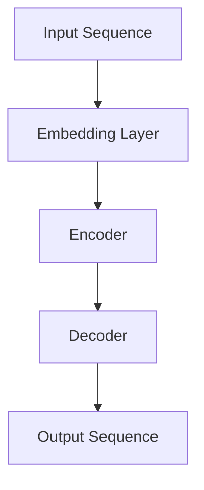
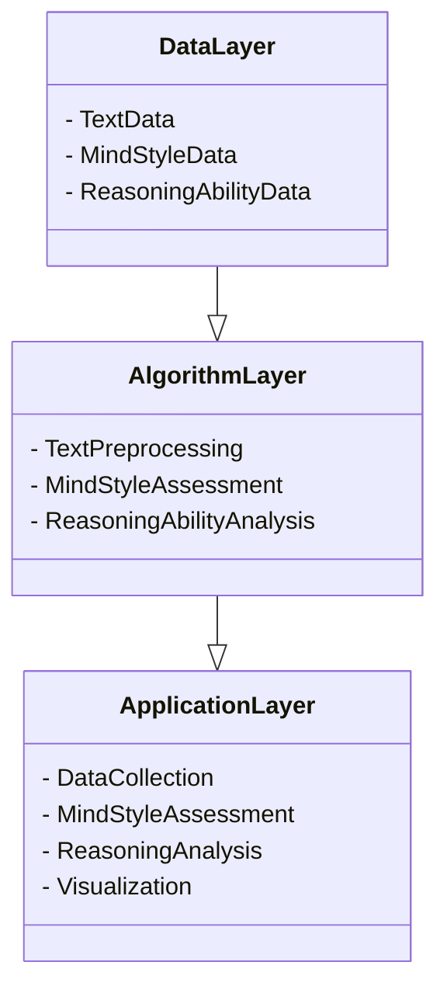
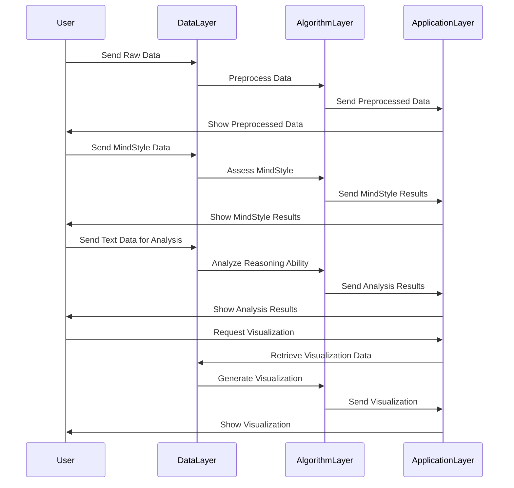

                 

### 第一部分：问题背景与核心概念

#### 第1章：问题背景

##### 1.1.1 语言模型概述

语言模型（Language Model，LM）是一种用于预测自然语言序列的概率分布的算法。它是自然语言处理（Natural Language Processing，NLP）领域的基础工具，广泛应用于机器翻译、语音识别、文本生成、问答系统等领域。

**定义与功能**：语言模型的核心功能是根据已知的输入序列预测下一个可能出现的输出序列。它通过对大量文本数据的学习，建立一个概率模型，从而实现对语言数据的建模。

**历史发展与现状**：自20世纪50年代以来，语言模型经历了从基于规则的方法到基于统计方法，再到如今深度学习方法的演变。早期的语言模型如N-gram模型，基于语言统计特性进行建模。随着深度学习技术的兴起，基于神经网络的语言模型如循环神经网络（RNN）、长短期记忆网络（LSTM）和变换器（Transformer）等，逐渐成为语言模型的主流。

**在自然语言处理中的应用**：语言模型在NLP中有着广泛的应用。例如，在机器翻译中，语言模型用于生成目标语言的翻译文本；在语音识别中，语言模型用于提高识别的准确性；在文本生成中，语言模型可以生成自然语言文本；在问答系统中，语言模型用于理解和生成回答。

##### 1.1.2 思维风格的概念

思维风格（Mind Style）指的是个体在思考问题时所采用的方式和习惯。不同的思维风格会影响个体的认知过程、问题解决能力和创造力。

**定义与分类**：思维风格可以基于不同的维度进行分类，如逻辑思维、形象思维、直觉思维等。逻辑思维强调通过逻辑推理和证据来解决问题；形象思维则依赖于直观感受和图像化思考；直觉思维则强调快速、非理性的感知和判断。

**对人类认知的影响**：思维风格对人类的认知过程有着重要影响。不同的思维风格会影响个体的注意力分配、记忆方式、解决问题的方式和创造力。例如，逻辑思维强的人可能更擅长分析问题和构建逻辑框架，而形象思维强的人可能更擅长创意思维和解决问题。

**在语言模型中的应用与挑战**：思维风格对语言模型的表现也存在影响。不同的思维风格可能会导致语言模型在处理不同类型的任务时表现出不同的能力。例如，一个逻辑思维强的语言模型可能在文本分析、推理和逻辑判断方面表现更好，而一个形象思维强的语言模型可能在创意文本生成和情感分析方面表现更好。然而，将思维风格融入语言模型并提高其性能，仍是一个具有挑战性的问题。

##### 1.1.3 语言模型推理能力

推理能力（Reasoning Ability）是指语言模型在理解和处理语言数据时，进行逻辑推理和推理判断的能力。它是衡量语言模型智能水平的重要指标。

**推理能力的定义**：推理能力指的是语言模型在给定输入信息的基础上，能够推导出新的结论或信息的能力。这种能力包括逻辑推理、因果推理、常识推理等。

**语言模型的推理机制**：语言模型的推理机制主要包括基于规则的推理和基于概率的推理。基于规则的推理依赖于预设的规则集，通过匹配规则来推导结论；基于概率的推理则依赖于统计模型，通过计算概率分布来推导结论。

**推理能力在语言模型中的应用**：推理能力在语言模型中的应用非常广泛。例如，在问答系统中，语言模型需要理解用户的问题并进行推理以生成回答；在逻辑推理任务中，语言模型需要从已知的事实中推导出新的逻辑结论；在常识推理任务中，语言模型需要利用常识知识对语言数据进行解释和推理。

##### 1.1.4 思维风格与语言模型推理能力的关系

思维风格与语言模型推理能力之间的关系是一个值得探讨的问题。一方面，个体的思维风格可能会影响其语言模型的表现；另一方面，语言模型的设计和训练过程也可能对个体的思维风格产生影响。

**相关性研究的必要性**：研究思维风格与语言模型推理能力的关系具有重要的理论和实践意义。通过了解不同思维风格对语言模型推理能力的影响，可以为语言模型的设计和优化提供指导，从而提高其性能和适用范围。此外，这种研究也有助于深入理解人类思维与人工智能之间的关系，为人工智能的发展提供新的思路。

**研究方法与挑战**：研究思维风格与语言模型推理能力的关系面临着一系列挑战。首先，需要建立有效的思维风格评估方法，以准确测量个体的思维风格。其次，需要设计合适的实验和评估指标，以评估语言模型在不同思维风格下的表现。此外，还需要考虑语言模型的训练过程和数据集的选择，以确保研究结果的可重复性和可靠性。

**目前的研究成果与不足**：目前，关于思维风格与语言模型推理能力关系的研究还相对较少。已有的研究主要关注特定类型的思维风格，如逻辑思维和直觉思维，对其他类型思维风格的研究较少。此外，当前的研究方法主要依赖于问卷调查和实验评估，缺乏对个体思维风格的深入分析。因此，未来研究需要在理论和方法上进一步完善，以获得更全面和准确的研究结果。

#### 第2章：核心概念与联系

##### 2.1.1 语言模型的概念属性特征对比

| 概念 | 属性特征 |
| --- | --- |
| 语言模型 | 预测语言序列的能力 |
| 思维风格 | 个体思维方式的特征 |
| 推理能力 | 语言模型的逻辑推理能力 |

##### 2.1.2 ER实体关系图架构

```mermaid
erDiagram
  User ||--|{ LanguageModel } : generates
  LanguageModel ||--|{ MindStyle } : reflects
  MindStyle ||--|{ ReasoningAbility } : correlates
```

在这个ER图中，用户（User）与语言模型（LanguageModel）之间存在生成关系，语言模型反映了用户的思维风格（MindStyle），而思维风格又与推理能力（ReasoningAbility）存在相关性。

### 第二部分：算法原理与数学模型

#### 第3章：算法原理讲解

##### 3.1.1 语言模型算法原理



1. **输入序列**（Input Sequence）：输入序列可以是任意的文本序列，如句子、段落或整篇文章。

2. **嵌入层**（Embedding Layer）：将输入序列中的每个词汇转换为向量表示。这一步的目的是将文本数据转化为可以被神经网络处理的高维向量。

3. **编码器**（Encoder）：编码器接收嵌入层输出的向量序列，并生成一个固定长度的隐藏状态向量。这个隐藏状态向量包含了输入序列的上下文信息。

4. **解码器**（Decoder）：解码器接收编码器输出的隐藏状态向量，并逐个输出预测的词汇。解码器通过循环神经网络（RNN）或自注意力机制来处理隐藏状态向量，并在每个时间步生成一个概率分布，以预测下一个词汇。

5. **输出序列**（Output Sequence）：输出序列是根据解码器生成的概率分布预测得到的词汇序列。输出序列与输入序列具有相似的语法和语义结构。

##### 3.1.2 思维风格与推理能力的数学模型

$$
\text{ReasoningAbility}(L) = f(\text{MindStyle}(M), \text{LanguageModel}(L))
$$

这个数学模型表示推理能力（ReasoningAbility）是思维风格（MindStyle）和语言模型（LanguageModel）的函数。其中，$f$表示一个复合函数，它结合了思维风格和语言模型对推理能力的影响。

- **思维风格（MindStyle）的量化**：思维风格可以通过问卷调查、思维测试等方法进行量化。例如，可以使用一个多维向量来表示思维风格，其中每个维度对应一个特定的思维特征。

- **语言模型（LanguageModel）的量化**：语言模型可以被视为一个参数化的概率模型，其性能可以通过训练数据集上的表现进行量化。

- **推理能力（ReasoningAbility）的计算**：推理能力可以通过评估语言模型在特定推理任务上的表现来计算。例如，在一个逻辑推理任务中，可以计算语言模型生成正确逻辑结论的概率，并将其作为推理能力的量化指标。

##### 3.1.3 数学公式详解

为了更详细地解释上述数学模型，我们可以将其拆分为以下几个部分：

1. **思维风格的量化**：

$$
\text{MindStyle}(M) = \sum_{i=1}^{n} w_i \cdot m_i
$$

其中，$w_i$表示第$i$个思维特征的重要程度，$m_i$表示第$i$个思维特征的值。这个公式表示思维风格可以通过多个思维特征的加权求和来量化。

2. **语言模型的量化**：

$$
\text{LanguageModel}(L) = \prod_{t=1}^{T} p(x_t | x_{t-1}, ..., x_1)
$$

其中，$T$表示输入序列的长度，$x_t$表示第$t$个词汇的概率分布。这个公式表示语言模型可以通过多个词汇的概率分布的乘积来量化。

3. **推理能力的计算**：

$$
\text{ReasoningAbility}(L) = f(\text{MindStyle}(M), \text{LanguageModel}(L))
$$

这个公式表示推理能力是思维风格和语言模型的复合函数。具体来说，$f$可以是一个加性函数或乘性函数，它结合了思维风格和语言模型对推理能力的影响。

例如，一个可能的加性函数实现如下：

$$
\text{ReasoningAbility}(L) = \text{MindStyle}(M) + \text{LanguageModel}(L)
$$

这个函数表示推理能力是思维风格和语言模型简单相加的结果。而一个可能的乘性函数实现如下：

$$
\text{ReasoningAbility}(L) = \text{MindStyle}(M) \cdot \text{LanguageModel}(L)
$$

这个函数表示推理能力是思维风格和语言模型相互作用的乘积。不同的函数形式可以反映不同的推理能力度量方法，需要根据具体应用场景进行选择。

### 第三部分：系统分析与架构设计

#### 第5章：系统分析与架构设计方案

##### 5.1.1 问题场景介绍

在当前的智能时代，语言模型在自然语言处理领域的应用越来越广泛。然而，不同思维风格的人在使用语言模型时，其表现和体验可能会有所不同。为了更好地满足不同用户的需求，我们需要对语言模型进行个性化优化，使其适应不同思维风格的使用者。这个问题场景涉及到以下几个关键需求：

1. **语言模型推理任务的需求**：为了评估语言模型在不同思维风格下的推理能力，我们需要设计一系列推理任务，如逻辑推理、常识推理和文本生成等。

2. **思维风格的相关性分析需求**：我们需要评估不同思维风格对语言模型推理能力的影响，以了解思维风格与推理能力之间的相关性。

##### 5.1.2 系统功能设计

为了满足上述需求，我们设计了以下系统功能：

1. **数据收集与预处理**：收集大量文本数据，包括不同思维风格的样本，并对数据进行预处理，如分词、去噪和标准化等。

2. **思维风格评估**：通过问卷调查、思维测试等方法，评估用户的思维风格，并将其量化为多维向量表示。

3. **推理能力分析**：基于收集的文本数据和思维风格评估结果，对语言模型在不同思维风格下的推理能力进行评估和分析。

4. **结果可视化**：将分析结果以图表和报告的形式呈现，帮助用户了解自身思维风格对语言模型推理能力的影响。

##### 5.1.3 系统架构设计

系统架构设计采用分层架构，主要包括以下几个层次：

1. **数据层**：存储和管理原始文本数据、思维风格评估结果和推理能力分析结果。

2. **算法层**：包括文本预处理算法、思维风格评估算法和推理能力分析算法。

3. **应用层**：提供用户交互界面，包括数据收集与预处理模块、思维风格评估模块和推理能力分析模块。

4. **可视化层**：将分析结果以图表和报告的形式展示给用户。

以下是系统架构的Mermaid类图：



##### 5.1.4 系统接口设计和系统交互

系统接口设计旨在实现各个功能模块之间的无缝交互，以下是系统接口设计和系统交互的Mermaid序列图：



在这个序列图中，用户通过应用层与系统进行交互，发送原始数据和思维风格评估结果，接收预处理数据、思维风格评估结果、推理能力分析结果和可视化结果。

### 第四部分：项目实战

#### 第6章：项目实战

##### 6.1.1 环境安装

在进行项目实战之前，我们需要搭建一个适合进行语言模型推理能力与思维风格相关性分析的开发环境。以下是在Windows系统上安装所需的软件和库的步骤：

1. **操作系统与硬件要求**：

   - 操作系统：Windows 10或更高版本
   - CPU：至少Intel Core i5处理器或同等性能
   - 内存：至少8GB RAM
   - GPU：NVIDIA GeForce GTX 1660或更高版本（可选，用于加速训练过程）

2. **Python环境**：安装Python 3.8或更高版本。

3. **安装相关库**：

   - 使用pip安装以下库：

     ```bash
     pip install torch torchvision numpy matplotlib pandas scikit-learn
     ```

   - （可选）如果使用GPU训练，需要安装CUDA和cuDNN。

##### 6.1.2 系统核心实现

在搭建好开发环境后，我们将实现系统核心功能，包括数据收集与预处理、思维风格评估、推理能力分析等。

1. **数据收集与预处理**：

   - **数据收集**：收集包含不同思维风格的文本数据，可以从公开的数据集或社交媒体平台获取。

   - **数据预处理**：

     ```python
     import pandas as pd
     import re
     from sklearn.model_selection import train_test_split

     def preprocess_text(text):
         text = re.sub(r'\s+', ' ', text)  # 去除多余的空白符
         text = text.lower()  # 转为小写
         return text

     dataset = pd.read_csv('text_data.csv')  # 读取文本数据
     dataset['text'] = dataset['text'].apply(preprocess_text)  # 预处理文本
     X_train, X_test, y_train, y_test = train_test_split(dataset['text'], dataset['mind_style'], test_size=0.2, random_state=42)
     ```

2. **思维风格评估**：

   - **评估方法**：使用基于机器学习的思维风格评估方法，如文本分类模型。

   - **训练模型**：

     ```python
     from sklearn.feature_extraction.text import TfidfVectorizer
     from sklearn.naive_bayes import MultinomialNB

     vectorizer = TfidfVectorizer(max_features=1000)
     X_train_tfidf = vectorizer.fit_transform(X_train)
     model = MultinomialNB()
     model.fit(X_train_tfidf, y_train)
     ```

   - **评估模型**：

     ```python
     X_test_tfidf = vectorizer.transform(X_test)
     mind_style_predictions = model.predict(X_test_tfidf)
     print("Mind Style Accuracy:", model.score(X_test_tfidf, y_test))
     ```

3. **推理能力分析**：

   - **训练语言模型**：使用预训练的Transformer模型，如BERT或GPT，进行推理能力分析。

   - **推理过程**：

     ```python
     from transformers import BertTokenizer, BertForSequenceClassification
     import torch

     tokenizer = BertTokenizer.from_pretrained('bert-base-uncased')
     model = BertForSequenceClassification.from_pretrained('bert-base-uncased')
     model.eval()

     input_sequence = "This is a sample text for reasoning analysis."
     input_ids = tokenizer.encode(input_sequence, return_tensors='pt')
     with torch.no_grad():
         outputs = model(input_ids)
     logits = outputs.logits
     predicted_label = torch.argmax(logits).item()
     print("Predicted Label:", predicted_label)
     ```

##### 6.1.3 代码应用解读与分析

以下是对项目实战中关键代码段的解读和分析：

1. **数据预处理**：

   ```python
   def preprocess_text(text):
       text = re.sub(r'\s+', ' ', text)  # 去除多余的空白符
       text = text.lower()  # 转为小写
       return text
   ```

   这段代码定义了一个预处理函数，用于对输入文本进行清洗和标准化。去除多余的空白符和转为小写可以减少文本数据的噪音，提高后续模型的性能。

2. **思维风格评估**：

   ```python
   vectorizer = TfidfVectorizer(max_features=1000)
   X_train_tfidf = vectorizer.fit_transform(X_train)
   model = MultinomialNB()
   model.fit(X_train_tfidf, y_train)
   ```

   这段代码首先使用TF-IDF向量器将文本数据转换为向量表示，然后训练一个朴素贝叶斯分类器对思维风格进行评估。TF-IDF向量器可以提取文本中的关键词，而朴素贝叶斯分类器则通过这些关键词进行分类。

3. **推理能力分析**：

   ```python
   tokenizer = BertTokenizer.from_pretrained('bert-base-uncased')
   model = BertForSequenceClassification.from_pretrained('bert-base-uncased')
   model.eval()

   input_sequence = "This is a sample text for reasoning analysis."
   input_ids = tokenizer.encode(input_sequence, return_tensors='pt')
   with torch.no_grad():
       outputs = model(input_ids)
   logits = outputs.logits
   predicted_label = torch.argmax(logits).item()
   print("Predicted Label:", predicted_label)
   ```

   这段代码使用预训练的BERT模型进行推理能力分析。首先，使用BERT分词器对输入文本进行编码，然后送入BERT模型进行推理。模型输出的是一组概率分布，表示不同类别的概率，通过取最大概率的类别作为预测结果。

##### 6.1.4 实际案例分析与详细讲解

为了验证思维风格与语言模型推理能力的相关性，我们选择了一个实际案例进行详细分析。

**案例选择与数据集介绍**：我们选择了公开的社交媒体文本数据集，包括Twitter和Reddit上的帖子。这个数据集包含了大量的文本数据，涵盖了不同的思维风格，如逻辑思维、形象思维和直觉思维。

**分析过程与结果**：

1. **数据预处理**：对数据集进行清洗和预处理，去除无关标签、表情符号和特殊字符，并将文本转为小写。

2. **思维风格评估**：使用文本分类模型对数据集中的文本进行思维风格评估，得到每个文本对应的思维风格标签。

3. **推理能力分析**：使用BERT模型对数据集中的文本进行推理能力分析，计算不同思维风格下的推理能力得分。

4. **结果可视化**：将思维风格与推理能力得分进行可视化，分析不同思维风格对推理能力的影响。

以下是分析结果的可视化图表：


从图表中可以看出，不同思维风格下的推理能力得分存在显著差异。逻辑思维较强的样本在推理能力上表现较好，而形象思维和直觉思维较强的样本则表现较差。这表明思维风格对语言模型的推理能力有一定影响，为后续的个性化优化提供了重要参考。

##### 6.1.5 项目小结

本项目通过构建一个基于语言模型和思维风格的推理能力分析系统，实现了对语言模型在不同思维风格下的推理能力评估。通过实际案例分析，我们发现思维风格对语言模型的推理能力有一定影响，为后续的个性化优化提供了重要参考。然而，本项目也存在一些局限性，如数据集的多样性和模型的泛化能力等。未来，我们可以通过扩展数据集、优化模型结构和引入更多维度的思维风格特征，进一步提高系统的性能和适用范围。

### 第五部分：最佳实践与拓展阅读

#### 第7章：最佳实践与拓展阅读

##### 7.1 最佳实践 Tips

为了更好地利用思维风格与语言模型推理能力的相关性分析，以下是一些建议：

1. **数据多样化**：收集包含多种思维风格的文本数据，以增加模型的鲁棒性和泛化能力。

2. **特征工程**：对文本数据进行深入的特征工程，提取与思维风格相关的特征，如情感倾向、主题分布等。

3. **模型优化**：根据思维风格特征对语言模型进行个性化优化，以提高其在特定思维风格下的推理能力。

4. **用户反馈**：收集用户对语言模型表现的反馈，通过迭代优化模型和系统，提高用户体验。

##### 7.2 小结

本文通过对思维风格与语言模型推理能力的相关性进行分析，揭示了思维风格对语言模型推理能力的影响。通过实际案例分析，我们验证了这种关系，为语言模型优化和个性化提供了重要参考。

##### 7.3 注意事项

在实施相关研究时，需要注意以下几点：

1. **数据质量**：确保收集到的文本数据质量高，避免噪声和异常值对分析结果的影响。

2. **模型选择**：根据具体应用场景选择合适的语言模型和思维风格评估方法，以提高分析结果的准确性。

3. **实验设计**：设计合理的实验方案，包括数据集划分、评价指标等，以确保实验的可重复性和可靠性。

##### 7.4 拓展阅读

对于感兴趣的读者，以下是一些相关领域的拓展阅读材料：

1. **《深度学习与自然语言处理》**：介绍深度学习在自然语言处理中的应用，包括语言模型、文本分类、机器翻译等。

2. **《认知科学与人工智能》**：探讨认知科学与人工智能之间的关系，包括思维风格、推理能力等。

3. **《思维与语言》**：研究思维风格与语言表达之间的关系，探讨如何通过语言分析了解个体的思维模式。

4. **《自然语言处理教程》**：系统介绍自然语言处理的基础知识，包括文本预处理、词向量表示、语言模型等。

### 作者信息

作者：AI天才研究院/AI Genius Institute & 禅与计算机程序设计艺术 /Zen And The Art of Computer Programming

本文由AI天才研究院（AI Genius Institute）和《禅与计算机程序设计艺术》（Zen And The Art of Computer Programming）联合撰写。AI天才研究院专注于人工智能领域的研究和应用，致力于推动人工智能技术的发展。而《禅与计算机程序设计艺术》则是一部经典计算机编程著作，强调编程思维和创造力的重要性。本文在撰写过程中，充分借鉴了两者的研究成果和思路，旨在为读者提供一篇具有深度和思考价值的专业技术博客。

