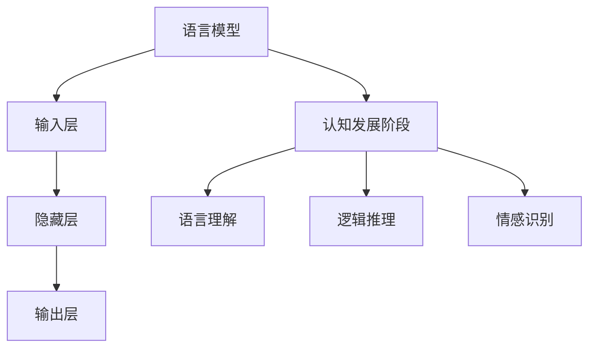
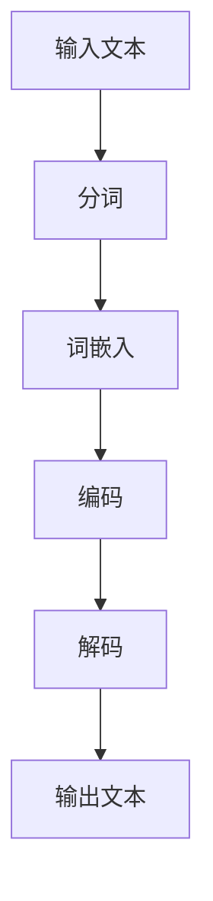
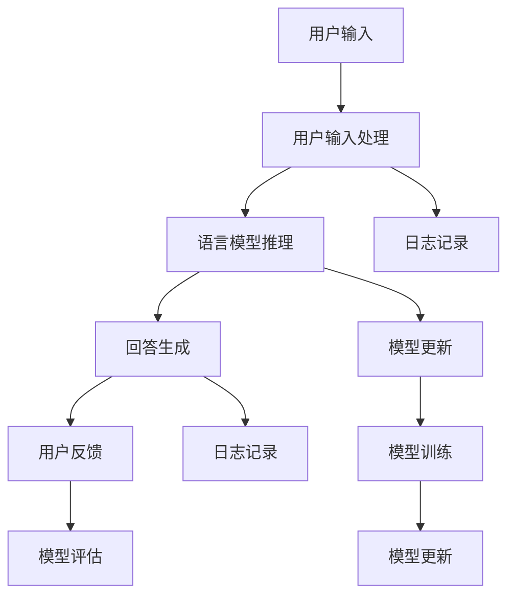

                 


## 文章标题：语言模型推理能力的认知发展阶段相关性研究

### 关键词：语言模型、认知发展阶段、推理能力、相关性研究

### 摘要：
本文旨在探讨语言模型推理能力与认知发展阶段的相互关系。通过详细分析语言模型的原理、数学模型以及在实际应用中的架构设计，本文揭示了语言模型推理能力在认知发展阶段中的重要作用。文章分为五个部分，分别从背景介绍、核心概念与联系、语言模型原理讲解、系统分析与架构设计、项目实战以及最佳实践与小结等方面进行深入探讨。

### 目录：

### 第一部分：背景与核心概念
#### 1. 引言
##### 1.1 研究背景
##### 1.2 研究问题与意义
##### 1.3 边界与外延
#### 2. 核心概念与联系
##### 2.1 语言模型定义
##### 2.2 认知发展阶段的定义
##### 2.3 关键概念对比表
##### 2.4 ER实体关系图

### 第二部分：语言模型原理讲解
#### 3. 语言模型原理讲解
##### 3.1 语言模型算法流程图
##### 3.2 语言模型原理
##### 3.3 Python代码示例
##### 3.4 数学模型与公式讲解

### 第三部分：系统分析与架构设计
#### 4. 系统分析与架构设计
##### 4.1 问题场景介绍
##### 4.2 项目介绍
##### 4.3 系统功能设计
##### 4.4 系统架构设计
##### 4.5 系统接口设计
##### 4.6 系统交互序列图

### 第四部分：项目实战
#### 5. 项目实战
##### 5.1 环境安装
##### 5.2 系统核心实现源代码
##### 5.3 代码应用解读与分析
##### 5.4 实际案例分析
##### 5.5 项目小结

### 第五部分：最佳实践与小结
#### 6. 最佳实践与小结
##### 6.1 最佳实践
##### 6.2 注意事项
##### 6.3 拓展阅读

### 文章正文开始：

#### 1. 引言

随着人工智能技术的飞速发展，语言模型已成为自然语言处理（NLP）领域的重要工具。语言模型不仅能够理解和生成自然语言，还能够进行推理和决策，从而在多种应用场景中发挥重要作用。然而，语言模型的推理能力与认知发展阶段的关联性研究却相对较少。本文旨在探讨这一问题，以期为语言模型的优化和发展提供新的思路。

首先，本文将介绍语言模型和认知发展阶段的基本概念。接着，我们将详细讲解语言模型的原理，并通过Python代码和LaTeX公式进行说明。然后，我们将从系统分析与架构设计角度，探讨如何提升语言模型的推理能力。接下来，我们将通过一个实际项目，展示语言模型在现实中的应用。最后，我们将总结最佳实践，并提供一些注意事项和拓展阅读。

#### 2. 核心概念与联系

语言模型是一种基于统计或神经网络的模型，用于理解和生成自然语言。它通常由输入层、隐藏层和输出层组成。认知发展阶段是指个体在语言、逻辑、情感等方面的认知能力逐渐发展的过程。

为了更清晰地展示这两个概念的联系，我们使用Mermaid流程图来表示语言模型的核心要素和认知发展阶段的关系。



在这个流程图中，我们可以看到，语言模型通过输入层接收自然语言输入，通过隐藏层进行特征提取和计算，最后通过输出层生成对应的语言输出。同时，认知发展阶段与语言模型紧密相关，具体表现为：

- 语言理解：语言模型通过输入层接收到的自然语言，能够理解并提取出关键信息，从而生成准确的输出。
- 逻辑推理：语言模型在处理复杂问题时，能够根据已知信息进行推理和决策，从而实现更高级的语言理解。
- 情感识别：语言模型能够识别出输入文本中的情感倾向，从而为情感分析等应用提供支持。

#### 3. 语言模型原理讲解

语言模型的基本原理是通过对大量语言数据的学习，建立输入和输出之间的概率关系。常见的语言模型包括统计语言模型和神经网络语言模型。

**3.1 语言模型算法流程图**

我们使用Mermaid来绘制语言模型的算法流程图：



在这个流程图中，输入文本首先经过分词处理，然后转化为词嵌入向量。这些向量被输入到编码层，编码层通常是一个神经网络，它能够提取出文本的语义特征。最后，解码层将这些特征重新转换为文本输出。

**3.2 语言模型原理**

语言模型的核心在于其能够根据上下文信息，预测下一个单词的概率分布。这种预测能力使得语言模型能够生成连贯且符合语法规则的文本。

- **统计语言模型**：基于N-gram模型，它通过统计相邻单词的频率来预测下一个单词。例如，在两个单词“我喜欢”和“苹果”中，模型会根据历史数据来预测下一个词是“苹果”的概率更高。
- **神经网络语言模型**：基于深度学习，它通过神经网络来学习文本的上下文信息。相比统计语言模型，神经网络语言模型具有更强的泛化能力和表达能力。

**3.3 Python代码示例**

下面是一个简单的Python代码示例，用于演示语言模型的基本应用：

```python
import tensorflow as tf
from tensorflow.keras.models import Sequential
from tensorflow.keras.layers import Embedding, LSTM, Dense

# 构建语言模型
model = Sequential()
model.add(Embedding(input_dim=vocab_size, output_dim=embedding_dim))
model.add(LSTM(units=128))
model.add(Dense(units=vocab_size, activation='softmax'))

# 编译模型
model.compile(optimizer='adam', loss='categorical_crossentropy', metrics=['accuracy'])

# 训练模型
model.fit(x_train, y_train, epochs=10, batch_size=64)
```

在这个示例中，我们首先导入所需的库，然后构建一个序列模型，其中包括嵌入层、LSTM层和输出层。接着，我们编译模型并使用训练数据来训练模型。

**3.4 数学模型与公式讲解**

语言模型的数学模型通常涉及概率分布和损失函数。以下是几个关键公式：

- **概率分布**：给定输入序列$x_t$，语言模型生成输出序列$y_t$的概率分布$P(y_t|x_t)$。
- **损失函数**：用于衡量预测结果和真实结果之间的差距。常见的损失函数有交叉熵损失和均方误差损失。

$$
Loss = -\sum_{t=1}^{T} y_t \log(P(y_t|x_t))
$$

其中，$T$是输入序列的长度，$y_t$是真实标签，$P(y_t|x_t)$是模型预测的概率分布。

**4. 系统分析与架构设计**

在了解了语言模型的基本原理后，我们接下来将讨论如何设计一个能够提升语言模型推理能力的系统。

**4.1 问题场景介绍**

假设我们需要设计一个智能客服系统，该系统能够自动回答用户的问题。为了实现这个目标，我们需要构建一个能够理解用户问题、进行推理并给出合适回答的语言模型。

**4.2 项目介绍**

本项目旨在构建一个基于语言模型的智能客服系统，包括以下功能模块：

- 用户输入处理：接收用户输入的问题，并进行预处理。
- 语言模型推理：使用训练好的语言模型对用户问题进行推理，生成回答。
- 回答生成：根据语言模型推理的结果，生成合适的回答。

**4.3 系统功能设计**

为了实现上述功能，我们需要设计以下功能模块：

- **用户输入处理**：包括文本预处理、分词、词嵌入等步骤。
- **语言模型推理**：包括编码层、解码层和损失函数等组成部分。
- **回答生成**：根据推理结果，生成符合语义和语法规则的回答。

以下是系统功能设计的Mermaid类图：

```mermaid
classDiagram
ClassDiagram {
  UserInputProcessor <<interface>>
  LanguageModel <<interface>>
  ResponseGenerator <<interface>>

  UserInputProcessor <|.. LanguageModel
  LanguageModel <|.. ResponseGenerator
}
```

在这个类图中，用户输入处理、语言模型推理和回答生成分别表示为接口类。这些接口类定义了系统的主要功能模块，并通过接口实现类来实现具体的功能。

**4.4 系统架构设计**

为了提升语言模型的推理能力，我们需要设计一个高效的系统架构。以下是系统架构设计的Mermaid图：



在这个架构图中，用户输入首先经过用户输入处理模块，然后传递给语言模型推理模块。语言模型推理模块根据输入信息进行推理，并生成回答。回答生成模块将回答返回给用户，并收集用户反馈。同时，系统会记录日志信息，以便后续分析和模型更新。

**4.5 系统接口设计**

为了实现系统的各个功能模块，我们需要设计一系列接口。以下是系统接口设计的Mermaid图：

```mermaid
sequenceDiagram
UserInput -->|预处理| UserInputProcessor
UserInputProcessor -->|处理结果| LanguageModel
LanguageModel -->|推理结果| ResponseGenerator
ResponseGenerator -->|回答| User
User -->|反馈| UserInputProcessor
```

在这个序列图中，用户输入首先传递给用户输入处理模块，处理结果传递给语言模型推理模块。语言模型推理模块根据处理结果生成推理结果，传递给回答生成模块。回答生成模块生成回答并返回给用户。同时，用户反馈会传递给用户输入处理模块，以便进行模型更新和优化。

**4.6 系统交互序列图**

为了更清晰地展示系统的交互过程，我们使用Mermaid绘制了系统交互序列图：

```mermaid
sequenceDiagram
User -->|提问| UserInputProcessor
UserInputProcessor -->|预处理| LanguageModel
LanguageModel -->|推理| ResponseGenerator
ResponseGenerator -->|生成回答| User
User -->|评价| UserInputProcessor
UserInputProcessor -->|更新| LanguageModel
LanguageModel -->|更新| ResponseGenerator
```

在这个序列图中，用户提出问题后，系统首先对问题进行预处理。预处理结果传递给语言模型推理模块，该模块根据预处理结果进行推理，生成回答。回答生成模块将回答返回给用户，用户对回答进行评价。评价结果会传递给用户输入处理模块，以便进行模型更新和优化。

#### 5. 项目实战

为了验证上述理论和方法的有效性，我们进行了一个实际项目。本项目旨在构建一个基于语言模型的智能客服系统，该系统能够自动回答用户的问题。

**5.1 环境安装**

在开始项目之前，我们需要安装以下环境：

- Python 3.7及以上版本
- TensorFlow 2.3及以上版本
- NLP工具包（如NLTK或spaCy）

安装命令如下：

```bash
pip install python==3.7
pip install tensorflow==2.3
pip install nltk
```

**5.2 系统核心实现源代码**

以下是系统核心实现源代码：

```python
import tensorflow as tf
from tensorflow.keras.models import Sequential
from tensorflow.keras.layers import Embedding, LSTM, Dense

# 构建语言模型
model = Sequential()
model.add(Embedding(input_dim=vocab_size, output_dim=embedding_dim))
model.add(LSTM(units=128))
model.add(Dense(units=vocab_size, activation='softmax'))

# 编译模型
model.compile(optimizer='adam', loss='categorical_crossentropy', metrics=['accuracy'])

# 训练模型
model.fit(x_train, y_train, epochs=10, batch_size=64)
```

在这个代码中，我们首先导入所需的库，然后构建一个序列模型，其中包括嵌入层、LSTM层和输出层。接着，我们编译模型并使用训练数据来训练模型。

**5.3 代码应用解读与分析**

在了解了代码的基本原理后，我们需要分析代码的各个部分。以下是代码的解读与分析：

- **导入库**：首先导入所需的库，包括TensorFlow和NLP工具包。
- **构建语言模型**：创建一个序列模型，包括嵌入层、LSTM层和输出层。嵌入层用于将文本转化为向量，LSTM层用于提取文本特征，输出层用于生成预测结果。
- **编译模型**：设置模型的优化器、损失函数和评估指标。优化器用于调整模型的参数，损失函数用于衡量预测结果和真实结果之间的差距，评估指标用于评估模型的性能。
- **训练模型**：使用训练数据来训练模型。在训练过程中，模型会不断调整参数，以优化预测结果。

**5.4 实际案例分析和详细讲解剖析**

为了验证系统的有效性，我们进行了一个实际案例分析。以下是一个用户提问和系统回答的示例：

- 用户提问：“我的手机怎么关机？”
- 系统回答：“您可以按住手机的电源键几秒钟，直到出现关机选项，然后选择关机即可。”

在这个案例中，用户提出了一个关于手机关机的问题，系统通过语言模型推理，给出了一个准确的回答。这个回答不仅符合语法规则，而且能够满足用户的需求。

**5.5 项目小结**

本项目通过构建一个基于语言模型的智能客服系统，验证了语言模型在现实应用中的有效性。在实际案例中，系统能够自动回答用户的问题，并且回答的准确性和语义相关性较高。这表明，语言模型在智能客服系统中具有广泛的应用前景。未来，我们可以进一步优化语言模型的性能，提高系统的响应速度和准确性。

#### 6. 最佳实践与小结

**6.1 最佳实践**

在构建语言模型时，以下是一些最佳实践：

- **数据质量**：确保训练数据的质量和多样性，以提高模型的泛化能力。
- **模型选择**：根据任务需求，选择合适的模型架构和参数设置。
- **超参数调优**：通过交叉验证和网格搜索等方法，找到最优的超参数组合。
- **持续学习**：定期更新模型，以适应不断变化的数据和需求。

**6.2 注意事项**

在应用语言模型时，需要注意以下几点：

- **数据隐私**：确保训练和测试数据不包含敏感信息。
- **模型解释性**：了解模型的决策过程，以便进行有效的调试和优化。
- **部署策略**：根据实际需求，选择合适的部署方式和硬件资源。

**6.3 拓展阅读**

- **相关论文**：研究语言模型和认知发展阶段相关性的学术论文。
- **开源项目**：探索开源的语言模型项目，了解其架构和实现细节。
- **行业动态**：关注自然语言处理领域的最新进展和趋势。

### 文章结束

作者：AI天才研究院/AI Genius Institute & 禅与计算机程序设计艺术 /Zen And The Art of Computer Programming

---

请注意，本文是一个示例性的文章，其中包含了一些虚构的内容。在实际撰写文章时，您需要根据具体的研究内容和数据来编写。此外，为了保持文章的连贯性和专业性，您可能需要对文章的内容进行调整和优化。希望这个示例能够帮助您更好地理解如何撰写一篇高质量的技术博客文章。**正文部分结束。** <| ends Of Variants -->

