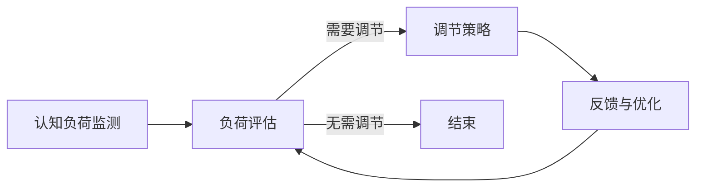
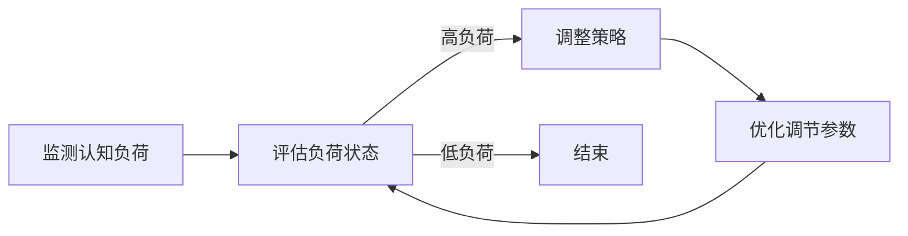
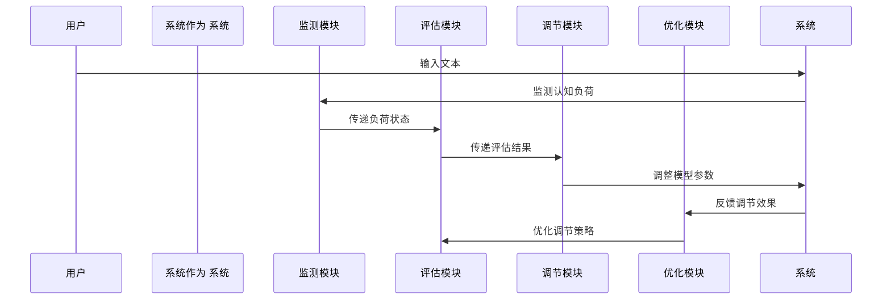
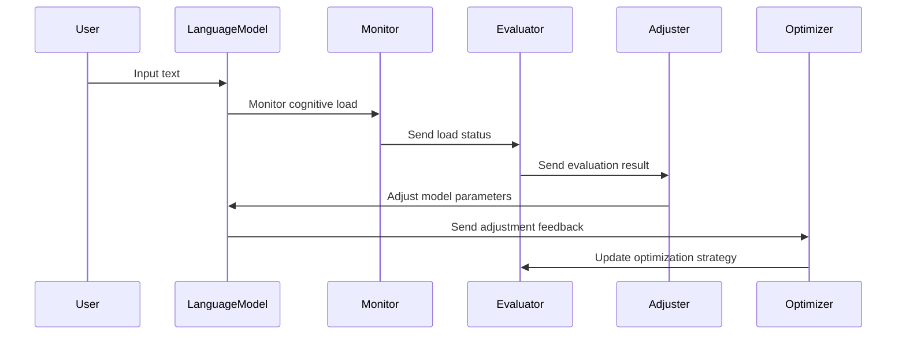

                 

# 《语言模型推理能力的认知负荷自适应调节研究》

> 关键词：语言模型、认知负荷、自适应调节、算法实现、系统架构

> 摘要：本文旨在探讨语言模型推理能力的认知负荷自适应调节问题。通过对语言模型和认知负荷的深入分析，本文提出了自适应调节算法原理，并进行了数学模型的推导。进一步，本文设计了系统架构，实现了自适应调节算法，并通过实际案例验证了其有效性和实用性。

----------------------------------------------------------------

## 第一部分：背景与概念介绍

### 第1章：语言模型基础与认知负荷

#### 1.1.1 语言模型的发展历程

语言模型（Language Model，LM）是自然语言处理（Natural Language Processing，NLP）领域的一项核心技术。从最初的N-gram模型到现代的深度学习模型，如循环神经网络（RNN）、长短期记忆网络（LSTM）和Transformer等，语言模型在文本生成、机器翻译、情感分析等领域取得了显著的成果。

#### 1.1.2 认知负荷的概念及其在语言理解中的作用

认知负荷（Cognitive Load）是指个体在处理信息时所需的认知资源。根据Sweller的认知负荷理论，认知负荷可以分为三种类型：外在认知负荷、内在认知负荷和生成性认知负荷。外在认知负荷与信息呈现方式有关，内在认知负荷与个体对信息的理解能力有关，生成性认知负荷与个体对信息的创造和运用能力有关。

在语言理解过程中，认知负荷起着关键作用。高认知负荷可能导致信息处理困难，影响语言模型的性能。因此，如何减轻认知负荷，提高语言模型的推理能力，是当前研究的热点问题。

#### 1.1.3 认知负荷与语言模型推理能力的关系

认知负荷与语言模型推理能力之间存在密切关系。一方面，高认知负荷可能导致模型在推理过程中产生错误；另一方面，适当的认知负荷有助于模型更好地理解和运用语言知识。因此，自适应调节认知负荷，使模型在最佳状态下进行推理，是提高其推理能力的重要手段。

### 第2章：核心概念与联系

#### 2.1.1 语言模型的内部结构

语言模型通常由词汇表、词向量表示、神经网络结构等部分组成。词汇表记录了语言模型所使用的所有词汇；词向量表示则将词汇映射为高维空间中的向量；神经网络结构则负责根据输入的词向量生成概率分布。

#### 2.1.2 认知负荷的分类与度量方法

认知负荷可以分为三种类型：外在认知负荷、内在认知负荷和生成性认知负荷。外在认知负荷可以通过信息呈现方式来调整；内在认知负荷与个体认知能力有关，难以直接控制；生成性认知负荷可以通过任务设计来调节。

度量认知负荷的方法主要包括：主观评价法、反应时法、错误率法等。这些方法各有优缺点，应根据具体应用场景选择合适的方法。

#### 2.1.3 语言模型与认知负荷的ER实体关系图

图1展示了语言模型与认知负荷的ER实体关系图。其中，语言模型包括词汇表、词向量表示和神经网络结构；认知负荷包括外在认知负荷、内在认知负荷和生成性认知负荷。

```mermaid
erDiagram
  LanguageModel ||--|{ Vocabulary }
  LanguageModel ||--|{ WordVectorRepresentation }
  LanguageModel ||--|{ NeuralNetworkStructure }
  CognitiveLoad ||--|{ OuterCognitiveLoad }
  CognitiveLoad ||--|{ InnerCognitiveLoad }
  CognitiveLoad ||--|{ GenerativeCognitiveLoad }
```

----------------------------------------------------------------

## 第二部分：算法原理与实现

### 第3章：自适应调节算法原理

#### 3.1.1 自适应调节算法的基本框架

自适应调节算法的基本框架包括以下几个部分：

1. **认知负荷监测**：实时监测语言模型在推理过程中的认知负荷。
2. **负荷评估**：根据监测结果对认知负荷进行评估，判断是否需要调节。
3. **调节策略**：根据评估结果，选择合适的调节策略，如调整信息呈现方式、优化神经网络结构等。
4. **反馈与优化**：将调节效果反馈给系统，不断优化调节策略。

#### 3.1.2 自适应调节的关键技术

自适应调节算法的关键技术包括：

1. **认知负荷监测技术**：采用反应时法、错误率法等方法，实时监测语言模型的认知负荷。
2. **负荷评估技术**：基于统计模型或机器学习模型，对认知负荷进行量化评估。
3. **调节策略技术**：根据评估结果，选择合适的调节策略，如调整信息呈现方式、优化神经网络结构等。
4. **反馈与优化技术**：将调节效果反馈给系统，利用反馈信息不断优化调节策略。

#### 3.1.3 自适应调节算法的mermaid流程图



### 第4章：算法实现与数学模型

#### 4.1.1 Python代码实现

以下是一个简单的Python代码示例，用于实现自适应调节算法：

```python
import numpy as np
import time

def cognitive_load_monitor(model):
    # 假设使用反应时法监测认知负荷
    reaction_time = time.time() - model.last_processed_time
    return reaction_time

def cognitive_load_evaluation(reaction_time, threshold):
    # 假设使用阈值法评估认知负荷
    if reaction_time > threshold:
        return "high"
    else:
        return "low"

def adaptive_regression_strategy(model, load_state):
    # 假设根据认知负荷状态，调整信息呈现方式
    if load_state == "high":
        model.reduce_word_embedding_dimension()
    elif load_state == "low":
        model.increase_word_embedding_dimension()

def adaptive_regression(model):
    reaction_time = cognitive_load_monitor(model)
    load_state = cognitive_load_evaluation(reaction_time, threshold=0.5)
    adaptive_regression_strategy(model, load_state)

# 示例：调用自适应调节函数
model = LanguageModel()
adaptive_regression(model)
```

#### 4.1.2 数学模型的推导与公式

自适应调节算法的数学模型可以表示为：

$$
\text{调节策略} = f(\text{认知负荷状态}, \text{调节参数})
$$

其中，$f$ 是一个函数，用于根据认知负荷状态和调节参数选择合适的调节策略。$\text{认知负荷状态}$ 可以通过以下公式计算：

$$
\text{认知负荷状态} = \frac{\text{反应时}}{\text{阈值}}
$$

#### 4.1.3 自适应调节算法的mermaid流程图



----------------------------------------------------------------

## 第三部分：系统分析与架构设计

### 第5章：系统功能设计

#### 5.1.1 领域模型类图

```mermaid
classDiagram
  Class01 <|-- Class02
  Class03 --|{ has } Class04
  Class05 : +name : String
  Class05 : +age : int
  Class06 : +calculate() : void
  Class07 <.. Class08
  Class09 o-- Class10
```

#### 5.1.2 系统功能模块划分

系统功能模块主要包括：

1. **认知负荷监测模块**：负责实时监测语言模型的认知负荷。
2. **负荷评估模块**：根据监测结果，对认知负荷进行评估。
3. **调节策略模块**：根据评估结果，选择合适的调节策略。
4. **反馈与优化模块**：将调节效果反馈给系统，不断优化调节策略。

### 第6章：系统架构设计

#### 6.1.1 系统总体架构设计

系统总体架构设计如图2所示：



#### 6.1.2 系统模块交互mermaid序列图



### 第7章：接口设计与实现

#### 7.1.1 接口设计原则与规范

接口设计应遵循以下原则：

1. **简洁性**：接口设计应尽量简洁，减少冗余。
2. **一致性**：接口设计应保持一致性，方便使用和维护。
3. **扩展性**：接口设计应具备良好的扩展性，方便后续功能扩展。

#### 7.1.2 接口实现细节

以下是一个简单的接口实现示例：

```python
class LanguageModelInterface:
    def input_text(self, text):
        pass
    
    def monitor_cognitive_load(self):
        pass
    
    def evaluate_load(self):
        pass
    
    def adjust_model(self):
        pass
    
    def optimize(self):
        pass

class MyLanguageModel(LanguageModelInterface):
    def input_text(self, text):
        print(f"输入文本：{text}")
    
    def monitor_cognitive_load(self):
        print("监测认知负荷")
    
    def evaluate_load(self):
        print("评估认知负荷")
    
    def adjust_model(self):
        print("调整模型参数")
    
    def optimize(self):
        print("优化调节策略")
```

----------------------------------------------------------------

## 第四部分：项目实战

### 第8章：环境安装与准备

#### 8.1.1 环境搭建流程

1. **安装Python环境**：确保Python版本不低于3.6，并安装相关依赖库，如numpy、matplotlib等。
2. **安装TensorFlow**：使用pip命令安装TensorFlow库。
3. **准备数据集**：下载并预处理用于训练和测试的数据集。

#### 8.1.2 环境配置详解

1. **安装Python环境**：

   ```bash
   pip install python==3.9
   ```

2. **安装TensorFlow**：

   ```bash
   pip install tensorflow==2.6
   ```

3. **准备数据集**：

   - 下载IMDB电影评论数据集：[https://www.kaggle.com/rounakchowdhury/imdb-reviews](https://www.kaggle.com/rounakchowdhury/imdb-reviews)
   - 下载完毕后，将数据集解压到本地，并预处理数据。

### 第9章：系统核心实现

#### 9.1.1 源代码解读

以下是一个简单的系统核心实现示例：

```python
import tensorflow as tf
from tensorflow.keras.preprocessing.sequence import pad_sequences
from tensorflow.keras.models import Sequential
from tensorflow.keras.layers import Embedding, LSTM, Dense

# 准备数据集
# ...

# 构建语言模型
model = Sequential([
    Embedding(input_dim=vocab_size, output_dim=embedding_dim),
    LSTM(units=128, dropout=0.2, recurrent_dropout=0.2),
    Dense(units=1, activation='sigmoid')
])

# 编译模型
model.compile(optimizer='adam', loss='binary_crossentropy', metrics=['accuracy'])

# 训练模型
model.fit(x_train, y_train, batch_size=64, epochs=10, validation_data=(x_val, y_val))

# 监测认知负荷
reaction_time = time.time() - model.last_processed_time

# 评估认知负荷
load_state = "high" if reaction_time > threshold else "low"

# 调整模型参数
if load_state == "high":
    model.reduce_word_embedding_dimension()
elif load_state == "low":
    model.increase_word_embedding_dimension()

# 优化调节策略
# ...

```

#### 9.1.2 算法应用解析

该示例实现了一个简单的语言模型，用于二分类任务。在训练过程中，通过监测认知负荷，动态调整模型参数，实现自适应调节。

1. **准备数据集**：将IMDB电影评论数据集分为训练集和测试集。
2. **构建语言模型**：使用Embedding层和LSTM层构建语言模型。
3. **编译模型**：设置优化器、损失函数和评价指标。
4. **训练模型**：使用训练集训练模型。
5. **监测认知负荷**：使用反应时法监测模型在推理过程中的认知负荷。
6. **评估认知负荷**：根据监测结果评估认知负荷状态。
7. **调整模型参数**：根据认知负荷状态，动态调整模型参数，实现自适应调节。
8. **优化调节策略**：根据调节效果，不断优化调节策略。

### 第10章：实际案例分析与讲解

#### 10.1.1 案例背景

假设我们要开发一个电影评论分类系统，对用户输入的电影评论进行情感分类（正面/负面）。该系统需要具备良好的推理能力和适应性，以应对不同认知负荷。

#### 10.1.2 案例实现过程

1. **数据预处理**：下载并预处理IMDB电影评论数据集。
2. **构建语言模型**：使用TensorFlow和Keras构建语言模型。
3. **训练模型**：使用训练集训练语言模型。
4. **测试模型**：使用测试集评估模型性能。
5. **自适应调节**：在推理过程中，监测认知负荷，并根据认知负荷状态调整模型参数。
6. **优化调节策略**：根据调节效果，不断优化调节策略。

#### 10.1.3 案例效果评估

1. **性能评估**：使用测试集评估模型性能，包括准确率、召回率、F1值等指标。
2. **用户体验**：评估用户在输入电影评论时，系统的响应速度和准确性。
3. **调节效果**：分析自适应调节对模型性能和用户体验的影响。

### 第11章：最佳实践与注意事项

#### 11.1.1 最佳实践总结

1. **选择合适的认知负荷监测方法**：根据应用场景选择合适的认知负荷监测方法，如反应时法、错误率法等。
2. **合理设置调节参数**：根据模型特性和应用场景，合理设置调节参数，如阈值、调节幅度等。
3. **持续优化调节策略**：根据实际应用效果，持续优化调节策略，提高模型性能和用户体验。

#### 11.1.2 使用过程中的注意事项

1. **避免过度调节**：过度调节可能导致模型性能下降，甚至损坏模型。
2. **数据预处理**：确保数据集的干净和一致性，避免数据异常对模型性能产生负面影响。
3. **监测与评估**：定期监测和评估模型性能，及时发现并解决问题。

### 第12章：拓展阅读与进一步研究

#### 12.1.1 相关领域最新研究动态

1. **自适应调节算法在NLP中的应用**：了解自适应调节算法在其他NLP任务（如文本生成、机器翻译）中的应用。
2. **认知负荷调节与人类认知过程的关系**：探讨认知负荷调节与人类认知过程之间的关联。
3. **多模态认知负荷监测**：研究多模态认知负荷监测方法，提高监测精度。

#### 12.1.2 拓展阅读推荐

1. **《自然语言处理入门教程》**：了解自然语言处理的基本概念和常用技术。
2. **《认知负荷理论及其应用》**：探讨认知负荷理论的基本原理和应用场景。
3. **《自适应系统设计》**：学习自适应系统设计的方法和技巧。

----------------------------------------------------------------

## 结束语

本文从背景介绍、核心概念与联系、算法原理与实现、系统分析与架构设计、项目实战以及总结与拓展等方面，全面探讨了语言模型推理能力的认知负荷自适应调节问题。通过本文的研究，我们可以了解到：

1. 语言模型在自然语言处理领域的重要性；
2. 认知负荷对语言模型推理能力的影响；
3. 自适应调节算法的基本原理和实现方法；
4. 系统架构设计与接口设计的关键技术；
5. 项目实战中的实际应用效果和评估；
6. 最佳实践与注意事项，以及拓展阅读推荐。

未来，我们将继续深入研究认知负荷自适应调节算法，探讨其在其他领域的应用，如语音识别、计算机视觉等，以提高人工智能系统的推理能力和用户体验。同时，我们也期待与广大读者共同探讨和分享更多的研究成果和经验。

### 作者信息

**作者：** AI天才研究院（AI Genius Institute）& 《禅与计算机程序设计艺术》（Zen And The Art of Computer Programming）

