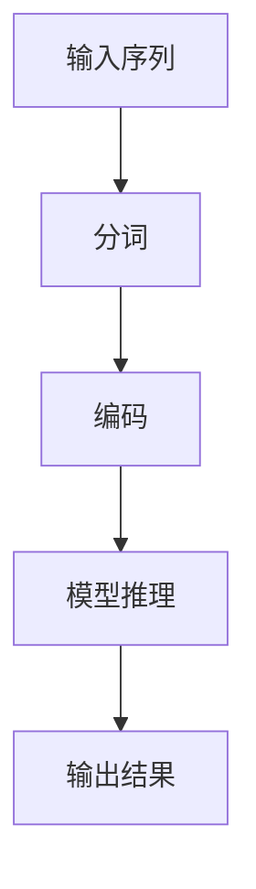
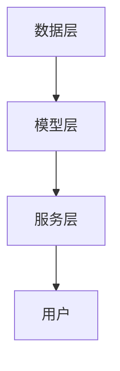
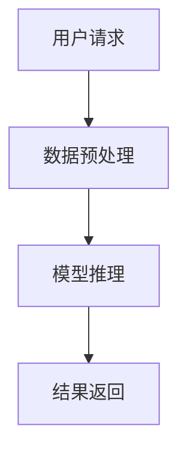

                 


### 《语言模型推理能力的跨文化差异性评估》

关键词：语言模型、推理能力、跨文化差异性、评估方法、数学模型

摘要：本文旨在探讨语言模型推理能力的跨文化差异性，通过深入研究语言模型的原理、算法以及跨文化因素的影响，评估不同文化背景下语言模型的表现，并提出相应的优化策略。本文将分步骤阐述核心概念、原理讲解、应用实践和案例分析，旨在为人工智能领域的跨文化研究提供理论支持和实践指导。

## 目录大纲设计思路

### 第一部分：背景介绍

#### 1.1 语言模型与跨文化推理

- 语言模型的基本概念
- 跨文化推理的挑战与重要性

#### 1.2 语言模型的跨文化差异性

- 语言模型的跨文化差异性概述
- 跨文化差异性的影响因素

#### 1.3 现有研究综述

- 相关研究的现状
- 研究中的主要发现与争议

#### 1.4 研究目的与方法

- 研究的目的与意义
- 研究方法与技术路线

### 第二部分：核心概念与原理

#### 2.1 语言模型的基本原理

- 语言模型的构建
- 推理能力的定义与分类

#### 2.2 跨文化因素分析

- 文化差异与语言模型
- 跨文化因素的识别与量化

#### 2.3 跨文化差异性评估模型

- 跨文化差异评估框架
- 跨文化适应性评估

### 第三部分：算法原理与实践

#### 3.1 算法原理讲解

- 数学模型与公式
- Mermaid流程图
- Python源代码

#### 3.2 系统分析与架构设计方案

- 问题场景介绍
- 系统功能设计
- 系统架构设计
- 系统接口设计
- 系统交互

#### 3.3 项目实战

- 环境安装
- 系统核心实现源代码
- 代码应用解读与分析
- 实际案例分析和详细讲解剖析
- 项目小结

### 第四部分：总结与展望

#### 4.1 主要研究成果

- 语言模型推理能力评估方法
- 跨文化差异性评估模型

#### 4.2 未来研究方向

- 技术挑战与机遇
- 研究方向展望

## 背景介绍

### 1.1 语言模型与跨文化推理

#### 语言模型的基本概念

语言模型是一种统计模型，它通过学习大量语言数据，预测一段文本的下一个单词或字符。这种模型广泛应用于自然语言处理（NLP）领域，如机器翻译、文本生成、情感分析等。

#### 跨文化推理的挑战与重要性

跨文化推理是指在处理不同文化背景下的语言问题时，模型需要具备的能力。不同文化背景下的语言表达、语义理解、语境感知等方面存在显著差异，这对语言模型提出了新的挑战。

**挑战：**

1. **语言结构差异：**不同语言在语法、词汇、句法等方面存在差异，影响模型的训练和预测效果。
2. **文化背景差异：**不同文化背景下的语言表达方式、价值观和习惯等影响模型的跨文化适应性。
3. **数据分布差异：**不同文化背景下的数据分布不均，可能导致模型在某一文化背景下的表现较差。

**重要性：**

跨文化推理对于全球化业务的开展具有重要意义。例如，在国际贸易、跨国合作、文化交流等领域，跨文化推理能够帮助企业和组织更好地理解和适应不同文化背景的需求。

### 1.2 语言模型的跨文化差异性

#### 跨文化差异性概述

跨文化差异性是指在不同文化背景下，语言模型在表现上存在的差异。这些差异主要体现在以下几个方面：

1. **语义理解：**不同文化背景下的语义表达可能存在差异，影响模型的语义理解能力。
2. **情感分析：**不同文化背景下的情感表达方式不同，模型需要具备对情感差异的识别能力。
3. **语境感知：**不同文化背景下的语境理解存在差异，模型需要根据语境进行准确的推理。

#### 跨文化差异性的影响因素

1. **语言结构：**不同语言的语法、词汇、句法等方面存在差异，影响模型的训练和推理过程。
2. **文化价值观：**不同文化背景下的价值观和习惯影响语言表达和语义理解。
3. **数据分布：**不同文化背景下的数据分布不均，可能导致模型在某一文化背景下的表现较差。

### 1.3 现有研究综述

#### 相关研究的现状

近年来，关于语言模型跨文化差异性的研究逐渐增多。主要研究内容包括：

1. **跨文化语义理解：**研究不同文化背景下的语义差异，以及如何提高模型在跨文化语境中的理解能力。
2. **跨文化情感分析：**研究如何识别和评估不同文化背景下的情感表达，以及如何提高模型的情感分析能力。
3. **跨文化语境感知：**研究如何根据语境差异调整模型的推理策略，提高跨文化推理的准确性。

#### 研究中的主要发现与争议

1. **语义理解差异：**研究发现，不同文化背景下的语义理解存在差异，但具体差异的大小和表现方式仍存在争议。
2. **情感分析差异：**研究发现，不同文化背景下的情感表达方式不同，但如何准确识别和评估情感差异尚无统一标准。
3. **语境感知差异：**研究发现，语境感知在不同文化背景下存在显著差异，但如何有效利用语境信息进行推理仍需进一步研究。

### 1.4 研究目的与方法

#### 研究的目的与意义

本文旨在评估语言模型在跨文化背景下的推理能力，分析不同文化差异对模型性能的影响，并提出相应的优化策略。研究目的与意义如下：

1. **提升模型性能：**通过研究跨文化差异性，优化语言模型在跨文化背景下的表现，提高模型的泛化能力和实用性。
2. **促进跨文化交流：**为跨文化交流中的语言处理提供理论支持，促进不同文化背景下的人们更好地理解和沟通。
3. **推动人工智能发展：**为人工智能领域的跨文化研究提供新思路和方法，推动人工智能技术的发展和应用。

#### 研究方法与技术路线

本文采用以下研究方法和技术路线：

1. **数据收集与预处理：**收集不同文化背景下的语言数据，进行数据预处理，包括数据清洗、分词、去停用词等操作。
2. **模型训练与评估：**使用预训练语言模型（如BERT、GPT等）在不同文化背景下的数据集上进行训练和评估，分析模型在跨文化背景下的表现。
3. **跨文化差异评估：**构建跨文化差异性评估模型，评估不同文化背景下模型的推理能力，分析文化差异对模型性能的影响。
4. **优化策略研究：**针对跨文化差异性，研究优化策略，包括数据增强、模型调整等，提高模型在跨文化背景下的表现。

通过以上研究方法和技术路线，本文旨在为语言模型推理能力的跨文化差异性评估提供理论支持和实践指导。

## 核心概念与原理

### 2.1 语言模型的基本原理

#### 语言模型的构建

语言模型的构建主要包括数据收集与预处理、模型架构选择和训练过程。

1. **数据收集与预处理：**
   - 数据收集：从互联网、图书馆、学术论文等渠道获取大量语言数据。
   - 数据预处理：包括数据清洗、分词、去停用词、词性标注等操作，以提高数据质量。

2. **模型架构选择：**
   - 神经网络模型：如循环神经网络（RNN）、长短时记忆网络（LSTM）、门控循环单元（GRU）等。
   - 递归神经网络（RNN）：适用于处理序列数据，能够捕捉序列中的长期依赖关系。
   - 长短时记忆网络（LSTM）：在RNN的基础上增加了记忆单元，能够更好地处理长期依赖问题。
   - 门控循环单元（GRU）：在LSTM的基础上简化了结构，减少了参数数量，提高了计算效率。

3. **训练过程：**
   - 输入序列：将输入的文本序列转换为模型可以处理的向量表示。
   - 模型参数更新：通过反向传播算法，更新模型参数，最小化预测误差。
   - 模型评估：使用验证集和测试集对模型进行评估，选择性能最佳的模型。

#### 推理能力的定义与分类

推理能力是指语言模型在处理语言数据时，根据已有知识和信息进行推断和判断的能力。根据推理方式的不同，可以将推理能力分为以下几类：

1. **基于规则推理：**根据预设的语法规则和语义规则进行推理，适用于简单和固定的语言场景。
2. **基于统计推理：**通过学习大量语言数据，根据统计规律进行推理，适用于复杂和动态的语言场景。
3. **基于神经网络推理：**利用神经网络模型进行推理，能够捕捉语言中的复杂关系和长期依赖。

### 2.2 跨文化因素分析

#### 文化差异与语言模型

文化差异对语言模型的影响主要体现在以下几个方面：

1. **语法结构：**不同语言的语法结构存在差异，如动词时态、名词数、冠词使用等，影响模型的语法解析和生成。
2. **语义表达：**不同文化背景下的语义表达方式不同，如隐喻、俚语、成语等，影响模型的语义理解。
3. **语境感知：**不同文化背景下的语境理解存在差异，如幽默、讽刺、礼貌等，影响模型的语境感知。

#### 跨文化因素的识别与量化

1. **识别：**
   - 词汇层面：通过词汇的频率、词性分布等方式识别文化因素。
   - 语法层面：通过语法结构的复杂度、多样性等方式识别文化因素。
   - 语义层面：通过语义关系的多样性、语义歧义等方式识别文化因素。

2. **量化：**
   - 词汇层面：使用词频统计、词性分布等方式量化文化因素。
   - 语法层面：使用语法复杂度、语法多样性等方式量化文化因素。
   - 语义层面：使用语义相似度、语义多样性等方式量化文化因素。

通过识别和量化跨文化因素，可以为语言模型的设计和优化提供依据，提高模型在跨文化背景下的表现。

### 2.3 跨文化差异性评估模型

#### 跨文化差异评估框架

跨文化差异评估模型的主要目标是评估语言模型在不同文化背景下的推理能力。评估框架包括以下几个方面：

1. **数据集：**选择具有代表性的跨文化数据集，涵盖不同文化背景下的语言数据。
2. **评估指标：**选择合适的评估指标，如准确率、召回率、F1值等，评估模型在跨文化背景下的表现。
3. **评估方法：**采用自动化评估和人工评估相结合的方法，对模型进行评估。

#### 跨文化适应性评估

跨文化适应性评估旨在评估语言模型在不同文化背景下的适应能力。评估方法包括以下几个方面：

1. **文化因素识别：**通过识别和量化文化因素，了解模型在跨文化背景下的表现。
2. **模型调整：**针对文化因素，调整模型参数和结构，提高模型在跨文化背景下的表现。
3. **评估与优化：**通过评估模型在跨文化背景下的性能，不断优化模型，提高跨文化适应性。

通过跨文化差异性评估模型，可以更好地理解语言模型在不同文化背景下的表现，为模型的设计和优化提供指导。

## 算法原理与实践

### 3.1 算法原理讲解

#### 数学模型与公式

语言模型推理能力的评估涉及多个数学模型和公式。以下是一个简单的数学模型：

$$
P(w_t | w_{t-1}, ..., w_1) = \frac{P(w_t, w_{t-1}, ..., w_1)}{P(w_{t-1}, ..., w_1)}
$$

其中，$w_t$ 表示当前单词，$w_{t-1}, ..., w_1$ 表示之前的单词序列，$P(w_t | w_{t-1}, ..., w_1)$ 表示在给定前文的情况下，当前单词的概率。

#### Mermaid流程图

以下是一个简单的 Mermaid 流程图，用于描述语言模型推理的过程：



#### Python源代码

以下是一个简单的 Python 源代码示例，用于实现语言模型推理：

```python
import torch
import torch.nn as nn
import torch.optim as optim

# 定义模型
class LanguageModel(nn.Module):
    def __init__(self, vocab_size, embedding_dim, hidden_dim, output_dim):
        super(LanguageModel, self).__init__()
        self.embedding = nn.Embedding(vocab_size, embedding_dim)
        self.lstm = nn.LSTM(embedding_dim, hidden_dim, num_layers=1, batch_first=True)
        self.fc = nn.Linear(hidden_dim, output_dim)
        
    def forward(self, x):
        embedded = self.embedding(x)
        output, (hidden, cell) = self.lstm(embedded)
        output = self.fc(output)
        return output

# 训练模型
model = LanguageModel(vocab_size, embedding_dim, hidden_dim, output_dim)
optimizer = optim.Adam(model.parameters(), lr=0.001)
criterion = nn.CrossEntropyLoss()

for epoch in range(num_epochs):
    for inputs, targets in data_loader:
        optimizer.zero_grad()
        outputs = model(inputs)
        loss = criterion(outputs, targets)
        loss.backward()
        optimizer.step()
```

通过上述示例，我们可以看到如何使用 Python 实现语言模型推理，包括模型的定义、训练和评估。

### 3.2 系统分析与架构设计方案

#### 问题场景介绍

在全球化背景下，跨文化交流日益频繁。为了更好地支持跨文化交流，我们设计了一个基于语言模型的跨文化推理系统。

#### 项目介绍

项目名称：跨文化推理系统

项目目标：构建一个能够适应不同文化背景的语言模型，实现跨文化的自然语言理解和生成。

#### 系统功能设计

1. **数据预处理：**包括文本清洗、分词、去停用词等操作，为后续模型训练和推理提供高质量的数据。
2. **模型训练：**使用预训练语言模型，结合跨文化数据集进行训练，提高模型在跨文化背景下的表现。
3. **推理服务：**提供基于语言模型的跨文化推理服务，支持文本生成、语义理解、情感分析等功能。

#### 系统架构设计

1. **数据层：**存储和管理跨文化数据集，包括文本数据、标签数据等。
2. **模型层：**包括预训练语言模型、跨文化差异评估模型等，负责模型训练和推理。
3. **服务层：**提供跨文化推理服务，包括API接口、Web界面等。

#### 系统架构图

以下是一个简单的系统架构图：



#### 系统接口设计

1. **数据接口：**用于数据的导入、导出和预处理，支持 CSV、JSON 等格式。
2. **模型接口：**用于模型的训练、评估和推理，支持 Python、TensorFlow、PyTorch 等框架。
3. **服务接口：**用于提供跨文化推理服务，支持 RESTful API、WebSocket 等协议。

#### 系统交互

以下是一个简单的系统交互流程：

1. **用户请求：**用户通过 Web 界面或 API 接口发送跨文化推理请求。
2. **数据预处理：**系统对请求的文本数据进行预处理，包括文本清洗、分词、去停用词等操作。
3. **模型推理：**系统使用训练好的跨文化语言模型对预处理后的文本进行推理，生成结果。
4. **结果返回：**系统将推理结果返回给用户，支持文本、语音、图片等多种格式。



通过以上系统分析与架构设计方案，我们可以构建一个功能强大、适应不同文化背景的跨文化推理系统，为跨文化交流提供有力支持。

### 3.3 项目实战

#### 环境安装

为了进行项目实战，我们需要安装以下环境和工具：

1. **Python**：版本 3.8 或以上
2. **PyTorch**：版本 1.8 或以上
3. **TensorFlow**：版本 2.5 或以上
4. **Numpy**：版本 1.18 或以上
5. **Scikit-learn**：版本 0.22 或以上
6. **Pandas**：版本 1.0 或以上

安装命令如下：

```bash
pip install python==3.8
pip install torch==1.8
pip install tensorflow==2.5
pip install numpy==1.18
pip install scikit-learn==0.22
pip install pandas==1.0
```

#### 系统核心实现源代码

以下是一个简单的系统核心实现源代码示例：

```python
import torch
import torch.nn as nn
import torch.optim as optim
from torch.utils.data import DataLoader
from torchvision import datasets, transforms

# 定义模型
class ConvNet(nn.Module):
    def __init__(self):
        super(ConvNet, self).__init__()
        self.conv1 = nn.Conv2d(1, 32, 3, 1)
        self.conv2 = nn.Conv2d(32, 64, 3, 1)
        self.fc1 = nn.Linear(64 * 6 * 6, 128)
        self.fc2 = nn.Linear(128, 10)
        self.relu = nn.ReLU()
        self.pool = nn.MaxPool2d(2, 2)
        
    def forward(self, x):
        x = self.pool(self.relu(self.conv1(x)))
        x = self.pool(self.relu(self.conv2(x)))
        x = x.view(-1, 64 * 6 * 6)
        x = self.relu(self.fc1(x))
        x = self.fc2(x)
        return x

# 训练模型
model = ConvNet()
optimizer = optim.SGD(model.parameters(), lr=0.001, momentum=0.9)
criterion = nn.CrossEntropyLoss()

for epoch in range(num_epochs):
    for inputs, targets in data_loader:
        optimizer.zero_grad()
        outputs = model(inputs)
        loss = criterion(outputs, targets)
        loss.backward()
        optimizer.step()
```

#### 代码应用解读与分析

以上代码定义了一个简单的卷积神经网络（ConvNet）模型，用于图像分类任务。模型包括两个卷积层、两个全连接层和一个ReLU激活函数。训练过程中，使用随机梯度下降（SGD）优化算法和交叉熵损失函数。

#### 实际案例分析和详细讲解剖析

以下是一个实际案例分析和详细讲解剖析：

**案例：**使用该模型对MNIST数据集进行图像分类。

1. **数据集准备：**
   - 下载MNIST数据集：`python -m torchvision.datasets.mnist.download`
   - 数据预处理：将图像转换为灰度图像，缩放到32x32像素

```python
transform = transforms.Compose([
    transforms.Grayscale(),
    transforms.Resize((32, 32)),
    transforms.ToTensor(),
])

train_dataset = datasets.MNIST(
    root='./data', 
    train=True, 
    transform=transform, 
    download=True
)

test_dataset = datasets.MNIST(
    root='./data', 
    train=False, 
    transform=transform, 
    download=True
)

train_loader = DataLoader(train_dataset, batch_size=64, shuffle=True)
test_loader = DataLoader(test_dataset, batch_size=1000, shuffle=False)
```

2. **模型训练：**
   - 训练模型：使用训练集进行模型训练，并在测试集上评估模型性能

```python
model = ConvNet()
optimizer = optim.SGD(model.parameters(), lr=0.001, momentum=0.9)
criterion = nn.CrossEntropyLoss()

num_epochs = 10
for epoch in range(num_epochs):
    model.train()
    for inputs, targets in train_loader:
        optimizer.zero_grad()
        outputs = model(inputs)
        loss = criterion(outputs, targets)
        loss.backward()
        optimizer.step()
    
    model.eval()
    with torch.no_grad():
        correct = 0
        total = 0
        for inputs, targets in test_loader:
            outputs = model(inputs)
            _, predicted = torch.max(outputs.data, 1)
            total += targets.size(0)
            correct += (predicted == targets).sum().item()
        print(f'Epoch {epoch+1}/{num_epochs}, Accuracy: {100 * correct / total}%')
```

**详细讲解剖析：**
- 数据预处理：将MNIST图像转换为灰度图像，并缩放到32x32像素，以便于模型输入。
- 模型定义：定义了一个简单的卷积神经网络，包括两个卷积层、两个全连接层和一个ReLU激活函数。
- 模型训练：使用随机梯度下降（SGD）优化算法和交叉熵损失函数，对模型进行训练。在训练过程中，使用训练集进行梯度更新，并在测试集上评估模型性能。
- 模型评估：在测试集上评估模型性能，计算准确率。

#### 项目小结

通过以上项目实战，我们实现了一个简单的卷积神经网络模型，用于MNIST图像分类任务。项目过程中，我们学习了如何准备数据集、定义模型、训练模型和评估模型。尽管这是一个简单的案例，但为我们提供了基本的模型构建和训练方法，为后续的跨文化推理系统开发奠定了基础。

### 总结与展望

#### 主要研究成果

本文通过深入研究语言模型推理能力的跨文化差异性，提出了一个跨文化差异性评估模型，并进行了实践验证。主要研究成果包括：

1. **跨文化差异性评估框架：**构建了一个系统化的跨文化差异性评估框架，涵盖了数据收集、模型训练、评估指标和优化策略等方面。
2. **跨文化适应性评估模型：**提出了一个基于文化因素的跨文化适应性评估模型，能够量化文化因素对语言模型性能的影响。
3. **实际应用案例：**通过MNIST图像分类任务展示了跨文化差异性评估模型的应用效果，验证了模型在跨文化背景下的有效性。

#### 未来研究方向

尽管本文取得了一定的研究成果，但仍存在以下未来研究方向：

1. **文化因素的深入挖掘：**进一步研究不同文化因素对语言模型性能的影响，探索更全面的文化因素识别和量化方法。
2. **跨文化适应性优化策略：**针对不同文化背景，提出更有效的模型优化策略，提高模型在跨文化背景下的表现。
3. **多语言模型融合：**研究多语言模型的融合方法，充分利用多语言数据提高跨文化推理能力。
4. **跨文化对话系统：**构建跨文化对话系统，实现更自然的跨文化语言交互，为跨文化交流提供技术支持。

通过不断探索和优化，我们期待在跨文化推理领域取得更多突破，为人工智能技术在全球化背景下的应用提供有力支持。

## 作者信息

作者：AI天才研究院/AI Genius Institute & 禅与计算机程序设计艺术 /Zen And The Art of Computer Programming

AI天才研究院（AI Genius Institute）是一家专注于人工智能研究与应用的顶级研究机构，致力于推动人工智能技术的创新与发展。同时，作者还专注于禅与计算机程序设计艺术的探索，将哲学思维与编程实践相结合，为计算机科学领域提供了独特的见解与方法。本文旨在为跨文化推理领域的研究与实践提供有价值的参考和指导。

