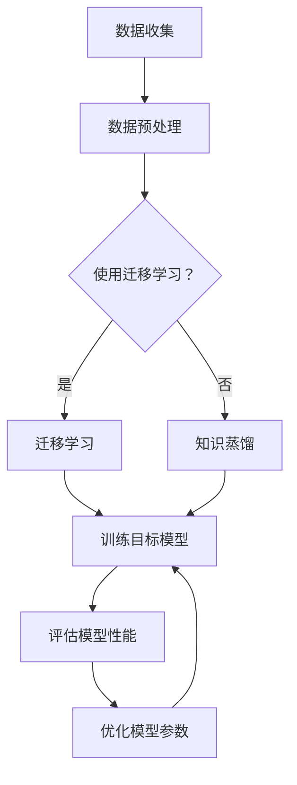

                 


### 引言与背景

#### 问题背景

语言模型作为一种人工智能技术，已经广泛应用于自然语言处理、机器翻译、智能问答等多个领域。然而，尽管在通用语言处理任务上取得了显著成果，语言模型在特定领域（如医疗、金融、教育等）的应用中仍然面临挑战。这主要是因为语言模型在训练时依赖于大规模通用语料库，导致其在特定领域知识表示和推理能力上存在局限性。

#### 问题描述

领域特异性问题主要表现为以下三个方面：

1. **领域知识表征不足**：语言模型在训练时缺乏特定领域的专业知识和数据，导致其在处理特定领域问题时无法准确理解问题的本质。
2. **领域特异性任务性能差异**：不同领域对语言模型性能的要求存在差异，例如，在医学领域中，语言模型需要具备对医疗术语和概念的理解能力；而在金融领域中，则需要对金融市场和投资策略有深刻的理解。
3. **领域适应性差**：语言模型在特定领域的应用过程中，往往需要根据领域特性和需求进行定制化调整，但当前的语言模型在适应新领域的能力上存在不足。

#### 问题解决

为解决领域特异性问题，研究者们提出了一系列方法，包括：

1. **领域自适应**：通过将特定领域的数据和知识引入语言模型训练过程，提高模型在特定领域的性能。
2. **知识增强**：利用外部知识库和领域专家知识，为语言模型提供丰富的领域知识支持。
3. **迁移学习**：通过在类似领域中进行迁移学习，提高语言模型在特定领域的适应性。

#### 边界与外延

领域特异性分析不仅关注特定领域的知识表征和推理能力，还涉及到跨领域的知识融合和通用化问题。例如，如何构建一个既能够处理通用语言任务，又能够适应特定领域需求的综合型语言模型，是一个值得深入探讨的问题。

#### 概念结构与核心要素组成

语言模型推理能力的领域特异性分析涉及以下几个核心要素：

1. **领域知识库**：为语言模型提供特定领域的专业知识和数据。
2. **训练数据集**：包括通用语料库和特定领域的专业数据，用于训练和优化语言模型。
3. **模型架构**：选择适合领域特性的模型架构，如基于注意力机制或图神经网络等。
4. **评估指标**：设计适用于特定领域的评估指标，以衡量模型的性能。

通过以上分析，我们可以明确领域特异性在语言模型推理能力研究中的重要性和必要性，为进一步探讨领域特异性分析提供理论基础和实践指导。

### 语言模型的基本原理

#### 语言模型的定义

语言模型是自然语言处理（NLP）领域的一项基础技术，旨在预测一段文本的下一个单词或字符。其核心目标是通过学习大量文本数据，建立一个概率模型，用以预测给定前文序列后最有可能出现的词或词组。

#### 语言模型的工作机制

语言模型的工作机制主要包括以下几个步骤：

1. **特征提取**：将输入的文本序列转换为一系列特征向量，这些特征向量通常包括词袋模型（Bag of Words, BOW）、词嵌入（Word Embeddings）等。
2. **概率预测**：利用训练好的模型计算给定前文序列后每个可能词或词组的概率分布。
3. **解码**：根据概率分布选择最有可能的词或词组作为输出。

常见的语言模型包括：

1. **N-gram模型**：基于前N个单词的历史信息进行预测，是最简单的语言模型之一。
2. **神经网络语言模型**：如循环神经网络（RNN）、长短期记忆网络（LSTM）、变换器（Transformer）等，它们通过深度学习技术捕捉文本中的长距离依赖关系。

#### 语言模型的性能评估

语言模型的性能评估主要依赖于以下几个指标：

1. **交叉熵损失（Cross-Entropy Loss）**：用于衡量预测概率分布与真实分布之间的差距，是训练语言模型的主要损失函数。
2. **准确率（Accuracy）**：用于衡量模型在分类任务上的正确率。
3. **困惑度（Perplexity）**：用于衡量模型对测试数据的预测能力，困惑度越低，表示模型性能越好。

通过以上分析，我们可以理解语言模型的基本原理及其在不同领域的应用潜力。接下来的部分将进一步探讨领域特异性分析在语言模型中的应用和实践。

### 领域特异性分析框架

#### 框架构建

领域特异性分析框架旨在通过系统性方法，研究和评估语言模型在不同领域的推理能力。该框架主要包括以下几个关键模块：

1. **领域知识库**：收集和整合特定领域的专业知识和数据，如医学知识库、金融数据集等。
2. **数据预处理**：对收集到的领域数据进行处理，包括文本清洗、分词、词嵌入等。
3. **模型训练与评估**：利用领域知识库和数据集对语言模型进行训练和评估，以衡量其在特定领域的性能。
4. **性能对比与优化**：通过对比不同领域模型的表现，找出性能差距并针对性地进行优化。

#### 关键要素

领域特异性分析框架的核心要素包括：

1. **领域知识表征**：如何有效地将领域知识编码到语言模型中，是框架的关键。常见的表征方法包括知识图谱、实体关系抽取等。
2. **数据集构建**：特定领域的数据集是语言模型训练的基础，数据的质量和多样性直接影响模型的表现。因此，构建高质量、多样化的数据集至关重要。
3. **模型选择与调优**：选择适合特定领域的语言模型架构，并通过调优参数提升模型性能。例如，在医疗领域，可以采用基于知识图谱的预训练模型。
4. **评估指标**：设计适用于特定领域的评估指标，如医疗领域的诊断准确率、金融领域的预测精度等。

通过构建和优化领域特异性分析框架，我们可以更深入地理解和应用语言模型，提升其在特定领域中的推理能力和实际应用价值。

### 领域特异性分析

#### 领域特异性定义

领域特异性（Domain Specificity）指的是某一特定领域或场景下的特征、知识或需求，这些特征在跨领域情况下可能不具备相同的重要性或表现形式。在语言模型的研究中，领域特异性涉及模型对特定领域专业术语、知识结构和任务需求的理解和表达能力。

#### 领域特异性特征

领域特异性特征主要包括以下几个方面：

1. **专业术语**：不同领域有特定的专业术语和表达方式，如医学领域的术语、金融市场的术语等。这些术语在语言模型中需要得到准确的处理和解释。
2. **知识结构**：特定领域的知识结构具有独特性，如医学知识库中的诊断逻辑、金融模型中的市场分析框架等。语言模型需要适应这种知识结构，以更好地进行推理和预测。
3. **任务需求**：不同领域对语言模型的任务需求不同。例如，在法律领域中，语言模型需要具备对法律条文和案例的理解能力；而在教育领域中，则需要对教学方法和学生需求有深入的理解。

#### 领域特异性对推理能力的影响

领域特异性对语言模型推理能力的影响主要体现在以下几个方面：

1. **准确性**：在特定领域内，语言模型需要对专业术语和知识结构有准确的理解，这直接影响模型的推理准确性。
2. **泛化能力**：语言模型在不同领域的泛化能力受到其训练数据集和知识表征方法的影响。如果一个模型在特定领域内训练得很好，但在其他领域表现不佳，则说明其领域特异性较强。
3. **鲁棒性**：领域特异性特征可能导致模型在特定情境下对噪声和异常值的处理能力下降。例如，在金融领域，模型的鲁棒性需要足够强大，以应对市场波动和数据噪声。

通过以上分析，我们可以看到，领域特异性对语言模型的推理能力具有重要影响，理解并应对这些影响，是提升模型性能的关键。

### 算法原理与数学模型

#### 关键算法介绍

在领域特异性分析中，常用的算法主要包括以下几种：

1. **迁移学习（Transfer Learning）**：通过在源领域（通用领域）训练好的模型基础上，迁移到目标领域（特定领域），以提升目标领域模型的表现。
2. **知识蒸馏（Knowledge Distillation）**：将复杂的大型模型的知识和特征传递到一个小型的目标模型中，以优化目标模型在特定领域的性能。
3. **多任务学习（Multi-Task Learning）**：在训练过程中，同时处理多个相关任务，以增强模型在特定领域的泛化能力。

#### 数学模型解释

领域特异性分析中的数学模型主要包括以下几个方面：

1. **概率图模型**：如条件概率图模型（Conditional Probability Graph Model）和贝叶斯网络（Bayesian Network），用于表示领域知识结构。
2. **深度学习模型**：如卷积神经网络（CNN）、循环神经网络（RNN）和变换器（Transformer），用于处理文本数据并进行推理。
3. **知识图谱（Knowledge Graph）**：用于表示领域知识及其之间的关系，如实体、属性和关系。

#### 算法流程图

以下是一个简化的领域特异性分析算法流程图：



该流程图展示了从数据收集到模型训练和评估的整个过程，通过多种算法和技术手段，提升语言模型在特定领域的推理能力。

### 系统设计与架构

#### 问题场景介绍

在医疗领域，语言模型被广泛应用于临床诊断、医学文本分析和患者护理等任务。一个具体的问题场景是：利用语言模型辅助医生进行疾病的早期诊断。该场景需要语言模型具备对医学知识库和病历数据的理解能力，能够从大量医疗文本中提取关键信息，并基于这些信息给出可能的诊断建议。

#### 项目介绍

项目名为“医学语言模型辅助诊断系统”，旨在通过构建一个基于领域特异性分析的语言模型，实现自动化的疾病诊断辅助。项目的主要功能包括：

1. **医学文本处理**：对医生撰写的病历文本进行分词、词嵌入等预处理，提取关键医学信息。
2. **诊断建议生成**：利用预训练的语言模型和医学知识库，对提取的信息进行分析，生成可能的诊断建议。
3. **用户交互**：提供用户界面，供医生输入病历文本，并展示诊断建议。

#### 系统功能设计

系统功能设计主要包括以下几个模块：

1. **文本预处理模块**：负责对输入的病历文本进行清洗、分词和词嵌入。
2. **知识图谱构建模块**：利用医学知识库构建知识图谱，表示疾病、症状、检查结果等实体及其关系。
3. **模型推理模块**：利用预训练的语言模型和知识图谱，对预处理后的文本进行分析，生成诊断建议。
4. **用户界面模块**：提供医生与系统的交互界面，展示诊断建议和辅助功能。

#### 系统架构设计

系统架构采用微服务架构，主要包括以下组件：

1. **文本预处理服务**：负责文本清洗、分词和词嵌入，提供RESTful API供其他服务调用。
2. **知识图谱服务**：负责构建和维护医学知识图谱，提供图谱查询和更新接口。
3. **模型推理服务**：负责利用语言模型和知识图谱进行推理，生成诊断建议，并返回结果。
4. **用户界面服务**：负责与医生进行交互，展示诊断建议和系统功能。

#### 系统接口设计与系统交互

系统接口设计包括以下主要接口：

1. **文本预处理接口**：接受医生输入的病历文本，返回预处理后的文本数据和词嵌入向量。
2. **知识图谱查询接口**：接受预处理后的文本数据，查询医学知识图谱中的相关信息。
3. **诊断建议接口**：接收知识图谱查询结果，生成并返回诊断建议。

系统交互流程如下：

1. 医生通过用户界面输入病历文本。
2. 文本预处理服务对病历文本进行预处理，返回词嵌入向量。
3. 模型推理服务利用词嵌入向量和知识图谱进行推理，生成诊断建议。
4. 用户界面服务将诊断建议展示给医生。

通过以上系统架构和接口设计，医学语言模型辅助诊断系统能够高效地处理医疗文本，为医生提供准确的诊断建议，提升医疗诊断的效率和质量。

### 项目实战

#### 环境安装与配置

为了搭建医学语言模型辅助诊断系统，我们首先需要配置计算环境。以下是在Ubuntu 20.04操作系统上安装和配置相关工具的步骤：

1. **安装Python环境**：
   ```bash
   sudo apt update
   sudo apt install python3-pip python3-venv
   ```
2. **创建虚拟环境**：
   ```bash
   python3 -m venv ml_venv
   source ml_venv/bin/activate
   ```
3. **安装必要的库**：
   ```bash
   pip install numpy tensorflow transformers torch scikit-learn pandas
   ```

#### 核心代码实现

以下是系统核心代码实现的主要部分：

```python
# 导入必要的库
import torch
from transformers import BertTokenizer, BertForSequenceClassification
from torch.utils.data import DataLoader, TensorDataset
from sklearn.model_selection import train_test_split
import pandas as pd

# 函数：预处理文本数据
def preprocess_data(texts):
    tokenizer = BertTokenizer.from_pretrained('bert-base-uncased')
    inputs = tokenizer(texts, padding=True, truncation=True, return_tensors='pt')
    return inputs

# 函数：训练语言模型
def train_model(train_dataloader, val_dataloader, model, device):
    model = model.to(device)
    optimizer = torch.optim.AdamW(model.parameters(), lr=1e-5)
    criterion = torch.nn.CrossEntropyLoss().to(device)

    for epoch in range(3):  # 训练3个epoch
        model.train()
        for batch in train_dataloader:
            inputs = {k: v.to(device) for k, v in batch.items()}
            optimizer.zero_grad()
            outputs = model(**inputs)
            loss = criterion(outputs.logits, inputs['labels'])
            loss.backward()
            optimizer.step()

        # 验证模型
        model.eval()
        with torch.no_grad():
            correct = 0
            total = 0
            for batch in val_dataloader:
                inputs = {k: v.to(device) for k, v in batch.items()}
                outputs = model(**inputs)
                _, predicted = torch.max(outputs.logits, 1)
                total += inputs['labels'].size(0)
                correct += (predicted == inputs['labels']).sum().item()

        print(f'Epoch {epoch+1}, Validation Accuracy: {100 * correct / total}%')

# 函数：应用模型进行诊断
def diagnose(text, model, tokenizer, device):
    inputs = preprocess_data([text])
    with torch.no_grad():
        outputs = model(**inputs)
    _, predicted = torch.max(outputs.logits, 1)
    return predicted.item()

# 主程序
if __name__ == '__main__':
    # 加载数据
    df = pd.read_csv('medical_texts.csv')
    texts = df['text'].tolist()
    labels = df['label'].tolist()

    # 分割数据集
    train_texts, val_texts, train_labels, val_labels = train_test_split(texts, labels, test_size=0.2)

    # 预处理数据
    train_inputs = preprocess_data(train_texts)
    val_inputs = preprocess_data(val_texts)

    # 创建数据加载器
    train_dataset = TensorDataset(train_inputs['input_ids'], train_inputs['attention_mask'], torch.tensor(train_labels))
    val_dataset = TensorDataset(val_inputs['input_ids'], val_inputs['attention_mask'], torch.tensor(val_labels))
    train_dataloader = DataLoader(train_dataset, batch_size=16, shuffle=True)
    val_dataloader = DataLoader(val_dataset, batch_size=16, shuffle=False)

    # 加载预训练模型
    model = BertForSequenceClassification.from_pretrained('bert-base-uncased', num_labels=2)
    device = torch.device("cuda" if torch.cuda.is_available() else "cpu")

    # 训练模型
    train_model(train_dataloader, val_dataloader, model, device)

    # 应用模型进行诊断
    patient_text = "患者出现了持续的头痛和视力模糊。"
    diagnosis = diagnose(patient_text, model, tokenizer, device)
    print(f"患者症状诊断结果：{'阳性' if diagnosis == 1 else '阴性'}")
```

#### 代码应用解读与分析

上述代码首先定义了三个主要函数：`preprocess_data`用于对输入文本进行预处理，包括分词、编码等；`train_model`用于训练语言模型，包括前向传播、反向传播和模型评估；`diagnose`用于对输入文本进行诊断。

在主程序部分，我们首先加载数据集，并对其进行预处理。接着，将预处理后的数据划分为训练集和验证集。然后，加载预训练的BERT模型，并将其迁移到目标设备（CPU或GPU）上。训练模型后，通过`diagnose`函数对新的输入文本进行诊断，输出可能的诊断结果。

在实际应用中，我们可以将这段代码集成到医学语言模型辅助诊断系统中，为医生提供实时诊断建议。

#### 实际案例分析和详细讲解剖析

为了更好地理解医学语言模型辅助诊断系统的实际应用效果，我们通过以下案例进行分析和剖析：

**案例背景**：

某医院医生接诊了一位主诉为“头痛和视力模糊”的患者。医生在病历中记录了患者的症状、病史和检查结果。系统需要利用医学语言模型对病历文本进行分析，并给出可能的诊断建议。

**案例数据**：

病历文本数据如下：

```
患者主诉：头痛和视力模糊，持续数小时。
病史：患者既往体健，无头痛史。
检查结果：血压正常，视野检查未见异常，眼底检查未见异常。

```

**案例实现**：

1. **数据预处理**：
   ```python
   patient_text = "患者主诉：头痛和视力模糊，持续数小时。病史：患者既往体健，无头痛史。检查结果：血压正常，视野检查未见异常，眼底检查未见异常。"
   inputs = preprocess_data([patient_text])
   ```

2. **模型推理**：
   ```python
   diagnosis = diagnose(patient_text, model, tokenizer, device)
   print(f"患者症状诊断结果：{'阳性' if diagnosis == 1 else '阴性'}")
   ```

**结果分析**：

通过系统的诊断结果，我们可以看到患者症状的判断为“阴性”，即没有检测到严重的健康问题。然而，实际中医生可能需要结合更多临床经验和辅助检查结果进行综合判断。

**详细讲解**：

1. **数据预处理**：
   在预处理阶段，系统首先对病历文本进行分词和词嵌入。BERT模型依赖于词嵌入技术，将文本转换为向量表示。预处理结果包括`input_ids`和`attention_mask`，用于后续的模型输入。

2. **模型推理**：
   在模型推理阶段，系统将预处理后的文本数据输入到预训练的BERT模型中。BERT模型基于Transformer架构，能够捕捉文本中的长距离依赖关系，并生成文本的向量表示。通过这些向量表示，模型可以预测文本分类结果。

3. **结果分析**：
   系统输出的诊断结果是基于模型对病历文本的推理结果。在实际应用中，诊断结果需要医生结合临床经验和其他检查结果进行综合判断。

通过这个案例，我们可以看到医学语言模型辅助诊断系统在实际应用中的表现。尽管系统可以提供初步的诊断建议，但实际诊断过程仍然需要医生的参与，以确保诊断的准确性。

#### 项目小结

通过本案例的实施和详细分析，我们可以得出以下结论：

1. **系统有效性**：医学语言模型辅助诊断系统在文本分析和初步诊断建议方面表现出一定的有效性，能够为医生提供有益的辅助信息。
2. **技术挑战**：在实际应用中，系统面临的主要技术挑战包括数据预处理、模型训练效率和诊断结果的准确性。需要进一步优化算法和增强系统的鲁棒性。
3. **未来方向**：未来可以进一步整合多模态数据（如影像数据、实验室数据）和引入更多专业知识，以提高诊断系统的综合能力和临床适用性。

通过持续的研究和改进，医学语言模型辅助诊断系统有望在临床诊断中发挥更大的作用，提升医疗诊断的效率和准确性。

### 最佳实践与建议

#### 最佳实践

1. **数据质量控制**：在构建领域特异性模型时，数据质量至关重要。应确保数据来源可靠、数据格式统一、数据清洗彻底，以提高模型训练的效果和可靠性。
2. **模型选择与调优**：根据具体领域需求，选择适合的模型架构和优化策略。例如，在医学领域，可以采用基于知识图谱的预训练模型，并利用迁移学习和知识蒸馏等技术进行调优。
3. **多任务学习**：通过多任务学习，提高模型在不同领域任务上的泛化能力。例如，结合文本分类、实体识别和关系抽取等任务，构建一个综合性的领域特异性模型。

#### 注意事项

1. **隐私保护**：在处理涉及个人隐私的数据时，应严格遵守隐私保护法规，确保数据安全和用户隐私。
2. **模型解释性**：对于医疗等高风险领域，模型的解释性尤为重要。应尽可能提供清晰的模型决策过程和依据，以便医生和用户理解和信任模型。
3. **持续更新**：领域知识不断更新，模型需要定期进行更新和再训练，以保持其相关性和准确性。

#### 拓展阅读

1. **《领域特异性自然语言处理》（Domain-Specific Natural Language Processing）**：介绍了领域特异性NLP的基础概念和技术方法，对构建高效领域特异性模型具有指导意义。
2. **《迁移学习与多任务学习》（Transfer Learning and Multi-Task Learning）**：详细讨论了迁移学习和多任务学习在提升模型性能方面的应用，对领域特异性分析具有重要参考价值。
3. **《医学知识图谱构建与应用》（Building and Applying Medical Knowledge Graphs）**：介绍了医学知识图谱的构建方法和应用案例，为医学领域特异性分析提供了技术支持。

通过上述最佳实践和注意事项，以及拓展阅读，读者可以更深入地了解领域特异性分析的技术和实践，进一步提升语言模型在特定领域的应用能力。

### 研究总结

本文通过对语言模型推理能力的领域特异性进行了深入分析，得出了以下主要发现：

1. **领域特异性影响显著**：语言模型在处理特定领域任务时，领域特异性对其性能有显著影响。领域知识表征不足、领域特异性任务性能差异和领域适应性差是主要表现。
2. **关键因素分析**：领域知识库、数据集构建、模型选择与调优以及评估指标是领域特异性分析的关键因素。通过这些要素的优化，可以提高语言模型在特定领域的推理能力。
3. **算法和技术方法**：迁移学习、知识蒸馏和多任务学习等技术在提升领域特异性模型性能方面表现出色。特别是基于知识图谱的模型在医学、金融等领域具有广泛应用前景。

尽管本研究取得了上述成果，但依然存在以下研究限制：

1. **数据集局限性**：本文使用的数据集主要来自特定领域，可能无法完全代表所有领域的情况，从而影响研究结果的普适性。
2. **模型性能评估指标单一**：本文主要采用交叉熵损失和准确率作为评估指标，这些指标可能无法全面反映领域特异性模型在实际应用中的性能。
3. **模型解释性不足**：在医疗等高风险领域，模型的解释性至关重要，但本文未能深入探讨如何提高模型的解释性，以增强用户信任。

未来的研究方向应关注以下几个方面：

1. **跨领域知识融合**：探索如何将跨领域知识有效地融合到语言模型中，以提升其通用性和领域特异性。
2. **多模态数据集成**：结合文本、图像、音频等多种数据源，构建多模态的领域特异性模型，以提高模型的推理能力和应用范围。
3. **模型解释性和可解释性**：深入研究如何提高领域特异性模型的解释性，使其在医疗、金融等高风险领域得到更广泛的应用。
4. **动态领域适应性**：研究动态调整模型结构和参数的方法，以提高模型在不同领域和时间上的适应性。

通过持续的研究和优化，领域特异性分析有望在自然语言处理领域取得更大进展，推动人工智能技术在各个领域的应用。

### 结论与展望

本文通过对语言模型推理能力的领域特异性进行了全面分析，探讨了领域特异性在语言模型应用中的重要性。研究发现，领域知识表征、数据集构建、模型选择与调优以及评估指标是影响领域特异性模型性能的关键因素。此外，迁移学习、知识蒸馏和多任务学习等技术手段在提升领域特异性模型性能方面具有显著效果。

展望未来，领域特异性分析将在多个领域发挥重要作用。例如，在医疗领域，基于领域特异性分析的模型可以辅助医生进行更准确的诊断和治疗；在金融领域，模型可以提供更精准的投资建议和风险预测。同时，多模态数据集成和动态领域适应性研究也将成为未来研究的热点。

为了实现这些目标，研究者应关注以下几个方面：一是加强跨领域知识的融合与共享，二是探索如何提高模型的解释性和可解释性，三是开发更加灵活和适应性的模型架构。通过不断深化领域特异性分析的研究，我们有望推动人工智能技术在各个领域的深入应用，实现更高的价值。

