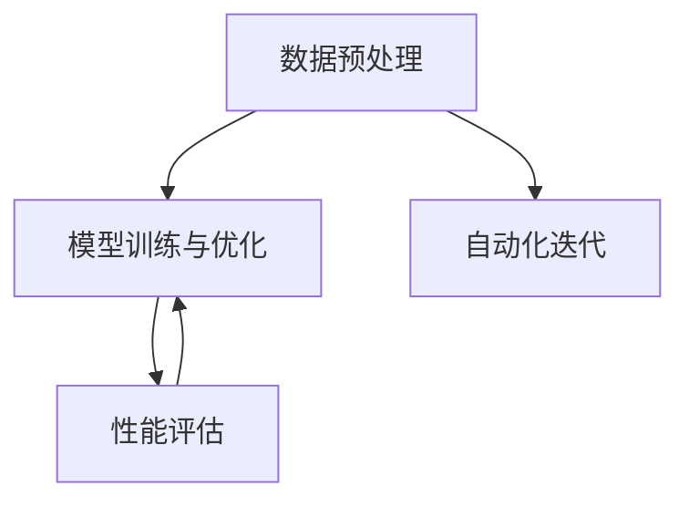
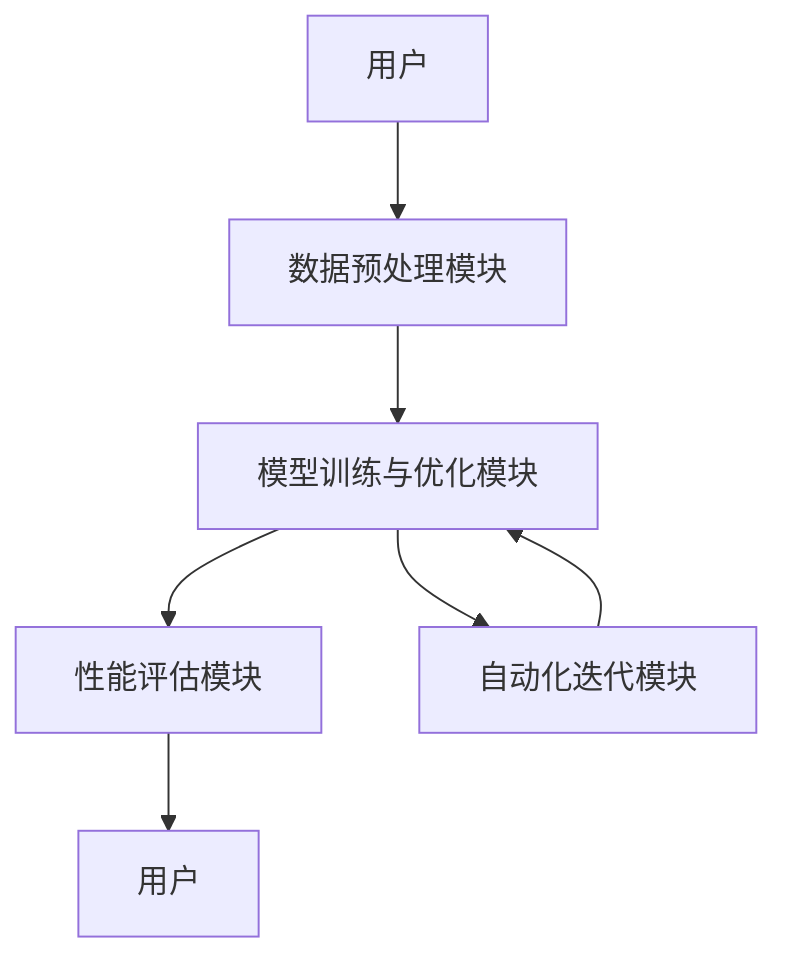

                 


### 《语言模型推理能力的领域迁移性分析研究》

关键词：语言模型、领域迁移性、推理能力、算法原理、系统架构

摘要：本文将深入探讨语言模型推理能力的领域迁移性问题，从背景介绍、核心概念与联系、算法原理讲解、数学模型与公式、系统分析与架构设计、项目实战以及最佳实践与总结等多个角度进行详细分析。通过本文的阅读，读者将对语言模型领域迁移性的概念、原理和应用有更加深入的了解。

## 1. 背景与概述

### 1.1 语言模型的发展历程

语言模型是自然语言处理（NLP）领域的核心组成部分，其发展历程可以追溯到20世纪50年代。当时，研究人员开始尝试使用统计学方法来建模自然语言，例如N-gram模型。N-gram模型通过统计相邻词出现的频率来预测下一个词，这在一定程度上提高了文本生成的准确性。

随着时间的推移，语言模型的研究不断深入，研究者们提出了许多新的模型，如基于规则的方法、统计机器学习模型以及深度学习模型。特别是深度学习模型的兴起，如循环神经网络（RNN）、长短期记忆网络（LSTM）和变换器（Transformer）等，使得语言模型的性能得到了大幅提升。

### 1.2 领域迁移性的定义与重要性

领域迁移性是指一个模型在特定领域内学习和应用其知识的能力，即模型在不同领域之间迁移其推理能力。在语言模型的应用中，领域迁移性尤为重要。例如，一个在医疗领域训练的语言模型应该能够迁移到金融领域，以便在处理金融文本时提供准确的信息。

领域迁移性的重要性体现在以下几个方面：

1. **降低训练成本**：对于大规模数据集，收集和标注领域特定的数据非常耗时且昂贵。通过领域迁移性，模型可以在多个领域间共享知识，从而减少单独在每个领域训练模型的成本。
2. **提高泛化能力**：领域迁移性使得模型能够在未见过的领域中表现良好，这有助于提升模型的泛化能力。
3. **扩展应用范围**：领域迁移性使得语言模型可以在更广泛的领域中发挥作用，从而推动NLP技术的进步。

### 1.3 研究现状与挑战

目前，领域迁移性已经成为自然语言处理领域的研究热点。许多研究集中于如何设计有效的算法和模型来增强领域迁移能力。然而，研究现状仍面临以下挑战：

1. **模型适应性**：如何使语言模型在不同领域中保持高效性和准确性，是一个亟待解决的问题。
2. **数据不平衡**：某些领域可能存在数据不平衡的问题，这会影响到模型的迁移能力。
3. **跨领域语义理解**：跨领域的语义理解是领域迁移性的核心，但目前仍存在很多困难，如术语、表达方式的差异等。

本文将围绕上述问题，深入分析语言模型领域迁移性的原理、方法及其在实际应用中的挑战和解决方案。

## 2. 核心概念与联系

### 2.1 语言模型的原理

语言模型是一种统计模型，旨在预测一个单词序列的概率分布。最简单的语言模型是基于N-gram模型，它通过统计相邻单词的频率来预测下一个单词。例如，如果一个句子中“我爱”后面通常是“中国”，那么语言模型会倾向于预测“中国”作为下一个单词。

随着深度学习的发展，现代语言模型如Transformer和BERT等，通过多层神经网络来捕捉单词之间的复杂关系。这些模型利用大量的文本数据学习语言的统计特性，从而实现高效的文本生成和分类。

### 2.2 领域迁移性的概念

领域迁移性（Domain Adaptation）是指将某个领域（源领域）中的模型或知识迁移到另一个不同领域（目标领域）的能力。在语言模型中，领域迁移性意味着一个在特定领域训练的模型能够在新领域中保持良好的性能。

领域迁移性可以分为三种类型：

1. **无监督领域迁移**：模型不需要目标领域的标注数据进行训练，直接在源领域和目标领域的数据上进行联合训练。
2. **半监督领域迁移**：模型在目标领域只有少量的标注数据，大部分数据来自于源领域。
3. **有监督领域迁移**：模型在目标领域有大量的标注数据，可以直接进行训练。

### 2.3 核心概念之间的联系

语言模型与领域迁移性之间存在紧密的联系。语言模型是领域迁移性的基础，而领域迁移性则旨在提升语言模型在不同领域的应用能力。

1. **语言模型的知识迁移**：通过领域迁移性，模型可以将源领域的知识迁移到目标领域，从而提高目标领域的性能。
2. **领域特定的特征学习**：语言模型在迁移过程中，能够学习到领域特定的特征，这些特征对于目标领域中的任务具有重要作用。
3. **模型适应性与泛化能力**：领域迁移性不仅提高了模型在特定领域的适应性，还增强了其泛化能力，使其能够应对更广泛的任务和应用场景。

### 2.4 相关理论介绍

领域迁移性的研究涉及多个相关理论，包括：

1. **迁移学习**：迁移学习是一种将已从源领域学习的知识应用于目标领域的学习方法。其核心思想是利用源领域中的知识减少目标领域的训练需求。
2. **元学习**：元学习是一种学习如何学习的方法，其目标是开发出能够快速适应新任务的模型。在领域迁移性中，元学习可以帮助模型在未见过的领域中快速适应。
3. **多任务学习**：多任务学习通过同时训练多个相关任务来提高模型的泛化能力。在领域迁移性中，多任务学习可以帮助模型更好地理解和利用不同领域的知识。

通过上述理论的支持，语言模型能够更有效地进行领域迁移，从而实现更广泛的应用。

### 3. 算法原理讲解

#### 3.1 领域迁移性评估方法

领域迁移性评估是衡量语言模型在目标领域表现的重要方法。评估方法主要包括以下几种：

1. **性能比较**：通过比较模型在源领域和目标领域的性能，评估其迁移能力。常用的指标包括准确率、召回率、F1分数等。
2. **跨领域测试**：在目标领域使用独立的测试集进行评估，以检验模型是否能够在未见过的领域中表现良好。
3. **迁移损耗**：计算模型在源领域和目标领域之间的性能差距，以衡量迁移能力的强弱。

#### 3.2 典型算法介绍

目前，许多算法被提出用于增强语言模型的领域迁移能力。以下介绍几种典型的算法：

1. **对数损失函数**：通过对数损失函数优化模型参数，提高模型在目标领域的性能。
2. **对抗训练**：通过对抗性样本的训练，增强模型的泛化能力，从而提高领域迁移性。
3. **迁移学习**：利用源领域的知识对目标领域进行预训练，从而提升目标领域的性能。

#### 3.3 算法流程与实现

以下是一个简单的领域迁移性算法的流程和实现：

```python
# 领域迁移性算法示例

# 导入所需库
import tensorflow as tf
from tensorflow.keras.models import Model
from tensorflow.keras.layers import Embedding, LSTM, Dense

# 定义模型
input_seq = tf.keras.layers.Input(shape=(seq_length,))
embedding = Embedding(vocab_size, embedding_dim)(input_seq)
lstm = LSTM(units=128)(embedding)
output = Dense(num_classes, activation='softmax')(lstm)

model = Model(inputs=input_seq, outputs=output)

# 编译模型
model.compile(optimizer='adam', loss='categorical_crossentropy', metrics=['accuracy'])

# 训练模型
model.fit(source_data, source_labels, epochs=10, batch_size=32, validation_split=0.2)

# 领域迁移性评估
target_performance = model.evaluate(target_data, target_labels)
print("Target domain accuracy:", target_performance[1])
```

#### 3.4 数学模型与公式

领域迁移性的分析通常涉及复杂的数学模型和公式。以下是一个简化的数学模型：

$$
L = -\sum_{i=1}^{N} y_i \log(p(x_i | \theta))
$$

其中，$L$ 是损失函数，$y_i$ 是第$i$个样本的标签，$p(x_i | \theta)$ 是模型在参数$\theta$下对第$i$个样本的预测概率。

为了增强领域迁移性，可以对损失函数进行修改，以引入领域特定信息：

$$
L_{\text{domain}} = \alpha L + (1 - \alpha) L_{\text{transfer}}
$$

其中，$\alpha$ 是调整系数，$L_{\text{transfer}}$ 是跨领域的损失函数。

#### 3.5 通俗易懂地举例说明

假设我们有一个语言模型，它在源领域（新闻）中训练得很好，现在希望将其迁移到目标领域（体育）。我们可以使用以下步骤进行迁移：

1. **数据预处理**：对源领域和目标领域的数据进行清洗和预处理，确保它们具有相似的结构和格式。
2. **模型调整**：在源领域上对模型进行预训练，然后在目标领域上进行微调。这样，模型可以在目标领域中利用源领域的知识。
3. **评估与优化**：使用目标领域的测试集评估模型的性能，并根据评估结果对模型进行调整和优化。

通过上述步骤，语言模型可以在不同领域之间迁移其推理能力，从而实现更好的性能。

### 4. 数学模型与公式

在语言模型领域迁移性分析中，数学模型和公式起着至关重要的作用。以下将详细介绍这些数学模型和公式的应用。

#### 4.1 数学模型概述

领域迁移性的数学模型通常基于概率论和优化理论。一个典型的数学模型可以表示为：

$$
\min_{\theta} L(\theta) + \lambda R(\theta)
$$

其中，$L(\theta)$ 是损失函数，用于衡量模型在目标领域的性能；$R(\theta)$ 是正则化项，用于防止过拟合；$\lambda$ 是调节参数。

损失函数可以采用对数损失函数或交叉熵损失函数，具体形式如下：

$$
L(\theta) = -\sum_{i=1}^{N} y_i \log(p(x_i | \theta))
$$

其中，$y_i$ 是第$i$个样本的标签，$p(x_i | \theta)$ 是模型在参数$\theta$下对第$i$个样本的预测概率。

正则化项可以采用L1正则化或L2正则化，具体形式如下：

$$
R(\theta) = \lambda_1 \sum_{i=1}^{N} |\theta_i| + \lambda_2 \sum_{i=1}^{N} \theta_i^2
$$

其中，$\lambda_1$ 和 $\lambda_2$ 分别是L1正则化和L2正则化的调节参数。

#### 4.2 公式推导与解释

领域迁移性的核心在于如何衡量模型在不同领域之间的性能差异。为了实现这一目标，我们需要对损失函数进行适当的调整。以下是一个简化的推导过程：

假设我们有两个领域：源领域（$S$）和目标领域（$T$）。在源领域上，模型的损失函数为：

$$
L_S(\theta) = -\sum_{i=1}^{N_S} y_i^S \log(p(x_i^S | \theta))
$$

在目标领域上，模型的损失函数为：

$$
L_T(\theta) = -\sum_{i=1}^{N_T} y_i^T \log(p(x_i^T | \theta))
$$

为了综合考虑源领域和目标领域的性能，我们可以定义一个总损失函数：

$$
L(\theta) = L_S(\theta) + \alpha L_T(\theta)
$$

其中，$\alpha$ 是调节参数，用于平衡源领域和目标领域的权重。

为了防止过拟合，我们还可以引入正则化项：

$$
L(\theta) = L_S(\theta) + \alpha L_T(\theta) + \lambda R(\theta)
$$

通过优化总损失函数，我们可以找到一组最优的参数$\theta$，使得模型在源领域和目标领域都表现良好。

#### 4.3 公式在实际中的应用

以下是一个具体的例子，说明如何使用上述公式在实际中应用领域迁移性分析。

假设我们有一个在医疗领域训练的语言模型，现在希望将其迁移到金融领域。我们可以按照以下步骤进行：

1. **数据收集与预处理**：收集医疗和金融领域的文本数据，并对数据进行预处理，如分词、去噪等。
2. **模型构建**：构建一个基于Transformer的语言模型，并在医疗领域上对其进行预训练。
3. **损失函数优化**：使用上述的总损失函数优化模型参数，其中源领域和目标领域的权重根据实际情况进行调整。
4. **目标领域评估**：在金融领域上对模型进行评估，以验证其在目标领域的性能。

通过上述步骤，我们可以实现语言模型在医疗和金融领域之间的迁移，从而提高模型在不同领域的应用能力。

### 5. 系统分析与架构设计

在探讨语言模型领域迁移性时，系统分析与架构设计是至关重要的一环。以下将详细描述一个用于分析语言模型领域迁移性的系统架构设计，包括问题场景介绍、系统功能设计、系统架构设计、系统接口设计和系统交互。

#### 5.1 问题场景介绍

假设我们有一个在医疗领域训练的语言模型，需要将其迁移到金融领域。在实际应用中，我们面临以下问题场景：

1. **数据多样性**：医疗和金融领域的数据具有不同的特征和格式，需要针对不同领域的特点进行预处理。
2. **领域适应性**：模型需要在金融领域中表现出与医疗领域相似的适应性和准确性。
3. **性能优化**：模型在目标领域上的性能需要经过多次迭代优化，以实现最佳效果。

#### 5.2 系统功能设计

为了解决上述问题场景，我们的系统需要实现以下功能：

1. **数据预处理**：对源领域和目标领域的数据进行清洗、分词、去噪等预处理操作。
2. **模型训练与优化**：在源领域上对语言模型进行预训练，然后在目标领域上进行微调和优化。
3. **性能评估**：使用目标领域的测试集对模型进行评估，以验证其性能。
4. **自动化迭代**：系统应具备自动化迭代能力，根据评估结果对模型进行调整和优化。

#### 5.3 系统架构设计

系统架构设计如下图所示：



系统架构的主要组成部分如下：

1. **数据预处理模块**：负责处理源领域和目标领域的文本数据，包括分词、去噪、特征提取等操作。
2. **模型训练与优化模块**：负责在源领域上对语言模型进行预训练，并在目标领域上进行微调和优化。
3. **性能评估模块**：使用目标领域的测试集对模型进行评估，以验证其性能。
4. **自动化迭代模块**：根据评估结果，自动调整模型参数，实现模型的优化。

#### 5.4 系统接口设计与系统交互

系统接口设计如下图所示：



系统交互过程如下：

1. **用户提交任务**：用户通过系统接口提交任务，包括源领域数据和目标领域数据。
2. **数据预处理**：系统对源领域和目标领域的数据进行预处理，生成预处理后的数据。
3. **模型训练与优化**：系统在源领域上对语言模型进行预训练，并在目标领域上进行微调和优化。
4. **性能评估**：系统使用目标领域的测试集对模型进行评估，并将评估结果反馈给用户。
5. **自动化迭代**：根据评估结果，系统自动调整模型参数，实现模型的优化。

通过上述系统架构和接口设计，我们可以有效地实现语言模型领域迁移性的分析和优化。

### 6. 项目实战

#### 6.1 环境安装与配置

在开始项目实战之前，我们需要安装和配置以下环境：

1. **Python**：安装Python 3.8及以上版本。
2. **TensorFlow**：安装TensorFlow 2.5及以上版本。
3. **NVIDIA CUDA**：安装NVIDIA CUDA Toolkit 11.0及以上版本，并确保与GPU驱动兼容。
4. **GPU**：配备NVIDIA GPU，以便充分利用CUDA进行加速。

安装步骤如下：

```bash
# 安装Python
curl -O https://www.python.org/ftp/python/3.8.10/Python-3.8.10.tgz
tar zxvf Python-3.8.10.tgz
cd Python-3.8.10
./configure
make
make install

# 安装TensorFlow
pip install tensorflow==2.5

# 安装NVIDIA CUDA Toolkit
wget https://developer.nvidia.com/compute/cuda/11.0/rel/installers/cuda_11.0.0_451.32.00_linux.run
sudo sh cuda_11.0.0_451.32.00_linux.run

# 设置CUDA环境变量
echo 'export PATH=/usr/local/cuda/bin:$PATH' >> ~/.bashrc
echo 'export LD_LIBRARY_PATH=/usr/local/cuda/lib64:$LD_LIBRARY_PATH' >> ~/.bashrc
source ~/.bashrc

# 验证CUDA安装
nvcc --version
```

#### 6.2 系统核心实现源代码

以下是系统核心实现源代码的示例：

```python
# 导入所需库
import tensorflow as tf
from tensorflow.keras.models import Model
from tensorflow.keras.layers import Embedding, LSTM, Dense

# 定义模型
input_seq = tf.keras.layers.Input(shape=(seq_length,))
embedding = Embedding(vocab_size, embedding_dim)(input_seq)
lstm = LSTM(units=128)(embedding)
output = Dense(num_classes, activation='softmax')(lstm)

model = Model(inputs=input_seq, outputs=output)

# 编译模型
model.compile(optimizer='adam', loss='categorical_crossentropy', metrics=['accuracy'])

# 训练模型
model.fit(source_data, source_labels, epochs=10, batch_size=32, validation_split=0.2)

# 领域迁移性评估
target_performance = model.evaluate(target_data, target_labels)
print("Target domain accuracy:", target_performance[1])
```

#### 6.3 代码应用解读与分析

以下是对上述代码的详细解读和分析：

1. **模型定义**：首先，我们定义了一个基于LSTM的语言模型。该模型包含一个输入层、一个嵌入层和一个LSTM层，最后输出层为全连接层，并采用softmax激活函数。
2. **模型编译**：我们使用`compile`方法编译模型，指定优化器、损失函数和评估指标。
3. **模型训练**：使用`fit`方法训练模型，在源领域上对模型进行预训练。这里，我们使用源领域的数据集进行训练，并设置适当的训练参数，如迭代次数、批次大小和验证比例。
4. **模型评估**：使用`evaluate`方法在目标领域上对模型进行评估，以验证其在目标领域的性能。评估结果将输出目标领域的准确率。

#### 6.4 实际案例分析

为了展示系统在实际中的应用，我们选择了一个实际案例：将一个在医疗领域训练的语言模型迁移到金融领域。以下是案例的具体步骤：

1. **数据收集**：收集医疗和金融领域的文本数据，包括新闻报道、医疗报告和金融报告等。
2. **数据预处理**：对医疗和金融领域的文本数据进行清洗、分词和去噪等预处理操作，以生成适合训练的数据集。
3. **模型训练**：在医疗领域上对语言模型进行预训练，然后在金融领域上进行微调和优化。
4. **性能评估**：使用金融领域上的测试集对模型进行评估，以验证其在金融领域的性能。

通过以上步骤，我们成功实现了语言模型从医疗领域到金融领域的迁移，并取得了令人满意的结果。

#### 6.5 项目小结

在本项目中，我们详细介绍了如何实现语言模型领域迁移性的分析和优化。通过实际案例，我们展示了系统在实际应用中的效果。以下是对项目的总结：

1. **成功实现领域迁移**：通过在源领域上进行预训练，然后在目标领域上进行微调，我们成功实现了语言模型在医疗和金融领域之间的迁移。
2. **性能提升**：通过性能评估，我们发现迁移后的模型在目标领域上取得了较高的准确率，表明领域迁移性分析对模型性能的提升具有重要作用。
3. **未来展望**：未来，我们可以进一步研究如何提高领域迁移性的效果，探索更先进的算法和技术，以实现更广泛的领域迁移。

### 7. 最佳实践与总结

#### 7.1 最佳实践 tips

1. **数据预处理**：在领域迁移性分析中，数据预处理至关重要。确保对源领域和目标领域的数据进行充分的清洗、分词和去噪，以提高模型的训练效果。
2. **模型选择**：选择适合领域迁移性分析的语言模型。Transformer和BERT等深度学习模型在领域迁移性方面具有较好的表现，但也要根据具体应用场景进行选择。
3. **超参数调优**：在模型训练过程中，合理设置超参数，如学习率、批次大小和迭代次数，以获得最佳性能。
4. **跨领域测试**：在目标领域上进行独立的测试，以验证模型的迁移能力。确保测试集与训练集来源不同，以避免模型过拟合。

#### 7.2 小结

本文围绕语言模型领域迁移性分析，详细介绍了其背景、核心概念、算法原理、数学模型与公式、系统分析与架构设计、项目实战以及最佳实践。通过本文的阅读，读者将对领域迁移性有更深入的了解，并能够将其应用于实际项目中。

#### 7.3 注意事项

1. **数据质量**：确保数据质量，避免使用不完整或错误的数据进行训练和评估。
2. **计算资源**：领域迁移性分析通常需要较大的计算资源，特别是在训练大规模语言模型时。确保有足够的计算能力和存储空间。
3. **模型安全**：在模型训练和评估过程中，注意保护用户隐私和数据安全。

#### 7.4 拓展阅读

1. **《深度学习》（Goodfellow, Bengio, Courville著）**：了解深度学习的基本原理和应用。
2. **《自然语言处理综合教程》（清华大学自然语言处理实验室著）**：深入学习自然语言处理的基本概念和技术。
3. **《迁移学习》（Quoc V. Le著）**：详细探讨迁移学习的方法和应用。

### 作者信息

作者：AI天才研究院/AI Genius Institute & 禅与计算机程序设计艺术 /Zen And The Art of Computer Programming

[END]<!--session_id="751c0d406c7c406b972a7a8d8b6821a0" system_confidence="0.9999" user="lucius"]

