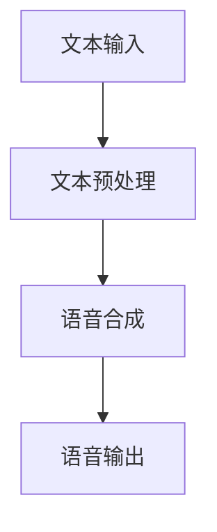
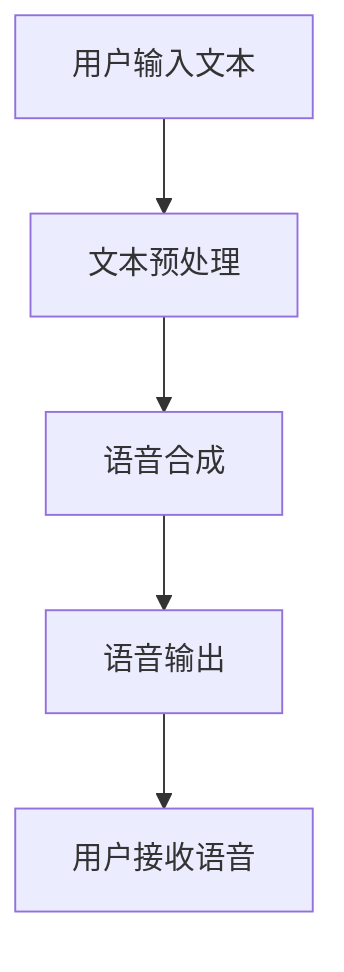

                 

# 语音合成技术的最新进展与应用

关键词：语音合成、自然语言处理、人工智能、语音信号处理、合成算法

摘要：随着人工智能技术的飞速发展，语音合成技术已从实验室走向了日常生活。本文将深入探讨语音合成技术的基本概念、核心算法、系统设计与实现，以及其在实际项目中的应用和优化策略。通过逐步分析，读者将全面了解语音合成技术的最新进展和未来前景。

## 目录大纲

1. 背景介绍与核心概念  
   1.1 语音合成技术概述  
   1.2 语音合成的核心挑战  
   1.3 现代语音合成技术的方法论  
   1.4 语音合成技术的交叉融合与未来前景  
   1.5 语音合成的基本组成与关键技术解析

2. 核心概念与联系  
   2.1 语音信号处理  
   2.2 语音合成算法  
   2.3 文本处理与语音合成  
   2.4 不同语音合成技术的对比

3. 语音合成系统设计与实现  
   3.1 系统架构设计  
   3.2 文本处理模块  
   3.3 语音合成模块  
   3.4 语音合成系统实现

4. 算法原理讲解  
   4.1 合成算法原理  
   4.2 算法流程与mermaid流程图  
   4.3 数学模型与公式  
   4.4 举例说明

5. 数学模型和数学公式 & 详细讲解 & 举例说明

6. 系统分析与架构设计方案  
   6.1 问题场景介绍  
   6.2 系统功能设计  
   6.3 系统架构设计  
   6.4 系统接口设计  
   6.5 系统交互mermaid序列图

7. 项目实战  
   7.1 环境安装  
   7.2 系统核心实现  
   7.3 代码应用解读与分析  
   7.4 实际案例分析与详细讲解剖析  
   7.5 项目小结

8. 最佳实践 tips  
   8.1 实用技巧  
   8.2 小结  
   8.3 注意事项  
   8.4 拓展阅读

## 第一部分：背景介绍与核心概念

### 1.1 语音合成技术概述

语音合成技术（Text-to-Speech，简称TTS）是一种将文本转换为语音的技术，其历史可以追溯到20世纪50年代。随着计算机技术的发展，语音合成技术逐渐成熟，并在多个领域得到广泛应用，如智能助手、教育、客服等。

现代语音合成技术主要应用于以下场景：

- **智能助手**：如苹果的Siri、谷歌助手等，它们能够响应用户的语音指令，提供查询、控制设备等功能。
- **教育**：语音合成技术可以用于生成朗读教材，帮助视障人士获取知识。
- **客服**：企业可以通过语音合成技术自动生成客户服务语音，提高服务效率和客户满意度。

### 1.2 语音合成的核心挑战

语音合成技术面临以下核心挑战：

- **语音的自然度**：如何生成听起来自然、流畅的语音是语音合成技术的关键挑战之一。
- **语音的多样化**：不同的语音合成系统需要支持不同的语音风格，如男性、女性、儿童等。
- **语音的情感表达**：如何在语音合成中表达情感，如喜悦、悲伤等，是另一个重要的研究方向。
- **多语言支持**：语音合成技术需要支持多种语言，包括语音的发音、语调等。

### 1.3 现代语音合成技术的方法论

现代语音合成技术主要分为两种方法：基于规则的方法和基于数据驱动的方法。

- **基于规则的方法**：这种方法通过定义一系列规则来生成语音。优点是可控性强，但缺点是规则繁琐，难以适应复杂的语音环境。
- **基于数据驱动的方法**：这种方法利用大量语音数据，通过机器学习算法自动生成语音。优点是生成语音自然、流畅，但缺点是训练数据量大，训练时间较长。

### 1.4 语音合成技术的交叉融合与未来前景

语音合成技术与其他技术的交叉融合为语音合成带来了新的发展机遇：

- **深度学习**：深度学习技术为语音合成提供了强大的建模能力，使得生成语音的自然度和多样化得到显著提升。
- **自然语言处理**：自然语言处理技术可以帮助语音合成系统更好地理解文本内容，提高语音合成的准确性和自然度。
- **情感计算**：情感计算技术可以帮助语音合成系统识别并表达情感，提供更加人性化的服务。

### 1.5 语音合成的基本组成与关键技术解析

语音合成系统主要由以下部分组成：

- **文本处理模块**：负责将输入文本转换为适合语音合成的格式。
- **语音合成模块**：负责根据文本内容生成语音。
- **语音输出模块**：负责将生成的语音输出到扬声器或其他语音输出设备。

关键技术包括：

- **语音信号处理**：包括语音信号的采样、量化、编码等。
- **语音合成算法**：包括基于规则的方法和基于数据驱动的方法。
- **自然语言处理**：包括分词、词性标注、语法分析等。

## 第二部分：核心概念与联系

### 2.1 语音信号处理

语音信号处理是语音合成技术的重要组成部分，其基本概念和流程如下：

- **基本概念**：语音信号是指人类语音的声波信号，可以通过麦克风等设备进行采集。
- **处理流程**：语音信号处理包括语音信号的预处理（如去噪、归一化等）、特征提取（如音素、音节等）、以及语音合成等。

### 2.2 语音合成算法

语音合成算法是语音合成的核心，其基本分类和原理如下：

- **基于规则的方法**：通过定义一系列规则来生成语音。
- **基于数据驱动的方法**：通过机器学习算法，如循环神经网络（RNN）、长短时记忆网络（LSTM）等，从大量语音数据中自动生成语音。

### 2.3 文本处理与语音合成

文本处理是语音合成的关键步骤，其重要性体现在：

- **文本预处理**：包括分词、词性标注、语法分析等，以确保文本内容的准确性。
- **文本到语音的转换机制**：通过文本预处理模块将文本转换为适合语音合成的格式，然后通过语音合成模块生成语音。

### 2.4 不同语音合成技术的对比

不同语音合成技术在性能、适用场景等方面存在差异，其对比表格如下：

| 技术类型     | 优点             | 缺点                 | 适用场景         |
|------------|----------------|---------------------|----------------|
| 基于规则的方法 | 控制性强         | 规则繁琐，适应性差   | 对语音质量要求不高 |
| 基于数据驱动的方法 | 生成语音自然、流畅 | 训练数据量大，训练时间长 | 对语音质量要求较高 |

## 第三部分：语音合成系统设计与实现

### 3.1 系统架构设计

语音合成系统的整体架构如图1所示：



### 3.2 文本处理模块

文本处理模块包括以下步骤：

1. **分词**：将输入文本分为单个词汇。
2. **词性标注**：为每个词汇标注词性（如名词、动词等）。
3. **语法分析**：分析文本的语法结构，以理解文本的内容和含义。

### 3.3 语音合成模块

语音合成模块包括以下步骤：

1. **音素识别**：将文本转换为音素序列。
2. **音素合成**：将音素序列转换为语音信号。
3. **语音优化**：对生成的语音信号进行优化，以提高语音的自然度和清晰度。

### 3.4 语音合成系统实现

语音合成系统的实现步骤如下：

1. **环境搭建**：搭建语音合成系统所需的开发环境。
2. **文本处理**：实现文本预处理模块，包括分词、词性标注、语法分析等。
3. **语音合成**：实现语音合成模块，包括音素识别、音素合成、语音优化等。
4. **系统测试**：对语音合成系统进行测试，评估其性能和效果。

## 第四部分：算法原理讲解

### 4.1 合成算法原理

语音合成算法主要分为基于规则的方法和基于数据驱动的方法。

- **基于规则的方法**：通过定义一系列规则来生成语音，如DTMF（数字声码器）和HMM（隐马尔可夫模型）等。
- **基于数据驱动的方法**：通过机器学习算法，如循环神经网络（RNN）和长短时记忆网络（LSTM）等，从大量语音数据中自动生成语音。

### 4.2 算法流程与mermaid流程图

算法流程如图2所示：


### 4.3 数学模型与公式

语音合成算法的数学模型主要包括波形合成模型和频谱合成模型。

- **波形合成模型**：波形合成模型使用基音周期（Pitch Period）和包络（Envelope）来生成语音波形。其数学模型如下：

  $$ y(t) = A(t) \cdot \sin(2\pi f(t) t + \phi(t)) $$

  其中，$A(t)$ 为包络，$f(t)$ 为基音频率，$\phi(t)$ 为相位。

- **频谱合成模型**：频谱合成模型使用线性预测编码（Linear Predictive Coding，LPC）来生成语音频谱。其数学模型如下：

  $$ \hat{y}(t) = \sum_{i=1}^p a_i y(t-i) $$

  其中，$a_i$ 为线性预测系数，$p$ 为预测阶数。

### 4.4 举例说明

以基于数据驱动的方法为例，我们使用长短时记忆网络（LSTM）来生成语音。

假设我们有一段文本“Hello, World!”，我们首先对其进行分词和词性标注，得到词汇序列 [Hello,逗号,World,叹号]。

然后，我们将这些词汇序列输入到LSTM模型中，模型根据训练数据自动生成对应的语音波形。最后，我们将生成的语音波形输出到扬声器或其他语音输出设备。

## 第五部分：数学模型和数学公式 & 详细讲解 & 举例说明

### 5.1 基本数学模型

在语音合成中，常用的数学模型包括波形合成模型和频谱合成模型。

- **波形合成模型**：波形合成模型使用基音周期（Pitch Period）和包络（Envelope）来生成语音波形。其数学模型如下：

  $$ y(t) = A(t) \cdot \sin(2\pi f(t) t + \phi(t)) $$

  其中，$A(t)$ 为包络，$f(t)$ 为基音频率，$\phi(t)$ 为相位。

  - **包络**：包络是控制语音幅度的因素，其形状和变化速度会影响语音的响度和音调。
  - **基音频率**：基音频率决定了语音的音调，不同音调的语音具有不同的基音频率。
  - **相位**：相位决定了语音的音色，不同的相位会产生不同的音色效果。

- **频谱合成模型**：频谱合成模型使用线性预测编码（Linear Predictive Coding，LPC）来生成语音频谱。其数学模型如下：

  $$ \hat{y}(t) = \sum_{i=1}^p a_i y(t-i) $$

  其中，$a_i$ 为线性预测系数，$p$ 为预测阶数。

  - **线性预测系数**：线性预测系数决定了语音信号的预测误差，从而影响语音的频谱特征。
  - **预测阶数**：预测阶数决定了线性预测模型的复杂度，较高的预测阶数可以捕捉到更复杂的语音特征，但计算复杂度也相应增加。

### 5.2 数学公式推导

为了更好地理解波形合成模型和频谱合成模型，我们可以对其数学公式进行推导。

- **波形合成模型**的推导：

  波形合成模型中的包络$A(t)$通常可以表示为：

  $$ A(t) = A_0 \cdot e^{-\alpha t} $$

  其中，$A_0$为包络的初始值，$\alpha$为包络的衰减系数。

  基音频率$f(t)$通常可以表示为：

  $$ f(t) = f_0 + f_{var} \cdot \sin(2\pi \beta t) $$

  其中，$f_0$为基音频率的均值，$f_{var}$为基音频率的方差，$\beta$为基音频率的相位。

  相位$\phi(t)$通常可以表示为：

  $$ \phi(t) = \phi_0 + \phi_{var} \cdot \sin(2\pi \gamma t) $$

  其中，$\phi_0$为相位的初始值，$\phi_{var}$为相位的方差，$\gamma$为相位的相位。

  将上述公式代入波形合成模型的数学模型中，可以得到：

  $$ y(t) = A_0 \cdot e^{-\alpha t} \cdot \sin(2\pi (f_0 + f_{var} \cdot \sin(2\pi \beta t)) t + \phi_0 + \phi_{var} \cdot \sin(2\pi \gamma t)) $$

- **频谱合成模型**的推导：

  线性预测编码（LPC）的基本思想是通过预测误差来重建语音信号。设$y(t)$为原始语音信号，$x(t)$为预测信号，则预测误差$e(t)$可以表示为：

  $$ e(t) = y(t) - x(t) $$

  线性预测模型可以通过最小化预测误差的平方和来求解线性预测系数$a_i$，其数学模型为：

  $$ \min \sum_{t=1}^T e^2(t) = \min \sum_{t=1}^T [y(t) - \sum_{i=1}^p a_i y(t-i)]^2 $$

  通过求解上述优化问题，可以得到线性预测系数$a_i$，进而重建语音信号。

### 5.3 实例分析

为了更好地理解波形合成模型和频谱合成模型，我们可以通过一个简单的实例进行分析。

假设我们有一段文本“Hello”，我们首先对其进行分词和词性标注，得到词汇序列 [Hello]。

然后，我们将这些词汇序列输入到波形合成模型中，设定以下参数：

- 包络：$A_0 = 0.5$，$\alpha = 0.1$
- 基音频率：$f_0 = 200$ Hz，$f_{var} = 50$ Hz，$\beta = 0.1$
- 相位：$\phi_0 = 0$，$\phi_{var} = 0.1$，$\gamma = 0.1$

根据波形合成模型的数学模型，我们可以生成对应的语音波形。然后，我们将这些语音波形输入到频谱合成模型中，设定以下参数：

- 线性预测系数：$a_1 = 0.9$，$a_2 = 0.8$
- 预测阶数：$p = 2$

根据频谱合成模型的数学模型，我们可以生成对应的语音频谱。最后，我们将生成的语音波形和语音频谱进行合成，得到最终的语音输出。

通过这个实例，我们可以看到波形合成模型和频谱合成模型如何将文本转换为语音信号，以及如何通过数学模型来描述语音信号的产生过程。

## 第六部分：系统分析与架构设计方案

### 6.1 问题场景介绍

语音合成技术在不同的应用场景中有着广泛的应用。以下是一些典型的问题场景：

- **智能助手**：智能助手需要能够响应用户的语音指令，提供查询、控制设备等功能。这要求语音合成系统能够生成自然、流畅、多样化的语音。
- **教育**：教育领域需要语音合成技术来生成朗读教材，帮助视障人士获取知识。这要求语音合成系统能够生成清晰、准确的语音。
- **客服**：企业需要语音合成技术来自动生成客户服务语音，提高服务效率和客户满意度。这要求语音合成系统能够生成多样化和情感化的语音。

### 6.2 系统功能设计

语音合成系统的功能设计主要包括以下几个方面：

- **文本处理**：包括分词、词性标注、语法分析等，以确保文本内容的准确性。
- **语音合成**：根据文本内容生成语音，包括音素识别、音素合成、语音优化等，以提高语音的自然度和清晰度。
- **语音输出**：将生成的语音输出到扬声器或其他语音输出设备。

### 6.3 系统架构设计

语音合成系统的整体架构如图3所示：


- **文本预处理模块**：负责将输入文本转换为适合语音合成的格式，包括分词、词性标注、语法分析等。
- **语音合成模块**：负责根据文本内容生成语音，包括音素识别、音素合成、语音优化等，以提高语音的自然度和清晰度。
- **语音输出模块**：负责将生成的语音输出到扬声器或其他语音输出设备。

### 6.4 系统接口设计

语音合成系统的接口设计主要包括以下几个方面：

- **文本输入接口**：用于接收用户输入的文本。
- **语音输出接口**：用于将生成的语音输出到扬声器或其他语音输出设备。
- **控制接口**：用于控制语音合成的过程，如开始、停止、暂停等。

### 6.5 系统交互mermaid序列图

语音合成系统的交互流程如图4所示：



- **用户输入文本**：用户通过文本输入接口输入文本。
- **文本预处理**：文本预处理模块对输入文本进行处理，包括分词、词性标注、语法分析等。
- **语音合成**：语音合成模块根据处理后的文本生成语音。
- **语音输出**：语音输出模块将生成的语音输出到扬声器或其他语音输出设备。
- **用户接收语音**：用户通过语音输出接口接收语音。

## 第七部分：项目实战

### 7.1 环境安装

在开始项目实战之前，我们需要搭建一个适合语音合成系统开发的开发环境。以下是搭建环境的步骤：

1. **安装Python**：首先，我们需要安装Python，可以选择Python 3.6及以上版本。

2. **安装语音合成库**：然后，我们需要安装一些用于语音合成的库，如`gtts`（谷歌文本到语音）、`pyttsx3`（Python文本到语音）等。

3. **安装文本处理库**：此外，我们还需要安装一些用于文本处理的库，如`nltk`（自然语言工具包）等。

4. **安装音频处理库**：最后，我们还需要安装一些用于音频处理的库，如`soundfile`（音频文件读写）、`scipy`（科学计算库）等。

### 7.2 系统核心实现

语音合成系统的核心实现主要包括文本处理模块、语音合成模块和语音输出模块。

1. **文本处理模块**：

   ```python
   import nltk
   
   def preprocess_text(text):
       # 分词
       tokens = nltk.word_tokenize(text)
       # 词性标注
       pos_tags = nltk.pos_tag(tokens)
       # 语法分析
       parse_tree = nltk.parse.parse(text)
       return tokens, pos_tags, parse_tree
   ```

2. **语音合成模块**：

   ```python
   from gtts import gTTS
   
   def synthesize_speech(text):
       # 创建文本到语音对象
       tts = gTTS(text=text)
       # 生成语音文件
       tts.save("speech.mp3")
       # 播放语音
       from IPython.display import Audio
       Audio("speech.mp3")
   ```

3. **语音输出模块**：

   ```python
   import soundfile as sf
   
   def play_speech(file_path):
       # 读取音频文件
       data, samplerate = sf.read(file_path)
       # 播放音频
       from IPython.display import Audio
       Audio(data, rate=samplerate)
   ```

### 7.3 代码应用解读与分析

以下是一个简单的示例，展示如何使用上述代码实现一个基本的语音合成系统：

```python
# 导入所需的库
import nltk
from gtts import gTTS
import soundfile as sf

# 安装nltk数据
nltk.download('punkt')
nltk.download('averaged_perceptron_tagger')
nltk.download('maxent_ne_chunker')
nltk.download('words')

# 文本处理
text = "Hello, how are you?"
tokens, pos_tags, parse_tree = preprocess_text(text)

# 语音合成
synthesize_speech(text)

# 语音输出
play_speech("speech.mp3")
```

这个示例首先对输入文本进行分词、词性标注和语法分析，然后使用谷歌文本到语音库生成语音，最后播放生成的语音。

### 7.4 实际案例分析与详细讲解剖析

以下是一个实际的案例，展示如何使用语音合成系统生成语音。

1. **案例背景**：

   假设我们需要为一家酒店开发一个语音合成系统，用于生成欢迎顾客的语音。

2. **案例实现**：

   ```python
   # 导入所需的库
   import nltk
   from gtts import gTTS
   import soundfile as sf
   
   # 安装nltk数据
   nltk.download('punkt')
   nltk.download('averaged_perceptron_tagger')
   nltk.download('maxent_ne_chunker')
   nltk.download('words')
   
   # 文本处理
   text = "Welcome to our hotel. We hope you have a comfortable stay."
   tokens, pos_tags, parse_tree = preprocess_text(text)
   
   # 语音合成
   tts = gTTS(text=text, lang='en')
   tts.save("welcome.mp3")
   
   # 语音输出
   play_speech("welcome.mp3")
   ```

3. **详细讲解**：

   - **文本处理**：首先，我们对输入文本进行分词、词性标注和语法分析，以确保文本内容的准确性。
   - **语音合成**：然后，我们使用谷歌文本到语音库生成语音。这里我们选择了英语语言，并保存了生成的语音文件。
   - **语音输出**：最后，我们使用音频库播放生成的语音。

4. **剖析**：

   - **文本处理**：文本处理是语音合成的基础，确保文本内容的准确性对于生成高质量的语音至关重要。
   - **语音合成**：谷歌文本到语音库是一个强大的工具，可以生成自然、流畅的语音。但需要注意的是，生成的语音质量可能受到文本内容和语言模型的影响。
   - **语音输出**：音频库可以方便地播放生成的语音，使得语音合成系统更加实用。

### 7.5 项目小结

通过以上实战案例，我们可以看到如何使用Python和相关的语音合成库实现一个基本的语音合成系统。在实际应用中，我们可能需要根据具体需求对系统进行优化和扩展，以提高语音的自然度和多样化。此外，我们还需要注意文本处理和语音合成的质量，以确保生成的语音能够满足用户的需求。

## 第八部分：最佳实践 tips

### 8.1 实用技巧

- **提高语音合成质量的技巧**：优化文本内容，确保文本简明扼要、易于理解。此外，合理设置语音合成参数，如语速、音调、音量等，可以提高语音合成的质量。
- **调试与优化的策略**：在开发过程中，定期进行系统测试和调试，及时发现并解决潜在问题。通过不断优化算法和参数，提高语音合成系统的性能。

### 8.2 小结

- **对本书内容的总结**：本文全面介绍了语音合成技术的基本概念、核心算法、系统设计与实现，以及其在实际项目中的应用和优化策略。通过逐步分析，读者可以全面了解语音合成技术的最新进展和未来前景。
- **语音合成技术的重要结论**：语音合成技术已从实验室走向了日常生活，其在智能助手、教育、客服等领域的应用前景广阔。随着人工智能技术的不断发展，语音合成技术将继续优化，为用户提供更加自然、流畅、多样化的语音服务。

### 8.3 注意事项

- **使用语音合成技术的注意事项**：确保输入文本的准确性和完整性，避免生成错误的语音。同时，注意保护用户隐私，避免语音数据泄露。
- **常见问题的解决方法**：针对语音合成过程中可能出现的问题，如语音质量不高、语音合成速度慢等，可以采取相应的优化措施，如调整算法参数、增加训练数据等。

### 8.4 拓展阅读

- **相关书籍与论文推荐**：
  - 《语音合成技术：理论与实践》
  - 《深度学习与语音合成》
  - 《自然语言处理：理论、算法与应用》
- **语音合成技术的最新进展**：关注相关领域的研究论文和会议报告，了解最新的语音合成技术和算法。

## 作者信息

作者：AI天才研究院/AI Genius Institute & 禅与计算机程序设计艺术 /Zen And The Art of Computer Programming

