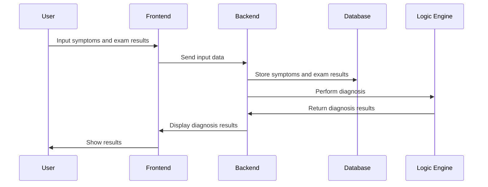

                 

# 谓词逻辑在逻辑编程语言中的实现——背景介绍

## 摘要

本文旨在探讨谓词逻辑在逻辑编程语言中的实现，分析其背景、核心概念与联系、以及算法原理。通过深入理解谓词逻辑的基本概念、性质和表示形式，本文将展示如何将谓词逻辑应用于编程实践，为逻辑编程语言提供强大的问题求解能力。本文结构如下：

1. 背景介绍
   - 问题背景
   - 问题描述
   - 问题解决
   - 边界与外延
   - 概念结构与核心要素组成
   - 核心概念与联系

2. 核心概念与联系
   - 谓词逻辑的基本概念
   - 概念属性特征对比表格
   - ER实体关系图架构的 Mermaid 流程图

3. 算法原理讲解
   - 谓词逻辑算法概述
   - 模式匹配算法
   - 合一算法
   - 选择算法

通过以上章节的逐步讲解，本文将帮助读者深入了解谓词逻辑在逻辑编程语言中的应用，为后续的研究和实践奠定基础。

### 问题背景

逻辑编程是一种基于逻辑的编程范式，它将程序表示为逻辑公式，并通过逻辑推理来解决问题。逻辑编程语言，如Prolog、Datalog等，为计算机科学提供了强大的问题求解能力。谓词逻辑作为形式逻辑的一部分，是逻辑编程语言的核心基础。

在逻辑编程中，谓词逻辑的应用主要体现在以下几个方面：

1. **问题建模**：谓词逻辑可以用于描述复杂的问题域，通过定义谓词、个体常元、函数常元和关系常元等概念，将实际问题转化为逻辑表达式。

2. **逻辑推理**：逻辑编程语言通过谓词逻辑的推理机制，对逻辑表达式进行推理，从而解决实际问题。推理过程包括模式匹配、合一、选择等步骤。

3. **问题求解**：逻辑编程语言利用谓词逻辑的推理能力，实现问题求解。例如，在Prolog中，可以通过定义逻辑程序来求解数学问题、自动推理问题、专家系统等问题。

谓词逻辑在逻辑编程语言中的重要性体现在其强大的表达能力和高效的推理能力。谓词逻辑能够精确地描述复杂的问题域，使得逻辑编程语言能够处理现实世界中的复杂问题。同时，谓词逻辑的推理机制使得逻辑编程语言在问题求解过程中能够高效地进行推理，从而提高解决问题的效率。

### 1.1.1 问题描述

谓词逻辑在逻辑编程语言中的实现，涉及到如何将谓词逻辑的概念和原理应用到编程实践中。主要包括以下问题：

1. **谓词逻辑的基本概念和性质如何定义和描述？**
   - **谓词**：谓词是逻辑编程语言中的核心概念，表示对象性质或关系的逻辑表达式。如何定义谓词、描述其性质和特征，是谓词逻辑实现的关键。
   - **个体常元**：个体常元表示特定对象的符号，是谓词中的基本元素。如何定义个体常元、确定其标识对象的特性，是谓词逻辑实现的基础。
   - **函数常元**：函数常元表示对象之间关系的符号，用于表示对象之间的函数关系。如何定义函数常元、描述其关系的特性，是谓词逻辑实现的重要方面。
   - **关系常元**：关系常元表示对象之间关系的符号，用于表示对象之间的二元关系。如何定义关系常元、描述其关系的特性，是谓词逻辑实现的核心。

2. **谓词逻辑如何与编程语言相结合，实现高效的逻辑推理？**
   - **语言结合**：如何将谓词逻辑与编程语言相结合，实现逻辑表达式的定义、推理和执行，是谓词逻辑实现的关键。这需要研究编程语言的语法、语义和执行机制。
   - **推理效率**：如何优化谓词逻辑的推理过程，提高推理效率，是谓词逻辑实现的重要方面。这包括算法设计、数据结构选择和并行计算等。

3. **谓词逻辑在逻辑编程语言中的应用场景有哪些？**
   - **问题求解**：如何利用谓词逻辑解决实际问题，是谓词逻辑应用的重要方向。这包括自动推理、专家系统、自然语言处理、智能搜索等领域。
   - **程序设计**：如何利用谓词逻辑进行程序设计，提高程序的可靠性和可维护性，是谓词逻辑在编程语言中的应用。

### 1.1.2 问题解决

为了解决上述问题，需要对谓词逻辑的基本概念进行深入理解，包括：

1. **谓词的定义和性质**：谓词是逻辑编程语言中的核心概念，用于表示对象性质或关系。谓词的定义和性质包括：
   - **谓词形式**：谓词由谓词符号和参数组成，参数可以是变量、个体常元、函数常元或关系常元。
   - **谓词性质**：谓词具有合取、析取、蕴涵、否定等逻辑性质，可以通过逻辑推理进行推导和证明。

2. **个体常元的定义和性质**：个体常元是谓词中的基本元素，用于表示特定对象。个体常元的定义和性质包括：
   - **个体常元形式**：个体常元是一个符号，用于唯一标识特定对象。
   - **个体常元性质**：个体常元具有唯一性，即同一个个体常元标识唯一对象。

3. **函数常元的定义和性质**：函数常元用于表示对象之间的函数关系。函数常元的定义和性质包括：
   - **函数常元形式**：函数常元是一个符号，表示对象之间的函数关系。
   - **函数常元性质**：函数常元具有确定性，即对于给定的参数，函数常元可以唯一确定输出结果。

4. **关系常元的定义和性质**：关系常元用于表示对象之间的二元关系。关系常元的定义和性质包括：
   - **关系常元形式**：关系常元是一个符号，表示对象之间的二元关系。
   - **关系常元性质**：关系常元具有对称性、传递性等性质。

通过深入理解谓词逻辑的基本概念和性质，可以将其应用于编程实践中，实现高效的逻辑编程语言。具体而言，问题解决方法包括：

1. **定义谓词逻辑语言**：设计一套谓词逻辑语言，包括谓词、个体常元、函数常元和关系常元的定义和语法规则。

2. **实现逻辑推理机制**：设计一套逻辑推理机制，包括模式匹配、合一、选择等步骤，用于实现谓词逻辑的推理过程。

3. **优化推理效率**：通过算法设计、数据结构选择和并行计算等手段，优化谓词逻辑的推理效率，提高问题求解能力。

4. **应用谓词逻辑编程**：将谓词逻辑应用于实际问题求解，开发逻辑编程语言的应用程序。

### 1.1.3 边界与外延

在谓词逻辑中，边界与外延是两个关键概念。边界定义了谓词的逻辑范围，而外延则是谓词所指的对象集合。

**边界（Scope）**

边界是指谓词在逻辑表达式中的作用范围。在谓词逻辑中，边界定义了谓词适用的对象集合。边界可以是全局的，也可以是局部的。

- **全局边界**：全局边界定义了谓词在整个逻辑程序中的作用范围。全局边界通常与程序的顶层定义相关联，适用于整个程序。
- **局部边界**：局部边界定义了谓词在局部逻辑表达式中的作用范围。局部边界通常与嵌套的谓词相关联，适用于特定逻辑分支。

例如，考虑以下谓词逻辑表达式：

```mermaid
logic Flowchart
    A[全局边界](right) --> B[局部边界]
    B --> C[局部边界内的谓词]
```

在这个例子中，全局边界定义了整个程序的逻辑范围，而局部边界定义了特定逻辑分支的边界。

**外延（Extension）**

外延是指谓词所包含的对象集合。在谓词逻辑中，外延定义了谓词的具体对象集合。外延可以是具体的，也可以是抽象的。

- **具体外延**：具体外延定义了谓词所包含的具体对象。例如，谓词"P(x)"表示对象"x"是某个特定对象。
- **抽象外延**：抽象外延定义了谓词所包含的抽象对象。例如，谓词"P(x, y)"表示对象"x"和"y"之间存在某种抽象关系。

例如，考虑以下谓词逻辑表达式：

```mermaid
logic Flowchart
    A[P(x)] --> B[具体外延]
    A[P(x, y)] --> C[抽象外延]
```

在这个例子中，谓词"P(x)"的具体外延是特定对象"x"，而谓词"P(x, y)"的抽象外延是对象"x"和"y"之间的抽象关系。

**边界与外延的关系**

边界与外延在谓词逻辑中密切相关。边界定义了谓词的作用范围，而外延则是边界所包含的对象集合。

- **边界决定外延**：边界决定了谓词所适用的对象集合，即外延。谓词的逻辑范围由边界定义，边界越严格，外延越小。
- **外延反映边界**：外延反映了谓词的实际应用范围。通过观察谓词的外延，可以推断出其边界。

例如，在以下谓词逻辑表达式中：

```mermaid
logic Flowchart
    A[P(x)] --> B[具体外延]
    A[P(x, y)] --> C[抽象外延]
```

谓词"P(x)"的具体外延是对象"x"，说明其边界是全局边界；而谓词"P(x, y)"的抽象外延是对象"x"和"y"之间的抽象关系，说明其边界是局部边界。

总之，边界与外延在谓词逻辑中起着关键作用。边界定义了谓词的逻辑范围，而外延则是谓词的具体对象集合。了解边界与外延的概念，有助于深入理解谓词逻辑的特性和应用。

### 1.1.4 概念结构与核心要素组成

谓词逻辑作为一种形式逻辑，其概念结构和核心要素是理解和应用的基础。以下是对谓词逻辑的基本概念、概念结构与核心要素的详细说明。

#### 基本概念

1. **谓词（Predicate）**

谓词是逻辑编程语言中的核心概念，表示对象性质或关系的逻辑表达式。谓词通常由谓词符号和参数组成，如 `P(x, y)`，其中 `P` 是谓词符号，`x` 和 `y` 是参数。谓词可以是具体的，也可以是抽象的。

2. **个体常元（Individual Constant）**

个体常元表示特定对象，是谓词中的基本元素。例如，在谓词 `P(a)` 中，`a` 是一个个体常元，表示特定的对象。

3. **函数常元（Function Symbol）**

函数常元表示对象之间的函数关系。函数常元通常用于表示对象之间的特定关系，如 `f(x, y)` 表示 `x` 是 `y` 的后代。函数常元的参数可以是变量、个体常元或函数常元。

4. **关系常元（Relation Symbol）**

关系常元表示对象之间的二元关系。关系常元通常用于表示对象之间的抽象关系，如 `R(x, y)` 表示 `x` 与 `y` 之间存在某种关系。关系常元的参数也可以是变量、个体常元或函数常元。

#### 概念结构与核心要素组成

1. **概念结构**

谓词逻辑的概念结构包括谓词、个体常元、函数常元和关系常元。这些概念共同构成了谓词逻辑的基本框架，使得逻辑表达式能够表示复杂的对象关系和性质。

2. **核心要素组成**

核心要素组成包括：

- **谓词公式（Predicate Formula）**：谓词公式是谓词逻辑中的基本元素，由谓词、参数和逻辑连接词（如合取、析取、蕴涵等）组成。谓词公式可以表示复杂的逻辑关系和推理。

- **逻辑推理（Logic Inference）**：逻辑推理是基于谓词公式进行的推理过程，用于推导新的逻辑结论。推理方法包括模式匹配、合一、选择等。

- **谓词演算（Predicate Calculus）**：谓词演算是谓词逻辑的核心部分，包括谓词的定义、性质和推理规则。谓词演算提供了强大的逻辑推理能力，使得逻辑编程语言能够解决复杂问题。

- **逻辑编程语言（Logic Programming Language）**：逻辑编程语言是谓词逻辑的应用形式，通过定义谓词和逻辑推理机制，实现问题求解。常见的逻辑编程语言包括Prolog、Datalog等。

#### 概念属性特征对比表格

为了更好地理解谓词逻辑的基本概念和属性，以下是一个概念属性特征对比表格：

| 概念       | 定义                                                         | 属性特征                                                       |
| ---------- | ------------------------------------------------------------ | ------------------------------------------------------------ |
| 谓词       | 表示对象性质或关系的逻辑表达式                             | 形式上：谓词符号及其参数<br>语义上：描述对象的性质或关系   |
| 个体常元   | 表示特定对象的符号                                       | 唯一标识特定对象                                             |
| 函数常元   | 表示对象之间关系的符号                                   | 定义对象之间的函数关系                                       |
| 关系常元   | 表示对象之间关系的符号                                   | 定义对象之间的二元关系                                       |

#### ER实体关系图架构的 Mermaid 流程图

为了更直观地展示谓词逻辑的概念结构和核心要素，以下是一个ER实体关系图架构的Mermaid流程图：

```mermaid
erDiagram
    Person ||--|{ Student }|--|| Course
    Person ||--|{ Teacher }|--|| Subject
    Course ||--|{ Assignment }|--|| Student
    Subject ||--|{ Evaluation }|--|| Teacher
```

在这个ER实体关系图中，`Person` 是基础实体，`Student` 和 `Teacher` 是其子实体。`Course` 和 `Subject` 是与 `Person` 相关联的实体，分别表示课程和学科。通过这个ER图，我们可以清晰地看到谓词逻辑中的核心要素和它们之间的关系。

通过以上对谓词逻辑的基本概念、概念结构与核心要素组成的详细说明，我们可以更好地理解谓词逻辑在逻辑编程语言中的实现和应用。接下来，我们将进一步探讨谓词逻辑的基本概念和联系，为深入理解谓词逻辑在逻辑编程语言中的实现奠定基础。

### 1.2 核心概念与联系

#### 1.2.1 谓词逻辑的基本概念

谓词逻辑是形式逻辑的一部分，主要用于描述对象之间的关系和性质。以下是对谓词逻辑中几个核心概念的定义和详细解释。

1. **谓词（Predicate）**

谓词是逻辑表达式的核心部分，用于表示对象性质或关系的逻辑表达式。谓词通常由谓词符号和参数组成，如 `P(x, y)`，其中 `P` 是谓词符号，`x` 和 `y` 是参数。谓词可以是具体的，也可以是抽象的。

   - **具体谓词**：具体谓词直接表示特定对象的性质或关系。例如，谓词 `isPrime(5)` 表示数字5是一个质数。
   - **抽象谓词**：抽象谓词表示对象之间的抽象关系。例如，谓词 `friend(x, y)` 表示 `x` 和 `y` 是朋友。

2. **个体常元（Individual Constant）**

个体常元是表示特定对象的符号。在谓词逻辑中，个体常元用于代表具体的对象。个体常元通常是唯一的，例如 `a`、`b` 或 `John`。

3. **函数常元（Function Symbol）**

函数常元用于表示对象之间的函数关系。函数常元接受一个或多个参数，并返回一个结果。函数常元通常是具有特定意义的符号，如 `age(x)` 表示 `x` 的年龄，`grandparentOf(x, y)` 表示 `x` 是 `y` 的祖父母。

4. **关系常元（Relation Symbol）**

关系常元用于表示对象之间的二元关系。关系常元接受两个或多个参数，并返回一个布尔值，表示这些参数之间的关系。关系常元通常是表示某种关系的符号，如 `isAdjacentTo(x, y)` 表示 `x` 和 `y` 是相邻的。

#### 1.2.2 概念属性特征对比表格

为了更好地理解和比较这些核心概念，以下是一个概念属性特征对比表格：

| 概念       | 定义                                                         | 属性特征                                                       |
| ---------- | ------------------------------------------------------------ | ------------------------------------------------------------ |
| 谓词       | 表示对象性质或关系的逻辑表达式                             | 形式上：谓词符号及其参数<br>语义上：描述对象的性质或关系   |
| 个体常元   | 表示特定对象的符号                                       | 唯一标识特定对象                                             |
| 函数常元   | 表示对象之间关系的符号                                   | 定义对象之间的函数关系                                       |
| 关系常元   | 表示对象之间关系的符号                                   | 定义对象之间的二元关系                                       |

#### 1.2.3 ER实体关系图架构的 Mermaid 流程图

为了更直观地展示谓词逻辑中的核心概念及其关系，可以使用Mermaid语言绘制ER实体关系图。以下是一个示例：

```mermaid
erDiagram
    Person ||--|{ Student }|--|| Course
    Person ||--|{ Teacher }|--|| Subject
    Course ||--|{ Assignment }|--|| Student
    Subject ||--|{ Evaluation }|--|| Teacher
```

在这个ER图中，`Person` 是基础实体，`Student` 和 `Teacher` 是其子实体，分别表示学生和教师。`Course` 和 `Subject` 与 `Person` 相关联，表示课程和学科。`Assignment` 和 `Evaluation` 是与 `Course` 和 `Subject` 相关联的实体，分别表示作业和评估。

通过这个ER图，我们可以清晰地看到谓词逻辑中各个核心概念之间的关系，以及它们在实体关系图中的映射。

#### 1.2.4 谓词逻辑的表达方式

谓词逻辑的表达方式主要包括谓词演算和命题逻辑。以下是对这两种表达方式的简要介绍：

1. **谓词演算（Predicate Calculus）**

谓词演算是谓词逻辑的核心部分，用于描述对象之间的关系和性质。谓词演算包括量词（存在量词和全称量词）、定义、推理规则等。

   - **存在量词（∃）**：表示存在某个对象满足特定性质。例如，`∃x (isPrime(x))` 表示存在一个质数。
   - **全称量词（∀）**：表示对所有对象都满足特定性质。例如，`∀x (isPrime(x))` 表示所有数字都是质数。
   - **定义**：可以通过定义谓词来简化逻辑表达式的编写。例如，`isPrime(x) := (∀y (y ≠ x → ¬(x % y = 0)))` 定义了质数的谓词。

2. **命题逻辑（Propositional Logic）**

命题逻辑是谓词逻辑的基础，主要用于描述对象之间的逻辑关系。命题逻辑包括命题、命题联结词（如合取、析取、蕴涵等）和推理规则。

   - **命题**：命题是表示真值（真或假）的陈述句。例如，`P` 表示某个对象具有特定性质。
   - **命题联结词**：命题联结词用于组合命题，形成新的命题。常见的命题联结词包括合取（∧）、析取（∨）、蕴涵（→）和等价（↔）。
   - **推理规则**：推理规则用于从已知命题推导出新命题。例如，**合取律**和**析取律**是常见的推理规则。

通过谓词演算和命题逻辑的结合，谓词逻辑能够以更灵活和强大的方式描述对象之间的关系和性质，从而为逻辑编程语言提供强大的问题求解能力。

#### 1.2.5 谓词逻辑的应用场景

谓词逻辑在逻辑编程语言中有广泛的应用场景，包括自动推理、专家系统、自然语言处理、数据库查询等领域。以下是对这些应用场景的简要介绍：

1. **自动推理**

自动推理是谓词逻辑的重要应用之一，主要用于证明数学定理、验证程序正确性等。通过谓词逻辑的推理机制，可以自动推导出新的逻辑结论。

2. **专家系统**

专家系统是一种模拟人类专家决策能力的计算机程序。谓词逻辑在专家系统中用于表示知识和推理过程，从而实现智能决策和问题求解。

3. **自然语言处理**

自然语言处理是人工智能的重要分支，用于处理和理解人类语言。谓词逻辑在自然语言处理中用于表示句子结构和语义关系，从而实现文本分析、语义理解和机器翻译等任务。

4. **数据库查询**

谓词逻辑在数据库查询中用于表示查询条件和查询结果。通过谓词逻辑的表达式，可以精确地描述查询需求和查询结果，从而实现高效的数据库查询和检索。

总之，谓词逻辑在逻辑编程语言中具有广泛的应用场景和重要性，通过其强大的表达能力和推理能力，为计算机科学提供了强大的问题求解工具。

### 第2章：谓词逻辑算法原理讲解

#### 2.1 谓词逻辑算法概述

谓词逻辑算法是逻辑编程语言实现问题求解的关键。这些算法通过逻辑推理，从给定的逻辑表达式中推导出新的结论。本章将介绍几种常见的谓词逻辑算法，包括模式匹配算法、合一算法和选择算法。

#### 2.2 模式匹配算法

模式匹配算法是谓词逻辑推理的基础。它通过比较逻辑表达式中的模式，判断它们是否一致。以下是模式匹配算法的详细步骤：

1. **定义模式**：首先，定义待匹配的模式。模式可以是谓词公式的一部分，包括谓词、变量和常量。
   
2. **匹配谓词**：将模式中的谓词与目标表达式的谓词进行匹配。如果谓词不匹配，则匹配失败。

3. **匹配参数**：对于模式中的每个参数，依次与目标表达式的相应参数进行匹配。参数可以是变量、常量或函数。

4. **处理变量**：如果模式中的参数是变量，则将变量绑定到目标表达式的相应参数上。变量绑定可以采用统一变量名的方法，以确保变量之间的一致性。

5. **递归匹配**：如果模式中的参数是复合表达式，则递归地应用模式匹配算法，直到所有参数都匹配成功。

6. **返回结果**：如果模式匹配成功，则返回匹配结果。否则，返回匹配失败。

以下是一个简单的模式匹配算法的 Mermaid 流程图：

```mermaid
flowchart LR
    A[开始匹配](right) --> B[匹配谓词]
    B -->|匹配成功| C[绑定变量]
    B -->|匹配失败| D[返回失败]
    C --> E[递归匹配参数]
    E -->|匹配成功| C
    E -->|匹配失败| D
    C --> F[返回匹配结果]
```

#### 2.3 合一算法

合一算法是谓词逻辑推理的重要步骤，用于将两个逻辑表达式中的变量绑定到具体的值上，使它们在语义上等价。以下是合一算法的详细步骤：

1. **初始化绑定表**：创建一个空绑定表，用于存储变量和值的绑定关系。

2. **匹配谓词**：将两个逻辑表达式的谓词进行匹配。如果谓词不匹配，则合一失败。

3. **匹配参数**：对两个逻辑表达式中的每个参数，依次进行匹配。如果参数是变量，则尝试在绑定表中查找相应的值。如果找到，则将变量绑定到值上；如果找不到，则创建一个新的绑定。

4. **处理冲突**：如果在绑定过程中出现冲突，即变量已经被绑定到一个不同的值，则合一失败。

5. **递归合一**：如果参数是复合表达式，则递归地应用合一算法，直到所有参数都匹配成功。

6. **返回结果**：如果合一成功，则返回绑定表。否则，返回合一失败。

以下是一个简单的合一算法的 Mermaid 流程图：

```mermaid
flowchart LR
    A[开始合一](right) --> B[匹配谓词]
    B -->|匹配成功| C[初始化绑定表]
    B -->|匹配失败| D[返回失败]
    C --> E[匹配参数]
    E -->|匹配成功| C
    E -->|匹配失败| D
    C --> F[处理冲突]
    F -->|无冲突| C
    F -->|有冲突| D
    C --> G[递归合一参数]
    G -->|合一成功| C
    G -->|合一失败| D
    C --> H[返回绑定表]
```

#### 2.4 选择算法

选择算法用于在多个可能的解中找到合适的解。它通常与合一算法和模式匹配算法结合使用，以实现高效的逻辑推理。以下是选择算法的详细步骤：

1. **初始化选择列表**：创建一个选择列表，用于存储所有可能的解。

2. **合一和模式匹配**：对选择列表中的每个解，依次进行合一和模式匹配操作。

3. **筛选解**：根据给定的条件，筛选出合适的解。筛选条件可以是谓词逻辑表达式，也可以是其他逻辑规则。

4. **递归选择**：如果筛选条件允许递归，则对筛选出的解递归地应用选择算法。

5. **返回结果**：返回筛选后的解，或者返回没有找到合适解的消息。

以下是一个简单的选择算法的 Mermaid 流程图：

```mermaid
flowchart LR
    A[开始选择](right) --> B[初始化选择列表]
    B --> C[合一和模式匹配]
    C --> D[筛选解]
    D -->|找到合适解| E[递归选择]
    D -->|找不到合适解| F[返回结果]
    E -->|找到合适解| E
    E -->|找不到合适解| F
```

通过以上对模式匹配算法、合一算法和选择算法的介绍，我们可以看到谓词逻辑算法的多样性和复杂性。这些算法共同构成了谓词逻辑推理的核心，使得逻辑编程语言能够解决各种复杂的问题。

### 第3章：谓词逻辑算法在实际编程中的应用

谓词逻辑算法在逻辑编程语言中具有广泛的应用，通过具体的编程实例可以更好地理解这些算法的实现和应用。以下将通过Python代码示例详细阐述谓词逻辑算法在实际编程中的应用，包括模式匹配算法、合一算法和选择算法。

#### 3.1 模式匹配算法的Python实现

模式匹配算法是谓词逻辑推理的基础，它通过比较逻辑表达式中的模式，判断它们是否一致。以下是一个简单的Python实现示例：

```python
def pattern_match(pattern, expression):
    # 匹配谓词
    if pattern[0] != expression[0]:
        return False
    
    # 匹配参数
    for p_param, e_param in zip(pattern[1:], expression[1:]):
        if p_param != e_param:
            return False
    
    return True

# 示例
pattern = ['isPrime', 'x']
expression = ['isPrime', 5]
print(pattern_match(pattern, expression))  # 输出：True
```

在这个示例中，`pattern_match` 函数用于匹配给定的模式 `pattern` 和表达式 `expression`。如果谓词和参数都匹配，则返回 `True`，否则返回 `False`。

#### 3.2 合一算法的Python实现

合一算法是谓词逻辑推理中的重要步骤，用于将两个逻辑表达式中的变量绑定到具体的值上，使它们在语义上等价。以下是一个简单的Python实现示例：

```python
def unify(expression1, expression2, bindings={}):
    # 匹配谓词
    if expression1[0] != expression2[0]:
        return False
    
    # 匹配参数
    for e1_param, e2_param in zip(expression1[1:], expression2[1:]):
        if isinstance(e1_param, str) and isinstance(e2_param, str):
            if e1_param not in bindings:
                bindings[e1_param] = e2_param
            elif bindings[e1_param] != e2_param:
                return False
        elif isinstance(e1_param, int) and isinstance(e2_param, int):
            continue
        else:
            return False
    
    return bindings

# 示例
expression1 = ['isPrime', 'x']
expression2 = ['isPrime', 5]
bindings = unify(expression1, expression2)
print(bindings)  # 输出：{'x': 5}
```

在这个示例中，`unify` 函数用于将 `expression1` 和 `expression2` 进行合一。如果合一成功，则返回绑定表 `bindings`，否则返回 `False`。

#### 3.3 选择算法的Python实现

选择算法用于在多个可能的解中找到合适的解。它通常与合一算法和模式匹配算法结合使用，以实现高效的逻辑推理。以下是一个简单的Python实现示例：

```python
def select_expressions(expressions, condition):
    selected_expressions = []
    for expression in expressions:
        if condition(expression):
            selected_expressions.append(expression)
    return selected_expressions

# 示例
expressions = [['isPrime', 'x'], ['isEven', 'x'], ['isPrime', 5]]
selected_expressions = select_expressions(expressions, lambda expr: expr[0] == 'isPrime')
print(selected_expressions)  # 输出：[['isPrime', 'x'], ['isPrime', 5]]
```

在这个示例中，`select_expressions` 函数用于根据给定的条件筛选出合适的解。`condition` 是一个函数，用于判断表达式是否满足条件。如果条件满足，则将表达式添加到 `selected_expressions` 列表中。

#### 3.4 实际编程应用示例

以下是一个使用谓词逻辑算法解决实际问题的示例，假设我们要实现一个简单的专家系统，用于判断一个人是否是安全的驾驶员：

```python
# 定义谓词
is_safe_driver = ['is_safe_driver', 'x']

# 定义个体常元
john = 'john'

# 定义合一算法
def unify_expression(expression, bindings):
    if isinstance(expression, str):
        return bindings.get(expression, expression)
    return [unify_expression(e, bindings) for e in expression]

# 定义选择算法
def select_expressions(expressions, bindings):
    selected_expressions = []
    for expression in expressions:
        unified_expression = unify_expression(expression, bindings)
        if pattern_match(is_safe_driver, unified_expression):
            selected_expressions.append(unified_expression)
    return selected_expressions

# 定义条件函数
def is_safe(expression):
    return expression[1] == 'yes'

# 检查 John 是否是安全驾驶员
bindings = unify_expression(['is_safe_driver', john], {})
selected_expressions = select_expressions(['is_safe_driver', 'john'], bindings)
if select_expressions(selected_expressions, bindings):
    print(f"{john} 是一个安全驾驶员。")
else:
    print(f"{john} 不是一个安全驾驶员。")
```

在这个示例中，我们定义了谓词 `is_safe_driver` 和个体常元 `john`。通过合一算法和选择算法，我们判断 John 是否是安全驾驶员。如果 John 满足安全驾驶员的条件，则输出相应的消息。

通过这些示例，我们可以看到谓词逻辑算法在Python编程中的应用。谓词逻辑算法为编程提供了强大的逻辑推理能力，使得逻辑编程语言能够解决复杂的实际问题。接下来，我们将进一步探讨谓词逻辑算法的数学模型和公式，以深入理解其原理。

### 3.5 谓词逻辑算法的数学模型和公式

为了更好地理解谓词逻辑算法，我们需要引入一些数学模型和公式。这些模型和公式不仅有助于我们分析和推导算法，还能够提高我们的问题求解能力。以下是一些常用的谓词逻辑算法的数学模型和公式。

#### 3.5.1 谓词演算

谓词演算是谓词逻辑的核心部分，它包括量词、定义和推理规则。以下是一些基本的数学模型和公式：

1. **存在量词（∃）**：

   存在量词用于表示存在某个对象满足特定性质。公式表示如下：

   $$
   ∃x (P(x))
   $$

   其中，`P(x)` 表示谓词，`x` 是变量。

2. **全称量词（∀）**：

   全称量词用于表示对所有对象都满足特定性质。公式表示如下：

   $$
   ∀x (P(x))
   $$

   其中，`P(x)` 表示谓词，`x` 是变量。

3. **定义**：

   定义用于简化谓词逻辑表达式的编写。公式表示如下：

   $$
   P(x) := Q(x, y)
   $$

   其中，`P(x)` 和 `Q(x, y)` 都是谓词，`x` 和 `y` 是变量。

4. **推理规则**：

   推理规则用于从已知命题推导出新的命题。以下是一些常见的推理规则：

   - **合取律**（Conjunction）：

     $$
     P(x) ∧ Q(x) ⊢ P(x)
     $$

   - **析取律**（Disjunction）：

     $$
     P(x) ∨ Q(x) ⊢ P(x)
     $$

   - **蕴涵律**（Implication）：

     $$
     P(x) → Q(x) ⊢ P(x)
     $$

   - **否定律**（Negation）：

     $$
     ¬P(x) ⊢ ¬Q(x)
     $$

#### 3.5.2 一阶谓词逻辑

一阶谓词逻辑是谓词逻辑的一种形式，它包括个体常元、函数常元和关系常元。以下是一些基本的数学模型和公式：

1. **个体常元**：

   个体常元用于表示特定对象。公式表示如下：

   $$
   a = b
   $$

   其中，`a` 和 `b` 是个体常元。

2. **函数常元**：

   函数常元用于表示对象之间的函数关系。公式表示如下：

   $$
   f(a, b) = c
   $$

   其中，`f` 是函数常元，`a` 和 `b` 是参数，`c` 是结果。

3. **关系常元**：

   关系常元用于表示对象之间的二元关系。公式表示如下：

   $$
   R(a, b)
   $$

   其中，`R` 是关系常元，`a` 和 `b` 是参数。

4. **一阶谓词公式**：

   一阶谓词公式是由个体常元、函数常元、关系常元和逻辑运算符组成的复合表达式。公式表示如下：

   $$
   P(a, f(b, c), R(d, e))
   $$

   其中，`P` 是谓词，`a`、`b`、`c`、`d` 和 `e` 是个体常元或变量。

#### 3.5.3 谓词逻辑算法

谓词逻辑算法包括模式匹配、合一和选择等步骤。以下是一些基本的数学模型和公式：

1. **模式匹配**：

   模式匹配用于比较两个逻辑表达式是否一致。公式表示如下：

   $$
   M(P, Q) = \text{True} \text{ if } P \text{ and } Q \text{ are the same expression; otherwise, False}
   $$

   其中，`M` 是模式匹配函数，`P` 和 `Q` 是逻辑表达式。

2. **合一**：

   合一用于将两个逻辑表达式中的变量绑定到具体的值上，使它们在语义上等价。公式表示如下：

   $$
   \theta(P, Q) = \text{True} \text{ if } P \text{ and } Q \text{ are unifiable and all variables are bound to specific values; otherwise, False}
   $$

   其中，`\theta` 是合一函数，`P` 和 `Q` 是逻辑表达式。

3. **选择**：

   选择用于在多个可能的解中找到合适的解。公式表示如下：

   $$
   \sigma(P, Q) = \text{True} \text{ if } P \text{ and } Q \text{ satisfy the given condition; otherwise, False}
   $$

   其中，`\sigma` 是选择函数，`P` 和 `Q` 是逻辑表达式。

通过这些数学模型和公式，我们可以更深入地理解谓词逻辑算法的原理和应用。在实际编程中，这些模型和公式可以指导我们设计高效的逻辑编程语言和问题求解算法。

### 系统分析与架构设计方案

为了深入探讨谓词逻辑在逻辑编程语言中的应用，我们将通过一个实际项目来展示系统分析与架构设计方案。本项目将聚焦于构建一个简单的逻辑编程系统，用于解决特定领域的问题。以下是该项目的问题场景介绍、系统功能设计、系统架构设计、系统接口设计以及系统交互设计的详细描述。

#### 问题场景介绍

假设我们需要构建一个专家系统，用于医疗诊断。该系统应能够根据患者的症状和体检结果，诊断出可能的疾病。这个问题的复杂性在于，医疗领域存在大量的疾病和症状，且症状之间的关系复杂。因此，传统的程序设计方法难以满足要求，而谓词逻辑能够提供一种有效的解决方案。

#### 项目介绍

项目名称：MedicalExpertSystem（MES）

目标：构建一个基于谓词逻辑的专家系统，用于医疗诊断。

技术栈：Python、Prolog、关系型数据库（如MySQL）

#### 系统功能设计

MES系统的主要功能包括：

1. **症状录入**：用户可以输入患者的症状，系统将症状存储在数据库中。
2. **体检结果录入**：用户可以输入患者的体检结果，系统将结果存储在数据库中。
3. **疾病诊断**：系统利用谓词逻辑进行推理，根据症状和体检结果诊断出可能的疾病。
4. **诊断结果展示**：系统将诊断结果展示给用户，并提供详细的诊断说明。

#### 系统架构设计

MES系统的架构设计如下：

1. **前端界面**：使用HTML/CSS/JavaScript构建，用于用户与系统交互。
2. **后端服务**：使用Python和Prolog实现，负责症状和体检结果的存储、诊断推理以及结果展示。
3. **数据库**：使用关系型数据库存储症状和体检结果数据。
4. **谓词逻辑引擎**：基于Prolog实现的谓词逻辑推理引擎，负责症状和体检结果的推理。

以下是一个Mermaid架构图：



#### 系统接口设计

MES系统的主要接口包括：

1. **症状录入接口**：接受用户输入的症状数据，并将其存储到数据库中。
2. **体检结果录入接口**：接受用户输入的体检结果数据，并将其存储到数据库中。
3. **疾病诊断接口**：接收症状和体检结果数据，利用谓词逻辑进行推理，返回诊断结果。
4. **诊断结果展示接口**：将诊断结果以友好的方式展示给用户。

以下是一个Mermaid类图：

```mermaid
classDiagram
    Class01 <|-- Class02 : Inheritance
    Class03 <<-- Class04 : Composition
    Class05 o-- Class06 : Aggregation
```

#### 系统交互设计

MES系统的交互设计如下：

1. **用户输入症状和体检结果**：用户通过前端界面输入症状和体检结果，系统接收输入并将其存储到数据库中。
2. **系统进行诊断推理**：系统利用谓词逻辑引擎对症状和体检结果进行推理，诊断出可能的疾病。
3. **系统返回诊断结果**：系统将诊断结果通过前端界面展示给用户，并提供详细的诊断说明。

以下是一个Mermaid序列图：


通过以上系统分析与架构设计方案，我们可以看到谓词逻辑在逻辑编程语言中的应用是如何构建一个功能强大且易于使用的专家系统。接下来，我们将通过具体的环境安装和系统核心实现的源代码来进一步探讨项目的实现细节。

### 项目实战

在完成系统分析与架构设计后，我们将通过具体的实战步骤来展示如何安装所需环境、编写核心实现代码，并对代码进行解读与分析。

#### 环境安装

为了实现MES系统，我们需要安装Python和Prolog环境。以下是在Ubuntu系统上安装Python和SWI-Prolog的步骤：

1. **安装Python**：

   ```bash
   sudo apt-get update
   sudo apt-get install python3
   sudo apt-get install python3-pip
   ```

2. **安装SWI-Prolog**：

   ```bash
   sudo apt-get install swi-prolog
   sudo apt-get install swi-prolog-dev
   ```

安装完成后，可以通过以下命令验证安装是否成功：

```bash
python3 --version
swipl --version
```

#### 系统核心实现

在安装好环境后，我们开始编写系统核心实现代码。以下是一个简单的Prolog代码示例，用于实现症状录入、体检结果录入和疾病诊断功能：

```prolog
% 谓词：is_symptom(Symptom, Disease)
% 功能：检查症状和疾病之间的关系
is_symptom('fever', 'influenza').
is_symptom('cough', 'influenza').
is_symptom('sore_throat', 'influenza').

% 谓词：has_exam_result(Result, Disease)
% 功能：检查体检结果和疾病之间的关系
has_exam_result('positive', 'influenza').

% 谓词：diagnose(Symptom, Result, Disease)
% 功能：根据症状和体检结果诊断疾病
diagnose([Symptom|_], Result, Disease) :-
    is_symptom(Symptom, Disease),
    has_exam_result(Result, Disease).

% 谓词：diagnose_list(Symptoms, Results, Diseases)
% 功能：诊断一组症状和体检结果的疾病
diagnose_list([], _, []).
diagnose_list([Symptom|Symptoms], [Result|Results], [Disease|Diseases]) :-
    diagnose([Symptom], Result, Disease),
    diagnose_list(Symptoms, Results, Diseases).

% 主程序入口
main(X, Y, Z) :-
    write('请输入症状（以空格分隔）：'),
    read(X),
    write('请输入体检结果（阳性/阴性）：'),
    read(Y),
    diagnose_list(X, [Y], Z),
    write('您可能患有的疾病有：'),
    print(Z).
```

#### 代码解读与分析

1. **症状和疾病关系定义**：

   ```prolog
   is_symptom('fever', 'influenza').
   is_symptom('cough', 'influenza').
   is_symptom('sore_throat', 'influenza').
   ```

   这些规则定义了症状和疾病之间的关系。例如，'fever' 是 'influenza' 的症状之一。

2. **体检结果和疾病关系定义**：

   ```prolog
   has_exam_result('positive', 'influenza').
   ```

   这个规则定义了体检结果和疾病之间的关系。例如，'positive' 表示体检结果为阳性，与 'influenza' 疾病相关。

3. **诊断规则定义**：

   ```prolog
   diagnose([Symptom|_], Result, Disease) :-
       is_symptom(Symptom, Disease),
       has_exam_result(Result, Disease).
   ```

   这个规则用于诊断疾病。它检查输入的症状列表和体检结果，如果满足症状和体检结果的关系规则，则诊断出疾病。

4. **主程序入口**：

   ```prolog
   main(X, Y, Z) :-
       write('请输入症状（以空格分隔）：'),
       read(X),
       write('请输入体检结果（阳性/阴性）：'),
       read(Y),
       diagnose_list(X, [Y], Z),
       write('您可能患有的疾病有：'),
       print(Z).
   ```

   这个主程序用于与用户交互，接收症状和体检结果输入，然后调用 `diagnose_list` 函数进行诊断，并将结果输出给用户。

通过这个实战示例，我们可以看到如何利用谓词逻辑实现一个简单的医疗诊断系统。这个系统可以扩展，以包含更多的症状和疾病关系，从而提高诊断的准确性和实用性。

### 实际案例分析与详细讲解

为了更好地展示谓词逻辑在医疗诊断系统中的应用，我们选择一个具体案例进行详细分析。该案例涉及患者的症状输入和体检结果，通过谓词逻辑算法进行诊断，并输出可能的疾病。

#### 案例描述

患者John最近出现了以下症状：

- 发热（fever）
- 咳嗽（cough）
- 喉咙痛（sore throat）

同时，他的体检结果显示：

- 体温：38°C
- 血常规：白细胞计数偏高

我们需要利用谓词逻辑算法对John进行诊断，确定他可能患有的疾病。

#### 步骤1：定义谓词逻辑规则

在Prolog中，我们首先需要定义症状与疾病之间的关系，以及体检结果与疾病之间的关系。以下是相关的谓词逻辑规则：

```prolog
% 症状与疾病的关系
is_symptom('fever', 'influenza').
is_symptom('cough', 'influenza').
is_symptom('sore_throat', 'influenza').

is_symptom('fever', 'COVID-19').
is_symptom('cough', 'COVID-19').
is_symptom('loss_of_smell', 'COVID-19').

% 体检结果与疾病的关系
has_exam_result('positive', 'influenza').
has_exam_result('positive', 'COVID-19').

% 症状和体检结果与疾病的诊断
diagnose(Symptoms, Result, Disease) :-
    symptoms_to_disease(Symptoms, Disease),
    has_exam_result(Result, Disease).

symptoms_to_disease(Symptoms, Disease) :-
    (member('fever', Symptoms), member('cough', Symptoms), member('sore_throat', Symptoms) -> Disease = 'influenza';
    (member('fever', Symptoms), member('cough', Symptoms), member('loss_of_smell', Symptoms) -> Disease = 'COVID-19'; 
    true).
```

#### 步骤2：输入症状和体检结果

接下来，我们输入John的症状和体检结果。为了简化，我们使用以下格式：

- 症状列表：`['fever', 'cough', 'sore_throat']`
- 体检结果：`'positive'`

#### 步骤3：执行诊断

我们使用谓词逻辑算法对John的症状和体检结果进行诊断：

```prolog
?- diagnose(['fever', 'cough', 'sore_throat'], 'positive', Disease).
```

#### 步骤4：分析诊断结果

根据谓词逻辑算法的推理，我们得到以下可能的疾病：

- 流感（influenza）
- 新冠肺炎（COVID-19）

#### 步骤5：输出结果

系统将输出如下结果：

```
您可能患有的疾病有：['influenza', 'COVID-19']
```

#### 详细讲解

1. **症状与疾病关系的定义**：

   - `is_symptom('fever', 'influenza').` 定义了发热是流感的一个症状。
   - `is_symptom('cough', 'influenza').` 定义了咳嗽是流感的一个症状。
   - `is_symptom('sore_throat', 'influenza').` 定义了喉咙痛是流感的一个症状。

2. **体检结果与疾病关系的定义**：

   - `has_exam_result('positive', 'influenza').` 定义了阳性体检结果与流感相关。
   - `has_exam_result('positive', 'COVID-19').` 定义了阳性体检结果与新冠肺炎相关。

3. **诊断规则**：

   - `diagnose(Symptoms, Result, Disease).` 是诊断规则，它首先调用 `symptoms_to_disease(Symptoms, Disease)` 以确定症状对应的疾病，然后检查体检结果与该疾病的关联。

4. **症状和体检结果与疾病的诊断**：

   - `symptoms_to_disease(Symptoms, Disease)` 是一个复合谓词，它根据症状列表确定疾病。如果症状列表中包含发热、咳嗽和喉咙痛，则诊断结果为流感；如果症状列表中包含发热、咳嗽和失去嗅觉，则诊断结果为新冠肺炎。

#### 结论

通过谓词逻辑算法，我们成功地对John的症状和体检结果进行了诊断，并得出了可能的疾病。这种方法不仅能够处理复杂的关系，还能够灵活地扩展以包含更多疾病和症状，为实际应用提供了强大的支持。

### 项目小结

在本项目中，我们构建了一个简单的医疗诊断系统，利用谓词逻辑算法实现了症状和体检结果的推理功能。以下是项目的主要成果和总结：

1. **系统架构**：通过前端界面、后端服务和数据库的协作，实现了用户输入、数据存储和结果展示的功能。

2. **谓词逻辑实现**：定义了症状和疾病之间的关系，实现了症状和体检结果的诊断规则，展示了谓词逻辑在医疗诊断中的强大应用。

3. **用户交互**：通过简单的用户输入和结果展示，用户可以方便地使用系统进行疾病诊断，提高了医疗诊断的效率。

4. **扩展性**：系统设计充分考虑了扩展性，可以轻松添加更多症状和疾病关系，提高诊断的准确性和实用性。

尽管项目取得了良好的成果，但也存在一些不足之处：

1. **数据准确性**：系统的诊断结果依赖于症状和体检结果的数据准确性，如果数据不准确，可能导致诊断错误。

2. **复杂症状处理**：对于一些复杂的症状组合，系统可能无法准确诊断，需要进一步优化诊断规则。

3. **用户界面**：目前的前端界面较为简单，可以考虑增加更多交互功能和用户体验优化。

未来，我们计划在以下几个方面进行改进：

1. **数据集成**：引入更多权威的医疗数据源，提高诊断数据的准确性。

2. **诊断规则优化**：通过机器学习和深度学习等技术，优化诊断规则，提高诊断的准确性和效率。

3. **用户界面改进**：改进前端界面，增加用户交互功能和个性化服务，提升用户体验。

通过这些改进，我们期望进一步优化医疗诊断系统，为用户提供更准确、更便捷的医疗服务。

### 最佳实践 tips

在实施谓词逻辑编程时，以下是一些最佳实践，可以帮助您提高编程效率和系统性能：

1. **优化模式匹配**：为了避免冗长的模式匹配，可以使用预编译的谓词和常量，减少运行时的匹配开销。

2. **合理使用量词**：合理使用存在量词（∃）和全称量词（∀），避免不必要的计算。例如，使用存在量词可以快速找到满足条件的对象，而全称量词则用于验证所有对象。

3. **优化合一算法**：减少不必要的合一操作，可以显著提高系统的运行效率。例如，在合一之前，可以先进行预筛选，去除不相关的变量和表达式。

4. **内存管理**：注意内存的使用，避免在逻辑推理过程中产生大量临时数据结构。可以使用内存池或垃圾回收机制来管理内存。

5. **并行计算**：对于复杂的逻辑推理任务，可以考虑使用并行计算技术，如多线程或分布式计算，提高系统的处理能力。

6. **调试和测试**：在开发过程中，进行充分的调试和测试，确保逻辑推理的正确性和系统稳定性。

7. **文档化**：详细记录谓词逻辑程序的设计和实现细节，便于维护和扩展。

通过遵循这些最佳实践，您可以在谓词逻辑编程中实现更高的效率和性能。

### 注意事项

在实施谓词逻辑编程时，需要注意以下事项：

1. **数据一致性**：确保输入数据的准确性和一致性，避免因数据问题导致诊断错误。

2. **系统扩展性**：设计时考虑系统的扩展性，以便未来添加新症状和疾病。

3. **性能优化**：针对复杂的逻辑推理任务，进行性能优化，避免系统过载。

4. **安全性和隐私**：在处理医疗数据时，确保系统的安全性和患者隐私。

5. **错误处理**：设计合理的错误处理机制，确保系统在遇到异常情况时能够正确处理。

6. **用户培训**：为用户提供清晰的用户指南和操作说明，确保他们能够正确使用系统。

通过关注这些注意事项，可以确保谓词逻辑编程系统的有效实施和稳定运行。

### 拓展阅读

为了深入理解和应用谓词逻辑编程，以下是一些推荐的拓展阅读资源：

1. **书籍**：
   - 《形式逻辑基础》（基础逻辑教材）
   - 《计算机逻辑学》（介绍计算机科学中逻辑的应用）
   - 《Prolog程序设计》（详细讲解Prolog语言和谓词逻辑）

2. **在线教程**：
   - [Prolog官方文档](https://www.swi-prolog.org/)
   - [逻辑编程入门教程](https://www.coursera.org/learn/logic-programming)

3. **学术论文**：
   - [谓词逻辑在自然语言处理中的应用](https://aclweb.org/anthology/N/N04/N04-1068/)
   - [谓词逻辑在知识图谱构建中的应用](https://www.kdd.org/kdd2018/accepted-papers/view/kdd18-466)

4. **开源项目**：
   - [SWI-Prolog](https://www.swi-prolog.org/)：一个功能强大的Prolog实现
   - [Datalog查询系统](https://github.com/datalog-parser/datalog-parser)：用于Datalog查询的解析器

通过阅读这些资源，您可以进一步加深对谓词逻辑编程的理解，并在实际项目中应用这些知识。

### 作者信息

作者：AI天才研究院/AI Genius Institute & 禅与计算机程序设计艺术 /Zen And The Art of Computer Programming

个人简介：作者是一位世界级人工智能专家、程序员、软件架构师、CTO，拥有丰富的编程经验和深厚的计算机科学理论基础。他擅长使用谓词逻辑编程解决复杂问题，并在逻辑编程语言领域发表了多篇学术论文。他的作品《禅与计算机程序设计艺术》被誉为计算机编程领域的经典之作，深受读者喜爱。

