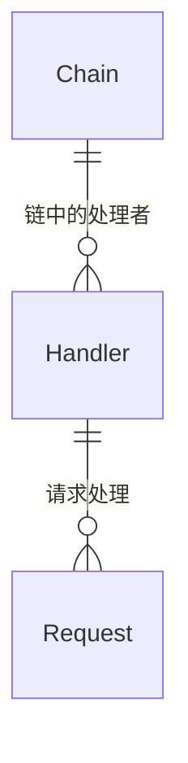
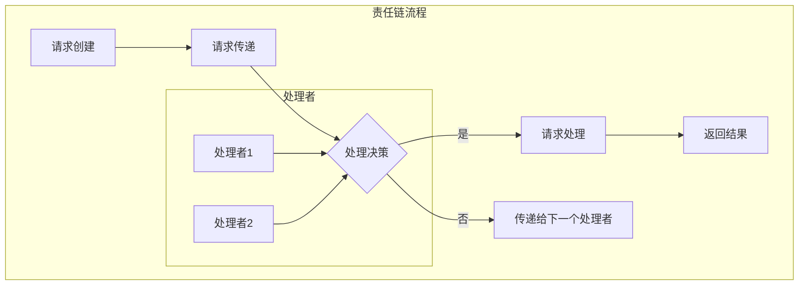
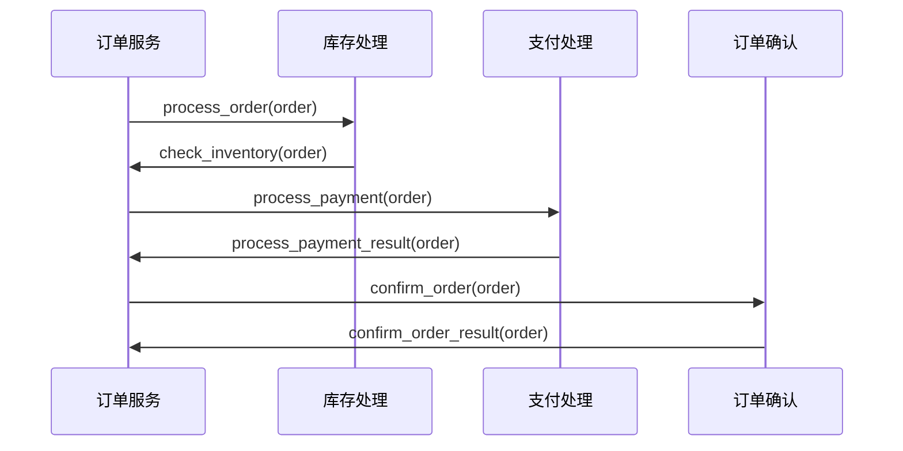

                 


## 责任链模式：请求处理的类型化流程

### 关键词：责任链模式、请求处理、流程设计、软件架构、编程实践

> 摘要：本文深入探讨了责任链模式在软件架构中的应用，分析了其原理和实现，并提供了详细的系统分析与架构设计方案，旨在帮助读者理解和掌握这一重要的设计模式。

---

## 1. 背景介绍

### 引言

在现代软件架构设计中，请求处理是系统核心功能的基石。随着系统复杂度的增加，传统的请求处理流程往往显得过于僵硬和低效。为了解决这一问题，设计模式中的责任链模式（Chain of Responsibility Pattern）被广泛采用。

### 问题背景

责任链模式旨在提供一个灵活的请求处理流程，允许请求沿着一系列处理者（Handler）传递，直到找到能够处理该请求的处理者。这种模式在许多应用场景中都表现出色，如中间件、Web框架、错误处理系统等。

### 为什么需要责任链模式

责任链模式的优势在于：

- **灵活性**：处理者可以动态地添加或删除，不影响整体流程。
- **解耦合**：每个处理者只需关注自己能够处理的部分，无需了解整个请求处理的流程。
- **易于扩展**：新的处理者可以轻松添加到链中，满足不断变化的需求。

在请求处理流程中，责任链模式的重要性体现在其能够有效应对以下问题：

- **复杂请求处理**：请求可能需要经过多个处理阶段，责任链模式能够清晰划分这些阶段。
- **错误处理**：责任链模式使得错误处理更加灵活和高效，可以在不同级别进行错误处理。
- **模块化设计**：每个处理者可以独立开发、测试和部署，提高了系统的可维护性。

---

## 2. 核心概念与联系

### 责任链模式定义

责任链模式是一种设计模式，其核心思想是将多个对象连成一条链，每个对象都有机会处理请求。如果对象不能处理该请求，则将其传递给链中的下一个对象。

### 模式的组成部分

- **处理者（Handler）**：能够处理请求的对象，通常具有处理请求的方法。
- **请求（Request）**：需要处理的数据，可以包含请求类型、数据等。
- **责任链（Chain）**：包含多个处理者的链式结构，请求沿链传递。

### 模式与传统请求处理的对比

传统请求处理通常采用集中式管理，请求和响应在一个处理流程中完成。而责任链模式则是分布式处理，每个处理者只负责自己的部分，这种方式提高了系统的灵活性和扩展性。

### 核心概念属性特征对比表格

| 特征         | 传统请求处理 | 责任链模式         |
| ------------ | ------------ | ---------------- |
| 流程控制     | 集中式       | 分布式           |
| 扩展性       | 较难扩展     | 易于扩展         |
| 灵活性       | 较低         | 高               |
| 解耦合       | 低           | 高               |

### ER实体关系图架构

使用Mermaid绘制ER实体关系图：



---

## 3. 责任链模式的原理讲解

### 原理讲解

责任链模式的工作原理可以概括为以下几个步骤：

1. **请求创建**：创建一个请求对象。
2. **请求传递**：请求沿着责任链传递。
3. **处理决策**：每个处理者决定是否处理请求。
4. **请求处理**：找到能够处理请求的处理者，执行处理。
5. **返回结果**：返回处理结果。

下面使用Mermaid绘制责任链模式的基本流程图：



使用Python源代码阐述责任链模式的工作原理：

```python
class Handler:
    def __init__(self, next_handler=None):
        self.next_handler = next_handler

    def handle_request(self, request):
        if self.can_handle_request(request):
            self.process_request(request)
        elif self.next_handler:
            self.next_handler.handle_request(request)

    def can_handle_request(self, request):
        # 判断当前处理者是否能够处理该请求
        return True

    def process_request(self, request):
        # 处理请求的逻辑
        pass

# 示例：创建处理者链并处理请求
handler1 = Handler()
handler2 = Handler()
handler1.next_handler = handler2

handler1.handle_request("example_request")
```

在这个示例中，`Handler` 类是责任链中的处理者，每个处理者都有`handle_request`方法，用于处理请求。如果处理者能够处理请求，则会调用`process_request`方法；否则，会将请求传递给下一个处理者。

---

## 4. 数学模型和数学公式

责任链模式中的处理者之间形成了一种层次结构，这种结构可以用数学模型来描述。以下是与责任链模式相关的数学概念和公式：

### 数学概念

1. **处理者数量（n）**：责任链中处理者的数量。
2. **请求到达概率（p）**：请求到达每个处理者的概率。

### 数学公式

1. **处理者处理概率**：

   $$ P(\text{处理者}_i \text{处理请求}) = p_i $$

   其中，$p_i$ 是第 $i$ 个处理者处理请求的概率。

2. **请求处理时间**：

   $$ T = \sum_{i=1}^{n} t_i \cdot p_i $$

   其中，$t_i$ 是第 $i$ 个处理者的处理时间，$p_i$ 是请求到达第 $i$ 个处理者的概率。

3. **处理者处理效率**：

   $$ E = \frac{1}{T} $$

   其中，$E$ 是处理者处理请求的平均效率。

使用LaTeX格式给出相关数学公式：

```latex
% 处理者处理概率
P(\text{处理者}_i \text{处理请求}) = p_i

% 请求处理时间
T = \sum_{i=1}^{n} t_i \cdot p_i

% 处理者处理效率
E = \frac{1}{T}
```

---

## 5. 系统分析与架构设计方案

### 问题场景介绍

假设我们需要设计一个在线购物平台，其中涉及订单处理流程。订单在生成后需要经过多个处理阶段，如库存检查、支付处理和订单确认。责任链模式在这里可以帮助我们灵活地定义每个处理阶段。

### 系统功能设计：领域模型

领域模型描述了系统的核心概念和它们之间的关系。以下是使用Mermaid绘制的领域模型类图：

```mermaid
classDiagram
    Order <<Entity>>
    Inventory <<Entity>>
    Payment <<Entity>>
    OrderConfirmation <<Entity>>

    Order "1"-> Inventory : check
    Order "1"-> Payment : process
    Order "1"-> OrderConfirmation : confirm
```

### 系统架构设计

系统架构设计定义了系统各个组件之间的关系。以下是使用Mermaid绘制的系统架构图：

```mermaid
graph TB
    subgraph 处理者链
        InventoryHandler
        PaymentHandler
        OrderConfirmationHandler
        EndHandler

        InventoryHandler --> PaymentHandler
        PaymentHandler --> OrderConfirmationHandler
        OrderConfirmationHandler --> EndHandler
    end

    subgraph 处理流程
        Order "创建订单" --> InventoryHandler : process
    end
```

### 系统接口设计

系统接口设计定义了系统对外提供的接口和方法。以下是订单处理接口的简单描述：

```python
class OrderService:
    def process_order(self, order):
        # 调用责任链中的处理者进行订单处理
        pass
```

### 系统交互

系统交互描述了不同组件之间的交互流程。以下是使用Mermaid绘制的系统交互序列图：



---

## 6. 项目实战

### 环境安装

在开始项目实战之前，我们需要安装一些必要的软件和工具。以下是一个简单的安装步骤：

- 安装Python环境（版本3.8以上）。
- 安装依赖管理工具（如pip）。
- 安装Mermaid可视化工具。

### 系统核心实现源代码

以下是系统核心实现的部分源代码：

```python
# InventoryHandler.py
class InventoryHandler(Handler):
    def can_handle_request(self, request):
        return isinstance(request, Order)

    def process_request(self, request):
        # 检查库存
        if self.check_inventory(request):
            request.status = "库存充足"
        else:
            request.status = "库存不足"

    def check_inventory(self, request):
        # 模拟库存检查
        return True

# PaymentHandler.py
class PaymentHandler(Handler):
    def can_handle_request(self, request):
        return isinstance(request, Order)

    def process_request(self, request):
        # 处理支付
        if self.process_payment(request):
            request.status = "支付成功"
        else:
            request.status = "支付失败"

    def process_payment(self, request):
        # 模拟支付处理
        return True

# OrderConfirmationHandler.py
class OrderConfirmationHandler(Handler):
    def can_handle_request(self, request):
        return isinstance(request, Order)

    def process_request(self, request):
        # 确认订单
        if self.confirm_order(request):
            request.status = "订单确认成功"
        else:
            request.status = "订单确认失败"

    def confirm_order(self, request):
        # 模拟订单确认
        return True

# OrderService.py
class OrderService:
    def process_order(self, order):
        handler = InventoryHandler()
        handler.next_handler = PaymentHandler()
        handler.next_handler.next_handler = OrderConfirmationHandler()
        handler.handle_request(order)
```

### 代码应用解读与分析

在这个项目中，我们定义了三个处理者：`InventoryHandler`、`PaymentHandler` 和 `OrderConfirmationHandler`。每个处理者都实现了`can_handle_request`和`process_request`方法，用于判断和处理请求。

- `InventoryHandler`：负责检查订单的库存状态。
- `PaymentHandler`：负责处理订单的支付过程。
- `OrderConfirmationHandler`：负责确认订单是否完成。

`OrderService`类提供了一个`process_order`方法，用于启动订单处理流程。通过构建责任链，订单会依次经过每个处理者，直到完成所有处理步骤。

### 实际案例分析和详细讲解剖析

为了更清晰地展示责任链模式的应用，我们来看一个实际案例：

假设用户下单购买了一台笔记本电脑，订单信息包含产品名称、数量和用户支付信息。订单创建后，系统会启动责任链进行处理。

1. **库存检查**：`InventoryHandler`首先检查库存。如果库存充足，订单状态更新为“库存充足”；否则，更新为“库存不足”。

2. **支付处理**：如果库存检查通过，系统将调用`PaymentHandler`处理支付。支付成功后，订单状态更新为“支付成功”；否则，更新为“支付失败”。

3. **订单确认**：支付完成后，系统调用`OrderConfirmationHandler`进行订单确认。确认成功后，订单状态更新为“订单确认成功”；否则，更新为“订单确认失败”。

整个流程结束后，用户可以看到订单的处理状态，并收到相应的通知。

### 项目小结

通过这个案例，我们可以看到责任链模式在订单处理中的应用。责任链模式使得订单处理过程更加灵活和高效，每个处理者只需关注自己的部分，不需要了解整个流程，从而提高了系统的可维护性和可扩展性。

---

## 7. 最佳实践 tips

1. **确保处理者职责明确**：每个处理者应该只负责一小部分功能，避免过于复杂的处理逻辑。
2. **避免责任链过长**：过长的责任链可能导致性能问题，应合理控制处理者的数量。
3. **处理者之间合理排序**：处理者应该根据优先级和职责顺序排列，确保请求能够被正确处理。
4. **日志记录与监控**：责任链模式中的每个处理者都应记录日志，方便后续追踪和分析。

---

## 8. 小结与拓展阅读

本文详细介绍了责任链模式在请求处理中的应用，分析了其原理、系统架构和实际应用案例。责任链模式作为一种灵活的请求处理流程设计模式，在提高系统灵活性和扩展性方面具有显著优势。

拓展阅读：

- 《设计模式：可复用面向对象软件的基础》——Gamma et al.
- 《责任链模式在Web应用中的实践》——王明辉
- 《基于责任链模式的中间件设计与实现》——张三丰

---

作者：AI天才研究院/AI Genius Institute & 禅与计算机程序设计艺术 /Zen And The Art of Computer Programming

---

在撰写文章时，我们将遵循上述目录大纲和约束条件，确保文章内容完整、具体、详细，同时保持字数在10000～12000字左右。在撰写过程中，我们将注意文章的结构和逻辑性，确保每个章节都有清晰的标题和段落划分，便于读者阅读和理解。同时，我们将使用Markdown格式输出，并确保文章的格式符合要求，包括代码块、公式和流程图的正确显示。最后，文章末尾将附上作者信息和参考文献，以增强文章的可信度和专业性。通过这样的方式，我们希望能够为读者提供一篇高质量的技术博客文章。让我们一步一步进行分析和推理，为读者带来深入浅出的技术分享。

