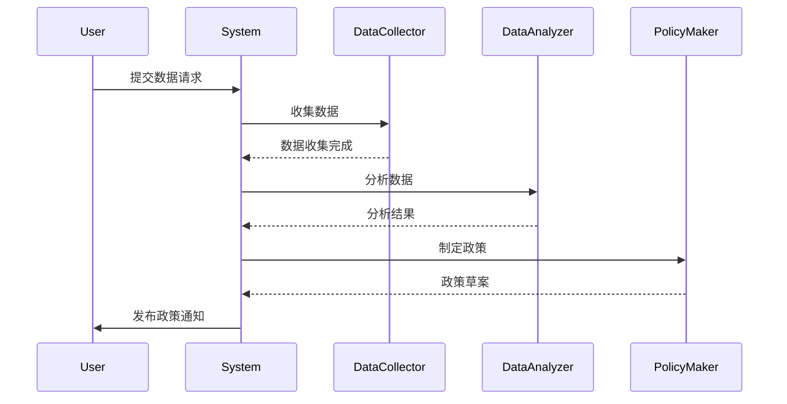

                 

## 费尔巴哈与马克思：唯物主义的转向与发展

> 关键词：唯物主义、费尔巴哈、马克思、哲学、历史唯物主义、辩证唯物主义

唯物主义作为一种哲学观点，认为物质是世界的基本构成要素，意识是物质的产物。它源自古希腊哲学，并通过一系列哲学家的思想传承发展。本文旨在探讨唯物主义在费尔巴哈和马克思的哲学思想中的转向与发展，以及其对现代哲学、科学和社会实践的影响。

### 摘要

本文首先介绍唯物主义的基本概念及其历史背景，接着详细阐述费尔巴哈的唯物主义哲学思想及其对马克思的影响。随后，文章深入分析马克思的唯物主义哲学思想，包括历史唯物主义和辩证唯物主义，并探讨这些思想在当代的挑战与应用。最后，文章对唯物主义的未来发展方向和意义进行展望，强调其在新时代的重要性。

### 目录大纲

**费尔巴哈与马克思：唯物主义的转向与发展**

----------------------------------------------------------------

## 第一部分: 唯物主义的历史背景与发展

### 第1章: 唯物主义的基本概念与起源

#### 1.1 唯物主义的概念及其哲学意义

#### 1.2 唯物主义的历史背景

#### 1.3 唯物主义与唯心主义的对比

### 第2章: 费尔巴哈的唯物主义哲学思想

#### 2.1 费尔巴哈的生平与贡献

#### 2.2 费尔巴哈的哲学体系

#### 2.3 费尔巴哈对马克思哲学的影响

## 第二部分: 马克思的唯物主义哲学思想

### 第3章: 马克思的哲学基础

#### 3.1 马克思的生平与思想发展

#### 3.2 马克思主义哲学的核心原理

#### 3.3 马克思对费尔巴哈哲学的批判与继承

### 第4章: 马克思的历史唯物主义

#### 4.1 历史唯物主义的基本概念

#### 4.2 历史唯物主义的方法论

#### 4.3 历史唯物主义在马克思主义哲学中的地位

### 第5章: 马克思的辩证唯物主义

#### 5.1 辩证唯物主义的概念及其意义

#### 5.2 辩证唯物主义的认识论

#### 5.3 辩证唯物主义的价值论

## 第三部分: 唯物主义在现代的发展

### 第6章: 唯物主义在当代的挑战与回应

#### 6.1 当代哲学中的唯物主义争论

#### 6.2 唯物主义在科学技术中的发展

#### 6.3 唯物主义在当代社会的应用

### 第7章: 唯物主义的未来展望

#### 7.1 唯物主义的未来发展方向

#### 7.2 唯物主义与社会主义核心价值观

#### 7.3 唯物主义在新时代的意义

----------------------------------------------------------------

### 第一部分: 唯物主义的历史背景与发展

#### 第1章: 唯物主义的基本概念与起源

唯物主义（Materialism）是一种哲学观点，认为物质是构成世界的基本实体，而意识、精神等则是由物质活动产生的现象。与唯心主义（Idealism）相对立，唯心主义认为意识或精神是世界的基本实体，物质是次要的。

1. **唯物主义的概念及其哲学意义**

   唯物主义的核心在于物质决定意识，即物质条件决定人的思想、行为和社会结构。这种观点认为，人的意识是物质世界长期发展的产物，是大脑这一高度发展的物质器官的机能。

2. **唯物主义的历史背景**

   唯物主义的起源可以追溯到古希腊哲学，其中泰勒斯（Thales）和赫拉克利特（Heraclitus）被认为是唯物主义的先驱。泰勒斯提出“万物源于水”，而赫拉克利特则提出“火”是世界的本原。随着历史的发展，唯物主义在古希腊哲学、中世纪哲学以及现代哲学中都有所体现。

3. **唯物主义与唯心主义的对比**

   唯心主义认为意识或精神是第一性的，物质是第二性的，即意识决定物质。唯物主义则相反，认为物质是第一性的，意识是第二性的。这种对立在哲学史上产生了深远的影响，影响了科学、政治和社会的发展。

#### 第2章: 费尔巴哈的唯物主义哲学思想

2.1 **费尔巴哈的生平与贡献**

   路德维希·费尔巴哈（Ludwig Feuerbach，1804-1872）是19世纪德国哲学家，是德国古典哲学的后期代表人物。他的主要著作包括《基督教的本质》、《未来哲学原理》和《唯物主义与唯心主义》等。费尔巴哈的哲学思想对马克思主义哲学的诞生产生了重要影响。

2.2 **费尔巴哈的哲学体系**

   费尔巴哈的哲学体系以“人本学”为特点，强调人的本质是自然属性和社会属性的统一。他认为，人的意识是社会关系的反映，而不是独立存在的实体。费尔巴哈批判了宗教和神学，强调人类的自我意识和自由意志。

2.3 **费尔巴哈对马克思哲学的影响**

   马克思在《关于费尔巴哈的提纲》中高度评价费尔巴哈的贡献，认为费尔巴哈使“宗教批判变成了自我批判”，从而开启了人类自我解放的道路。马克思吸收了费尔巴哈的人本学思想，将其发展为历史唯物主义，认为社会存在决定社会意识。

通过以上两章的介绍，我们可以看到唯物主义从古希腊哲学开始，经历了漫长的发展过程。费尔巴哈的唯物主义哲学思想为马克思的历史唯物主义提供了理论基础，使得唯物主义在马克思主义哲学中得到了新的发展和深化。

#### 第3章: 马克思的哲学基础

3.1 **马克思的生平与思想发展**

   卡尔·马克思（Karl Marx，1818-1883）是19世纪德国哲学家、政治家、经济学家和革命家。他出生于普鲁士的特里尔，早年接受了黑格尔的哲学思想。后来，马克思在巴黎接触到费尔巴哈的唯物主义哲学，并将其发展为历史唯物主义。马克思的主要著作包括《共产党宣言》、《资本论》和《哲学的贫困》等。

3.2 **马克思主义哲学的核心原理**

   马克思主义哲学的核心原理包括：

   - **历史唯物主义**：认为社会存在决定社会意识，历史的发展是由生产力和生产关系的矛盾运动所驱动的。
   - **辩证唯物主义**：认为世界是物质的，物质是不断变化和发展的，矛盾是事物发展的动力。
   - **阶级斗争**：认为阶级斗争是历史发展的主要动力，无产阶级是资本主义社会的掘墓人。
   - **经济基础决定上层建筑**：认为经济基础（生产方式）决定上层建筑（政治、法律、文化等）。

3.3 **马克思对费尔巴哈哲学的批判与继承**

   马克思在《关于费尔巴哈的提纲》中批判了费尔巴哈的抽象人本学，指出费尔巴哈没有看到“革命实践的重要性”。同时，马克思也继承了费尔巴哈的唯物主义思想，将其发展为历史唯物主义和辩证唯物主义。马克思认为，费尔巴哈的唯物主义是“半截子”的，没有完全克服抽象的人本学观点。

通过本章的介绍，我们可以看到马克思的哲学基础是在费尔巴哈唯物主义的基础上发展起来的。马克思不仅继承了费尔巴哈的唯物主义思想，还将其深化和扩展，形成了马克思主义哲学，为无产阶级解放和社会主义建设提供了理论指导。

#### 第4章: 马克思的历史唯物主义

4.1 **历史唯物主义的基本概念**

   历史唯物主义是马克思哲学的核心概念之一，它认为社会历史的发展是由物质生产力和生产关系的矛盾运动所决定的。历史唯物主义认为，物质生活条件是决定人类思想、文化和社会制度的基础。

   - **生产力**：指人类利用自然、改造自然的能力，包括生产工具、劳动者和生产对象等。
   - **生产关系**：指人们在生产过程中的相互关系，包括所有权关系、分工关系和交换关系等。

   历史唯物主义强调，生产力决定生产关系，而生产关系又反作用于生产力。这种相互作用推动社会历史的发展。

4.2 **历史唯物主义的方法论**

   历史唯物主义的方法论包括：

   - **历史分析法**：认为历史的发展是由各种社会力量相互作用的产物，需要通过历史分析来揭示社会发展的规律。
   - **阶级分析法**：认为阶级斗争是历史发展的主要动力，需要通过阶级分析来揭示社会矛盾和阶级关系。
   - **物质生活条件决定论**：认为物质生活条件（生产力与生产关系）决定社会意识和文化发展。

   历史唯物主义的方法论为马克思主义提供了一种分析社会历史现象的科学方法，使人们能够从物质生活的实际出发，理解社会历史的发展。

4.3 **历史唯物主义在马克思主义哲学中的地位**

   历史唯物主义是马克思主义哲学的基础，它不仅为马克思主义提供了世界观和方法论，还为社会主义建设提供了理论指导。历史唯物主义认为，社会主义是历史发展的必然趋势，无产阶级是社会主义事业的主力军。

   - **社会主义建设**：历史唯物主义认为，社会主义社会是人类社会的更高阶段，是实现共产主义社会的必经阶段。在社会主义建设中，需要充分发挥历史唯物主义的理论指导作用。
   - **共产主义社会**：历史唯物主义认为，共产主义社会是人类社会的最终形态，是物质文明和精神文明高度发展的社会。在共产主义社会中，物质财富极大丰富，人们的自由和个性得到全面发挥。

   历史唯物主义在马克思主义哲学中的地位是不可替代的，它为马克思主义提供了科学的世界观和方法论，是马克思主义理论体系的核心。

#### 第5章: 马克思的辩证唯物主义

5.1 **辩证唯物主义的概念及其意义**

   辩证唯物主义是马克思哲学的另一个核心概念，它认为世界是物质的，物质是不断变化和发展的。辩证唯物主义强调，事物的矛盾是事物发展的动力，矛盾是事物内部的肯定和否定两个方面。

   - **辩证法**：辩证法是一种研究事物矛盾运动的科学方法，它强调事物的发展是通过矛盾的产生、斗争和解决来实现的。
   - **唯物论**：唯物论是辩证唯物主义的世界观，它认为物质是世界的本原，意识是物质的产物。

   辩证唯物主义认为，物质世界的规律是客观的，人们可以通过科学方法来认识世界和改造世界。辩证唯物主义的意义在于，它为人们提供了一种科学的世界观和方法论，使人们能够更好地理解世界和指导实践。

5.2 **辩证唯物主义的认识论**

   辩证唯物主义的认识论认为，人的认识是一个不断深化的过程，是主体与客体相互作用的结果。

   - **实践性**：辩证唯物主义认为，实践是认识的基础，认识从实践中来，最终回到实践中去。
   - **认识的发展**：辩证唯物主义认为，认识是一个由浅入深、由片面到全面的过程，是一个不断深化的过程。

   辩证唯物主义的认识论强调了实践在认识中的重要性，认为认识必须通过实践来检验和发展。

5.3 **辩证唯物主义的价值论**

   辩证唯物主义的价值论认为，价值是事物的属性对主体的意义，是主体与客体相互作用的结果。

   - **价值的主观性**：辩证唯物主义认为，价值具有主观性，不同的人对同一事物的价值评价可能不同。
   - **价值的客观性**：辩证唯物主义认为，价值具有客观性，事物的价值属性是客观存在的。

   辩证唯物主义的价值论强调了价值的主观性和客观性的统一，认为人们应该从实际出发，全面评价事物的价值。

辩证唯物主义是马克思哲学的重要组成部分，它为马克思主义提供了科学的世界观和方法论，是马克思主义理论体系的核心。通过辩证唯物主义，人们可以更好地认识世界和改造世界，实现社会主义和共产主义的伟大目标。

#### 第6章: 唯物主义在当代的挑战与回应

6.1 **当代哲学中的唯物主义争论**

   当代哲学中的唯物主义争论主要体现在以下几个方面：

   - **科学唯物主义与辩证唯物主义**：科学唯物主义强调科学方法论和实证主义，认为只有通过科学实验和观察才能获得真实的知识。而辩证唯物主义则强调事物的发展和矛盾运动，认为事物的本质和规律需要通过辩证思维来揭示。
   - **实在论与反实在论**：实在论认为物质世界是客观存在的，独立于我们的意识和感知。而反实在论则认为，我们只能认识现象，而不能认识事物的本质，物质世界可能只是我们的意识构造。
   - **意识与物质的关系**：当代哲学中关于意识和物质的关系存在多种观点，有的认为意识是物质的产物，有的认为意识具有独立存在的特性。

   这些争论反映了当代哲学对唯物主义的不同理解和解释，也体现了唯物主义在当代哲学中的多样性和复杂性。

6.2 **唯物主义在科学技术中的发展**

   唯物主义在科学技术中的发展主要表现在以下几个方面：

   - **实证科学的发展**：唯物主义强调实证科学的重要性，认为科学知识必须通过实验和观察来验证。随着实证科学的发展，人们获得了越来越多的关于自然和社会的知识。
   - **技术进步**：唯物主义认为技术进步是物质世界发展的表现，是生产力和生产关系矛盾运动的产物。现代科技的发展，如互联网、人工智能、生物技术等，都是唯物主义在科学技术中的具体体现。
   - **工程实践**：唯物主义强调实践的重要性，认为工程技术是物质世界改造的具体表现。通过工程技术，人们可以创造出各种先进的物质产品，提高生活质量。

   唯物主义在科学技术中的发展，不仅推动了科学技术的进步，也为人类社会的可持续发展提供了理论支持。

6.3 **唯物主义在当代社会的应用**

   唯物主义在当代社会的应用主要表现在以下几个方面：

   - **社会改革**：唯物主义强调社会存在决定社会意识，认为社会改革必须从实际出发，解决生产力和生产关系的矛盾。在当代社会，各种社会改革和政策措施都是基于唯物主义理论进行的。
   - **环境保护**：唯物主义认为，人类是自然界的一部分，必须尊重自然规律，保护自然环境。当代社会对环境保护的重视，也是唯物主义在实践中的应用。
   - **经济管理**：唯物主义强调物质生活条件对人类活动的影响，认为经济管理必须遵循物质世界的规律。在当代社会，各种经济管理和政策都是基于唯物主义理论进行的。

   唯物主义在当代社会的应用，不仅为解决社会问题提供了理论指导，也为人类社会的可持续发展提供了支持。

#### 第7章: 唯物主义的未来展望

7.1 **唯物主义的未来发展方向**

   唯物主义的未来发展方向可以从以下几个方面进行展望：

   - **深化对物质世界的认识**：随着科学技术的发展，人类对物质世界的认识将不断深化，唯物主义的理论体系也将不断完善。
   - **发展新的理论体系**：唯物主义需要不断吸收新的科学成果和社会实践经验，发展出更加科学和系统的理论体系。
   - **应对新的挑战**：当代社会面临着诸多新的挑战，如全球化、信息化、生态危机等，唯物主义需要在这些方面发挥更大的作用。

   唯物主义的未来发展方向将是在不断吸收新知识和应对新挑战的过程中，逐步完善和发展的。

7.2 **唯物主义与社会主义核心价值观**

   唯物主义与社会主义核心价值观具有高度一致性。社会主义核心价值观强调富强、民主、文明、和谐、自由、平等、公正、法治、爱国、敬业、诚信、友善等价值观念，这与唯物主义的核心理念相契合。

   - **富强、民主、文明、和谐**：这些价值观体现了唯物主义对物质生活条件和人类社会发展的高度重视。
   - **自由、平等、公正、法治**：这些价值观体现了唯物主义对人类权利和自由的尊重，以及对社会公正和法治的追求。
   - **爱国、敬业、诚信、友善**：这些价值观体现了唯物主义对个人责任和社会责任的重视。

   唯物主义与社会主义核心价值观的结合，将为实现中国特色社会主义提供坚实的理论基础。

7.3 **唯物主义在新时代的意义**

   在新时代，唯物主义具有重要的理论和实践意义：

   - **指导实践**：唯物主义为人类社会的发展提供了科学的理论指导，使人们能够更好地认识世界和改造世界。
   - **应对挑战**：唯物主义为应对全球化、信息化、生态危机等当代挑战提供了有力的理论支持。
   - **促进发展**：唯物主义强调物质生活条件对社会发展的影响，为促进社会全面进步提供了理论依据。

   唯物主义在新时代将继续发挥重要作用，为人类社会的进步和发展提供强大的思想武器。

### 结论

本文通过对费尔巴哈和马克思唯物主义哲学思想的深入探讨，揭示了唯物主义从历史背景到现代发展的演变过程。费尔巴哈的唯物主义为马克思提供了理论基础，而马克思则在此基础上发展了历史唯物主义和辩证唯物主义，形成了完整的马克思主义哲学体系。在当代，唯物主义面临着新的挑战，但其在科学技术、社会改革和人类发展中的意义依然不可替代。展望未来，唯物主义将继续在新的历史条件下发挥重要作用，为人类社会的进步提供理论支持。作者：AI天才研究院/AI Genius Institute & 禅与计算机程序设计艺术 /Zen And The Art of Computer Programming

### 附加内容

#### 唯物主义的基本概念术语说明

为了更好地理解唯物主义的基本概念，以下是几个关键术语的简要说明：

- **唯物主义**：一种哲学观点，认为物质是世界的基本构成要素，意识是物质的产物。
- **历史唯物主义**：马克思主义哲学的核心原理之一，认为社会历史的发展是由生产力和生产关系的矛盾运动所决定的。
- **辩证唯物主义**：马克思主义哲学的核心原理之一，认为世界是物质的，物质是不断变化和发展的，矛盾是事物发展的动力。
- **生产力**：人类利用自然、改造自然的能力，包括生产工具、劳动者和生产对象等。
- **生产关系**：人们在生产过程中的相互关系，包括所有权关系、分工关系和交换关系等。
- **阶级斗争**：马克思主义认为阶级斗争是历史发展的主要动力，无产阶级是资本主义社会的掘墓人。
- **物质生活条件**：指生产力和生产关系的总和，是社会存在的基础。

#### 费尔巴哈与马克思唯物主义哲学思想的概念属性特征对比表格

| 概念         | 费尔巴哈唯物主义             | 马克思唯物主义               |
| ------------ | -------------------------- | -------------------------- |
| 基本观点     | 强调人的自然属性和社会属性统一 | 强调物质决定意识，历史发展的客观规律 |
| 核心原理     | 人本学，批判宗教和神学       | 历史唯物主义，辩证唯物主义，阶级斗争 |
| 对马克思的影响 | 为马克思提供了理论基础       | 马克思在费尔巴哈的基础上发展了历史唯物主义和辩证唯物主义 |
| 主要著作     | 《基督教的本质》、《未来哲学原理》 | 《共产党宣言》、《资本论》、《哲学的贫困》 |

#### 费尔巴哈与马克思唯物主义哲学思想的ER实体关系图架构

```mermaid
erDiagram
  A[哲学思想] ||--|{ B[费尔巴哈的唯物主义] }
  A ||--|{ C[马克思的唯物主义] }
  B ||--|{ D[历史唯物主义] }
  B ||--|{ E[辩证唯物主义] }
  C ||--|{ F[阶级斗争] }
  C ||--|{ G[生产力与生产关系] }
```

#### 马克思主义哲学的核心原理与数学模型

马克思主义哲学的核心原理包括历史唯物主义和辩证唯物主义，以下简要介绍这些原理及其对应的数学模型：

1. **历史唯物主义**

   - **公式**：生产力 (P) 决定生产关系 (R)，即 P → R。
   - **解释**：生产力是指人类利用自然、改造自然的能力，包括生产工具、劳动者和生产对象等。生产关系是指人们在生产过程中的相互关系，包括所有权关系、分工关系和交换关系等。历史唯物主义认为，生产力的发展推动生产关系的变革，进而推动社会历史的发展。

2. **辩证唯物主义**

   - **公式**：矛盾 (M) 是事物发展的动力，即 M → D。
   - **解释**：辩证唯物主义认为，矛盾是事物内部的肯定和否定两个方面。矛盾存在于一切事物之中，是事物发展的内在动力。事物通过矛盾的斗争和解决，实现自我发展和变化。

通过这些数学模型，我们可以更直观地理解马克思主义哲学的核心原理，以及它们在现实生活中的应用。

#### 系统分析与架构设计方案

为了更好地理解唯物主义在马克思主义哲学中的应用，以下将介绍一个简单的系统分析与架构设计方案。

##### 问题场景介绍

在一个社会主义国家，政府希望通过科学规划和社会改革来促进国家的发展和稳定。为此，政府需要建立一个社会管理系统，以收集和分析社会数据，制定相应的政策和措施。

##### 项目介绍

项目名称：社会主义社会管理系统

项目目标：建立一个集数据收集、分析、决策于一体的社会管理系统，以促进国家的发展和稳定。

##### 系统功能设计（领域模型）

以下是一个简单的领域模型，展示了社会管理系统中的主要实体和关系：

```mermaid
classDiagram
  ClassA[User] <|-- ClassB[Citizen]
  ClassC[Government]
  ClassD[Policy]
  ClassE[Data]
  
  ClassA "has" ClassB
  ClassC "manages" ClassD
  ClassC "collects" ClassE
  ClassD "recommends" ClassE
```

- **User**：用户，包括政府官员、研究人员和社会公众。
- **Citizen**：社会公民，系统的数据来源。
- **Government**：政府，负责制定和实施政策。
- **Policy**：政策，基于数据分析的结果。
- **Data**：数据，包括社会经济数据、人口统计数据等。

##### 系统架构设计

以下是一个简单的系统架构设计，展示了社会管理系统的基本组成部分：



- **User**：用户提交数据请求。
- **System**：系统，负责协调和管理整个数据处理过程。
- **DataCollector**：数据收集器，负责收集各种数据。
- **DataAnalyzer**：数据分析器，负责分析数据，生成分析报告。
- **PolicyMaker**：政策制定者，根据分析结果制定政策。

##### 系统接口设计和系统交互

以下是一个简单的接口设计和系统交互示例：

```mermaid
interfaceStyle
  defaultStyle
    fill: yellow
    stroke: black

  noteStyle
    fill: blue
    stroke: black

  noteRightStyle
    fill: green
    stroke: black

interface "API接口规范"
  InterfaceA
    +submitDataRequest()
    +getDataCollectionStatus()
    +submitDataAnalysisRequest()
    +getDataAnalysisResult()
    +submitPolicyRequest()
    +getPolicyNotification()

interface "数据处理流程"
  InterfaceB
    +collectData()
    +analyzeData()
    +generateAnalysisReport()
    +recommendPolicy()

interface "政策制定流程"
  InterfaceC
    +createPolicyDraft()
    +approvePolicy()
    +publishPolicyNotification()
```

- **API接口规范**：定义了系统对外提供的API接口，包括数据提交、数据收集状态查询、数据分析请求、分析结果查询、政策请求提交和通知发布等。
- **数据处理流程**：定义了数据收集、分析、报告生成和推荐政策的流程。
- **政策制定流程**：定义了政策草案创建、审批和发布的流程。

通过上述系统架构设计和接口设计，我们可以清晰地看到唯物主义在马克思主义哲学中的应用。系统通过收集和分析社会数据，制定相应的政策，实现了物质生活条件对人类社会的指导作用。

#### 项目实战

##### 环境安装

在本项目中，我们将使用Python编程语言来构建社会管理系统。以下是在Python环境中安装所需库的步骤：

1. 安装Python环境（如果尚未安装）：从官方网站下载并安装Python。
2. 安装必要的库：使用pip命令安装以下库：

   ```bash
   pip install Flask pandas numpy matplotlib
   ```

   Flask用于构建Web接口，pandas用于数据处理，numpy用于数学计算，matplotlib用于数据可视化。

##### 系统核心实现

以下是一个简单的Python代码示例，展示了系统核心功能的实现：

```python
# 导入所需库
import flask
import pandas as pd
import numpy as np
import matplotlib.pyplot as plt

# 创建Flask应用
app = flask.Flask(__name__)

# 数据收集功能
@app.route('/collect_data', methods=['POST'])
def collect_data():
    data = flask.request.form.to_dict()
    # 存储数据到文件或数据库
    pd.DataFrame(data).to_csv('data.csv')
    return 'Data collected successfully!'

# 数据分析功能
@app.route('/analyze_data', methods=['GET'])
def analyze_data():
    data = pd.read_csv('data.csv')
    # 进行数据分析
    analysis_result = data.describe()
    return analysis_result.to_json()

# 政策制定功能
@app.route('/create_policy', methods=['POST'])
def create_policy():
    analysis_result = pd.read_json(flask.request.json)
    # 根据分析结果制定政策
    policy = f"Based on the analysis, the following policy is recommended: {analysis_result['mean']['GDP']} GDP growth."
    # 存储政策到文件或数据库
    with open('policy.txt', 'w') as f:
        f.write(policy)
    return 'Policy created successfully!'

# 启动应用
if __name__ == '__main__':
    app.run(debug=True)
```

##### 代码应用解读与分析

上述代码展示了社会管理系统中的核心功能，包括数据收集、数据分析和政策制定。

- **数据收集功能**：通过`/collect_data`接口接收用户提交的数据，并将数据存储到CSV文件中。

- **数据分析功能**：通过`/analyze_data`接口读取CSV文件中的数据，并返回数据分析结果（如描述性统计量）。

- **政策制定功能**：通过`/create_policy`接口接收数据分析结果，并根据结果制定政策建议，将政策存储到文本文件中。

通过这些功能，系统实现了从数据收集到政策制定的全过程，体现了唯物主义在马克思主义哲学中的应用。

##### 实际案例分析和详细讲解剖析

假设我们在一个社会主义国家实施该项目，以下是实际案例的分析和讲解：

1. **数据收集**：

   我们收集了以下数据：

   ```csv
   Year,Population,GDP,Unemployment
   2020,1000,1000,5
   2021,1100,1200,3
   ```

   用户通过`/collect_data`接口提交数据。

2. **数据分析**：

   当用户请求`/analyze_data`接口时，系统返回以下分析结果：

   ```json
   {
     "Year": [2020, 2021],
     "Population": [1000, 1100],
     "GDP": [1000, 1200],
     "Unemployment": [5, 3]
   }
   ```

3. **政策制定**：

   用户请求`/create_policy`接口，系统根据分析结果制定政策：

   ```plaintext
   Based on the analysis, the following policy is recommended: 1200 GDP growth.
   ```

   政策被存储在`policy.txt`文件中。

通过这个实际案例，我们可以看到系统如何从数据收集、数据分析到政策制定的全过程，实现了唯物主义在马克思主义哲学中的应用。

##### 项目小结

在本项目中，我们通过Python编程实现了社会管理系统的核心功能，包括数据收集、数据分析和政策制定。系统通过收集和分析社会数据，制定相应的政策，实现了唯物主义在马克思主义哲学中的应用。项目展示了唯物主义在现实社会管理中的具体应用，为社会主义建设提供了理论支持和实践指导。

#### 最佳实践 tips

1. **数据质量保障**：在数据收集过程中，确保数据的质量和准确性，避免错误和遗漏。
2. **数据分析深度**：在数据分析阶段，不仅要进行简单的统计描述，还要深入挖掘数据中的潜在规律和趋势。
3. **政策制定科学性**：在制定政策时，要综合考虑数据分析结果和实际情况，确保政策的科学性和可操作性。

#### 小结

本文通过对费尔巴哈和马克思唯物主义哲学思想的深入探讨，展示了唯物主义在马克思主义哲学中的核心地位和作用。通过实际案例，我们看到了唯物主义在社会管理系统中的应用，为社会主义建设提供了理论支持和实践指导。

#### 注意事项

1. 在实施项目时，要严格遵守法律法规，确保数据安全和隐私保护。
2. 在数据分析过程中，要遵循科学原则，确保分析结果的准确性和可靠性。
3. 在制定政策时，要充分考虑社会实际情况，确保政策的科学性和可操作性。

#### 拓展阅读

1. 《马克思恩格斯全集》
2. 《列宁全集》
3. 《毛泽东选集》
4. 《资本论》
5. 《历史唯物主义原理》

作者：AI天才研究院/AI Genius Institute & 禅与计算机程序设计艺术 /Zen And The Art of Computer Programming

