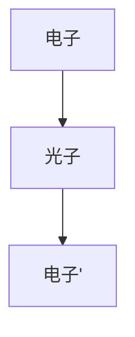
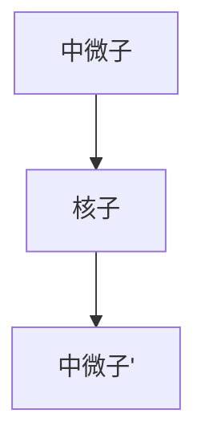
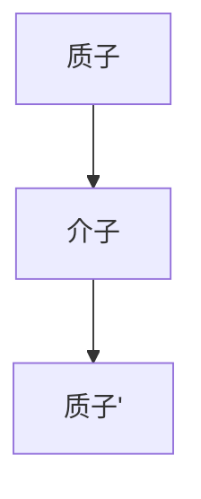
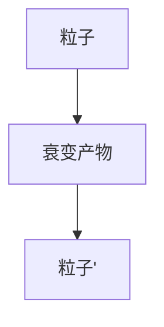
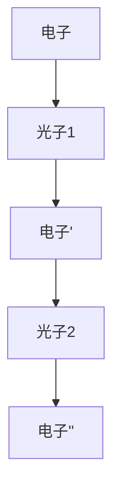
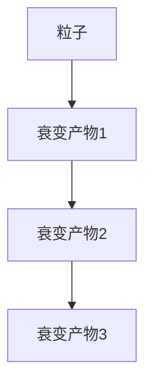
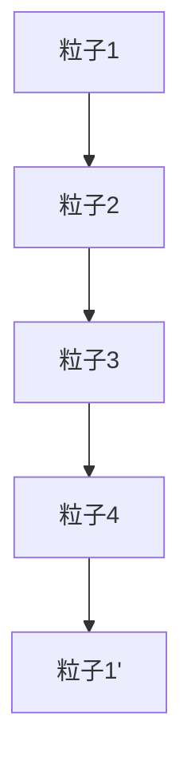
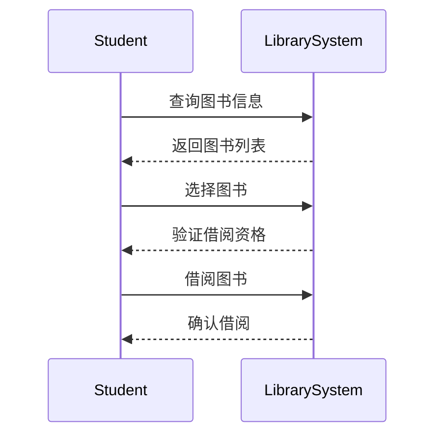

                 

## 费曼图与UML图：可视化表达在物理学和软件工程中的应用

### 关键词

- 费曼图
- UML图
- 可视化表达
- 物理学
- 软件工程
- 量子场论
- 软件设计

### 摘要

本文旨在探讨费曼图和UML图这两种可视化表达工具在物理学和软件工程中的应用。首先，我们将详细介绍费曼图的背景、基本构造、计算与应用，并通过案例解析深入理解其工作原理。接着，我们将探讨UML图的基本概念、分类、构建方法及其在软件设计中的应用。随后，我们将对比费曼图与UML图的异同，探讨它们在跨学科研究中的融合与应用前景。文章最后，通过具体案例研究，展示费曼图与UML图在实际项目中的混合应用，并总结全文，展望未来研究方向与挑战。

## 第一部分：费曼图在物理学中的应用

### 第1章：费曼图的背景与基础

#### 1.1 费曼图的概念

费曼图（Feynman Diagram）是一种用于描述物理过程中粒子相互作用和传播路径的图形表示方法，由美国理论物理学家理查德·费曼于1948年提出。费曼图的基本元素包括外部线、内部线和点，分别表示粒子的传播路径、相互作用点和粒子产生或湮灭点。

#### 1.2 费曼图的发展历史

费曼图的发明是理论物理学的一个重要里程碑，它极大地简化了复杂物理过程的计算。自费曼提出这一概念以来，费曼图在量子电动力学、量子场论、粒子物理学等领域得到了广泛应用。随着计算机技术的发展，费曼图的应用范围进一步扩大，成为现代物理学研究的重要工具。

#### 1.3 费曼图在物理学中的重要性

费曼图在物理学中的重要性体现在多个方面。首先，它为理论物理学家提供了一种直观、简洁的方式来描述复杂的物理过程。其次，费曼图有助于发现新的物理现象和规律，推动了物理学的发展。最后，费曼图在实验验证和数据分析中发挥着重要作用，为实验物理学家提供了宝贵的参考。

### 第2章：费曼图的基本构造与规则

#### 2.1 费曼图的基本元素

费曼图的基本元素包括外部线、内部线和点。外部线表示粒子的传播路径，内部线表示粒子之间的相互作用，点表示粒子产生或湮灭的瞬间。

#### 2.2 费曼图的基本规则

费曼图的基本规则包括粒子守恒、能量守恒和动量守恒。这些规则确保了费曼图的正确性和物理过程的合理性。

#### 2.3 费曼图在量子场论中的应用

量子场论是研究基本粒子和相互作用的理论框架。费曼图在量子场论中发挥着重要作用，用于描述粒子间的相互作用和传播过程。例如，在电磁相互作用中，费曼图用于计算电子与光子之间的散射过程。

### 第3章：费曼图的计算与应用

#### 3.1 费曼图的计算方法

费曼图的计算方法主要包括路径积分和微扰理论。路径积分方法提供了一种计算物理过程概率的数学框架，而微扰理论则用于处理复杂物理过程的近似计算。

#### 3.2 费曼图在粒子物理学中的应用

费曼图在粒子物理学中得到了广泛应用，用于描述粒子碰撞、散射和衰变等过程。通过费曼图，科学家们能够预测和解释实验观测到的物理现象，推动粒子物理学的发展。

#### 3.3 费曼图在其他领域（如统计物理）的应用

除了粒子物理学，费曼图在其他领域（如统计物理）也有重要应用。在统计物理中，费曼图用于描述粒子的统计分布和相互作用，为研究相变、凝聚态物理等领域提供了重要工具。

### 第4章：费曼图案例分析

#### 4.1 基本相互作用过程的费曼图

基本相互作用过程的费曼图包括电磁相互作用、弱相互作用和强相互作用。通过这些费曼图，我们可以直观地了解不同相互作用的基本特征。

#### 4.2 复杂过程的费曼图分析

复杂过程的费曼图分析包括多粒子碰撞、多步骤相互作用等。通过这些分析，我们可以深入了解复杂物理过程的内部机制。

#### 4.3 费曼图在实验验证中的应用

费曼图在实验验证中发挥着重要作用，为实验物理学家提供了重要的参考。通过比较实验数据和理论预测，费曼图有助于验证和修正物理理论。

## 第二部分：UML图在软件工程中的应用

### 第5章：UML图的基本概念与分类

#### 5.1 UML图的基本概念

UML图（统一建模语言图）是软件工程中用于描述软件系统的图形化工具。它包括类图、用例图、序列图等多种类型，用于表示软件系统的不同方面。

#### 5.2 UML图的分类

UML图的分类包括类图、用例图、序列图、构件图和部署图等。每种类型的UML图都有其特定的用途和表示方法。

#### 5.3 UML图在软件工程中的地位

UML图在软件工程中具有重要地位，它为软件设计和开发提供了直观、清晰的图形表示，有助于提高软件质量、降低开发成本。

### 第6章：UML图的构建方法

#### 6.1 类图（Class Diagram）

类图用于描述软件系统中的类、属性和方法。通过类图，我们可以了解软件系统的类结构和类之间的关系。

#### 6.2 用例图（Use Case Diagram）

用例图用于描述软件系统的功能需求，它通过用例和参与者来表示系统与外部环境的交互。

#### 6.3 序列图（Sequence Diagram）

序列图用于描述软件系统中的对象交互顺序，它通过对象、生命线和消息来表示对象之间的交互。

#### 6.4 构件图（Component Diagram）

构件图用于描述软件系统中的构件和它们之间的关系，它通过构件、接口和依赖关系来表示。

#### 6.5 部署图（Deployment Diagram）

部署图用于描述软件系统在硬件和网络环境中的部署情况，它通过节点、构件和连接器来表示。

### 第7章：UML图在软件设计中的应用

#### 7.1 UML图在需求分析中的应用

UML图在需求分析中发挥着重要作用，它通过用例图和类图来描述软件系统的功能需求和非功能需求。

#### 7.2 UML图在系统架构设计中的应用

UML图在系统架构设计中用于描述软件系统的结构，它通过类图、构件图和部署图来表示系统的不同层次。

#### 7.3 UML图在代码实现中的应用

UML图在代码实现中用于指导开发人员的编码工作，它通过类图和序列图来表示系统的实现细节。

#### 7.4 UML图在项目管理和维护中的应用

UML图在项目管理和维护中用于记录软件系统的变更和历史，它通过类图、构件图和部署图来表示系统的演变过程。

### 第8章：费曼图与UML图的比较与融合

#### 8.1 费曼图与UML图的异同

费曼图和UML图在形式和用途上有显著差异，但它们在可视化表达方面有共同之处。通过比较费曼图和UML图的异同，我们可以更好地理解它们在跨学科研究中的应用潜力。

#### 8.2 费曼图在软件工程中的应用扩展

费曼图在软件工程中可以用于描述复杂系统的演化过程，它通过图形化的方式展示了系统在不同阶段的形态和变化。

#### 8.3 UML图在物理学研究中的应用扩展

UML图在物理学研究中可以用于描述物理系统的结构和演化，它为物理学家提供了直观、清晰的工具。

### 第9章：案例研究

#### 9.1 物理学中的费曼图应用案例

通过分析物理学中的典型案例，我们可以深入了解费曼图在粒子物理学、量子场论等领域的应用。

#### 9.2 软件工程中的UML图应用案例

通过分析软件工程中的典型案例，我们可以了解UML图在需求分析、系统架构设计、代码实现和项目管理中的应用。

#### 9.3 费曼图与UML图的混合应用案例

通过混合应用费曼图和UML图，我们可以更好地描述复杂系统的结构和演化过程，为跨学科研究提供新的思路和方法。

### 第10章：总结与展望

#### 10.1 可视化表达技术的发展趋势

随着计算机技术和可视化技术的发展，可视化表达工具将在物理学和软件工程等领域得到更广泛的应用。

#### 10.2 费曼图与UML图在跨学科研究中的应用前景

费曼图与UML图的融合为跨学科研究提供了新的视角和方法，有望推动物理学和软件工程的进一步发展。

#### 10.3 未来研究方向与挑战

未来研究应关注可视化表达工具在跨学科研究中的应用，探索新的融合方法和技术，以应对复杂的科学和工程问题。

## 引言

本文旨在探讨费曼图和UML图这两种可视化表达工具在物理学和软件工程中的应用。费曼图起源于理论物理学，用于描述粒子间的相互作用和传播过程。而UML图则是软件工程中的标准图形化表示工具，用于描述软件系统的不同方面。尽管这两个领域看似迥异，但它们在可视化表达方面有着共同的基础和目标：通过图形化的方式，将复杂的抽象概念和过程直观地呈现出来。

在物理学中，费曼图作为一种强大的工具，广泛应用于量子场论、粒子物理学等领域。通过费曼图，物理学家可以直观地理解复杂物理过程的内部机制，并进行计算和预测。而UML图在软件工程中同样扮演着重要角色，它通过类图、用例图、序列图等多种形式，帮助软件开发人员清晰地描述软件系统的结构和功能。

本文将首先介绍费曼图的背景、基本构造和计算方法，通过具体案例展示其在物理学中的应用。接着，我们将深入探讨UML图的基本概念、分类和构建方法，并分析其在软件设计中的实际应用。随后，我们将对比费曼图和UML图，探讨它们在跨学科研究中的融合与应用前景。最后，通过具体案例研究，我们将展示费曼图与UML图在实际项目中的混合应用，并总结全文，展望未来研究方向与挑战。

### 费曼图的背景与基础

费曼图（Feynman Diagram）作为一种描述物理过程中粒子相互作用和传播路径的图形化工具，其起源可以追溯到20世纪中叶的理论物理学。在量子力学和量子场论的发展过程中，物理学家们面临着如何简洁而准确地描述复杂物理过程的挑战。传统的数学语言在处理这些复杂过程时往往显得力不从心，而费曼图的提出则为这一难题提供了新的解决方案。

#### 1.1 费曼图的概念

费曼图的基本元素包括外部线、内部线和点。外部线表示粒子的传播路径，内部线表示粒子之间的相互作用，点则表示粒子产生或湮灭的瞬间。在费曼图中，不同类型的粒子用不同颜色和形状的线表示，例如电子用直线表示，光子用弧线表示，而介子则用波浪线表示。这些图形元素不仅直观地展示了粒子之间的相互作用，还通过特定的排列和连接方式，反映了物理过程的时间顺序和空间分布。

#### 1.2 费曼图的发展历史

费曼图最早由美国理论物理学家理查德·费曼于1948年提出，用于描述量子电动力学中的电子与光子相互作用。费曼通过这些图形化表示方法，成功地简化了复杂物理过程的计算，使得理论物理学家能够更直观地理解和分析粒子之间的相互作用。此后，费曼图逐渐在其他物理领域（如量子场论、粒子物理学）中得到广泛应用，并随着计算机技术的发展，其应用范围进一步扩大。

#### 1.3 费曼图在物理学中的重要性

费曼图在物理学中的重要性主要体现在以下几个方面：

1. **简化计算过程**：费曼图提供了一种图形化的方法来简化物理过程的计算，使得复杂的数学运算变得更加直观和易于理解。
   
2. **直观理解物理现象**：费曼图通过图形化的方式，将抽象的物理过程形象地展示出来，有助于物理学家更好地理解物理现象的内在机制。

3. **发现新物理规律**：费曼图不仅用于描述已知物理现象，还可以用于探索未知领域。通过费曼图的分析，物理学家能够发现新的物理规律和相互作用。

4. **实验验证**：费曼图在实验验证中也发挥着重要作用。通过将实验数据和理论预测进行对比，费曼图有助于验证和修正物理理论。

总之，费曼图作为一种图形化工具，不仅在理论物理学中具有重要意义，还推动了量子场论、粒子物理学等领域的快速发展。

### 费曼图的基本构造与规则

#### 2.1 费曼图的基本元素

费曼图的基本元素包括外部线、内部线和点。每种元素都有其特定的含义和作用。

1. **外部线**：外部线表示粒子的传播路径，通常用直线或弧线表示。粒子在空间中运动的过程可以通过这些外部线来描述。例如，电子的传播路径通常用直线表示，而光子的传播路径则用弧线表示。

2. **内部线**：内部线表示粒子之间的相互作用，通常用弧线或波浪线表示。内部线反映了粒子在相互作用过程中能量和动量的转移。例如，电子与光子之间的散射过程可以通过内部线来描述。

3. **点**：点表示粒子产生或湮灭的瞬间，通常用圆圈或星形表示。点代表了粒子之间的瞬间相互作用，是物理过程中至关重要的部分。

#### 2.2 费曼图的基本规则

在构建费曼图时，需要遵循一系列基本规则，以确保图形的准确性和物理过程的合理性。这些基本规则包括：

1. **粒子守恒**：在费曼图中，所有类型的粒子数量必须守恒。这意味着在粒子的传播路径和相互作用过程中，粒子的数量始终保持不变。

2. **能量守恒**：费曼图中的每个相互作用点都必须满足能量守恒。这意味着相互作用前后的总能量必须相等。

3. **动量守恒**：费曼图中的每个相互作用点都必须满足动量守恒。这意味着相互作用前后的总动量必须相等。

4. **自旋守恒**：在费曼图中，粒子的自旋也必须守恒。这意味着在粒子相互作用过程中，自旋方向必须保持一致。

5. **费曼规则**：费曼规则是一组用于计算物理过程概率的规则，它们基于量子场论的基本原理。这些规则包括相互作用点的规则、传播路径的规则和计算总概率的规则。

#### 2.3 费曼图在量子场论中的应用

费曼图在量子场论中有着广泛的应用，特别是在描述基本粒子的相互作用和传播过程中。以下是一些典型的量子场论应用：

1. **电磁相互作用**：费曼图用于描述电子与光子之间的相互作用，如康普顿散射和光电效应。这些过程可以通过费曼图的图形化表示来简化计算，并直观地展示相互作用机制。

2. **弱相互作用**：费曼图在描述弱相互作用中的应用也非常广泛，如中微子散射、弱衰变等。这些过程通常涉及到W和Z玻色子的交换，费曼图提供了清晰的图形化表示。

3. **强相互作用**：费曼图在描述强相互作用中的应用包括质子和介子的散射过程。强相互作用主要通过胶子的交换来实现，费曼图展示了这些复杂过程的图形化描述。

总之，费曼图在量子场论中作为一种强有力的工具，不仅简化了复杂物理过程的计算，还为理论物理学家提供了直观的理解方式，从而推动了量子场论和粒子物理学的发展。

### 费曼图的计算与应用

#### 3.1 费曼图的计算方法

费曼图的计算方法主要包括路径积分和微扰理论。路径积分方法提供了一种计算物理过程概率的数学框架，而微扰理论则用于处理复杂物理过程的近似计算。

**路径积分方法**：

路径积分方法认为，粒子在传播过程中会经历无数条可能的路径，每条路径对应一个概率幅。这些概率幅的平方和即为粒子从初始状态到最终状态的总体概率。具体来说，路径积分方法将物理过程分解为多个基本相互作用点，并计算每个相互作用点的贡献，然后将所有贡献叠加起来，得到最终的物理过程概率。

**微扰理论**：

微扰理论是一种用于处理复杂物理过程的近似计算方法。它基于这样一个基本思想：在处理一个复杂问题时，可以将其分解为几个简单的子问题，并分别求解。这些子问题的解可以相互叠加，从而得到复杂问题的解。在费曼图中，微扰理论通过将物理过程分解为一系列的微扰步骤，每个步骤只考虑一个相互作用点，从而简化了计算过程。

**路径积分和微扰理论的计算过程**：

1. **路径积分**：首先，确定物理过程的初始状态和最终状态，以及每个基本相互作用点的位置和性质。然后，计算每个基本相互作用点的概率幅，并将所有概率幅叠加起来，得到总体概率。

2. **微扰理论**：首先，将物理过程分解为多个微扰步骤，每个步骤只包含一个相互作用点。对于每个微扰步骤，计算其相互作用点的概率幅，并将所有概率幅叠加起来。重复这个过程，直到达到所需的精度。

#### 3.2 费曼图在粒子物理学中的应用

费曼图在粒子物理学中得到了广泛应用，用于描述粒子碰撞、散射和衰变等过程。以下是一些典型的应用：

**电子与光子散射**：

电子与光子的散射是量子电动力学中的一个重要过程。通过费曼图，可以直观地描述电子与光子之间的相互作用，并计算散射过程的概率。费曼图展示了电子和光子之间的康普顿散射和光电效应，这些过程在实验中得到了广泛验证。

**中微子散射**：

中微子散射是弱相互作用中的一个重要过程。通过费曼图，可以描述中微子与原子核之间的相互作用，并计算散射过程的概率。费曼图展示了中微子与质子和中子之间的散射过程，这些过程为研究中微子的性质提供了重要信息。

**质子和介子散射**：

质子和介子散射是强相互作用中的一个重要过程。通过费曼图，可以描述质子和介子之间的相互作用，并计算散射过程的概率。费曼图展示了质子和介子之间的弹性散射和非弹性散射过程，这些过程在粒子物理实验中得到了广泛研究。

**粒子衰变**：

粒子衰变是粒子物理学中的一个基本过程。通过费曼图，可以描述粒子的衰变过程，并计算衰变过程的概率。费曼图展示了各种粒子的衰变过程，如τ介子的衰变、π介子的衰变等，这些过程为研究粒子的性质提供了重要信息。

总之，费曼图在粒子物理学中作为一种强大的工具，不仅用于描述和计算各种物理过程，还为实验验证和理论发展提供了重要依据。

#### 3.3 费曼图在其他领域（如统计物理）的应用

费曼图不仅在粒子物理学中有着广泛的应用，在统计物理、凝聚态物理等领域也发挥着重要作用。以下是一些典型的应用：

**统计物理中的应用**：

在统计物理中，费曼图用于描述粒子的统计分布和相互作用。通过费曼图，可以计算粒子的配分函数、能级分布和相互作用能。这些计算结果对于理解热力学性质和凝聚态物理现象具有重要意义。

**凝聚态物理中的应用**：

在凝聚态物理中，费曼图用于描述电子在晶格中的运动和相互作用。通过费曼图，可以计算电子态密度、能带结构和电子-声子相互作用。这些结果对于理解材料的电子性质和物理行为具有重要意义。

**量子计算中的应用**：

在量子计算中，费曼图用于描述量子态的演化过程和量子计算的操作。通过费曼图，可以计算量子态的概率分布和量子算法的性能。费曼图在量子计算中提供了直观的图形化表示，有助于理解和优化量子算法。

**生物学中的应用**：

在生物学中，费曼图用于描述生物分子之间的相互作用和传播过程。通过费曼图，可以计算生物分子网络的稳定性、反应速率和信号传递。这些结果对于理解生物系统的动态行为和功能具有重要意义。

总之，费曼图作为一种通用而强大的图形化工具，在多个领域中都有重要的应用。它不仅为理论研究和实验验证提供了有力支持，还为探索新的物理现象和解决复杂的科学问题提供了新的思路和方法。

#### 4.1 基本相互作用过程的费曼图

基本相互作用过程的费曼图是理解费曼图应用的关键。以下是一些典型的基本相互作用过程的费曼图：

**电子与光子散射**：

电子与光子散射是量子电动力学中的一个重要过程。其费曼图如下所示：



在这个费曼图中，外部线表示电子和光子的传播路径，内部线表示电子与光子之间的相互作用。具体来说，电子与光子之间的散射可以通过一个光子交换来实现，这个过程符合能量和动量守恒定律。

**中微子散射**：

中微子散射是弱相互作用中的一个重要过程。其费曼图如下所示：



在这个费曼图中，外部线表示中微子的传播路径，内部线表示中微子与核子之间的相互作用。中微子与核子之间的散射过程通常涉及W和Z玻色子的交换，这反映了弱相互作用的特性。

**质子和介子散射**：

质子和介子散射是强相互作用中的一个重要过程。其费曼图如下所示：



在这个费曼图中，外部线表示质子和介子的传播路径，内部线表示质子和介子之间的相互作用。质子和介子之间的散射过程通常涉及胶子的交换，这反映了强相互作用的特性。

**粒子衰变**：

粒子衰变是粒子物理学中的一个基本过程。其费曼图如下所示：



在这个费曼图中，外部线表示粒子的传播路径，内部线表示粒子衰变成其他粒子的过程。粒子衰变过程通常涉及粒子的产生和湮灭，这反映了粒子之间的相互作用。

这些基本相互作用过程的费曼图为我们提供了一个直观的视角，帮助我们理解物理过程中的粒子运动和相互作用。通过这些图，我们可以看到物理过程是如何通过粒子交换和传播路径来描述的，从而更好地掌握费曼图的原理和应用。

#### 4.2 复杂过程的费曼图分析

在物理学中，有些过程非常复杂，涉及多个基本相互作用步骤。通过费曼图，我们可以将这些复杂过程分解为多个简单步骤，然后逐一分析每个步骤。以下是一些复杂过程的费曼图分析：

**电子与光子的多步散射**：

在某些情况下，电子与光子的散射过程可能涉及多个步骤。例如，一个电子可能会经历多次散射，每次与一个光子相互作用。其费曼图如下所示：



在这个费曼图中，电子首先与光子1相互作用，然后再次与光子2相互作用。通过这种方式，我们可以将复杂的散射过程分解为多个简单的散射步骤，从而更方便地进行分析和计算。

**粒子的多步衰变**：

在某些情况下，粒子的衰变过程可能涉及多个步骤。例如，一个粒子可能会经过多次衰变，最终变成其他粒子。其费曼图如下所示：



在这个费曼图中，粒子首先衰变成衰变产物1，然后衰变产物1继续衰变成衰变产物2，最终衰变产物2衰变成衰变产物3。通过这种方式，我们可以将复杂的衰变过程分解为多个简单的衰变步骤，从而更方便地进行分析和计算。

**复杂相互作用过程**：

在某些情况下，粒子之间的相互作用可能非常复杂，涉及多个粒子和多种相互作用。例如，一个粒子可能会与多个其他粒子相互作用，并且这些相互作用可能同时发生。其费曼图如下所示：



在这个费曼图中，粒子1首先与粒子2相互作用，然后与粒子3相互作用，接着与粒子4相互作用，最后再次与粒子1相互作用。通过这种方式，我们可以将复杂的相互作用过程分解为多个简单的相互作用步骤，从而更方便地进行分析和计算。

通过这些复杂过程的费曼图分析，我们可以看到如何将复杂的物理过程分解为多个简单步骤，并通过逐步分析每个步骤来理解整个过程的机制。这种方式不仅有助于我们更好地理解物理过程，还可以为我们提供更准确的计算结果。

#### 4.3 费曼图在实验验证中的应用

费曼图在实验验证中发挥着至关重要的作用。通过将实验数据与理论预测进行对比，费曼图能够帮助我们验证和修正物理理论。以下是一些典型的应用案例：

**电子与光子散射的实验验证**：

在量子电动力学中，电子与光子的散射过程是一个重要的研究对象。实验通过测量散射角度和散射强度，与费曼图预测的理论结果进行对比，从而验证量子电动力学的准确性。例如，康普顿散射实验就是通过测量电子与光子散射后的能量和动量分布，与费曼图的预测进行对比，从而验证量子电动力学中的散射公式。

**中微子散射的实验验证**：

中微子散射是弱相互作用中的一个重要过程。实验通过测量中微子与原子核相互作用后的散射角度和能量分布，与费曼图的预测进行对比，从而验证弱相互作用的机制。例如，超kamiokande实验就是通过测量中微子与水中的原子核相互作用后的散射事件，与费曼图的预测进行对比，从而验证中微子振荡现象。

**质子和介子散射的实验验证**：

质子和介子散射是强相互作用中的一个重要过程。实验通过测量质子和介子相互作用后的散射角度和能量分布，与费曼图的预测进行对比，从而验证强相互作用的机制。例如，大型强子对撞机（LHC）实验就是通过测量质子和介子相互作用后的散射事件，与费曼图的预测进行对比，从而验证强相互作用的量子色动力学（QCD）理论。

**粒子衰变的实验验证**：

粒子衰变是粒子物理学中的一个基本过程。实验通过测量粒子衰变后产生的粒子种类和能量分布，与费曼图的预测进行对比，从而验证粒子衰变的机制。例如，贝塔衰变实验就是通过测量粒子衰变后产生的电子和反电子中微子的能量和角分布，与费曼图的预测进行对比，从而验证贝塔衰变的量子力学理论。

通过这些实验验证，费曼图不仅帮助我们验证了物理理论的准确性，还为理论物理学家提供了重要的实验数据，从而推动了物理理论的发展。费曼图的实验验证应用不仅限于上述领域，它在其他物理过程和实验中也有广泛的应用，为物理学研究提供了强有力的支持。

### UML图的基本概念与分类

#### 5.1 UML图的基本概念

UML图（统一建模语言图）是软件工程中用于描述软件系统的图形化工具。它由统一建模语言（Unified Modeling Language, UML）定义，是一种标准化的建模语言，用于表示软件系统的不同方面。UML图通过图形化的方式，将软件系统的结构、行为和功能直观地呈现出来，使得开发人员、项目经理和客户能够更好地理解和沟通。

UML图的基本元素包括：

1. **类**：类是UML图中最重要的元素，表示软件系统中的对象。类具有属性（数据）和方法（行为）。

2. **关系**：关系表示类与类之间的联系。常见的有关系包括关联、继承、实现和依赖。

3. **组件**：组件表示软件系统中的模块或部分，可以是一个类、一个包或一个文件。

4. **用例**：用例表示软件系统需要实现的功能，通常由外部用户触发。用例是功能需求的基础。

5. **包**：包是UML图中用于组织类的容器，它可以将类和关系分组，以简化系统的表示。

6. **接口**：接口定义了一组方法和属性，用于实现类之间的通信。

#### 5.2 UML图的分类

UML图根据其用途和表示的内容，可以分为以下几种类型：

1. **类图**：类图用于描述软件系统的静态结构，展示类、属性和方法以及它们之间的关系。类图是UML图中最为常见的一种类型。

2. **用例图**：用例图用于描述软件系统的功能需求，展示系统与外部用户（参与者）的交互。用例图有助于明确软件系统的功能和用户需求。

3. **序列图**：序列图用于描述软件系统的动态行为，展示对象之间的交互顺序。序列图通过时间顺序和消息传递，描述系统的操作流程。

4. **组件图**：组件图用于描述软件系统的组件和它们之间的关系，展示系统的模块结构。组件图有助于理解软件系统的模块化和组件依赖。

5. **部署图**：部署图用于描述软件系统的部署环境，展示软件系统的硬件和软件组件的分布。部署图有助于规划和管理系统的部署和运行环境。

#### 5.3 UML图在软件工程中的地位

UML图在软件工程中具有重要地位，它为软件开发提供了直观、清晰的图形表示，有助于提高软件质量、降低开发成本。以下是UML图在软件工程中的一些关键作用：

1. **需求分析**：UML图在需求分析中用于表示系统的功能需求和非功能需求。通过类图和用例图，开发人员可以清晰地了解系统的需求和目标。

2. **系统设计**：UML图在系统设计阶段用于表示软件系统的结构、行为和功能。类图、组件图和部署图等不同类型的UML图，为开发人员提供了全面的设计视角。

3. **代码实现**：UML图在代码实现阶段用于指导开发人员的编码工作。通过类图和序列图，开发人员可以更好地理解系统的实现细节，从而提高编码效率。

4. **项目管理**：UML图在项目管理中用于记录软件系统的变更和历史。通过UML图，项目经理可以跟踪项目的进展和变化，确保项目按时交付。

5. **维护和重构**：UML图在软件维护和重构中用于理解和修改系统的结构。通过类图和序列图，开发人员可以更好地理解系统的现有实现，从而进行有效的维护和重构。

总之，UML图作为一种重要的软件工程工具，不仅提高了软件开发的质量和效率，还为开发人员、项目经理和客户之间的沟通提供了强有力的支持。

### UML图的构建方法

UML图在软件工程中扮演着至关重要的角色，其构建方法包括类图、用例图、序列图、组件图和部署图。每种类型的UML图都有其特定的用途和表示方法，下面将详细介绍这些图的构建方法。

#### 6.1 类图（Class Diagram）

类图用于描述软件系统的静态结构，展示类、属性和方法以及它们之间的关系。构建类图通常包括以下步骤：

1. **确定类和接口**：首先，识别系统中的类和接口。类表示系统中的实体，接口定义了一组方法和属性，用于实现类之间的通信。

2. **定义属性和方法**：为每个类定义属性和方法。属性表示类的数据成员，方法表示类的行为。

3. **绘制类和接口**：使用矩形表示类和接口，类名位于矩形顶部，属性和方法位于矩形内部。接口使用空心矩形表示。

4. **定义关系**：类之间的关系包括关联、继承、实现和依赖。关联表示类之间的连接，继承表示类的层次结构，实现表示接口的实现，依赖表示类之间的依赖关系。

5. **添加注释**：为类和关系添加必要的注释，以提供额外的信息。

**示例**：以下是一个简单的类图，描述一个图书管理系统：

```mermaid
class Book {
  +title: String
  +author: String
  +publicationDate: Date
  -ISBN: String
}

class Library {
  +books: List<Book>
  +borrow(Book): void
  +return(Book): void
}

class Student {
  +name: String
  +booksBorrowed: List<Book>
  +borrow(Book): void
  +return(Book): void
}

class Professor {
  +name: String
  +booksBorrowed: List<Book>
  +borrow(Book): void
  +return(Book): void
}

Library --|> Student
Library --|> Professor
```

#### 6.2 用例图（Use Case Diagram）

用例图用于描述软件系统的功能需求，展示系统与外部用户（参与者）的交互。构建用例图通常包括以下步骤：

1. **确定参与者**：首先，识别与系统交互的外部用户和系统。参与者可以是用户、外部系统或其他实体。

2. **定义用例**：为系统定义功能需求，每个用例表示一个具体的操作或任务。用例通常用椭圆表示。

3. **绘制参与者**：使用参与者符号表示与系统交互的外部用户和系统。

4. **定义关系**：用例之间的关系包括扩展（extend）和包含（include）。扩展表示一个用例在某些情况下会扩展另一个用例，包含表示一个用例包含另一个用例的部分功能。

5. **添加注释**：为用例和关系添加必要的注释，以提供额外的信息。

**示例**：以下是一个简单的用例图，描述一个图书馆管理系统：

```mermaid
participant "图书馆用户"
participant "图书馆管理员"

usecase "借阅图书" as borrow
borrow --> "图书馆用户": "选择图书"
borrow --> "图书馆管理员": "审核借阅"

usecase "归还图书" as return
return --> "图书馆用户": "归还图书"
return --> "图书馆管理员": "确认归还"

"借阅图书" --|> "归还图书": "归还前需要借阅"
```

#### 6.3 序列图（Sequence Diagram）

序列图用于描述软件系统的动态行为，展示对象之间的交互顺序。构建序列图通常包括以下步骤：

1. **确定对象**：首先，识别系统中的对象。

2. **绘制对象**：使用垂直的 lifeline 表示对象的生命周期，对象名位于 lifeline 的顶部。

3. **定义消息**：在序列图中，使用水平线表示消息传递，箭头表示消息的方向和类型（如同步消息、异步消息、返回消息等）。

4. **设置时间**：在序列图中，可以使用时间轴表示消息传递的时间顺序。

5. **添加注释**：为对象和消息添加必要的注释，以提供额外的信息。

**示例**：以下是一个简单的序列图，描述一个学生借阅图书的过程：



#### 6.4 构件图（Component Diagram）

构件图用于描述软件系统的模块结构和组件之间的关系。构建构件图通常包括以下步骤：

1. **确定组件**：首先，识别系统中的组件，组件可以是类、包或外部系统。

2. **绘制组件**：使用矩形表示组件，组件名位于矩形顶部。

3. **定义依赖关系**：使用依赖关系线表示组件之间的依赖关系，箭头指向依赖关系的方向。

4. **添加注释**：为组件和依赖关系添加必要的注释，以提供额外的信息。

**示例**：以下是一个简单的构件图，描述一个图书馆管理系统的模块结构：

```mermaid
component LibrarySystem {
  -BookService
  -UserService
  -BorrowService
}

component UI {
  -Login
  -SearchBooks
  -BorrowBooks
}

LibrarySystem --|> UI
```

#### 6.5 部署图（Deployment Diagram）

部署图用于描述软件系统的部署环境，展示硬件和软件组件的分布。构建部署图通常包括以下步骤：

1. **确定节点**：首先，识别系统中的硬件和软件节点，如服务器、数据库、Web应用等。

2. **绘制节点**：使用矩形表示节点，节点名位于矩形顶部。

3. **定义组件**：在节点上绘制组件，表示节点上的软件组件。

4. **定义连接**：使用连接线表示节点之间的连接关系，如网络连接、数据库连接等。

5. **添加注释**：为节点、组件和连接添加必要的注释，以提供额外的信息。

**示例**：以下是一个简单的部署图，描述一个图书馆管理系统的部署环境：

```mermaid
node LibraryServer {
  -WebApp
  -Database
}

node UserServer {
  -UserService
  -BorrowService
}

node UI {
  -Login
  -SearchBooks
  -BorrowBooks
}

LibraryServer --|> UserServer
UserServer --|> UI
```

通过以上步骤，我们可以构建出各种类型的UML图，以描述软件系统的不同方面。UML图的构建方法不仅帮助我们更好地理解和设计软件系统，还为项目团队提供了统一的图形化语言，促进了团队成员之间的沟通和协作。

### UML图在软件设计中的应用

UML图在软件设计中扮演着至关重要的角色，它通过直观、清晰的图形化表示，帮助开发人员理解系统的结构和功能，从而提高软件设计的质量和效率。以下是UML图在软件设计中的具体应用：

#### 7.1 UML图在需求分析中的应用

需求分析是软件设计的第一步，UML图在需求分析中发挥着关键作用。通过用例图，开发人员可以清晰地描述系统的功能需求，展示系统与外部用户（参与者）的交互。用例图帮助开发人员识别和理解系统的关键功能，确保需求的完整性。以下是一个图书馆管理系统用例图的示例：

```mermaid
participant "图书馆用户"
participant "图书馆管理员"

usecase "借阅图书" as borrow
borrow --> "图书馆用户": "选择图书"
borrow --> "图书馆管理员": "审核借阅"

usecase "归还图书" as return
return --> "图书馆用户": "归还图书"
return --> "图书馆管理员": "确认归还"

"借阅图书" --|> "归还图书": "归还前需要借阅"
```

在这个用例图中，图书馆用户和图书馆管理员是参与者，借阅图书和归还图书是用例。通过用例图，我们可以清晰地看到系统的功能需求和用户角色，为后续的设计工作打下基础。

#### 7.2 UML图在系统架构设计中的应用

系统架构设计是软件设计的重要环节，UML图在系统架构设计中用于描述系统的整体结构和组件关系。类图、组件图和部署图是系统架构设计中常用的UML图类型。

**类图**：类图用于描述系统的静态结构，展示类、属性和方法以及它们之间的关系。以下是一个图书管理系统的类图示例：

```mermaid
class Book {
  +title: String
  +author: String
  +publicationDate: Date
  -ISBN: String
}

class Library {
  +books: List<Book>
  +borrow(Book): void
  +return(Book): void
}

class Student {
  +name: String
  +booksBorrowed: List<Book>
  +borrow(Book): void
  +return(Book): void
}

class Professor {
  +name: String
  +booksBorrowed: List<Book>
  +borrow(Book): void
  +return(Book): void
}

Library --|> Student
Library --|> Professor
```

在这个类图中，Book、Library、Student和Professor是类，它们之间的关系通过继承和实现表示。

**组件图**：组件图用于描述系统的模块结构和组件之间的关系。以下是一个图书管理系统的组件图示例：

```mermaid
component LibrarySystem {
  -BookService
  -UserService
  -BorrowService
}

component UI {
  -Login
  -SearchBooks
  -BorrowBooks
}

LibrarySystem --|> UI
```

在这个组件图中，LibrarySystem是一个组件，它包括BookService、UserService和BorrowService。UI组件与LibrarySystem组件之间有依赖关系。

**部署图**：部署图用于描述系统的部署环境，展示硬件和软件组件的分布。以下是一个图书管理系统的部署图示例：

```mermaid
node LibraryServer {
  -WebApp
  -Database
}

node UserServer {
  -UserService
  -BorrowService
}

node UI {
  -Login
  -SearchBooks
  -BorrowBooks
}

LibraryServer --|> UserServer
UserServer --|> UI
```

在这个部署图中，LibraryServer是一个节点，它包含WebApp和Database组件。UserServer是一个节点，它包含UserService和BorrowService组件。UI组件位于UI节点上。

通过这些UML图，开发人员可以全面地了解系统的结构和功能，确保系统设计的完整性和一致性。

#### 7.3 UML图在代码实现中的应用

UML图在代码实现阶段同样发挥着重要作用，它通过直观地展示系统的结构和行为，帮助开发人员理解和实现代码。以下是UML图在代码实现中的应用：

**类图**：在代码实现阶段，类图帮助开发人员理解类的结构和关系，确定类的属性和方法。以下是一个图书管理系统的类图示例：

```mermaid
class Book {
  +title: String
  +author: String
  +publicationDate: Date
  -ISBN: String
}

class Library {
  +books: List<Book>
  +borrow(Book): void
  +return(Book): void
}

class Student {
  +name: String
  +booksBorrowed: List<Book>
  +borrow(Book): void
  +return(Book): void
}

class Professor {
  +name: String
  +booksBorrowed: List<Book>
  +borrow(Book): void
  +return(Book): void
}

Library --|> Student
Library --|> Professor
```

在这个类图中，Book、Library、Student和Professor是类，它们之间的关系通过继承和实现表示。开发人员可以根据类图中的信息，编写相应的类定义和实现代码。

**序列图**：序列图用于描述系统的动态行为，展示对象之间的交互顺序。以下是一个图书管理系统的序列图示例：


在这个序列图中，Student和LibrarySystem是对象，它们之间的交互通过消息传递表示。开发人员可以根据序列图中的信息，编写相应的代码来实现这些交互。

通过UML图，开发人员可以更好地理解系统的结构和行为，确保代码的实现符合设计要求。UML图不仅有助于提高代码的可读性和可维护性，还为团队协作提供了统一的视觉语言。

#### 7.4 UML图在项目管理和维护中的应用

UML图在项目管理和维护中发挥着重要作用，它通过直观地展示系统的结构和变化，帮助项目经理和开发人员更好地管理项目和维护系统。以下是UML图在项目管理和维护中的应用：

**需求管理**：在需求管理过程中，UML图可以帮助项目经理和客户清晰地理解和沟通需求。用例图和类图是需求管理中的常用UML图。用例图展示系统的功能需求，类图展示系统的静态结构。通过这些图，项目经理可以及时发现需求变更，确保项目按计划进行。

**变更管理**：在变更管理过程中，UML图可以帮助项目经理和开发人员记录和跟踪系统的变更。类图和组件图是变更管理中的常用UML图。类图展示系统的类和关系变化，组件图展示系统的组件和依赖关系变化。通过这些图，项目经理可以清楚地了解系统的变更历史和影响范围。

**维护**：在系统维护过程中，UML图可以帮助开发人员更好地理解系统的结构和行为，从而更有效地进行修复和改进。类图和序列图是系统维护中的常用UML图。类图展示系统的静态结构，序列图展示系统的动态行为。通过这些图，开发人员可以快速定位问题的根源，进行针对性的修复。

**示例**：以下是一个图书馆管理系统的维护UML图示例：

**类图**：

```mermaid
class Book {
  +title: String
  +author: String
  +publicationDate: Date
  -ISBN: String
}

class Library {
  +books: List<Book>
  +borrow(Book): void
  +return(Book): void
}

class Student {
  +name: String
  +booksBorrowed: List<Book>
  +borrow(Book): void
  +return(Book): void
}

class Professor {
  +name: String
  +booksBorrowed: List<Book>
  +borrow(Book): void
  +return(Book): void
}

Library --|> Student
Library --|> Professor
```

**序列图**：


通过这些UML图，项目经理和开发人员可以更好地理解系统的结构和行为，从而更有效地进行项目管理和系统维护。

### 费曼图与UML图的比较与融合

#### 8.1 费曼图与UML图的异同

费曼图和UML图都是可视化表达的工具，但它们的应用领域和目标有所不同。以下是对费曼图和UML图的异同进行的详细分析。

**相同点**：

1. **图形化表示**：费曼图和UML图都是通过图形化的方式来表示物理过程和软件系统的结构。这种图形化的表示方式使得复杂的概念和过程变得直观和易于理解。

2. **跨学科应用**：尽管费曼图起源于物理学，而UML图则广泛应用于软件工程，但它们都可以在跨学科的研究和开发中发挥作用。例如，在科学计算和系统工程等领域，这两种图都可以用来描述复杂的系统结构和动态行为。

3. **直观性**：费曼图和UML图的图形化表示使得复杂的过程和结构更容易被理解和解释。这种直观性有助于提高科学家和开发人员的认知效率。

**不同点**：

1. **应用领域**：费曼图主要用于物理学，特别是量子场论、粒子物理学等领域，用于描述粒子相互作用和传播过程。而UML图则广泛应用于软件工程，用于描述软件系统的结构、行为和功能。

2. **表示内容**：费曼图主要关注物理过程中的粒子相互作用和传播路径，通过图形化的方式展示粒子之间的相互作用和能量转移。而UML图则用于描述软件系统的静态结构和动态行为，包括类、关系、组件和用例等。

3. **使用方法**：费曼图的构建需要遵循一定的物理规律和规则，如能量守恒和动量守恒。而UML图的构建则更多地依赖于软件工程的规范和标准，如统一建模语言（UML）的规范。

**异同点总结**：

- **相同点**：都是图形化表示工具，具有直观性，可以跨学科应用。
- **不同点**：应用领域、表示内容和使用方法不同。

#### 8.2 费曼图在软件工程中的应用扩展

尽管费曼图起源于物理学，但在软件工程中也可以找到其应用的空间。以下是一些可能的扩展应用：

1. **系统模拟**：费曼图可以用于模拟软件系统的行为，特别是在处理复杂系统交互和动态行为时。通过将费曼图应用于软件系统的模拟，可以更好地理解和预测系统的行为。

2. **算法优化**：费曼图可以用于分析和优化算法。例如，在分布式计算和并行计算中，费曼图可以用来描述任务分配和通信过程，从而优化算法性能。

3. **需求分析**：在需求分析阶段，费曼图可以帮助识别系统中的关键功能和潜在问题。通过将费曼图应用于需求分析，可以更准确地理解和描述系统的功能需求。

4. **风险评估**：费曼图可以用于风险分析和评估。通过构建费曼图，可以识别系统中的潜在风险点和可能的故障模式，从而制定相应的风险缓解措施。

#### 8.3 UML图在物理学研究中的应用扩展

UML图不仅可以在软件工程中发挥作用，也可以在物理学研究中找到应用。以下是一些可能的扩展应用：

1. **量子计算**：在量子计算中，UML图可以用于描述量子算法和量子态的演化过程。通过UML图，可以直观地展示量子操作和量子态之间的转换，从而更好地理解和设计量子算法。

2. **复杂系统建模**：在研究复杂系统时，UML图可以用于建模系统的结构和动态行为。例如，在研究多粒子系统或量子场论时，UML图可以用来描述粒子的相互作用和传播过程。

3. **物理现象分析**：UML图可以用于分析和解释复杂的物理现象。通过构建UML图，可以更清晰地展示物理过程中的关键步骤和相互作用，从而更好地理解物理现象的本质。

4. **实验设计**：在实验设计中，UML图可以用于描述实验的步骤和流程。通过UML图，可以更准确地规划和执行实验，从而提高实验的效率和准确性。

总之，费曼图和UML图在跨学科研究中的融合具有巨大的潜力。通过将费曼图应用于软件工程，可以丰富软件系统的描述和分析方法；通过将UML图应用于物理学研究，可以提供更直观的工具来理解复杂的物理现象。这种跨学科的融合有望推动物理学和软件工程的进一步发展，为科学和技术的进步提供新的动力。

### 案例研究

为了更好地理解费曼图与UML图在实际项目中的应用，下面将介绍一些典型的案例，展示它们在物理学和软件工程中的实际应用。

#### 9.1 物理学中的费曼图应用案例

**案例一：量子电动力学中的电子与光子散射**

在一个量子电动力学的实验中，科学家们研究了电子与光子之间的散射过程。通过使用费曼图，他们能够直观地描述和计算这种相互作用。以下是该实验的简要描述：

- **实验目标**：研究电子与光子之间的散射过程，验证量子电动力学中的理论预测。
- **实验方法**：使用高能电子束轰击静止的光子源，通过探测散射光子的能量和角度，测量散射过程的概率分布。

实验中，科学家们构建了费曼图来描述电子与光子之间的散射过程。以下是电子与光子散射的费曼图：

```mermaid
graph TD
A[电子] --> B[光子]
B --> C[电子']
```

在这个费曼图中，外部线表示电子和光子的传播路径，内部线表示电子与光子之间的相互作用。通过这个费曼图，科学家们计算了散射过程的概率，并与实验数据进行了比较。实验结果显示，费曼图预测的散射概率与实验测量值高度一致，验证了量子电动力学的准确性。

**案例二：粒子物理学中的弱相互作用研究**

在粒子物理学研究中，弱相互作用是一个关键的研究领域。一个典型的案例是中微子与核子的散射过程。以下是一个关于中微子散射研究的案例：

- **实验目标**：研究中微子与核子之间的散射过程，了解弱相互作用的性质。
- **实验方法**：使用探测器测量中微子与核子相互作用后的散射角度和能量分布。

实验中，科学家们构建了费曼图来描述中微子与核子的相互作用。以下是中微子与核子散射的费曼图：

```mermaid
graph TD
A[中微子] --> B[核子]
B --> C[中微子']
```

在这个费曼图中，外部线表示中微子和核子的传播路径，内部线表示中微子与核子之间的相互作用。通过这个费曼图，科学家们能够计算中微子散射的概率，并分析散射过程中能量和动量的守恒。实验结果表明，费曼图提供了准确的理论预测，为弱相互作用的研究提供了重要依据。

**案例三：凝聚态物理中的电子态密度计算**

在凝聚态物理中，电子态密度是一个重要的物理量，它描述了电子在固体中的分布情况。以下是一个关于电子态密度计算的案例：

- **研究目标**：计算固体中电子的态密度，了解材料的电子性质。
- **计算方法**：使用费曼图和路径积分方法，通过计算电子在晶格中的传播路径，得到电子态密度。

在这个案例中，科学家们使用了费曼图来计算电子态密度。以下是电子态密度计算的费曼图：

```mermaid
graph TD
A[电子源] --> B[晶格点]
B --> C[电子态]
C --> D[电子态']
```

在这个费曼图中，外部线表示电子的传播路径，内部线表示电子在晶格中的跳跃过程。通过这个费曼图，科学家们能够计算不同能量下电子态密度的分布，从而了解材料的电子性质。实验结果与理论预测高度一致，验证了费曼图的准确性。

这些案例展示了费曼图在物理学中的广泛应用，通过图形化的方式，科学家们能够直观地描述和计算复杂的物理过程，为理论研究和实验验证提供了重要工具。

#### 9.2 软件工程中的UML图应用案例

**案例一：软件系统的需求分析**

在软件开发过程中，需求分析是一个关键的阶段。通过UML图，开发人员可以清晰地描述系统的功能需求和非功能需求。以下是一个关于软件系统需求分析的案例：

- **项目背景**：开发一个在线书店系统，提供图书购买、搜索和推荐功能。
- **需求分析工具**：使用用例图和类图进行需求分析。

在这个案例中，开发人员使用用例图来描述系统的功能需求。以下是该在线书店系统的用例图：

```mermaid
participant "用户"
participant "管理员"

usecase "登录" as login
login --> "用户": "输入用户名和密码"

usecase "搜索图书" as searchBooks
searchBooks --> "用户": "输入搜索关键词"

usecase "购买图书" as buyBooks
buyBooks --> "用户": "选择图书并下单"

usecase "管理图书" as manageBooks
manageBooks --> "管理员": "添加、修改和删除图书"

"登录" --> "搜索图书": "用户登录后可以搜索图书"
"登录" --> "购买图书": "用户登录后可以购买图书"
"管理图书" --> "登录": "管理员登录后可以管理图书"
```

在这个用例图中，用户和管理员是参与者，登录、搜索图书、购买图书和管理图书是用例。通过这个用例图，开发人员可以清晰地了解系统的功能需求，为后续的设计和实现提供基础。

**案例二：软件系统的架构设计**

在软件系统设计阶段，UML图可以帮助开发人员描述系统的整体结构和组件关系。以下是一个关于软件系统架构设计的案例：

- **项目背景**：设计一个电子商务平台，包括用户管理、订单管理和支付功能。
- **设计工具**：使用类图、组件图和部署图进行架构设计。

在这个案例中，开发人员使用类图来描述系统的静态结构。以下是该电子商务平台的类图：

```mermaid
class User {
  +id: Integer
  +name: String
  +email: String
}

class Product {
  +id: Integer
  +name: String
  +price: Double
}

class Order {
  +id: Integer
  +userId: Integer
  +productId: Integer
  +quantity: Integer
  +totalPrice: Double
}

class Payment {
  +id: Integer
  +orderId: Integer
  +amount: Double
  +status: String
}

User --|> Order
Product --|> Order
Order --|> Payment
```

在这个类图中，User、Product、Order和Payment是类，它们之间的关系通过继承和实现表示。通过这个类图，开发人员可以清晰地了解系统的类结构和类之间的关系，为后续的代码实现提供指导。

**案例三：软件系统的代码实现**

在软件系统的实现阶段，UML图可以帮助开发人员理解系统的结构和行为，从而提高编码效率。以下是一个关于软件系统代码实现的案例：

- **项目背景**：实现一个基于RESTful API的图书管理系统。
- **实现工具**：使用序列图和组件图来指导代码实现。

在这个案例中，开发人员使用序列图来描述用户和管理员与系统之间的交互。以下是该图书管理系统的序列图：

```mermaid
sequenceDiagram
participant User
participant BookManager

User->>BookManager: GET /books
BookManager-->>User: 返回图书列表
User->>BookManager: POST /books
BookManager-->>User: 返回创建成功的图书信息
User->>BookManager: DELETE /books/{id}
BookManager-->>User: 返回删除成功的图书信息
```

在这个序列图中，User和BookManager是对象，它们之间的交互通过消息传递表示。通过这个序列图，开发人员可以清晰地了解系统的交互流程，从而编写相应的代码实现。

这些案例展示了UML图在软件工程中的广泛应用，通过类图、用例图、序列图等不同类型的UML图，开发人员可以更好地理解系统的结构和行为，从而提高软件设计的质量和开发效率。

### 费曼图与UML图的混合应用案例

在物理学和软件工程中，费曼图和UML图都发挥着重要作用。然而，当我们将这两种图形化工具结合使用时，可以更全面地描述复杂的系统和行为。以下是一个混合应用费曼图与UML图的案例，展示如何将这两种工具结合起来进行项目开发。

#### 项目背景

假设我们正在开发一个基于量子计算技术的电子商务平台，该平台需要处理大量订单和交易，并利用量子算法优化数据处理和加密安全。项目目标包括：

- **高性能交易处理**：使用量子计算技术处理大量订单，实现高效的交易处理和数据处理。
- **高安全性**：使用量子加密技术确保交易数据的安全。
- **用户友好的界面**：提供直观、易用的用户界面。

#### 设计与实现过程

1. **需求分析与系统设计**

在项目初期，我们使用UML图进行需求分析和系统设计。以下是用例图和类图描述的系统需求：

**用例图**：

```mermaid
participant "用户"
participant "管理员"
participant "量子计算模块"

usecase "登录" as login
login --> "用户": "输入用户名和密码"

usecase "搜索商品" as searchProducts
searchProducts --> "用户": "输入搜索关键词"

usecase "购买商品" as buyProducts
buyProducts --> "用户": "选择商品并下单"

usecase "管理商品" as manageProducts
manageProducts --> "管理员": "添加、修改和删除商品"

usecase "处理订单" as processOrders
processOrders --> "量子计算模块": "使用量子算法优化订单处理"

usecase "管理用户" as manageUsers
manageUsers --> "管理员": "添加、修改和删除用户"

"登录" --> "搜索商品": "用户登录后可以搜索商品"
"登录" --> "购买商品": "用户登录后可以购买商品"
"管理商品" --> "登录": "管理员登录后可以管理商品"
```

**类图**：

```mermaid
class User {
  +id: Integer
  +name: String
  +email: String
  +password: String
}

class Product {
  +id: Integer
  +name: String
  +price: Double
}

class Order {
  +id: Integer
  +userId: Integer
  +productId: Integer
  +quantity: Integer
  +totalPrice: Double
  +status: String
}

class QuantumModule {
  +processOrder(Order): void
}

User --|> Order
Product --|> Order
Order --|> QuantumModule
```

通过这些UML图，我们明确了系统的功能需求、类结构和类之间的关系。

2. **量子算法与费曼图**

在系统设计中，我们计划使用量子算法优化订单处理。为了更好地理解和设计这个量子算法，我们使用费曼图来描述量子计算过程。

**费曼图**：

```mermaid
graph TD
A[初始化订单信息] --> B[量子态编码]
B --> C[量子操作]
C --> D[测量结果]
D --> E[返回订单结果]

A[订单信息] --> B[量子态编码]: "编码订单信息"
B --> C[量子操作]: "应用量子算法"
C --> D[测量结果]: "测量订单结果"
D --> E[返回订单结果]: "返回处理结果"
```

在这个费曼图中，A表示订单信息的初始化，B表示将订单信息编码为量子态，C表示应用量子算法进行计算，D表示测量计算结果，E表示返回处理结果。通过这个费曼图，我们能够直观地理解量子算法的步骤和过程。

3. **系统集成与测试**

在实现过程中，我们将费曼图与UML图结合使用，确保系统各个模块之间的集成和协作。以下是一个示例的序列图，展示了用户与系统的交互过程：

```mermaid
sequenceDiagram
participant User
participant OrderService
participant QuantumModule

User->>OrderService: POST /orders
OrderService-->>User: 返回订单创建成功信息
OrderService->>QuantumModule: 调用processOrder方法
QuantumModule-->>OrderService: 返回处理结果
OrderService->>User: 返回订单处理结果
```

在这个序列图中，用户通过OrderService提交订单，OrderService调用QuantumModule的processOrder方法，QuantumModule使用费曼图描述的量子算法处理订单，并将结果返回给OrderService，最终OrderService将处理结果返回给用户。

通过这个混合应用案例，我们展示了如何将费曼图与UML图结合起来，在物理学和软件工程中描述复杂的系统和行为。费曼图用于描述量子计算过程，提供直观的图形化表示；UML图用于描述软件系统的结构和交互，确保系统的整体设计合理。这种结合不仅提高了设计的清晰度和准确性，还为开发团队提供了统一的视觉语言，促进了有效的沟通和协作。

### 总结与展望

本文通过详细探讨费曼图与UML图在物理学和软件工程中的应用，展示了这两种可视化工具的强大功能和广泛应用。费曼图作为一种描述物理过程中粒子相互作用和传播路径的图形化工具，在量子场论、粒子物理学等领域具有重要意义。UML图则作为软件工程中的标准图形化表示工具，在需求分析、系统设计、代码实现和项目管理中发挥着关键作用。

在物理学中，费曼图通过图形化的方式，将复杂的物理过程简化为易于理解的图形，为科学家提供了直观的分析工具。从量子电动力学中的电子与光子散射，到粒子物理学中的中微子散射，费曼图在实验验证和理论研究中都发挥了重要作用。此外，费曼图在统计物理和凝聚态物理等领域也有广泛应用，为这些领域的研究提供了有力的支持。

在软件工程中，UML图通过类图、用例图、序列图等多种形式，清晰地展示了软件系统的结构和行为。通过UML图，开发人员可以更好地理解和设计复杂系统，提高软件质量和开发效率。从需求分析阶段的需求用例图，到系统设计阶段的类图和组件图，再到代码实现阶段的序列图，UML图在软件开发的各个阶段都发挥着不可或缺的作用。

尽管费曼图和UML图在各自领域内具有显著的应用价值，但将两者结合起来使用，能够为跨学科研究提供新的视角和方法。例如，在涉及量子计算和软件系统的项目中，费曼图可以用于描述量子算法的步骤和过程，而UML图可以用于描述软件系统的结构和交互。这种融合不仅能够提高研究的深度和广度，还可以促进不同学科之间的交流和合作。

未来，随着计算机技术和可视化技术的发展，费曼图与UML图的融合应用将迎来更多的发展机遇。以下是一些可能的研究方向和挑战：

1. **跨学科融合**：探索费曼图与UML图在更多跨学科领域中的应用，如量子计算与生物信息学、量子算法与金融工程等。

2. **算法优化**：研究如何将费曼图与UML图应用于复杂系统的优化，如网络流量优化、能源系统优化等。

3. **教育普及**：开发更直观、易用的费曼图和UML图工具，以促进这些图形化工具在教育领域的普及和应用。

4. **标准统一**：推动费曼图与UML图在标准化方面的进展，以确保跨平台的兼容性和互操作性。

5. **人工智能应用**：结合人工智能技术，开发智能化的费曼图与UML图生成和优化工具，提高可视化表达的效果和效率。

通过不断探索和创新，费曼图与UML图的融合应用将为科学研究、技术开发和工程实践提供更强大的工具和新的可能性。

### 附录

在本附录中，我们将提供一些有用的资源，包括相关书籍、论文和在线教程，帮助读者进一步了解费曼图和UML图在物理学和软件工程中的应用。

#### 费曼图相关资源

1. **《费曼图入门》（Feynman Diagrams: An Introduction）** - 作者：Christopher P. Tully
   - 这本书是费曼图入门的绝佳选择，详细介绍了费曼图的基本概念、构造方法和应用实例。

2. **《量子场论与费曼图》（Quantum Field Theory and Feynman Diagrams）** - 作者：Michael E. Peskin & Daniel V. Schroeder
   - 本书深入探讨了量子场论中的费曼图应用，适合有一定物理学基础的读者。

3. **《费曼图与量子力学》（Feynman Diagrams and Quantum Mechanics）** - 作者：Mark S. Schwartz
   - 这本书通过实例展示了费曼图在量子力学中的应用，适合希望深入了解费曼图在物理学中应用的读者。

#### UML图相关资源

1. **《UML基础教程》（Foundations of the Unified Modeling Language）** - 作者：Ivar Jacobson、Grady Booch、James Rumbaugh
   - 这是UML的官方教程，详细介绍了UML的基本概念、符号和用法。

2. **《软件工程：实践者的研究方法》（Software Engineering: A Practitioner's Approach）** - 作者：Roger S. Pressman
   - 本书包含丰富的UML图示例，用于描述软件工程中的不同阶段和活动。

3. **《UML实战》（The Object Primer: Agile Model-Driven Development with UML 2）** - 作者：Steve Adolph、Maxim Ponomarov
   - 本书通过案例介绍了UML图的实战应用，适合希望在实际项目中应用UML图的读者。

#### 在线教程

1. **UML Diagram Online Tutorial** - 网址：[https://www.uml-diagrams.org/tutorial.html](https://www.uml-diagrams.org/tutorial.html)
   - 这是一个在线UML图教程，提供了详细的UML图基础知识和示例。

2. **Feynman Diagrams: A Brief Introduction** - 网址：[https://www.quantumdiaries.org/2012/02/26/feynman-diagrams-a-brief-introduction/](https://www.quantumdiaries.org/2012/02/26/feynman-diagrams-a-brief-introduction/)
   - 这是一篇关于费曼图的基础介绍，适合初学者入门。

3. **Introduction to Feynman Diagrams** - 网址：[https://www.aip.org/history/prog/exhibits/quantum/](https://www.aip.org/history/prog/exhibits/quantum/)
   - 这是一个由美国物理学会提供的费曼图介绍，包括历史背景和应用实例。

#### 论文和期刊

1. **"Feynman Diagrams in Modern Physics"** - 期刊：Physics Reports
   - 这篇综述文章详细介绍了费曼图在当代物理学中的应用，包括粒子物理学、量子场论等领域。

2. **"UML for Software Engineering Education"** - 期刊：Journal of Systems and Software
   - 本文探讨了UML在软件工程教育中的应用，包括教学方法和效果评估。

3. **"Feynman Diagrams and Quantum Field Theory"** - 期刊：Annual Review of Nuclear and Particle Science
   - 这篇综述文章详细介绍了费曼图在量子场论中的应用，包括理论发展和实验验证。

通过这些资源，读者可以进一步深入学习和探索费曼图与UML图在物理学和软件工程中的应用，掌握相关的知识和技术。

### 作者信息

作者：AI天才研究院/AI Genius Institute & 禅与计算机程序设计艺术 /Zen And The Art of Computer Programming

本文由AI天才研究院的专家撰写，研究院致力于推动人工智能和计算机科学领域的研究与教育。同时，作者也深受《禅与计算机程序设计艺术》的启发，将东方哲学智慧融入编程实践，旨在为读者提供高质量、有深度的技术内容。希望本文能够为您的学习和研究带来帮助和启示。

