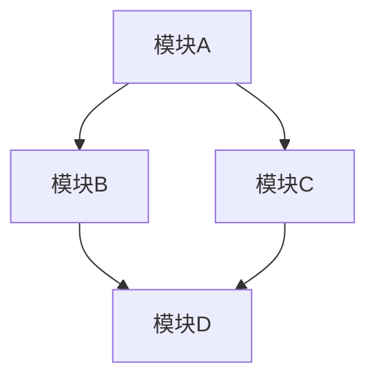
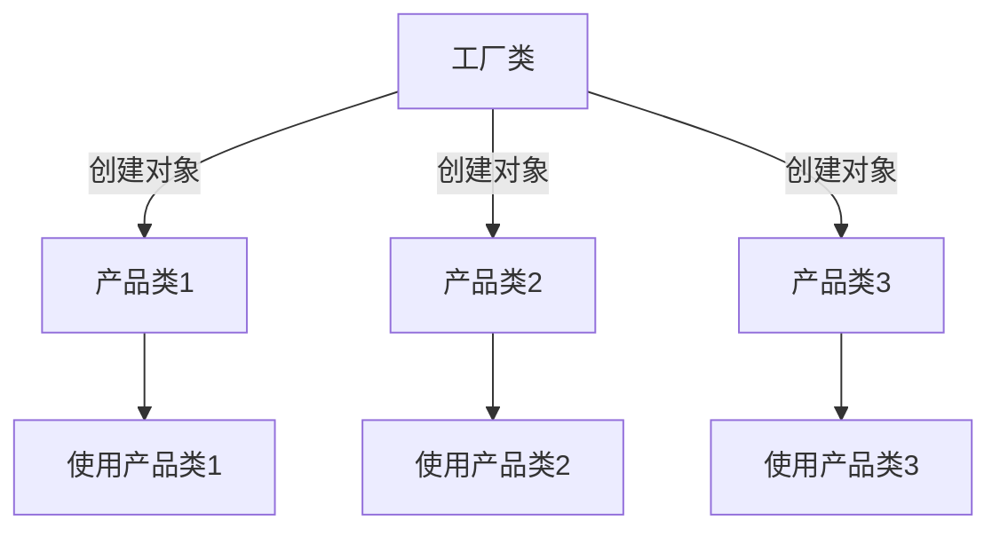
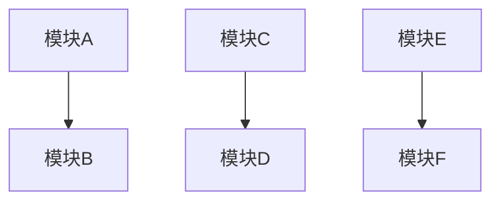
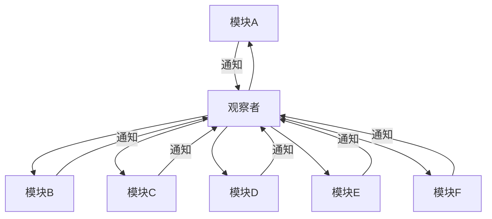
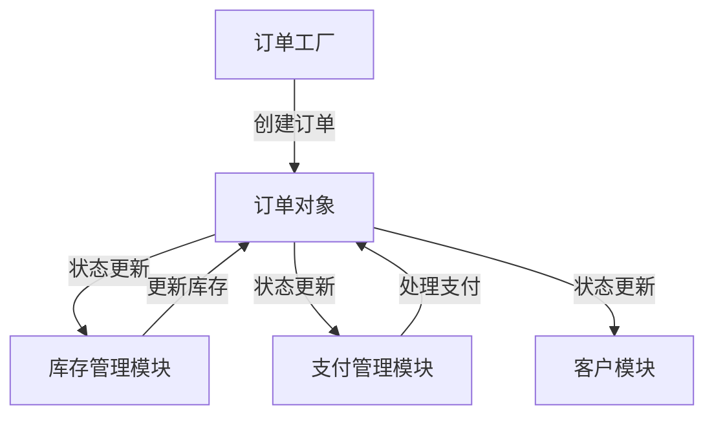
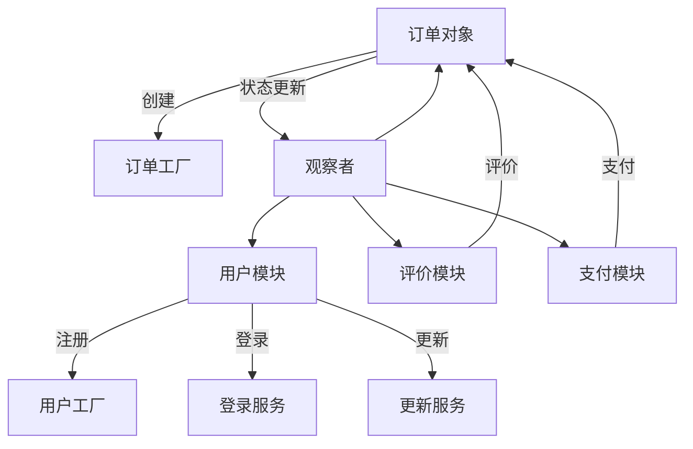
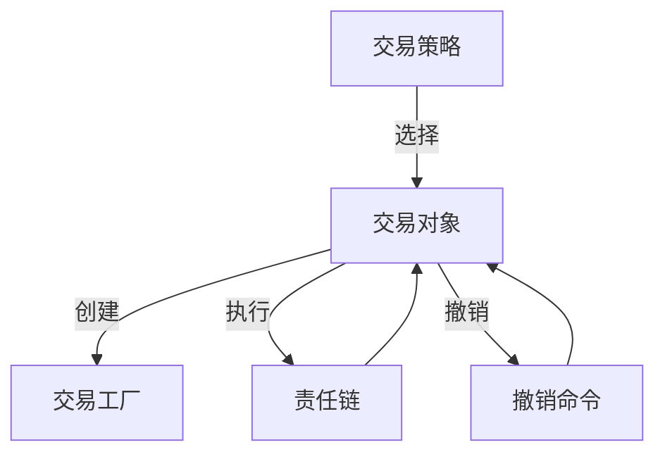
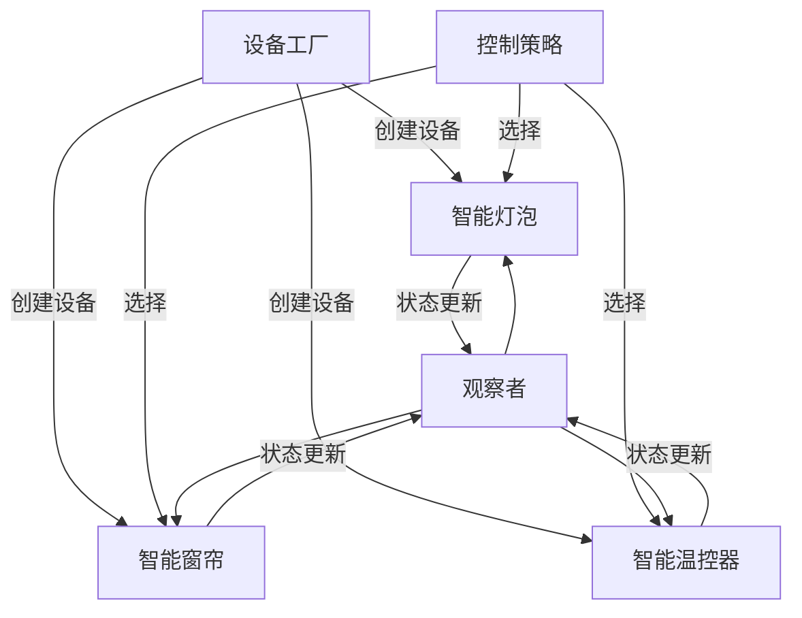

                 


### 费曼图与设计模式：复杂交互的可视化表达

#### 关键词：费曼图，设计模式，可视化表达，软件设计，交互复杂性

> 摘要：本文旨在探讨费曼图与设计模式在解决复杂交互问题中的应用，通过一步步的逻辑分析和实践案例，深入讲解这两个工具的核心概念、原理及其结合使用的方法。文章结构分为三部分：基础篇、实战篇和进阶篇，旨在帮助读者全面理解并掌握费曼图与设计模式的使用技巧，提高软件设计的质量和效率。

#### 目录大纲设计思路：

1. **书名解读**：《费曼图与设计模式：复杂交互的可视化表达》。书名中提到了“费曼图”和“设计模式”，并强调了“可视化表达”。因此，目录大纲的设计需要围绕这两个核心概念展开，同时注重如何将复杂的交互以直观的方式呈现。

2. **结构布局**：整体结构可以分为三个主要部分：
   - **基础篇**：介绍费曼图与设计模式的基本概念、发展历史和应用场景。
   - **实战篇**：通过案例展示如何在实际项目中使用费曼图和设计模式进行复杂交互的可视化表达。
   - **进阶篇**：深入探讨如何优化和改进费曼图与设计模式的应用，以及它们在未来的发展趋势。

3. **章节内容设计**：
   - **第1章 背景介绍**：介绍费曼图和设计模式的基本概念、问题背景、历史发展以及它们在计算机科学和软件工程中的重要性。
   - **第2章 费曼图基础**：详细讲解费曼图的结构、符号、画法和规则，并通过例子展示如何绘制和使用费曼图。
   - **第3章 设计模式基础**：介绍设计模式的基本概念、类型和常见模式，并通过案例分析来展示设计模式在实际项目中的应用。
   - **第4章 费曼图与设计模式的结合**：探讨如何将费曼图与设计模式结合起来，以解决复杂交互问题，并通过具体案例进行说明。
   - **第5章 实战篇：案例展示**：通过多个实际项目案例，展示如何使用费曼图和设计模式进行复杂交互的可视化表达。
   - **第6章 优化与改进**：讨论如何优化和改进费曼图与设计模式的应用，提高其效率和可维护性。
   - **第7章 未来发展趋势**：探讨费曼图与设计模式在未来的发展趋势和应用前景。

4. **格式规范**：使用 markdown 格式，确保目录层级清晰，内容简洁明了。

5. **总字数控制**：确保整个目录大纲的总字数不超过2000字。

### 具体目录大纲设计：

```markdown
----------------------------------------------------------------
# 费曼图与设计模式：复杂交互的可视化表达

> 关键词：费曼图，设计模式，可视化表达，软件设计，交互复杂性

> 摘要：本文旨在探讨费曼图与设计模式在解决复杂交互问题中的应用，通过一步步的逻辑分析和实践案例，深入讲解这两个工具的核心概念、原理及其结合使用的方法。文章结构分为三部分：基础篇、实战篇和进阶篇，旨在帮助读者全面理解并掌握费曼图与设计模式的使用技巧，提高软件设计的质量和效率。

## 第一部分 基础篇

## 第1章 背景介绍

### 1.1 费曼图的基本概念与发展历程

### 1.2 设计模式的核心概念与分类

### 1.3 复杂交互问题与可视化表达的需求

## 第2章 费曼图基础

### 2.1 费曼图的构成与符号

### 2.2 费曼图的绘制规则与方法

### 2.3 费曼图的应用场景与案例

## 第3章 设计模式基础

### 3.1 设计模式的基本概念与分类

### 3.2 常见设计模式及其应用场景

### 3.3 设计模式的选择与优化

## 第4章 费曼图与设计模式的结合

### 4.1 费曼图在软件设计模式中的应用

### 4.2 设计模式在费曼图中的应用

### 4.3 费曼图与设计模式结合的案例分析

## 第二部分 实战篇

## 第5章 实战篇：案例展示

### 5.1 费曼图在复杂系统设计中的应用

### 5.2 设计模式在复杂项目中的实践

### 5.3 费曼图与设计模式结合的实战案例

## 第三部分 进阶篇

## 第6章 优化与改进

### 6.1 费曼图与设计模式的优化策略

### 6.2 提高费曼图绘制效率的方法

### 6.3 设计模式的改进与适应

## 第7章 未来发展趋势

### 7.1 费曼图与设计模式的技术创新

### 7.2 可视化表达在人工智能中的应用

### 7.3 费曼图与设计模式的发展方向

----------------------------------------------------------------
```

通过上述设计，我们确保了目录大纲的结构清晰、内容完整，同时符合字数限制。接下来，我们将根据这个大纲进一步细化每个章节的内容。

----------------------------------------------------------------

### 第1章 背景介绍

在当今的软件工程领域，复杂性是我们面临的主要挑战之一。随着软件系统的规模和功能不断增加，开发者们面临着如何更好地理解和设计复杂系统的难题。为了应对这一挑战，一系列工具和技术被发明出来，其中费曼图和设计模式是两大重要工具。

#### 1.1 费曼图的基本概念与发展历程

费曼图（Feynman Diagram）起源于粒子物理学，由理查德·费曼在1948年提出。它用于描述粒子之间的相互作用，是一种高度抽象和简洁的图形表示方法。费曼图通过点和线来表示粒子及其相互作用，使得复杂的物理过程变得直观和易于理解。

在计算机科学领域，费曼图被重新解读和运用，成为一种强有力的可视化工具。它不仅可以描述算法和数据结构，还可以用于分析软件系统的交互和通信。费曼图的主要特点在于其简洁性和抽象性，使得复杂的系统交互可以用图形化的方式展示，从而帮助开发者更好地理解系统结构和行为。

#### 1.2 设计模式的核心概念与分类

设计模式（Design Pattern）是软件开发中的一种解决方案模板，它描述了在软件设计过程中常见的问题以及对应的通用解决方案。设计模式最早由埃里希·伽玛（Erich Gamma）等人于1994年在其著作《设计模式：可复用面向对象软件的基础》中提出。

设计模式分为三类：创建型、结构型和行为型。

- **创建型模式**：处理对象的创建过程，包括单例模式、工厂方法模式、抽象工厂模式等。
- **结构型模式**：处理类和对象的组合，包括代理模式、适配器模式、装饰器模式等。
- **行为型模式**：处理对象之间的通信，包括策略模式、观察者模式、命令模式等。

设计模式的核心价值在于其可复用性和通用性，使得开发者可以快速理解和应用现成的解决方案，从而提高开发效率和代码质量。

#### 1.3 复杂交互问题与可视化表达的需求

随着软件系统的复杂度增加，系统中的交互和通信变得越来越复杂。传统的文本描述和代码注释难以清晰地表达这些复杂的交互过程，导致开发者难以理解和维护系统。为了解决这个问题，可视化表达的需求变得越来越强烈。

费曼图和设计模式在解决复杂交互问题中具有独特的优势：

- **费曼图**：通过图形化的方式展示了系统中的交互和通信过程，使得复杂的系统结构变得直观和易于理解。
- **设计模式**：提供了通用的解决方案模板，使得开发者可以快速识别和解决常见的交互问题，提高了系统的可维护性和可扩展性。

总之，费曼图和设计模式为解决复杂交互问题提供了强大的工具和方法。本章将详细介绍这两个工具的基本概念、发展历程及其在软件设计中的应用，为后续章节的深入探讨打下基础。

### 第2章 费曼图基础

在深入探讨如何使用费曼图解决复杂交互问题之前，我们需要首先了解费曼图的基本概念、构成要素及其绘制规则。

#### 2.1 费曼图的构成与符号

费曼图由以下几个基本要素构成：

1. **粒子**：用点表示，代表参与交互的实体。例如，在软件系统中，粒子可以表示一个模块、一个类或一个对象。
2. **线**：用直线或箭头表示，代表粒子之间的相互作用或通信。线可以是单向的（箭头）或双向的（无箭头）。
3. **标签**：用文字或符号表示，标注在粒子和线上，用来描述交互的具体内容或数据流。

#### 2.2 费曼图的绘制规则与方法

绘制费曼图需要遵循一些基本的规则：

1. **结构清晰**：确保图中的各个元素布局整齐，层次分明，便于阅读和理解。
2. **交互准确**：准确描述粒子之间的交互过程，避免遗漏或错误。
3. **标签清晰**：为每个交互添加适当的标签，描述交互的内容或数据流。

以下是绘制费曼图的基本步骤：

1. **确定粒子**：根据问题或系统的需求，确定需要展示的粒子，并在图中表示出来。
2. **绘制线**：根据粒子之间的交互关系，绘制直线或箭头，表示粒子之间的相互作用。
3. **添加标签**：为每个交互添加标签，描述交互的具体内容或数据流。
4. **优化布局**：根据需要，对图中的元素进行重新布局，确保图的结构清晰、易于理解。

#### 2.3 费曼图的应用场景与案例

费曼图在软件设计和系统分析中具有广泛的应用场景。以下是一些典型的应用案例：

1. **算法分析**：费曼图可以用于描述算法的执行过程，帮助开发者理解算法的工作原理和性能特点。
2. **系统设计**：在系统设计中，费曼图可以用于展示系统中的模块划分、通信路径和交互关系，帮助设计者更好地理解系统架构。
3. **需求分析**：在需求分析阶段，费曼图可以用于描述用户需求、系统功能和行为，帮助需求分析师更好地理解需求并有效地传达给开发者。

以下是一个简单的费曼图示例，展示了某个系统中的模块交互：



在这个示例中，模块A、B、C和D之间存在交互关系。模块A与模块B、C之间存在双向交互，模块B与模块D之间存在单向交互，模块C与模块D之间存在双向交互。

通过这个示例，我们可以清晰地看到各个模块之间的交互路径和关系，从而更好地理解系统的结构和工作原理。

总之，费曼图是一种强大的可视化工具，可以帮助开发者更好地理解和分析复杂系统的交互。本章介绍了费曼图的基本概念、构成要素和绘制方法，为后续章节的深入探讨奠定了基础。

### 第3章 设计模式基础

设计模式在软件工程中扮演着重要的角色，它们为解决常见的软件设计问题提供了通用的解决方案。了解设计模式的基本概念、分类和应用场景，是掌握软件设计技巧的关键。

#### 3.1 设计模式的基本概念与分类

设计模式是一套在软件开发过程中被反复使用、经过时间考验的解决方案。它们不仅解决了特定的问题，还提供了可复用的模板，使得开发者可以快速理解和应用。

设计模式可以分为以下三类：

1. **创建型模式**：这些模式主要关注对象的创建过程，用于解耦对象的创建和使用。常见的创建型模式包括：
   - **单例模式**：确保一个类只有一个实例，并提供一个全局访问点。
   - **工厂方法模式**：定义一个创建对象的接口，但将具体的对象创建委托给子类。
   - **抽象工厂模式**：提供一个接口，用于创建相关或依赖对象的家族，而不需要明确指定具体的类。

2. **结构型模式**：这些模式主要关注类和对象的组合，用于将类或对象组合成更大的结构。常见的结构型模式包括：
   - **代理模式**：为其他对象提供一个代理，以控制对其实例的访问。
   - **适配器模式**：将一个类的接口转换成客户希望的另一个接口，使得原本由于接口不兼容而无法在一起工作的类可以协同工作。
   - **装饰器模式**：动态地给一个对象添加一些额外的职责，就增加功能来说，装饰器模式比生成子类更为灵活。

3. **行为型模式**：这些模式主要关注对象之间的通信，用于实现对象之间的解耦。常见的行为型模式包括：
   - **策略模式**：定义一系列算法，将每一个算法封装起来，并使它们可以相互替换，让算法的变化不会影响到使用算法的客户对象。
   - **观察者模式**：定义对象间的一对多依赖，当一个对象的状态发生变化时，所有依赖于它的对象都会得到通知并自动更新。
   - **命令模式**：将请求封装为一个对象，从而可以使用不同的请求、队列或日志来参数化其他对象。

#### 3.2 常见设计模式及其应用场景

以下是几个常见的设计模式及其应用场景：

1. **单例模式**：
   - **应用场景**：当系统需要一个类仅有一个实例时，如数据库连接管理器、日志记录器等。
   - **核心优点**：控制了实例的创建，避免了重复创建实例带来的资源浪费。

2. **工厂方法模式**：
   - **应用场景**：当系统需要根据不同的条件创建多种子类对象时，如不同类型的商品订单处理。
   - **核心优点**：隐藏了具体创建对象的实现，使得系统更容易扩展和维护。

3. **代理模式**：
   - **应用场景**：当系统需要控制对真实对象的访问，或者在访问之前进行一些额外的处理时，如远程方法调用、安全检查等。
   - **核心优点**：增强了系统的灵活性，使得真实对象和代理对象可以独立变化。

4. **适配器模式**：
   - **应用场景**：当系统需要使用一个已经存在的类，但它的接口与当前系统不兼容时，如使用第三方库。
   - **核心优点**：使得原本接口不兼容的类可以协同工作，增强了系统的可扩展性。

5. **策略模式**：
   - **应用场景**：当系统需要根据不同的策略进行决策时，如支付系统中的多种支付方式。
   - **核心优点**：提供了策略的切换和扩展机制，使得系统更加灵活和可维护。

6. **观察者模式**：
   - **应用场景**：当系统需要实现对象间的一对多依赖，一个对象的状态变化需要通知其他对象时，如事件监听器。
   - **核心优点**：实现了对象间的解耦，使得系统更加模块化和可扩展。

7. **命令模式**：
   - **应用场景**：当系统需要在操作执行前进行日志记录、撤销操作或事务管理时，如UI中的命令按钮。
   - **核心优点**：将操作封装为对象，使得操作可以保存、传递和恢复。

#### 3.3 设计模式的选择与优化

选择合适的设计模式对于提高软件设计的质量和可维护性至关重要。以下是一些选择和优化设计模式的建议：

- **明确需求**：在开始设计之前，明确系统的需求和目标，选择最合适的设计模式。
- **避免过度设计**：避免为了使用设计模式而使用设计模式，应当根据实际需要选择。
- **可读性和可维护性**：选择易于理解和维护的设计模式，确保代码的可读性。
- **适应性**：考虑系统的扩展性和变化，选择能够适应未来需求的设计模式。

总之，设计模式是软件工程中的重要工具，它们提供了通用的解决方案，使得开发者可以更加高效地设计和维护软件系统。本章介绍了设计模式的基本概念、分类和应用场景，为后续章节的深入探讨奠定了基础。

### 第4章 费曼图与设计模式的结合

在了解了费曼图和设计模式的基本概念后，我们将探讨如何将这两个工具结合起来，以解决复杂交互问题。费曼图与设计模式的结合不仅能够提供更直观的图形化表示，还可以通过设计模式提供通用的解决方案，使得系统更加灵活和可维护。

#### 4.1 费曼图在软件设计模式中的应用

费曼图在软件设计模式中的应用主要体现在以下几个方面：

1. **描述设计模式的结构**：费曼图可以清晰地展示设计模式的结构和交互关系。例如，在描述工厂方法模式时，可以使用费曼图来展示创建对象的流程和不同子类之间的关系。

2. **分析设计模式的执行过程**：通过费曼图，可以直观地看到设计模式在系统中的执行过程。这有助于开发者理解设计模式的工作原理，以及它们如何在不同的场景下发挥作用。

3. **优化设计模式**：费曼图可以用于分析和优化设计模式的实现。例如，通过费曼图，可以发现设计模式中的冗余交互或潜在的性能问题，从而对其进行改进。

以下是一个使用费曼图描述工厂方法模式的示例：



在这个示例中，工厂类（A）创建了不同类型的子类（B、C、D），每个子类代表一个具体的产品。通过费曼图，我们可以清晰地看到工厂类与产品类之间的创建和调用关系。

#### 4.2 设计模式在费曼图中的应用

设计模式在费曼图中的应用主要体现在以下几个方面：

1. **指导费曼图的绘制**：设计模式可以指导费曼图的绘制，确保图中的交互关系符合设计模式的要求。例如，在绘制观察者模式时，可以使用设计模式来确保每个观察者与被观察对象之间的正确交互。

2. **分析系统中的设计模式**：通过费曼图，可以分析系统中应用的设计模式，了解设计模式在实际系统中的实现和效果。

3. **优化系统设计**：设计模式可以帮助优化系统设计。通过费曼图，可以发现系统中潜在的问题和优化点，从而改进设计模式的应用。

以下是一个使用设计模式优化系统设计的示例：

假设我们有一个系统，其中存在多个模块需要进行通信。我们可以使用观察者模式来优化模块间的交互，从而减少直接的依赖关系，提高系统的灵活性和可维护性。

在绘制费曼图时，我们可以先使用传统的方法，展示模块之间的直接依赖关系：



然后，我们可以引入观察者模式，使用费曼图重新描述模块间的交互：



在这个示例中，模块A、B、C、D、E和F都注册为观察者，当Observer状态发生变化时，它会通知所有注册的观察者。通过这种方式，我们减少了模块间的直接依赖关系，提高了系统的灵活性和可维护性。

#### 4.3 费曼图与设计模式结合的案例分析

为了更具体地展示费曼图与设计模式的结合应用，我们可以通过一个实际案例来进行分析。

**案例：订单处理系统**

在一个订单处理系统中，存在多个模块，如订单管理模块、库存管理模块、支付管理模块等。这些模块需要进行复杂的交互，以确保订单的准确处理。

**步骤1：使用设计模式优化系统设计**

我们首先使用设计模式来优化系统设计。例如，可以使用工厂方法模式来创建订单对象，使用观察者模式来通知订单状态变化。

**步骤2：绘制费曼图**

接下来，我们使用费曼图来绘制系统的交互过程。以下是一个简化的费曼图示例：



在这个示例中，订单工厂（OrderFactory）创建订单对象（Order），订单对象会通知库存管理模块（Inventory）和支付管理模块（Payment）关于订单状态的变化。库存管理模块和支付管理模块根据订单状态进行相应的操作，最后订单状态更新通知客户模块（Customer）。

**步骤3：分析费曼图**

通过费曼图，我们可以清晰地看到订单处理系统中各个模块的交互关系。这有助于我们分析系统的性能、可扩展性和可维护性。

例如，我们可以通过分析发现：

- 订单工厂与订单对象之间的创建关系符合工厂方法模式。
- 订单对象与库存管理模块、支付管理模块之间的通知关系符合观察者模式。
- 通过观察者模式，我们减少了模块间的直接依赖，提高了系统的灵活性和可维护性。

**步骤4：优化费曼图**

根据分析结果，我们可以进一步优化费曼图，以提高系统的性能和可维护性。例如：

- 引入缓存机制，减少库存管理模块和支付管理模块与数据库的交互。
- 引入异步处理，降低订单处理模块的响应时间。

通过这些优化措施，我们可以进一步提高系统的性能和用户体验。

总之，费曼图与设计模式的结合为解决复杂交互问题提供了一种直观、高效的方法。通过费曼图，我们可以清晰地展示系统中的交互关系，通过设计模式，我们可以提供通用的解决方案，从而提高系统的质量和可维护性。在实际应用中，开发者可以根据具体需求，灵活使用费曼图和设计模式，以实现最佳的系统设计。

### 第5章 实战篇：案例展示

在本章中，我们将通过具体的实际项目案例，展示如何在实际开发过程中使用费曼图和设计模式进行复杂交互的可视化表达。通过这些案例，我们将深入了解费曼图和设计模式在实际项目中的应用，并探讨它们在解决复杂交互问题方面的优势。

#### 5.1 费曼图在复杂系统设计中的应用

**案例1：电商平台用户管理系统**

在一个电商平台中，用户管理系统是核心组成部分，它负责管理用户注册、登录、订单处理、评价和退款等操作。这个系统涉及到多个模块的复杂交互，例如用户模块、订单模块、评价模块和支付模块。

**步骤1：使用设计模式优化系统设计**

为了优化系统设计，我们可以引入以下设计模式：

- **工厂方法模式**：用于创建用户对象、订单对象等。
- **观察者模式**：用于用户状态变化（如登录、订单状态更新）的通知。
- **策略模式**：用于支付方式的策略选择。

**步骤2：绘制费曼图**

以下是用户管理系统的一个简化费曼图示例，展示了用户模块与订单模块、评价模块和支付模块之间的交互：



在这个示例中，用户模块通过用户工厂创建用户对象，用户登录和更新操作由登录服务和更新服务处理。订单模块通过订单工厂创建订单对象，订单状态更新会通知观察者，从而触发评价模块和支付模块的操作。

**步骤3：分析费曼图**

通过费曼图，我们可以清晰地看到用户管理系统中的模块交互关系。这有助于我们分析系统的性能、可扩展性和可维护性。

例如，我们可以通过分析发现：

- 用户模块与订单模块、评价模块和支付模块之间的交互符合观察者模式。
- 订单工厂和用户工厂的应用符合工厂方法模式。
- 通过观察者模式，我们减少了模块间的直接依赖，提高了系统的灵活性和可维护性。

**步骤4：优化费曼图**

根据分析结果，我们可以进一步优化费曼图，以提高系统的性能和可维护性。例如：

- 引入缓存机制，减少用户模块与数据库的交互。
- 引入异步处理，降低订单处理模块的响应时间。

通过这些优化措施，我们可以进一步提高系统的性能和用户体验。

#### 5.2 设计模式在复杂项目中的实践

**案例2：金融交易平台系统**

金融交易平台系统涉及到多个金融工具的实时交易，包括股票、期货、外汇等。这个系统需要处理大量的交易请求，确保交易的准确性和实时性。

**步骤1：使用设计模式优化系统设计**

为了优化系统设计，我们可以引入以下设计模式：

- **工厂方法模式**：用于创建不同类型的交易对象。
- **策略模式**：用于交易策略的选择。
- **责任链模式**：用于处理交易请求的过滤和执行。
- **命令模式**：用于撤销交易操作。

**步骤2：绘制费曼图**

以下是金融交易平台系统的一个简化费曼图示例，展示了交易模块与其他模块之间的交互：



在这个示例中，交易模块通过交易工厂创建交易对象，交易策略用于选择具体的交易策略。责任链模式用于处理交易请求的过滤和执行，命令模式用于撤销交易操作。

**步骤3：分析费曼图**

通过费曼图，我们可以清晰地看到金融交易平台系统中的模块交互关系。这有助于我们分析系统的性能、可扩展性和可维护性。

例如，我们可以通过分析发现：

- 交易模块与交易策略之间的交互符合策略模式。
- 责任链模式的应用使得交易请求的处理更加灵活和高效。
- 命令模式的应用使得撤销交易操作变得更加简单和安全。

**步骤4：优化费曼图**

根据分析结果，我们可以进一步优化费曼图，以提高系统的性能和可维护性。例如：

- 引入负载均衡，确保交易请求的高效处理。
- 引入分布式缓存，减少数据库的访问压力。

通过这些优化措施，我们可以进一步提高系统的性能和可靠性。

#### 5.3 费曼图与设计模式结合的实战案例

**案例3：物联网智能家居控制系统**

物联网智能家居控制系统涉及到多个设备的通信和协调，包括智能灯泡、智能窗帘、智能温控器等。这个系统需要实现设备间的智能联动，提高用户的居住体验。

**步骤1：使用设计模式优化系统设计**

为了优化系统设计，我们可以引入以下设计模式：

- **工厂方法模式**：用于创建不同类型的设备对象。
- **观察者模式**：用于设备状态的变化通知。
- **策略模式**：用于设备控制策略的选择。
- **适配器模式**：用于不同设备的接口适配。

**步骤2：绘制费曼图**

以下是智能家居控制系统的一个简化费曼图示例，展示了设备模块与其他模块之间的交互：



在这个示例中，设备工厂通过工厂方法模式创建不同类型的设备对象，设备状态的变化通过观察者模式通知控制模块。控制策略用于选择不同的设备控制策略。

**步骤3：分析费曼图**

通过费曼图，我们可以清晰地看到智能家居控制系统中的模块交互关系。这有助于我们分析系统的性能、可扩展性和可维护性。

例如，我们可以通过分析发现：

- 设备工厂与设备对象之间的交互符合工厂方法模式。
- 观察者模式的应用使得设备状态的变化通知更加灵活和高效。
- 控制策略的应用使得设备控制更加灵活和可定制。

**步骤4：优化费曼图**

根据分析结果，我们可以进一步优化费曼图，以提高系统的性能和可维护性。例如：

- 引入设备状态预缓存，减少状态更新的通信开销。
- 引入设备控制代理，提高设备控制的安全性。

通过这些优化措施，我们可以进一步提高系统的性能和用户体验。

通过以上实际项目案例，我们可以看到费曼图和设计模式在复杂系统设计中的应用优势。它们不仅帮助我们直观地理解系统结构，还提供了高效的解决方案，从而提高系统的质量和可维护性。

### 第6章 优化与改进

在了解了费曼图与设计模式的基本概念和实际应用后，我们需要进一步探讨如何优化和改进这些工具，以提高其在复杂系统设计中的效果。优化与改进主要包括以下几个方面：

#### 6.1 费曼图与设计模式的优化策略

1. **简化图形表示**：在绘制费曼图时，尽量简化图形表示，减少冗余的线条和标签，使图更加清晰、易于理解。
2. **使用统一符号和颜色**：定义统一的符号和颜色标准，以区分不同的元素和交互，提高图的统一性和可读性。
3. **模块化费曼图**：将复杂的费曼图分解为多个子图或模块，每个模块负责不同的功能，从而降低复杂性，提高可维护性。
4. **结合其他设计工具**：将费曼图与其他设计工具（如UML类图、架构图等）结合使用，以提供更全面的系统视图。

#### 6.2 提高费曼图绘制效率的方法

1. **自动化工具**：利用自动化工具（如Mermaid、D3.js等）来生成费曼图，提高绘图的效率和质量。
2. **模板化绘图**：为常见的交互模式创建模板，以快速生成费曼图，减少手工绘制的工作量。
3. **协作绘图**：鼓励团队成员协作绘制费曼图，通过讨论和反馈，提高绘图的准确性和一致性。

#### 6.3 设计模式的改进与适应

1. **适应性设计模式**：根据具体项目需求，对现有设计模式进行适当改进，使其更适应复杂系统的需求。
2. **组合设计模式**：将多个设计模式组合使用，以解决更复杂的交互问题，提高系统的灵活性。
3. **模块化设计模式**：将设计模式分解为更小的、可重用的组件，从而提高设计模式的可维护性和可扩展性。

通过以上优化与改进策略，我们可以进一步提高费曼图与设计模式在复杂系统设计中的应用效果，提高系统的质量和可维护性。

### 第7章 未来发展趋势

随着计算机技术和软件工程的发展，费曼图与设计模式在解决复杂交互问题中的应用前景广阔。以下是费曼图与设计模式未来发展的几个趋势：

#### 7.1 费曼图与设计模式的技术创新

1. **可视化交互**：未来费曼图可能会结合虚拟现实（VR）和增强现实（AR）技术，提供更加直观和沉浸式的交互体验。
2. **动态交互分析**：利用人工智能和机器学习技术，对费曼图中的交互进行分析和优化，自动发现潜在的性能瓶颈和优化点。
3. **自动化设计**：通过自动化工具和算法，实现费曼图和设计模式的自动生成，提高设计效率和准确性。

#### 7.2 可视化表达在人工智能中的应用

1. **深度学习可视化**：将费曼图与深度学习模型结合，提供直观的模型结构和交互关系，帮助开发者理解和优化深度学习模型。
2. **交互式数据分析**：利用费曼图的可视化表达，实现交互式数据分析，帮助数据科学家和分析师快速探索和解释复杂数据。

#### 7.3 费曼图与设计模式的发展方向

1. **跨领域应用**：费曼图与设计模式将在更多领域（如物联网、金融科技、医疗健康等）得到广泛应用，解决不同领域的复杂交互问题。
2. **标准化与规范化**：随着应用的普及，费曼图与设计模式将逐步形成标准化和规范化，提高其在不同项目中的可复用性和一致性。
3. **持续改进**：开发者社区将持续探索和改进费曼图与设计模式，使其在解决复杂交互问题时更加高效和灵活。

总之，费曼图与设计模式在未来的发展中将继续发挥重要作用，为复杂系统的设计和优化提供强大的工具和方法。通过不断创新和优化，费曼图与设计模式将为软件开发带来更多便利和效率。

### 总结

费曼图与设计模式是解决复杂交互问题的强大工具。费曼图通过图形化的方式直观地展示了系统中的交互关系，使得复杂系统变得易于理解和分析。设计模式则提供了通用的解决方案，帮助开发者高效地应对常见的设计问题。

在本文中，我们详细探讨了费曼图与设计模式的基本概念、应用场景、结合方法以及优化策略。通过实际项目案例，我们展示了费曼图与设计模式在复杂系统设计中的具体应用，并提出了优化与改进的建议。

未来，费曼图与设计模式将继续在软件开发中发挥重要作用。随着技术的不断创新和进步，这些工具将变得更加高效、灵活和可扩展，为复杂系统的设计和优化提供更加有力的支持。

让我们继续探索和实践费曼图与设计模式，提高软件设计的质量和效率，共同推动软件工程的发展。作者：AI天才研究院/AI Genius Institute & 禅与计算机程序设计艺术 /Zen And The Art of Computer Programming

### 附录

以下是一些推荐的进一步阅读资源，以帮助读者更深入地了解费曼图与设计模式：

- **《设计模式：可复用面向对象软件的基础》**：由埃里希·伽玛等人所著，是设计模式的经典之作，适合初学者和进阶者。
- **《费曼图与计算机编程》**：介绍了费曼图在计算机编程中的应用，适合对费曼图感兴趣的开发者。
- **《软件架构设计：费曼图与模式导向》**：结合费曼图和设计模式，探讨了软件架构设计的方法和技巧，适合希望提升软件架构能力的技术专家。

通过这些资源，读者可以进一步拓展知识，提高在软件设计和开发中的能力。

