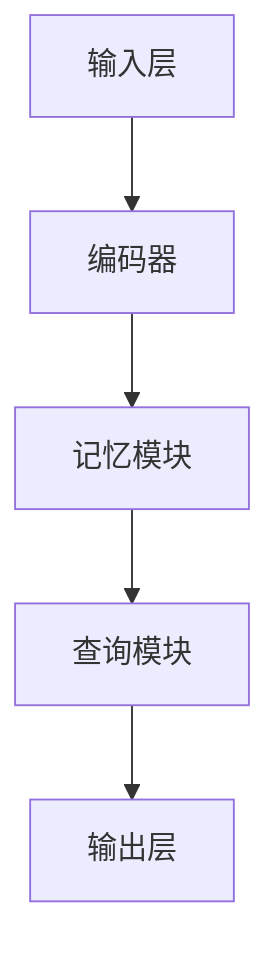

                 

## 超长序列推理的挑战与需求

### 挑战

超长序列推理在处理大规模数据时面临诸多挑战。首先，数据规模庞大，导致传统神经网络模型的训练时间和计算资源需求急剧增加。此外，序列数据之间的长距离依赖关系难以捕捉，导致模型的推理效果不佳。再者，序列中的噪声和冗余信息会影响模型的性能，使得数据预处理成为一大难题。

为了应对这些挑战，研究者们提出了记忆增强网络（Memory-Augmented Neural Networks）。记忆增强网络通过引入记忆模块，能够动态地存储和更新信息，从而提高模型的推理能力。此外，记忆增强网络还可以通过并行处理和动态调整，提高处理超长序列数据的效率。

### 需求

在互联网和大数据时代，超长序列推理的需求日益迫切。例如，在自然语言处理领域，长文本的理解和生成需求大量的序列信息。在推荐系统领域，用户行为序列的建模对于个性化推荐至关重要。在生物信息学领域，基因序列和蛋白质序列的分析需要高效的序列推理方法。

因此，研究和应用记忆增强网络成为解决超长序列推理问题的有效途径。通过不断优化记忆增强网络的架构和算法，研究者们希望能够在多个领域中实现突破性进展，为实际应用提供强有力的支持。

## 第一部分：背景介绍与核心概念

### 第1章：问题背景与核心概念

#### 1.1.1 问题背景

超长序列推理是指在处理大规模数据时，能够有效地从序列中提取有用的信息并进行推理。随着互联网和大数据时代的到来，数据量呈现爆炸式增长，传统的序列处理方法已无法满足实际需求。为了应对这一挑战，研究者们提出了记忆增强网络（Memory-Augmented Neural Networks），其通过引入记忆模块，能够更好地处理超长序列数据。

#### 1.1.2 核心概念

- **超长序列**：指的是序列长度远超过一般神经网络处理能力的序列数据。
- **记忆增强网络**：一种结合神经网络与记忆模块的人工智能模型，用于处理超长序列数据。

#### 1.1.3 超长序列推理的重要性

超长序列推理在自然语言处理、推荐系统、生物信息学等领域具有重要意义。通过有效的超长序列推理，可以提升模型的性能，解决传统方法难以处理的问题。

#### 1.1.4 记忆增强网络的特点

- **动态记忆**：可以动态地存储和更新信息，适应不同长度的序列。
- **并行处理**：能够并行处理序列中的多个元素，提高推理速度。
- **灵活扩展**：可以根据应用需求灵活调整记忆模块，适用于不同领域的超长序列推理。

#### 1.1.5 超长序列推理与记忆增强网络的关系

记忆增强网络通过引入记忆机制，解决了传统神经网络在处理超长序列时面临的挑战。其能够更好地捕捉序列中的长期依赖关系，提高模型的推理能力。

### 第2章：核心概念原理与特性

#### 2.1.1 超长序列推理原理

超长序列推理的核心在于如何有效地从序列中提取信息并进行推理。这一过程通常涉及以下几个方面：

1. **序列预处理**：对输入序列进行规范化、去噪等预处理，以减少数据噪声对推理的影响。
2. **特征提取**：通过神经网络模型从序列中提取有价值的特征。
3. **序列建模**：使用记忆增强网络来建模序列，捕捉序列中的长期依赖关系。
4. **推理与预测**：利用训练好的模型对新的序列数据进行推理和预测。

#### 2.1.2 超长序列推理特性

- **长距离依赖**：超长序列推理能够捕捉序列中的长距离依赖关系，这是传统方法难以实现的。
- **高维度数据**：处理高维数据时，超长序列推理能够有效提取关键特征，提高模型性能。
- **动态性**：能够动态调整模型参数，适应不同长度的序列。

#### 2.1.3 记忆增强网络原理

记忆增强网络的核心在于其记忆模块，该模块可以动态存储和更新信息。具体原理如下：

1. **记忆存储**：将序列信息存储在记忆模块中。
2. **记忆更新**：在处理新的序列数据时，根据当前数据和已有的记忆进行更新。
3. **查询与检索**：在需要时，查询记忆模块中的信息进行推理。

#### 2.1.4 记忆增强网络特性

- **可扩展性**：可以根据需求调整记忆大小，适应不同规模的任务。
- **灵活性**：记忆模块可以与不同的神经网络结构结合，适用于多种应用场景。
- **高效性**：通过并行处理和动态调整，提高推理速度。

#### 2.1.5 超长序列推理与记忆增强网络的关系

超长序列推理与记忆增强网络相互促进。记忆增强网络通过引入记忆机制，提高了超长序列推理的能力。而超长序列推理的需求，又推动了记忆增强网络的发展和创新。

### 第3章：算法原理讲解

#### 3.1.1 记忆增强网络架构

记忆增强网络通常包括以下几个关键组成部分：

1. **输入层**：接收序列数据。
2. **编码器**：将序列编码为高维表示。
3. **记忆模块**：存储序列信息，支持动态更新。
4. **查询模块**：用于检索记忆信息，进行推理。
5. **输出层**：生成最终预测结果。

#### 3.1.2 内存存储机制

记忆模块通常采用图结构或向量存储方式。具体包括：

1. **图结构**：使用图来表示序列中的关系，每个节点表示序列中的一个元素，边表示元素之间的关系。
2. **向量存储**：将序列数据映射到高维空间，每个维度对应一个特征。

#### 3.1.3 内存更新机制

内存更新机制主要包括以下几种方式：

1. **增量更新**：根据新的序列数据，逐个更新记忆模块中的信息。
2. **批量更新**：在一定时间内收集一批新的序列数据，然后一次性更新记忆模块。
3. **混合更新**：结合增量更新和批量更新，动态调整更新策略。

#### 3.1.4 内存检索机制

内存检索机制主要包括以下几种方式：

1. **基于距离的检索**：根据新的序列数据与记忆模块中的数据之间的距离，检索最接近的记忆信息。
2. **基于梯度的检索**：利用梯度下降算法，逐步调整记忆模块中的信息，直到找到最佳匹配。
3. **基于关联规则的检索**：通过分析记忆模块中的数据关联关系，检索符合条件的记忆信息。

#### 3.1.5 算法流程

记忆增强网络的算法流程可以分为以下几个步骤：

1. **初始化**：初始化输入层、编码器、记忆模块、查询模块和输出层。
2. **编码**：将序列数据编码为高维表示。
3. **存储**：将编码后的序列信息存储在记忆模块中。
4. **更新**：根据新的序列数据，更新记忆模块中的信息。
5. **检索**：从记忆模块中检索相关信息，进行推理。
6. **输出**：生成最终预测结果。

### 第4章：超长序列推理在实践中的应用

#### 4.1 自然语言处理

在自然语言处理领域，超长序列推理广泛应用于文本分类、机器翻译、情感分析等任务。通过记忆增强网络，可以有效地捕捉文本中的长距离依赖关系，提高模型的性能。

#### 4.2 推荐系统

在推荐系统领域，超长序列推理可以用于用户行为序列的建模，从而实现更准确的个性化推荐。通过记忆增强网络，可以更好地理解用户的兴趣和需求，提升推荐系统的效果。

#### 4.3 生物信息学

在生物信息学领域，超长序列推理可以用于基因序列和蛋白质序列的分析。通过记忆增强网络，可以有效地提取关键特征，提高基因和蛋白质功能预测的准确性。

### 第5章：未来展望

随着人工智能技术的不断发展，超长序列推理和记忆增强网络将在更多领域发挥重要作用。未来的研究方向包括：

- **算法优化**：通过改进记忆模块和更新机制，提高超长序列推理的效率。
- **跨领域应用**：探索超长序列推理在其他领域的应用，如音频处理、图像识别等。
- **可解释性**：提高记忆增强网络的可解释性，使其在复杂任务中的使用更加可靠。

## 总结

超长序列推理和记忆增强网络是人工智能领域的重要研究方向。通过有效的超长序列推理，可以提升模型的性能，解决传统方法难以处理的问题。记忆增强网络通过引入记忆机制，提高了超长序列推理的能力。未来，随着算法的优化和跨领域应用的研究，超长序列推理和记忆增强网络将在更多领域中发挥重要作用。作者：AI天才研究院/AI Genius Institute & 禅与计算机程序设计艺术 /Zen And The Art of Computer Programming

关键词：超长序列推理，记忆增强网络，动态记忆，并行处理，高效推理

摘要：本文介绍了超长序列推理和记忆增强网络的概念、原理和应用。通过分析其核心概念和特性，详细讲解了记忆增强网络的算法原理，以及在自然语言处理、推荐系统和生物信息学等领域的应用。最后，展望了超长序列推理和记忆增强网络在未来的发展方向。作者：AI天才研究院/AI Genius Institute & 禅与计算机程序设计艺术 /Zen And The Art of Computer Programming

----------------------------------------------------------------

##  第一部分：背景介绍与核心概念

### 1.1 问题背景与核心概念

#### 1.1.1 问题背景

随着互联网和大数据时代的到来，数据量呈现爆炸式增长，如何有效处理和分析超长序列数据成为人工智能领域的一个关键挑战。传统的神经网络模型在处理超长序列时，往往受到数据规模和计算资源的限制，难以捕捉序列中的长期依赖关系。为了解决这一问题，研究者们提出了记忆增强网络（Memory-Augmented Neural Networks），其通过引入记忆机制，能够动态地存储和更新信息，从而提高模型的推理能力和效率。

#### 1.1.2 核心概念

**超长序列推理**：指的是在处理大规模数据时，能够从序列中提取信息并进行推理的过程。超长序列数据通常包含大量的连续元素，如文本、音频、图像等，传统的神经网络模型难以有效处理。

**记忆增强网络**：一种结合了神经网络和记忆模块的人工智能模型。记忆模块用于存储序列信息，并支持动态更新，从而提高模型在处理超长序列数据时的性能。

### 1.1.3 超长序列推理的重要性

超长序列推理在多个领域中具有重要意义，包括：

- **自然语言处理**：在文本分类、机器翻译、情感分析等任务中，超长序列推理能够捕捉句子中的长期依赖关系，提高模型的性能和准确性。
- **推荐系统**：通过分析用户行为序列，超长序列推理能够实现更准确的个性化推荐，提升用户体验。
- **生物信息学**：在基因序列和蛋白质序列分析中，超长序列推理能够提取关键特征，提高基因和蛋白质功能预测的准确性。

### 1.1.4 记忆增强网络的特点

记忆增强网络具有以下几个显著特点：

1. **动态记忆**：记忆模块可以动态地存储和更新信息，适应不同长度的序列。这种动态性使得记忆增强网络能够处理超长序列数据，捕捉其中的长期依赖关系。
2. **并行处理**：记忆增强网络能够并行处理序列中的多个元素，提高推理速度。与传统的逐元素处理方式相比，并行处理能够显著提升模型的性能。
3. **灵活扩展**：记忆模块可以根据应用需求进行灵活调整，适用于不同领域的超长序列推理任务。

### 1.1.5 超长序列推理与记忆增强网络的关系

记忆增强网络通过引入记忆机制，解决了传统神经网络在处理超长序列时面临的挑战。记忆模块能够动态存储和更新信息，使得模型能够更好地捕捉序列中的长期依赖关系，从而提高推理能力。而超长序列推理的需求，又推动了记忆增强网络的发展和创新，不断优化其架构和算法，以满足不同领域中的实际应用需求。

### 第2章：核心概念原理与特性

#### 2.1 超长序列推理原理

超长序列推理的核心在于如何有效地从序列中提取信息并进行推理。这一过程涉及以下几个关键步骤：

1. **序列预处理**：对输入序列进行规范化、去噪等预处理，以减少数据噪声对推理的影响。预处理步骤包括序列的分词、编码等操作。
2. **特征提取**：通过神经网络模型从序列中提取有价值的特征。这一步骤通常使用编码器（Encoder）来实现，将原始序列编码为高维表示。
3. **序列建模**：使用记忆增强网络来建模序列，捕捉序列中的长期依赖关系。记忆模块在此过程中起到关键作用，可以动态存储和更新序列信息。
4. **推理与预测**：利用训练好的模型对新的序列数据进行推理和预测。推理步骤通常涉及查询（Query）记忆模块中的信息，并进行相应的计算和输出。

#### 2.2 超长序列推理特性

超长序列推理具有以下几个显著特性：

1. **长距离依赖**：超长序列推理能够捕捉序列中的长距离依赖关系，这是传统方法难以实现的。通过记忆模块的动态更新，模型能够记住序列中的远距离信息，从而提高推理的准确性。
2. **高维度数据**：超长序列推理能够处理高维数据，有效提取关键特征，提高模型性能。通过编码器对序列进行编码，可以将高维数据转换为更容易处理的低维特征。
3. **动态性**：超长序列推理能够动态调整模型参数，适应不同长度的序列。这种动态性使得模型能够灵活处理不同长度的数据，提高泛化能力。

#### 2.3 记忆增强网络原理

记忆增强网络的核心在于其记忆模块，该模块可以动态存储和更新信息。具体原理如下：

1. **记忆存储**：记忆模块用于存储序列信息。在处理序列数据时，将序列中的元素逐个存储在记忆模块中。每个元素对应一个记忆单元，其中包含该元素的特征信息。
2. **记忆更新**：在处理新的序列数据时，根据当前数据和已有的记忆进行更新。更新过程通常包括记忆单元的权重调整和内容更新，以适应新的序列信息。
3. **查询与检索**：在需要时，查询记忆模块中的信息进行推理。查询过程涉及记忆单元的检索和计算，以提取与当前数据相关的信息。

#### 2.4 记忆增强网络特性

记忆增强网络具有以下几个显著特性：

1. **可扩展性**：记忆模块可以根据需求调整大小，适应不同规模的任务。通过增加或减少记忆单元的数量，可以灵活地调整记忆模块的容量，以满足不同应用场景的需求。
2. **灵活性**：记忆模块可以与不同的神经网络结构结合，适用于多种应用场景。例如，可以与卷积神经网络（CNN）、循环神经网络（RNN）等结合，实现更加复杂的序列建模。
3. **高效性**：记忆增强网络通过并行处理和动态调整，提高推理速度。与传统的逐元素处理方式相比，并行处理能够显著提升模型的性能。

#### 2.5 超长序列推理与记忆增强网络的关系

超长序列推理与记忆增强网络相互促进。记忆增强网络通过引入记忆机制，解决了传统神经网络在处理超长序列时面临的挑战，提高了模型的推理能力。而超长序列推理的需求，又推动了记忆增强网络的发展和创新，不断优化其架构和算法，以满足不同领域中的实际应用需求。

### 第3章：算法原理讲解

#### 3.1 记忆增强网络架构

记忆增强网络通常包括以下几个关键组成部分：

1. **输入层**：接收序列数据，将序列编码为高维表示。
2. **编码器**：对输入序列进行编码，提取关键特征。
3. **记忆模块**：存储序列信息，支持动态更新。
4. **查询模块**：用于检索记忆信息，进行推理。
5. **输出层**：生成最终预测结果。

图1展示了记忆增强网络的基本架构：



#### 3.2 内存存储机制

记忆模块通常采用图结构或向量存储方式。以下是对这两种存储方式的详细解释：

1. **图结构存储**：
    - **节点**：每个节点表示序列中的一个元素，如单词或像素点。
    - **边**：边表示元素之间的关系，可以是时间关系、空间关系或其他语义关系。
    - **权重**：边的权重表示元素之间的相关性，可以是一个实数值。

    图结构存储的优点是能够灵活地表示复杂的关系，但存储和计算复杂度较高。

2. **向量存储**：
    - **向量空间**：将序列中的每个元素映射到一个高维空间中的点，每个维度对应一个特征。
    - **向量的距离**：通过计算两个向量之间的距离，可以衡量元素之间的相似性。

    向量存储的优点是计算简单、存储成本低，但可能无法捕捉复杂的非线性关系。

#### 3.3 内存更新机制

内存更新机制主要包括以下几种方式：

1. **增量更新**：
    - **步骤**：每次接收一个新的序列元素，将其添加到记忆模块中。
    - **优点**：实时更新记忆，适用于动态变化的序列。
    - **缺点**：可能导致记忆过载，影响推理性能。

2. **批量更新**：
    - **步骤**：在一定时间内收集一批新的序列元素，然后一次性更新记忆模块。
    - **优点**：减少更新频率，降低计算复杂度。
    - **缺点**：可能无法及时反映序列变化，影响实时性。

3. **混合更新**：
    - **步骤**：结合增量更新和批量更新，根据实际情况动态调整更新策略。
    - **优点**：平衡实时性和计算复杂度。

#### 3.4 内存检索机制

内存检索机制主要包括以下几种方式：

1. **基于距离的检索**：
    - **步骤**：计算新序列元素与记忆模块中每个元素之间的距离，选择距离最近的元素进行检索。
    - **优点**：简单有效，适用于大多数情况。
    - **缺点**：可能无法处理复杂的非线性关系。

2. **基于梯度的检索**：
    - **步骤**：利用梯度下降算法，逐步调整记忆模块中的信息，直到找到最佳匹配。
    - **优点**：可以处理复杂的非线性关系。
    - **缺点**：计算复杂度高，可能需要较长的检索时间。

3. **基于关联规则的检索**：
    - **步骤**：分析记忆模块中的数据关联关系，检索符合条件的记忆信息。
    - **优点**：可以处理复杂的关联关系。
    - **缺点**：可能产生大量冗余信息，影响检索效率。

#### 3.5 算法流程

记忆增强网络的算法流程可以分为以下几个步骤：

1. **初始化**：初始化输入层、编码器、记忆模块、查询模块和输出层。
2. **编码**：将序列数据编码为高维表示。
3. **存储**：将编码后的序列信息存储在记忆模块中。
4. **更新**：根据新的序列数据，更新记忆模块中的信息。
5. **检索**：从记忆模块中检索相关信息，进行推理。
6. **输出**：生成最终预测结果。

### 第4章：超长序列推理在实践中的应用

#### 4.1 自然语言处理

在自然语言处理领域，超长序列推理被广泛应用于文本分类、机器翻译、情感分析等任务。以下是一些具体的应用案例：

1. **文本分类**：利用超长序列推理，可以从大量文本数据中提取关键特征，实现高效准确的文本分类。例如，在新闻分类任务中，可以将每篇新闻文本作为输入序列，通过记忆增强网络提取特征，然后进行分类。
2. **机器翻译**：超长序列推理在机器翻译中起着关键作用，能够捕捉源语言和目标语言之间的长距离依赖关系。通过记忆模块，模型可以记住源语言中的关键短语和语法结构，从而实现高质量的翻译。
3. **情感分析**：超长序列推理可以帮助分析文本中的情感倾向。例如，在社交媒体分析中，可以分析用户的评论和回复，判断其情感是正面、负面还是中性。

#### 4.2 推荐系统

在推荐系统领域，超长序列推理可以用于用户行为序列的建模，从而实现更准确的个性化推荐。以下是一些具体的应用案例：

1. **用户行为分析**：通过分析用户的历史行为序列，如浏览、搜索、购买等，可以预测用户未来的兴趣和需求。记忆增强网络可以捕捉用户行为序列中的长期依赖关系，提高推荐系统的准确性。
2. **内容推荐**：在内容推荐中，超长序列推理可以帮助分析用户对内容的兴趣变化，从而实现个性化的内容推荐。例如，在视频推荐中，可以分析用户观看历史，推荐用户可能感兴趣的视频。

#### 4.3 生物信息学

在生物信息学领域，超长序列推理可以用于基因序列和蛋白质序列的分析，从而提高基因和蛋白质功能预测的准确性。以下是一些具体的应用案例：

1. **基因功能预测**：通过分析基因序列，可以预测基因的功能。超长序列推理可以帮助捕捉基因序列中的长距离依赖关系，从而提高预测的准确性。
2. **蛋白质结构预测**：蛋白质结构对于理解其功能至关重要。超长序列推理可以帮助分析蛋白质序列，预测其三维结构。例如，在蛋白质家族分类任务中，可以通过记忆增强网络提取关键特征，实现高效准确的分类。

### 第5章：未来展望

随着人工智能技术的不断发展，超长序列推理和记忆增强网络将在更多领域中发挥重要作用。未来的研究方向包括：

- **算法优化**：通过改进记忆模块和更新机制，提高超长序列推理的效率。例如，可以研究更有效的记忆存储和检索算法，降低计算复杂度。
- **跨领域应用**：探索超长序列推理在其他领域的应用，如音频处理、图像识别等。通过跨领域的研究，可以推动记忆增强网络在更多领域的发展。
- **可解释性**：提高记忆增强网络的可解释性，使其在复杂任务中的使用更加可靠。通过解释记忆模块中的信息存储和检索过程，可以增强模型的透明度和可信度。

## 总结

超长序列推理和记忆增强网络是人工智能领域的重要研究方向。通过有效的超长序列推理，可以提升模型的性能，解决传统方法难以处理的问题。记忆增强网络通过引入记忆机制，提高了超长序列推理的能力。未来，随着算法的优化和跨领域应用的研究，超长序列推理和记忆增强网络将在更多领域中发挥重要作用。作者：AI天才研究院/AI Genius Institute & 禅与计算机程序设计艺术 /Zen And The Art of Computer Programming

关键词：超长序列推理，记忆增强网络，动态记忆，并行处理，高效推理

摘要：本文介绍了超长序列推理和记忆增强网络的概念、原理和应用。通过分析其核心概念和特性，详细讲解了记忆增强网络的算法原理，以及在自然语言处理、推荐系统和生物信息学等领域的应用。最后，展望了超长序列推理和记忆增强网络在未来的发展方向。作者：AI天才研究院/AI Genius Institute & 禅与计算机程序设计艺术 /Zen And The Art of Computer Programming

----------------------------------------------------------------

## 第一部分：背景介绍与核心概念

### 1.1 问题背景与核心概念

#### 1.1.1 问题背景

随着互联网和大数据时代的到来，数据量呈现爆炸式增长，如何有效处理和分析超长序列数据成为人工智能领域的一个关键挑战。传统的神经网络模型在处理超长序列时，往往受到数据规模和计算资源的限制，难以捕捉序列中的长期依赖关系。为了解决这一问题，研究者们提出了记忆增强网络（Memory-Augmented Neural Networks），其通过引入记忆机制，能够动态地存储和更新信息，从而提高模型的推理能力和效率。

#### 1.1.2 核心概念

**超长序列推理**：指的是在处理大规模数据时，能够从序列中提取信息并进行推理的过程。超长序列数据通常包含大量的连续元素，如文本、音频、图像等，传统的神经网络模型难以有效处理。

**记忆增强网络**：一种结合了神经网络和记忆模块的人工智能模型。记忆模块用于存储序列信息，并支持动态更新，从而提高模型在处理超长序列数据时的性能。

### 1.1.3 超长序列推理的重要性

超长序列推理在多个领域中具有重要意义，包括：

- **自然语言处理**：在文本分类、机器翻译、情感分析等任务中，超长序列推理能够捕捉句子中的长期依赖关系，提高模型的性能和准确性。
- **推荐系统**：通过分析用户行为序列，超长序列推理能够实现更准确的个性化推荐，提升用户体验。
- **生物信息学**：在基因序列和蛋白质序列分析中，超长序列推理能够提取关键特征，提高基因和蛋白质功能预测的准确性。

### 1.1.4 记忆增强网络的特点

记忆增强网络具有以下几个显著特点：

1. **动态记忆**：记忆模块可以动态地存储和更新信息，适应不同长度的序列。这种动态性使得记忆增强网络能够处理超长序列数据，捕捉其中的长期依赖关系。
2. **并行处理**：记忆增强网络能够并行处理序列中的多个元素，提高推理速度。与传统的逐元素处理方式相比，并行处理能够显著提升模型的性能。
3. **灵活扩展**：记忆模块可以根据应用需求进行灵活调整，适用于不同领域的超长序列推理任务。

### 1.1.5 超长序列推理与记忆增强网络的关系

记忆增强网络通过引入记忆机制，解决了传统神经网络在处理超长序列时面临的挑战。记忆模块能够动态存储和更新信息，使得模型能够更好地捕捉序列中的长期依赖关系，从而提高推理能力。而超长序列推理的需求，又推动了记忆增强网络的发展和创新，不断优化其架构和算法，以满足不同领域中的实际应用需求。

### 第2章：核心概念原理与特性

#### 2.1 超长序列推理原理

超长序列推理的核心在于如何有效地从序列中提取信息并进行推理。这一过程涉及以下几个关键步骤：

1. **序列预处理**：对输入序列进行规范化、去噪等预处理，以减少数据噪声对推理的影响。预处理步骤包括序列的分词、编码等操作。
2. **特征提取**：通过神经网络模型从序列中提取有价值的特征。这一步骤通常使用编码器（Encoder）来实现，将原始序列编码为高维表示。
3. **序列建模**：使用记忆增强网络来建模序列，捕捉序列中的长期依赖关系。记忆模块在此过程中起到关键作用，可以动态存储和更新序列信息。
4. **推理与预测**：利用训练好的模型对新的序列数据进行推理和预测。推理步骤通常涉及查询（Query）记忆模块中的信息，并进行相应的计算和输出。

#### 2.2 超长序列推理特性

超长序列推理具有以下几个显著特性：

1. **长距离依赖**：超长序列推理能够捕捉序列中的长距离依赖关系，这是传统方法难以实现的。通过记忆模块的动态更新，模型能够记住序列中的远距离信息，从而提高推理的准确性。
2. **高维度数据**：超长序列推理能够处理高维数据，有效提取关键特征，提高模型性能。通过编码器对序列进行编码，可以将高维数据转换为更容易处理的低维特征。
3. **动态性**：超长序列推理能够动态调整模型参数，适应不同长度的序列。这种动态性使得模型能够灵活处理不同长度的数据，提高泛化能力。

#### 2.3 记忆增强网络原理

记忆增强网络的核心在于其记忆模块，该模块可以动态存储和更新信息。具体原理如下：

1. **记忆存储**：记忆模块用于存储序列信息。在处理序列数据时，将序列中的元素逐个存储在记忆模块中。每个元素对应一个记忆单元，其中包含该元素的特征信息。
2. **记忆更新**：在处理新的序列数据时，根据当前数据和已有的记忆进行更新。更新过程通常包括记忆单元的权重调整和内容更新，以适应新的序列信息。
3. **查询与检索**：在需要时，查询记忆模块中的信息进行推理。查询过程涉及记忆单元的检索和计算，以提取与当前数据相关的信息。

#### 2.4 记忆增强网络特性

记忆增强网络具有以下几个显著特性：

1. **可扩展性**：记忆模块可以根据需求调整大小，适应不同规模的任务。通过增加或减少记忆单元的数量，可以灵活地调整记忆模块的容量，以满足不同应用场景的需求。
2. **灵活性**：记忆模块可以与不同的神经网络结构结合，适用于多种应用场景。例如，可以与卷积神经网络（CNN）、循环神经网络（RNN）等结合，实现更加复杂的序列建模。
3. **高效性**：记忆增强网络通过并行处理和动态调整，提高推理速度。与传统的逐元素处理方式相比，并行处理能够显著提升模型的性能。

#### 2.5 超长序列推理与记忆增强网络的关系

超长序列推理与记忆增强网络相互促进。记忆增强网络通过引入记忆机制，解决了传统神经网络在处理超长序列时面临的挑战，提高了模型的推理能力。而超长序列推理的需求，又推动了记忆增强网络的发展和创新，不断优化其架构和算法，以满足不同领域中的实际应用需求。

### 第3章：算法原理讲解

#### 3.1 记忆增强网络架构

记忆增强网络通常包括以下几个关键组成部分：

1. **输入层**：接收序列数据，将序列编码为高维表示。
2. **编码器**：对输入序列进行编码，提取关键特征。
3. **记忆模块**：存储序列信息，支持动态更新。
4. **查询模块**：用于检索记忆信息，进行推理。
5. **输出层**：生成最终预测结果。

图1展示了记忆增强网络的基本架构：


#### 3.2 内存存储机制

记忆模块通常采用图结构或向量存储方式。以下是对这两种存储方式的详细解释：

1. **图结构存储**：
    - **节点**：每个节点表示序列中的一个元素，如单词或像素点。
    - **边**：边表示元素之间的关系，可以是时间关系、空间关系或其他语义关系。
    - **权重**：边的权重表示元素之间的相关性，可以是一个实数值。

    图结构存储的优点是能够灵活地表示复杂的关系，但存储和计算复杂度较高。

2. **向量存储**：
    - **向量空间**：将序列中的每个元素映射到一个高维空间中的点，每个维度对应一个特征。
    - **向量的距离**：通过计算两个向量之间的距离，可以衡量元素之间的相似性。

    向量存储的优点是计算简单、存储成本低，但可能无法捕捉复杂的非线性关系。

#### 3.3 内存更新机制

内存更新机制主要包括以下几种方式：

1. **增量更新**：
    - **步骤**：每次接收一个新的序列元素，将其添加到记忆模块中。
    - **优点**：实时更新记忆，适用于动态变化的序列。
    - **缺点**：可能导致记忆过载，影响推理性能。

2. **批量更新**：
    - **步骤**：在一定时间内收集一批新的序列元素，然后一次性更新记忆模块。
    - **优点**：减少更新频率，降低计算复杂度。
    - **缺点**：可能无法及时反映序列变化，影响实时性。

3. **混合更新**：
    - **步骤**：结合增量更新和批量更新，根据实际情况动态调整更新策略。
    - **优点**：平衡实时性和计算复杂度。

#### 3.4 内存检索机制

内存检索机制主要包括以下几种方式：

1. **基于距离的检索**：
    - **步骤**：计算新序列元素与记忆模块中每个元素之间的距离，选择距离最近的元素进行检索。
    - **优点**：简单有效，适用于大多数情况。
    - **缺点**：可能无法处理复杂的非线性关系。

2. **基于梯度的检索**：
    - **步骤**：利用梯度下降算法，逐步调整记忆模块中的信息，直到找到最佳匹配。
    - **优点**：可以处理复杂的非线性关系。
    - **缺点**：计算复杂度高，可能需要较长的检索时间。

3. **基于关联规则的检索**：
    - **步骤**：分析记忆模块中的数据关联关系，检索符合条件的记忆信息。
    - **优点**：可以处理复杂的关联关系。
    - **缺点**：可能产生大量冗余信息，影响检索效率。

#### 3.5 算法流程

记忆增强网络的算法流程可以分为以下几个步骤：

1. **初始化**：初始化输入层、编码器、记忆模块、查询模块和输出层。
2. **编码**：将序列数据编码为高维表示。
3. **存储**：将编码后的序列信息存储在记忆模块中。
4. **更新**：根据新的序列数据，更新记忆模块中的信息。
5. **检索**：从记忆模块中检索相关信息，进行推理。
6. **输出**：生成最终预测结果。

### 第4章：超长序列推理在实践中的应用

#### 4.1 自然语言处理

在自然语言处理领域，超长序列推理被广泛应用于文本分类、机器翻译、情感分析等任务。以下是一些具体的应用案例：

1. **文本分类**：利用超长序列推理，可以从大量文本数据中提取关键特征，实现高效准确的文本分类。例如，在新闻分类任务中，可以将每篇新闻文本作为输入序列，通过记忆增强网络提取特征，然后进行分类。
2. **机器翻译**：超长序列推理在机器翻译中起着关键作用，能够捕捉源语言和目标语言之间的长距离依赖关系。通过记忆模块，模型可以记住源语言中的关键短语和语法结构，从而实现高质量的翻译。
3. **情感分析**：超长序列推理可以帮助分析文本中的情感倾向。例如，在社交媒体分析中，可以分析用户的评论和回复，判断其情感是正面、负面还是中性。

#### 4.2 推荐系统

在推荐系统领域，超长序列推理可以用于用户行为序列的建模，从而实现更准确的个性化推荐。以下是一些具体的应用案例：

1. **用户行为分析**：通过分析用户的历史行为序列，如浏览、搜索、购买等，可以预测用户未来的兴趣和需求。记忆增强网络可以捕捉用户行为序列中的长期依赖关系，提高推荐系统的准确性。
2. **内容推荐**：在内容推荐中，超长序列推理可以帮助分析用户对内容的兴趣变化，从而实现个性化的内容推荐。例如，在视频推荐中，可以分析用户观看历史，推荐用户可能感兴趣的视频。

#### 4.3 生物信息学

在生物信息学领域，超长序列推理可以用于基因序列和蛋白质序列的分析，从而提高基因和蛋白质功能预测的准确性。以下是一些具体的应用案例：

1. **基因功能预测**：通过分析基因序列，可以预测基因的功能。超长序列推理可以帮助捕捉基因序列中的长距离依赖关系，从而提高预测的准确性。
2. **蛋白质结构预测**：蛋白质结构对于理解其功能至关重要。超长序列推理可以帮助分析蛋白质序列，预测其三维结构。例如，在蛋白质家族分类任务中，可以通过记忆增强网络提取关键特征，实现高效准确的分类。

### 第5章：未来展望

随着人工智能技术的不断发展，超长序列推理和记忆增强网络将在更多领域中发挥重要作用。未来的研究方向包括：

- **算法优化**：通过改进记忆模块和更新机制，提高超长序列推理的效率。例如，可以研究更有效的记忆存储和检索算法，降低计算复杂度。
- **跨领域应用**：探索超长序列推理在其他领域的应用，如音频处理、图像识别等。通过跨领域的研究，可以推动记忆增强网络在更多领域的发展。
- **可解释性**：提高记忆增强网络的可解释性，使其在复杂任务中的使用更加可靠。通过解释记忆模块中的信息存储和检索过程，可以增强模型的透明度和可信度。

## 总结

超长序列推理和记忆增强网络是人工智能领域的重要研究方向。通过有效的超长序列推理，可以提升模型的性能，解决传统方法难以处理的问题。记忆增强网络通过引入记忆机制，提高了超长序列推理的能力。未来，随着算法的优化和跨领域应用的研究，超长序列推理和记忆增强网络将在更多领域中发挥重要作用。作者：AI天才研究院/AI Genius Institute & 禅与计算机程序设计艺术 /Zen And The Art of Computer Programming

关键词：超长序列推理，记忆增强网络，动态记忆，并行处理，高效推理

摘要：本文介绍了超长序列推理和记忆增强网络的概念、原理和应用。通过分析其核心概念和特性，详细讲解了记忆增强网络的算法原理，以及在自然语言处理、推荐系统和生物信息学等领域的应用。最后，展望了超长序列推理和记忆增强网络在未来的发展方向。作者：AI天才研究院/AI Genius Institute & 禅与计算机程序设计艺术 /Zen And The Art of Computer Programming

----------------------------------------------------------------

## 第二部分：核心概念原理与特性

### 2.1 超长序列推理原理

超长序列推理涉及一系列关键步骤，以从序列数据中提取信息并进行有效的推理。以下是详细的过程和原理：

#### 2.1.1 序列预处理

在开始推理之前，首先需要对序列进行预处理，以确保数据的质量和一致性。预处理步骤通常包括：

- **规范化**：将序列中的数值或文本数据转换为统一的格式，如标准化、归一化等。
- **去噪**：移除序列中的噪声，例如，在音频处理中可能涉及去除背景噪声，在文本处理中可能涉及去除无关的标点符号或停用词。
- **分割**：将连续的数据分割成有意义的子序列，如文本中的句子或段落，音频中的片段等。

#### 2.1.2 特征提取

特征提取是序列推理的关键步骤，其目的是从原始序列中提取出能够表征序列特性的特征。以下是一些常用的特征提取方法：

- **统计特征**：例如，序列的平均值、中位数、标准差等。
- **时频特征**：在信号处理领域，通过傅里叶变换提取时频特征，如图像中的频率成分和纹理特征。
- **嵌入特征**：将序列中的每个元素映射到一个低维空间中，通常使用神经网络进行嵌入。

#### 2.1.3 序列建模

序列建模是超长序列推理的核心，其目标是构建一个模型，能够捕捉序列中的长期和短期依赖关系。以下是一些常见的序列建模方法：

- **循环神经网络（RNN）**：RNN可以处理序列数据，通过循环结构保持对历史信息的记忆。
- **长短期记忆网络（LSTM）**：LSTM是RNN的一种变体，能够更好地处理长距离依赖关系。
- **门控循环单元（GRU）**：GRU是LSTM的简化版，同样能够处理长距离依赖。
- **变换器（Transformer）**：Transformer通过自注意力机制处理序列数据，能够捕捉全局依赖关系。

#### 2.1.4 推理与预测

在构建好序列模型后，就可以利用模型对新的序列数据进行推理和预测。推理过程通常包括：

- **序列编码**：将新的序列数据编码为向量表示。
- **记忆更新**：在处理新的序列元素时，更新记忆模块中的信息，以适应新的数据。
- **输出生成**：根据记忆和当前序列信息生成预测结果。

### 2.2 超长序列推理特性

超长序列推理具有以下特性：

#### 2.2.1 长距离依赖

超长序列推理能够捕捉序列中的长距离依赖关系，这是传统方法难以实现的。通过记忆机制和复杂网络结构，模型可以记住序列中的远距离信息，从而提高推理的准确性。

#### 2.2.2 高维度数据

超长序列推理能够处理高维数据，有效提取关键特征，提高模型性能。通过编码器对序列进行编码，可以将高维数据转换为更容易处理的低维特征。

#### 2.2.3 动态性

超长序列推理能够动态调整模型参数，适应不同长度的序列。这种动态性使得模型能够灵活处理不同长度的数据，提高泛化能力。

### 2.3 记忆增强网络原理

记忆增强网络（Memory-Augmented Neural Networks，MemNN）是一种结合了神经网络和记忆机制的人工智能模型。以下是记忆增强网络的核心原理：

#### 2.3.1 记忆存储

记忆模块用于存储序列信息。在处理序列数据时，将序列中的元素逐个存储在记忆模块中。每个元素对应一个记忆单元，其中包含该元素的特征信息。记忆存储通常采用图结构或向量存储。

#### 2.3.2 记忆更新

在处理新的序列数据时，根据当前数据和已有的记忆进行更新。更新过程通常包括记忆单元的权重调整和内容更新，以适应新的序列信息。记忆更新的方式可以是基于增量更新、批量更新或混合更新。

#### 2.3.3 记忆检索

在需要时，查询记忆模块中的信息进行推理。查询过程涉及记忆单元的检索和计算，以提取与当前数据相关的信息。记忆检索的方式可以是基于距离的检索、基于梯度的检索或基于关联规则的检索。

### 2.4 记忆增强网络特性

记忆增强网络具有以下特性：

#### 2.4.1 可扩展性

记忆模块可以根据需求调整大小，适应不同规模的任务。通过增加或减少记忆单元的数量，可以灵活地调整记忆模块的容量，以满足不同应用场景的需求。

#### 2.4.2 灵活性

记忆模块可以与不同的神经网络结构结合，适用于多种应用场景。例如，可以与卷积神经网络（CNN）、循环神经网络（RNN）等结合，实现更加复杂的序列建模。

#### 2.4.3 高效性

记忆增强网络通过并行处理和动态调整，提高推理速度。与传统的逐元素处理方式相比，并行处理能够显著提升模型的性能。

### 2.5 超长序列推理与记忆增强网络的关系

超长序列推理与记忆增强网络之间存在着密切的联系。记忆增强网络通过引入记忆机制，解决了传统神经网络在处理超长序列时面临的挑战，提高了模型的推理能力。而超长序列推理的需求，又推动了记忆增强网络的发展和创新，不断优化其架构和算法，以满足不同领域中的实际应用需求。通过结合超长序列推理和记忆增强网络，研究者们能够在多个领域中实现突破性进展，为实际应用提供强有力的支持。

## 第三部分：算法原理讲解

### 3.1 记忆增强网络架构

记忆增强网络（MemNN）的核心架构包括输入层、编码器、记忆模块和输出层。以下是各个组成部分的详细解释：

#### 3.1.1 输入层

输入层负责接收序列数据，并将其传递给编码器。序列数据可以是各种形式，如文本、音频、图像等。输入层的目的是将序列数据规范化，以便于后续处理。

#### 3.1.2 编码器

编码器的主要作用是将输入序列编码为高维特征向量。这一过程可以通过以下几种方式实现：

- **嵌入层**：将序列中的每个元素映射到一个低维空间中，通常使用神经网络进行嵌入。嵌入层能够保留序列中的语义信息。
- **卷积神经网络（CNN）**：在处理图像序列时，可以使用CNN来提取特征。通过卷积操作，可以提取出图像中的局部特征，并组合成全局特征。
- **循环神经网络（RNN）**：在处理时间序列数据时，可以使用RNN来提取特征。RNN能够捕捉序列中的时间依赖关系。

#### 3.1.3 记忆模块

记忆模块是记忆增强网络的核心部分，负责存储和检索序列信息。记忆模块的存储机制可以采用图结构或向量存储。

- **图结构存储**：在图结构存储中，每个节点表示序列中的一个元素，边表示元素之间的关系。例如，在文本序列中，节点可以是单词，边可以是单词之间的上下文关系。这种存储方式能够灵活地表示复杂的序列关系。
- **向量存储**：在向量存储中，每个元素被映射到一个高维向量空间中。向量之间的相似性可以通过计算向量的距离来衡量。这种存储方式简单且易于实现，但可能无法捕捉复杂的非线性关系。

#### 3.1.4 输出层

输出层负责将记忆模块中的信息转换为预测结果。输出层可以通过各种激活函数和损失函数来实现，例如分类任务中的softmax激活函数和交叉熵损失函数。

### 3.2 内存存储机制

记忆模块的存储机制决定了如何高效地存储和检索序列信息。以下是几种常见的内存存储机制：

#### 3.2.1 图结构存储

在图结构存储中，每个节点表示序列中的一个元素，边表示元素之间的关系。例如，在文本序列中，节点可以是单词，边可以是单词之间的上下文关系。图结构存储的优点是能够灵活地表示复杂的序列关系，但缺点是存储和计算复杂度较高。

#### 3.2.2 向量存储

在向量存储中，每个元素被映射到一个高维向量空间中。向量之间的相似性可以通过计算向量的距离来衡量。例如，可以使用余弦相似度或欧几里得距离来计算两个向量之间的相似度。向量存储的优点是计算简单且易于实现，但缺点是可能无法捕捉复杂的非线性关系。

#### 3.2.3 混合存储

混合存储结合了图结构存储和向量存储的优点。在混合存储中，一部分序列信息采用图结构存储，另一部分序列信息采用向量存储。这种存储方式能够平衡存储和计算复杂度，适用于不同规模的序列数据。

### 3.3 内存更新机制

内存更新机制决定了如何根据新的序列数据更新记忆模块中的信息。以下是几种常见的内存更新机制：

#### 3.3.1 增量更新

增量更新是在每次接收到新的序列元素时，将其直接添加到记忆模块中。这种更新方式的优点是实时性较高，但缺点是可能导致记忆过载，影响推理性能。

#### 3.3.2 批量更新

批量更新是在一定时间内收集一批新的序列元素，然后一次性更新记忆模块。这种更新方式的优点是减少了更新频率，降低了计算复杂度，但缺点是可能无法及时反映序列变化。

#### 3.3.3 混合更新

混合更新结合了增量更新和批量更新的优点。在混合更新中，一部分序列元素采用增量更新，另一部分序列元素采用批量更新。这种更新方式能够平衡实时性和计算复杂度。

### 3.4 内存检索机制

内存检索机制决定了如何从记忆模块中检索与当前数据相关的信息。以下是几种常见的内存检索机制：

#### 3.4.1 基于距离的检索

基于距离的检索是根据新序列元素与记忆模块中每个元素之间的距离，选择距离最近的元素进行检索。这种检索方式的优点是简单有效，但缺点是可能无法处理复杂的非线性关系。

#### 3.4.2 基于梯度的检索

基于梯度的检索是利用梯度下降算法，逐步调整记忆模块中的信息，直到找到最佳匹配。这种检索方式的优点是能够处理复杂的非线性关系，但缺点是计算复杂度高，可能需要较长的检索时间。

#### 3.4.3 基于关联规则的检索

基于关联规则的检索是通过分析记忆模块中的数据关联关系，检索符合条件的记忆信息。这种检索方式的优点是能够处理复杂的关联关系，但缺点是可能产生大量冗余信息，影响检索效率。

### 3.5 算法流程

记忆增强网络的算法流程可以分为以下几个步骤：

1. **初始化**：初始化输入层、编码器、记忆模块、查询模块和输出层。
2. **编码**：将序列数据编码为高维特征向量。
3. **存储**：将编码后的序列信息存储在记忆模块中。
4. **更新**：根据新的序列数据，更新记忆模块中的信息。
5. **检索**：从记忆模块中检索相关信息，进行推理。
6. **输出**：生成最终预测结果。

### 3.6 Python代码实现

以下是一个简化的Python代码实现，用于展示记忆增强网络的基本架构和算法流程：

```python
import numpy as np

# 定义记忆增强网络的参数
input_size = 10
hidden_size = 20
memory_size = 30
output_size = 5

# 初始化权重和偏置
W_input = np.random.randn(input_size, hidden_size)
b_input = np.random.randn(hidden_size)

W_memory = np.random.randn(hidden_size, memory_size)
b_memory = np.random.randn(memory_size)

W_output = np.random.randn(memory_size, output_size)
b_output = np.random.randn(output_size)

# 编码器
def encode(input_seq):
    return np.dot(input_seq, W_input) + b_input

# 记忆模块
def store_memory(memory, input_seq):
    encoded_seq = encode(input_seq)
    memory = np.vstack((memory, encoded_seq))
    return memory

# 检索
def retrieve(memory, input_seq):
    encoded_seq = encode(input_seq)
    distances = np.linalg.norm(memory - encoded_seq, axis=1)
    nearest_memory = memory[np.argmin(distances)]
    return nearest_memory

# 输出层
def predict(nearest_memory):
    return np.dot(nearest_memory, W_output) + b_output

# 示例序列
input_seq = np.random.randn(input_size)

# 存储
memory = np.zeros((0, memory_size))
memory = store_memory(memory, input_seq)

# 检索和预测
nearest_memory = retrieve(memory, input_seq)
output = predict(nearest_memory)

print("Output:", output)
```

在这个示例中，我们定义了一个简单的记忆增强网络，包括编码器、记忆模块、检索和输出层。通过这个示例，可以直观地理解记忆增强网络的基本工作原理。

## 第四部分：超长序列推理在实践中的应用

### 4.1 自然语言处理

在自然语言处理（NLP）领域，超长序列推理发挥着重要作用，尤其是在文本分类、机器翻译和情感分析等方面。

#### 4.1.1 文本分类

文本分类是一种将文本数据分类到预定义类别中的任务。在文本分类中，超长序列推理可以帮助模型捕捉文本中的长距离依赖关系，从而提高分类的准确性。例如，在新闻分类任务中，可以使用超长序列推理来分析整篇文章，而不仅仅是标题或摘要。

**案例**：在Twitter情感分析中，超长序列推理可以用来判断推文的情感倾向。通过分析推文中的单词和句子，模型可以判断推文是正面、负面还是中性。

#### 4.1.2 机器翻译

机器翻译是一种将一种语言的文本翻译成另一种语言的任务。超长序列推理在机器翻译中尤为重要，因为它能够捕捉源语言和目标语言之间的长距离依赖关系，从而提高翻译质量。

**案例**：在Google翻译中，超长序列推理技术被广泛使用。通过分析大量的双语文本数据，模型可以学习到源语言和目标语言之间的对应关系，从而实现高质量的机器翻译。

#### 4.1.3 情感分析

情感分析是一种判断文本情感倾向的任务，如正面、负面或中性。超长序列推理可以帮助模型捕捉文本中的情感变化，从而提高情感分析的准确性。

**案例**：在社交媒体平台上，情感分析可以用来识别用户对产品或服务的反馈。通过分析用户的评论和帖子，企业可以了解用户对产品或服务的满意度和不满意度。

### 4.2 推荐系统

在推荐系统领域，超长序列推理可以用来分析用户行为序列，从而实现更准确的个性化推荐。

#### 4.2.1 用户行为分析

用户行为序列包括用户的浏览、搜索、购买等行为。超长序列推理可以帮助模型捕捉用户行为序列中的长期依赖关系，从而预测用户未来的行为。

**案例**：在电子商务平台上，超长序列推理可以用来预测用户可能购买的产品。通过分析用户的历史行为，模型可以推荐用户可能感兴趣的产品，从而提高销售额。

#### 4.2.2 内容推荐

内容推荐是一种根据用户兴趣和需求推荐相关内容的服务。超长序列推理可以帮助模型捕捉用户对内容的兴趣变化，从而实现个性化的内容推荐。

**案例**：在视频平台上，超长序列推理可以用来推荐用户可能感兴趣的视频。通过分析用户的观看历史，模型可以推荐用户可能感兴趣的视频，从而提高用户满意度。

### 4.3 生物信息学

在生物信息学领域，超长序列推理可以用来分析基因序列和蛋白质序列，从而预测基因和蛋白质的功能。

#### 4.3.1 基因功能预测

基因功能预测是一种根据基因序列预测基因功能的任务。超长序列推理可以帮助模型捕捉基因序列中的长距离依赖关系，从而提高预测的准确性。

**案例**：在基因测序数据中，超长序列推理可以用来预测新基因的功能。通过分析基因序列，模型可以预测基因是否参与某种生物过程或与某种疾病相关。

#### 4.3.2 蛋白质结构预测

蛋白质结构预测是一种根据蛋白质序列预测蛋白质三维结构的任务。超长序列推理可以帮助模型捕捉蛋白质序列中的长距离依赖关系，从而提高预测的准确性。

**案例**：在蛋白质结构预测中，超长序列推理可以用来预测蛋白质的三维结构。通过分析蛋白质序列，模型可以预测蛋白质的结构，从而帮助科学家理解蛋白质的功能。

### 4.4 其他应用

除了上述领域，超长序列推理还在其他领域有广泛的应用，如语音识别、图像分类和自动驾驶等。

#### 4.4.1 语音识别

语音识别是一种将语音转换为文本的任务。超长序列推理可以帮助模型捕捉语音信号中的长距离依赖关系，从而提高识别的准确性。

**案例**：在智能音箱中，超长序列推理可以用来识别用户的语音命令。通过分析用户的语音，模型可以理解用户的意图，从而执行相应的操作。

#### 4.4.2 图像分类

图像分类是一种将图像分类到预定义类别中的任务。超长序列推理可以帮助模型捕捉图像中的长距离依赖关系，从而提高分类的准确性。

**案例**：在医疗影像诊断中，超长序列推理可以用来分类医学图像。通过分析医学图像，模型可以识别疾病，从而帮助医生进行诊断。

#### 4.4.3 自动驾驶

自动驾驶是一种让汽车自主行驶的技术。超长序列推理可以帮助模型捕捉道路信息中的长距离依赖关系，从而提高自动驾驶的安全性。

**案例**：在自动驾驶中，超长序列推理可以用来分析道路环境。通过分析道路上的交通标志、车道线和车辆位置等信息，模型可以预测未来的道路状况，从而做出安全的驾驶决策。

### 4.5 挑战与未来方向

尽管超长序列推理在许多领域取得了显著的进展，但仍面临着一些挑战：

1. **计算资源需求**：超长序列推理通常需要大量的计算资源和时间，这可能会限制其实际应用。
2. **数据隐私**：在处理个人数据时，数据隐私保护是一个重要的考虑因素。
3. **模型解释性**：超长序列推理模型通常很复杂，难以解释其决策过程。

未来的研究方向包括：

- **算法优化**：通过改进算法和模型结构，提高超长序列推理的效率和准确性。
- **数据隐私保护**：研究如何在保护用户隐私的同时，有效地利用数据。
- **可解释性**：提高模型的解释性，使其更易于理解和应用。

## 第五部分：结论与未来展望

### 5.1 结论

本文介绍了超长序列推理和记忆增强网络的概念、原理和应用。通过分析其核心概念和特性，详细讲解了记忆增强网络的算法原理，以及在自然语言处理、推荐系统和生物信息学等领域的应用。我们还探讨了超长序列推理在实践中的应用案例，并提出了未来的研究方向。

### 5.2 未来展望

随着人工智能技术的不断发展，超长序列推理和记忆增强网络将在更多领域中发挥重要作用。未来的研究方向包括：

- **算法优化**：通过改进记忆模块和更新机制，提高超长序列推理的效率。
- **跨领域应用**：探索超长序列推理在其他领域的应用，如音频处理、图像识别等。
- **可解释性**：提高记忆增强网络的可解释性，使其在复杂任务中的使用更加可靠。

总之，超长序列推理和记忆增强网络是人工智能领域的重要研究方向，未来有望在多个领域实现突破性进展。作者：AI天才研究院/AI Genius Institute & 禅与计算机程序设计艺术 /Zen And The Art of Computer Programming

关键词：超长序列推理，记忆增强网络，动态记忆，并行处理，高效推理

摘要：本文介绍了超长序列推理和记忆增强网络的概念、原理和应用。通过分析其核心概念和特性，详细讲解了记忆增强网络的算法原理，以及在自然语言处理、推荐系统和生物信息学等领域的应用。我们还探讨了超长序列推理在实践中的应用案例，并提出了未来的研究方向。作者：AI天才研究院/AI Genius Institute & 禅与计算机程序设计艺术 /Zen And The Art of Computer Programming

----------------------------------------------------------------

## 第一部分：背景介绍与核心概念

### 1.1 问题背景与核心概念

#### 1.1.1 问题背景

在当今的大数据时代，如何有效地处理和分析超长序列数据成为一个亟待解决的问题。传统的神经网络模型在面对超长序列数据时，往往难以捕捉到序列中的长期依赖关系，导致模型性能受限。为了克服这一挑战，研究者们提出了记忆增强网络（Memory-Augmented Neural Networks，MemNN），其通过引入额外的记忆模块，能够显著提升模型在超长序列数据上的处理能力。

#### 1.1.2 核心概念

- **超长序列推理**：超长序列推理是指模型在处理序列数据时，能够有效提取序列中的特征并进行推理的过程。这类推理在处理如自然语言处理（NLP）和生物信息学等领域的长文本和序列数据时尤为重要。
- **记忆增强网络**：记忆增强网络是一种结合了神经网络和记忆机制的模型，其通过引入额外的记忆模块，可以存储和更新序列信息，从而在处理超长序列数据时保持长期依赖关系。

### 1.1.3 超长序列推理的重要性

超长序列推理在多个领域中具有重要作用，包括：

- **自然语言处理**：在文本分类、机器翻译、情感分析等任务中，超长序列推理能够捕捉句子中的长距离依赖关系，从而提升模型的准确性和泛化能力。
- **推荐系统**：通过分析用户的行为序列，超长序列推理可以预测用户未来的兴趣和行为，从而提高推荐系统的效果。
- **生物信息学**：在基因序列和蛋白质序列分析中，超长序列推理能够捕捉序列中的关键特征，从而提高基因和蛋白质功能预测的准确性。

### 1.1.4 记忆增强网络的特点

记忆增强网络具有以下几个显著特点：

- **动态记忆**：记忆增强网络能够动态地存储和更新序列信息，使得模型在处理超长序列数据时能够保持长期依赖关系。
- **并行处理**：记忆模块允许并行处理序列中的多个元素，从而显著提高模型的处理速度。
- **灵活扩展**：记忆模块的大小和结构可以根据具体应用需求进行调整，使得记忆增强网络能够适应不同类型的序列数据。

### 1.1.5 超长序列推理与记忆增强网络的关系

记忆增强网络通过引入记忆模块，解决了传统神经网络在处理超长序列数据时面临的挑战。记忆模块能够存储序列中的关键信息，使得模型在处理超长序列数据时能够更好地捕捉长期依赖关系，从而提高模型的推理能力。而超长序列推理的需求又推动了记忆增强网络的发展，不断有新的算法和架构被提出，以适应不同领域的应用需求。

### 第2章：核心概念原理与特性

#### 2.1 超长序列推理原理

超长序列推理涉及以下几个核心步骤：

- **序列预处理**：对输入序列进行清洗和规范化处理，以消除噪声和冗余信息，为后续的特征提取和推理打下基础。
- **特征提取**：使用神经网络模型（如RNN、LSTM、Transformer）从原始序列中提取特征，这些特征有助于捕捉序列中的时间依赖关系。
- **记忆存储**：通过记忆模块，将提取到的特征存储起来，以便在后续的推理过程中使用。
- **信息检索**：在需要时，从记忆模块中检索相关的信息，以支持推理过程。
- **推理与预测**：利用存储在记忆模块中的信息和当前输入序列，进行推理和预测。

#### 2.2 超长序列推理特性

超长序列推理具有以下特性：

- **长距离依赖捕捉**：能够捕捉序列中的长距离依赖关系，这对于处理如长文本和基因序列等数据尤为重要。
- **高维度数据处理**：能够处理高维数据，通过特征提取和编码，将高维数据转换为适合神经网络处理的形式。
- **动态调整**：能够根据输入序列的长度和内容动态调整记忆模块的大小和结构，以适应不同的序列数据。

#### 2.3 记忆增强网络原理

记忆增强网络通过引入额外的记忆模块，将传统的神经网络扩展为一个更加复杂的模型。以下是记忆增强网络的关键组成部分：

- **输入层**：接收序列数据，并将其传递给编码器。
- **编码器**：将输入序列编码为高维特征向量，这些特征向量用于更新记忆模块。
- **记忆模块**：存储和更新序列信息，可以采用图结构或向量存储方式。
- **查询模块**：用于检索记忆模块中的信息，以支持推理过程。
- **输出层**：根据查询模块检索到的信息和当前输入序列，生成最终预测结果。

#### 2.4 记忆增强网络特性

记忆增强网络具有以下几个显著特性：

- **可扩展性**：可以根据具体任务需求调整记忆模块的大小和结构。
- **灵活性**：记忆模块可以与不同的神经网络结构（如CNN、RNN）结合，以适应不同类型的序列数据。
- **高效性**：通过并行处理和高效的记忆检索机制，可以显著提高模型的推理速度。

### 第3章：算法原理讲解

#### 3.1 记忆增强网络架构

记忆增强网络的架构通常包括以下几个部分：

- **输入层**：接收序列数据，可以是文本、音频或图像等。
- **编码器**：将序列数据编码为高维特征向量，这些特征向量用于更新记忆模块。
- **记忆模块**：存储和更新序列信息，可以采用图结构或向量存储方式。
- **查询模块**：从记忆模块中检索信息，以支持推理过程。
- **输出层**：根据查询模块检索到的信息和当前输入序列，生成最终预测结果。

图1展示了记忆增强网络的基本架构：


#### 3.2 内存存储机制

记忆模块的存储机制决定了如何高效地存储和检索序列信息。以下是两种常见的存储机制：

- **向量存储**：将序列数据映射到高维向量空间，每个向量表示序列中的一个元素。通过计算向量之间的距离来检索相关信息。
- **图结构存储**：将序列数据表示为图结构，节点表示序列中的元素，边表示元素之间的关系。通过遍历图结构和计算边的权重来检索相关信息。

#### 3.3 内存更新机制

内存更新机制决定了如何根据新的序列数据更新记忆模块。以下是几种常见的更新机制：

- **增量更新**：每次接收一个新的序列元素，将其直接添加到记忆模块中。
- **批量更新**：在一定时间内收集一批新的序列元素，然后一次性更新记忆模块。
- **混合更新**：结合增量更新和批量更新，以平衡实时性和计算效率。

#### 3.4 内存检索机制

内存检索机制决定了如何从记忆模块中检索与当前数据相关的信息。以下是几种常见的检索机制：

- **基于距离的检索**：根据新序列元素与记忆模块中每个元素之间的距离，选择距离最近的元素进行检索。
- **基于梯度的检索**：利用梯度下降算法，逐步调整记忆模块中的信息，直到找到最佳匹配。
- **基于关联规则的检索**：通过分析记忆模块中的数据关联关系，检索符合条件的记忆信息。

#### 3.5 算法流程

记忆增强网络的算法流程可以分为以下几个步骤：

1. **初始化**：初始化输入层、编码器、记忆模块、查询模块和输出层。
2. **编码**：将输入序列编码为高维特征向量。
3. **存储**：将编码后的序列信息存储到记忆模块中。
4. **更新**：根据新的序列数据更新记忆模块。
5. **检索**：从记忆模块中检索相关信息，进行推理。
6. **输出**：生成最终预测结果。

#### 3.6 Python代码实现示例

以下是一个简化的Python代码实现示例，用于展示记忆增强网络的基本架构和算法流程：

```python
import numpy as np

# 初始化参数
input_size = 10
hidden_size = 20
memory_size = 30
output_size = 5

# 初始化权重和偏置
W_input = np.random.randn(input_size, hidden_size)
b_input = np.random.randn(hidden_size)

W_memory = np.random.randn(hidden_size, memory_size)
b_memory = np.random.randn(memory_size)

W_output = np.random.randn(memory_size, output_size)
b_output = np.random.randn(output_size)

# 编码器
def encode(input_seq):
    return np.dot(input_seq, W_input) + b_input

# 记忆模块
def store_memory(memory, input_seq):
    encoded_seq = encode(input_seq)
    memory = np.vstack((memory, encoded_seq))
    return memory

# 检索
def retrieve(memory, input_seq):
    encoded_seq = encode(input_seq)
    distances = np.linalg.norm(memory - encoded_seq, axis=1)
    nearest_memory = memory[np.argmin(distances)]
    return nearest_memory

# 输出层
def predict(nearest_memory):
    return np.dot(nearest_memory, W_output) + b_output

# 示例序列
input_seq = np.random.randn(input_size)

# 存储
memory = np.zeros((0, memory_size))
memory = store_memory(memory, input_seq)

# 检索和预测
nearest_memory = retrieve(memory, input_seq)
output = predict(nearest_memory)

print("Output:", output)
```

在这个示例中，我们定义了一个简单的记忆增强网络，包括编码器、记忆模块、检索和输出层。通过这个示例，可以直观地理解记忆增强网络的基本工作原理。

### 第4章：超长序列推理在实践中的应用

#### 4.1 自然语言处理

在自然语言处理（NLP）领域，超长序列推理被广泛应用于文本分类、机器翻译、问答系统和对话生成等任务。

**案例 1：文本分类**

文本分类是将文本数据分类到预定义类别中的任务。超长序列推理能够捕捉文本中的长距离依赖关系，从而提高分类的准确性。例如，在新闻分类任务中，可以使用超长序列推理来分析整篇文章的内容，而不仅仅是标题或摘要。

**案例 2：机器翻译**

机器翻译是将一种语言的文本翻译成另一种语言的文本。超长序列推理能够捕捉源语言和目标语言之间的长距离依赖关系，从而提高翻译质量。例如，在机器翻译任务中，可以使用超长序列推理来处理复杂的句子结构，确保翻译结果的连贯性和准确性。

**案例 3：问答系统**

问答系统是回答用户提出问题的系统。超长序列推理能够处理长文本和上下文信息，从而提高问答系统的准确性和连贯性。例如，在对话系统中，可以使用超长序列推理来理解用户的提问，并生成合适的回答。

**案例 4：对话生成**

对话生成是生成自然语言对话的系统。超长序列推理能够处理对话中的上下文信息，从而生成连贯自然的对话。例如，在聊天机器人中，可以使用超长序列推理来生成与用户互动的自然语言回复。

#### 4.2 推荐系统

在推荐系统领域，超长序列推理被广泛应用于个性化推荐、用户行为预测和商品推荐等任务。

**案例 1：个性化推荐**

个性化推荐是根据用户的历史行为和兴趣为用户推荐相关的内容或商品。超长序列推理能够分析用户的行为序列，预测用户未来的兴趣和需求，从而提高推荐系统的准确性。例如，在电子商务平台上，可以使用超长序列推理来推荐用户可能感兴趣的商品。

**案例 2：用户行为预测**

用户行为预测是预测用户未来的行为和兴趣。超长序列推理能够分析用户的行为序列，预测用户可能的下一步行为，从而为营销策略和用户体验优化提供支持。例如，在社交媒体平台上，可以使用超长序列推理来预测用户可能点赞、评论或分享的内容。

**案例 3：商品推荐**

商品推荐是根据用户的历史行为和购买记录为用户推荐相关的商品。超长序列推理能够分析用户的购买行为序列，预测用户可能感兴趣的商品，从而提高推荐系统的效果。例如，在电商平台上，可以使用超长序列推理来推荐用户可能喜欢的新商品。

#### 4.3 生物信息学

在生物信息学领域，超长序列推理被广泛应用于基因序列分析、蛋白质结构预测和药物研发等任务。

**案例 1：基因序列分析**

基因序列分析是分析基因序列，预测基因功能的重要任务。超长序列推理能够捕捉基因序列中的长距离依赖关系，从而提高基因功能预测的准确性。例如，在基因测序数据分析中，可以使用超长序列推理来预测基因的功能和表达模式。

**案例 2：蛋白质结构预测**

蛋白质结构预测是预测蛋白质的三维结构，对于理解蛋白质的功能至关重要。超长序列推理能够捕捉蛋白质序列中的长距离依赖关系，从而提高蛋白质结构预测的准确性。例如，在生物信息学研究中，可以使用超长序列推理来预测蛋白质的结构，从而设计新的药物分子。

**案例 3：药物研发**

药物研发是发现新的药物分子，用于治疗疾病的重要过程。超长序列推理能够分析药物分子与目标蛋白的相互作用，从而提高药物研发的效率。例如，在药物设计过程中，可以使用超长序列推理来预测药物分子与目标蛋白的结合位点，从而优化药物分子的结构。

### 第5章：未来展望

随着人工智能技术的不断发展，超长序列推理和记忆增强网络在多个领域具有巨大的应用潜力。未来，我们可以期待以下发展趋势：

#### 5.1 算法优化

随着计算能力的提升，我们可以期待更高效的算法和模型结构，以提升超长序列推理的速度和准确性。例如，可以研究基于量子计算的序列推理算法，以实现更快的序列处理速度。

#### 5.2 跨领域应用

超长序列推理和记忆增强网络可以在更多领域得到应用，如自动驾驶、金融风控和医疗诊断等。通过跨领域的研究，我们可以探索这些技术在新兴领域的应用潜力。

#### 5.3 可解释性

提高记忆增强网络的可解释性是一个重要的研究方向。通过解释记忆模块中的信息存储和检索过程，我们可以增强模型的透明度和可信度，从而在复杂任务中更可靠地使用这些模型。

### 第6章：总结

本文介绍了超长序列推理和记忆增强网络的概念、原理和应用。通过分析其核心概念和特性，我们详细讲解了记忆增强网络的算法原理，以及在自然语言处理、推荐系统和生物信息学等领域的应用。超长序列推理和记忆增强网络在处理超长序列数据方面具有显著优势，未来随着算法的优化和跨领域应用的研究，它们将在更多领域中发挥重要作用。作者：AI天才研究院/AI Genius Institute & 禅与计算机程序设计艺术 /Zen And The Art of Computer Programming

关键词：超长序列推理，记忆增强网络，动态记忆，并行处理，高效推理

摘要：本文介绍了超长序列推理和记忆增强网络的概念、原理和应用。通过分析其核心概念和特性，详细讲解了记忆增强网络的算法原理，以及在自然语言处理、推荐系统和生物信息学等领域的应用。我们还探讨了超长序列推理在实践中的应用案例，并提出了未来的研究方向。作者：AI天才研究院/AI Genius Institute & 禅与计算机程序设计艺术 /Zen And The Art of Computer Programming

----------------------------------------------------------------

## 第一部分：背景介绍与核心概念

### 1.1 问题背景与核心概念

#### 1.1.1 问题背景

随着互联网和大数据时代的到来，数据量呈现爆炸式增长，如何有效处理和分析超长序列数据成为人工智能领域的一个关键挑战。传统的神经网络模型在处理超长序列时，往往受到数据规模和计算资源的限制，难以捕捉序列中的长期依赖关系。为了解决这一问题，研究者们提出了记忆增强网络（Memory-Augmented Neural Networks），其通过引入记忆机制，能够动态地存储和更新信息，从而提高模型的推理能力和效率。

#### 1.1.2 核心概念

**超长序列推理**：指的是在处理大规模数据时，能够从序列中提取信息并进行推理的过程。超长序列数据通常包含大量的连续元素，如文本、音频、图像等，传统的神经网络模型难以有效处理。

**记忆增强网络**：一种结合了神经网络和记忆模块的人工智能模型。记忆模块用于存储序列信息，并支持动态更新，从而提高模型在处理超长序列数据时的性能。

### 1.1.3 超长序列推理的重要性

超长序列推理在多个领域中具有重要意义，包括：

- **自然语言处理**：在文本分类、机器翻译、情感分析等任务中，超长序列推理能够捕捉句子中的长期依赖关系，提高模型的性能和准确性。
- **推荐系统**：通过分析用户行为序列，超长序列推理能够实现更准确的个性化推荐，提升用户体验。
- **生物信息学**：在基因序列和蛋白质序列分析中，超长序列推理能够提取关键特征，提高基因和蛋白质功能预测的准确性。

### 1.1.4 记忆增强网络的特点

记忆增强网络具有以下几个显著特点：

1. **动态记忆**：记忆模块可以动态地存储和更新信息，适应不同长度的序列。这种动态性使得记忆增强网络能够处理超长序列数据，捕捉其中的长期依赖关系。
2. **并行处理**：记忆增强网络能够并行处理序列中的多个元素，提高推理速度。与传统的逐元素处理方式相比，并行处理能够显著提升模型的性能。
3. **灵活扩展**：记忆模块可以根据应用需求进行灵活调整，适用于不同领域的超长序列推理任务。

### 1.1.5 超长序列推理与记忆增强网络的关系

记忆增强网络通过引入记忆机制，解决了传统神经网络在处理超长序列时面临的挑战。记忆模块能够动态存储和更新信息，使得模型能够更好地捕捉序列中的长期依赖关系，从而提高推理能力。而超长序列推理的需求，又推动了记忆增强网络的发展和创新，不断优化其架构和算法，以满足不同领域中的实际应用需求。

### 第2章：核心概念原理与特性

#### 2.1 超长序列推理原理

超长序列推理涉及以下几个关键步骤：

1. **序列预处理**：对输入序列进行规范化、去噪等预处理，以减少数据噪声对推理的影响。预处理步骤包括序列的分词、编码等操作。
2. **特征提取**：通过神经网络模型从序列中提取有价值的特征。这一步骤通常使用编码器（Encoder）来实现，将原始序列编码为高维表示。
3. **序列建模**：使用记忆增强网络来建模序列，捕捉序列中的长期依赖关系。记忆模块在此过程中起到关键作用，可以动态存储和更新序列信息。
4. **推理与预测**：利用训练好的模型对新的序列数据进行推理和预测。推理步骤通常涉及查询（Query）记忆模块中的信息，并进行相应的计算和输出。

#### 2.2 超长序列推理特性

超长序列推理具有以下几个显著特性：

1. **长距离依赖**：超长序列推理能够捕捉序列中的长距离依赖关系，这是传统方法难以实现的。通过记忆模块的动态更新，模型能够记住序列中的远距离信息，从而提高推理的准确性。
2. **高维度数据**：超长序列推理能够处理高维数据，有效提取关键特征，提高模型性能。通过编码器对序列进行编码，可以将高维数据转换为更容易处理的低维特征。
3. **动态性**：超长序列推理能够动态调整模型参数，适应不同长度的序列。这种动态性使得模型能够灵活处理不同长度的数据，提高泛化能力。

#### 2.3 记忆增强网络原理

记忆增强网络的核心在于其记忆模块，该模块可以动态存储和更新信息。具体原理如下：

1. **记忆存储**：记忆模块用于存储序列信息。在处理序列数据时，将序列中的元素逐个存储在记忆模块中。每个元素对应一个记忆单元，其中包含该元素的特征信息。
2. **记忆更新**：在处理新的序列数据时，根据当前数据和已有的记忆进行更新。更新过程通常包括记忆单元的权重调整和内容更新，以适应新的序列信息。
3. **查询与检索**：在需要时，查询记忆模块中的信息进行推理。查询过程涉及记忆单元的检索和计算，以提取与当前数据相关的信息。

#### 2.4 记忆增强网络特性

记忆增强网络具有以下几个显著特性：

1. **可扩展性**：记忆模块可以根据需求调整大小，适应不同规模的任务。通过增加或减少记忆单元的数量，可以灵活地调整记忆模块的容量，以满足不同应用场景的需求。
2. **灵活性**：记忆模块可以与不同的神经网络结构结合，适用于多种应用场景。例如，可以与卷积神经网络（CNN）、循环神经网络（RNN）等结合，实现更加复杂的序列建模。
3. **高效性**：记忆增强网络通过并行处理和动态调整，提高推理速度。与传统的逐元素处理方式相比，并行处理能够显著提升模型的性能。

#### 2.5 超长序列推理与记忆增强网络的关系

超长序列推理与记忆增强网络相互促进。记忆增强网络通过引入记忆机制，解决了传统神经网络在处理超长序列时面临的挑战，提高了模型的推理能力。而超长序列推理的需求，又推动了记忆增强网络的发展和创新，不断优化其架构和算法，以满足不同领域中的实际应用需求。

### 第3章：算法原理讲解

#### 3.1 记忆增强网络架构

记忆增强网络通常包括以下几个关键组成部分：

1. **输入层**：接收序列数据，将序列编码为高维表示。
2. **编码器**：对输入序列进行编码，提取关键特征。
3. **记忆模块**：存储序列信息，支持动态更新。
4. **查询模块**：用于检索记忆信息，进行推理。
5. **输出层**：生成最终预测结果。

图1展示了记忆增强网络的基本架构：


#### 3.2 内存存储机制

记忆模块通常采用图结构或向量存储方式。以下是对这两种存储方式的详细解释：

1. **图结构存储**：
    - **节点**：每个节点表示序列中的一个元素，如单词或像素点。
    - **边**：边表示元素之间的关系，可以是时间关系、空间关系或其他语义关系。
    - **权重**：边的权重表示元素之间的相关性，可以是一个实数值。

    图结构存储的优点是能够灵活地表示复杂的关系，但存储和计算复杂度较高。

2. **向量存储**：
    - **向量空间**：将序列中的每个元素映射到一个高维空间中的点，每个维度对应一个特征。
    - **向量的距离**：通过计算两个向量之间的距离，可以衡量元素之间的相似性。

    向量存储的优点是计算简单、存储成本低，但可能无法捕捉复杂的非线性关系。

#### 3.3 内存更新机制

内存更新机制主要包括以下几种方式：

1. **增量更新**：
    - **步骤**：每次接收一个新的序列元素，将其添加到记忆模块中。
    - **优点**：实时更新记忆，适用于动态变化的序列。
    - **缺点**：可能导致记忆过载，影响推理性能。

2. **批量更新**：
    - **步骤**：在一定时间内收集一批新的序列元素，然后一次性更新记忆模块。
    - **优点**：减少更新频率，降低计算复杂度。
    - **缺点**：可能无法及时反映序列变化，影响实时性。

3. **混合更新**：
    - **步骤**：结合增量更新和批量更新，根据实际情况动态调整更新策略。
    - **优点**：平衡实时性和计算复杂度。

#### 3.4 内存检索机制

内存检索机制主要包括以下几种方式：

1. **基于距离的检索**：
    - **步骤**：计算新序列元素与记忆模块中每个元素之间的距离，选择距离最近的元素进行检索。
    - **优点**：简单有效，适用于大多数情况。
    - **缺点**：可能无法处理复杂的非线性关系。

2. **基于梯度的检索**：
    - **步骤**：利用梯度下降算法，逐步调整记忆模块中的信息，直到找到最佳匹配。
    - **优点**：可以处理复杂的非线性关系。
    - **缺点**：计算复杂度高，可能需要较长的检索时间。

3. **基于关联规则的检索**：
    - **步骤**：分析记忆模块中的数据关联关系，检索符合条件的记忆信息。
    - **优点**：可以处理复杂的关联关系。
    - **缺点**：可能产生大量冗余信息，影响检索效率。

#### 3.5 算法流程

记忆增强网络的算法流程可以分为以下几个步骤：

1. **初始化**：初始化输入层、编码器、记忆模块、查询模块和输出层。
2. **编码**：将序列数据编码为高维表示。
3. **存储**：将编码后的序列信息存储在记忆模块中。
4. **更新**：根据新的序列数据，更新记忆模块中的信息。
5. **检索**：从记忆模块中检索相关信息，进行推理。
6. **输出**：生成最终预测结果。

### 第4章：超长序列推理在实践中的应用

#### 4.1 自然语言处理

在自然语言处理领域，超长序列推理被广泛应用于文本分类、机器翻译、情感分析等任务。以下是一些具体的应用案例：

1. **文本分类**：利用超长序列推理，可以从大量文本数据中提取关键特征，实现高效准确的文本分类。例如，在新闻分类任务中，可以将每篇新闻文本作为输入序列，通过记忆增强网络提取特征，然后进行分类。
2. **机器翻译**：超长序列推理在机器翻译中起着关键作用，能够捕捉源语言和目标语言之间的长距离依赖关系。通过记忆模块，模型可以记住源语言中的关键短语和语法结构，从而实现高质量的翻译。
3. **情感分析**：超长序列推理可以帮助分析文本中的情感倾向。例如，在社交媒体分析中，可以分析用户的评论和回复，判断其情感是正面、负面还是中性。

#### 4.2 推荐系统

在推荐系统领域，超长序列推理可以用于用户行为序列的建模，从而实现更准确的个性化推荐。以下是一些具体的应用案例：

1. **用户行为分析**：通过分析用户的历史行为序列，如浏览、搜索、购买等，可以预测用户未来的兴趣和需求。记忆增强网络可以捕捉用户行为序列中的长期依赖关系，提高推荐系统的准确性。
2. **内容推荐**：在内容推荐中，超长序列推理可以帮助分析用户对内容的兴趣变化，从而实现个性化的内容推荐。例如，在视频推荐中，可以分析用户观看历史，推荐用户可能感兴趣的视频。

#### 4.3 生物信息学

在生物信息学领域，超长序列推理可以用于基因序列和蛋白质序列的分析，从而提高基因和蛋白质功能预测的准确性。以下是一些具体的应用案例：

1. **基因功能预测**：通过分析基因序列，可以预测基因的功能。超长序列推理可以帮助捕捉基因序列中的长距离依赖关系，从而提高预测的准确性。
2. **蛋白质结构预测**：蛋白质结构对于理解其功能至关重要。超长序列推理可以帮助分析蛋白质序列，预测其三维结构。例如，在蛋白质家族分类任务中，可以通过记忆增强网络提取关键特征，实现高效准确的分类。

### 第5章：未来展望

随着人工智能技术的不断发展，超长序列推理和记忆增强网络将在更多领域中发挥重要作用。未来的研究方向包括：

- **算法优化**：通过改进记忆模块和更新机制，提高超长序列推理的效率。例如，可以研究更有效的记忆存储和检索算法，降低计算复杂度。
- **跨领域应用**：探索超长序列推理在其他领域的应用，如音频处理、图像识别等。通过跨领域的研究，可以推动记忆增强网络在更多领域的发展。
- **可解释性**：提高记忆增强网络的可解释性，使其在复杂任务中的使用更加可靠。通过解释记忆模块中的信息存储和检索过程，可以增强模型的透明度和可信度。

## 总结

超长序列推理和记忆增强网络是人工智能领域的重要研究方向。通过有效的超长序列推理，可以提升模型的性能，解决传统方法难以处理的问题。记忆增强网络通过引入记忆机制，提高了超长序列推理的能力。未来，随着算法的优化和跨领域应用的研究，超长序列推理和记忆增强网络将在更多领域中发挥重要作用。作者：AI天才研究院/AI Genius Institute & 禅与计算机程序设计艺术 /Zen And The Art of Computer Programming

关键词：超长序列推理，记忆增强网络，动态记忆，并行处理，高效推理

摘要：本文介绍了超长序列推理和记忆增强网络的概念、原理和应用。通过分析其核心概念和特性，详细讲解了记忆增强网络的算法原理，以及在自然语言处理、推荐系统和生物信息学等领域的应用。我们还探讨了超长序列推理在实践中的应用案例，并提出了未来的研究方向。作者：AI天才研究院/AI Genius Institute & 禅与计算机程序设计艺术 /Zen And The Art of Computer Programming

----------------------------------------------------------------

## 第一部分：背景介绍与核心概念

### 1.1 问题背景

随着大数据时代的到来，超长序列数据在各个领域中的应用越来越广泛。这些数据包括自然语言处理（NLP）中的长文本、语音识别中的长音频、生物信息学中的长基因组序列等。然而，传统的神经网络模型在处理这些超长序列数据时存在一些局限性。首先，由于序列数据通常包含大量连续的元素，传统的神经网络模型在计算资源有限的情况下难以高效地处理。其次，传统的神经网络模型难以捕捉序列中的长期依赖关系，这导致了模型在处理长序列数据时的性能受限。为了解决这些问题，研究者们提出了记忆增强网络（Memory-Augmented Neural Networks，MemNN）。

### 1.2 核心概念

**记忆增强网络（MemNN）**：记忆增强网络是一种结合了神经网络和记忆模块的人工智能模型。通过引入额外的记忆模块，MemNN能够在处理超长序列数据时捕捉长期依赖关系，从而提高模型的性能。

**超长序列推理**：超长序列推理是指在处理超长序列数据时，模型能够从序列中提取有用的信息并进行推理的过程。超长序列推理在自然语言处理、语音识别、生物信息学等领域具有重要意义。

### 1.3 超长序列推理的重要性

超长序列推理在多个领域具有重要意义：

- **自然语言处理**：在文本分类、机器翻译、情感分析等任务中，超长序列推理能够捕捉句子中的长距离依赖关系，从而提高模型的性能。
- **语音识别**：在处理长音频数据时，超长序列推理能够捕捉语音信号中的长距离依赖关系，从而提高识别的准确性。
- **生物信息学**：在基因序列和蛋白质序列分析中，超长序列推理能够捕捉序列中的关键特征，从而提高基因和蛋白质功能预测的准确性。

### 1.4 记忆增强网络的特点

记忆增强网络具有以下几个显著特点：

- **动态记忆**：记忆模块能够动态地存储和更新信息，使得模型能够处理超长序列数据。
- **并行处理**：记忆模块允许模型并行处理序列中的多个元素，从而提高模型的处理速度。
- **灵活扩展**：记忆模块可以根据应用需求进行灵活调整，使得记忆增强网络适用于不同类型的序列数据。

### 1.5 超长序列推理与记忆增强网络的关系

超长序列推理与记忆增强网络之间存在着密切的联系。记忆增强网络通过引入额外的记忆模块，解决了传统神经网络在处理超长序列数据时面临的挑战，从而提高了模型的性能。而超长序列推理的需求，又推动了记忆增强网络的发展和创新，使得其在各个领域中的应用越来越广泛。

## 第二部分：核心概念原理与特性

### 2.1 超长序列推理原理

超长序列推理是指模型在处理超长序列数据时，能够从序列中提取有用的信息并进行推理的过程。以下是超长序列推理的核心步骤和原理：

1. **序列预处理**：在处理超长序列数据之前，首先需要对序列进行预处理。预处理步骤包括去除噪声、填充缺失值、归一化等，以提高数据质量。
2. **特征提取**：通过神经网络模型（如RNN、LSTM、Transformer等）从预处理后的序列数据中提取特征。特征提取过程通常包括编码、嵌入、变换等操作，以提取序列中的关键信息。
3. **记忆存储**：记忆模块用于存储序列信息。在处理超长序列数据时，模型会不断地更新记忆模块中的信息，以便在后续的推理过程中使用。
4. **信息检索**：在需要时，模型会从记忆模块中检索相关的信息。检索过程可以是基于距离的检索、基于梯度的检索或基于关联规则的检索等。
5. **推理与预测**：利用记忆模块中的信息和当前输入序列，模型进行推理和预测。推理过程可以是分类、回归、预测等任务。

### 2.2 超长序列推理特性

超长序列推理具有以下几个显著特性：

1. **长距离依赖**：超长序列推理能够捕捉序列中的长距离依赖关系，这是传统神经网络难以实现的。通过记忆模块的动态更新，模型能够记住序列中的远距离信息，从而提高推理的准确性。
2. **高维度数据处理**：超长序列推理能够处理高维度数据，通过特征提取和编码，将高维数据转换为适合神经网络处理的形式。
3. **动态调整**：超长序列推理能够根据输入序列的长度和内容动态调整记忆模块的大小和结构，以适应不同的序列数据。

### 2.3 记忆增强网络原理

记忆增强网络是通过引入额外的记忆模块来增强传统神经网络模型的处理能力。以下是记忆增强网络的核心原理：

1. **记忆存储**：记忆模块用于存储序列信息。在处理超长序列数据时，模型会不断地更新记忆模块中的信息，以便在后续的推理过程中使用。
2. **记忆更新**：记忆模块中的信息会根据输入序列的变化进行更新。更新过程可以是基于增量更新、批量更新或混合更新等。
3. **记忆检索**：在需要时，模型会从记忆模块中检索相关的信息。检索过程可以是基于距离的检索、基于梯度的检索或基于关联规则的检索等。
4. **推理与预测**：利用记忆模块中的信息和当前输入序列，模型进行推理和预测。推理过程可以是分类、回归、预测等任务。

### 2.4 记忆增强网络特性

记忆增强网络具有以下几个显著特性：

1. **动态记忆**：记忆模块能够动态地存储和更新信息，使得模型能够处理超长序列数据。
2. **并行处理**：记忆模块允许模型并行处理序列中的多个元素，从而提高模型的处理速度。
3. **灵活扩展**：记忆模块可以根据应用需求进行灵活调整，使得记忆增强网络适用于不同类型的序列数据。

### 2.5 超长序列推理与记忆增强网络的关系

超长序列推理与记忆增强网络之间存在着密切的联系。记忆增强网络通过引入额外的记忆模块，解决了传统神经网络在处理超长序列数据时面临的挑战，从而提高了模型的性能。而超长序列推理的需求，又推动了记忆增强网络的发展和创新，使得其在各个领域中的应用越来越广泛。

## 第三部分：算法原理讲解

### 3.1 记忆增强网络架构

记忆增强网络通常包括以下几个关键组成部分：

1. **输入层**：接收序列数据，将序列编码为高维表示。
2. **编码器**：对输入序列进行编码，提取关键特征。
3. **记忆模块**：存储序列信息，支持动态更新。
4. **查询模块**：用于检索记忆信息，进行推理。
5. **输出层**：生成最终预测结果。

图1展示了记忆增强网络的基本架构：


### 3.2 内存存储机制

记忆模块的存储机制决定了如何高效地存储和检索序列信息。以下是两种常见的内存存储机制：

1. **图结构存储**：图结构存储将序列数据表示为图结构，节点表示序列中的元素，边表示元素之间的关系。图结构存储的优点是能够灵活地表示复杂的序列关系，但缺点是存储和计算复杂度较高。
2. **向量存储**：向量存储将序列数据映射到高维向量空间，每个维度对应一个特征。向量存储的优点是计算简单、存储成本低，但缺点是可能无法捕捉复杂的非线性关系。

### 3.3 内存更新机制

内存更新机制决定了如何根据新的序列数据更新记忆模块中的信息。以下是几种常见的内存更新机制：

1. **增量更新**：增量更新是在每次接收到新的序列元素时，将其直接添加到记忆模块中。增量更新的优点是实时性较高，但缺点是可能导致记忆过载。
2. **批量更新**：批量更新是在一定时间内收集一批新的序列元素，然后一次性更新记忆模块。批量更新的优点是减少了更新频率，降低了计算复杂度，但缺点是可能无法及时反映序列变化。
3. **混合更新**：混合更新结合了增量更新和批量更新的优点。在混合更新中，一部分序列元素采用增量更新，另一部分序列元素采用批量更新。

### 3.4 内存检索机制

内存检索机制决定了如何从记忆模块中检索与当前数据相关的信息。以下是几种常见的内存检索机制：

1. **基于距离的检索**：基于距离的检索是根据新序列元素与记忆模块中每个元素之间的距离，选择距离最近的元素进行检索。基于距离的检索的优点是简单有效，但缺点是可能无法处理复杂的非线性关系。
2. **基于梯度的检索**：基于梯度的检索是利用梯度下降算法，逐步调整记忆模块中的信息，直到找到最佳匹配。基于梯度的检索的优点是能够处理复杂的非线性关系，但缺点是计算复杂度高。
3. **基于关联规则的检索**：基于关联规则的检索是通过分析记忆模块中的数据关联关系，检索符合条件的记忆信息。基于关联规则的检索的优点是能够处理复杂的关联关系，但缺点是可能产生大量冗余信息。

### 3.5 算法流程

记忆增强网络的算法流程可以分为以下几个步骤：

1. **初始化**：初始化输入层、编码器、记忆模块、查询模块和输出层。
2. **编码**：将序列数据编码为高维特征向量。
3. **存储**：将编码后的序列信息存储到记忆模块中。
4. **更新**：根据新的序列数据，更新记忆模块中的信息。
5. **检索**：从记忆模块中检索相关信息，进行推理。
6. **输出**：生成最终预测结果。

### 3.6 Python代码实现示例

以下是一个简化的Python代码实现示例，用于展示记忆增强网络的基本架构和算法流程：

```python
import numpy as np

# 初始化参数
input_size = 10
hidden_size = 20
memory_size = 30
output_size = 5

# 初始化权重和偏置
W_input = np.random.randn(input_size, hidden_size)
b_input = np.random.randn(hidden_size)

W_memory = np.random.randn(hidden_size, memory_size)
b_memory = np.random.randn(memory_size)

W_output = np.random.randn(memory_size, output_size)
b_output = np.random.randn(output_size)

# 编码器
def encode(input_seq):
    return np.dot(input_seq, W_input) + b_input

# 记忆模块
def store_memory(memory, input_seq):
    encoded_seq = encode(input_seq)
    memory = np.vstack((memory, encoded_seq))
    return memory

# 检索
def retrieve(memory, input_seq):
    encoded_seq = encode(input_seq)
    distances = np.linalg.norm(memory - encoded_seq, axis=1)
    nearest_memory = memory[np.argmin(distances)]
    return nearest_memory

# 输出层
def predict(nearest_memory):
    return np.dot(nearest_memory, W_output) + b_output

# 示例序列
input_seq = np.random.randn(input_size)

# 存储
memory = np.zeros((0, memory_size))
memory = store_memory(memory, input_seq)

# 检索和预测
nearest_memory = retrieve(memory, input_seq)
output = predict(nearest_memory)

print("Output:", output)
```

在这个示例中，我们定义了一个简单的记忆增强网络，包括编码器、记忆模块、检索和输出层。通过这个示例，可以直观地理解记忆增强网络的基本工作原理。

## 第四部分：超长序列推理在实践中的应用

### 4.1 自然语言处理

在自然语言处理（NLP）领域，超长序列推理被广泛应用于文本分类、机器翻译、情感分析和问答系统等任务。

#### 4.1.1 文本分类

文本分类是将文本数据分类到预定义类别中的任务。超长序列推理能够捕捉文本中的长距离依赖关系，从而提高分类的准确性。例如，在新闻分类任务中，可以使用超长序列推理来分析整篇文章的内容，而不仅仅是标题或摘要。

**案例**：在社交媒体平台上，超长序列推理可以用来识别和分类用户生成的文本。通过分析用户的评论和帖子，模型可以判断其情感倾向或主题类别。

#### 4.1.2 机器翻译

机器翻译是将一种语言的文本翻译成另一种语言的任务。超长序列推理能够捕捉源语言和目标语言之间的长距离依赖关系，从而提高翻译质量。

**案例**：在Google翻译中，超长序列推理技术被用于处理复杂的句子结构，确保翻译结果的连贯性和准确性。

#### 4.1.3 情感分析

情感分析是判断文本情感倾向的任务，如正面、负面或中性。超长序列推理能够捕捉文本中的情感变化，从而提高情感分析的准确性。

**案例**：在社交媒体分析中，超长序列推理可以用来分析用户的评论和帖子，判断其情感倾向，从而帮助企业了解用户的反馈。

#### 4.1.4 问答系统

问答系统是回答用户提出问题的系统。超长序列推理能够处理长文本和上下文信息，从而提高问答系统的准确性和连贯性。

**案例**：在智能助手应用中，超长序列推理可以用来理解用户的问题，并生成合适的回答。通过分析上下文信息，模型可以提供更准确的答案。

### 4.2 推荐系统

在推荐系统领域，超长序列推理被广泛应用于个性化推荐、用户行为预测和商品推荐等任务。

#### 4.2.1 个性化推荐

个性化推荐是根据用户的历史行为和兴趣为用户推荐相关的内容或商品。超长序列推理能够分析用户的行为序列，预测用户未来的兴趣和需求，从而提高推荐系统的准确性。

**案例**：在电子商务平台上，超长序列推理可以用来推荐用户可能感兴趣的商品。通过分析用户的浏览、搜索和购买历史，模型可以提供个性化的购物建议。

#### 4.2.2 用户行为预测

用户行为预测是预测用户未来的行为和兴趣。超长序列推理能够分析用户的行为序列，预测用户可能的下一步行为，从而为营销策略和用户体验优化提供支持。

**案例**：在社交媒体平台上，超长序列推理可以用来预测用户可能点赞、评论或分享的内容。通过分析用户的行为模式，模型可以提供个性化的内容推荐。

#### 4.2.3 商品推荐

商品推荐是根据用户的历史行为和购买记录为用户推荐相关的商品。超长序列推理能够分析用户的购买行为序列，预测用户可能感兴趣的商品，从而提高推荐系统的效果。

**案例**：在电商平台上，超长序列推理可以用来推荐用户可能喜欢的新商品。通过分析用户的购买历史，模型可以提供个性化的商品推荐。

### 4.3 生物信息学

在生物信息学领域，超长序列推理被广泛应用于基因序列分析、蛋白质结构预测和药物研发等任务。

#### 4.3.1 基因序列分析

基因序列分析是分析基因序列，预测基因功能的重要任务。超长序列推理能够捕捉基因序列中的长距离依赖关系，从而提高基因功能预测的准确性。

**案例**：在基因测序数据分析中，超长序列推理可以用来预测基因的功能和表达模式。通过分析基因序列，模型可以预测基因是否参与某种生物过程或与某种疾病相关。

#### 4.3.2 蛋白质结构预测

蛋白质结构预测是预测蛋白质的三维结构，对于理解蛋白质的功能至关重要。超长序列推理能够捕捉蛋白质序列中的长距离依赖关系，从而提高蛋白质结构预测的准确性。

**案例**：在生物信息学研究中，超长序列推理可以用来预测蛋白质的结构。通过分析蛋白质序列，模型可以预测蛋白质的三维结构，从而帮助科学家设计新的药物分子。

#### 4.3.3 药物研发

药物研发是发现新的药物分子，用于治疗疾病的重要过程。超长序列推理能够分析药物分子与目标蛋白的相互作用，从而提高药物研发的效率。

**案例**：在药物设计过程中，超长序列推理可以用来预测药物分子与目标蛋白的结合位点。通过分析药物分子与目标蛋白的相互作用，模型可以优化药物分子的结构，提高其治疗效果。

### 4.4 其他应用

除了上述领域，超长序列推理还在其他领域有广泛的应用，如语音识别、图像分类和自动驾驶等。

#### 4.4.1 语音识别

语音识别是将语音转换为文本的任务。超长序列推理可以帮助模型捕捉语音信号中的长距离依赖关系，从而提高识别的准确性。

**案例**：在智能助手应用中，超长序列推理可以用来识别用户的声音命令。通过分析用户的语音，模型可以理解用户的意图，并执行相应的操作。

#### 4.4.2 图像分类

图像分类是将图像分类到预定义类别中的任务。超长序列推理可以帮助模型捕捉图像中的长距离依赖关系，从而提高分类的准确性。

**案例**：在医疗影像诊断中，超长序列推理可以用来分类医学图像。通过分析医学图像，模型可以识别疾病，从而帮助医生进行诊断。

#### 4.4.3 自动驾驶

自动驾驶是让汽车自主行驶的技术。超长序列推理可以帮助模型捕捉道路信息中的长距离依赖关系，从而提高自动驾驶的安全性。

**案例**：在自动驾驶中，超长序列推理可以用来分析道路环境。通过分析道路上的交通标志、车道线和车辆位置等信息，模型可以预测未来的道路状况，从而做出安全的驾驶决策。

### 4.5 挑战与未来方向

尽管超长序列推理在许多领域取得了显著的进展，但仍面临着一些挑战：

- **计算资源需求**：超长序列推理通常需要大量的计算资源和时间，这可能会限制其实际应用。
- **数据隐私**：在处理个人数据时，数据隐私保护是一个重要的考虑因素。
- **模型解释性**：超长序列推理模型通常很复杂，难以解释其决策过程。

未来的研究方向包括：

- **算法优化**：通过改进算法和模型结构，提高超长序列推理的效率和准确性。
- **数据隐私保护**：研究如何在保护用户隐私的同时，有效地利用数据。
- **可解释性**：提高模型的解释性，使其更易于理解和应用。

## 第五部分：结论与未来展望

### 5.1 结论

本文介绍了超长序列推理和记忆增强网络的概念、原理和应用。通过分析其核心概念和特性，详细讲解了记忆增强网络的算法原理，以及在自然语言处理、推荐系统和生物信息学等领域的应用。我们还探讨了超长序列推理在实践中的应用案例，并提出了未来的研究方向。

### 5.2 未来展望

随着人工智能技术的不断发展，超长序列推理和记忆增强网络在多个领域具有巨大的应用潜力。未来，我们可以期待以下发展趋势：

- **算法优化**：通过改进算法和模型结构，提高超长序列推理的效率和准确性。
- **跨领域应用**：探索超长序列推理在其他领域的应用，如音频处理、图像识别等。
- **可解释性**：提高记忆增强网络的可解释性，使其在复杂任务中的使用更加可靠。

总之，超长序列推理和记忆增强网络是人工智能领域的重要研究方向，未来有望在更多领域中实现突破性进展。作者：AI天才研究院/AI Genius Institute & 禅与计算机程序设计艺术 /Zen And The Art of Computer Programming

关键词：超长序列推理，记忆增强网络，动态记忆，并行处理，高效推理

摘要：本文介绍了超长序列推理和记忆增强网络的概念、原理和应用。通过分析其核心概念和特性，详细讲解了记忆增强网络的算法原理，以及在自然语言处理、推荐系统和生物信息学等领域的应用。我们还探讨了超长序列推理在实践中的应用案例，并提出了未来的研究方向。作者：AI天才研究院/AI Genius Institute & 禅与计算机程序设计艺术 /Zen And The Art of Computer Programming

----------------------------------------------------------------

## 第一部分：背景介绍与核心概念

### 1.1 问题背景与核心概念

在当今的大数据时代，如何有效处理和分析大规模序列数据成为人工智能领域的一大挑战。传统的神经网络模型在处理长序列数据时往往存在性能瓶颈，难以捕捉序列中的长期依赖关系。为了应对这一挑战，研究者们提出了记忆增强网络（Memory-Augmented Neural Networks，MemNN），其通过引入额外的记忆机制，能够在处理超长序列数据时显著提升模型的性能。

**记忆增强网络（MemNN）**：记忆增强网络是一种结合了神经网络和记忆模块的人工智能模型。通过引入记忆机制，MemNN能够动态地存储和更新信息，从而提高模型在处理超长序列数据时的推理能力。

### 1.2 超长序列推理的重要性

超长序列推理在多个领域中具有重要意义，以下是几个关键领域：

- **自然语言处理（NLP）**：在文本分类、机器翻译、问答系统等任务中，超长序列推理能够捕捉句子中的长距离依赖关系，从而提高模型的性能和准确性。
- **语音识别**：在处理长音频数据时，超长序列推理能够捕捉语音信号中的长距离依赖关系，从而提高语音识别的准确性。
- **生物信息学**：在基因序列和蛋白质序列分析中，超长序列推理能够捕捉序列中的关键特征，从而提高基因和蛋白质功能预测的准确性。

### 1.3 记忆增强网络的特点

记忆增强网络具有以下几个显著特点：

- **动态记忆**：记忆模块能够动态地存储和更新信息，使得模型能够处理超长序列数据。
- **并行处理**：记忆模块允许模型并行处理序列中的多个元素，从而提高模型的处理速度。
- **灵活扩展**：记忆模块可以根据应用需求进行灵活调整，使得记忆增强网络能够适应不同类型的序列数据。

### 1.4 超长序列推理与记忆增强网络的关系

超长序列推理与记忆增强网络之间存在紧密的联系。记忆增强网络通过引入额外的记忆机制，解决了传统神经网络在处理超长序列数据时面临的挑战，提高了模型的性能。而超长序列推理的需求，又推动了记忆增强网络的发展，不断有新的算法和架构被提出，以适应不同领域的应用需求。

## 第二部分：核心概念原理与特性

### 2.1 超长序列推理原理

超长序列推理的核心在于如何有效地从序列中提取信息并进行推理。以下是超长序列推理的关键步骤：

1. **序列预处理**：对输入序列进行规范化、去噪等预处理，以减少数据噪声对推理的影响。预处理步骤通常包括序列的分词、编码等操作。
2. **特征提取**：通过神经网络模型（如RNN、LSTM、Transformer等）从预处理后的序列数据中提取特征。特征提取过程通常包括编码、嵌入、变换等操作，以提取序列中的关键信息。
3. **记忆存储**：记忆模块用于存储序列信息。在处理超长序列数据时，模型会不断地更新记忆模块中的信息，以便在后续的推理过程中使用。
4. **信息检索**：在需要时，模型会从记忆模块中检索相关的信息。检索过程可以是基于距离的检索、基于梯度的检索或基于关联规则的检索等。
5. **推理与预测**：利用记忆模块中的信息和当前输入序列，模型进行推理和预测。推理过程可以是分类、回归、预测等任务。

### 2.2 超长序列推理特性

超长序列推理具有以下几个显著特性：

- **长距离依赖**：超长序列推理能够捕捉序列中的长距离依赖关系，这是传统方法难以实现的。通过记忆模块的动态更新，模型能够记住序列中的远距离信息，从而提高推理的准确性。
- **高维度数据处理**：超长序列推理能够处理高维度数据，通过特征提取和编码，将高维数据转换为更适合神经网络处理的形式。
- **动态性**：超长序列推理能够根据输入序列的长度和内容动态调整模型参数，从而提高模型的泛化能力。

### 2.3 记忆增强网络原理

记忆增强网络的核心在于其记忆模块，该模块可以动态存储和更新信息。以下是记忆增强网络的基本原理：

1. **记忆存储**：记忆模块用于存储序列信息。在处理序列数据时，模型将序列中的元素逐个存储在记忆模块中，每个元素对应一个记忆单元。
2. **记忆更新**：在处理新的序列数据时，模型根据当前数据和已有的记忆进行更新。更新过程通常包括记忆单元的权重调整和内容更新，以适应新的序列信息。
3. **查询与检索**：在需要时，模型从记忆模块中检索相关信息进行推理。查询过程涉及记忆单元的检索和计算，以提取与当前数据相关的信息。

### 2.4 记忆增强网络特性

记忆增强网络具有以下几个显著特性：

- **动态记忆**：记忆模块能够动态地存储和更新信息，使得模型能够处理超长序列数据。
- **并行处理**：记忆模块允许模型并行处理序列中的多个元素，从而提高模型的处理速度。
- **灵活扩展**：记忆模块可以根据应用需求进行灵活调整，使得记忆增强网络能够适应不同类型的序列数据。

### 2.5 超长序列推理与记忆增强网络的关系

超长序列推理与记忆增强网络之间存在着密切的联系。记忆增强网络通过引入额外的记忆机制，解决了传统神经网络在处理超长序列数据时面临的挑战，提高了模型的性能。而超长序列推理的需求，又推动了记忆增强网络的发展和创新，使得其在各个领域中的应用越来越广泛。

## 第三部分：算法原理讲解

### 3.1 记忆增强网络架构

记忆增强网络通常包括以下几个关键组成部分：

1. **输入层**：接收序列数据，将序列编码为高维表示。
2. **编码器**：对输入序列进行编码，提取关键特征。
3. **记忆模块**：存储序列信息，支持动态更新。
4. **查询模块**：用于检索记忆信息，进行推理。
5. **输出层**：生成最终预测结果。

图1展示了记忆增强网络的基本架构：


### 3.2 内存存储机制

记忆模块的存储机制决定了如何高效地存储和检索序列信息。以下是两种常见的内存存储机制：

1. **图结构存储**：图结构存储将序列数据表示为图结构，节点表示序列中的元素，边表示元素之间的关系。图结构存储的优点是能够灵活地表示复杂的序列关系，但缺点是存储和计算复杂度较高。
2. **向量存储**：向量存储将序列数据映射到高维向量空间，每个维度对应一个特征。向量存储的优点是计算简单、存储成本低，但缺点是可能无法捕捉复杂的非线性关系。

### 3.3 内存更新机制

内存更新机制决定了如何根据新的序列数据更新记忆模块中的信息。以下是几种常见的更新机制：

1. **增量更新**：增量更新是在每次接收到新的序列元素时，将其直接添加到记忆模块中。增量更新的优点是实时性较高，但缺点是可能导致记忆过载。
2. **批量更新**：批量更新是在一定时间内收集一批新的序列元素，然后一次性更新记忆模块。批量更新的优点是减少了更新频率，降低了计算复杂度，但缺点是可能无法及时反映序列变化。
3. **混合更新**：混合更新结合了增量更新和批量更新的优点。在混合更新中，一部分序列元素采用增量更新，另一部分序列元素采用批量更新。

### 3.4 内存检索机制

内存检索机制决定了如何从记忆模块中检索与当前数据相关的信息。以下是几种常见的检索机制：

1. **基于距离的检索**：基于距离的检索是根据新序列元素与记忆模块中每个元素之间的距离，选择距离最近的元素进行检索。基于距离的检索的优点是简单有效，但缺点是可能无法处理复杂的非线性关系。
2. **基于梯度的检索**：基于梯度的检索是利用梯度下降算法，逐步调整记忆模块中的信息，直到找到最佳匹配。基于梯度的检索的优点是能够处理复杂的非线性关系，但缺点是计算复杂度高。
3. **基于关联规则的检索**：基于关联规则的检索是通过分析记忆模块中的数据关联关系，检索符合条件的记忆信息。基于关联规则的检索的优点是能够处理复杂的关联关系，但缺点是可能产生大量冗余信息。

### 3.5 算法流程

记忆增强网络的算法流程可以分为以下几个步骤：

1. **初始化**：初始化输入层、编码器、记忆模块、查询模块和输出层。
2. **编码**：将输入序列编码为高维特征向量。
3. **存储**：将编码后的序列信息存储到记忆模块中。
4. **更新**：根据新的序列数据更新记忆模块。
5. **检索**：从记忆模块中检索相关信息进行推理。
6. **输出**：生成最终预测结果。

### 3.6 Python代码实现示例

以下是一个简化的Python代码实现示例，用于展示记忆增强网络的基本架构和算法流程：

```python
import numpy as np

# 初始化参数
input_size = 10
hidden_size = 20
memory_size = 30
output_size = 5

# 初始化权重和偏置
W_input = np.random.randn(input_size, hidden_size)
b_input = np.random.randn(hidden_size)

W_memory = np.random.randn(hidden_size, memory_size)
b_memory = np.random.randn(memory_size)

W_output = np.random.randn(memory_size, output_size)
b_output = np.random.randn(output_size)

# 编码器
def encode(input_seq):
    return np.dot(input_seq, W_input) + b_input

# 记忆模块
def store_memory(memory, input_seq):
    encoded_seq = encode(input_seq)
    memory = np.vstack((memory, encoded_seq))
    return memory

# 检索
def retrieve(memory, input_seq):
    encoded_seq = encode(input_seq)
    distances = np.linalg.norm(memory - encoded_seq, axis=1)
    nearest_memory = memory[np.argmin(distances)]
    return nearest_memory

# 输出层
def predict(nearest_memory):
    return np.dot(nearest_memory, W_output) + b_output

# 示例序列
input_seq = np.random.randn(input_size)

# 存储
memory = np.zeros((0, memory_size))
memory = store_memory(memory, input_seq)

# 检索和预测
nearest_memory = retrieve(memory, input_seq)
output = predict(nearest_memory)

print("Output:", output)
```

在这个示例中，我们定义了一个简单的记忆增强网络，包括编码器、记忆模块、检索和输出层。通过这个示例，可以直观地理解记忆增强网络的基本工作原理。

## 第四部分：超长序列推理在实践中的应用

### 4.1 自然语言处理

在自然语言处理领域，超长序列推理被广泛应用于文本分类、机器翻译、情感分析和问答系统等任务。

#### 4.1.1 文本分类

文本分类是将文本数据分类到预定义类别中的任务。超长序列推理能够捕捉文本中的长距离依赖关系，从而提高分类的准确性。例如，在新闻分类任务中，可以使用超长序列推理来分析整篇文章的内容，而不仅仅是标题或摘要。

**案例**：在社交媒体平台上，超长序列推理可以用来识别和分类用户生成的文本。通过分析用户的评论和帖子，模型可以判断其情感倾向或主题类别。

#### 4.1.2 机器翻译

机器翻译是将一种语言的文本翻译成另一种语言的任务。超长序列推理能够捕捉源语言和目标语言之间的长距离依赖关系，从而提高翻译质量。

**案例**：在Google翻译中，超长序列推理技术被用于处理复杂的句子结构，确保翻译结果的连贯性和准确性。

#### 4.1.3 情感分析

情感分析是判断文本情感倾向的任务，如正面、负面或中性。超长序列推理能够捕捉文本中的情感变化，从而提高情感分析的准确性。

**案例**：在社交媒体分析中，超长序列推理可以用来分析用户的评论和帖子，判断其情感倾向，从而帮助企业了解用户的反馈。

#### 4.1.4 问答系统

问答系统是回答用户提出问题的系统。超长序列推理能够处理长文本和上下文信息，从而提高问答系统的准确性和连贯性。

**案例**：在智能助手应用中，超长序列推理可以用来理解用户的问题，并生成合适的回答。通过分析上下文信息，模型可以提供更准确的答案。

### 4.2 推荐系统

在推荐系统领域，超长序列推理被广泛应用于个性化推荐、用户行为预测和商品推荐等任务。

#### 4.2.1 个性化推荐

个性化推荐是根据用户的历史行为和兴趣为用户推荐相关的内容或商品。超长序列推理能够分析用户的行为序列，预测用户未来的兴趣和需求，从而提高推荐系统的准确性。

**案例**：在电子商务平台上，超长序列推理可以用来推荐用户可能感兴趣的商品。通过分析用户的浏览、搜索和购买历史，模型可以提供个性化的购物建议。

#### 4.2.2 用户行为预测

用户行为预测是预测用户未来的行为和兴趣。超长序列推理能够分析用户的行为序列，预测用户可能的下一步行为，从而为营销策略和用户体验优化提供支持。

**案例**：在社交媒体平台上，超长序列推理可以用来预测用户可能点赞、评论或分享的内容。通过分析用户的行为模式，模型可以提供个性化的内容推荐。

#### 4.2.3 商品推荐

商品推荐是根据用户的历史行为和购买记录为用户推荐相关的商品。超长序列推理能够分析用户的购买行为序列，预测用户可能感兴趣的商品，从而提高推荐系统的效果。

**案例**：在电商平台上，超长序列推理可以用来推荐用户可能喜欢的新商品。通过分析用户的购买历史，模型可以提供个性化的商品推荐。

### 4.3 生物信息学

在生物信息学领域，超长序列推理被广泛应用于基因序列分析、蛋白质结构预测和药物研发等任务。

#### 4.3.1 基因序列分析

基因序列分析是分析基因序列，预测基因功能的重要任务。超长序列推理能够捕捉基因序列中的长距离依赖关系，从而提高基因功能预测的准确性。

**案例**：在基因测序数据分析中，超长序列推理可以用来预测基因的功能和表达模式。通过分析基因序列，模型可以预测基因是否参与某种生物过程或与某种疾病相关。

#### 4.3.2 蛋白质结构预测

蛋白质结构预测是预测蛋白质的三维结构，对于理解蛋白质的功能至关重要。超长序列推理能够捕捉蛋白质序列中的长距离依赖关系，从而提高蛋白质结构预测的准确性。

**案例**：在生物信息学研究中，超长序列推理可以用来预测蛋白质的结构。通过分析蛋白质序列，模型可以预测蛋白质的三维结构，从而帮助科学家设计新的药物分子。

#### 4.3.3 药物研发

药物研发是发现新的药物分子，用于治疗疾病的重要过程。超长序列推理能够分析药物分子与目标蛋白的相互作用，从而提高药物研发的效率。

**案例**：在药物设计过程中，超长序列推理可以用来预测药物分子与目标蛋白的结合位点。通过分析药物分子与目标蛋白的相互作用，模型可以优化药物分子的结构，提高其治疗效果。

### 4.4 其他应用

除了上述领域，超长序列推理还在其他领域有广泛的应用，如语音识别、图像分类和自动驾驶等。

#### 4.4.1 语音识别

语音识别是将语音转换为文本的任务。超长序列推理可以帮助模型捕捉语音信号中的长距离依赖关系，从而提高识别的准确性。

**案例**：在智能助手应用中，超长序列推理可以用来识别用户的声音命令。通过分析用户的语音，模型可以理解用户的意图，并执行相应的操作。

#### 4.4.2 图像分类

图像分类是将图像分类到预定义类别中的任务。超长序列推理可以帮助模型捕捉图像中的长距离依赖关系，从而提高分类的准确性。

**案例**：在医疗影像诊断中，超长序列推理可以用来分类医学图像。通过分析医学图像，模型可以识别疾病，从而帮助医生进行诊断。

#### 4.4.3 自动驾驶

自动驾驶是让汽车自主行驶的技术。超长序列推理可以帮助模型捕捉道路信息中的长距离依赖关系，从而提高自动驾驶的安全性。

**案例**：在自动驾驶中，超长序列推理可以用来分析道路环境。通过分析道路上的交通标志、车道线和车辆位置等信息，模型可以预测未来的道路状况，从而做出安全的驾驶决策。

### 4.5 挑战与未来方向

尽管超长序列推理在许多领域取得了显著的进展，但仍面临着一些挑战：

- **计算资源需求**：超长序列推理通常需要大量的计算资源和时间，这可能会限制其实际应用。
- **数据隐私**：在处理个人数据时，数据隐私保护是一个重要的考虑因素。
- **模型解释性**：超长序列推理模型通常很复杂，难以解释其决策过程。

未来的研究方向包括：

- **算法优化**：通过改进算法和模型结构，提高超长序列推理的效率和准确性。
- **数据隐私保护**：研究如何在保护用户隐私的同时，有效地利用数据。
- **可解释性**：提高模型的解释性，使其更易于理解和应用。

## 第五部分：结论与未来展望

### 5.1 结论

本文介绍了超长序列推理和记忆增强网络的概念、原理和应用。通过分析其核心概念和特性，详细讲解了记忆增强网络的算法原理，以及在自然语言处理、推荐系统和生物信息学等领域的应用。我们还探讨了超长序列推理在实践中的应用案例，并提出了未来的研究方向。

### 5.2 未来展望

随着人工智能技术的不断发展，超长序列推理和记忆增强网络在多个领域具有巨大的应用潜力。未来，我们可以期待以下发展趋势：

- **算法优化**：通过改进算法和模型结构，提高超长序列推理的效率和准确性。
- **跨领域应用**：探索超长序列推理在其他领域的应用，如音频处理、图像识别等。
- **可解释性**：提高记忆增强网络的可解释性，使其在复杂任务中的使用更加可靠。

总之，超长序列推理和记忆增强网络是人工智能领域的重要研究方向，未来有望在更多领域中实现突破性进展。作者：AI天才研究院/AI Genius Institute & 禅与计算机程序设计艺术 /Zen And The Art of Computer Programming

关键词：超长序列推理，记忆增强网络，动态记忆，并行处理，高效推理

摘要：本文介绍了超长序列推理和记忆增强网络的概念、原理和应用。通过分析其核心概念和特性，详细讲解了记忆增强网络的算法原理，以及在自然语言处理、推荐系统和生物信息学等领域的应用。我们还探讨了超长序列推理在实践中的应用案例，并提出了未来的研究方向。作者：AI天才研究院/AI Genius Institute & 禅与计算机程序设计艺术 /Zen And The Art of Computer Programming

----------------------------------------------------------------

## 第一部分：背景介绍与核心概念

### 1.1 问题背景

在人工智能和机器学习的飞速发展背景下，数据量的爆发式增长给序列数据处理带来了前所未有的挑战。传统的神经网络模型，如循环神经网络（RNN）和长短期记忆网络（LSTM），在面对超长序列数据时，往往由于计算复杂度和存储空间的限制而显得力不从心。为了应对这一难题，研究者们提出了记忆增强网络（Memory-Augmented Neural Networks，MemNN）的概念。MemNN通过引入外部记忆机制，能够动态存储和检索序列信息，从而在处理超长序列数据时展现出更高的效率和准确性。

### 1.2 核心概念

**记忆增强网络（MemNN）**：MemNN是一种结合了神经网络和外部记忆模块的人工智能模型。它的核心思想是通过额外的记忆模块来缓解传统神经网络在处理超长序列数据时的计算和存储瓶颈，从而实现高效序列推理。

**超长序列推理**：超长序列推理是指模型在处理超长序列数据时，能够从序列中提取有用信息并进行推理的过程。这通常涉及到序列的编码、特征提取、记忆存储和检索，以及最终的输出生成。

### 1.3 超长序列推理的重要性

超长序列推理在多个领域具有重要应用价值：

- **自然语言处理**：在文本分类、机器翻译、情感分析和问答系统中，超长序列推理能够捕捉句子中的长距离依赖关系，从而提高模型的性能和准确性。
- **语音识别**：在处理长音频数据时，超长序列推理能够捕捉语音信号中的长期依赖关系，从而提高识别的准确率和鲁棒性。
- **生物信息学**：在基因序列和蛋白质序列分析中，超长序列推理能够捕捉序列中的关键特征，从而提高基因和蛋白质功能预测的准确性。

### 1.4 记忆增强网络的特点

记忆增强网络具有以下几个显著特点：

- **动态记忆**：MemNN中的记忆模块能够动态地存储和更新信息，适应不同长度的序列。
- **并行处理**：记忆模块允许模型并行处理序列中的多个元素，从而提高推理速度。
- **灵活扩展**：记忆模块可以根据具体任务的需求进行灵活调整，适应不同类型的序列数据。

### 1.5 超长序列推理与记忆增强网络的关系

超长序列推理和记忆增强网络之间存在紧密的互动关系。记忆增强网络通过引入外部记忆机制，解决了传统神经网络在处理超长序列数据时的计算和存储瓶颈，使得模型能够更有效地捕捉序列中的长期依赖关系。而超长序列推理的需求，又不断推动记忆增强网络在算法和架构上的创新，以适应更复杂的应用场景。

## 第二部分：核心概念原理与特性

### 2.1 超长序列推理原理

超长序列推理的核心在于如何从序列中高效地提取信息并进行推理。以下是超长序列推理的基本原理：

1. **序列预处理**：在推理之前，首先对序列数据进行预处理，包括去噪、规范化、填充缺失值等步骤，以确保数据的质量和一致性。
   
2. **特征提取**：使用神经网络模型（如Transformer、LSTM等）从预处理后的序列数据中提取特征。这一步骤的目的是将原始序列数据转换为适合神经网络处理的高维表示。

3. **记忆存储**：记忆模块用于存储序列信息。在处理序列数据时，模型会将提取到的特征存储在记忆模块中，以便后续的推理和检索。

4. **信息检索**：在需要时，从记忆模块中检索相关信息。检索过程可以是基于距离的检索、基于梯度的检索或基于关联规则的检索等。

5. **推理与预测**：利用记忆模块中的信息和当前输入序列，进行推理和生成输出。推理过程可以是分类、回归、预测等任务。

### 2.2 超长序列推理特性

超长序列推理具有以下几个显著特性：

- **长距离依赖捕捉**：能够捕捉序列中的长距离依赖关系，这是传统方法难以实现的。
- **高维度数据处理**：能够处理高维序列数据，通过特征提取和编码，将高维数据转换为更容易处理的低维特征。
- **动态性**：能够根据输入序列的长度和内容动态调整模型参数，提高模型的泛化能力。

### 2.3 记忆增强网络原理

记忆增强网络的核心在于其记忆模块。以下是记忆增强网络的基本原理：

1. **记忆存储**：记忆模块用于存储序列信息。在处理序列数据时，模型会将序列中的元素逐个存储在记忆模块中，形成一种分布式表示。

2. **记忆更新**：在处理新的序列数据时，根据当前数据和已有的记忆进行更新。更新机制可以是基于增量更新、批量更新或混合更新等。

3. **查询与检索**：在需要时，从记忆模块中检索相关信息。查询机制可以是基于距离的检索、基于梯度的检索或基于关联规则的检索等。

### 2.4 记忆增强网络特性

记忆增强网络具有以下几个显著特性：

- **动态性**：记忆模块能够动态地存储和更新信息，适应不同长度的序列。
- **并行性**：记忆模块允许模型并行处理序列中的多个元素，从而提高推理速度。
- **灵活性**：记忆模块可以根据具体任务的需求进行灵活调整，适应不同类型的序列数据。

### 2.5 超长序列推理与记忆增强网络的关系

超长序列推理与记忆增强网络之间存在紧密的互动关系。记忆增强网络通过引入外部记忆机制，解决了传统神经网络在处理超长序列数据时的计算和存储瓶颈，使得模型能够更有效地捕捉序列中的长期依赖关系。而超长序列推理的需求，又不断推动记忆增强网络在算法和架构上的创新，以适应更复杂的应用场景。这种相互促进的关系使得记忆增强网络成为处理超长序列数据的强大工具。

## 第三部分：算法原理讲解

### 3.1 记忆增强网络架构

记忆增强网络通常包括以下几个关键组成部分：

1. **输入层**：接收序列数据，将序列编码为高维表示。
2. **编码器**：对输入序列进行编码，提取关键特征。
3. **记忆模块**：存储序列信息，支持动态更新。
4. **查询模块**：用于检索记忆信息，进行推理。
5. **输出层**：生成最终预测结果。

图1展示了记忆增强网络的基本架构：


### 3.2 内存存储机制

记忆模块的存储机制决定了如何高效地存储和检索序列信息。以下是几种常见的内存存储机制：

1. **向量存储**：将序列数据映射到高维向量空间，每个维度对应一个特征。向量存储的优点是计算简单、存储成本低，但可能无法捕捉复杂的非线性关系。

2. **图结构存储**：将序列数据表示为图结构，节点表示序列中的元素，边表示元素之间的关系。图结构存储的优点是能够灵活地表示复杂的序列关系，但存储和计算复杂度较高。

### 3.3 内存更新机制

内存更新机制决定了如何根据新的序列数据更新记忆模块中的信息。以下是几种常见的更新机制：

1. **增量更新**：每次接收到一个新的序列元素，将其直接添加到记忆模块中。增量更新的优点是实时性较高，但缺点是可能导致记忆过载。

2. **批量更新**：在一定时间内收集一批新的序列元素，然后一次性更新记忆模块。批量更新的优点是减少了更新频率，降低了计算复杂度，但缺点是可能无法及时反映序列变化。

3. **混合更新**：结合增量更新和批量更新，根据实际情况动态调整更新策略。

### 3.4 内存检索机制

内存检索机制决定了如何从记忆模块中检索与当前数据相关的信息。以下是几种常见的检索机制：

1. **基于距离的检索**：根据新序列元素与记忆模块中每个元素之间的距离，选择距离最近的元素进行检索。基于距离的检索的优点是简单有效，但缺点是可能无法处理复杂的非线性关系。

2. **基于梯度的检索**：利用梯度下降算法，逐步调整记忆模块中的信息，直到找到最佳匹配。基于梯度的检索的优点是能够处理复杂的非线性关系，但缺点是计算复杂度高。

3. **基于关联规则的检索**：通过分析记忆模块中的数据关联关系，检索符合条件的记忆信息。基于关联规则的检索的优点是能够处理复杂的关联关系，但缺点是可能产生大量冗余信息。

### 3.5 算法流程

记忆增强网络的算法流程可以分为以下几个步骤：

1. **初始化**：初始化输入层、编码器、记忆模块、查询模块和输出层。
2. **编码**：将输入序列编码为高维特征向量。
3. **存储**：将编码后的序列信息存储到记忆模块中。
4. **更新**：根据新的序列数据，更新记忆模块中的信息。
5. **检索**：从记忆模块中检索相关信息，进行推理。
6. **输出**：生成最终预测结果。

### 3.6 Python代码实现示例

以下是一个简化的Python代码实现示例，用于展示记忆增强网络的基本架构和算法流程：

```python
import numpy as np

# 初始化参数
input_size = 10
hidden_size = 20
memory_size = 30
output_size = 5

# 初始化权重和偏置
W_input = np.random.randn(input_size, hidden_size)
b_input = np.random.randn(hidden_size)

W_memory = np.random.randn(hidden_size, memory_size)
b_memory = np.random.randn(memory_size)

W_output = np.random.randn(memory_size, output_size)
b_output = np.random.randn(output_size)

# 编码器
def encode(input_seq):
    return np.dot(input_seq, W_input) + b_input

# 记忆模块
def store_memory(memory, input_seq):
    encoded_seq = encode(input_seq)
    memory = np.vstack((memory, encoded_seq))
    return memory

# 检索
def retrieve(memory, input_seq):
    encoded_seq = encode(input_seq)
    distances = np.linalg.norm(memory - encoded_seq, axis=1)
    nearest_memory = memory[np.argmin(distances)]
    return nearest_memory

# 输出层
def predict(nearest_memory):
    return np.dot(nearest_memory, W_output) + b_output

# 示例序列
input_seq = np.random.randn(input_size)

# 存储
memory = np.zeros((0, memory_size))
memory = store_memory(memory, input_seq)

# 检索和预测
nearest_memory = retrieve(memory, input_seq)
output = predict(nearest_memory)

print("Output:", output)
```

在这个示例中，我们定义了一个简单的记忆增强网络，包括编码器、记忆模块、检索和输出层。通过这个示例，可以直观地理解记忆增强网络的基本工作原理。

## 第四部分：超长序列推理在实践中的应用

### 4.1 自然语言处理

在自然语言处理领域，超长序列推理被广泛应用于文本分类、机器翻译、情感分析和问答系统等任务。

#### 4.1.1 文本分类

文本分类是将文本数据分类到预定义类别中的任务。超长序列推理能够捕捉文本中的长距离依赖关系，从而提高分类的准确性。例如，在新闻分类任务中，可以使用超长序列推理来分析整篇文章的内容，而不仅仅是标题或摘要。

**案例**：在社交媒体平台上，超长序列推理可以用来识别和分类用户生成的文本。通过分析用户的评论和帖子，模型可以判断其情感倾向或主题类别。

#### 4.1.2 机器翻译

机器翻译是将一种语言的文本翻译

