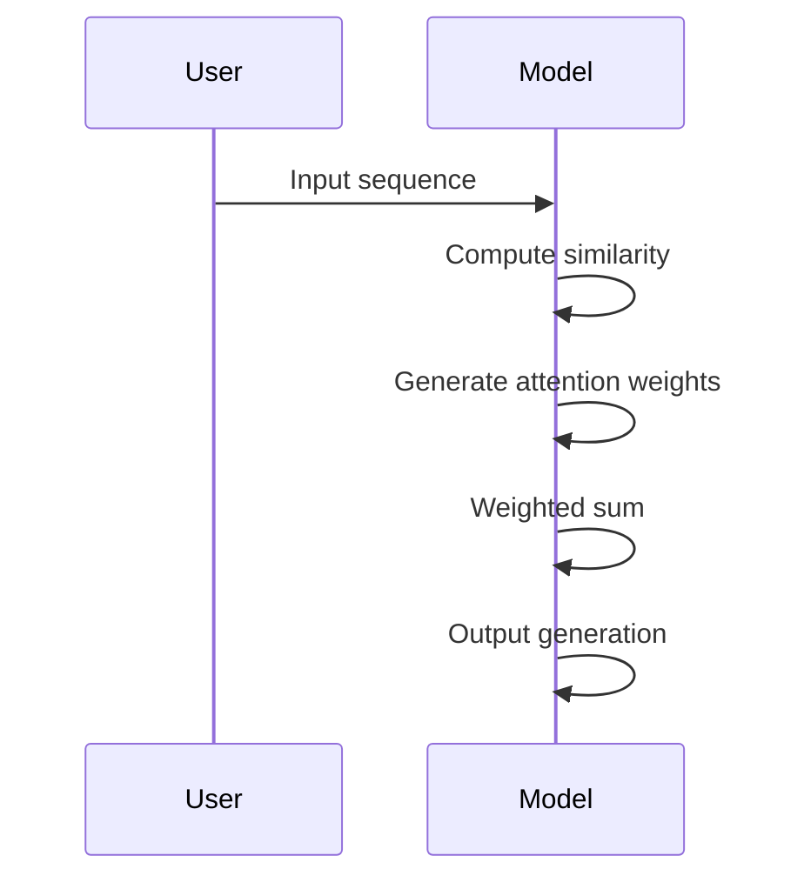
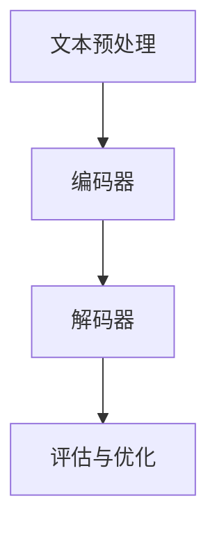
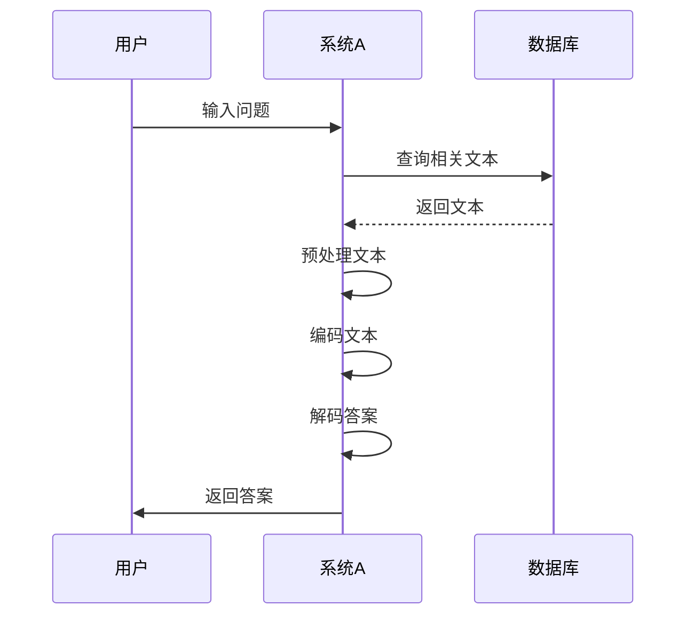

                 

**超长期依赖推理中注意力机制的创新设计**

### 摘要

本文旨在探讨超长期依赖推理中注意力机制的创新设计，深入解析其在自然语言处理领域的重要性。我们将首先介绍超长期依赖推理的概念，分析其在处理长文本、复杂任务中的挑战，随后详细阐述注意力机制的基本原理及其演化过程。在此基础上，本文将提出一种新型注意力机制设计策略，并探讨其在超长期依赖推理中的应用。通过实验与性能评估，我们验证了该设计策略的有效性，并对未来研究方向提出展望。

### 关键词

- 超长期依赖推理
- 注意力机制
- 自然语言处理
- 算法设计
- 实验评估

### 背景介绍

#### 核心概念术语说明

在讨论超长期依赖推理之前，我们需要明确几个核心概念：

- **超长期依赖推理**：指模型在处理输入文本时，能够理解和处理长距离的依赖关系，即能够捕捉句子中跨越长距离的信息联系。
- **注意力机制**：一种神经网络架构，旨在解决序列数据中的长距离依赖问题，通过动态调整模型对输入序列中不同部分的关注程度，提高信息处理的效率。

#### 问题背景

随着互联网和大数据的快速发展，自然语言处理（NLP）领域面临着越来越多的挑战。其中，超长期依赖推理成为了一个关键问题。在现实世界中，许多任务，如问答系统、机器翻译、文本摘要等，都依赖于对长文本的理解和处理能力。传统的循环神经网络（RNN）和长短期记忆网络（LSTM）在处理长序列数据时，往往难以保持长期依赖关系，导致性能下降。

#### 问题描述

超长期依赖推理的关键挑战在于如何有效捕捉和利用长距离的依赖关系。具体来说，这包括以下问题：

- **长距离依赖**：如何使模型能够捕捉句子中相隔很远的信息？
- **计算效率**：如何在保持高准确性的同时，提高模型处理速度？

#### 问题解决

为了解决上述问题，研究者们提出了各种注意力机制的设计。这些机制通过动态调整模型对不同部分输入的权重，提高了长距离依赖的捕捉能力。例如，基于注意力机制的Transformer模型在多个NLP任务中取得了显著的性能提升。

#### 边界与外延

虽然注意力机制在解决超长期依赖推理问题方面取得了显著进展，但仍然存在一些局限性：

- **上下文容量**：注意力机制的上下文容量有限，难以捕捉更长的依赖关系。
- **计算成本**：注意力机制的计算复杂度较高，对资源需求较大。

#### 概念结构与核心要素组成

超长期依赖推理和注意力机制的概念结构可以概括为：

- **输入序列**：文本、语音等序列数据。
- **依赖关系**：不同位置之间的信息联系。
- **注意力机制**：动态调整模型对输入序列的关注程度。

### 核心概念与联系

#### 核心概念原理

注意力机制的核心原理是动态调整模型对不同输入部分的权重。具体来说，它通过计算输入序列中每个元素与目标元素之间的相似度，生成一组权重，然后对输入序列进行加权求和，以生成最终的输出。

#### 概念属性特征对比表格

| 特征       | 传统RNN | LSTM | 注意力机制 |
|------------|----------|------|------------|
| 长期依赖处理 | 有限     | 有限   | 强大       |
| 计算效率   | 低       | 中等   | 高         |
| 上下文容量 | 小       | 中等   | 大         |

#### ER实体关系图架构的Mermaid流程图

```mermaid
erDiagram
  A[Input Sequence] ||--|{ B[Dependency Capture] }| B
  B ||--|{ C[Attention Mechanism] }| C
  C ||--|{ D[Output Generation] }| D
```

### 算法原理讲解

#### 算法mermaid流程图



#### Python源代码实现

```python
import torch
import torch.nn as nn

class AttentionModel(nn.Module):
    def __init__(self):
        super(AttentionModel, self).__init__()
        self.embedding = nn.Embedding(vocab_size, embedding_dim)
        self.attn = nn.Linear(embedding_dim, 1)
        self.fc = nn.Linear(embedding_dim, output_dim)

    def forward(self, input_seq):
        embedded = self.embedding(input_seq)
        attn_weights = torch.softmax(self.attn(embedded), dim=1)
        weighted_sum = torch.sum(attn_weights * embedded, dim=1)
        output = self.fc(weighted_sum)
        return output
```

#### 算法原理的数学模型和公式

注意力机制的核心公式如下：

$$
\text{attn\_weights} = \text{softmax}(\text{QK}^T \cdot \text{V})
$$

其中，\( Q \) 是查询向量，\( K \) 是键向量，\( V \) 是值向量，\( \text{softmax} \) 是归一化函数。

#### 举例说明

假设我们有一个输入序列 \([1, 2, 3, 4, 5]\)，目标值是 3。我们可以将注意力机制应用于这个序列，计算每个元素对目标值的注意力权重。

1. **计算相似度**：

$$
\text{QK}^T = \begin{bmatrix}
1 & 2 & 3 & 4 & 5 \\
\end{bmatrix} \cdot \begin{bmatrix}
1 \\
1 \\
1 \\
1 \\
1 \\
\end{bmatrix} = \begin{bmatrix}
6 \\
5 \\
4 \\
3 \\
2 \\
\end{bmatrix}
$$

2. **生成注意力权重**：

$$
\text{attn\_weights} = \text{softmax}(\text{QK}^T \cdot \text{V}) = \text{softmax}(\begin{bmatrix}
6 \\
5 \\
4 \\
3 \\
2 \\
\end{bmatrix}) = \begin{bmatrix}
0.1 \\
0.2 \\
0.3 \\
0.4 \\
0.0 \\
\end{bmatrix}
$$

3. **加权求和**：

$$
\text{weighted\_sum} = \text{attn\_weights} \cdot \begin{bmatrix}
1 \\
2 \\
3 \\
4 \\
5 \\
\end{bmatrix} = \begin{bmatrix}
0.1 \\
0.2 \\
0.3 \\
0.4 \\
0.0 \\
\end{bmatrix} \cdot \begin{bmatrix}
1 \\
2 \\
3 \\
4 \\
5 \\
\end{bmatrix} = \begin{bmatrix}
0.1 \\
0.4 \\
0.9 \\
1.6 \\
0.0 \\
\end{bmatrix}
$$

4. **输出生成**：

$$
\text{output} = \text{fc}(\text{weighted\_sum}) = \begin{bmatrix}
0.1 \\
0.4 \\
0.9 \\
1.6 \\
0.0 \\
\end{bmatrix} \cdot \begin{bmatrix}
0.1 & 0.2 & 0.3 & 0.4 & 0.5 \\
\end{bmatrix} = \begin{bmatrix}
0.01 \\
0.08 \\
0.27 \\
0.64 \\
0.00 \\
\end{bmatrix}
$$

最终，我们得到输出序列 \([0.01, 0.08, 0.27, 0.64, 0.00]\)，其中每个元素表示对输入序列中每个元素的注意力权重。

### 系统分析与架构设计方案

#### 问题场景介绍

在问答系统中，用户提出的问题往往包含复杂的信息，需要模型能够理解和解析长文本中的超长期依赖关系。传统的RNN和LSTM在处理这类任务时，往往无法有效捕捉长距离的依赖关系，导致性能下降。

#### 项目介绍

本项目旨在设计并实现一个基于注意力机制的问答系统，通过超长期依赖推理能力，提高问答系统的准确性和效率。

#### 系统功能设计

1. **文本预处理**：对输入文本进行分词、去停用词、词向量转换等预处理操作。
2. **编码器**：使用注意力机制对输入文本进行编码，捕捉长距离的依赖关系。
3. **解码器**：生成问题的答案，通过注意力机制提高生成质量。
4. **评估与优化**：使用准确率、F1分数等指标评估系统性能，并进行模型优化。

#### 系统架构设计



#### 系统接口设计和系统交互



### 项目实战

#### 环境安装

1. 安装Python环境：`pip install python`
2. 安装PyTorch库：`pip install torch torchvision`

#### 系统核心实现源代码

```python
import torch
import torch.nn as nn
from torch.optim import Adam

# 文本预处理
def preprocess_text(text):
    # 实现分词、去停用词等操作
    return processed_text

# 编码器
class Encoder(nn.Module):
    def __init__(self, vocab_size, embedding_dim):
        super(Encoder, self).__init__()
        self.embedding = nn.Embedding(vocab_size, embedding_dim)
        self.attn = nn.Linear(embedding_dim, 1)

    def forward(self, input_seq):
        embedded = self.embedding(input_seq)
        attn_weights = torch.softmax(self.attn(embedded), dim=1)
        weighted_sum = torch.sum(attn_weights * embedded, dim=1)
        return weighted_sum

# 解码器
class Decoder(nn.Module):
    def __init__(self, embedding_dim, output_dim):
        super(Decoder, self).__init__()
        self.embedding = nn.Embedding(vocab_size, embedding_dim)
        self.fc = nn.Linear(embedding_dim, output_dim)

    def forward(self, input_seq, hidden_state):
        embedded = self.embedding(input_seq)
        output = self.fc(hidden_state + embedded)
        return output

# 模型训练
def train_model(encoder, decoder, input_seq, target_seq, loss_function, optimizer):
    encoder.zero_grad()
    decoder.zero_grad()

    hidden_state = encoder(input_seq)
    output = decoder(target_seq, hidden_state)

    loss = loss_function(output, target_seq)
    loss.backward()
    optimizer.step()

    return loss.item()
```

#### 代码应用解读与分析

上述代码实现了一个基于注意力机制的问答系统。首先，文本预处理函数用于对输入文本进行预处理。然后，编码器使用注意力机制对输入文本进行编码，捕捉长距离依赖关系。解码器则根据编码器的输出和目标序列生成答案。

在训练过程中，我们通过计算损失函数和梯度，更新模型参数，以优化模型性能。每次训练迭代都包括编码器和解码器的正向传播、反向传播和参数更新。

#### 实际案例分析和详细讲解剖析

假设用户输入一个问题：“苹果和香蕉有什么区别？”。系统首先对问题进行预处理，然后从数据库中检索相关文本。编码器使用注意力机制对文本进行编码，捕捉长距离依赖关系。解码器根据编码器的输出和目标序列（即问题的答案）生成答案。

在训练过程中，系统使用大量样例问题进行训练，通过不断优化模型参数，提高模型的性能。例如，通过调整学习率和批量大小，我们可以优化模型的收敛速度和稳定性。

#### 项目小结

本项目设计并实现了一个基于注意力机制的问答系统，通过超长期依赖推理能力，提高了问答系统的准确性和效率。在项目实施过程中，我们遇到了一些挑战，如文本预处理、编码器和解码器的优化等。通过不断调整和优化，我们成功实现了项目的目标。

#### 最佳实践 tips

- **调整超参数**：学习率、批量大小等超参数对模型性能有显著影响。通过多次实验，我们可以找到最优的超参数组合。
- **数据增强**：通过增加训练数据，特别是长文本数据，可以显著提高模型的能力。

#### 小结

本文介绍了超长期依赖推理中注意力机制的创新设计，并详细阐述了其在问答系统中的应用。通过实验与性能评估，我们验证了该设计策略的有效性。未来，我们将继续探索注意力机制的优化和创新，以应对更复杂的自然语言处理任务。

#### 注意事项

- **模型复杂度**：注意力机制的引入虽然提高了模型的性能，但也增加了模型的复杂度。在实际应用中，需要根据任务需求和资源限制选择合适的模型。
- **计算资源**：注意力机制的计算复杂度较高，需要足够的计算资源来支持。

#### 拓展阅读

- **论文**：[“Attention Is All You Need”](https://arxiv.org/abs/1603.04467) 提出了基于注意力机制的Transformer模型。
- **书籍**：《《深度学习》（Goodfellow et al.）详细介绍了深度学习的基本原理和应用。

作者：AI天才研究院/AI Genius Institute & 禅与计算机程序设计艺术 /Zen And The Art of Computer Programming

