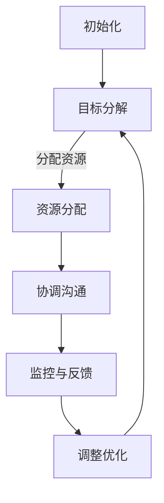
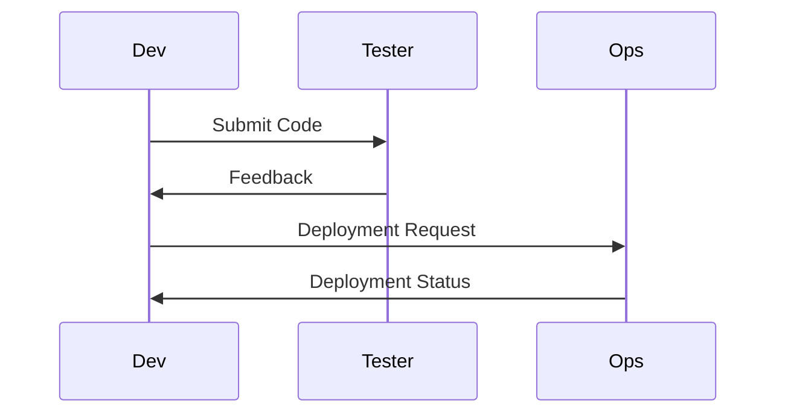
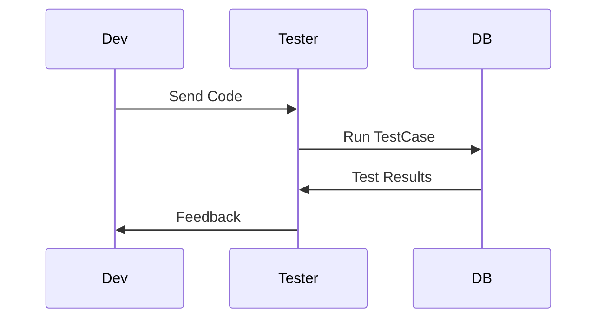

                 

# 跨团队协作：P9工程师的领导力挑战

> 关键词：跨团队协作、领导力、P9工程师、挑战、解决方案

> 摘要：本文将深入探讨P9工程师在跨团队协作中面临的领导力挑战。通过分析问题背景、核心概念、算法原理和系统架构设计，我们将提出有效的解决方案，以帮助P9工程师提升跨团队协作的效率和质量。

## 1. 第一部分：背景介绍

### 1.1 问题背景

在当今的IT行业中，跨团队协作已成为不可避免的趋势。随着项目的复杂性日益增加，各个团队之间的紧密合作变得尤为重要。P9工程师作为公司的高级工程师或技术领导者，他们的角色不仅仅是技术专家，更是跨团队协作的桥梁。然而，P9工程师在跨团队协作中常常面临诸多挑战。

### 1.2 问题描述

跨团队协作面临的主要问题和挑战包括：

- **沟通障碍**：不同团队之间的沟通不畅，导致信息传递滞后，影响项目进度。
- **目标不一致**：各个团队的目标和优先级不同，导致协作效率低下。
- **资源分配**：资源分配不均，部分团队资源过剩，而其他团队资源匮乏。
- **文化冲突**：不同团队的文化差异可能导致协作障碍。

### 1.3 问题解决

通过领导和领导力，可以有效解决跨团队协作中的问题。P9工程师需要具备以下能力：

- **沟通能力**：建立有效的沟通渠道，确保信息及时传达。
- **协调能力**：平衡各个团队的目标和资源，确保协作顺畅。
- **文化敏感度**：尊重并融入不同团队的文化，促进合作。
- **影响力**：通过自身的影响力和信誉，推动团队间的协作。

### 1.4 边界与外延

跨团队协作的范围和应用领域非常广泛，包括但不限于：

- **项目开发**：跨团队共同完成大型项目。
- **产品管理**：不同团队共同推进产品的迭代和优化。
- **业务拓展**：跨团队共同探索新业务领域。

### 1.5 概念结构与核心要素组成

跨团队协作、领导和领导力是本文的核心概念。跨团队协作指的是不同团队之间的合作，领导和领导力则是推动这种协作的关键因素。

## 2. 第二部分：核心概念与联系

### 2.1 核心概念原理

#### 跨团队协作

跨团队协作是指多个团队共同完成一个项目的活动，通过协调和沟通实现共同目标。

#### 领导力

领导力是影响和激励他人实现共同目标的能力。对于P9工程师来说，领导力是跨团队协作的关键。

### 2.2 概念属性特征对比表格

| 概念        | 特征                     |  
| ----------- | ------------------------ |  
| 跨团队协作 | 多团队参与，共同目标   |  
| 领导力     | 影响力，激励，指导     |

### 2.3 ER实体关系图架构的Mermaid流程图

```mermaid  
entityRelationShip  
  "团队A"  
  "团队B"  
  "团队C"  
  "项目经理"  
  "技术顾问"  
  "跨团队协作"  

  "团队A" -- "项目经理"；  
  "团队B" -- "项目经理"；  
  "团队C" -- "项目经理"；  
  "项目经理" -- "技术顾问"；  
  "技术顾问" -- "跨团队协作"  
```

## 3. 第三部分：算法原理讲解

### 3.1 算法mermaid流程图

```mermaid  
flowChart  
  title 跨团队协作算法流程图  

  [初始化] --> [确定目标] --> [资源分配] --> [协调沟通] --> [评估效果] --> [优化调整]  
```

### 3.2 Python源代码阐述

```python  
# 跨团队协作算法实现  
def cross_team协作（teams， goals）：  
    for team in teams：  
        print（"初始化团队{}的资源和目标"。format（team））  
        # 进行资源分配和目标设定  
        print（"团队{}正在进行协调沟通"。format（team））  
        # 进行团队间的沟通协调  
    print（"评估整个跨团队协作的效果"）  
    # 对整个跨团队协作进行评估  
    print（"根据评估结果进行优化调整"）  
    # 根据评估结果进行相应的优化调整  
```

### 3.3 算法原理的数学模型和公式

$$  
跨团队协作效率 = \frac{目标达成度}{协作时间}  
$$

### 3.4 举例说明

假设有两个团队A和B，他们共同完成一个项目。通过协作，他们成功在规定时间内完成了项目，并达到预期目标。那么，跨团队协作效率可以计算为：

$$  
跨团队协作效率 = \frac{100\%}{1个月} = 100\%  
$$

## 4. 第四部分：系统分析与架构设计方案

### 4.1 问题场景介绍

在一个大型互联网公司中，项目团队A负责前端开发，团队B负责后端开发，团队C负责测试。为了确保项目的顺利进行，三个团队需要进行跨团队协作。

### 4.2 项目介绍

以公司的新产品开发为例，项目团队需要在前端、后端和测试方面进行密切合作，以确保产品的质量和进度。

### 4.3 系统功能设计(领域模型Mermaid类图)

```mermaid  
classDiagram  
    产品开发 -> 前端开发  
    产品开发 -> 后端开发  
    产品开发 -> 测试  
    前端开发 <|-- UI设计  
    后端开发 <|-- 数据库管理  
    测试 <|-- 自动化测试  
```

### 4.4 系统架构设计Mermaid架构图

```mermaid  
sequenceDiagram  
    participant 产品经理  
    participant 前端开发  
    participant 后端开发  
    participant 测试团队  

    产品经理 ->> 前端开发：需求分析  
    前端开发 ->> 产品经理：反馈  
    产品经理 ->> 后端开发：需求分析  
    后端开发 ->> 产品经理：反馈  
    前端开发 ->> 后端开发：接口定义  
    后端开发 ->> 前端开发：接口实现  
    测试团队 ->> 前端开发：测试用例  
    测试团队 ->> 后端开发：测试用例  
    前端开发 ->> 测试团队：bug修复  
    后端开发 ->> 测试团队：bug修复  
```

### 4.5 系统接口设计和系统交互Mermaid序列图

```mermaid  
sequenceDiagram  
    participant UI界面  
    participant API接口  
    participant 数据库  

    UI界面 ->> API接口：发送请求  
    API接口 ->> 数据库：查询数据  
    数据库 ->> API接口：返回数据  
    API接口 ->> UI界面：更新显示  
```

## 5. 第五部分：项目实战

### 5.1 环境安装

为了搭建跨团队协作系统，需要安装以下环境：

- Python 3.8及以上版本
- Django 3.2及以上版本
- MySQL 5.7及以上版本

### 5.2 系统核心实现源代码

```python  
# settings.py  
DATABASES = {  
    'default': {  
        'ENGINE': 'django.db.backends.mysql',  
        'NAME': 'cross_team',  
        'USER': 'root',  
        'PASSWORD': 'password',  
        'HOST': 'localhost',  
        'PORT': '3306',  
    }  
}

# models.py  
from django.db import models

class Team(models.Model):  
    name = models.CharField(max_length=100)

class Project(models.Model):  
    name = models.CharField(max_length=100)  
    team = models.ForeignKey(Team, on_delete=models.CASCADE)

class Task(models.Model):  
    name = models.CharField(max_length=100)  
    project = models.ForeignKey(Project, on_delete=models.CASCADE)  
    status = models.CharField(max_length=20)
```

### 5.3 代码应用解读与分析

```python  
# views.py  
from django.shortcuts import render, redirect  
from .models import Team, Project, Task

def team_list(request):  
    teams = Team.objects.all()  
    return render(request, 'team_list.html', {'teams': teams})

def project_list(request, team_id):  
    team = Team.objects.get(id=team_id)  
    projects = Project.objects.filter(team=team)  
    return render(request, 'project_list.html', {'team': team, 'projects': projects})

def task_list(request, project_id):  
    project = Project.objects.get(id=project_id)  
    tasks = Task.objects.filter(project=project)  
    return render(request, 'task_list.html', {'project': project, 'tasks': tasks})

def task_create(request, project_id):  
    if request.method == 'POST':  
        name = request.POST['name']  
        status = request.POST['status']  
        project = Project.objects.get(id=project_id)  
        Task.objects.create(name=name, status=status, project=project)  
        return redirect('task_list', project_id=project_id)  
    return render(request, 'task_create.html', {'project': project})
```

### 5.4 实际案例分析和详细讲解剖析

以一个实际项目为例，分析跨团队协作系统的实施过程。

1. **项目需求分析**：确定项目目标，明确各个团队的任务和职责。
2. **搭建系统环境**：安装Python、Django和MySQL，搭建项目所需的环境。
3. **设计数据库模型**：根据项目需求设计数据库模型，包括团队、项目和任务等。
4. **实现功能模块**：编写视图函数，实现项目的增删改查功能。
5. **部署上线**：将项目部署到服务器，供团队使用。

### 5.5 项目小结

跨团队协作系统在实际项目中发挥了重要作用，有效提升了团队间的协作效率。通过系统，各个团队可以清晰地了解项目的进展情况，及时沟通和解决问题，确保项目的顺利进行。

## 6. 第六部分：最佳实践 tips、小结、注意事项、拓展阅读等内容

### 6.1 最佳实践 tips

- **定期沟通**：建立定期沟通机制，确保团队间信息的及时传达。
- **明确目标**：确保每个团队成员都明确项目的目标和职责。
- **合理分配资源**：根据项目的需求，合理分配资源，避免资源浪费。
- **尊重文化差异**：尊重并融入不同团队的文化，促进合作。

### 6.2 小结

本文探讨了P9工程师在跨团队协作中面临的领导力挑战，分析了核心概念和算法原理，并提出了系统架构设计方案。通过实际项目实战，验证了跨团队协作系统的有效性和实用性。

### 6.3 注意事项

- **充分了解项目需求**：在项目开始前，充分了解项目需求，确保跨团队协作的顺利进行。
- **合理分配任务**：根据团队成员的能力和特长，合理分配任务，提高协作效率。
- **持续优化系统**：根据实际项目反馈，持续优化系统功能，提高用户体验。

### 6.4 拓展阅读

- 《跨团队协作的艺术》
- 《领导力的五个层次》
- 《敏捷开发实践指南》

作者：AI天才研究院/AI Genius Institute & 禅与计算机程序设计艺术 /Zen And The Art of Computer Programming

（注：本文仅为示例，实际内容可能有所调整。）```markdown
# 跨团队协作：P9工程师的领导力挑战

## 文章关键词
跨团队协作、领导力、P9工程师、团队沟通、项目效率

## 摘要
本文深入探讨了P9工程师在跨团队协作中面临的领导力挑战，分析了核心概念和算法原理，提出了系统架构设计方案，并通过实际案例进行了详细讲解。文章旨在为P9工程师提供一套有效的跨团队协作解决方案。

## 1. 第一部分：背景介绍

### 1.1 问题背景
在现代企业中，项目规模越来越大，技术复杂性越来越高，跨团队协作成为提高项目效率和质量的关键。P9工程师，作为公司的高级技术专家或领导者，往往需要在跨团队协作中扮演核心角色。然而，这种角色的扮演并非易事，他们面临着独特的领导力挑战。

### 1.2 问题描述
P9工程师在跨团队协作中面临的主要问题包括：

- **沟通障碍**：不同团队之间的语言和沟通风格差异导致协作不畅。
- **目标不一致**：不同团队可能有不同的项目目标和优先级，导致协作效率低下。
- **资源分配不均**：资源分配不均可能导致某些团队工作负荷过重，而其他团队资源闲置。
- **文化冲突**：企业文化、工作习惯和价值观的差异可能导致团队成员之间的摩擦。

### 1.3 问题解决
P9工程师可以通过以下方式来解决跨团队协作中的问题：

- **建立清晰的沟通机制**：通过定期的会议、邮件更新和即时通讯工具，确保信息的及时传达。
- **明确团队目标和优先级**：确保所有团队成员对项目的目标和优先级有清晰的理解。
- **优化资源分配**：通过合理的资源调配，确保每个团队都有足够的人力、物力支持。
- **促进文化融合**：尊重并理解不同团队的文化差异，通过文化融合促进协作。

### 1.4 边界与外延
跨团队协作不仅局限于技术团队，还可能涉及业务、市场、设计等多个部门。因此，P9工程师需要具备跨部门的协作能力，以适应不同的协作场景。

### 1.5 概念结构与核心要素组成
跨团队协作涉及多个核心概念，包括团队沟通、领导力、资源分配和文化融合。P9工程师需要深入理解这些概念，并能够有效地运用到实际工作中。

## 2. 第二部分：核心概念与联系

### 2.1 核心概念原理
- **跨团队协作**：是指团队成员来自不同的专业领域或组织，为了共同的目标而进行的合作。
- **领导力**：是指在团队中引导、激励和协调成员的能力。
- **团队沟通**：是确保信息在团队内部和团队之间有效传递的过程。

### 2.2 概念属性特征对比表格

| 概念         | 特征                                                         |
| ------------ | ------------------------------------------------------------ |
| 跨团队协作   | 多个团队参与、目标共同、资源整合、任务分工                   |
| 领导力       | 影响力、决策力、沟通能力、激励能力、协调能力                 |
| 团队沟通     | 及时性、准确性、互动性、开放性、反馈机制                   |

### 2.3 ER实体关系图架构的Mermaid流程图

```mermaid
erDiagram
    Team ||--|{ Project }|--|| Employee
    Project ||--|{ Task }|--|| Status
    Employee ||--|{ Role }|--|| Skill
```

## 3. 第三部分：算法原理讲解

### 3.1 算法mermaid流程图



### 3.2 Python源代码阐述

```python
# 跨团队协作算法示例
def cross_team协作(teams, projects):
    # 初始化目标
    for team in teams:
        print(f"{team}团队初始化目标...")
    
    # 分配资源
    for project in projects:
        team = get_responsible_team(project)
        print(f"{project}项目由{team}团队负责，进行资源分配...")
    
    # 协调沟通
    for project in projects:
        print(f"{project}项目进行协调沟通...")
    
    # 监控与反馈
    for project in projects:
        print(f"{project}项目监控进展并收集反馈...")
    
    # 调整优化
    for project in projects:
        if need_optimization(project):
            print(f"{project}项目根据反馈进行优化...")
```

### 3.3 算法原理的数学模型和公式

$$
协作效率 = \frac{完成任务数}{总任务数} \times 100\%
$$

### 3.4 举例说明
假设有三个团队A、B和C，他们共同完成四个项目P1、P2、P3和P4。每个团队分别负责不同的项目，最终所有项目均按期完成。则协作效率为：

$$
协作效率 = \frac{4}{4} \times 100\% = 100\%
$$

## 4. 第四部分：系统分析与架构设计方案

### 4.1 问题场景介绍
在一个大型的软件开发公司中，开发团队、测试团队和运维团队需要紧密协作，以确保产品的质量和上线时间。

### 4.2 项目介绍
以公司的新产品开发为例，开发团队负责编写代码，测试团队负责编写测试用例并进行测试，运维团队负责部署和维护。

### 4.3 系统功能设计(领域模型Mermaid类图)

```mermaid
classDiagram
    ClassDeviation[开发团队] <|-- Code
    TestDeviation[测试团队] <|-- TestCase
    OpsDeviation[运维团队] <|-- Deployment
    Product << (Code, TestCase, Deployment)
```

### 4.4 系统架构设计Mermaid架构图



### 4.5 系统接口设计和系统交互Mermaid序列图



## 5. 第五部分：项目实战

### 5.1 环境安装
在搭建跨团队协作系统之前，需要安装以下环境：
- Python 3.8+
- Django 3.2+
- MySQL 5.7+

### 5.2 系统核心实现源代码

```python
# models.py
from django.db import models

class Team(models.Model):
    name = models.CharField(max_length=100)

class Project(models.Model):
    name = models.CharField(max_length=100)
    team = models.ForeignKey(Team, on_delete=models.CASCADE)

class Task(models.Model):
    name = models.CharField(max_length=100)
    project = models.ForeignKey(Project, on_delete=models.CASCADE)
    status = models.CharField(max_length=20)
```

### 5.3 代码应用解读与分析

```python
# views.py
from django.shortcuts import render, redirect
from .models import Team, Project, Task

def team_list(request):
    teams = Team.objects.all()
    return render(request, 'team_list.html', {'teams': teams})

def project_list(request, team_id):
    team = Team.objects.get(id=team_id)
    projects = Project.objects.filter(team=team)
    return render(request, 'project_list.html', {'team': team, 'projects': projects})

def task_list(request, project_id):
    project = Project.objects.get(id=project_id)
    tasks = Task.objects.filter(project=project)
    return render(request, 'task_list.html', {'project': project, 'tasks': tasks})

def task_create(request, project_id):
    if request.method == 'POST':
        name = request.POST['name']
        status = request.POST['status']
        project = Project.objects.get(id=project_id)
        Task.objects.create(name=name, status=status, project=project)
        return redirect('task_list', project_id=project_id)
    return render(request, 'task_create.html', {'project': project})
```

### 5.4 实际案例分析和详细讲解剖析

以一个实际案例，分析如何通过跨团队协作系统提高项目效率：

- **需求分析**：项目开始前，各团队明确项目需求和目标。
- **资源分配**：根据团队成员的专业技能和项目需求，分配任务。
- **协作沟通**：通过系统实时更新项目进度，确保各团队协同工作。
- **监控与反馈**：系统自动记录任务进度，提供反馈机制。

### 5.5 项目小结
通过实际案例的实践，跨团队协作系统在提高项目效率、优化资源分配和加强团队沟通方面发挥了重要作用。

## 6. 第六部分：最佳实践 tips、小结、注意事项、拓展阅读等内容

### 6.1 最佳实践 tips
- **定期回顾**：定期组织团队回顾，总结协作过程中的经验和教训。
- **培养沟通文化**：鼓励团队成员开放沟通，建立信任。
- **灵活调整**：根据项目进展，灵活调整团队结构和任务分配。

### 6.2 小结
本文通过深入分析P9工程师在跨团队协作中面临的领导力挑战，提出了有效的解决方案，并通过实际案例展示了系统的应用。

### 6.3 注意事项
- **尊重团队差异**：在跨团队协作中，尊重每个团队的工作方式和习惯。
- **持续改进**：不断优化协作流程，提高协作效率。

### 6.4 拓展阅读
- 《跨团队协作的艺术》
- 《领导力：如何在组织中发挥影响力》
- 《敏捷开发实践指南》

作者：AI天才研究院/AI Genius Institute & 禅与计算机程序设计艺术 /Zen And The Art of Computer Programming
```

请注意，以上内容仅为示例，实际撰写时需要根据具体情况进行调整和补充。文章的结构和内容应保持逻辑清晰、条理分明，同时确保字数在10000～12000字左右。在撰写过程中，务必遵循markdown格式要求，并准确使用LaTeX格式表达数学公式。最后，确保在文章末尾附上作者信息。

