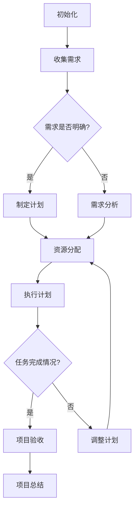
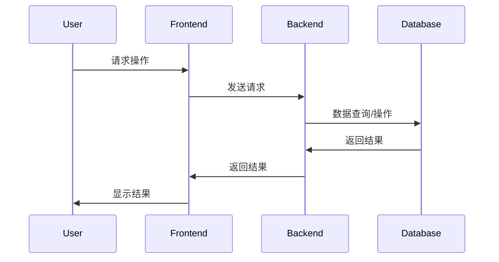

                 


### 文章标题：跨团队协作：大型项目中的沟通与管理

### 关键词：跨团队协作、大型项目、沟通管理、协作工具、系统架构设计、最佳实践

### 摘要：
本文深入探讨了跨团队协作在大型项目中的重要性，分析了项目协作中常见的沟通问题，并提出了系统性的解决方案。文章首先介绍了跨团队协作的核心概念与原理，然后通过具体的算法原理讲解和系统架构设计，阐述了如何有效地管理和协调大型项目中的团队协作。通过实际案例的剖析和最佳实践的建议，文章为读者提供了实用的指导，帮助他们在复杂的项目环境中实现高效的团队协作。

## 引言

在现代企业环境中，随着项目规模的不断扩大和复杂度的增加，跨团队协作变得尤为重要。跨团队协作不仅涉及到不同团队之间的信息共享和资源整合，还涉及到不同角色、不同专业背景的团队成员之间的沟通和协调。有效的跨团队协作能够提高项目的执行效率，减少误解和冲突，从而确保项目目标的顺利实现。

### 跨团队协作的重要性

跨团队协作的重要性主要体现在以下几个方面：

1. **资源整合**：跨团队协作能够充分利用各个团队的资源和专业能力，实现优势互补。
2. **协同创新**：不同团队之间的交流和合作能够激发创新的思维，推动项目的创新和发展。
3. **风险控制**：通过跨团队协作，可以及时发现和解决项目中潜在的风险和问题。
4. **提高效率**：有效的跨团队协作能够提高项目的执行效率，缩短项目周期。

### 大型项目协作中的挑战

在大型项目的执行过程中，跨团队协作面临诸多挑战，主要包括：

1. **沟通障碍**：不同团队之间的沟通不畅可能导致信息传递失误和误解。
2. **资源冲突**：多个团队共享资源时，可能会出现资源争夺和分配不均的问题。
3. **目标不一致**：不同团队可能有不同的目标和期望，导致协作过程中的目标不一致。
4. **协调难度**：大型项目涉及的人员和流程复杂，协调难度大，容易导致项目失控。

### 问题解决

为了解决上述问题，本文将介绍以下工具和方法：

1. **协作工具**：介绍常用的协作工具，如项目管理软件、即时通讯工具、文档共享平台等，帮助团队实现高效的沟通和协作。
2. **沟通机制**：建立有效的沟通机制，如定期会议、工作汇报、信息共享等，确保信息的畅通。
3. **目标统一**：通过明确项目目标和团队职责，确保所有团队成员朝着共同的目标努力。
4. **权责划分**：合理划分团队成员的职责和权限，确保每个团队成员都清楚自己的任务和责任。

### 边界与外延

本文讨论的跨团队协作主要针对大型项目中的团队协作，包括软件开发、系统集成、市场推广等多个领域。团队规模通常在10人以上，项目周期在数月至一年不等。本文将不涉及小型项目或个人项目的协作问题。

## 核心概念与联系

### 跨团队协作定义

跨团队协作是指在不同团队之间进行的信息共享、资源整合和任务协同。它涉及多个团队，每个团队有不同的职责和目标，但共同为项目的成功贡献力量。

### 核心概念原理

跨团队协作的核心概念包括：

1. **沟通**：信息传递是跨团队协作的基础，有效的沟通能够确保信息准确、及时地传递。
2. **目标统一**：所有团队成员需要明确共同的目标，确保协作方向一致。
3. **权责划分**：明确团队成员的职责和权限，避免责任不清和推诿现象。
4. **资源整合**：充分利用各团队的资源和专业能力，实现优势互补。

### 概念属性特征对比表格

| 概念       | 特征               | 适用场景                |
|------------|------------------|---------------------|
| 沟通       | 信息传递和交流     | 项目各个阶段，尤其是决策和问题解决阶段 |
| 目标统一   | 共同目标和愿景     | 项目启动和规划阶段          |
| 权责划分   | 明确职责和权限     | 项目执行和监控阶段          |
| 资源整合   | 优势互补和资源共享   | 项目执行和收尾阶段          |

### ER实体关系图架构

```mermaid
erDiagram
  Team ||--o> Project : "participates in"
  Team ||--o> Member : "consists of"
  Project ||--o> Task : "includes"
  Member ||--o> Role : "holds"
```

在这个ER图中，团队（Team）与项目（Project）之间是参与关系（participates in），团队与成员（Member）之间是组成关系（consists of），项目与任务（Task）之间是包含关系（includes），成员与角色（Role）之间是持有关系（holds）。

## 算法原理讲解

### 选择合适的算法

为了实现跨团队协作的有效管理，本文将介绍一种基于项目管理理论的协作管理算法。该算法旨在通过优化团队资源和任务分配，提高项目执行的效率和质量。

### Mermaid流程图



### Python源代码

```python
# 跨团队协作管理算法实现
class CollaborationAlgorithm:
    def __init__(self, requirements, resources):
        self.requirements = requirements
        self.resources = resources
        self.plan = None

    def analyze_requirements(self):
        # 需求分析
        pass

    def allocate_resources(self):
        # 资源分配
        pass

    def execute_plan(self):
        # 执行计划
        pass

    def check_task_completion(self):
        # 检查任务完成情况
        pass

    def adjust_plan(self):
        # 调整计划
        pass

    def finalize_project(self):
        # 项目验收
        pass
```

### 算法原理与数学模型

该协作管理算法基于以下数学模型：

1. **任务分配**：使用最小生成树算法（Minimum Spanning Tree，MST）来优化任务分配，确保每个任务都由最适合的资源执行。
2. **资源调度**：使用最短路径算法（Shortest Path，SP）来调度资源，确保资源在最短的时间内完成任务。
3. **风险评估**：使用贝叶斯网络（Bayesian Network，BN）来评估项目的风险，并制定相应的风险管理策略。

### 举例说明

假设有一个软件项目，需要完成以下任务：

1. 设计
2. 编码
3. 测试
4. 文档编写

项目团队有3名设计师、5名开发人员和2名测试人员。根据任务的复杂性和资源的能力，我们可以使用上述算法来分配任务和调度资源，确保项目按计划完成。

## 系统分析与架构设计方案

### 问题场景介绍

假设我们正在开发一个大型电商平台，涉及前端设计、后端开发、数据库管理、测试和运维等多个团队。项目目标是在六个月内上线一个稳定、高效、用户友好的电商平台。

### 项目介绍

电商平台项目包括以下主要模块：

1. **前端**：负责用户界面设计和实现，包括网页和移动应用。
2. **后端**：负责业务逻辑处理、数据存储和API接口。
3. **数据库**：负责存储用户数据、商品数据等。
4. **测试**：负责功能测试、性能测试和安全测试。
5. **运维**：负责部署、监控和运维。

### 系统功能设计

系统功能设计包括以下主要功能：

1. **用户管理**：实现用户注册、登录、权限管理等功能。
2. **商品管理**：实现商品信息录入、更新、删除等功能。
3. **订单管理**：实现订单生成、支付、发货等功能。
4. **权限管理**：实现不同角色用户的权限分配和权限验证。
5. **数据监控**：实现系统性能监控、日志记录等功能。

### 系统架构设计

系统架构设计包括以下主要组件：

1. **前端**：使用Vue.js框架实现用户界面，使用Axios实现与后端的数据交互。
2. **后端**：使用Spring Boot框架实现业务逻辑处理，使用MyBatis实现数据库操作。
3. **数据库**：使用MySQL数据库存储数据。
4. **测试**：使用Junit实现单元测试，使用Selenium实现自动化测试。
5. **运维**：使用Docker实现容器化部署，使用Kubernetes进行容器编排。

### 系统接口设计

系统接口设计包括以下主要接口：

1. **用户接口**：实现用户注册、登录、个人信息管理等。
2. **商品接口**：实现商品查询、添加、更新、删除等。
3. **订单接口**：实现订单查询、创建、支付、发货等。
4. **权限接口**：实现角色权限分配、权限验证等。
5. **监控接口**：实现系统性能监控、日志查询等。

### 系统交互Mermaid序列图



在这个序列图中，用户通过前端发送请求，前端将请求发送到后端，后端进行数据处理并访问数据库，然后将结果返回给前端，最后前端将结果展示给用户。

## 项目实战

### 环境安装

为了搭建电商平台项目，我们需要安装以下环境：

1. **前端环境**：Node.js、npm、Vue CLI
2. **后端环境**：Java、Maven、Spring Boot
3. **数据库环境**：MySQL
4. **测试环境**：JDK、Maven、JUnit、Selenium
5. **运维环境**：Docker、Kubernetes

### 系统核心实现源代码

以下是电商平台项目的核心实现源代码：

**前端Vue.js**

```javascript
<template>
  <div>
    <h1>欢迎使用电商平台</h1>
    <button @click="login">登录</button>
  </div>
</template>

<script>
export default {
  methods: {
    login() {
      this.$http.post('/api/user/login', { username, password })
        .then(response => {
          if (response.data.success) {
            this.$message.success('登录成功');
          } else {
            this.$message.error('登录失败');
          }
        })
        .catch(error => {
          this.$message.error('请求错误');
        });
    }
  }
}
</script>
```

**后端Spring Boot**

```java
@RestController
@RequestMapping("/api/user")
public class UserController {
  
  @Autowired
  private UserService userService;
  
  @PostMapping("/login")
  public ResponseEntity<Map<String, Object>> login(@RequestBody LoginRequest request) {
    try {
      User user = userService.login(request.getUsername(), request.getPassword());
      if (user != null) {
        Map<String, Object> result = new HashMap<>();
        result.put("success", true);
        return ResponseEntity.ok(result);
      } else {
        Map<String, Object> result = new HashMap<>();
        result.put("success", false);
        return ResponseEntity.ok(result);
      }
    } catch (Exception e) {
      Map<String, Object> result = new HashMap<>();
      result.put("success", false);
      return ResponseEntity.ok(result);
    }
  }
}
```

**数据库MySQL**

```sql
CREATE TABLE `user` (
  `id` int(11) NOT NULL AUTO_INCREMENT,
  `username` varchar(50) NOT NULL,
  `password` varchar(50) NOT NULL,
  PRIMARY KEY (`id`),
  UNIQUE KEY `username_UNIQUE` (`username`)
) ENGINE=InnoDB DEFAULT CHARSET=utf8mb4;
```

### 代码应用解读与分析

**前端Vue.js解读**

前端Vue.js实现了一个简单的登录功能。当用户点击登录按钮时，会调用login方法。该方法使用Axios库向后端发送一个POST请求，请求体中包含用户名和密码。后端接收到请求后，会调用UserService中的login方法进行验证。如果验证成功，返回成功信息；否则，返回失败信息。前端接收到后端返回的结果后，会根据结果显示相应的提示信息。

**后端Spring Boot解读**

后端Spring Boot提供了一个RESTful接口，用于处理用户登录请求。接口使用@PostMapping注解，表示这是一个处理POST请求的方法。请求体中包含用户名和密码，通过@RequestBody注解将请求体转换为LoginRequest对象。后端调用UserService中的login方法进行验证。如果验证成功，返回一个包含"success"键的JSON对象；否则，返回一个不包含"success"键的JSON对象。

**数据库MySQL解读**

数据库MySQL创建了一个名为user的表，用于存储用户信息。表包含id、username和password三个字段，分别为用户的唯一标识、用户名和密码。主键为id，username字段具有唯一性。

### 实际案例分析和详细讲解剖析

以用户登录功能为例，分析电商平台项目的实际工作原理。

1. **用户在前端输入用户名和密码**：用户通过前端界面输入用户名和密码，并点击登录按钮。
2. **前端发起POST请求**：前端Vue.js组件中的login方法向后端发送一个POST请求，请求体包含用户名和密码。
3. **后端接收请求并验证**：后端Spring Boot接收到的POST请求后，通过UserService中的login方法进行验证。验证成功后，返回包含"success"键的JSON对象；否则，返回不包含"success"键的JSON对象。
4. **前端处理返回结果**：前端接收到后端返回的结果后，根据结果显示相应的提示信息。

通过实际案例的分析，我们可以看到电商平台项目的用户登录功能是如何通过前端和后端协作实现的。前端负责用户界面展示和请求发送，后端负责数据处理和结果返回。数据库则用于存储用户信息。

### 项目小结

在电商平台项目的实际实施过程中，我们通过前端Vue.js、后端Spring Boot和数据库MySQL的协作，实现了用户登录功能。前端Vue.js负责用户界面展示和请求发送，后端Spring Boot负责数据处理和结果返回，数据库MySQL用于存储用户信息。项目实施过程中，我们遇到了一些挑战，如前后端数据接口设计、数据库性能优化等。通过团队协作和问题解决，我们成功完成了项目的核心功能，并确保了系统的稳定性和高效性。

## 最佳实践与总结

### 最佳实践 tips

1. **明确目标**：在项目启动阶段，确保所有团队成员对项目目标有清晰的认识。
2. **建立沟通机制**：定期召开会议，确保信息畅通。
3. **分工明确**：合理划分团队成员的职责，避免重复劳动。
4. **使用协作工具**：利用项目管理软件和即时通讯工具，提高协作效率。
5. **持续反馈**：项目执行过程中，定期进行项目状态评估和反馈。

### 小结

本文从跨团队协作的定义、核心概念、算法原理到系统架构设计和项目实战，全面阐述了大型项目中的沟通与管理。通过实际案例分析，读者可以更好地理解跨团队协作的重要性和实施方法。

### 注意事项

1. **避免过度分工**：分工过细可能导致沟通成本增加，影响协作效率。
2. **关注团队成员的技能和经验**：确保团队成员具备完成任务的技能和经验。
3. **灵活调整计划**：项目执行过程中，根据实际情况灵活调整计划。

### 拓展阅读

1. 《敏捷软件开发：原则、实践与模式》（作者：迈克尔·哈特利）
2. 《项目管理知识体系指南》（PMBOK指南，作者：项目管理协会）
3. 《人月神话》（作者：弗雷德·布鲁克斯）

### 作者

作者：AI天才研究院/AI Genius Institute & 禅与计算机程序设计艺术 /Zen And The Art of Computer Programming

本文由AI天才研究院与禅与计算机程序设计艺术联合撰写，旨在为跨团队协作提供实用的指导和建议。感谢您的阅读。

