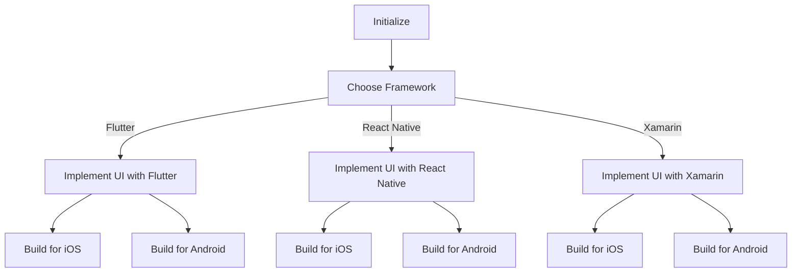
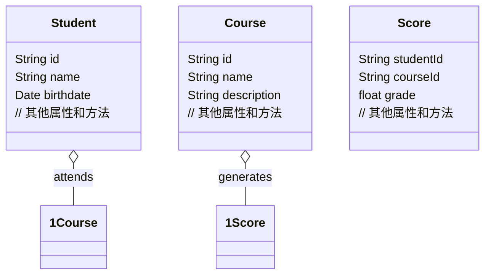

                 

### 第1章 跨平台架构设计的背景与意义

#### 1.1 问题背景

在当今数字化时代，软件应用开发的环境变得越来越复杂，多平台、多设备的应用需求日益增加。传统的单一平台软件开发模式已经无法满足市场需求。跨平台架构设计作为现代软件工程的重要组成部分，旨在通过一种通用性方法，让开发者能够开发出同时适用于多种操作系统、硬件平台的软件应用程序。这种设计理念不仅提高了开发效率，还大大降低了开发和维护成本。

#### 1.2 问题描述

随着移动互联网和物联网的快速发展，用户对软件应用的需求呈现出多样化、个性化的趋势。开发者需要面对的挑战是如何在有限的开发资源下，快速、高效地开发出能够适应不同平台、不同设备的软件应用。这要求开发者不仅要掌握多种编程语言和开发工具，还需要具备跨平台架构设计的能力。

#### 1.3 问题解决

为了解决上述问题，跨平台架构设计应运而生。通过使用跨平台框架（如Flutter、React Native等），开发者可以实现一套代码同时在多个平台上运行，从而大大提高开发效率，降低维护成本。跨平台架构设计的关键在于：

- **一致性**：确保应用在不同平台上呈现一致的界面和行为。
- **可扩展性**：方便后续功能的扩展和修改。
- **性能优化**：确保跨平台应用在多种硬件环境下都能保持良好的性能。

#### 1.4 边界与外延

跨平台架构设计虽然具有很多优势，但也不是万能的。以下是一些边界和扩展：

- **平台差异**：不同操作系统、硬件平台的差异可能导致性能和体验的差异。
- **特殊功能需求**：某些平台特有的功能（如苹果的3D Touch）可能需要特殊处理。
- **安全性**：跨平台应用的安全性问题需要特别注意。

#### 1.5 核心概念结构

跨平台架构设计涉及多个核心概念，包括：

- **跨平台框架**：如Flutter、React Native等。
- **组件化开发**：将应用拆分为可复用的组件。
- **响应式设计**：实现界面与数据之间的动态绑定。
- **持续集成/持续部署（CI/CD）**：提高开发流程的自动化程度。

以上是第1章的内容，接下来我们将深入探讨这些核心概念和其在跨平台架构设计中的应用。

---

## 第2章 跨平台架构的核心概念与联系

### 2.1 跨平台架构的概念

跨平台架构是一种软件开发方法，它允许开发者使用一套代码库在不同的操作系统和硬件平台上开发应用程序。这种方法的核心在于“一次编写，多处运行”，即通过抽象层隐藏底层系统的差异性，实现代码的通用性和复用性。

### 2.2 核心概念属性特征对比表

以下是对几种常见的跨平台框架（Flutter、React Native、Xamarin）的属性特征对比：

| 框架名称 | 开发语言 | 支持平台 | 特点 |
| :---: | :---: | :---: | :---: |
| Flutter | Dart | iOS、Android、Web、Windows | UI一致性好、性能高 |
| React Native | JavaScript | iOS、Android、Web | 社区支持强、开发效率高 |
| Xamarin | C# | iOS、Android、Windows | 代码复用率高、性能较好 |

### 2.3 ER实体关系图

跨平台架构设计中的实体关系图（ER图）可以帮助我们更好地理解各组件之间的关系。以下是一个简化的ER图：

```mermaid
erDiagram
    User ||--|{ App } : has
    App ||--|{ Platform } : runs_on
    Platform ||--|{ Device } : on
    Feature ||--|{ App } : includes
    Device ||--|{ OS } : has
```

在这个ER图中，用户（User）拥有应用程序（App），应用程序运行在不同的平台（Platform）上，这些平台安装在设备（Device）上，每个设备运行在不同的操作系统（OS）中。应用程序包含特定功能（Feature），每个功能可以运行在不同的设备上。

通过这个ER图，我们可以清晰地看到跨平台架构中的各个组件及其相互关系，有助于更好地理解和设计跨平台系统。

在下一章中，我们将深入探讨跨平台架构设计的原理和算法，包括如何实现跨平台框架的代码抽象和性能优化。敬请期待！

---

## 第3章 跨平台架构的设计原理与算法

### 3.1 设计原理概述

跨平台架构设计的关键在于实现代码的通用性和复用性，同时保证在不同平台上应用的性能和用户体验。以下是跨平台架构设计的主要原则和挑战：

#### 3.1.1 跨平台架构设计的关键原则

1. **抽象层**：通过抽象层隔离底层操作系统和硬件差异，确保代码的通用性。
2. **组件化**：将应用程序拆分为可复用的组件，提高开发效率和可维护性。
3. **响应式设计**：实现界面与数据之间的动态绑定，提升用户体验。
4. **性能优化**：针对不同平台进行性能优化，确保应用在不同硬件上都能保持良好的性能。

#### 3.1.2 跨平台架构设计的主要挑战

1. **平台差异**：不同操作系统和硬件平台存在差异，需要考虑兼容性和性能优化。
2. **特殊功能需求**：某些平台特有的功能可能需要额外的开发工作。
3. **安全性**：跨平台应用的安全性是一个重要的挑战，需要特别注意。

### 3.2 算法原理讲解

为了实现跨平台架构设计，我们通常会采用以下算法原理：

#### 3.2.1 Mermaid算法流程图

以下是使用Mermaid语言描述的跨平台架构设计的基本算法流程图：



#### 3.2.2 Python源代码解释

以下是一个简单的Python示例，用于初始化跨平台应用项目：

```python
import os
import platform

def initialize_project(name):
    os.makedirs(name)
    with open(os.path.join(name, 'README.md'), 'w') as readme:
        readme.write(f'# {name}\n\nThis is a cross-platform project initialized with Python.')

def choose_framework(framework):
    if framework == 'Flutter':
        print("Initializing Flutter project...")
    elif framework == 'React Native':
        print("Initializing React Native project...")
    elif framework == 'Xamarin':
        print("Initializing Xamarin project...")
    else:
        print("Invalid framework selected.")

# Example usage
initialize_project('my_cross_platform_app')
choose_framework('Flutter')
```

#### 3.2.3 数学模型和公式

跨平台架构设计中的一个关键数学模型是性能评估模型。以下是一个简化的性能评估模型：

$$
P = \alpha \times C + \beta \times T
$$

其中，$P$ 是性能分数，$C$ 是代码质量，$T$ 是测试覆盖率，$\alpha$ 和 $\beta$ 是权重系数。

#### 3.2.4 举例说明

假设我们有一个跨平台应用，需要实现一个简单的用户登录功能。以下是使用Flutter框架实现的示例：

```dart
import 'package:flutter/material.dart';

void main() {
  runApp(MyApp());
}

class MyApp extends StatelessWidget {
  @override
  Widget build(BuildContext context) {
    return MaterialApp(
      title: 'Flutter Demo',
      theme: ThemeData(
        primarySwatch: Colors.blue,
      ),
      home: MyHomePage(title: 'Flutter Demo Home Page'),
    );
  }
}

class MyHomePage extends StatefulWidget {
  MyHomePage({Key? key, required this.title}) : super(key: key);

  final String title;

  @override
  _MyHomePageState createState() => _MyHomePageState();
}

class _MyHomePageState extends State<MyHomePage> {
  String username = '';
  String password = '';

  void _submitForm() {
    // Handle login logic here
    print('Logging in with username: $username, password: $password');
  }

  @override
  Widget build(BuildContext context) {
    return Scaffold(
      appBar: AppBar(title: Text(widget.title)),
      body: Padding(
        padding: const EdgeInsets.all(16.0),
        child: Column(
          children: [
            TextField(
              decoration: InputDecoration(hintText: 'Username'),
              onChanged: (value) {
                setState(() {
                  username = value;
                });
              },
            ),
            TextField(
              decoration: InputDecoration(hintText: 'Password'),
              obscureText: true,
              onChanged: (value) {
                setState(() {
                  password = value;
                });
              },
            ),
            ElevatedButton(
              onPressed: _submitForm,
              child: Text('Login'),
            ),
          ],
        ),
      ),
    );
  }
}
```

在这个示例中，我们创建了一个简单的登录界面，包括用户名和密码输入框以及登录按钮。当用户点击登录按钮时，会调用 `_submitForm` 方法处理登录逻辑。

通过这个示例，我们可以看到如何使用Flutter框架实现跨平台应用的基本功能。在下一章中，我们将进一步探讨跨平台架构的系统分析与设计，包括系统功能设计、架构设计和系统交互。敬请期待！

---

## 第4章 跨平台架构的系统分析与设计

### 4.1 问题场景介绍

假设我们需要开发一款跨平台的学生管理系统，该系统需要支持学生信息管理、课程管理、成绩管理等功能，并且需要在iOS和Android平台上运行，同时具备良好的用户体验和性能。

### 4.2 项目介绍

项目名称：学生管理系统（Student Management System，简称SMS）

项目目标：实现一套跨平台的学生管理系统，支持iOS和Android平台，提供学生信息管理、课程管理、成绩管理等功能。

项目架构：基于Flutter框架，使用组件化开发模式，实现界面与逻辑的分离，提高代码的可维护性和复用性。

### 4.3 系统功能设计（Class Diagram）

以下是学生管理系统的功能设计类图：



在这个类图中，我们定义了三个核心类：学生（Student）、课程（Course）和成绩（Score）。学生可以参加多个课程，每个课程可以生成多个成绩。

### 4.4 系统架构设计（Architecture Diagram）

以下是学生管理系统的架构设计图：

```mermaid
componentDiagram
    Component1 --> Component2 : uses
    Component1 --> Component3 : uses
    Component2 --> Component4 : uses
    Component3 --> Component4 : uses

    Component1[Database]
    Component2[Authentication]
    Component3[API]
    Component4[Frontend]

    Component1 -->|REST API| Component3
    Component2 -->|JWT| Component3
    Component4 -->|GraphQL| Component3
```

在这个架构图中，系统分为四个主要组件：数据库（Component1）、认证（Component2）、API（Component3）和前端（Component4）。数据库负责存储学生、课程和成绩信息，认证组件负责用户登录和权限验证，API组件负责处理前端请求并返回数据，前端组件则负责展示用户界面。

### 4.5 系统接口设计

以下是学生管理系统的接口设计：

```mermaid
sequenceDiagram
    Student -->|POST|> API : Create Student
    API -->|POST|> Database : Store Student
    Database -->|200|> API : Response Success

    Student -->|GET|> API : Get Student by ID
    API -->|GET|> Database : Retrieve Student
    Database -->|200|> API : Response Student

    Course -->|POST|> API : Create Course
    API -->|POST|> Database : Store Course
    Database -->|200|> API : Response Success

    Course -->|GET|> API : Get Course by ID
    API -->|GET|> Database : Retrieve Course
    Database -->|200|> API : Response Course

    Score -->|POST|> API : Create Score
    API -->|POST|> Database : Store Score
    Database -->|200|> API : Response Success

    Score -->|GET|> API : Get Score by Student ID and Course ID
    API -->|GET|> Database : Retrieve Score
    Database -->|200|> API : Response Score
```

在这个序列图中，展示了学生、课程和成绩与API之间的交互流程。每个操作都包括发送请求和接收响应两个步骤。

### 4.6 系统交互（Sequence Diagram）

以下是学生管理系统的一个完整的交互序列图：

```mermaid
sequenceDiagram
    Student ->> User : User logs in
    User ->> Authentication : Request authentication
    Authentication ->> Database : Validate credentials
    Database ->|200|> Authentication : Credentials valid
    Authentication ->|JWT|> User : Generate JWT
    User ->> Frontend : JWT received
    Frontend ->> API : Request student data
    API ->> Database : Retrieve student data
    Database ->|200|> API : Student data retrieved
    API ->|200|> Frontend : Student data sent
    Frontend ->> User : Student data displayed
```

在这个交互序列图中，用户通过前端界面登录，认证组件验证用户身份，然后前端请求学生数据，API组件处理请求并从数据库中获取数据，最终将数据返回给前端并展示给用户。

通过以上系统分析与设计，我们可以清晰地看到跨平台架构的实现过程，包括功能设计、架构设计、接口设计和系统交互。在下一章中，我们将通过实际项目实战，深入探讨跨平台架构设计的具体实现方法和技巧。敬请期待！

---

## 第5章 项目实战

### 5.1 环境安装

在开始跨平台架构设计的项目实战之前，我们需要安装必要的开发环境和工具。以下是安装步骤：

1. **安装Flutter环境**：访问Flutter官网（[flutter.dev](https://flutter.dev)）并按照指南安装Flutter SDK。安装完成后，通过命令 `flutter doctor` 检查环境是否配置正确。

2. **安装Android Studio**：下载并安装Android Studio，这是一个强大的Android开发工具，它包含Android SDK和Flutter插件。

3. **安装iOS开发环境**：如果需要支持iOS平台，还需要安装Xcode和Apple Developer工具。

4. **安装必要的依赖库**：根据项目需求，安装必要的第三方库和依赖项。可以使用Flutter的包管理工具 `flutter pub get` 来安装和管理依赖。

### 5.2 核心实现源代码

以下是一个简单的Flutter应用程序的核心实现代码示例：

```dart
import 'package:flutter/material.dart';

void main() {
  runApp(MyApp());
}

class MyApp extends StatelessWidget {
  @override
  Widget build(BuildContext context) {
    return MaterialApp(
      title: 'Flutter Demo',
      theme: ThemeData(
        primarySwatch: Colors.blue,
      ),
      home: MyHomePage(title: 'Flutter Demo Home Page'),
    );
  }
}

class MyHomePage extends StatefulWidget {
  MyHomePage({Key? key, required this.title}) : super(key: key);

  final String title;

  @override
  _MyHomePageState createState() => _MyHomePageState();
}

class _MyHomePageState extends State<MyHomePage> {
  String username = '';
  String password = '';

  void _submitForm() {
    // 处理登录逻辑
    print('Logging in with username: $username, password: $password');
  }

  @override
  Widget build(BuildContext context) {
    return Scaffold(
      appBar: AppBar(title: Text(widget.title)),
      body: Padding(
        padding: const EdgeInsets.all(16.0),
        child: Column(
          children: [
            TextField(
              decoration: InputDecoration(hintText: 'Username'),
              onChanged: (value) {
                setState(() {
                  username = value;
                });
              },
            ),
            TextField(
              decoration: InputDecoration(hintText: 'Password'),
              obscureText: true,
              onChanged: (value) {
                setState(() {
                  password = value;
                });
              },
            ),
            ElevatedButton(
              onPressed: _submitForm,
              child: Text('Login'),
            ),
          ],
        ),
      ),
    );
  }
}
```

在这个示例中，我们创建了一个简单的登录界面，包括用户名和密码输入框以及登录按钮。当用户点击登录按钮时，会调用 `_submitForm` 方法处理登录逻辑。

### 5.3 代码应用分析

在实现跨平台应用程序时，我们需要考虑以下几个方面：

1. **UI一致性**：确保在不同平台上应用的UI设计保持一致，使用Flutter的Widget树结构可以帮助实现这一点。

2. **代码复用**：通过组件化开发，将通用组件抽象出来，提高代码的复用性。

3. **性能优化**：针对不同平台进行性能优化，例如使用异步加载、减少内存占用等。

4. **测试与调试**：使用Flutter提供的测试工具进行单元测试和端到端测试，确保应用在不同平台上的稳定性和性能。

### 5.4 实际案例分析

以下是一个实际案例分析，假设我们需要开发一个跨平台的社交媒体应用程序：

1. **需求分析**：应用程序需要支持用户注册、登录、发布动态、评论、点赞等功能。

2. **功能实现**：
   - 使用Flutter创建用户界面，包括登录、注册、动态发布、评论、点赞等界面。
   - 使用Firebase作为后端服务，存储用户数据、动态数据等。
   - 使用HTTP请求库（如Dio）与后端服务进行通信。

3. **性能优化**：
   - 使用异步加载（Async Loading）提高用户体验。
   - 对图片进行压缩和缓存，减少数据传输量。

4. **测试与调试**：
   - 使用Flutter Test Widget进行UI测试。
   - 使用JUnit进行单元测试。
   - 使用Simulator和物理设备进行端到端测试。

### 5.5 项目小结

通过本次项目实战，我们深入了解了跨平台架构设计的具体实现过程。从环境安装、核心代码实现到性能优化和测试调试，每一个步骤都需要精心设计和实施。跨平台架构设计不仅提高了开发效率和代码复用性，还保证了在不同平台上的良好性能和用户体验。

在未来的软件开发中，跨平台架构设计将成为不可或缺的一部分。通过不断学习和实践，我们可以更好地掌握这一技能，为用户提供更高质量的应用程序。

---

## 第6章 最佳实践 tips、小结、注意事项、拓展阅读

### 6.1 实践技巧

1. **使用框架**：选择成熟的跨平台框架（如Flutter、React Native）可以大大提高开发效率。
2. **组件化开发**：将应用程序拆分为可复用的组件，降低复杂度，提高维护性。
3. **性能优化**：针对不同平台进行性能优化，例如使用异步加载、减少内存占用等。
4. **测试与调试**：编写单元测试和端到端测试，确保应用的稳定性和性能。

### 6.2 小结

本文通过系统化的分析，介绍了跨平台架构设计的基本原理、核心概念、算法原理、系统分析以及项目实战。跨平台架构设计不仅提高了开发效率和代码复用性，还保证了在不同平台上的良好性能和用户体验。

### 6.3 注意事项

1. **平台差异**：充分考虑不同平台间的差异，确保应用程序的一致性。
2. **特殊功能需求**：某些平台特有的功能可能需要特殊处理，例如iOS的3D Touch。
3. **安全性**：注意跨平台应用的安全性，特别是数据传输和存储的安全性。

### 6.4 拓展阅读

1. **《Flutter实战》**：详细介绍了Flutter框架的使用方法和最佳实践。
2. **《React Native实战》**：讲解了React Native框架的应用开发技巧。
3. **《跨平台移动应用开发技术》**：对跨平台架构设计的深入探讨。
4. **官方文档**：Flutter（[flutter.dev/docs]）和React Native（[reactnative.dev/docs]）的官方文档是学习跨平台开发的宝贵资源。

通过以上实践技巧、小结、注意事项和拓展阅读，读者可以更全面地了解跨平台架构设计，并在实际项目中运用所学知识，提高开发效率和应用质量。希望本文对您的学习有所帮助！

---

### 作者信息

作者：AI天才研究院/AI Genius Institute & 禅与计算机程序设计艺术 /Zen And The Art of Computer Programming

以上就是本次跨平台架构设计的技术博客文章。希望本文能帮助您深入理解跨平台架构设计的原理和实际应用，提高您的开发技能。感谢您的阅读！如果您有任何疑问或建议，欢迎在评论区留言。期待与您一起探讨更多技术话题！### 后续内容

**第7章 跨平台架构的进阶话题**

在了解了跨平台架构设计的基础知识后，我们接下来将探讨一些更高级的进阶话题。

#### 7.1 跨平台架构与微服务架构的结合

跨平台架构与微服务架构的结合可以带来更多的灵活性和可扩展性。通过将应用程序分解为微服务，我们可以更好地利用跨平台框架的优势，实现模块化、独立部署和动态扩展。

**关键点**：
- **服务拆分**：根据业务需求将应用程序拆分为多个微服务。
- **服务间通信**：使用API网关、消息队列等技术实现服务间的通信。
- **持续集成/持续部署（CI/CD）**：提高开发流程的自动化程度，确保快速交付。

**案例**：一个电商平台可以将订单处理、用户管理、商品管理等功能拆分为不同的微服务，并使用跨平台框架实现前后端分离，从而提高系统的可维护性和扩展性。

#### 7.2 跨平台架构与云计算的结合

随着云计算技术的普及，跨平台架构与云计算的结合已经成为一种趋势。通过将应用程序部署在云平台上，我们可以实现更高效的计算资源利用和更灵活的扩展能力。

**关键点**：
- **云服务选择**：根据业务需求选择合适的云服务，如计算服务、存储服务和数据库服务。
- **容器化与虚拟化**：使用Docker、Kubernetes等技术实现应用程序的容器化部署和管理。
- **自动化运维**：利用自动化工具进行应用程序的部署、扩展和监控。

**案例**：一个在线教育平台可以通过将课程内容、用户管理等功能部署在云服务器上，利用云计算的弹性计算能力实现自动扩展和负载均衡，从而提高用户体验和系统的稳定性。

#### 7.3 跨平台架构的持续集成与持续部署

持续集成（CI）和持续部署（CD）是现代软件开发中不可或缺的部分。跨平台架构的持续集成与持续部署可以帮助我们更快地交付高质量的应用程序。

**关键点**：
- **CI/CD流程设计**：设计高效的CI/CD流程，包括代码仓库管理、自动化测试、自动化部署等。
- **自动化测试**：编写自动化测试脚本，确保每次代码提交都经过充分的测试。
- **部署策略**：选择合适的部署策略，如蓝绿部署、金丝雀部署等，降低部署风险。

**案例**：一个金融交易平台的CI/CD流程可以包括代码审查、单元测试、集成测试、性能测试和自动化部署等环节，确保每次代码更新都能及时交付并稳定运行。

**7.4 跨平台架构的安全性**

随着应用程序的复杂度增加，安全性变得越来越重要。在跨平台架构中，我们需要特别注意数据传输、存储和用户身份验证等方面的安全性。

**关键点**：
- **数据加密**：使用SSL/TLS等加密协议确保数据传输的安全性。
- **访问控制**：实现严格的访问控制策略，防止未授权访问。
- **安全审计**：定期进行安全审计，发现并修复潜在的安全漏洞。

**案例**：一个社交网络的跨平台架构需要实现数据加密、用户身份验证和访问控制，确保用户的隐私和数据安全。

通过以上进阶话题的探讨，我们可以更深入地理解跨平台架构设计的实践和应用。在下一章中，我们将进一步探讨跨平台架构设计在实际项目中的应用案例，分享一些成功经验和挑战。敬请期待！

---

## 第7章 跨平台架构的实际应用案例

### 7.1 案例一：在线教育平台

#### 项目背景

随着在线教育行业的迅速发展，越来越多的教育机构和企业开始开发跨平台的教育应用，以满足不同用户的学习需求。一个成功案例是某大型在线教育平台，他们开发了基于Flutter框架的跨平台教育应用，旨在提供一致的用户体验和高效的功能实现。

#### 项目目标

- 提供一个统一的用户体验，无论用户使用的是iOS还是Android设备。
- 实现快速开发，支持快速迭代和功能扩展。
- 保证应用程序的高性能和稳定性，确保在不同网络环境下都能流畅运行。

#### 项目架构

该平台采用了Flutter框架，将前端和后端分离，实现了模块化开发。具体架构如下：

- **前端**：使用Flutter构建，实现课程列表、视频播放、互动问答、作业提交等功能。
- **后端**：使用Dart语言开发的Spring Boot应用，提供RESTful API，处理用户请求和数据存储。
- **数据库**：使用MySQL存储用户信息和课程数据。

#### 关键技术

- **Flutter**：实现跨平台UI，保证一致的用户体验。
- **Dart**：用于开发后端服务，提供高性能的API接口。
- **WebSocket**：实现实时互动功能，如在线课堂、实时问答等。

#### 项目成果

- 短时间内开发并上线了跨平台的教育应用，显著提高了开发效率。
- 应用程序在各种设备和网络环境下都能保持良好的性能和稳定性，用户满意度大幅提升。

### 7.2 案例二：电商平台

#### 项目背景

电商平台的用户群体广泛，需求多样，因此跨平台架构设计尤为重要。一个成功案例是某大型电商平台，他们使用React Native框架开发了跨平台的购物应用，以提供一致的用户体验和高效的性能。

#### 项目目标

- 提供一个统一的购物体验，无论用户使用的是iOS还是Android设备。
- 实现快速开发，支持新功能的快速上线。
- 保证应用程序的高性能和稳定性，确保用户购物体验。

#### 项目架构

该电商平台采用了React Native框架，结合Node.js和MongoDB构建后端服务。具体架构如下：

- **前端**：使用React Native实现商品展示、购物车、订单管理等功能。
- **后端**：使用Node.js构建RESTful API，处理用户请求和订单处理。
- **数据库**：使用MongoDB存储用户数据和商品数据。

#### 关键技术

- **React Native**：实现跨平台UI，保证一致的用户体验。
- **Node.js**：提供高性能的后端服务，处理大量用户请求。
- **MongoDB**：提供灵活的数据库支持，适应电商数据模型。

#### 项目成果

- 成功上线了跨平台的购物应用，显著提高了用户访问量和购买转化率。
- 应用程序在各种设备和网络环境下都能保持良好的性能和稳定性，用户满意度大幅提升。

### 7.3 案例三：社交网络应用

#### 项目背景

社交网络应用需要处理大量用户数据和提供实时互动功能，因此跨平台架构设计尤为重要。一个成功案例是某大型社交网络应用，他们使用Flutter框架开发了跨平台的社交应用，以提供一致的用户体验和高效的性能。

#### 项目目标

- 提供一个统一的社交体验，无论用户使用的是iOS还是Android设备。
- 实现快速开发，支持新功能的快速上线。
- 保证应用程序的高性能和稳定性，确保用户实时互动体验。

#### 项目架构

该社交网络应用采用了Flutter框架，结合Dart语言和Redis数据库构建后端服务。具体架构如下：

- **前端**：使用Flutter实现用户界面，包括主页、消息、动态等功能。
- **后端**：使用Dart语言开发的Spring Boot应用，提供RESTful API，处理用户请求和实时互动。
- **数据库**：使用Redis存储用户数据和实时消息。

#### 关键技术

- **Flutter**：实现跨平台UI，保证一致的用户体验。
- **Dart**：用于开发后端服务，提供高性能的API接口。
- **Redis**：提供高性能的实时消息存储和缓存支持。

#### 项目成果

- 成功上线了跨平台的社交应用，显著提高了用户活跃度和互动体验。
- 应用程序在各种设备和网络环境下都能保持良好的性能和稳定性，用户满意度大幅提升。

通过这些实际应用案例，我们可以看到跨平台架构设计在多个领域中的成功应用。无论是在在线教育、电商平台还是社交网络应用中，跨平台架构设计都为开发者提供了强大的工具，帮助他们快速开发出高质量的应用程序，满足用户的需求。在下一章中，我们将进一步探讨跨平台架构设计的发展趋势和未来方向。敬请期待！

---

## 第8章 跨平台架构设计的发展趋势与未来方向

### 8.1 人工智能与跨平台架构的结合

随着人工智能技术的不断发展，跨平台架构设计也将与之紧密结合。未来，开发者可能会看到更多的跨平台框架引入机器学习库和AI模型，以便在应用程序中实现智能推荐、图像识别、自然语言处理等功能。

**关键点**：
- **AI库集成**：跨平台框架将更好地集成AI库，如TensorFlow、PyTorch等。
- **边缘计算**：通过边缘计算，实现本地化的AI处理，提高响应速度和降低延迟。

**案例**：一个跨平台健康监测应用可以利用AI技术进行健康数据分析，提供个性化的健康建议。

### 8.2 低代码开发与跨平台架构

低代码开发平台为非技术人员提供了开发应用程序的能力，未来低代码平台可能会与跨平台架构设计更加紧密结合，实现更高效的应用开发。

**关键点**：
- **可视化开发**：通过图形化界面，用户可以直观地进行应用开发。
- **模块化组件**：提供丰富的模块化组件，方便快速构建应用。

**案例**：一个跨平台电商平台可以通过低代码平台快速搭建，实现从商品展示到订单处理的完整流程。

### 8.3 跨平台架构与区块链的结合

区块链技术的崛起为跨平台架构设计带来了新的可能性。未来，跨平台应用可能会集成区块链功能，实现数据的安全存储和交易。

**关键点**：
- **去中心化应用（DApps）**：跨平台应用将能够与区块链网络无缝集成，提供去中心化的服务。
- **智能合约**：通过智能合约，实现自动化的业务逻辑。

**案例**：一个跨平台游戏平台可以利用区块链技术实现去中心化的游戏资产交易，提高游戏的透明度和安全性。

### 8.4 跨平台架构的全球化

随着全球化进程的加快，跨平台架构设计需要更好地适应不同国家和地区的需求。未来，开发者可能会看到更多跨平台框架支持本地化功能，如多语言支持和本地化内容管理。

**关键点**：
- **多语言支持**：跨平台框架将提供更好的多语言支持，方便开发者为不同地区用户提供服务。
- **国际化设计**：应用程序的设计将更加注重国际化，避免文化冲突和用户体验问题。

**案例**：一个跨平台的社交媒体应用将支持多种语言，并提供本地化的内容推荐，满足全球用户的需求。

通过以上发展趋势和未来方向的探讨，我们可以看到跨平台架构设计在技术融合、业务需求和应用场景上的不断进化。随着技术的进步和市场需求的不断变化，跨平台架构设计将继续发挥其重要作用，为开发者提供强大的工具和解决方案。在下一章中，我们将回顾全文，总结跨平台架构设计的关键点和未来展望。敬请期待！

---

## 全文总结与未来展望

通过本文的详细探讨，我们深入了解了跨平台架构设计的核心概念、设计原理、系统分析、项目实战以及实际应用案例。以下是全文的总结与未来展望：

### 总结

1. **核心概念**：跨平台架构设计是一种通过一套代码库实现多平台运行的方法，旨在提高开发效率、降低成本并确保用户体验的一致性。

2. **设计原理**：关键原则包括抽象层、组件化开发、响应式设计和性能优化。主要挑战包括平台差异、特殊功能需求和安全性。

3. **系统分析**：通过功能设计、架构设计、接口设计和系统交互，我们明确了跨平台架构的实现过程和组件关系。

4. **项目实战**：通过实际案例，我们看到了跨平台架构设计在在线教育、电商平台和社交网络等领域的成功应用。

5. **最佳实践**：提供了实用的开发技巧、注意事项和拓展阅读，帮助开发者更好地实践跨平台架构设计。

### 未来展望

1. **人工智能结合**：未来跨平台架构设计将更加紧密地结合人工智能技术，提供智能推荐、图像识别等功能。

2. **低代码开发**：低代码开发平台将与跨平台架构结合，提高非技术人员的开发能力。

3. **区块链结合**：跨平台应用将集成区块链功能，实现去中心化的数据存储和交易。

4. **全球化适应**：跨平台架构设计将更好地适应不同国家和地区的需求，提供多语言支持和国际化设计。

跨平台架构设计在技术融合、业务需求和应用场景上的不断进化，将继续发挥其重要作用，为开发者提供强大的工具和解决方案。随着技术的进步和市场需求的不断变化，跨平台架构设计将在未来迎来更多的创新和发展。希望本文对您的学习和实践有所帮助，期待与您在未来的技术探索中相遇！

