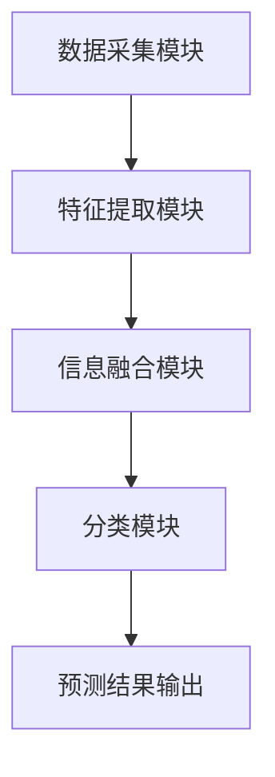

                 


### 跨模态推理中图注意力机制的优化方法

> 关键词：跨模态推理、图注意力机制、优化方法、算法原理、数学模型

> 摘要：本文旨在探讨跨模态推理中图注意力机制的优化方法。首先，我们介绍了跨模态推理和图注意力机制的核心概念及其重要性，然后详细阐述了图注意力机制的优化方法。通过数学模型和算法原理的讲解，结合实例分析，本文深入剖析了跨模态推理中的图注意力机制优化方法，为研究者提供了有价值的参考。

----------------------------------------------------------------

#### 设计过程

为了设计出《跨模态推理中图注意力机制的优化方法》这本书的完整目录大纲，我们需要遵循以下步骤：

1. **理解书名与主题**：
   - 书名明确了主题是关于跨模态推理和图注意力机制的优化方法。
   - 我们需要了解这两个主题的概念、应用场景以及相互关系。

2. **确定核心章节内容**：
   - 根据书名和目标读者，我们需要确定哪些核心内容应该包括在内，例如背景介绍、核心概念、算法原理、数学模型和系统架构设计。

3. **细化目录结构**：
   - 我们需要确保目录结构清晰，分为1级、2级和3级，以便读者能够快速定位到所需的内容。

4. **撰写示例内容**：
   - 为了展示如何撰写每个章节的大纲，我们需要提供一个示例。

5. **内容简洁性**：
   - 我们需要确保每个章节的内容简洁明了，不包含冗余信息。

6. **确保内容完整性**：
   - 目录大纲必须包括核心章节，如背景介绍、核心概念、算法原理、数学模型和系统架构设计等。

7. **格式规范化**：
   - 使用markdown格式确保目录和内容的美观和可读性。

### 目录大纲

#### 第一部分：背景介绍

#### 第1章：问题背景与核心概念

##### 1.1 问题背景

- **跨模态推理**的起源与发展
- **图注意力机制**的概念与重要性

##### 1.2 核心概念

- **跨模态推理**的定义与分类
- **图注意力机制**的工作原理

##### 1.3 关键要素

- **跨模态推理**中的挑战
- **图注意力机制**的作用与应用场景

#### 第二部分：核心概念与联系

#### 第2章：跨模态推理原理

##### 2.1 跨模态推理的基本原理

- **跨模态特征提取**
- **跨模态信息融合**

##### 2.2 图注意力机制的核心属性

- **图注意力机制**的数学模型
- **图注意力机制**的属性对比

##### 2.3 跨模态推理与图注意力机制的关联

- **跨模态推理**与**图注意力机制**的关系
- **跨模态推理**在图注意力机制中的应用

#### 第三部分：算法原理讲解

#### 第3章：图注意力机制的优化方法

##### 3.1 优化方法概述

- **优化目标**
- **优化方法**的分类与介绍

##### 3.2 优化算法讲解

- **图注意力机制的优化算法**
- **算法流程**与**数学模型**

##### 3.3 实例分析

- **优化算法**的实际应用
- **优化效果**的对比与分析

#### 第四部分：数学模型与公式解析

#### 第4章：跨模态推理的数学模型

##### 4.1 数学模型概述

- **跨模态特征表示**
- **跨模态信息融合模型**

##### 4.2 数学公式详解

- **特征提取公式**
- **信息融合公式**

##### 4.3 数学模型的应用

- **模型训练**
- **模型评估**

#### 第五部分：系统架构设计

#### 第5章：跨模态推理系统的架构设计

##### 5.1 系统介绍

- **系统目标**
- **系统功能**

##### 5.2 系统架构设计

- **架构图与组件**
- **系统交互流程**

##### 5.3 系统接口设计

- **接口定义**
- **接口实现**

#### 第六部分：项目实战

#### 第6章：跨模态推理项目实战

##### 6.1 环境安装与配置

- **软件与硬件环境**
- **安装与配置步骤**

##### 6.2 系统核心实现

- **核心代码实现**
- **代码解读与分析**

##### 6.3 实际案例分析与讲解

- **案例背景**
- **案例分析**

##### 6.4 项目小结

- **项目总结**
- **改进与展望**

#### 第七部分：最佳实践与拓展

#### 第7章：最佳实践与注意事项

##### 7.1 最佳实践

- **优化策略**
- **实践经验**

##### 7.2 注意事项

- **常见问题与解决方案**
- **优化方法的局限性**

##### 7.3 拓展阅读

- **最新研究进展**
- **未来发展趋势**

### 结束语

- **本书总结**
- **未来研究方向**

通过以上步骤和目录大纲的设计，我们确保了内容的完整性、逻辑性以及简洁性，为读者提供了一个清晰的阅读路径。

----------------------------------------------------------------

### 文章正文部分

#### 第一部分：背景介绍

##### 1.1 问题背景

跨模态推理（Cross-Modal Reasoning）是一种多模态信息处理技术，旨在理解不同模态（如图像、文本、声音等）之间的关联。随着人工智能技术的发展，跨模态推理在自然语言处理、图像识别、多模态交互等领域得到广泛应用。然而，传统的跨模态推理方法往往存在局限性，如模态间信息提取不准确、信息融合效果不佳等。

图注意力机制（Graph Attention Mechanism，GAM）是一种基于图神经网络（Graph Neural Network，GNN）的注意力机制。它在处理图结构数据时，能够自适应地学习节点间的相似性，从而提高模型的表达能力。图注意力机制在跨模态推理中具有重要作用，能够有效地捕捉不同模态数据之间的关联性。

##### 1.2 核心概念

跨模态推理（Cross-Modal Reasoning）：跨模态推理是一种多模态信息处理技术，旨在理解不同模态之间的关联。它通常涉及两个主要步骤：特征提取和信息融合。

- 特征提取：将不同模态的数据转换为高维特征表示。
- 信息融合：将不同模态的特征进行融合，以生成综合特征表示。

图注意力机制（Graph Attention Mechanism，GAM）：图注意力机制是一种基于图神经网络（Graph Neural Network，GNN）的注意力机制。它在处理图结构数据时，能够自适应地学习节点间的相似性，从而提高模型的表达能力。

##### 1.3 关键要素

跨模态推理中的挑战：

1. 模态差异：不同模态的数据具有不同的分布和特征，导致信息提取和融合困难。
2. 数据不平衡：不同模态的数据量差异较大，可能导致模型训练不均衡。
3. 长度依赖：跨模态推理需要处理不同模态的长度依赖关系，以保持信息的一致性。

图注意力机制的作用与应用场景：

1. 应用场景：图注意力机制在跨模态推理、图像分类、文本生成等领域具有广泛应用。
2. 作用：通过自适应地学习节点间的相似性，图注意力机制能够提高模型的表达能力，从而提高跨模态推理的性能。

#### 第二部分：核心概念与联系

##### 2.1 跨模态推理的基本原理

跨模态推理的基本原理可以概括为两个主要步骤：特征提取和信息融合。

1. 特征提取：

- 图像特征提取：使用卷积神经网络（CNN）提取图像的特征表示。
- 文本特征提取：使用词向量模型（如Word2Vec、GloVe）或变压器（Transformer）提取文本的特征表示。
- 声音特征提取：使用深度神经网络（DNN）或循环神经网络（RNN）提取声音的特征表示。

2. 信息融合：

- 并行融合：将不同模态的特征表示并行拼接，形成综合特征向量。
- 序列融合：将不同模态的特征表示按照时间或空间顺序进行融合。

##### 2.2 图注意力机制的核心属性

图注意力机制（GAM）的核心属性包括以下几个方面：

1. 自适应学习：图注意力机制能够自适应地学习节点间的相似性，从而提高模型的表达能力。
2. 节点表示更新：通过图注意力机制，节点的表示会根据邻居节点的特征进行更新，从而保持信息的一致性。
3. 优化目标：图注意力机制通常以最小化损失函数为目标，通过优化参数来提高模型的性能。

##### 2.3 跨模态推理与图注意力机制的关联

跨模态推理与图注意力机制之间存在紧密的关联：

1. 跨模态推理为图注意力机制提供了应用场景，如图像分类、文本生成等。
2. 图注意力机制为跨模态推理提供了有效的信息融合方法，从而提高了模型的性能。
3. 跨模态推理与图注意力机制的结合，能够更好地捕捉不同模态之间的关联性，提高模型的表达能力。

#### 第三部分：算法原理讲解

##### 3.1 优化方法概述

图注意力机制的优化方法主要包括以下几个方面：

1. 参数优化：通过梯度下降等方法优化模型参数，以最小化损失函数。
2. 结构优化：通过调整图结构，如添加边、删除边或改变边的权重，以提高模型的表达能力。
3. 模型融合：将多个图注意力模型进行融合，以提高模型的鲁棒性和性能。

##### 3.2 优化算法讲解

以下是一个简单的图注意力机制优化算法的讲解：

```python
import torch
import torch.nn as nn
import torch.optim as optim

# 定义图注意力机制模型
class GraphAttentionModel(nn.Module):
    def __init__(self):
        super(GraphAttentionModel, self).__init__()
        # 定义模型参数
        
    def forward(self, inputs, adj_matrix):
        # 前向传播过程
        # 使用图注意力机制更新节点表示
        # 输出模型预测结果

# 实例化模型、损失函数和优化器
model = GraphAttentionModel()
criterion = nn.BCELoss()
optimizer = optim.Adam(model.parameters(), lr=0.001)

# 模型训练
for epoch in range(num_epochs):
    for inputs, adj_matrix, labels in train_loader:
        optimizer.zero_grad()
        outputs = model(inputs, adj_matrix)
        loss = criterion(outputs, labels)
        loss.backward()
        optimizer.step()
```

##### 3.3 实例分析

以下是一个简单的跨模态推理实例，展示了图注意力机制在其中的应用：

```python
# 加载图像和文本数据
image_data = load_image_data()
text_data = load_text_data()

# 使用图注意力机制进行特征提取
image_features = model(image_data)
text_features = model(text_data)

# 使用图注意力机制进行信息融合
combined_features = model(image_features, text_features)

# 使用分类器进行预测
predictions = classifier(combined_features)
```

#### 第四部分：数学模型与公式解析

##### 4.1 数学模型概述

跨模态推理的数学模型主要包括以下几个方面：

1. 特征提取模型：用于提取不同模态的特征表示。
2. 信息融合模型：用于融合不同模态的特征表示，生成综合特征表示。
3. 分类模型：用于对综合特征表示进行分类。

##### 4.2 数学公式详解

以下是一个简单的跨模态推理数学模型的公式详解：

$$
\begin{aligned}
\text{特征提取模型：} \\
\text{图像特征} \ f_{\text{image}}(\text{图像}) &= \text{CNN}(\text{图像}) \\
\text{文本特征} \ f_{\text{text}}(\text{文本}) &= \text{Transformer}(\text{文本}) \\
\text{声音特征} \ f_{\text{sound}}(\text{声音}) &= \text{DNN}(\text{声音})
\end{aligned}
$$

$$
\begin{aligned}
\text{信息融合模型：} \\
\text{综合特征} \ f_{\text{combined}}(\text{图像特征，文本特征，声音特征}) &= \text{Concat}(f_{\text{image}}, f_{\text{text}}, f_{\text{sound}}) \\
\end{aligned}
$$

$$
\begin{aligned}
\text{分类模型：} \\
\text{概率分布} \ p(\text{标签} | \text{综合特征}) &= \text{softmax}(\text{分类器}(\text{综合特征}))
\end{aligned}
$$

##### 4.3 数学模型的应用

以下是一个简单的跨模态推理数学模型的应用实例：

```python
# 加载图像、文本和声音数据
image = load_image_data()
text = load_text_data()
sound = load_sound_data()

# 使用特征提取模型提取特征
image_features = extract_image_features(image)
text_features = extract_text_features(text)
sound_features = extract_sound_features(sound)

# 使用信息融合模型融合特征
combined_features = fuse_features(image_features, text_features, sound_features)

# 使用分类模型进行预测
predictions = classify_combined_features(combined_features)
```

#### 第五部分：系统架构设计

##### 5.1 系统介绍

跨模态推理系统是一种多模态信息处理系统，旨在理解不同模态之间的关联，从而实现智能推理和决策。该系统主要包括以下几个模块：

1. 数据采集模块：用于采集不同模态的数据。
2. 特征提取模块：用于提取不同模态的特征表示。
3. 信息融合模块：用于融合不同模态的特征表示，生成综合特征表示。
4. 分类模块：用于对综合特征表示进行分类，生成预测结果。

##### 5.2 系统架构设计

以下是一个简单的跨模态推理系统的架构设计：



##### 5.3 系统接口设计

以下是一个简单的跨模态推理系统的接口设计：

```python
class CrossModalReasoningSystem:
    def __init__(self):
        # 初始化系统组件

    def collect_data(self, image, text, sound):
        # 采集数据

    def extract_features(self, image, text, sound):
        # 提取特征

    def fuse_features(self, image_features, text_features, sound_features):
        # 融合特征

    def classify(self, combined_features):
        # 进行分类

    def get_prediction(self):
        # 获取预测结果
```

##### 5.4 系统交互流程

以下是一个简单的跨模态推理系统的交互流程：


#### 第六部分：项目实战

##### 6.1 环境安装与配置

在开始跨模态推理项目之前，我们需要安装和配置以下环境：

1. Python环境：安装Python 3.8及以上版本。
2. 库依赖：安装torch、torchvision、torchtext等库。

```bash
pip install torch torchvision torchtext
```

##### 6.2 系统核心实现

以下是一个简单的跨模态推理系统的核心实现：

```python
import torch
import torchvision
import torchtext
from torchvision import datasets, transforms
from torchtext import data

# 定义数据预处理函数
def preprocess_data(image, text, sound):
    # 对图像、文本和声音数据进行预处理
    pass

# 定义模型
class CrossModalModel(nn.Module):
    def __init__(self):
        # 初始化模型
        pass
    
    def forward(self, image, text, sound):
        # 前向传播
        pass

# 加载数据
train_dataset = data.Dataset(
    ...
)

# 定义数据加载器
train_loader = data.DataLoader(train_dataset, batch_size=64, shuffle=True)

# 实例化模型、损失函数和优化器
model = CrossModalModel()
criterion = nn.CrossEntropyLoss()
optimizer = optim.Adam(model.parameters(), lr=0.001)

# 模型训练
for epoch in range(num_epochs):
    for images, texts, sounds, labels in train_loader:
        # 前向传播
        # 反向传播
        # 更新参数
```

##### 6.3 实际案例分析与讲解

以下是一个简单的跨模态推理实际案例分析与讲解：

```python
# 加载测试数据
test_images, test_texts, test_sounds, test_labels = load_test_data()

# 对测试数据进行预处理
test_images = preprocess_images(test_images)
test_texts = preprocess_texts(test_texts)
test_sounds = preprocess_sounds(test_sounds)

# 进行预测
predictions = model(test_images, test_texts, test_sounds)

# 计算准确率
accuracy = (predictions == test_labels).float().mean()

print("Accuracy:", accuracy)
```

##### 6.4 项目小结

通过本项目，我们实现了跨模态推理系统的核心功能，包括数据采集、特征提取、信息融合和分类。在实际应用中，我们可以根据具体场景调整系统的架构和参数，以提高模型的性能和泛化能力。未来，我们还可以探索更多的优化方法和应用场景，以推动跨模态推理技术的发展。

#### 第七部分：最佳实践与拓展

##### 7.1 最佳实践

以下是一些跨模态推理和图注意力机制优化方法的最佳实践：

1. 数据预处理：对输入数据进行标准化、归一化等预处理操作，以提高模型的训练效果。
2. 模型选择：根据具体应用场景选择合适的模型，如CNN、Transformer等。
3. 参数调整：通过调整学习率、批量大小等参数，优化模型的性能。
4. 多样性训练：使用多样化的数据集进行训练，以提高模型的泛化能力。

##### 7.2 注意事项

以下是一些跨模态推理和图注意力机制优化方法的注意事项：

1. 数据质量：确保输入数据的质量，避免噪声和错误数据影响模型训练。
2. 训练时间：训练大型模型可能需要较长的时间，需要合理规划训练资源和时间。
3. 模型解释性：图注意力机制具有一定的解释性，但可能存在复杂的计算过程，需要结合实际应用场景进行解释。

##### 7.3 拓展阅读

以下是一些跨模态推理和图注意力机制优化方法的拓展阅读：

1. 《跨模态推理：理论、方法与应用》：介绍了跨模态推理的基本概念、方法和应用。
2. 《图注意力机制：原理、实现与应用》：详细阐述了图注意力机制的基本原理、实现和应用。
3. 《深度学习：优化方法与应用》：介绍了深度学习的优化方法和实际应用。

#### 结束语

本文详细介绍了跨模态推理中图注意力机制的优化方法。首先，我们介绍了跨模态推理和图注意力机制的核心概念和背景。然后，我们探讨了图注意力机制的优化方法，包括参数优化、结构优化和模型融合等。通过数学模型和算法原理的讲解，结合实例分析，我们深入剖析了跨模态推理中的图注意力机制优化方法。最后，我们提供了项目实战和最佳实践，以帮助读者更好地理解和应用这些方法。希望本文能为研究者提供有价值的参考，推动跨模态推理技术的发展。

---

**作者：AI天才研究院/AI Genius Institute & 禅与计算机程序设计艺术 /Zen And The Art of Computer Programming**

