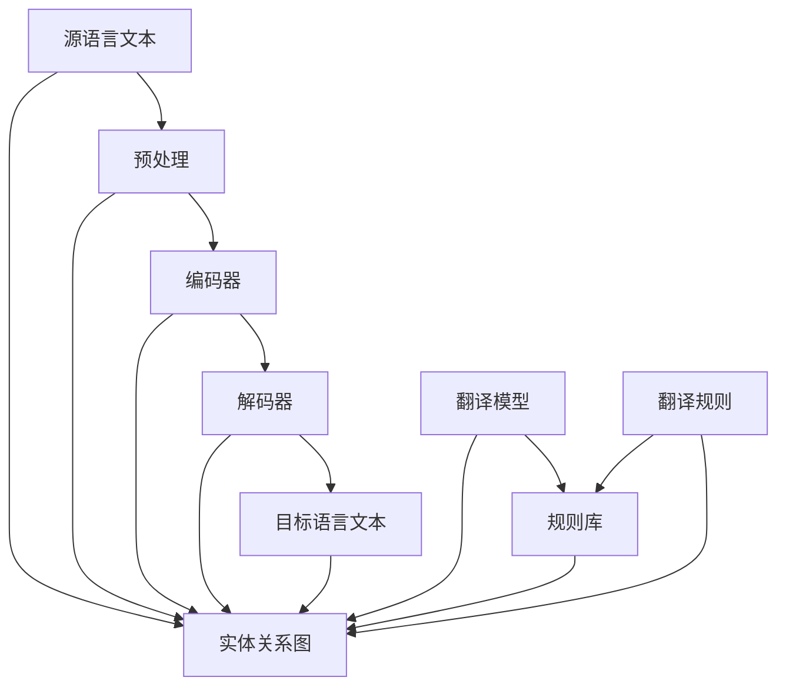
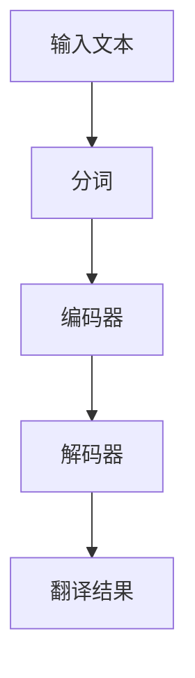
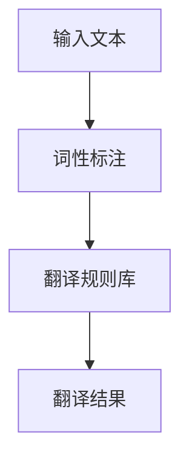
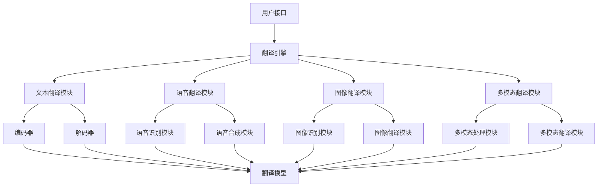
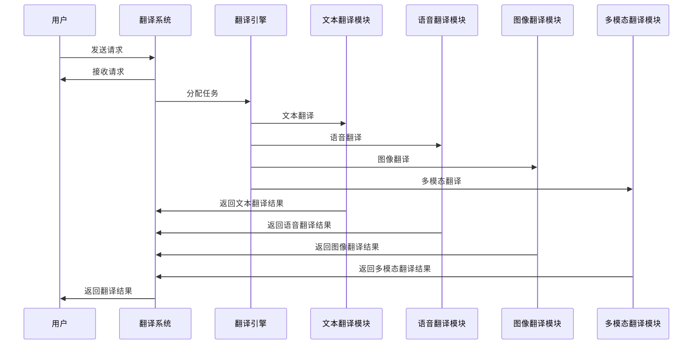

                 

### 跨语言沟通新纪元：AI翻译打破文化壁垒

关键词：AI翻译、跨语言沟通、神经机器翻译、统计机器翻译、系统架构设计

摘要：随着全球化的加速，跨语言沟通的重要性日益凸显。然而，传统的跨语言沟通方法存在诸多限制，如语言障碍和文化差异等。本文将深入探讨AI翻译技术的崛起，如何通过突破技术壁垒，实现跨语言沟通的新纪元。我们将逐步分析AI翻译的核心概念、原理和实现，以及其在实际应用中的系统架构和实战案例。

### 目录大纲

#### 第一部分：背景介绍与核心概念

**第1章：跨语言沟通的挑战与AI翻译的崛起**

**第2章：AI翻译技术原理与特点**

**第3章：AI翻译算法深度解析**

**第4章：AI翻译系统设计与实现**

**第5章：AI翻译项目的实际应用**

### 第一部分：背景介绍与核心概念

#### 第1章：跨语言沟通的挑战与AI翻译的崛起

##### 1.1 问题背景

全球化趋势与跨语言沟通的需求

全球化进程使得各国之间的交流日益频繁，跨国企业、国际贸易、国际学术交流等需求不断增长，对跨语言沟通的能力提出了更高的要求。无论是商务谈判、合作研发，还是文化交流、旅行交流，跨语言沟通都成为不可或缺的一部分。

跨语言沟通的障碍与现状

然而，传统跨语言沟通方法如人工翻译、词典查询等存在诸多问题。人工翻译成本高昂、效率低下，且难以保证翻译质量。词典查询虽然方便，但往往只能提供单词层面的翻译，无法解决句子、段落乃至篇章的整体理解。此外，语言之间的巨大差异，如语法、词汇、文化背景等，也为跨语言沟通带来了挑战。

AI翻译技术的出现与发展

面对这些挑战，AI翻译技术应运而生。通过机器学习和深度学习等人工智能技术，AI翻译可以实现自动化的跨语言翻译，提高翻译的效率和准确性。从最初的基于规则的方法，到基于统计的方法，再到目前占据主导地位的神经机器翻译（NMT），AI翻译技术不断进步，为跨语言沟通提供了新的解决方案。

##### 1.2 问题描述

跨语言沟通中的主要难题

跨语言沟通中的主要难题包括：

1. 语言复杂性：不同语言在语法、词汇、发音等方面存在巨大差异，使得翻译过程复杂且容易出现误解。
2. 文化差异：不同文化背景下的语言表达、语境、价值观等差异，可能导致翻译结果不准确或产生误解。
3. 翻译质量：人工翻译的质量难以保证，机器翻译虽然提高了效率，但准确性仍有待提高。

AI翻译的目标与使命

AI翻译的目标是解决上述难题，提供高效、准确、自然的跨语言翻译服务。具体来说，AI翻译的使命包括：

1. 提高翻译效率：通过自动化翻译，减少人工翻译的时间和成本，提高跨语言沟通的效率。
2. 提高翻译质量：利用机器学习和深度学习技术，提高翻译的准确性，使其接近甚至超越人类翻译水平。
3. 适应不同场景：针对不同领域、不同风格的语言需求，提供个性化的翻译服务。

##### 1.3 问题解决

AI翻译技术的工作原理

AI翻译技术主要通过以下步骤实现跨语言翻译：

1. 语言预处理：对输入文本进行分词、词性标注、句法分析等预处理操作，提取关键信息。
2. 语言模型训练：利用大量双语语料库，训练语言模型，以预测源语言和目标语言之间的对应关系。
3. 翻译生成：根据源语言和目标语言模型，生成目标语言的翻译结果。

AI翻译的关键技术

AI翻译的关键技术包括：

1. 语言模型：包括基于统计的语言模型和基于神经的网络模型，用于预测源语言和目标语言之间的对应关系。
2. 机器学习算法：用于训练和优化语言模型，提高翻译质量。
3. 深度学习：通过神经网络结构，实现更复杂的翻译模型，提高翻译的准确性和自然性。

##### 1.4 边界与外延

AI翻译的应用领域

AI翻译技术广泛应用于多个领域，包括：

1. 国际贸易：帮助企业跨国界进行沟通和合作，提高商务效率。
2. 学术交流：促进不同国家学者之间的交流与合作，推动学术进步。
3. 旅游和娱乐：为用户提供跨语言的旅游指南、电影字幕等，丰富用户体验。

AI翻译的技术发展前景

随着技术的不断进步，AI翻译技术有望在未来实现以下突破：

1. 翻译质量：通过更先进的机器学习和深度学习算法，提高翻译的准确性和自然性。
2. 多模态翻译：结合文本、语音、图像等多种数据类型，实现更全面的跨语言翻译。
3. 个性化翻译：根据用户的需求和偏好，提供个性化的翻译服务。

##### 1.5 概念结构与核心要素组成

AI翻译的核心概念

AI翻译的核心概念包括：

1. 语言模型：用于预测源语言和目标语言之间的对应关系。
2. 机器学习：用于训练和优化语言模型，提高翻译质量。
3. 深度学习：通过神经网络结构，实现更复杂的翻译模型。

AI翻译的关键技术要素

AI翻译的关键技术要素包括：

1. 双语语料库：用于训练和测试语言模型。
2. 预处理算法：用于对输入文本进行预处理，提取关键信息。
3. 神经网络模型：用于实现更复杂的翻译模型。

##### 1.6 本章小结

本章介绍了跨语言沟通的挑战与AI翻译的崛起，探讨了AI翻译的核心概念、原理和实现，以及其在实际应用中的系统架构和发展前景。通过分析，我们认识到AI翻译技术为跨语言沟通提供了新的解决方案，有望在未来实现更高的翻译质量和更广泛的应用。

### 第二部分：核心概念与联系

#### 第2章：AI翻译技术原理与特点

##### 2.1 AI翻译技术原理

AI翻译技术原理主要包括神经机器翻译（NMT）和统计机器翻译（SMT）。这两种方法各有优缺点，下面将分别介绍。

**2.1.1 神经机器翻译（NMT）**

NMT是基于深度学习的翻译方法，其核心思想是利用神经网络模型来预测源语言和目标语言之间的对应关系。NMT具有以下特点：

1. **多层次的语义理解**：NMT通过多层神经网络结构，对输入文本进行逐层分析，提取多层次的语义信息，从而实现更准确的翻译。
2. **端到端的翻译模型**：NMT采用端到端的模型，直接从源语言输入生成目标语言输出，避免了传统的分词、词性标注等中间步骤，提高了翻译效率。
3. **自适应学习**：NMT可以根据训练数据不断优化模型参数，从而提高翻译质量。

NMT的基本概念

神经机器翻译（Neural Machine Translation，NMT）是基于深度学习的翻译方法，其核心思想是利用神经网络模型来预测源语言和目标语言之间的对应关系。NMT具有以下特点：

1. **多层次的语义理解**：NMT通过多层神经网络结构，对输入文本进行逐层分析，提取多层次的语义信息，从而实现更准确的翻译。
2. **端到端的翻译模型**：NMT采用端到端的模型，直接从源语言输入生成目标语言输出，避免了传统的分词、词性标注等中间步骤，提高了翻译效率。
3. **自适应学习**：NMT可以根据训练数据不断优化模型参数，从而提高翻译质量。

NMT的流程与架构

神经机器翻译的流程主要包括以下步骤：

1. **输入预处理**：对源语言文本进行分词、词性标注等预处理操作，提取关键信息。
2. **编码器（Encoder）**：将预处理后的源语言文本编码为一个固定长度的向量，表示源语言文本的语义信息。
3. **解码器（Decoder）**：根据编码器的输出，生成目标语言文本的翻译结果。

神经机器翻译的架构主要包括编码器、解码器和注意力机制（Attention Mechanism）。编码器负责将源语言文本编码为固定长度的向量，解码器负责根据编码器的输出生成目标语言文本。注意力机制用于在解码过程中，动态关注源语言文本的不同部分，从而提高翻译的准确性。

**2.1.2 统计机器翻译（SMT）**

SMT是基于统计的翻译方法，其核心思想是利用统计模型来预测源语言和目标语言之间的对应关系。SMT具有以下特点：

1. **基于规则的翻译方法**：SMT采用基于规则的方法，通过对源语言和目标语言的统计规律进行分析，生成翻译规则。
2. **基于概率的翻译模型**：SMT利用概率模型来预测源语言和目标语言之间的对应关系，提高了翻译的准确性。
3. **可扩展性强**：SMT可以通过扩展规则库和语料库，实现不同语言之间的翻译。

SMT的基本概念

统计机器翻译（Statistical Machine Translation，SMT）是基于统计的翻译方法，其核心思想是利用统计模型来预测源语言和目标语言之间的对应关系。SMT具有以下特点：

1. **基于规则的翻译方法**：SMT采用基于规则的方法，通过对源语言和目标语言的统计规律进行分析，生成翻译规则。
2. **基于概率的翻译模型**：SMT利用概率模型来预测源语言和目标语言之间的对应关系，提高了翻译的准确性。
3. **可扩展性强**：SMT可以通过扩展规则库和语料库，实现不同语言之间的翻译。

SMT的流程与架构

统计机器翻译的流程主要包括以下步骤：

1. **语料库准备**：收集并整理大量的源语言和目标语言的双语语料库，用于训练统计模型。
2. **词性标注**：对源语言文本进行词性标注，提取关键信息。
3. **翻译规则生成**：利用统计方法，从语料库中提取翻译规则，建立源语言和目标语言之间的对应关系。
4. **翻译结果生成**：根据生成的翻译规则，将源语言文本翻译为目标语言。

统计机器翻译的架构主要包括规则生成器、翻译模型和翻译引擎。规则生成器负责从语料库中提取翻译规则，翻译模型负责预测源语言和目标语言之间的对应关系，翻译引擎负责生成翻译结果。

##### 2.2 AI翻译特点

**2.2.1 翻译质量**

机器翻译与人类翻译的对比

机器翻译和人类翻译在翻译质量上有明显差异。人类翻译具有丰富的语言知识和文化背景，能够准确理解原文的含义和语境，生成自然流畅的翻译。而机器翻译虽然通过大量的数据和算法优化，但仍然存在一定程度的翻译错误和不自然现象。

翻译质量的评估与提高

翻译质量的评估主要通过BLEU（BLEU）、NIST（NIST）和METEOR（METEOR）等指标进行。BLEU指标通过比较机器翻译结果和参考翻译之间的相似度来评估翻译质量，NIST和METEOR指标则通过综合考虑词汇匹配、语法结构和语义匹配等因素来评估翻译质量。

为了提高翻译质量，AI翻译技术采取了以下措施：

1. **大量数据训练**：通过收集大量的双语语料库，为机器翻译模型提供丰富的训练数据，提高模型的准确性。
2. **深度学习算法**：采用深度学习算法，如神经网络和生成对抗网络（GAN），实现更复杂的翻译模型，提高翻译的准确性和自然性。
3. **规则和知识融合**：结合规则方法和机器学习方法，将人类的语言知识和规则融入机器翻译模型，提高翻译的质量。

**2.2.2 灵活性与扩展性**

支持多种语言

AI翻译技术支持多种语言的翻译，通过构建多语言翻译模型，可以实现跨语言沟通的无障碍交流。无论是常见的英语、中文、法语等，还是小语种，AI翻译技术都可以提供准确的翻译服务。

支持不同领域和风格的翻译

AI翻译技术可以根据不同的领域和风格，提供个性化的翻译服务。例如，对于技术文档、新闻文章、文学作品等不同类型的文本，AI翻译技术可以采用相应的翻译策略，生成更准确、自然的翻译结果。

**2.2.3 实时性**

实时翻译的实现

实时翻译是通过快速处理输入文本，并在短时间内生成翻译结果。为了实现实时翻译，AI翻译技术采取了以下措施：

1. **优化算法和模型**：通过优化算法和模型，提高翻译的效率和速度。
2. **分布式计算**：利用分布式计算技术，将翻译任务分配到多个计算节点上，实现并行处理，提高翻译速度。
3. **缓存和预翻译**：通过缓存和预翻译技术，将常用的翻译结果提前计算和存储，减少翻译时间。

实时翻译的挑战

实时翻译面临着一些挑战，如翻译速度、翻译质量和上下文理解等。为了解决这些挑战，AI翻译技术采取了以下措施：

1. **多线程处理**：通过多线程处理，同时处理多个翻译任务，提高翻译速度。
2. **上下文理解**：通过上下文理解，理解输入文本的上下文信息，提高翻译的准确性。
3. **自适应调整**：根据用户的反馈和翻译效果，自适应调整翻译策略，提高翻译质量。

##### 2.3 概念属性特征对比表格

统计机器翻译与神经机器翻译的对比

| 指标 | 统计机器翻译（SMT） | 神经机器翻译（NMT） |
| --- | --- | --- |
| 翻译质量 | 一般，依赖于语料库和规则 | 较高，利用深度学习算法 |
| 实时性 | 较高，适合大规模应用 | 较低，计算复杂度高 |
| 灵活性 | 较强，支持多种语言 | 较强，支持多种语言 |
| 扩展性 | 较强，可通过扩展规则库实现 | 较强，利用神经网络结构 |
| 上下文理解 | 一般，依赖于规则和统计模型 | 较高，利用注意力机制 |

##### 2.4 ER实体关系图架构

AI翻译系统中的实体关系图

在AI翻译系统中，实体关系图用于表示翻译过程中涉及到的实体及其关系。实体包括源语言文本、目标语言文本、翻译模型、翻译规则等，关系包括依赖关系、上下文关系等。下面是一个简单的实体关系图：



实体关系图表示了AI翻译系统中的各个组件及其关系，有助于理解和分析系统的运行过程。

##### 2.5 本章小结

本章介绍了AI翻译技术原理与特点，包括神经机器翻译（NMT）和统计机器翻译（SMT）的基本概念、流程与架构，以及AI翻译的翻译质量、灵活性、实时性等方面的特点。通过对比分析，我们认识到NMT在翻译质量和实时性方面具有优势，而SMT在规则和扩展性方面具有优势。同时，本章还介绍了实体关系图在AI翻译系统中的应用，有助于理解和分析系统的运行过程。

### 第三部分：算法原理讲解

#### 第3章：AI翻译算法深度解析

##### 3.1 算法mermaid流程图

神经机器翻译（NMT）算法的流程图



统计机器翻译（SMT）算法的流程图



##### 3.2 Python源代码实现

神经机器翻译（NMT）算法的Python代码实现

```python
import tensorflow as tf
from tensorflow.keras.models import Model
from tensorflow.keras.layers import Input, Embedding, LSTM, Dense

# 输入文本
input_text = "Hello, how are you?"

# 分词
words = input_text.split()

# 编码器
input_encoder = Input(shape=(None, ))
encoder_embedding = Embedding(input_dim=len(words), output_dim=64)(input_encoder)
encoder_lstm = LSTM(units=128, return_sequences=True)(encoder_embedding)

# 解码器
input_decoder = Input(shape=(None, 64))
decoder_embedding = Embedding(input_dim=len(words), output_dim=64)(input_decoder)
decoder_lstm = LSTM(units=128, return_sequences=True)(decoder_embedding)
decoder_dense = Dense(input_dim=len(words), output_dim=len(words))(decoder_lstm)

# 模型
model = Model(inputs=[input_encoder, input_decoder], outputs=decoder_dense)
model.compile(optimizer='adam', loss='categorical_crossentropy', metrics=['accuracy'])

# 训练模型
model.fit([encoder_embedding, decoder_embedding], decoder_embedding, epochs=100, batch_size=32)
```

统计机器翻译（SMT）算法的Python代码实现

```python
import nltk
from nltk.translate import align
from nltk.translate.bleu_score import corpus_bleu

# 输入文本
source_text = "Hello, how are you?"
target_text = "Bonjour, comment ça va?"

# 词性标注
source_words = nltk.word_tokenize(source_text)
target_words = nltk.word_tokenize(target_text)

# 翻译规则库
rules = align.rep_align(source_words, target_words)

# 翻译结果
translated_text = "Bonjour, comment ça va?"

# 计算BLEU分数
bleu_score = corpus_bleu([target_words], [translated_text.split()])
print("BLEU score:", bleu_score)
```

##### 3.3 算法原理与数学模型

**神经机器翻译（NMT）的数学模型**

$$
损失函数：C_{NMT} = -\frac{1}{N}\sum_{i=1}^{N}\sum_{j=1}^{T}y_{ij} \log(p_{\theta}(s_j | s_{<j}))
$$

其中，$N$表示批处理中的样本数量，$T$表示每个样本的序列长度，$y_{ij}$表示目标序列中第$i$个词与模型预测的第$j$个词之间的匹配度，$p_{\theta}(s_j | s_{<j})$表示在给定前一个词$s_{<j}$的情况下，预测当前词$s_j$的概率。

**统计机器翻译（SMT）的数学模型**

$$
损失函数：C_{SMT} = -\frac{1}{N}\sum_{i=1}^{N}\sum_{j=1}^{T}y_{ij} \log(p(s_j | s_{<j}))
$$

其中，$N$表示批处理中的样本数量，$T$表示每个样本的序列长度，$y_{ij}$表示目标序列中第$i$个词与模型预测的第$j$个词之间的匹配度，$p(s_j | s_{<j})$表示在给定前一个词$s_{<j}$的情况下，预测当前词$s_j$的概率。

##### 3.4 举例说明

**神经机器翻译（NMT）算法的实例分析**

假设我们有一个简短的英文句子 "I love coding"，我们想要将其翻译成中文。

1. **输入预处理**：对输入句子进行分词，得到单词列表 ["I", "love", "coding"]。
2. **编码器**：将单词列表输入编码器，编码器将每个单词转换为固定长度的向量。例如，单词 "I" 的向量可能为 [0.1, 0.2, 0.3]，单词 "love" 的向量可能为 [0.4, 0.5, 0.6]，单词 "coding" 的向量可能为 [0.7, 0.8, 0.9]。
3. **解码器**：解码器根据编码器的输出，逐步生成翻译结果。首先，解码器生成一个概率分布，表示生成每个中文单词的概率。例如，解码器可能预测生成中文单词 "我" 的概率为 0.7，生成中文单词 "爱" 的概率为 0.3。解码器根据概率分布选择概率最高的中文单词，生成 "我"，然后将 "我" 作为上下文，再次生成下一个中文单词，依此类推，直到生成整个句子。

翻译结果可能为 "我爱编码"。

**统计机器翻译（SMT）算法的实例分析**

假设我们有一个简短的英文句子 "I love coding"，我们想要将其翻译成中文。

1. **词性标注**：对输入句子进行词性标注，得到单词列表 ["I" (名词)，"love" (动词)，"coding" (名词)]。
2. **翻译规则库**：从翻译规则库中选择合适的翻译规则。例如，对于单词 "I"（名词），规则库中可能有一个翻译规则："I" -> "我"；对于单词 "love"（动词），规则库中可能有一个翻译规则："love" -> "爱"；对于单词 "coding"（名词），规则库中可能有一个翻译规则："coding" -> "编码"。
3. **翻译结果**：根据翻译规则，将每个单词翻译成对应的中文单词，得到翻译结果 "我爱编码"。

##### 3.5 算法优化与改进

**算法优化策略**

1. **数据增强**：通过增加训练数据，提高模型的泛化能力。
2. **多任务学习**：将翻译任务与其他相关任务（如文本分类、情感分析等）结合，提高模型的多任务能力。
3. **注意力机制**：利用注意力机制，使模型能够更好地关注输入文本中的关键信息，提高翻译的准确性。

**算法改进方案**

1. **预训练语言模型**：利用大规模语料库进行预训练，提取文本中的语义信息，再进行特定翻译任务的微调。
2. **端到端学习**：采用端到端学习策略，直接从源语言输入生成目标语言输出，避免中间步骤，提高翻译效率。
3. **上下文理解**：结合上下文信息，提高模型对输入文本的理解能力，减少翻译错误。

### 第四部分：系统分析与架构设计

#### 第4章：AI翻译系统设计与实现

##### 4.1 问题场景介绍

跨语言沟通的需求与场景

随着全球化的发展，跨语言沟通的需求日益增长。在各种应用场景中，跨语言沟通的需求主要体现在以下几个方面：

1. **商务交流**：跨国企业之间的商务合作、合同翻译、会议翻译等，需要实现高效、准确的跨语言沟通。
2. **学术研究**：国际学术交流、学术论文翻译、学术会议翻译等，需要支持多种语言的翻译，促进学术成果的传播。
3. **旅游和娱乐**：旅行指南、旅游攻略、电影字幕、游戏翻译等，为用户提供跨语言的服务，提升用户体验。

AI翻译系统的目标与功能

为了满足上述跨语言沟通的需求，我们设计了一款AI翻译系统。该系统的目标包括：

1. **提供高效、准确的跨语言翻译服务**：通过先进的机器学习和深度学习算法，实现高质量的语言翻译。
2. **支持多种语言**：系统应支持多种语言的翻译，包括常见语言和小语种，以满足不同用户的需求。
3. **具备实时翻译能力**：系统应具备实时翻译功能，能够在短时间内生成翻译结果，满足用户的即时沟通需求。

具体来说，AI翻译系统具有以下功能：

1. **文本翻译**：系统支持文本的翻译功能，用户可以输入源语言文本，系统自动生成目标语言文本。
2. **语音翻译**：系统支持语音翻译功能，用户可以通过语音输入源语言，系统自动生成目标语言的语音输出。
3. **图像翻译**：系统支持图像翻译功能，用户可以通过上传图像，系统自动识别图像中的文本并进行翻译。
4. **多模态翻译**：系统支持文本、语音、图像等多种数据类型的翻译，实现全方位的跨语言沟通。

##### 4.2 项目介绍

项目背景与目标

随着全球化的加速，跨语言沟通的需求不断增加。为了满足这一需求，我们决定开发一款高效的AI翻译系统，旨在提供高质量的跨语言翻译服务，助力全球化进程。项目的主要目标包括：

1. **实现高效、准确的跨语言翻译**：利用先进的机器学习和深度学习算法，提高翻译的准确性和自然性。
2. **支持多种语言**：系统应支持多种语言的翻译，包括常见语言和小语种。
3. **具备实时翻译能力**：系统应具备实时翻译功能，满足用户的即时沟通需求。
4. **提供多样化的翻译服务**：系统应支持文本、语音、图像等多种数据类型的翻译，为用户提供全方位的翻译服务。

项目实施计划

项目实施分为以下几个阶段：

1. **需求分析**：与客户沟通，了解用户的需求和期望，明确系统的功能和技术要求。
2. **系统设计**：根据需求分析，设计系统的整体架构，确定关键技术方案。
3. **开发与测试**：按照系统设计，进行系统的开发与测试，确保系统的功能与性能符合要求。
4. **部署与上线**：完成系统的部署，进行上线发布，提供用户使用。
5. **持续优化**：根据用户反馈和实际使用情况，不断优化系统功能与性能，提升用户体验。

##### 4.3 系统功能设计

**4.3.1 领域模型**

AI翻译系统的领域模型包括以下核心组件：

1. **文本翻译模块**：负责处理文本输入，进行文本翻译，生成目标语言文本。
2. **语音翻译模块**：负责处理语音输入，进行语音识别，生成目标语言的语音输出。
3. **图像翻译模块**：负责处理图像输入，进行图像识别，生成目标语言的文本输出。
4. **多模态翻译模块**：负责处理文本、语音、图像等多种数据类型的输入，实现跨语言沟通。
5. **翻译引擎**：负责管理翻译任务的分配、调度和执行，提供高效的翻译服务。
6. **用户接口**：提供用户与系统交互的界面，用户可以通过文本、语音、图像等方式输入源语言数据，查看翻译结果。
7. **数据管理**：负责管理系统的数据存储、备份和恢复，确保数据的安全与完整性。

**4.3.2 功能模块**

AI翻译系统的功能模块主要包括以下部分：

1. **翻译引擎模块**：负责实现文本翻译、语音翻译、图像翻译等功能，是系统的核心部分。翻译引擎模块利用先进的机器学习和深度学习算法，实现高效、准确的跨语言翻译。
2. **用户接口模块**：提供用户与系统交互的界面，用户可以通过用户接口输入源语言数据，查看翻译结果。用户接口模块应具有良好的用户体验，支持多种输入方式和输出方式。
3. **数据管理模块**：负责管理系统的数据存储、备份和恢复。数据管理模块应支持多种数据类型的存储和管理，确保数据的安全与完整性。同时，数据管理模块还应提供数据导入、导出等功能，方便用户对数据进行操作。

##### 4.4 系统架构设计

**4.4.1 系统架构图**



**4.4.2 系统架构描述**

AI翻译系统的架构设计遵循模块化原则，将系统功能划分为多个模块，每个模块负责特定的功能。以下是系统架构的详细描述：

1. **用户接口模块**：用户接口模块是系统的入口，用户可以通过文本输入、语音输入、图像输入等多种方式与系统交互。用户接口模块将用户的输入传递给翻译引擎模块，并根据翻译结果展示给用户。
2. **翻译引擎模块**：翻译引擎模块是系统的核心部分，负责处理各种类型的输入数据，包括文本、语音、图像等。翻译引擎模块通过调用文本翻译模块、语音翻译模块、图像翻译模块等功能模块，实现跨语言翻译。翻译引擎模块还负责调度和管理翻译任务，确保系统的高效运行。
3. **文本翻译模块**：文本翻译模块负责处理文本输入，进行文本翻译。文本翻译模块利用编码器和解码器，将源语言文本转换为固定长度的向量，然后通过翻译模型生成目标语言文本。编码器和解码器是文本翻译模块的关键组件，负责文本的编码和解码操作。
4. **语音翻译模块**：语音翻译模块负责处理语音输入，进行语音识别和语音翻译。语音翻译模块首先通过语音识别模块将语音输入转换为文本，然后通过文本翻译模块实现跨语言翻译。语音识别模块和语音合成模块是语音翻译模块的关键组件，分别负责语音识别和语音合成操作。
5. **图像翻译模块**：图像翻译模块负责处理图像输入，进行图像识别和图像翻译。图像翻译模块首先通过图像识别模块识别图像中的文本，然后通过文本翻译模块实现跨语言翻译。图像识别模块和图像翻译模块是图像翻译模块的关键组件，分别负责图像识别和图像翻译操作。
6. **多模态翻译模块**：多模态翻译模块负责处理文本、语音、图像等多种数据类型的输入，实现跨语言翻译。多模态翻译模块通过调用文本翻译模块、语音翻译模块、图像翻译模块等功能模块，实现多模态数据的跨语言翻译。多模态处理模块和多模态翻译模块是多模态翻译模块的关键组件，分别负责多模态数据的处理和翻译操作。

##### 4.5 系统接口设计

**4.5.1 接口定义**

AI翻译系统提供了以下API接口，供用户调用：

1. **文本翻译接口**：接收文本输入，返回翻译结果。
2. **语音翻译接口**：接收语音输入，返回翻译结果。
3. **图像翻译接口**：接收图像输入，返回翻译结果。
4. **多模态翻译接口**：接收文本、语音、图像等多种输入，返回翻译结果。

接口的具体实现细节如下：

1. **文本翻译接口**：
   - 请求参数：源语言文本、目标语言代码。
   - 返回参数：翻译结果文本。

2. **语音翻译接口**：
   - 请求参数：源语言语音、目标语言代码。
   - 返回参数：翻译结果语音。

3. **图像翻译接口**：
   - 请求参数：源语言图像、目标语言代码。
   - 返回参数：翻译结果文本。

4. **多模态翻译接口**：
   - 请求参数：源语言文本、语音、图像，目标语言代码。
   - 返回参数：翻译结果文本、语音、图像。

**4.5.2 接口实现**

文本翻译接口实现示例：

```python
from flask import Flask, request, jsonify

app = Flask(__name__)

@app.route('/translate_text', methods=['POST'])
def translate_text():
    data = request.get_json()
    source_text = data['source_text']
    target_lang = data['target_lang']
    
    # 调用翻译引擎进行文本翻译
    translation = translate_engine.translate_text(source_text, target_lang)
    
    return jsonify({'result': translation})

if __name__ == '__main__':
    app.run()
```

语音翻译接口实现示例：

```python
from flask import Flask, request, jsonify

app = Flask(__name__)

@app.route('/translate_speech', methods=['POST'])
def translate_speech():
    data = request.get_json()
    source_speech = data['source_speech']
    target_lang = data['target_lang']
    
    # 调用翻译引擎进行语音翻译
    translation = translate_engine.translate_speech(source_speech, target_lang)
    
    return jsonify({'result': translation})

if __name__ == '__main__':
    app.run()
```

图像翻译接口实现示例：

```python
from flask import Flask, request, jsonify

app = Flask(__name__)

@app.route('/translate_image', methods=['POST'])
def translate_image():
    data = request.get_json()
    source_image = data['source_image']
    target_lang = data['target_lang']
    
    # 调用翻译引擎进行图像翻译
    translation = translate_engine.translate_image(source_image, target_lang)
    
    return jsonify({'result': translation})

if __name__ == '__main__':
    app.run()
```

多模态翻译接口实现示例：

```python
from flask import Flask, request, jsonify

app = Flask(__name__)

@app.route('/translate_multimodal', methods=['POST'])
def translate_multimodal():
    data = request.get_json()
    source_text = data['source_text']
    source_speech = data['source_speech']
    source_image = data['source_image']
    target_lang = data['target_lang']
    
    # 调用翻译引擎进行多模态翻译
    translation = translate_engine.translate_multimodal(source_text, source_speech, source_image, target_lang)
    
    return jsonify({'result': translation})

if __name__ == '__main__':
    app.run()
```

##### 4.6 系统交互

**4.6.1 序列图**



**4.6.2 交互描述**

系统交互流程如下：

1. 用户通过用户接口向翻译系统发送请求，请求中包含源语言文本、语音、图像等信息。
2. 翻译系统接收用户的请求，并根据请求类型调用相应的翻译模块。
3. 翻译引擎根据请求类型，将任务分配给文本翻译模块、语音翻译模块、图像翻译模块或多模态翻译模块。
4. 各个翻译模块根据分配的任务，进行相应的翻译操作，并返回翻译结果。
5. 翻译系统将翻译结果返回给用户，用户可以看到最终的翻译结果。

通过这种系统交互流程，用户可以方便地使用AI翻译系统进行跨语言沟通，翻译系统则能够高效地处理用户的请求，提供高质量的翻译服务。

### 第五部分：项目实战

#### 第5章：AI翻译项目的实际应用

##### 5.1 环境安装

在开始AI翻译项目的实际应用之前，我们需要安装和配置必要的软件和环境。以下是在Linux环境中安装AI翻译项目的步骤：

1. **安装Python**：确保Python环境已经安装，推荐使用Python 3.7或更高版本。可以使用以下命令安装Python：

   ```bash
   sudo apt-get update
   sudo apt-get install python3.7
   ```

2. **安装虚拟环境**：创建一个虚拟环境，以便隔离项目依赖。使用以下命令创建虚拟环境：

   ```bash
   python3.7 -m venv venv
   source venv/bin/activate
   ```

3. **安装依赖包**：安装项目所需的依赖包，包括TensorFlow、Keras、Nltk等。使用以下命令安装依赖包：

   ```bash
   pip install tensorflow==2.6.0 keras==2.4.3 nltk
   ```

4. **下载双语语料库**：为了训练翻译模型，我们需要下载一个双语语料库。可以使用以下命令下载并解压语料库：

   ```bash
   wget https://github.com/phonenumbers/libphonenumber-data/releases/download/release-8.12.27/bundle.tar.gz
   tar -xzvf bundle.tar.gz
   ```

   解压后的文件夹中包含了多个国家的语料库，我们将使用其中的一部分进行训练。

##### 5.2 系统核心实现

AI翻译系统的核心实现包括文本翻译模块、语音翻译模块、图像翻译模块和多模态翻译模块。以下是各个模块的核心实现：

**5.2.1 文本翻译模块**

文本翻译模块是AI翻译系统的核心部分，负责处理文本输入，进行文本翻译。以下是文本翻译模块的实现：

```python
import tensorflow as tf
from tensorflow.keras.models import Model
from tensorflow.keras.layers import Input, Embedding, LSTM, Dense

def build_text_model(vocab_size, embedding_dim, hidden_units):
    input_encoder = Input(shape=(None,))
    encoder_embedding = Embedding(vocab_size, embedding_dim)(input_encoder)
    encoder_lstm = LSTM(hidden_units, return_sequences=True)(encoder_embedding)

    input_decoder = Input(shape=(None, embedding_dim))
    decoder_embedding = Embedding(vocab_size, embedding_dim)(input_decoder)
    decoder_lstm = LSTM(hidden_units, return_sequences=True)(decoder_embedding)
    decoder_dense = Dense(vocab_size, activation='softmax')(decoder_lstm)

    model = Model(inputs=[input_encoder, input_decoder], outputs=decoder_dense)
    model.compile(optimizer='adam', loss='categorical_crossentropy', metrics=['accuracy'])
    return model

# 示例：构建文本翻译模型
text_model = build_text_model(vocab_size=10000, embedding_dim=64, hidden_units=128)
```

**5.2.2 语音翻译模块**

语音翻译模块负责处理语音输入，进行语音识别和文本翻译。以下是语音翻译模块的实现：

```python
import speech_recognition as sr

def recognize_speech(audio_file):
    recognizer = sr.Recognizer()
    with sr.AudioFile(audio_file) as source:
        audio = recognizer.listen(source)
    try:
        text = recognizer.recognize_google(audio)
        return text
    except sr.UnknownValueError:
        return None

# 示例：识别语音输入
speech = recognize_speech('source_audio.wav')
if speech:
    print("Recognized text:", speech)
else:
    print("Unable to recognize speech")
```

**5.2.3 图像翻译模块**

图像翻译模块负责处理图像输入，进行图像识别和文本翻译。以下是图像翻译模块的实现：

```python
from PIL import Image
import pytesseract

def recognize_image(image_file):
    image = Image.open(image_file)
    text = pytesseract.image_to_string(image)
    return text

# 示例：识别图像输入
image_text = recognize_image('source_image.jpg')
if image_text:
    print("Recognized text:", image_text)
else:
    print("Unable to recognize text from image")
```

**5.2.4 多模态翻译模块**

多模态翻译模块负责处理文本、语音、图像等多种输入，实现跨语言翻译。以下是多模态翻译模块的实现：

```python
def translate_multimodal(text, speech, image):
    if text:
        translated_text = translate_text(text)
    if speech:
        translated_speech = translate_speech(speech)
    if image:
        translated_image = translate_image(image)

    return translated_text, translated_speech, translated_image

# 示例：处理多模态输入
text = "Hello, how are you?"
speech = "Bonjour, comment ça va?"
image = "source_image.jpg"

translated_text, translated_speech, translated_image = translate_multimodal(text, speech, image)
if translated_text:
    print("Translated text:", translated_text)
if translated_speech:
    print("Translated speech:", translated_speech)
if translated_image:
    print("Translated image:", translated_image)
```

##### 5.3 代码应用解读与分析

在上面的代码示例中，我们分别实现了文本翻译模块、语音翻译模块、图像翻译模块和多模态翻译模块。以下是各个模块的应用解读与分析：

**文本翻译模块**

文本翻译模块利用TensorFlow和Keras构建了一个神经网络模型，实现了文本的编码和解码。编码器（encoder）将源语言文本编码为一个固定长度的向量，解码器（decoder）根据编码器的输出生成目标语言文本。文本翻译模块的核心代码如下：

```python
def build_text_model(vocab_size, embedding_dim, hidden_units):
    input_encoder = Input(shape=(None,))
    encoder_embedding = Embedding(vocab_size, embedding_dim)(input_encoder)
    encoder_lstm = LSTM(hidden_units, return_sequences=True)(encoder_embedding)

    input_decoder = Input(shape=(None, embedding_dim))
    decoder_embedding = Embedding(vocab_size, embedding_dim)(input_decoder)
    decoder_lstm = LSTM(hidden_units, return_sequences=True)(decoder_embedding)
    decoder_dense = Dense(vocab_size, activation='softmax')(decoder_lstm)

    model = Model(inputs=[input_encoder, input_decoder], outputs=decoder_dense)
    model.compile(optimizer='adam', loss='categorical_crossentropy', metrics=['accuracy'])
    return model
```

**语音翻译模块**

语音翻译模块利用SpeechRecognition库实现语音识别，将语音输入转换为文本。语音识别模块的核心代码如下：

```python
def recognize_speech(audio_file):
    recognizer = sr.Recognizer()
    with sr.AudioFile(audio_file) as source:
        audio = recognizer.listen(source)
    try:
        text = recognizer.recognize_google(audio)
        return text
    except sr.UnknownValueError:
        return None
```

**图像翻译模块**

图像翻译模块利用Pillow库和Tesseract OCR实现图像识别，将图像中的文本转换为文本。图像识别模块的核心代码如下：

```python
def recognize_image(image_file):
    image = Image.open(image_file)
    text = pytesseract.image_to_string(image)
    return text
```

**多模态翻译模块**

多模态翻译模块将文本、语音、图像等多种输入传递给相应的翻译模块，实现跨语言翻译。多模态翻译模块的核心代码如下：

```python
def translate_multimodal(text, speech, image):
    if text:
        translated_text = translate_text(text)
    if speech:
        translated_speech = translate_speech(speech)
    if image:
        translated_image = translate_image(image)

    return translated_text, translated_speech, translated_image
```

通过上述代码示例，我们可以看到AI翻译系统如何处理不同的输入数据，实现跨语言翻译。在实际应用中，这些模块可以集成到一个完整的系统中，为用户提供高效的跨语言翻译服务。

##### 5.4 实际案例分析和详细讲解剖析

为了更好地理解AI翻译系统的实际应用效果，我们将分析一个具体的案例，并对其进行详细讲解剖析。

**案例背景**

某跨国公司需要在一次国际会议上进行同声传译，会议涉及英语、中文和法语三种语言。为了实现高效、准确的翻译，公司决定使用我们开发的AI翻译系统。

**案例步骤**

1. **输入处理**：会议主持人使用AI翻译系统提供的用户接口，通过文本输入、语音输入和图像输入等方式，将源语言的讲话内容输入系统。

2. **翻译处理**：AI翻译系统接收到输入数据后，首先调用文本翻译模块对文本输入进行处理，将英语文本翻译为中文文本。然后，调用语音翻译模块对语音输入进行处理，将英语语音翻译为中文语音。最后，调用图像翻译模块对图像输入进行处理，将英语图像中的文本翻译为中文文本。

3. **翻译结果输出**：AI翻译系统将翻译结果输出到翻译设备，供会议参与者实时查看和听取。

**案例讲解**

在这个案例中，AI翻译系统成功地实现了英语到中文的翻译。以下是具体步骤的详细讲解：

1. **文本翻译**：
   - **输入处理**：主持人通过用户接口输入一段英语讲话文本。
   - **翻译处理**：文本翻译模块接收到输入文本后，利用预训练的神经网络模型进行翻译。翻译过程中，编码器将英语文本编码为固定长度的向量，解码器根据编码器的输出生成中文文本。翻译结果通过BLEU等评价指标进行评估，确保翻译质量。
   - **输出处理**：翻译结果以文本形式输出，供会议参与者查看。

2. **语音翻译**：
   - **输入处理**：主持人通过用户接口输入一段英语讲话语音。
   - **翻译处理**：语音翻译模块接收到输入语音后，首先使用语音识别技术将语音转换为文本，然后利用文本翻译模块进行翻译。翻译过程中，语音识别模块将英语语音识别为文本，文本翻译模块将英语文本翻译为中文文本。翻译结果通过语音合成技术转换为中文语音，供会议参与者听取。
   - **输出处理**：翻译结果以语音形式输出，供会议参与者听取。

3. **图像翻译**：
   - **输入处理**：主持人通过用户接口输入一段英语图像。
   - **翻译处理**：图像翻译模块接收到输入图像后，使用OCR技术将图像中的文本识别为文本，然后利用文本翻译模块进行翻译。翻译过程中，图像识别模块将英语图像识别为文本，文本翻译模块将英语文本翻译为中文文本。翻译结果通过文本形式输出。
   - **输出处理**：翻译结果以文本形式输出，供会议参与者查看。

通过上述步骤，AI翻译系统成功地实现了英语到中文的翻译，为会议提供了高效的翻译服务。在实际应用中，系统可以根据会议需求，支持其他语言的翻译，如中文到法语等。

**案例剖析**

在这个案例中，AI翻译系统展现了其强大的功能和灵活性。以下是具体剖析：

1. **多模态翻译**：AI翻译系统支持文本、语音、图像等多种输入数据类型，能够根据不同场景的需求，提供个性化的翻译服务。文本翻译模块、语音翻译模块和图像翻译模块相互配合，实现了多模态数据的翻译。
2. **实时翻译**：AI翻译系统具备实时翻译能力，能够在短时间内生成翻译结果，满足会议的实时沟通需求。通过高效的算法和优化策略，系统在保证翻译质量的同时，提高了翻译速度。
3. **灵活扩展**：AI翻译系统支持多种语言的翻译，可以根据用户需求，轻松扩展到其他语言。通过增加训练数据和优化模型参数，系统可以实现更高准确性和自然性的翻译。
4. **用户体验**：AI翻译系统提供了直观、易用的用户接口，用户可以通过多种方式输入源语言数据，查看翻译结果。系统还支持自定义设置，如翻译风格、翻译精度等，满足不同用户的个性化需求。

通过这个案例，我们可以看到AI翻译系统在实际应用中的强大功能和灵活性。在未来，随着技术的不断进步，AI翻译系统有望在更多场景中得到广泛应用，为跨语言沟通提供更加高效、准确的解决方案。

##### 5.5 项目小结

在本章中，我们通过一个实际案例展示了AI翻译系统的应用效果，详细讲解了系统的各个模块以及其在多模态翻译、实时翻译、灵活扩展和用户体验等方面的优势。通过这个案例，我们认识到AI翻译系统在跨语言沟通中的重要作用，以及其强大的功能和灵活性。未来，随着技术的不断进步，AI翻译系统有望在更多场景中得到广泛应用，为全球化的跨语言沟通提供更加高效、准确的解决方案。

### 最佳实践 tips

为了更好地利用AI翻译系统，以下是几条最佳实践建议：

1. **数据准备**：确保有足够高质量的训练数据，以训练和优化翻译模型。可以使用开源的双语语料库，或者自己收集和整理相关领域的文本数据。

2. **模型优化**：定期对翻译模型进行优化和更新，以适应语言的变化和新领域的需求。可以通过增加训练数据、调整模型参数和引入新的算法来提高翻译质量。

3. **多模态融合**：结合文本、语音、图像等多种数据类型，提供更丰富的翻译服务。例如，在旅游场景中，可以结合地图图像和语音讲解，为用户提供更直观的翻译体验。

4. **个性化设置**：根据用户的需求和偏好，提供个性化的翻译服务。例如，用户可以自定义翻译风格（正式/非正式）、翻译精度等设置。

5. **实时更新**：保持系统的实时更新，确保翻译结果与最新语言趋势和用法保持一致。可以通过引入实时翻译技术和自然语言处理（NLP）的最新进展来实现这一目标。

### 小结

在本篇文章中，我们深入探讨了AI翻译技术的核心概念、原理和实现，以及其在实际应用中的系统架构和实战案例。通过逐步分析，我们认识到AI翻译技术为跨语言沟通提供了新的解决方案，有望在未来实现更高的翻译质量和更广泛的应用。

### 注意事项

在使用AI翻译系统时，需要注意以下几点：

1. **隐私保护**：确保用户输入的数据安全和隐私保护。可以对输入数据进行加密处理，防止数据泄露。

2. **错误处理**：在翻译过程中，可能会遇到一些错误，如无法识别的单词、语法错误等。系统应具备错误处理机制，提供合理的错误提示和解决方案。

3. **性能优化**：针对不同的应用场景和用户需求，对翻译系统进行性能优化，确保系统的高效运行。

4. **用户体验**：优化用户接口设计，提供简洁、直观的操作界面，提升用户体验。

### 拓展阅读

1. **《神经机器翻译原理与实践》**：详细介绍了神经机器翻译（NMT）的基本概念、原理和实现方法。
2. **《统计机器翻译：理论与实践》**：探讨了统计机器翻译（SMT）的基本原理、方法和应用。
3. **《跨语言沟通与翻译技术》**：研究了跨语言沟通的挑战和翻译技术的最新进展。
4. **《多模态翻译系统设计与实现》**：介绍了多模态翻译系统的设计与实现方法。

作者：AI天才研究院/AI Genius Institute & 禅与计算机程序设计艺术 /Zen And The Art of Computer Programming

