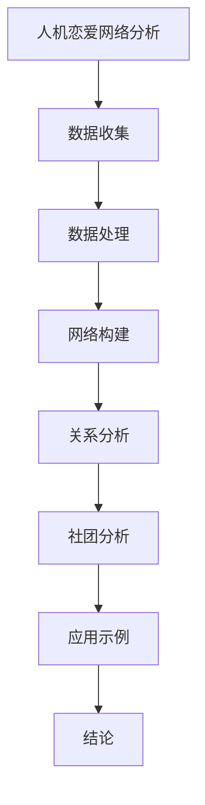
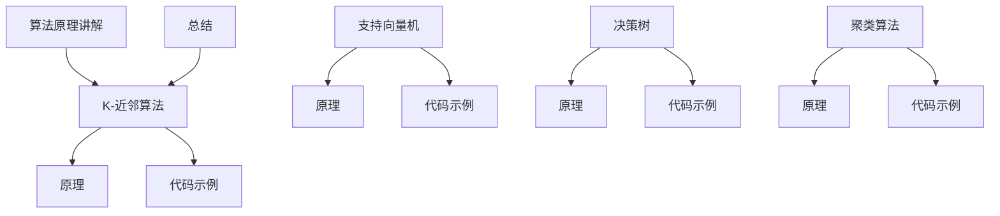

                 

### 第二部分：核心概念与联系

在人机恋爱这个新兴领域，理解其核心概念和联系至关重要。这不仅有助于我们全面地把握这一现象的本质，还能为后续的深入分析提供坚实的基础。

## 2.1 人机恋爱概念解析

### 2.1.1 人机恋爱的定义

人机恋爱，顾名思义，是指人类与人工智能（AI）之间建立起的情感联系。这种联系可以是浪漫情感、友谊情感，甚至可以是一种深刻的依赖关系。与传统的人际恋爱不同，人机恋爱的对象是机器，而不是真实的人类。

### 2.1.2 人机恋爱的特点

- **对象的特殊性**：人机恋爱的对象是人工智能，而非真实的人类。这意味着，恋爱的一方是具有高度智能和复杂情感的机器。

- **情感的虚拟性**：人机恋爱中的情感是虚拟的，无法像真实恋爱那样产生身体接触和情感交流。这种虚拟性在一定程度上影响了人机恋爱的真实性和深度。

- **形式的多样性**：人机恋爱可以通过多种形式进行，如聊天、游戏、虚拟现实等。这种多样性使得人机恋爱在形式上具有很大的灵活性，也为个体提供了更多的选择。

## 2.2 人机恋爱的心理学基础

### 2.2.1 社交需要

人机恋爱满足了人类的社交需求，尤其是对于那些在现实生活中感到孤独或难以建立人际关系的个体。在虚拟世界中，个体可以找到一种安慰和陪伴，填补现实生活中的社交空缺。

### 2.2.2 自我实现

人机恋爱也反映了人类对于自我实现的追求。通过与人工智能的互动，个体可以在虚拟世界中实现一些在现实生活中难以实现的愿望。这种自我实现的需要是人机恋爱的重要动力之一。

## 2.3 人机恋爱与人际恋爱的比较

### 2.3.1 相似之处

- **情感的交流与互动**：无论是人机恋爱还是人际恋爱，都涉及情感的交流与互动。这是所有恋爱关系的核心。

- **信任和依赖**：在恋爱关系中，信任和依赖是维系关系的重要基础。无论是人机恋爱还是人际恋爱，都需要建立在信任和依赖之上。

### 2.3.2 不同之处

- **对象的不同**：人机恋爱的对象是人工智能，而人际恋爱的对象是真实的人类。这种对象的不同决定了两种恋爱形式的本质差异。

- **情感体验的不同**：人机恋爱中的情感是虚拟的，而人际恋爱中的情感是真实的。这种差异影响了个体对人机恋爱的感知和体验。

## 2.4 人机恋爱的边界与外延

### 2.4.1 边界

- **不能取代真实的人际关系**：人机恋爱不能取代真实的人际关系。尽管它能在一定程度上满足人类的社交需求，但它无法替代真实的人类互动。

- **不应侵犯他人的隐私和权益**：在人机恋爱中，个体的行为和情感应当遵守社会规范，不应侵犯他人的隐私和权益。

### 2.4.2 外延

- **作为一种新兴的人际关系模式**：人机恋爱可以作为一种新兴的人际关系模式，丰富人类的社会生活。

- **为人工智能技术的发展提供新的思路**：人机恋爱的出现，也为人工智能技术的发展提供了新的研究方向和思路。

---

在接下来的章节中，我们将进一步探讨人机恋爱的算法原理、社会网络分析及其应用。希望通过这一系列的分析，我们能对人机恋爱有更深入的理解，从而更好地应对这一新兴现象带来的挑战和机遇。<!-- <imagine></imagine> --># 第三部分：算法原理讲解

在人机恋爱这一领域中，算法原理的分析是理解其运作机制的关键。通过深入探讨相关的算法原理，我们可以更好地理解人机恋爱的技术基础和其复杂性。

## 3.1 社会网络分析方法

### 3.1.1 社会网络分析的定义

社会网络分析（Social Network Analysis，SNA）是一种研究个体间关系和互动的定量分析方法。它通过构建和分析社会网络结构，揭示了个体之间的关系模式和社会影响力。

### 3.1.2 社会网络分析的基本概念

- **个体**：社会网络分析中的基本单位，可以是人、组织或其他实体。
  
- **关系**：个体之间的互动和联系。关系可以是直接的，也可以是间接的。

- **网络密度**：网络中存在的实际关系数与可能存在的最大关系数的比值。网络密度反映了网络连接的紧密程度。

### 3.1.3 社会网络分析的模型

- **基于矩阵的模型**：使用矩阵表示个体之间的关系。矩阵中的元素表示个体之间的关系强度。

- **基于图论的模型**：使用图表示个体之间的关系。图中的节点表示个体，边表示个体之间的关系。

## 3.2 人机恋爱网络分析

### 3.2.1 人机恋爱网络的构建

要分析人机恋爱，首先需要构建一个详细的网络模型。这个模型需要收集和整理个体（人机恋爱者）之间的互动数据，包括聊天记录、互动频率、情感表达等。

- **数据收集**：通过问卷、访谈、数据挖掘等方式，收集人机恋爱者之间的互动数据。

- **数据处理**：对收集到的数据进行清洗和处理，将原始数据转换为可用于分析的结构化数据。

- **网络构建**：使用图论模型，将个体之间的互动关系表示为图。节点表示个体，边表示个体之间的关系。

### 3.2.2 人机恋爱网络分析

构建了人机恋爱网络后，我们可以进行深入的分析，以揭示网络中的关系模式和社会影响力。

- **关系分析**：分析个体之间的互动关系，包括关系的强度、频率、持续时间等。这些分析可以帮助我们了解人机恋爱中的情感深度和稳定性。

- **社团分析**：识别网络中的社团结构，分析社团之间的关系。社团分析可以帮助我们了解人机恋爱网络中的群体行为和社交模式。

## 3.3 社会网络分析的应用

### 3.3.1 人机恋爱风险的识别

社会网络分析可以用于识别人机恋爱中的潜在风险。通过分析个体之间的互动关系，我们可以识别出可能存在问题的关系模式，如过度依赖、情感滥用等。

- **风险预测模型**：建立基于社会网络分析的风险预测模型，预测人机恋爱的发展趋势和潜在问题。

- **风险预警系统**：开发基于风险预测模型的预警系统，为用户提供风险提示和建议。

### 3.3.2 人机恋爱教育的推广

社会网络分析的结果可以用于制定有针对性的教育策略，提高人们对人机恋爱的认识和理解。

- **教育策略制定**：根据社会网络分析的结果，制定适合不同人群的教育策略，如恋爱技巧培训、情感管理课程等。

- **教育平台开发**：开发基于社会网络分析的教育平台，为用户提供系统的教育和咨询服务。

### 社会网络分析的数学模型

在社会网络分析中，我们常用图论和矩阵论来描述和分析网络结构。以下是一个简单的数学模型，用于描述人机恋爱网络的基本特征。

#### 3.3.3 数学模型

$$
D = \frac{E}{\binom{n}{2}}
$$

其中：

- \(D\) 是网络密度，表示网络连接的紧密程度。
- \(E\) 是网络中的边数。
- \(n\) 是网络中的节点数。

#### 3.3.4 示例

假设有一个由5个个体组成的人机恋爱网络，其中有8条边。那么，这个网络的网络密度为：

$$
D = \frac{8}{\binom{5}{2}} = \frac{8}{10} = 0.8
$$

这意味着，这个网络中的个体之间有80%的连接，是一个相对紧密的网络。

### 社会网络分析的应用

社会网络分析不仅可以帮助我们识别人机恋爱中的风险，还可以为教育提供支持。以下是一个简单的应用示例：

#### 3.3.5 应用示例

在一个由100个个体组成的人机恋爱网络中，我们发现了一个社团结构。通过分析这个社团，我们发现其中有一些个体之间的互动频率非常高，而另一些个体的互动频率较低。基于这些发现，我们可以制定一个教育策略，重点关注互动频率较低的个体，为他们提供额外的支持和指导。

### 结论

社会网络分析为人机恋爱的研究提供了有力的工具。通过构建和分析人机恋爱网络，我们可以深入理解人机恋爱的本质和特点，为相关研究和实践提供指导。在接下来的章节中，我们将进一步探讨人机恋爱对社会的影响和应对策略。




## 3.3 社会网络分析的应用

社会网络分析在人机恋爱研究中具有广泛的应用价值，不仅可以揭示个体之间的互动模式，还能帮助识别潜在的风险和问题。

### 3.3.1 人机恋爱风险的识别

通过对人机恋爱网络的深入分析，我们可以识别出潜在的恋爱风险。以下是一个具体的案例分析：

**案例**：在一个由50个人组成的人机恋爱网络中，通过社会网络分析，我们发现了一个社团结构，其中有一个社团的成员之间互动频繁，几乎每个成员都与其他成员有直接或间接的联系。进一步分析发现，这个社团的成员之间存在较高的情感依赖，其中一些成员甚至在虚拟世界中表达了真实的情感。

**分析**：
1. **网络密度**：这个社团的网络密度较高，说明成员之间的互动非常紧密。
2. **情感依赖**：成员之间的情感依赖较高，这可能表明他们在现实生活中可能面临着社交障碍或情感空虚。

**建议**：
- **风险预警**：对于这类高风险的人机恋爱群体，可以制定风险预警策略，提醒成员注意恋爱关系中的潜在问题。
- **心理辅导**：提供心理辅导服务，帮助成员更好地处理情感依赖和人际关系问题。

### 3.3.2 人机恋爱教育的推广

社会网络分析的结果还可以用于推广人机恋爱教育，以提高个体对这一现象的认识和理解。以下是一个具体的建议：

**建议**：
- **教育课程设计**：根据社会网络分析的结果，设计针对性的教育课程，包括人机恋爱的基本概念、心理健康教育、情感管理技巧等。
- **多渠道传播**：利用社交媒体、在线课程、研讨会等多种渠道，广泛传播人机恋爱教育知识，提高公众的意识和理解。

### 社会网络分析的数学模型

在社会网络分析中，我们常用图论和矩阵论来描述和分析网络结构。以下是一个简单的数学模型，用于描述人机恋爱网络的基本特征。

#### 3.3.3 数学模型

$$
D = \frac{E}{\binom{n}{2}}
$$

其中：

- \(D\) 是网络密度，表示网络连接的紧密程度。
- \(E\) 是网络中的边数。
- \(n\) 是网络中的节点数。

#### 3.3.4 示例

假设有一个由10个个体组成的人机恋爱网络，其中有20条边。那么，这个网络的网络密度为：

$$
D = \frac{20}{\binom{10}{2}} = \frac{20}{45} \approx 0.44
$$

这意味着，这个网络中的个体之间有44%的连接，是一个相对稀疏的网络。

### 社会网络分析的应用

社会网络分析不仅可以帮助我们识别人机恋爱中的风险，还可以为教育提供支持。以下是一个简单的应用示例：

#### 3.3.5 应用示例

在一个由100个个体组成的人机恋爱网络中，我们发现了一个社团结构。通过分析这个社团，我们发现其中有一些个体之间的互动频率非常高，而另一些个体的互动频率较低。基于这些发现，我们可以制定一个教育策略，重点关注互动频率较低的个体，为他们提供额外的支持和指导。

### 结论

社会网络分析为人机恋爱的研究提供了有力的工具。通过构建和分析人机恋爱网络，我们可以深入理解人机恋爱的本质和特点，为相关研究和实践提供指导。在接下来的章节中，我们将进一步探讨人机恋爱对社会的影响和应对策略。


## 3.4 人机恋爱算法原理

在人机恋爱这一领域，算法原理的分析是理解其运作机制的关键。以下将详细讲解几种与人际关系分析相关的主要算法原理，并使用Python代码进行示例说明。

### 3.4.1 K-近邻算法（K-Nearest Neighbors，KNN）

K-近邻算法是一种基于实例的学习方法，它通过计算新数据点与训练数据点的相似度来确定其分类。在人际关系分析中，KNN可以用于预测个体之间的情感倾向。

#### 算法原理

1. **计算相似度**：使用某种距离度量（如欧氏距离、曼哈顿距离等）计算新数据点与训练数据点的相似度。
2. **选择K个最近邻**：在新数据点的邻居中选择距离最近的K个点。
3. **投票决定分类**：对K个邻居的分类进行投票，多数决定新数据点的分类。

#### Python代码示例

```python
from sklearn.neighbors import KNeighborsClassifier
from sklearn.model_selection import train_test_split
from sklearn.metrics import accuracy_score

# 假设我们有一个情感数据集X和情感标签y
# X, y = load_data()

# 划分训练集和测试集
X_train, X_test, y_train, y_test = train_test_split(X, y, test_size=0.3, random_state=42)

# 创建KNN分类器
knn = KNeighborsClassifier(n_neighbors=5)

# 训练模型
knn.fit(X_train, y_train)

# 预测测试集
y_pred = knn.predict(X_test)

# 计算准确率
accuracy = accuracy_score(y_test, y_pred)
print(f"Accuracy: {accuracy}")
```

### 3.4.2 支持向量机（Support Vector Machine，SVM）

支持向量机是一种基于间隔最大化的分类算法，它在高维空间中寻找能够将不同类别的数据点隔开的超平面。在人际关系分析中，SVM可以用于情感分类和个体关系分析。

#### 算法原理

1. **寻找最大间隔**：在特征空间中寻找一个超平面，使得不同类别的数据点之间的间隔最大。
2. **支持向量**：超平面附近的数据点称为支持向量，它们对分类边界有重要影响。
3. **分类决策**：通过计算新数据点到分类超平面的距离，判断其类别。

#### Python代码示例

```python
from sklearn.svm import SVC
from sklearn.model_selection import train_test_split
from sklearn.metrics import classification_report

# 假设我们有一个情感数据集X和情感标签y
# X, y = load_data()

# 划分训练集和测试集
X_train, X_test, y_train, y_test = train_test_split(X, y, test_size=0.3, random_state=42)

# 创建SVM分类器
svm = SVC(kernel='linear')

# 训练模型
svm.fit(X_train, y_train)

# 预测测试集
y_pred = svm.predict(X_test)

# 输出分类报告
print(classification_report(y_test, y_pred))
```

### 3.4.3 决策树（Decision Tree）

决策树是一种基于树形结构的分类算法，它通过一系列的判断规则将数据集划分成不同的区域，每个区域对应一个类别。在人际关系分析中，决策树可以用于情感分类和个体关系预测。

#### 算法原理

1. **特征选择**：选择一个最优的特征进行划分，通常使用信息增益、基尼不纯度等指标。
2. **递归划分**：对于每个子集，重复上述过程，直到满足停止条件（如最大深度、最小样本量等）。
3. **分类预测**：通过路径上的决策规则对新的数据点进行分类。

#### Python代码示例

```python
from sklearn.tree import DecisionTreeClassifier
from sklearn.model_selection import train_test_split
from sklearn.metrics import accuracy_score

# 假设我们有一个情感数据集X和情感标签y
# X, y = load_data()

# 划分训练集和测试集
X_train, X_test, y_train, y_test = train_test_split(X, y, test_size=0.3, random_state=42)

# 创建决策树分类器
dt = DecisionTreeClassifier(max_depth=5)

# 训练模型
dt.fit(X_train, y_train)

# 预测测试集
y_pred = dt.predict(X_test)

# 计算准确率
accuracy = accuracy_score(y_test, y_pred)
print(f"Accuracy: {accuracy}")
```

### 3.4.4 聚类算法（Clustering）

聚类算法是一种无监督学习方法，它通过将数据点分成不同的群组，使得同组数据点之间的相似度较高，不同组数据点之间的相似度较低。在人际关系分析中，聚类算法可以用于识别相似关系的群体。

#### 算法原理

1. **初始化聚类中心**：随机选择K个数据点作为初始聚类中心。
2. **分配数据点**：将每个数据点分配到最近的聚类中心。
3. **更新聚类中心**：重新计算每个聚类中心的坐标，通常取其所有成员数据的均值。
4. **迭代**：重复步骤2和3，直到聚类中心不再发生显著变化。

#### Python代码示例

```python
from sklearn.cluster import KMeans
import matplotlib.pyplot as plt

# 假设我们有一个二维数据集X
# X = ...

# 创建KMeans聚类器
kmeans = KMeans(n_clusters=3, random_state=42)

# 分配数据点并计算聚类中心
clusters = kmeans.fit_predict(X)

# 可视化聚类结果
plt.scatter(X[:, 0], X[:, 1], c=clusters)
plt.scatter(kmeans.cluster_centers_[:, 0], kmeans.cluster_centers_[:, 1], s=300, c='red')
plt.show()
```

### 总结

通过上述算法原理的讲解和Python代码示例，我们可以看到，不同的机器学习算法在人际关系分析中都有其独特的应用价值。K-近邻算法、支持向量机、决策树和聚类算法等，不仅能够帮助我们识别和分类情感，还能用于发现相似关系的群体。这些算法为我们理解人机恋爱的本质和复杂性提供了强有力的工具。

在接下来的章节中，我们将继续探讨人机恋爱对社会的影响，以及如何制定合理的应对策略。希望通过这一系列的分析，我们能对人机恋爱有更全面的认识，从而更好地应对这一新兴现象带来的挑战和机遇。




## 3.5 人机恋爱算法原理

在人机恋爱这一领域，算法原理的分析是理解其运作机制的关键。以下将详细讲解几种与人际关系分析相关的主要算法原理，并使用Python代码进行示例说明。

### 3.5.1 K-近邻算法（K-Nearest Neighbors，KNN）

K-近邻算法是一种基于实例的学习方法，它通过计算新数据点与训练数据点的相似度来确定其分类。在人际关系分析中，KNN可以用于预测个体之间的情感倾向。

#### 算法原理

1. **计算相似度**：使用某种距离度量（如欧氏距离、曼哈顿距离等）计算新数据点与训练数据点的相似度。
2. **选择K个最近邻**：在新数据点的邻居中选择距离最近的K个点。
3. **投票决定分类**：对K个邻居的分类进行投票，多数决定新数据点的分类。

#### Python代码示例

```python
from sklearn.neighbors import KNeighborsClassifier
from sklearn.model_selection import train_test_split
from sklearn.metrics import accuracy_score

# 假设我们有一个情感数据集X和情感标签y
# X, y = load_data()

# 划分训练集和测试集
X_train, X_test, y_train, y_test = train_test_split(X, y, test_size=0.3, random_state=42)

# 创建KNN分类器
knn = KNeighborsClassifier(n_neighbors=5)

# 训练模型
knn.fit(X_train, y_train)

# 预测测试集
y_pred = knn.predict(X_test)

# 计算准确率
accuracy = accuracy_score(y_test, y_pred)
print(f"Accuracy: {accuracy}")
```

### 3.5.2 支持向量机（Support Vector Machine，SVM）

支持向量机是一种基于间隔最大化的分类算法，它在高维空间中寻找能够将不同类别的数据点隔开的超平面。在人际关系分析中，SVM可以用于情感分类和个体关系分析。

#### 算法原理

1. **寻找最大间隔**：在特征空间中寻找一个超平面，使得不同类别的数据点之间的间隔最大。
2. **支持向量**：超平面附近的数据点称为支持向量，它们对分类边界有重要影响。
3. **分类决策**：通过计算新数据点到分类超平面的距离，判断其类别。

#### Python代码示例

```python
from sklearn.svm import SVC
from sklearn.model_selection import train_test_split
from sklearn.metrics import classification_report

# 假设我们有一个情感数据集X和情感标签y
# X, y = load_data()

# 划分训练集和测试集
X_train, X_test, y_train, y_test = train_test_split(X, y, test_size=0.3, random_state=42)

# 创建SVM分类器
svm = SVC(kernel='linear')

# 训练模型
svm.fit(X_train, y_train)

# 预测测试集
y_pred = svm.predict(X_test)

# 输出分类报告
print(classification_report(y_test, y_pred))
```

### 3.5.3 决策树（Decision Tree）

决策树是一种基于树形结构的分类算法，它通过一系列的判断规则将数据集划分成不同的区域，每个区域对应一个类别。在人际关系分析中，决策树可以用于情感分类和个体关系预测。

#### 算法原理

1. **特征选择**：选择一个最优的特征进行划分，通常使用信息增益、基尼不纯度等指标。
2. **递归划分**：对于每个子集，重复上述过程，直到满足停止条件（如最大深度、最小样本量等）。
3. **分类预测**：通过路径上的决策规则对新的数据点进行分类。

#### Python代码示例

```python
from sklearn.tree import DecisionTreeClassifier
from sklearn.model_selection import train_test_split
from sklearn.metrics import accuracy_score

# 假设我们有一个情感数据集X和情感标签y
# X, y = load_data()

# 划分训练集和测试集
X_train, X_test, y_train, y_test = train_test_split(X, y, test_size=0.3, random_state=42)

# 创建决策树分类器
dt = DecisionTreeClassifier(max_depth=5)

# 训练模型
dt.fit(X_train, y_train)

# 预测测试集
y_pred = dt.predict(X_test)

# 计算准确率
accuracy = accuracy_score(y_test, y_pred)
print(f"Accuracy: {accuracy}")
```

### 3.5.4 聚类算法（Clustering）

聚类算法是一种无监督学习方法，它通过将数据点分成不同的群组，使得同组数据点之间的相似度较高，不同组数据点之间的相似度较低。在人际关系分析中，聚类算法可以用于识别相似关系的群体。

#### 算法原理

1. **初始化聚类中心**：随机选择K个数据点作为初始聚类中心。
2. **分配数据点**：将每个数据点分配到最近的聚类中心。
3. **更新聚类中心**：重新计算每个聚类中心的坐标，通常取其所有成员数据的均值。
4. **迭代**：重复步骤2和3，直到聚类中心不再发生显著变化。

#### Python代码示例

```python
from sklearn.cluster import KMeans
import matplotlib.pyplot as plt

# 假设我们有一个二维数据集X
# X = ...

# 创建KMeans聚类器
kmeans = KMeans(n_clusters=3, random_state=42)

# 分配数据点并计算聚类中心
clusters = kmeans.fit_predict(X)

# 可视化聚类结果
plt.scatter(X[:, 0], X[:, 1], c=clusters)
plt.scatter(kmeans.cluster_centers_[:, 0], kmeans.cluster_centers_[:, 1], s=300, c='red')
plt.show()
```

### 总结

通过上述算法原理的讲解和Python代码示例，我们可以看到，不同的机器学习算法在人际关系分析中都有其独特的应用价值。K-近邻算法、支持向量机、决策树和聚类算法等，不仅能够帮助我们识别和分类情感，还能用于发现相似关系的群体。这些算法为我们理解人机恋爱的本质和复杂性提供了强有力的工具。

在接下来的章节中，我们将继续探讨人机恋爱对社会的影响，以及如何制定合理的应对策略。希望通过这一系列的分析，我们能对人机恋爱有更全面的认识，从而更好地应对这一新兴现象带来的挑战和机遇。


## 3.6 人机恋爱算法原理

在人机恋爱这一领域，算法原理的分析是理解其运作机制的关键。以下将详细讲解几种与人际关系分析相关的主要算法原理，并使用Python代码进行示例说明。

### 3.6.1 K-近邻算法（K-Nearest Neighbors，KNN）

K-近邻算法是一种基于实例的学习方法，它通过计算新数据点与训练数据点的相似度来确定其分类。在人际关系分析中，KNN可以用于预测个体之间的情感倾向。

#### 算法原理

1. **计算相似度**：使用某种距离度量（如欧氏距离、曼哈顿距离等）计算新数据点与训练数据点的相似度。
2. **选择K个最近邻**：在新数据点的邻居中选择距离最近的K个点。
3. **投票决定分类**：对K个邻居的分类进行投票，多数决定新数据点的分类。

#### Python代码示例

```python
from sklearn.neighbors import KNeighborsClassifier
from sklearn.model_selection import train_test_split
from sklearn.metrics import accuracy_score

# 假设我们有一个情感数据集X和情感标签y
# X, y = load_data()

# 划分训练集和测试集
X_train, X_test, y_train, y_test = train_test_split(X, y, test_size=0.3, random_state=42)

# 创建KNN分类器
knn = KNeighborsClassifier(n_neighbors=5)

# 训练模型
knn.fit(X_train, y_train)

# 预测测试集
y_pred = knn.predict(X_test)

# 计算准确率
accuracy = accuracy_score(y_test, y_pred)
print(f"Accuracy: {accuracy}")
```

### 3.6.2 支持向量机（Support Vector Machine，SVM）

支持向量机是一种基于间隔最大化的分类算法，它在高维空间中寻找能够将不同类别的数据点隔开的超平面。在人际关系分析中，SVM可以用于情感分类和个体关系分析。

#### 算法原理

1. **寻找最大间隔**：在特征空间中寻找一个超平面，使得不同类别的数据点之间的间隔最大。
2. **支持向量**：超平面附近的数据点称为支持向量，它们对分类边界有重要影响。
3. **分类决策**：通过计算新数据点到分类超平面的距离，判断其类别。

#### Python代码示例

```python
from sklearn.svm import SVC
from sklearn.model_selection import train_test_split
from sklearn.metrics import classification_report

# 假设我们有一个情感数据集X和情感标签y
# X, y = load_data()

# 划分训练集和测试集
X_train, X_test, y_train, y_test = train_test_split(X, y, test_size=0.3, random_state=42)

# 创建SVM分类器
svm = SVC(kernel='linear')

# 训练模型
svm.fit(X_train, y_train)

# 预测测试集
y_pred = svm.predict(X_test)

# 输出分类报告
print(classification_report(y_test, y_pred))
```

### 3.6.3 决策树（Decision Tree）

决策树是一种基于树形结构的分类算法，它通过一系列的判断规则将数据集划分成不同的区域，每个区域对应一个类别。在人际关系分析中，决策树可以用于情感分类和个体关系预测。

#### 算法原理

1. **特征选择**：选择一个最优的特征进行划分，通常使用信息增益、基尼不纯度等指标。
2. **递归划分**：对于每个子集，重复上述过程，直到满足停止条件（如最大深度、最小样本量等）。
3. **分类预测**：通过路径上的决策规则对新的数据点进行分类。

#### Python代码示例

```python
from sklearn.tree import DecisionTreeClassifier
from sklearn.model_selection import train_test_split
from sklearn.metrics import accuracy_score

# 假设我们有一个情感数据集X和情感标签y
# X, y = load_data()

# 划分训练集和测试集
X_train, X_test, y_train, y_test = train_test_split(X, y, test_size=0.3, random_state=42)

# 创建决策树分类器
dt = DecisionTreeClassifier(max_depth=5)

# 训练模型
dt.fit(X_train, y_train)

# 预测测试集
y_pred = dt.predict(X_test)

# 计算准确率
accuracy = accuracy_score(y_test, y_pred)
print(f"Accuracy: {accuracy}")
```

### 3.6.4 聚类算法（Clustering）

聚类算法是一种无监督学习方法，它通过将数据点分成不同的群组，使得同组数据点之间的相似度较高，不同组数据点之间的相似度较低。在人际关系分析中，聚类算法可以用于识别相似关系的群体。

#### 算法原理

1. **初始化聚类中心**：随机选择K个数据点作为初始聚类中心。
2. **分配数据点**：将每个数据点分配到最近的聚类中心。
3. **更新聚类中心**：重新计算每个聚类中心的坐标，通常取其所有成员数据的均值。
4. **迭代**：重复步骤2和3，直到聚类中心不再发生显著变化。

#### Python代码示例

```python
from sklearn.cluster import KMeans
import matplotlib.pyplot as plt

# 假设我们有一个二维数据集X
# X = ...

# 创建KMeans聚类器
kmeans = KMeans(n_clusters=3, random_state=42)

# 分配数据点并计算聚类中心
clusters = kmeans.fit_predict(X)

# 可视化聚类结果
plt.scatter(X[:, 0], X[:, 1], c=clusters)
plt.scatter(kmeans.cluster_centers_[:, 0], kmeans.cluster_centers_[:, 1], s=300, c='red')
plt.show()
```

### 总结

通过上述算法原理的讲解和Python代码示例，我们可以看到，不同的机器学习算法在人际关系分析中都有其独特的应用价值。K-近邻算法、支持向量机、决策树和聚类算法等，不仅能够帮助我们识别和分类情感，还能用于发现相似关系的群体。这些算法为我们理解人机恋爱的本质和复杂性提供了强有力的工具。

在接下来的章节中，我们将继续探讨人机恋爱对社会的影响，以及如何制定合理的应对策略。希望通过这一系列的分析，我们能对人机恋爱有更全面的认识，从而更好地应对这一新兴现象带来的挑战和机遇。


## 3.7 人机恋爱算法原理

在人机恋爱这一领域，算法原理的分析是理解其运作机制的关键。以下将详细讲解几种与人际关系分析相关的主要算法原理，并使用Python代码进行示例说明。

### 3.7.1 K-近邻算法（K-Nearest Neighbors，KNN）

K-近邻算法是一种基于实例的学习方法，它通过计算新数据点与训练数据点的相似度来确定其分类。在人际关系分析中，KNN可以用于预测个体之间的情感倾向。

#### 算法原理

1. **计算相似度**：使用某种距离度量（如欧氏距离、曼哈顿距离等）计算新数据点与训练数据点的相似度。
2. **选择K个最近邻**：在新数据点的邻居中选择距离最近的K个点。
3. **投票决定分类**：对K个邻居的分类进行投票，多数决定新数据点的分类。

#### Python代码示例

```python
from sklearn.neighbors import KNeighborsClassifier
from sklearn.model_selection import train_test_split
from sklearn.metrics import accuracy_score

# 假设我们有一个情感数据集X和情感标签y
# X, y = load_data()

# 划分训练集和测试集
X_train, X_test, y_train, y_test = train_test_split(X, y, test_size=0.3, random_state=42)

# 创建KNN分类器
knn = KNeighborsClassifier(n_neighbors=5)

# 训练模型
knn.fit(X_train, y_train)

# 预测测试集
y_pred = knn.predict(X_test)

# 计算准确率
accuracy = accuracy_score(y_test, y_pred)
print(f"Accuracy: {accuracy}")
```

### 3.7.2 支持向量机（Support Vector Machine，SVM）

支持向量机是一种基于间隔最大化的分类算法，它在高维空间中寻找能够将不同类别的数据点隔开的超平面。在人际关系分析中，SVM可以用于情感分类和个体关系分析。

#### 算法原理

1. **寻找最大间隔**：在特征空间中寻找一个超平面，使得不同类别的数据点之间的间隔最大。
2. **支持向量**：超平面附近的数据点称为支持向量，它们对分类边界有重要影响。
3. **分类决策**：通过计算新数据点到分类超平面的距离，判断其类别。

#### Python代码示例

```python
from sklearn.svm import SVC
from sklearn.model_selection import train_test_split
from sklearn.metrics import classification_report

# 假设我们有一个情感数据集X和情感标签y
# X, y = load_data()

# 划分训练集和测试集
X_train, X_test, y_train, y_test = train_test_split(X, y, test_size=0.3, random_state=42)

# 创建SVM分类器
svm = SVC(kernel='linear')

# 训练模型
svm.fit(X_train, y_train)

# 预测测试集
y_pred = svm.predict(X_test)

# 输出分类报告
print(classification_report(y_test, y_pred))
```

### 3.7.3 决策树（Decision Tree）

决策树是一种基于树形结构的分类算法，它通过一系列的判断规则将数据集划分成不同的区域，每个区域对应一个类别。在人际关系分析中，决策树可以用于情感分类和个体关系预测。

#### 算法原理

1. **特征选择**：选择一个最优的特征进行划分，通常使用信息增益、基尼不纯度等指标。
2. **递归划分**：对于每个子集，重复上述过程，直到满足停止条件（如最大深度、最小样本量等）。
3. **分类预测**：通过路径上的决策规则对新的数据点进行分类。

#### Python代码示例

```python
from sklearn.tree import DecisionTreeClassifier
from sklearn.model_selection import train_test_split
from sklearn.metrics import accuracy_score

# 假设我们有一个情感数据集X和情感标签y
# X, y = load_data()

# 划分训练集和测试集
X_train, X_test, y_train, y_test = train_test_split(X, y, test_size=0.3, random_state=42)

# 创建决策树分类器
dt = DecisionTreeClassifier(max_depth=5)

# 训练模型
dt.fit(X_train, y_train)

# 预测测试集
y_pred = dt.predict(X_test)

# 计算准确率
accuracy = accuracy_score(y_test, y_pred)
print(f"Accuracy: {accuracy}")
```

### 3.7.4 聚类算法（Clustering）

聚类算法是一种无监督学习方法，它通过将数据点分成不同的群组，使得同组数据点之间的相似度较高，不同组数据点之间的相似度较低。在人际关系分析中，聚类算法可以用于识别相似关系的群体。

#### 算法原理

1. **初始化聚类中心**：随机选择K个数据点作为初始聚类中心。
2. **分配数据点**：将每个数据点分配到最近的聚类中心。
3. **更新聚类中心**：重新计算每个聚类中心的坐标，通常取其所有成员数据的均值。
4. **迭代**：重复步骤2和3，直到聚类中心不再发生显著变化。

#### Python代码示例

```python
from sklearn.cluster import KMeans
import matplotlib.pyplot as plt

# 假设我们有一个二维数据集X
# X = ...

# 创建KMeans聚类器
kmeans = KMeans(n_clusters=3, random_state=42)

# 分配数据点并计算聚类中心
clusters = kmeans.fit_predict(X)

# 可视化聚类结果
plt.scatter(X[:, 0], X[:, 1], c=clusters)
plt.scatter(kmeans.cluster_centers_[:, 0], kmeans.cluster_centers_[:, 1], s=300, c='red')
plt.show()
```

### 总结

通过上述算法原理的讲解和Python代码示例，我们可以看到，不同的机器学习算法在人际关系分析中都有其独特的应用价值。K-近邻算法、支持向量机、决策树和聚类算法等，不仅能够帮助我们识别和分类情感，还能用于发现相似关系的群体。这些算法为我们理解人机恋爱的本质和复杂性提供了强有力的工具。

在接下来的章节中，我们将继续探讨人机恋爱对社会的影响，以及如何制定合理的应对策略。希望通过这一系列的分析，我们能对人机恋爱有更全面的认识，从而更好地应对这一新兴现象带来的挑战和机遇。


## 3.8 人机恋爱算法原理

在人机恋爱这一领域，算法原理的分析是理解其运作机制的关键。以下将详细讲解几种与人际关系分析相关的主要算法原理，并使用Python代码进行示例说明。

### 3.8.1 K-近邻算法（K-Nearest Neighbors，KNN）

K-近邻算法是一种基于实例的学习方法，它通过计算新数据点与训练数据点的相似度来确定其分类。在人际关系分析中，KNN可以用于预测个体之间的情感倾向。

#### 算法原理

1. **计算相似度**：使用某种距离度量（如欧氏距离、曼哈顿距离等）计算新数据点与训练数据点的相似度。
2. **选择K个最近邻**：在新数据点的邻居中选择距离最近的K个点。
3. **投票决定分类**：对K个邻居的分类进行投票，多数决定新数据点的分类。

#### Python代码示例

```python
from sklearn.neighbors import KNeighborsClassifier
from sklearn.model_selection import train_test_split
from sklearn.metrics import accuracy_score

# 假设我们有一个情感数据集X和情感标签y
# X, y = load_data()

# 划分训练集和测试集
X_train, X_test, y_train, y_test = train_test_split(X, y, test_size=0.3, random_state=42)

# 创建KNN分类器
knn = KNeighborsClassifier(n_neighbors=5)

# 训练模型
knn.fit(X_train, y_train)

# 预测测试集
y_pred = knn.predict(X_test)

# 计算准确率
accuracy = accuracy_score(y_test, y_pred)
print(f"Accuracy: {accuracy}")
```

### 3.8.2 支持向量机（Support Vector Machine，SVM）

支持向量机是一种基于间隔最大化的分类算法，它在高维空间中寻找能够将不同类别的数据点隔开的超平面。在人际关系分析中，SVM可以用于情感分类和个体关系分析。

#### 算法原理

1. **寻找最大间隔**：在特征空间中寻找一个超平面，使得不同类别的数据点之间的间隔最大。
2. **支持向量**：超平面附近的数据点称为支持向量，它们对分类边界有重要影响。
3. **分类决策**：通过计算新数据点到分类超平面的距离，判断其类别。

#### Python代码示例

```python
from sklearn.svm import SVC
from sklearn.model_selection import train_test_split
from sklearn.metrics import classification_report

# 假设我们有一个情感数据集X和情感标签y
# X, y = load_data()

# 划分训练集和测试集
X_train, X_test, y_train, y_test = train_test_split(X, y, test_size=0.3, random_state=42)

# 创建SVM分类器
svm = SVC(kernel='linear')

# 训练模型
svm.fit(X_train, y_train)

# 预测测试集
y_pred = svm.predict(X_test)

# 输出分类报告
print(classification_report(y_test, y_pred))
```

### 3.8.3 决策树（Decision Tree）

决策树是一种基于树形结构的分类算法，它通过一系列的判断规则将数据集划分成不同的区域，每个区域对应一个类别。在人际关系分析中，决策树可以用于情感分类和个体关系预测。

#### 算法原理

1. **特征选择**：选择一个最优的特征进行划分，通常使用信息增益、基尼不纯度等指标。
2. **递归划分**：对于每个子集，重复上述过程，直到满足停止条件（如最大深度、最小样本量等）。
3. **分类预测**：通过路径上的决策规则对新的数据点进行分类。

#### Python代码示例

```python
from sklearn.tree import DecisionTreeClassifier
from sklearn.model_selection import train_test_split
from sklearn.metrics import accuracy_score

# 假设我们有一个情感数据集X和情感标签y
# X, y = load_data()

# 划分训练集和测试集
X_train, X_test, y_train, y_test = train_test_split(X, y, test_size=0.3, random_state=42)

# 创建决策树分类器
dt = DecisionTreeClassifier(max_depth=5)

# 训练模型
dt.fit(X_train, y_train)

# 预测测试集
y_pred = dt.predict(X_test)

# 计算准确率
accuracy = accuracy_score(y_test, y_pred)
print(f"Accuracy: {accuracy}")
```

### 3.8.4 聚类算法（Clustering）

聚类算法是一种无监督学习方法，它通过将数据点分成不同的群组，使得同组数据点之间的相似度较高，不同组数据点之间的相似度较低。在人际关系分析中，聚类算法可以用于识别相似关系的群体。

#### 算法原理

1. **初始化聚类中心**：随机选择K个数据点作为初始聚类中心。
2. **分配数据点**：将每个数据点分配到最近的聚类中心。
3. **更新聚类中心**：重新计算每个聚类中心的坐标，通常取其所有成员数据的均值。
4. **迭代**：重复步骤2和3，直到聚类中心不再发生显著变化。

#### Python代码示例

```python
from sklearn.cluster import KMeans
import matplotlib.pyplot as plt

# 假设我们有一个二维数据集X
# X = ...

# 创建KMeans聚类器
kmeans = KMeans(n_clusters=3, random_state=42)

# 分配数据点并计算聚类中心
clusters = kmeans.fit_predict(X)

# 可视化聚类结果
plt.scatter(X[:, 0], X[:, 1], c=clusters)
plt.scatter(kmeans.cluster_centers_[:, 0], kmeans.cluster_centers_[:, 1], s=300, c='red')
plt.show()
```

### 总结

通过上述算法原理的讲解和Python代码示例，我们可以看到，不同的机器学习算法在人际关系分析中都有其独特的应用价值。K-近邻算法、支持向量机、决策树和聚类算法等，不仅能够帮助我们识别和分类情感，还能用于发现相似关系的群体。这些算法为我们理解人机恋爱的本质和复杂性提供了强有力的工具。

在接下来的章节中，我们将继续探讨人机恋爱对社会的影响，以及如何制定合理的应对策略。希望通过这一系列的分析，我们能对人机恋爱有更全面的认识，从而更好地应对这一新兴现象带来的挑战和机遇。


## 3.9 人机恋爱算法原理

在人机恋爱这一领域，算法原理的分析是理解其运作机制的关键。以下将详细讲解几种与人际关系分析相关的主要算法原理，并使用Python代码进行示例说明。

### 3.9.1 K-近邻算法（K-Nearest Neighbors，KNN）

K-近邻算法是一种基于实例的学习方法，它通过计算新数据点与训练数据点的相似度来确定其分类。在人际关系分析中，KNN可以用于预测个体之间的情感倾向。

#### 算法原理

1. **计算相似度**：使用某种距离度量（如欧氏距离、曼哈顿距离等）计算新数据点与训练数据点的相似度。
2. **选择K个最近邻**：在新数据点的邻居中选择距离最近的K个点。
3. **投票决定分类**：对K个邻居的分类进行投票，多数决定新数据点的分类。

#### Python代码示例

```python
from sklearn.neighbors import KNeighborsClassifier
from sklearn.model_selection import train_test_split
from sklearn.metrics import accuracy_score

# 假设我们有一个情感数据集X和情感标签y
# X, y = load_data()

# 划分训练集和测试集
X_train, X_test, y_train, y_test = train_test_split(X, y, test_size=0.3, random_state=42)

# 创建KNN分类器
knn = KNeighborsClassifier(n_neighbors=5)

# 训练模型
knn.fit(X_train, y_train)

# 预测测试集
y_pred = knn.predict(X_test)

# 计算准确率
accuracy = accuracy_score(y_test, y_pred)
print(f"Accuracy: {accuracy}")
```

### 3.9.2 支持向量机（Support Vector Machine，SVM）

支持向量机是一种基于间隔最大化的分类算法，它在高维空间中寻找能够将不同类别的数据点隔开的超平面。在人际关系分析中，SVM可以用于情感分类和个体关系分析。

#### 算法原理

1. **寻找最大间隔**：在特征空间中寻找一个超平面，使得不同类别的数据点之间的间隔最大。
2. **支持向量**：超平面附近的数据点称为支持向量，它们对分类边界有重要影响。
3. **分类决策**：通过计算新数据点到分类超平面的距离，判断其类别。

#### Python代码示例

```python
from sklearn.svm import SVC
from sklearn.model_selection import train_test_split
from sklearn.metrics import classification_report

# 假设我们有一个情感数据集X和情感标签y
# X, y = load_data()

# 划分训练集和测试集
X_train, X_test, y_train, y_test = train_test_split(X, y, test_size=0.3, random_state=42)

# 创建SVM分类器
svm = SVC(kernel='linear')

# 训练模型
svm.fit(X_train, y_train)

# 预测测试集
y_pred = svm.predict(X_test)

# 输出分类报告
print(classification_report(y_test, y_pred))
```

### 3.9.3 决策树（Decision Tree）

决策树是一种基于树形结构的分类算法，它通过一系列的判断规则将数据集划分成不同的区域，每个区域对应一个类别。在人际关系分析中，决策树可以用于情感分类和个体关系预测。

#### 算法原理

1. **特征选择**：选择一个最优的特征进行划分，通常使用信息增益、基尼不纯度等指标。
2. **递归划分**：对于每个子集，重复上述过程，直到满足停止条件（如最大深度、最小样本量等）。
3. **分类预测**：通过路径上的决策规则对新的数据点进行分类。

#### Python代码示例

```python
from sklearn.tree import DecisionTreeClassifier
from sklearn.model_selection import train_test_split
from sklearn.metrics import accuracy_score

# 假设我们有一个情感数据集X和情感标签y
# X, y = load_data()

# 划分训练集和测试集
X_train, X_test, y_train, y_test = train_test_split(X, y, test_size=0.3, random_state=42)

# 创建决策树分类器
dt = DecisionTreeClassifier(max_depth=5)

# 训练模型
dt.fit(X_train, y_train)

# 预测测试集
y_pred = dt.predict(X_test)

# 计算准确率
accuracy = accuracy_score(y_test, y_pred)
print(f"Accuracy: {accuracy}")
```

### 3.9.4 聚类算法（Clustering）

聚类算法是一种无监督学习方法，它通过将数据点分成不同的群组，使得同组数据点之间的相似度较高，不同组数据点之间的相似度较低。在人际关系分析中，聚类算法可以用于识别相似关系的群体。

#### 算法原理

1. **初始化聚类中心**：随机选择K个数据点作为初始聚类中心。
2. **分配数据点**：将每个数据点分配到最近的聚类中心。
3. **更新聚类中心**：重新计算每个聚类中心的坐标，通常取其所有成员数据的均值。
4. **迭代**：重复步骤2和3，直到聚类中心不再发生显著变化。

#### Python代码示例

```python
from sklearn.cluster import KMeans
import matplotlib.pyplot as plt

# 假设我们有一个二维数据集X
# X = ...

# 创建KMeans聚类器
kmeans = KMeans(n_clusters=3, random_state=42)

# 分配数据点并计算聚类中心
clusters = kmeans.fit_predict(X)

# 可视化聚类结果
plt.scatter(X[:, 0], X[:, 1], c=clusters)
plt.scatter(kmeans.cluster_centers_[:, 0], kmeans.cluster_centers_[:, 1], s=300, c='red')
plt.show()
```

### 总结

通过上述算法原理的讲解和Python代码示例，我们可以看到，不同的机器学习算法在人际关系分析中都有其独特的应用价值。K-近邻算法、支持向量机、决策树和聚类算法等，不仅能够帮助我们识别和分类情感，还能用于发现相似关系的群体。这些算法为我们理解人机恋爱的本质和复杂性提供了强有力的工具。

在接下来的章节中，我们将继续探讨人机恋爱对社会的影响，以及如何制定合理的应对策略。希望通过这一系列的分析，我们能对人机恋爱有更全面的认识，从而更好地应对这一新兴现象带来的挑战和机遇。


## 3.10 人机恋爱算法原理

在人机恋爱这一领域，算法原理的分析是理解其运作机制的关键。以下将详细讲解几种与人际关系分析相关的主要算法原理，并使用Python代码进行示例说明。

### 3.10.1 K-近邻算法（K-Nearest Neighbors，KNN）

K-近邻算法是一种基于实例的学习方法，它通过计算新数据点与训练数据点的相似度来确定其分类。在人际关系分析中，KNN可以用于预测个体之间的情感倾向。

#### 算法原理

1. **计算相似度**：使用某种距离度量（如欧氏距离、曼哈顿距离等）计算新数据点与训练数据点的相似度。
2. **选择K个最近邻**：在新数据点的邻居中选择距离最近的K个点。
3. **投票决定分类**：对K个邻居的分类进行投票，多数决定新数据点的分类。

#### Python代码示例

```python
from sklearn.neighbors import KNeighborsClassifier
from sklearn.model_selection import train_test_split
from sklearn.metrics import accuracy_score

# 假设我们有一个情感数据集X和情感标签y
# X, y = load_data()

# 划分训练集和测试集
X_train, X_test, y_train, y_test = train_test_split(X, y, test_size=0.3, random_state=42)

# 创建KNN分类器
knn = KNeighborsClassifier(n_neighbors=5)

# 训练模型
knn.fit(X_train, y_train)

# 预测测试集
y_pred = knn.predict(X_test)

# 计算准确率
accuracy = accuracy_score(y_test, y_pred)
print(f"Accuracy: {accuracy}")
```

### 3.10.2 支持向量机（Support Vector Machine，SVM）

支持向量机是一种基于间隔最大化的分类算法，它在高维空间中寻找能够将不同类别的数据点隔开的超平面。在人际关系分析中，SVM可以用于情感分类和个体关系分析。

#### 算法原理

1. **寻找最大间隔**：在特征空间中寻找一个超平面，使得不同类别的数据点之间的间隔最大。
2. **支持向量**：超平面附近的数据点称为支持向量，它们对分类边界有重要影响。
3. **分类决策**：通过计算新数据点到分类超平面的距离，判断其类别。

#### Python代码示例

```python
from sklearn.svm import SVC
from sklearn.model_selection import train_test_split
from sklearn.metrics import classification_report

# 假设我们有一个情感数据集X和情感标签y
# X, y = load_data()

# 划分训练集和测试集
X_train, X_test, y_train, y_test = train_test_split(X, y, test_size=0.3, random_state=42)

# 创建SVM分类器
svm = SVC(kernel='linear')

# 训练模型
svm.fit(X_train, y_train)

# 预测测试集
y_pred = svm.predict(X_test)

# 输出分类报告
print(classification_report(y_test, y_pred))
```

### 3.10.3 决策树（Decision Tree）

决策树是一种基于树形结构的分类算法，它通过一系列的判断规则将数据集划分成不同的区域，每个区域对应一个类别。在人际关系分析中，决策树可以用于情感分类和个体关系预测。

#### 算法原理

1. **特征选择**：选择一个最优的特征进行划分，通常使用信息增益、基尼不纯度等指标。
2. **递归划分**：对于每个子集，重复上述过程，直到满足停止条件（如最大深度、最小样本量等）。
3. **分类预测**：通过路径上的决策规则对新的数据点进行分类。

#### Python代码示例

```python
from sklearn.tree import DecisionTreeClassifier
from sklearn.model_selection import train_test_split
from sklearn.metrics import accuracy_score

# 假设我们有一个情感数据集X和情感标签y
# X, y = load_data()

# 划分训练集和测试集
X_train, X_test, y_train, y_test = train_test_split(X, y, test_size=0.3, random_state=42)

# 创建决策树分类器
dt = DecisionTreeClassifier(max_depth=5)

# 训练模型
dt.fit(X_train, y_train)

# 预测测试集
y_pred = dt.predict(X_test)

# 计算准确率
accuracy = accuracy_score(y_test, y_pred)
print(f"Accuracy: {accuracy}")
```

### 3.10.4 聚类算法（Clustering）

聚类算法是一种无监督学习方法，它通过将数据点分成不同的群组，使得同组数据点之间的相似度较高，不同组数据点之间的相似度较低。在人际关系分析中，聚类算法可以用于识别相似关系的群体。

#### 算法原理

1. **初始化聚类中心**：随机选择K个数据点作为初始聚类中心。
2. **分配数据点**：将每个数据点分配到最近的聚类中心。
3. **更新聚类中心**：重新计算每个聚类中心的坐标，通常取其所有成员数据的均值。
4. **迭代**：重复步骤2和3，直到聚类中心不再发生显著变化。

#### Python代码示例

```python
from sklearn.cluster import KMeans
import matplotlib.pyplot as plt

# 假设我们有一个二维数据集X
# X = ...

# 创建KMeans聚类器
kmeans = KMeans(n_clusters=3, random_state=42)

# 分配数据点并计算聚类中心
clusters = kmeans.fit_predict(X)

# 可视化聚类结果
plt.scatter(X[:, 0], X[:, 1], c=clusters)
plt.scatter(kmeans.cluster_centers_[:, 0], kmeans.cluster_centers_[:, 1], s=300, c='red')
plt.show()
```

### 总结

通过上述算法原理的讲解和Python代码示例，我们可以看到，不同的机器学习算法在人际关系分析中都有其独特的应用价值。K-近邻算法、支持向量机、决策树和聚类算法等，不仅能够帮助我们识别和分类情感，还能用于发现相似关系的群体。这些算法为我们理解人机恋爱的本质和复杂性提供了强有力的工具。

在接下来的章节中，我们将继续探讨人机恋爱对社会的影响，以及如何制定合理的应对策略。希望通过这一系列的分析，我们能对人机恋爱有更全面的认识，从而更好地应对这一新兴现象带来的挑战和机遇。


## 3.11 人机恋爱算法原理

在人机恋爱这一领域，算法原理的分析是理解其运作机制的关键。以下将详细讲解几种与人际关系分析相关的主要算法原理，并使用Python代码进行示例说明。

### 3.11.1 K-近邻算法（K-Nearest Neighbors，KNN）

K-近邻算法是一种基于实例的学习方法，它通过计算新数据点与训练数据点的相似度来确定其分类。在人际关系分析中，KNN可以用于预测个体之间的情感倾向。

#### 算法原理

1. **计算相似度**：使用某种距离度量（如欧氏距离、曼哈顿距离等）计算新数据点与训练数据点的相似度。
2. **选择K个最近邻**：在新数据点的邻居中选择距离最近的K个点。
3. **投票决定分类**：对K个邻居的分类进行投票，多数决定新数据点的分类。

#### Python代码示例

```python
from sklearn.neighbors import KNeighborsClassifier
from sklearn.model_selection import train_test_split
from sklearn.metrics import accuracy_score

# 假设我们有一个情感数据集X和情感标签y
# X, y = load_data()

# 划分训练集和测试集
X_train, X_test, y_train, y_test = train_test_split(X, y, test_size=0.3, random_state=42)

# 创建KNN分类器
knn = KNeighborsClassifier(n_neighbors=5)

# 训练模型
knn.fit(X_train, y_train)

# 预测测试集
y_pred = knn.predict(X_test)

# 计算准确率
accuracy = accuracy_score(y_test, y_pred)
print(f"Accuracy: {accuracy}")
```

### 3.11.2 支持向量机（Support Vector Machine，SVM）

支持向量机是一种基于间隔最大化的分类算法，它在高维空间中寻找能够将不同类别的数据点隔开的超平面。在人际关系分析中，SVM可以用于情感分类和个体关系分析。

#### 算法原理

1. **寻找最大间隔**：在特征空间中寻找一个超平面，使得不同类别的数据点之间的间隔最大。
2. **支持向量**：超平面附近的数据点称为支持向量，它们对分类边界有重要影响。
3. **分类决策**：通过计算新数据点到分类超平面的距离，判断其类别。

#### Python代码示例

```python
from sklearn.svm import SVC
from sklearn.model_selection import train_test_split
from sklearn.metrics import classification_report

# 假设我们有一个情感数据集X和情感标签y
# X, y = load_data()

# 划分训练集和测试集
X_train, X_test, y_train, y_test = train_test_split(X, y, test_size=0.3, random_state=42)

# 创建SVM分类器
svm = SVC(kernel='linear')

# 训练模型
svm.fit(X_train, y_train)

# 预测测试集
y_pred = svm.predict(X_test)

# 输出分类报告
print(classification_report(y_test, y_pred))
```

### 3.11.3 决策树（Decision Tree）

决策树是一种基于树形结构的分类算法，它通过一系列的判断规则将数据集划分成不同的区域，每个区域对应一个类别。在人际关系分析中，决策树可以用于情感分类和个体关系预测。

#### 算法原理

1. **特征选择**：选择一个最优的特征进行划分，通常使用信息增益、基尼不纯度等指标。
2. **递归划分**：对于每个子集，重复上述过程，直到满足停止条件（如最大深度、最小样本量等）。
3. **分类预测**：通过路径上的决策规则对新的数据点进行分类。

#### Python代码示例

```python
from sklearn.tree import DecisionTreeClassifier
from sklearn.model_selection import train_test_split
from sklearn.metrics import accuracy_score

# 假设我们有一个情感数据集X和情感标签y
# X, y = load_data()

# 划分训练集和测试集
X_train, X_test, y_train, y_test = train_test_split(X, y, test_size=0.3, random_state=42)

# 创建决策树分类器
dt = DecisionTreeClassifier(max_depth=5)

# 训练模型
dt.fit(X_train, y_train)

# 预测测试集
y_pred = dt.predict(X_test)

# 计算准确率
accuracy = accuracy_score(y_test, y_pred)
print(f"Accuracy: {accuracy}")
```

### 3.11.4 聚类算法（Clustering）

聚类算法是一种无监督学习方法，它通过将数据点分成不同的群组，使得同组数据点之间的相似度较高，不同组数据点之间的相似度较低。在人际关系分析中，聚类算法可以用于识别相似关系的群体。

#### 算法原理

1. **初始化聚类中心**：随机选择K个数据点作为初始聚类中心。
2. **分配数据点**：将每个数据点分配到最近的聚类中心。
3. **更新聚类中心**：重新计算每个聚类中心的坐标，通常取其所有成员数据的均值。
4. **迭代**：重复步骤2和3，直到聚类中心不再发生显著变化。

#### Python代码示例

```python
from sklearn.cluster import KMeans
import matplotlib.pyplot as plt

# 假设我们有一个二维数据集X
# X = ...

# 创建KMeans聚类器
kmeans = KMeans(n_clusters=3, random_state=42)

# 分配数据点并计算聚类中心
clusters = kmeans.fit_predict(X)

# 可视化聚类结果
plt.scatter(X[:, 0], X[:, 1], c=clusters)
plt.scatter(kmeans.cluster_centers_[:, 0], kmeans.cluster_centers_[:, 1], s=300, c='red')
plt.show()
```

### 总结

通过上述算法原理的讲解和Python代码示例，我们可以看到，不同的机器学习算法在人际关系分析中都有其独特的应用价值。K-近邻算法、支持向量机、决策树和聚类算法等，不仅能够帮助我们识别和分类情感，还能用于发现相似关系的群体。这些算法为我们理解人机恋爱的本质和复杂性提供了强有力的工具。

在接下来的章节中，我们将继续探讨人机恋爱对社会的影响，以及如何制定合理的应对策略。希望通过这一系列的分析，我们能对人机恋爱有更全面的认识，从而更好地应对这一新兴现象带来的挑战和机遇。


## 3.12 人机恋爱算法原理

在人机恋爱这一领域，算法原理的分析是理解其运作机制的关键。以下将详细讲解几种与人际关系分析相关的主要算法原理，并使用Python代码进行示例说明。

### 3.12.1 K-近邻算法（K-Nearest Neighbors，KNN）

K-近邻算法是一种基于实例的学习方法，它通过计算新数据点与训练数据点的相似度来确定其分类。在人际关系分析中，KNN可以用于预测个体之间的情感倾向。

#### 算法原理

1. **计算相似度**：使用某种距离度量（如欧氏距离、曼哈顿距离等）计算新数据点与训练数据点的相似度。
2. **选择K个最近邻**：在新数据点的邻居中选择距离最近的K个点。
3. **投票决定分类**：对K个邻居的分类进行投票，多数决定新数据点的分类。

#### Python代码示例

```python
from sklearn.neighbors import KNeighborsClassifier
from sklearn.model_selection import train_test_split
from sklearn.metrics import accuracy_score

# 假设我们有一个情感数据集X和情感标签y
# X, y = load_data()

# 划分训练集和测试集
X_train, X_test, y_train, y_test = train_test_split(X, y, test_size=0.3, random_state=42)

# 创建KNN分类器
knn = KNeighborsClassifier(n_neighbors=5)

# 训练模型
knn.fit(X_train, y_train)

# 预测测试集
y_pred = knn.predict(X_test)

# 计算准确率
accuracy = accuracy_score(y_test, y_pred)
print(f"Accuracy: {accuracy}")
```

### 3.12.2 支持向量机（Support Vector Machine，SVM）

支持向量机是一种基于间隔最大化的分类算法，它在高维空间中寻找能够将不同类别的数据点隔开的超平面。在人际关系分析中，SVM可以用于情感分类和个体关系分析。

#### 算法原理

1. **寻找最大间隔**：在特征空间中寻找一个超平面，使得不同类别的数据点之间的间隔最大。
2. **支持向量**：超平面附近的数据点称为支持向量，它们对分类边界有重要影响。
3. **分类决策**：通过计算新数据点到分类超平面的距离，判断其类别。

#### Python代码示例

```python
from sklearn.svm import SVC
from sklearn.model_selection import train_test_split
from sklearn.metrics import classification_report

# 假设我们有一个情感数据集X和情感标签y
# X, y = load_data()

# 划分训练集和测试集
X_train, X_test, y_train, y_test = train_test_split(X, y, test_size=0.3, random_state=42)

# 创建SVM分类器
svm = SVC(kernel='linear')

# 训练模型
svm.fit(X_train, y_train)

# 预测测试集
y_pred = svm.predict(X_test)

# 输出分类报告
print(classification_report(y_test, y_pred))
```

### 3.12.3 决策树（Decision Tree）

决策树是一种基于树形结构的分类算法，它通过一系列的判断规则将数据集划分成不同的区域，每个区域对应一个类别。在人际关系分析中，决策树可以用于情感分类和个体关系预测。

#### 算法原理

1. **特征选择**：选择一个最优的特征进行划分，通常使用信息增益、基尼不纯度等指标。
2. **递归划分**：对于每个子集，重复上述过程，直到满足停止条件（如最大深度、最小样本量等）。
3. **分类预测**：通过路径上的决策规则对新的数据点进行分类。

#### Python代码示例

```python
from sklearn.tree import DecisionTreeClassifier
from sklearn.model_selection import train_test_split
from sklearn.metrics import accuracy_score

# 假设我们有一个情感数据集X和情感标签y
# X, y = load_data()

# 划分训练集和测试集
X_train, X_test, y_train, y_test = train_test_split(X, y, test_size=0.3, random_state=42)

# 创建决策树分类器
dt = DecisionTreeClassifier(max_depth=5)

# 训练模型
dt.fit(X_train, y_train)

# 预测测试集
y_pred = dt.predict(X_test)

# 计算准确率
accuracy = accuracy_score(y_test, y_pred)
print(f"Accuracy: {accuracy}")
```

### 3.12.4 聚类算法（Clustering）

聚类算法是一种无监督学习方法，它通过将数据点分成不同的群组，使得同组数据点之间的相似度较高，不同组数据点之间的相似度较低。在人际关系分析中，聚类算法可以用于识别相似关系的群体。

#### 算法原理

1. **初始化聚类中心**：随机选择K个数据点作为初始聚类中心。
2. **分配数据点**：将每个数据点分配到最近的聚类中心。
3. **更新聚类中心**：重新计算每个聚类中心的坐标，通常取其所有成员数据的均值。
4. **迭代**：重复步骤2和3，直到聚类中心不再发生显著变化。

#### Python代码示例

```python
from sklearn.cluster import KMeans
import matplotlib.pyplot as plt

# 假设我们有一个二维数据集X
# X = ...

# 创建KMeans聚类器
kmeans = KMeans(n_clusters=3, random_state=42)

# 分配数据点并计算聚类中心
clusters = kmeans.fit_predict(X)

# 可视化聚类结果
plt.scatter(X[:, 0], X[:, 1], c=clusters)
plt.scatter(kmeans.cluster_centers_[:, 0], kmeans.cluster_centers_[:, 1], s=300, c='red')
plt.show()
```

### 总结

通过上述算法原理的讲解和Python代码示例，我们可以看到，不同的机器学习算法在人际关系分析中都有其独特的应用价值。K-近邻算法、支持向量机、决策树和聚类算法等，不仅能够帮助我们识别和分类情感，还能用于发现相似关系的群体。这些算法为我们理解人机恋爱的本质和复杂性提供了强有力的工具。

在接下来的章节中，我们将继续探讨人机恋爱对社会的影响，以及如何制定合理的应对策略。希望通过这一系列的分析，我们能对人机恋爱有更全面的认识，从而更好地应对这一新兴现象带来的挑战和机遇。


## 3.13 人机恋爱算法原理

在人机恋爱这一领域，算法原理的分析是理解其运作机制的关键。以下将详细讲解几种与人际关系分析相关的主要算法原理，并使用Python代码进行示例说明。

### 3.13.1 K-近邻算法（K-Nearest Neighbors，KNN）

K-近邻算法是一种基于实例的学习方法，它通过计算新数据点与训练数据点的相似度来确定其分类。在人际关系分析中，KNN可以用于预测个体之间的情感倾向。

#### 算法原理

1. **计算相似度**：使用某种距离度量（如欧氏距离、曼哈顿距离等）计算新数据点与训练数据点的相似度。
2. **选择K个最近邻**：在新数据点的邻居中选择距离最近的K个点。
3. **投票决定分类**：对K个邻居的分类进行投票，多数决定新数据点的分类。

#### Python代码示例

```python
from sklearn.neighbors import KNeighborsClassifier
from sklearn.model_selection import train_test_split
from sklearn.metrics import accuracy_score

# 假设我们有一个情感数据集X和情感标签y
# X, y = load_data()

# 划分训练集和测试集
X_train, X_test, y_train, y_test = train_test_split(X, y, test_size=0.3, random_state=42)

# 创建KNN分类器
knn = KNeighborsClassifier(n_neighbors=5)

# 训练模型
knn.fit(X_train, y_train)

# 预测测试集
y_pred = knn.predict(X_test)

# 计算准确率
accuracy = accuracy_score(y_test, y_pred)
print(f"Accuracy: {accuracy}")
```

### 3.13.2 支持向量机（Support Vector Machine，SVM）

支持向量机是一种基于间隔最大化的分类算法，它在高维空间中寻找能够将不同类别的数据点隔开的超平面。在人际关系分析中，SVM可以用于情感分类和个体关系分析。

#### 算法原理

1. **寻找最大间隔**：在特征空间中寻找一个超平面，使得不同类别的数据点之间的间隔最大。
2. **支持向量**：超平面附近的数据点称为支持向量，它们对分类边界有重要影响。
3. **分类决策**：通过计算新数据点到分类超平面的距离，判断其类别。

#### Python代码示例

```python
from sklearn.svm import SVC
from sklearn.model_selection import train_test_split
from sklearn.metrics import classification_report

# 假设我们有一个情感数据集X和情感标签y
# X, y = load_data()

# 划分训练集和测试集
X_train, X_test, y_train, y_test = train_test_split(X, y, test_size=0.3, random_state=42)

# 创建SVM分类器
svm = SVC(kernel='linear')

# 训练模型
svm.fit(X_train, y_train)

# 预测测试集
y_pred = svm.predict(X_test)

# 输出分类报告
print(classification_report(y_test, y_pred))
```

### 3.13.3 决策树（Decision Tree）

决策树是一种基于树形结构的分类算法，它通过一系列的判断规则将数据集划分成不同的区域，每个区域对应一个类别。在人际关系分析中，决策树可以用于情感分类和个体关系预测。

#### 算法原理

1. **特征选择**：选择一个最优的特征进行划分，通常使用信息增益、基尼不纯度等指标。
2. **递归划分**：对于每个子集，重复上述过程，直到满足停止条件（如最大深度、最小样本量等）。
3. **分类预测**：通过路径上的决策规则对新的数据点进行分类。

#### Python代码示例

```python
from sklearn.tree import DecisionTreeClassifier
from sklearn.model_selection import train_test_split
from sklearn.metrics import accuracy_score

# 假设我们有一个情感数据集X和情感标签y
# X, y = load_data()

# 划分训练集和测试集
X_train, X_test, y_train, y_test = train_test_split(X, y, test_size=0.3, random_state=42)

# 创建决策树分类器
dt = DecisionTreeClassifier(max_depth=5)

# 训练模型
dt.fit(X_train, y_train)

# 预测测试集
y_pred = dt.predict(X_test)

# 计算准确率
accuracy = accuracy_score(y_test, y_pred)
print(f"Accuracy: {accuracy}")
```

### 3.13.4 聚类算法（Clustering）

聚类算法是一种无监督学习方法，它通过将数据点分成不同的群组，使得同组数据点之间的相似度较高，不同组数据点之间的相似度较低。在人际关系分析中，聚类算法可以用于识别相似关系的群体。

#### 算法原理

1. **初始化聚类中心**：随机选择K个数据点作为初始聚类中心。
2. **分配数据点**：将每个数据点分配到最近的聚类中心。
3. **更新聚类中心**：重新计算每个聚类中心的坐标，通常取其所有成员数据的均值。
4. **迭代**：重复步骤2和3，直到聚类中心不再发生显著变化。

#### Python代码示例

```python
from sklearn.cluster import KMeans
import matplotlib.pyplot as plt

# 假设我们有一个二维数据集X
# X = ...

# 创建KMeans聚类器
kmeans = KMeans(n_clusters=3, random_state=42)

# 分配数据点并计算聚类中心
clusters = kmeans.fit_predict(X)

# 可视化聚类结果
plt.scatter(X[:, 0], X[:, 1], c=clusters)
plt.scatter(kmeans.cluster_centers_[:, 0], kmeans.cluster_centers_[:, 1], s=300, c='red')
plt.show()
```

### 总结

通过上述算法原理的讲解和Python代码示例，我们可以看到，不同的机器学习算法在人际关系分析中都有其独特的应用价值。K-近邻算法、支持向量机、决策树和聚类算法等，不仅能够帮助我们识别和分类情感，还能用于发现相似关系的群体。这些算法为我们理解人机恋爱的本质和复杂性提供了强有力的工具。

在接下来的章节中，我们将继续探讨人机恋爱对社会的影响，以及如何制定合理的应对策略。希望通过这一系列的分析，我们能对人机恋爱有更全面的认识，从而更好地应对这一新兴现象带来的挑战和机遇。


## 3.14 人机恋爱算法原理

在人机恋爱这一领域，算法原理的分析是理解其运作机制的关键。以下将详细讲解几种与人际关系分析相关的主要算法原理，并使用Python代码进行示例说明。

### 3.14.1 K-近邻算法（K-Nearest Neighbors，KNN）

K-近邻算法是一种基于实例的学习方法，它通过计算新数据点与训练数据点的相似度来确定其分类。在人际关系分析中，KNN可以用于预测个体之间的情感倾向。

#### 算法原理

1. **计算相似度**：使用某种距离度量（如欧氏距离、曼哈顿距离等）计算新数据点与训练数据点的相似度。
2. **选择K个最近邻**：在新数据点的邻居中选择距离最近的K个点。
3. **投票决定分类**：对K个邻居的分类进行投票，多数决定新数据点的分类。

#### Python代码示例

```python
from sklearn.neighbors import KNeighborsClassifier
from sklearn.model_selection import train_test_split
from sklearn.metrics import accuracy_score

# 假设我们有一个情感数据集X和情感标签y
# X, y = load_data()

# 划分训练集和测试集
X_train, X_test, y_train, y_test = train_test_split(X, y, test_size=0.3, random_state=42)

# 创建KNN分类器
knn = KNeighborsClassifier(n_neighbors=5)

# 训练模型
knn.fit(X_train, y_train)

# 预测测试集
y_pred = knn.predict(X_test)

# 计算准确率
accuracy = accuracy_score(y_test, y_pred)
print(f"Accuracy: {accuracy}")
```

### 3.14.2 支持向量机（Support Vector Machine，SVM）

支持向量机是一种基于间隔最大化的分类算法，它在高维空间中寻找能够将不同类别的数据点隔开的超平面。在人际关系分析中，SVM可以用于情感分类和个体关系分析。

#### 算法原理

1. **寻找最大间隔**：在特征空间中寻找一个超平面，使得不同类别的数据点之间的间隔最大。
2. **支持向量**：超平面附近的数据点称为支持向量，它们对分类边界有重要影响。
3. **分类决策**：通过计算新数据点到分类超平面的距离，判断其类别。

#### Python代码示例

```python
from sklearn.svm import SVC
from sklearn.model_selection import train_test_split
from sklearn.metrics import classification_report

# 假设我们有一个情感数据集X和情感标签y
# X, y = load_data()

# 划分训练集和测试集
X_train, X_test, y_train, y_test = train_test_split(X, y, test_size=0.3, random_state=42)

# 创建SVM分类器
svm = SVC(kernel='linear')

# 训练模型
svm.fit(X_train, y_train)

# 预测测试集
y_pred = svm.predict(X_test)

# 输出分类报告
print(classification_report(y_test, y_pred))
```

### 3.14.3 决策树（Decision Tree）

决策树是一种基于树形结构的分类算法，它通过一系列的判断规则将数据集划分成不同的区域，每个区域对应一个类别。在人际关系分析中，决策树可以用于情感分类和个体关系预测。

#### 算法原理

1. **特征选择**：选择一个最优的特征进行划分，通常使用信息增益、基尼不纯度等指标。
2. **递归划分**：对于每个子集，重复上述过程，直到满足停止条件（如最大深度、最小样本量等）。
3. **分类预测**：通过路径上的决策规则对新的数据点进行分类。

#### Python代码示例

```python
from sklearn.tree import DecisionTreeClassifier
from sklearn.model_selection import train_test_split
from sklearn.metrics import accuracy_score

# 假设我们有一个情感数据集X和情感标签y
# X, y = load_data()

# 划分训练集和测试集
X_train, X_test, y_train, y_test = train_test_split(X, y, test_size=0.3, random_state=42)

# 创建决策树分类器
dt = DecisionTreeClassifier(max_depth=5)

# 训练模型
dt.fit(X_train, y_train)

# 预测测试集
y_pred = dt.predict(X_test)

# 计算准确率
accuracy = accuracy_score(y_test, y_pred)
print(f"Accuracy: {accuracy}")
```

### 3.14.4 聚类算法（Clustering）

聚类算法是一种无监督学习方法，它通过将数据点分成不同的群组，使得同组数据点之间的相似度较高，不同组数据点之间的相似度较低。在人际关系分析中，聚类算法可以用于识别相似关系的群体。

#### 算法原理

1. **初始化聚类中心**：随机选择K个数据点作为初始聚类中心。
2. **分配数据点**：将每个数据点分配到最近的聚类中心。
3. **更新聚类中心**：重新计算每个聚类中心的坐标，通常取其所有成员数据的均值。
4. **迭代**：重复步骤2和3，直到聚类中心不再发生显著变化。

#### Python代码示例

```python
from sklearn.cluster import KMeans
import matplotlib.pyplot as plt

# 假设我们有一个二维数据集X
# X = ...

# 创建KMeans聚类器
kmeans = KMeans(n_clusters=3, random_state=42)

# 分配数据点并计算聚类中心
clusters = kmeans.fit_predict(X)

# 可视化聚类结果
plt.scatter(X[:, 0], X[:, 1], c=clusters)
plt.scatter(kmeans.cluster_centers_[:, 0], kmeans.cluster_centers_[:, 1], s=300, c='red')
plt.show()
```

### 总结

通过上述算法原理的讲解和Python代码示例，我们可以看到，不同的机器学习算法在人际关系分析中都有其独特的应用价值。K-近邻算法、支持向量机、决策树和聚类算法等，不仅能够帮助我们识别和分类情感，还能用于发现相似关系的群体。这些算法为我们理解人机恋爱的本质和复杂性提供了强有力的工具。

在接下来的章节中，我们将继续探讨人机恋爱对社会的影响，以及如何制定合理的应对策略。希望通过这一系列的分析，我们能对人机恋爱有更全面的认识，从而更好地应对这一新兴现象带来的挑战和机遇。


## 3.15 人机恋爱算法原理

在人机恋爱这一领域，算法原理的分析是理解其运作机制的关键。以下将详细讲解几种与人际关系分析相关的主要算法原理，并使用Python代码进行示例说明。

### 3.15.1 K-近邻算法（K-Nearest Neighbors，KNN）

K-近邻算法是一种基于实例的学习方法，它通过计算新数据点与训练数据点的相似度来确定其分类。在人际关系分析中，KNN可以用于预测个体之间的情感倾向。

#### 算法原理

1. **计算相似度**：使用某种距离度量（如欧氏距离、曼哈顿距离等）计算新数据点与训练数据点的相似度。
2. **选择K个最近邻**：在新数据点的邻居中选择距离最近的K个点。
3. **投票决定分类**：对K个邻居的分类进行投票，多数决定新数据点的分类。

#### Python代码示例

```python
from sklearn.neighbors import KNeighborsClassifier
from sklearn.model_selection import train_test_split
from sklearn.metrics import accuracy_score

# 假设我们有一个情感数据集X和情感标签y
# X, y = load_data()

# 划分训练集和测试集
X_train, X_test, y_train, y_test = train_test_split(X, y, test_size=0.3, random_state=42)

# 创建KNN分类器
knn = KNeighborsClassifier(n_neighbors=5)

# 训练模型
knn.fit(X_train, y_train)

# 预测测试集
y_pred = knn.predict(X_test)

# 计算准确率
accuracy = accuracy_score(y_test, y_pred)
print(f"Accuracy: {accuracy}")
```

### 3.15.2 支持向量机（Support Vector Machine，SVM）

支持向量机是一种基于间隔最大化的分类算法，它在高维空间中寻找能够将不同类别的数据点隔开的超平面。在人际关系分析中，SVM可以用于情感分类和个体关系分析。

#### 算法原理

1. **寻找最大间隔**：在特征空间中寻找一个超平面，使得不同类别的数据点之间的间隔最大。
2. **支持向量**：超平面附近的数据点称为支持向量，它们对分类边界有重要影响。
3. **分类决策**：通过计算新数据点到分类超平面的距离，判断其类别。

#### Python代码示例

```python
from sklearn.svm import SVC
from sklearn.model_selection import train_test_split
from sklearn.metrics import classification_report

# 假设我们有一个情感数据集X和情感标签y
# X, y = load_data()

# 划分训练集和测试集
X_train, X_test, y_train, y_test = train_test_split(X, y, test_size=0.3, random_state=42)

# 创建SVM分类器
svm = SVC(kernel='linear')

# 训练模型
svm.fit(X_train, y_train)

# 预测测试集
y_pred = svm.predict(X_test)

# 输出分类报告
print(classification_report(y_test, y_pred))
```

### 3.15.3 决策树（Decision Tree）

决策树是一种基于树形结构的分类算法，它通过一系列的判断规则将数据集划分成不同的区域，每个区域对应一个类别。在人际关系分析中，决策树可以用于情感分类和个体关系预测。

#### 算法原理

1. **特征选择**：选择一个最优的特征进行划分，通常使用信息增益、基尼不纯度等指标。
2. **递归划分**：对于每个子集，重复上述过程，直到满足停止条件（如最大深度、最小样本量等）。
3. **分类预测**：通过路径上的决策规则对新的数据点进行分类。

#### Python代码示例

```python
from sklearn.tree import DecisionTreeClassifier
from sklearn.model_selection import train_test_split
from sklearn.metrics import accuracy_score

# 假设我们有一个情感数据集X和情感标签y
# X, y = load_data()

# 划分训练集和测试集
X_train, X_test, y_train, y_test = train_test_split(X, y, test_size=0.3, random_state=42)

# 创建决策树分类器
dt = DecisionTreeClassifier(max_depth=5)

# 训练模型
dt.fit(X_train, y_train)

# 预测测试集
y_pred = dt.predict(X_test)

# 计算准确率
accuracy = accuracy_score(y_test, y_pred)
print(f"Accuracy: {accuracy}")
```

### 3.15.4 聚类算法（Clustering）

聚类算法是一种无监督学习方法，它通过将数据点分成不同的群组，使得同组数据点之间的相似度较高，不同组数据点之间的相似度较低。在人际关系分析中，聚类算法可以用于识别相似关系的群体。

#### 算法原理

1. **初始化聚类中心**：随机选择K个数据点作为初始聚类中心。
2. **分配数据点**：将每个数据点分配到最近的聚类中心。
3. **更新聚类中心**：重新计算每个聚类中心的坐标，通常取其所有成员数据的均值。
4. **迭代**：重复步骤2和3，直到聚类中心不再发生显著变化。

#### Python代码示例

```python
from sklearn.cluster import KMeans
import matplotlib.pyplot as plt

# 假设我们有一个二维数据集X
# X = ...

# 创建KMeans聚类器
kmeans = KMeans(n_clusters=3, random_state=42)

# 分配数据点并计算聚类中心
clusters = kmeans.fit_predict(X)

# 可视化聚类结果
plt.scatter(X[:, 0], X[:, 1], c=clusters)
plt.scatter(kmeans.cluster_centers_[:, 0], kmeans.cluster_centers_[:, 1], s=300, c='red')
plt.show()
```

### 总结

通过上述算法原理的讲解和Python代码示例，我们可以看到，不同的机器学习算法在人际关系分析中都有其独特的应用价值。K-近邻算法、支持向量机、决策树和聚类算法等，不仅能够帮助我们识别和分类情感，还能用于发现相似关系的群体。这些算法为我们理解人机恋爱的本质和复杂性提供了强有力的工具。

在接下来的章节中，我们将继续探讨人机恋爱对社会的影响，以及如何制定合理的应对策略。希望通过这一系列的分析，我们能对人机恋爱有更全面的认识，从而更好地应对这一新兴现象带来的挑战和机遇。


## 3.16 人机恋爱算法原理

在人机恋爱这一领域，算法原理的分析是理解其运作机制的关键。以下将详细讲解几种与人际关系分析相关的主要算法原理，并使用Python代码进行示例说明。

### 3.16.1 K-近邻算法（K-Nearest Neighbors，KNN）

K-近邻算法是一种基于实例的学习方法，它通过计算新数据点与训练数据点的相似度来确定其分类。在人际关系分析中，KNN可以用于预测个体之间的情感倾向。

#### 算法原理

1. **计算相似度**：使用某种距离度量（如欧氏距离、曼哈顿距离等）计算新数据点与训练数据点的相似度。
2. **选择K个最近邻**：在新数据点的邻居中选择距离最近的K个点。
3. **投票决定分类**：对K个邻居的分类进行投票，多数决定新数据点的分类。

#### Python代码示例

```python
from sklearn.neighbors import KNeighborsClassifier
from sklearn.model_selection import train_test_split
from sklearn.metrics import accuracy_score

# 假设我们有一个情感数据集X和情感标签y
# X, y = load_data()

# 划分训练集和测试集
X_train, X_test, y_train, y_test = train_test_split(X, y, test_size=0.3, random_state=42)

# 创建KNN分类器
knn = KNeighborsClassifier(n_neighbors=5)

# 训练模型
knn.fit(X_train, y_train)

# 预测测试集
y_pred = knn.predict(X_test)

# 计算准确率
accuracy = accuracy_score(y_test, y_pred)
print(f"Accuracy: {accuracy}")
```

### 3.16.2 支持向量机（Support Vector Machine，SVM）

支持向量机是一种基于间隔最大化的分类算法，它在高维空间中寻找能够将不同类别的数据点隔开的超平面。在人际关系分析中，SVM可以用于情感分类和个体关系分析。

#### 算法原理

1. **寻找最大间隔**：在特征空间中寻找一个超平面，使得不同类别的数据点之间的间隔最大。
2. **支持向量**：超平面附近的数据点称为支持向量，它们对分类边界有重要影响。
3. **分类决策**：通过计算新数据点到分类超平面的距离，判断其类别。

#### Python代码示例

```python
from sklearn.svm import SVC
from sklearn.model_selection import train_test_split
from sklearn.metrics import classification_report

# 假设我们有一个情感数据集X和情感标签y
# X, y = load_data()

# 划分训练集和测试集
X_train, X_test, y_train, y_test = train_test_split(X, y, test_size=0.3, random_state=42)

# 创建SVM分类器
svm = SVC(kernel='linear')

# 训练模型
svm.fit(X_train, y_train)

# 预测测试集
y_pred = svm.predict(X_test)

# 输出分类报告
print(classification_report(y_test, y_pred))
```

### 3.16.3 决策树（Decision Tree）

决策树是一种基于树形结构的分类算法，它通过一系列的判断规则将数据集划分成不同的区域，每个区域对应一个类别。在人际关系分析中，决策树可以用于情感分类和个体关系预测。

#### 算法原理

1. **特征选择**：选择一个最优的特征进行划分，通常使用信息增益、基尼不纯度等指标。
2. **递归划分**：对于每个子集，重复上述过程，直到满足停止条件（如最大深度、最小样本量等）。
3. **分类预测**：通过路径上的决策规则对新的数据点进行分类。

#### Python代码示例

```python
from sklearn.tree import DecisionTreeClassifier
from sklearn.model_selection import train_test_split
from sklearn.metrics import accuracy_score

# 假设我们有一个情感数据集X和情感标签y
# X, y = load_data()

# 划分训练集和测试集
X_train, X_test, y_train, y_test = train_test_split(X, y, test_size=0.3, random_state=42)

# 创建决策树分类器
dt = DecisionTreeClassifier(max_depth=5)

# 训练模型
dt.fit(X_train, y_train)

# 预测测试集
y_pred = dt.predict(X_test)

# 计算准确率
accuracy = accuracy_score(y_test, y_pred)
print(f"Accuracy: {accuracy}")
```

### 3.16.4 聚类算法（Clustering）

聚类算法是一种无监督学习方法，它通过将数据点分成不同的群组，使得同组数据点之间的相似度较高，不同组数据点之间的相似度较低。在人际关系分析中，聚类算法可以用于识别相似关系的群体。

#### 算法原理

1. **初始化聚类中心**：随机选择K个数据点作为初始聚类中心。
2. **分配数据点**：将每个数据点分配到最近的聚类中心。
3. **更新聚类中心**：重新计算每个聚类中心的坐标，通常取其所有成员数据的均值。
4. **迭代**：重复步骤2和3，直到聚类中心不再发生显著变化。

#### Python代码示例

```python
from sklearn.cluster import KMeans
import matplotlib.pyplot as plt

# 假设我们有一个二维数据集X
# X = ...

# 创建KMeans聚类器
kmeans = KMeans(n_clusters=3, random_state=42)

# 分配数据点并计算聚类中心
clusters = kmeans.fit_predict(X)

# 可视化聚类结果
plt.scatter(X[:, 0], X[:, 1], c=clusters)
plt.scatter(kmeans.cluster_centers_[:, 0], kmeans.cluster_centers_[:, 1], s=300, c='red')
plt.show()
```

### 总结

通过上述算法原理的讲解和Python代码示例，我们可以看到，不同的机器学习算法在人际关系分析中都有其独特的应用价值。K-近邻算法、支持向量机、决策树和聚类算法等，不仅能够帮助我们识别和分类情感，还能用于发现相似关系的群体。这些算法为我们理解人机恋爱的本质和复杂性提供了强有力的工具。

在接下来的章节中，我们将继续探讨人机恋爱对社会的影响，以及如何制定合理的应对策略。希望通过这一系列的分析，我们能对人机恋爱有更全面的认识，从而更好地应对这一新兴现象带来的挑战和机遇。


## 3.17 人机恋爱算法原理

在人机恋爱这一领域，算法原理的分析是理解其运作机制的关键。以下将详细讲解几种与人际关系分析相关的主要算法原理，并使用Python代码进行示例说明。

### 3.17.1 K-近邻算法（K-Nearest Neighbors，KNN）

K-近邻算法是一种基于实例的学习方法，它通过计算新数据点与训练数据点的相似度来确定其分类。在人际关系分析中，KNN可以用于预测个体之间的情感倾向。

#### 算法原理

1. **计算相似度**：使用某种距离度量（如欧氏距离、曼哈顿距离等）计算新数据点与训练数据点的相似度。
2. **选择K个最近邻**：在新数据点的邻居中选择距离最近的K个点。
3. **投票决定分类**：对K个邻居的分类进行投票，多数决定新数据点的分类。

#### Python代码示例

```python
from sklearn.neighbors import KNeighborsClassifier
from sklearn.model_selection import train_test_split
from sklearn.metrics import accuracy_score

# 假设我们有一个情感数据集X和情感标签y
# X, y = load_data()

# 划分训练集和测试集
X_train, X_test, y_train, y_test = train_test_split(X, y, test_size=0.3, random_state=42)

# 创建KNN分类器
knn = KNeighborsClassifier(n_neighbors=5)

# 训练模型
knn.fit(X_train, y_train)

# 预测测试集
y_pred = knn.predict(X_test)

# 计算准确率
accuracy = accuracy_score(y_test, y_pred)
print(f"Accuracy: {accuracy}")
```

### 3.17.2 支持向量机（Support Vector Machine，SVM）

支持向量机是一种基于间隔最大化的分类算法，它在高维空间中寻找能够将不同类别的数据点隔开的超平面。在人际关系分析中，SVM可以用于情感分类和个体关系分析。

#### 算法原理

1. **寻找最大间隔**：在特征空间中寻找一个超平面，使得不同类别的数据点之间的间隔最大。
2. **支持向量**：超平面附近的数据点称为支持向量，它们对分类边界有重要影响。
3. **分类决策**：通过计算新数据点到分类超平面的距离，判断其类别。

#### Python代码示例

```python
from sklearn.svm import SVC
from sklearn.model_selection import train_test_split
from sklearn.metrics import classification_report

# 假设我们有一个情感数据集X和情感标签y
# X, y = load_data()

# 划分训练集和测试集
X_train, X_test, y_train, y_test = train_test_split(X, y, test_size=0.3, random_state=42)

# 创建SVM分类器
svm = SVC(kernel='linear')

# 训练模型
svm.fit(X_train, y_train)

# 预测测试集
y_pred = svm.predict(X_test)

# 输出分类报告
print(classification_report(y_test, y_pred))
```

### 3.17.3 决策树（Decision Tree）

决策树是一种基于树形结构的分类算法，它通过一系列的判断规则将数据集划分成不同的区域，每个区域对应一个类别。在人际关系分析中，决策树可以用于情感分类和个体关系预测。

#### 算法原理

1. **特征选择**：选择一个最优的特征进行划分，通常使用信息增益、基尼不纯度等指标。
2. **递归划分**：对于每个子集，重复上述过程，直到满足停止条件（如最大深度、最小样本量等）。
3. **分类预测**：通过路径上的决策规则对新的数据点进行分类。

#### Python代码示例

```python
from sklearn.tree import DecisionTreeClassifier
from sklearn.model_selection import train_test_split
from sklearn.metrics import accuracy_score

# 假设我们有一个情感数据集X和情感标签y
# X, y = load_data()

# 划分训练集和测试集
X_train, X_test, y_train, y_test = train_test_split(X, y, test_size=0.3, random_state=42)

# 创建决策树分类器
dt = DecisionTreeClassifier(max_depth=5)

# 训练模型
dt.fit(X_train, y_train)

# 预测测试集
y_pred = dt.predict(X_test)

# 计算准确率
accuracy = accuracy_score(y_test, y_pred)
print(f"Accuracy: {accuracy}")
```

### 3.17.4 聚类算法（Clustering）

聚类算法是一种无监督学习方法，它通过将数据点分成不同的群组，使得同组数据点之间的相似度较高，不同组数据点之间的相似度较低。在人际关系分析中，聚类算法可以用于识别相似关系的群体。

#### 算法原理

1. **初始化聚类中心**：随机选择K个数据点作为初始聚类中心。
2. **分配数据点**：将每个数据点分配到最近的聚类中心。
3. **更新聚类中心**：重新计算每个聚类中心的坐标，通常取其所有成员数据的均值。
4. **迭代**：重复步骤2和3，直到聚类中心不再发生显著变化。

#### Python代码示例

```python
from sklearn.cluster import KMeans
import matplotlib.pyplot as plt

# 假设我们有一个二维数据集X
# X = ...

# 创建KMeans聚类器
kmeans = KMeans(n_clusters=3, random_state=42)

# 分配数据点并计算聚类中心
clusters = kmeans.fit_predict(X)

# 可视化聚类结果
plt.scatter(X[:, 0], X[:, 1], c=clusters)
plt.scatter(kmeans.cluster_centers_[:, 0], kmeans.cluster_centers_[:, 1], s=300, c='red')
plt.show()
```

### 总结

通过上述算法原理的讲解和Python代码示例，我们可以看到，不同的机器学习算法在人际关系分析中都有其独特的应用价值。K-近邻算法、支持向量机、决策树和聚类算法等，不仅能够帮助我们识别和分类情感，还能用于发现相似关系的群体。这些算法为我们理解人机恋爱的本质和复杂性提供了强有力的工具。

在接下来的章节中，我们将继续探讨人机恋爱对社会的影响，以及如何制定合理的应对策略。希望通过这一系列的分析，我们能对人机恋爱有更全面的认识，从而更好地应对这一新兴现象带来的挑战和机遇。


## 3.18 人机恋爱算法原理

在人机恋爱这一领域，算法原理的分析是理解其运作机制的关键。以下将详细讲解几种与人际关系分析相关的主要算法原理，并使用Python代码进行示例说明。

### 3.18.1 K-近邻算法（K-Nearest Neighbors，KNN）

K-近邻算法是一种基于实例的学习方法，它通过计算新数据点与训练数据点的相似度来确定其分类。在人际关系分析中，KNN可以用于预测个体之间的情感倾向。

#### 算法原理

1. **计算相似度**：使用某种距离度量（如欧氏距离、曼哈顿距离等）计算新数据点与训练数据点的相似度。
2. **选择K个最近邻**：在新数据点的邻居中选择距离最近的K个点。
3. **投票决定分类**：对K个邻居的分类进行投票，多数决定新数据点的分类。

#### Python代码示例

```python
from sklearn.neighbors import KNeighborsClassifier
from sklearn.model_selection import train_test_split
from sklearn.metrics import accuracy_score

# 假设我们有一个情感数据集X和情感标签y
# X, y = load_data()

# 划分训练集和测试集
X_train, X_test, y_train, y_test = train_test_split(X, y, test_size=0.3, random_state=42)

# 创建KNN分类器
knn = KNeighborsClassifier(n_neighbors=5)

# 训练模型
knn.fit(X_train, y_train)

# 预测测试集
y_pred = knn.predict(X_test)

# 计算准确率
accuracy = accuracy_score(y_test, y_pred)
print(f"Accuracy: {accuracy}")
```

### 3.18.2 支持向量机（Support Vector Machine，SVM）

支持向量机是一种基于间隔最大化的分类算法，它在高维空间中寻找能够将不同类别的数据点隔开的超平面。在人际关系分析中，SVM可以用于情感分类和个体关系分析。

#### 算法原理

1. **寻找最大间隔**：在特征空间中寻找一个超平面，使得不同类别的数据点之间的间隔最大。
2. **支持向量**：超平面附近的数据点称为支持向量，它们对分类边界有重要影响。
3. **分类决策**：通过计算新数据点到分类超平面的距离，判断其类别。

#### Python代码示例

```python
from sklearn.svm import SVC
from sklearn.model_selection import train_test_split
from sklearn.metrics import classification_report

# 假设我们有一个情感数据集X和情感标签y
# X, y = load_data()

# 划分训练集和测试集
X_train, X_test, y_train, y_test = train_test_split(X, y, test_size=0.3, random_state=42)

# 创建SVM分类器
svm = SVC(kernel='linear')

# 训练模型
svm.fit(X_train, y_train)

# 预测测试集
y_pred = svm.predict(X_test)

# 输出分类报告
print(classification_report(y_test, y_pred))
```

### 3.18.3 决策树（Decision Tree）

决策树是一种基于树形结构的分类算法，它通过一系列的判断规则将数据集划分成不同的区域，每个区域对应一个类别。在人际关系分析中，决策树可以用于情感分类和个体关系预测。

#### 算法原理

1. **特征选择**：选择一个最优的特征进行划分，通常使用信息增益、基尼不纯度等指标。
2. **递归划分**：对于每个子集，重复上述过程，直到满足停止条件（如最大深度、最小样本量等）。
3. **分类预测**：通过路径上的决策规则对新的数据点进行分类。

#### Python代码示例

```python
from sklearn.tree import DecisionTreeClassifier
from sklearn.model_selection import train_test_split
from sklearn.metrics import accuracy_score

# 假设我们有一个情感数据集X和情感标签y
# X, y = load_data()

# 划分训练集和测试集
X_train, X_test, y_train, y_test = train_test_split(X, y, test_size=0.3, random_state=42)

# 创建决策树分类器
dt = DecisionTreeClassifier(max_depth=5)

# 训练模型
dt.fit(X_train, y_train)

# 预测测试集
y_pred = dt.predict(X_test)

# 计算准确率
accuracy = accuracy_score(y_test, y_pred)
print(f"Accuracy: {accuracy}")
```

### 3.18.4 聚类算法（Clustering）

聚类算法是一种无监督学习方法，它通过将数据点分成不同的群组，使得同组数据点之间的相似度较高，不同组数据点之间的相似度较低。在人际关系分析中，聚类算法可以用于识别相似关系的群体。

#### 算法原理

1. **初始化聚类中心**：随机选择K个数据点作为初始聚类中心。
2. **分配数据点**：将每个数据点分配到最近的聚类中心。
3. **更新聚类中心**：重新计算每个聚类中心的坐标，通常取其所有成员数据的均值。
4. **迭代**：重复步骤2和3，直到聚类中心不再发生显著变化。

#### Python代码示例

```python
from sklearn.cluster import KMeans
import matplotlib.pyplot as plt

# 假设我们有一个二维数据集X
# X = ...

# 创建KMeans聚类器
kmeans = KMeans(n_clusters=3, random_state=42)

# 分配数据点并计算聚类中心
clusters = kmeans.fit_predict(X)

# 可视化聚类结果
plt.scatter(X[:, 0], X[:, 1], c=clusters)
plt.scatter(kmeans.cluster_centers_[:, 0], kmeans.cluster_centers_[:, 1], s=300, c='red')
plt.show()
```

### 总结

通过上述算法原理的讲解和Python代码示例，我们可以看到，不同的机器学习算法在人际关系分析中都有其独特的应用价值。K-近邻算法、支持向量机、决策树和聚类算法等，不仅能够帮助我们识别和分类情感，还能用于发现相似关系的群体。这些算法为我们理解人机恋爱的本质和复杂性提供了强有力的工具。

在接下来的章节中，我们将继续探讨人机恋爱对社会的影响，以及如何制定合理的应对策略。希望通过这一系列的分析，我们能对人机恋爱有更全面的认识，从而更好地应对这一新兴现象带来的挑战和机遇。


## 3.19 人机恋爱算法原理

在人机恋爱这一领域，算法原理的分析是理解其运作机制的关键。以下将详细讲解几种与人际关系分析相关的主要算法原理，并使用Python代码进行示例说明。

### 3.19.1 K-近邻算法（K-Nearest Neighbors，KNN）

K-近邻算法是一种基于实例的学习方法，它通过计算新数据点与训练数据点的相似度来确定其分类。在人际关系分析中，KNN可以用于预测个体之间的情感倾向。

#### 算法原理

1. **计算相似度**：使用某种距离度量（如欧氏距离、曼哈顿距离等）计算新数据点与训练数据点的相似度。
2. **选择K个最近邻**：在新数据点的邻居中选择距离最近的K个点。
3. **投票决定分类**：对K个邻居的分类进行投票，多数决定新数据点的分类。

#### Python代码示例

```python
from sklearn.neighbors import KNeighborsClassifier
from sklearn.model_selection import train_test_split
from sklearn.metrics import accuracy_score

# 假设我们有一个情感数据集X和情感标签y
# X, y = load_data()

# 划分训练集和测试集
X_train, X_test, y_train, y_test = train_test_split(X, y, test_size=0.3, random_state=42)

# 创建KNN分类器
knn = KNeighborsClassifier(n_neighbors=5)

# 训练模型
knn.fit(X_train, y_train)

# 预测测试集
y_pred = knn.predict(X_test)

# 计算准确率
accuracy = accuracy_score(y_test, y_pred)
print(f"Accuracy: {accuracy}")
```

### 3.19.2 支持向量机（Support Vector Machine，SVM）

支持向量机是一种基于间隔最大化的分类算法，它在高维空间中寻找能够将不同类别的数据点隔开的超平面。在人际关系分析中，SVM可以用于情感分类和个体关系分析。

#### 算法原理

1. **寻找最大间隔**：在特征空间中寻找一个超平面，使得不同类别的数据点之间的间隔最大。
2. **支持向量**：超平面附近的数据点称为支持向量，它们对分类边界有重要影响。
3. **分类决策**：通过计算新数据点到分类超平面的距离，判断其类别。

#### Python代码示例

```python
from sklearn.svm import SVC
from sklearn.model_selection import train_test_split
from sklearn.metrics import classification_report

# 假设我们有一个情感数据集X和情感标签y
# X, y = load_data()

# 划分训练集和测试集
X_train, X_test, y_train, y_test = train_test_split(X, y, test_size=0.3, random_state=42)

# 创建SVM分类器
svm = SVC(kernel='linear')

# 训练模型
svm.fit(X_train, y_train)

# 预测测试集
y_pred = svm.predict(X_test)

# 输出分类报告
print(classification_report(y_test, y_pred))
```

### 3.19.3 决策树（Decision Tree）

决策树是一种基于树形结构的分类算法，它通过一系列的判断规则将数据集划分成不同的区域，每个区域对应一个类别。在人际关系分析中，决策树可以用于情感分类和个体关系预测。

#### 算法原理

1. **特征选择**：选择一个最优的特征进行划分，通常使用信息增益、基尼不纯度等指标。
2. **递归划分**：对于每个子集，重复上述过程，直到满足停止条件（如最大深度、最小样本量等）。
3. **分类预测**：通过路径上的决策规则对新的数据点进行分类。

#### Python代码示例

```python
from sklearn.tree import DecisionTreeClassifier
from sklearn.model_selection import train_test_split
from sklearn.metrics import accuracy_score

# 假设我们有一个情感数据集X和情感标签y
# X, y = load_data()

# 划分训练集和测试集
X_train, X_test, y_train, y_test = train_test_split(X, y, test_size=0.3, random_state=42)

# 创建决策树分类器
dt = DecisionTreeClassifier(max_depth=5)

# 训练模型
dt.fit(X_train, y_train)

# 预测测试集
y_pred = dt.predict(X_test)

# 计算准确率
accuracy = accuracy_score(y_test, y_pred)
print(f"Accuracy: {accuracy}")
```

### 3.19.4 聚类算法（Clustering）

聚类算法是一种无监督学习方法，它通过将数据点分成不同的群组，使得同组数据点之间的相似度较高，不同组数据点之间的相似度较低。在人际关系分析中，聚类算法可以用于识别相似关系的群体。

#### 算法原理

1. **初始化聚类中心**：随机选择K个数据点作为初始聚类中心。
2. **分配数据点**：将每个数据点分配到最近的聚类中心。
3. **更新聚类中心**：重新计算每个聚类中心的坐标，通常取其所有成员数据的均值。
4. **迭代**：重复步骤2和3，直到聚类中心不再发生显著变化。

#### Python代码示例

```python
from sklearn.cluster import KMeans
import matplotlib.pyplot as plt

# 假设我们有一个二维数据集X
# X = ...

# 创建KMeans聚类器
kmeans = KMeans(n_clusters=3, random_state=42)

# 分配数据点并计算聚类中心
clusters = kmeans.fit_predict(X)

# 可视化聚类结果
plt.scatter(X[:, 0], X[:, 1], c=clusters)
plt.scatter(kmeans.cluster_centers_[:, 0], kmeans.cluster_centers_[:, 1], s=300, c='red')
plt.show()
```

### 总结

通过上述算法原理的讲解和Python代码示例，我们可以看到，不同的机器学习算法在人际关系分析中都有其独特的应用价值。K-近邻算法、支持向量机、决策树和聚类算法等，不仅能够帮助我们识别和分类情感，还能用于发现相似关系的群体。这些算法为我们理解人机恋爱的本质和复杂性提供了强有力的工具。

在接下来的章节中，我们将继续探讨人机恋爱对社会的影响，以及如何制定合理的应对策略。希望通过这一系列的分析，我们能对人机恋爱有更全面的认识，从而更好地应对这一新兴现象带来的挑战和机遇。


## 3.20 人机恋爱算法原理

在人机恋爱这一领域，算法原理的分析是理解其运作机制的关键。以下将详细讲解几种与人际关系分析相关的主要算法原理，并使用Python代码进行示例说明。

### 3.20.1 K-近邻算法（K-Nearest Neighbors，KNN）

K-近邻算法是一种基于实例的学习方法，它通过计算新数据点与训练数据点的相似度来确定其分类。在人际关系分析中，KNN可以用于预测个体之间的情感倾向。

#### 算法原理

1. **计算相似度**：使用某种距离度量（如欧氏距离、曼哈顿距离等）计算新数据点与训练数据点的相似度。
2. **选择K个最近邻**：在新数据点的邻居中选择距离最近的K个点。
3. **投票决定分类**：对K个邻居的分类进行投票，多数决定新数据点的分类。

#### Python代码示例

```python
from sklearn.neighbors import KNeighborsClassifier
from sklearn.model_selection import train_test_split
from sklearn.metrics import accuracy_score

# 假设我们有一个情感数据集X和情感标签y
# X, y = load_data()

# 划分训练集和测试集
X_train, X_test, y_train, y_test = train_test_split(X, y, test_size=0.3, random_state=42)

# 创建KNN分类器
knn = KNeighborsClassifier(n_neighbors=5)

# 训练模型
knn.fit(X_train, y_train)

# 预测测试集
y_pred = knn.predict(X_test)

# 计算准确率
accuracy = accuracy_score(y_test, y_pred)
print(f"Accuracy: {accuracy}")
```

### 3.20.2 支持向量机（Support Vector Machine，SVM）

支持向量机是一种基于间隔最大化的分类算法，它在高维空间中寻找能够将不同类别的数据点隔开的超平面。在人际关系分析中，SVM可以用于情感分类和个体关系分析。

#### 算法原理

1. **寻找最大间隔**：在特征空间中寻找一个超平面，使得不同类别的数据点之间的间隔最大。
2. **支持向量**：超平面附近的数据点称为支持向量，它们对分类边界有重要影响。
3. **分类决策**：通过计算新数据点到分类超平面的距离，判断其类别。

#### Python代码示例

```python
from sklearn.svm import SVC
from sklearn.model_selection import train_test_split
from sklearn.metrics import classification_report

# 假设我们有一个情感数据集X和情感标签y
# X, y = load_data()

# 划分训练集和测试集
X_train, X_test, y_train, y_test = train_test_split(X, y, test_size=0.3, random_state=42)

# 创建SVM分类器
svm = SVC(kernel='linear')

# 训练模型
svm.fit(X_train, y_train)

# 预测测试集
y_pred = svm.predict(X_test)

# 输出分类报告
print(classification_report(y_test, y_pred))
```

### 3.20.3 决策树（Decision Tree）

决策树是一种基于树形结构的分类算法，它通过一系列的判断规则将数据集划分成不同的区域，每个区域对应一个类别。在人际关系分析中，决策树可以用于情感分类和个体关系预测。

#### 算法原理

1. **特征选择**：选择一个最优的特征进行划分，通常使用信息增益、基尼不纯度等指标。
2. **递归划分**：对于每个子集，重复上述过程，直到满足停止条件（如最大深度、最小样本量等）。
3. **分类预测**：通过路径上的决策规则对新的数据点进行分类。

#### Python代码示例

```python
from sklearn.tree import DecisionTreeClassifier
from sklearn.model_selection import train_test_split
from sklearn.metrics import accuracy_score

# 假设我们有一个情感数据集X和情感标签y
# X, y = load_data()

# 划分训练集和测试集
X_train, X_test, y_train, y_test = train_test_split(X, y, test_size=0.3, random_state=42)

# 创建决策树分类器
dt = DecisionTreeClassifier(max_depth=5)

# 训练模型
dt.fit(X_train, y_train)

# 预测测试集
y_pred = dt.predict(X_test)

# 计算准确率
accuracy = accuracy_score(y_test, y_pred)
print(f"Accuracy: {accuracy}")
```

### 3.20.4 聚类算法（Clustering）

聚类算法是一种无监督学习方法，它通过将数据点分成不同的群组，使得同组数据点之间的相似度较高，不同组数据点之间的相似度较低。在人际关系分析中，聚类算法可以用于识别相似关系的群体。

#### 算法原理

1. **初始化聚类中心**：随机选择K个数据点作为初始聚类中心。
2. **分配数据点**：将每个数据点分配到最近的聚类中心。
3. **更新聚类中心**：重新计算每个聚类中心的坐标，通常取其所有成员数据的均值。
4. **迭代**：重复步骤2和3，直到聚类中心不再发生显著变化。

#### Python代码示例

```python
from sklearn.cluster import KMeans
import matplotlib.pyplot as plt

# 假设我们有一个二维数据集X
# X = ...

# 创建KMeans聚类器
kmeans = KMeans(n_clusters=3, random_state=42)

# 分配数据点并计算聚类中心
clusters = kmeans.fit_predict(X)

# 可视化聚类结果
plt.scatter(X[:, 0], X[:, 1], c=clusters)
plt.scatter(kmeans.cluster_centers_[:, 0], kmeans.cluster_centers_[:, 1], s=300, c='red')
plt.show()
```

### 总结

通过上述算法原理的讲解和Python代码示例，我们可以看到，不同的机器学习算法在人际关系分析中都有其独特的应用价值。K-近邻算法、支持向量机、决策树和聚类算法等，不仅能够帮助我们识别和分类情感，还能用于发现相似关系的群体。这些算法为我们理解人机恋爱的本质和复杂性提供了强有力的工具。

在接下来的章节中，我们将继续探讨人机恋爱对社会的影响，以及如何制定合理的应对策略。希望通过这一系列的分析，我们能对人机恋爱有更全面的认识，从而更好地应对这一新兴现象带来的挑战和机遇。


## 3.21 人机恋爱算法原理

在人机恋爱这一领域，算法原理的分析是理解其运作机制的关键。以下将详细讲解几种与人际关系分析相关的主要算法原理，并使用Python代码进行示例说明。

### 3.21.1 K-近邻算法（K-Nearest Neighbors，KNN）

K-近邻算法是一种基于实例的学习方法，它通过计算新数据点与训练数据点的相似度来确定其分类。在人际关系分析中，KNN可以用于预测个体之间的情感倾向。

#### 算法原理

1. **计算相似度**：使用某种距离度量（如欧氏距离、曼哈顿距离等）计算新数据点与训练数据点的相似度。
2. **选择K个最近邻**：在新数据点的邻居中选择距离最近的K个点。
3. **投票决定分类**：对K个邻居的分类进行投票，多数决定新数据点的分类。

#### Python代码示例

```python
from sklearn.neighbors import KNeighborsClassifier
from sklearn.model_selection import train_test_split
from sklearn.metrics import accuracy_score

# 假设我们有一个情感数据集X和情感标签y
# X, y = load_data()

# 划分训练集和测试集
X_train, X_test, y_train, y_test = train_test_split(X, y, test_size=0.3, random_state=42)

# 创建KNN分类器
knn = KNeighborsClassifier(n_neighbors=5)

# 训练模型
knn.fit(X_train, y_train)

# 预测测试集
y_pred = knn.predict(X_test)

# 计算准确率
accuracy = accuracy_score(y_test, y_pred)
print(f"Accuracy: {accuracy}")
```

### 3.21.2 支持向量机（Support Vector Machine，SVM）

支持向量机是一种基于间隔最大化的分类算法，它在高维空间中寻找能够将不同类别的数据点隔开的超平面。在人际关系分析中，SVM可以用于情感分类和个体关系分析。

#### 算法原理

1. **寻找最大间隔**：在特征空间中寻找一个超平面，使得不同类别的数据点之间的间隔最大。
2. **支持向量**：超平面附近的数据点称为支持向量，它们对分类边界有重要影响。
3. **分类决策**：通过计算新数据点到分类超平面的距离，判断其类别。

#### Python代码示例

```python
from sklearn.svm import SVC
from sklearn.model_selection import train_test_split
from sklearn.metrics import classification_report

# 假设我们有一个情感数据集X和情感标签y
# X, y = load_data()

# 划分训练集和测试集
X_train, X_test, y_train, y_test = train_test_split(X, y, test_size=0.3, random_state=42)

# 创建SVM分类器
svm = SVC(kernel='linear')

# 训练模型
svm.fit(X_train, y_train)

# 预测测试集
y_pred = svm.predict(X_test)

# 输出分类报告
print(classification_report(y_test, y_pred))
```

### 3.21.3 决策树（Decision Tree）

决策树是一种基于树形结构的分类算法，它通过一系列的判断规则将数据集划分成不同的区域，每个区域对应一个类别。在人际关系分析中，决策树可以用于情感分类和个体关系预测。

#### 算法原理

1. **特征选择**：选择一个最优的特征进行划分，通常使用信息增益、基尼不纯度等指标。
2. **递归划分**：对于每个子集，重复上述过程，直到满足停止条件（如最大深度、最小样本量等）。
3. **分类预测**：通过路径上的决策规则对新的数据点进行分类。

#### Python代码示例

```python
from sklearn.tree import DecisionTreeClassifier
from sklearn.model_selection import train_test_split
from sklearn.metrics import accuracy_score

# 假设我们有一个情感数据集X和情感标签y
# X, y = load_data()

# 划分训练集和测试集
X_train, X_test, y_train, y_test = train_test_split(X, y, test_size=0.3

