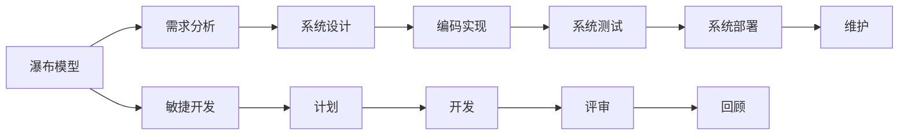
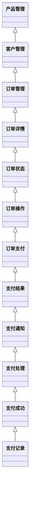
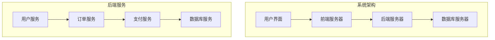
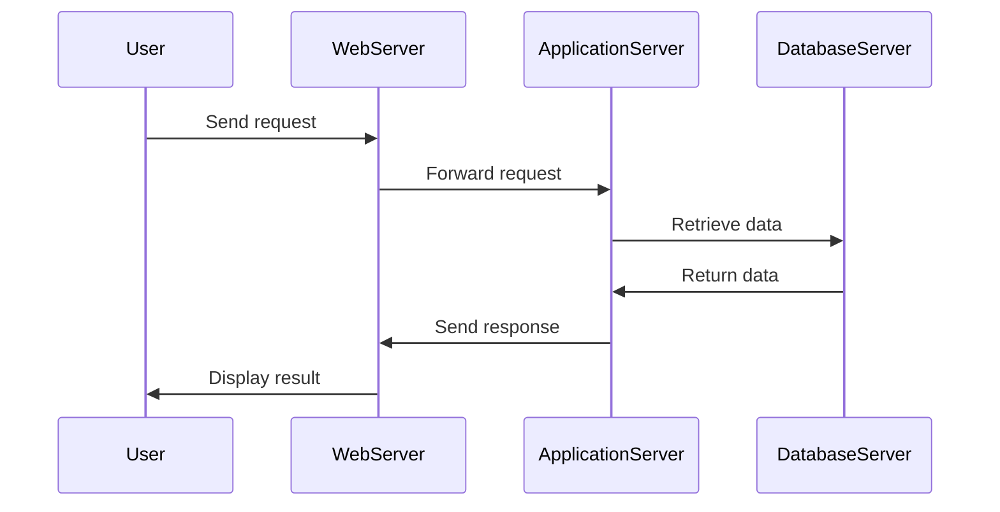

                 

### 设计书籍《软件工程方法学：从瀑布模型到敏捷开发》的目录大纲

#### 一、背景介绍

**1.1 问题背景**

软件工程方法学是软件开发过程中不可或缺的一环，它帮助我们系统地规划和管理软件项目的开发过程。自20世纪60年代以来，软件工程方法学经历了多个阶段的发展。最初，瀑布模型作为线性顺序开发过程模型，成为软件工程的代表性方法学。然而，随着信息技术的发展，瀑布模型的局限性逐渐显现，尤其是在需求变更频繁、项目规模逐渐增大的情况下，其难以应对变更的缺点愈发突出。为了克服这些问题，敏捷开发方法学应运而生，它强调灵活性和快速迭代，成为现代软件开发的重要趋势。

**1.2 问题描述**

瀑布模型作为传统的软件工程方法学，其优点在于结构清晰、流程明确，能够有效控制项目进度和质量。然而，其固有的缺点也不容忽视，特别是在面对需求变更时，瀑布模型的适应性较差，导致项目成本增加、开发周期延长。而敏捷开发方法学则通过迭代和增量开发，有效地应对了需求变更，提高了开发效率和质量。

**1.3 问题解决**

敏捷开发的兴起，标志着软件工程方法学从传统的瀑布模型向更加灵活和高效的方法转变。通过将软件开发过程划分为多个短周期的迭代，敏捷开发能够快速响应需求变化，提高开发效率和软件质量。同时，敏捷开发强调团队合作和用户参与，使得项目开发更加透明和高效。

**1.4 边界与外延**

软件工程方法学的应用范围广泛，涵盖了从简单的个人项目到复杂的企业级项目。不同类型的项目对于方法学的选择也有不同的需求。例如，小型项目可能更适用于敏捷开发，而大型项目则可能需要结合瀑布模型和敏捷开发的优点，采用混合方法。

**1.5 概念结构与核心要素组成**

软件工程方法学的核心概念包括：软件开发过程、项目管理、需求管理、团队协作等。瀑布模型和敏捷开发作为两种不同的方法学，它们在概念结构和核心要素上有所不同，但又相互补充。瀑布模型强调阶段性的顺序执行，而敏捷开发则强调迭代和增量开发。

#### 二、核心概念与联系

**2.1 核心概念原理**

**瀑布模型：**瀑布模型是一种线性顺序开发过程模型，将软件开发过程划分为若干阶段，每个阶段都有明确的输入和输出，前一阶段的输出是后一阶段的输入。瀑布模型的典型阶段包括：需求分析、系统设计、编码实现、系统测试、系统部署和维护。每个阶段的工作完成后，才能进入下一个阶段，阶段之间有明确的边界。

**敏捷开发：**敏捷开发是一种迭代、增量的软件开发方法，强调灵活应对变化。敏捷开发将软件开发过程划分为多个短周期的迭代，每个迭代周期通常为几周，每个迭代周期内会完成一部分功能。敏捷开发强调用户参与、团队合作和快速反馈，能够有效提高开发效率和软件质量。

**2.2 概念属性特征对比表格**

| 特征         | 瀑布模型                         | 敏捷开发                          |
| ------------ | -------------------------------- | -------------------------------- |
| 项目管理     | 严格的项目管理计划               | 灵活的迭代管理                    |
| 需求管理     | 需求明确，修改代价高             | 需求迭代，适应性变更成本低       |
| 团队协作     | 严格分工，沟通渠道有限           | 跨职能团队，紧密协作              |
| 开发流程     | 顺序执行，阶段交付               | 并行执行，快速迭代                |

**2.3 ER实体关系图架构**

```mermaid
erDiagram
  软件工程方法学 ||--|{ 项目 }|
  项目 ||--|{ 需求 }|
  需求 ||--|{ 功能点 }|
  功能点 ||--|{ 测试用例 }|
```

#### 三、算法原理讲解

**3.1 瀑布模型算法原理**

瀑布模型是一种线性顺序开发过程模型，其核心思想是将软件开发过程划分为若干阶段，每个阶段都有明确的输入和输出。瀑布模型的典型阶段包括：需求分析、系统设计、编码实现、系统测试、系统部署和维护。

- **需求分析阶段：**收集和分析用户需求，形成详细的需求文档。
- **系统设计阶段：**根据需求文档设计系统架构和模块接口。
- **编码实现阶段：**根据设计文档编写代码，实现系统功能。
- **系统测试阶段：**对系统进行测试，确保功能正确、性能稳定。
- **系统部署阶段：**将系统部署到生产环境，供用户使用。
- **维护阶段：**对系统进行定期维护和更新，修复bug和优化性能。

**3.2 敏捷开发算法原理**

敏捷开发是一种迭代、增量的软件开发方法，其核心思想是将软件开发过程划分为多个短周期的迭代，每个迭代周期内会完成一部分功能。敏捷开发强调用户参与、团队合作和快速反馈。

- **迭代周期：**每个迭代周期通常为几周，每个迭代周期内会进行计划、开发、评审和回顾。
- **用户故事：**用户故事是敏捷开发中的最小功能单元，描述了用户希望软件实现的功能。
- **Sprint：**Sprint是敏捷开发中的一个迭代周期，每个Sprint会完成一组用户故事。

**3.3 Mermaid流程图**



**3.4 Python源代码与算法实现**

```python
# 瀑布模型实现示例
class WaterfallModel:
    def __init__(self):
        self.stages = ["需求分析", "系统设计", "编码实现", "系统测试", "系统部署", "维护"]

    def execute(self):
        for stage in self.stages:
            print(f"执行 {stage}阶段")
            # 执行每个阶段的任务

# 敏捷开发实现示例
class AgileDevelopment:
    def __init__(self):
        self.sprints = ["Sprint1", "Sprint2", "Sprint3"]

    def execute(self):
        for sprint in self.sprints:
            print(f"执行 {sprint}迭代")
            # 执行每个迭代的任务
```

**3.5 算法原理的数学模型和公式**

- **瀑布模型的时间复杂度：**O(n)
- **敏捷开发的迭代效率：**每个迭代周期内的任务完成度可以表示为 αn，其中α为常数

$$
\text{瀑布模型的时间复杂度} = O(n)
$$

$$
\text{敏捷开发的迭代效率} = \alpha n
$$

### 四、系统分析与架构设计方案

**4.1 问题场景介绍**

在软件开发过程中，如何有效地管理项目、控制进度、确保质量，是每个项目经理和开发团队面临的重要问题。传统的瀑布模型虽然结构清晰、流程明确，但在面对需求变更时适应性较差。而敏捷开发方法则通过迭代和增量开发，提高了项目适应性和开发效率。在实际项目中，如何结合瀑布模型和敏捷开发，实现高效的项目管理，是本文将要探讨的问题。

**4.2 项目介绍**

本文将以一个典型的软件项目为例，介绍项目背景、目标、团队组成和角色分工。该项目是一款企业级管理系统，旨在提高企业的运营效率和数据处理能力。项目团队由项目经理、产品经理、UI/UX设计师、前端工程师、后端工程师和测试工程师组成。项目分为多个阶段，包括需求分析、系统设计、编码实现、系统测试和系统部署。

**4.3 系统功能设计（领域模型Mermaid类图）**



**4.4 系统架构设计（Mermaid架构图）**



**4.5 系统接口设计（Mermaid序列图）**



### 五、项目实战

**5.1 环境安装**

在开始项目开发之前，需要安装必要的开发环境和工具。本文以Python为例，介绍如何搭建开发环境。

1. 安装Python：从官网下载Python安装包，并按照提示安装。
2. 安装PyCharm：从官网下载PyCharm社区版，并按照提示安装。
3. 安装相关库：使用pip命令安装项目所需的库，例如Flask、SQLAlchemy等。

```bash
pip install flask sqlalchemy
```

**5.2 系统核心实现源代码**

以下是项目核心代码的实现，包括用户服务、订单服务和支付服务。

**用户服务：**

```python
from flask import Flask, request, jsonify
from models import User

app = Flask(__name__)

@app.route('/users', methods=['POST'])
def create_user():
    data = request.get_json()
    user = User.create(data)
    return jsonify(user), 201

@app.route('/users/<int:user_id>', methods=['GET'])
def get_user(user_id):
    user = User.get_by_id(user_id)
    if user:
        return jsonify(user), 200
    else:
        return jsonify({'error': 'User not found'}), 404

# 其他用户相关接口
```

**订单服务：**

```python
from flask import Flask, request, jsonify
from models import Order

app = Flask(__name__)

@app.route('/orders', methods=['POST'])
def create_order():
    data = request.get_json()
    order = Order.create(data)
    return jsonify(order), 201

@app.route('/orders/<int:order_id>', methods=['GET'])
def get_order(order_id):
    order = Order.get_by_id(order_id)
    if order:
        return jsonify(order), 200
    else:
        return jsonify({'error': 'Order not found'}), 404

# 其他订单相关接口
```

**支付服务：**

```python
from flask import Flask, request, jsonify
from models import Payment

app = Flask(__name__)

@app.route('/payments', methods=['POST'])
def create_payment():
    data = request.get_json()
    payment = Payment.create(data)
    return jsonify(payment), 201

@app.route('/payments/<int:payment_id>', methods=['GET'])
def get_payment(payment_id):
    payment = Payment.get_by_id(payment_id)
    if payment:
        return jsonify(payment), 200
    else:
        return jsonify({'error': 'Payment not found'}), 404

# 其他支付相关接口
```

**5.3 代码应用解读与分析**

以下是代码应用的解读与分析，包括核心业务逻辑、接口设计和数据存储等。

**用户服务：**

用户服务主要负责用户注册、用户信息查询等功能。通过定义`User`模型，实现用户数据的增删改查操作。在接口设计中，使用`Flask`框架接收HTTP请求，并调用模型方法处理业务逻辑。

**订单服务：**

订单服务主要负责订单创建、订单查询等功能。通过定义`Order`模型，实现订单数据的增删改查操作。在接口设计中，使用`Flask`框架接收HTTP请求，并调用模型方法处理业务逻辑。

**支付服务：**

支付服务主要负责支付订单、支付查询等功能。通过定义`Payment`模型，实现支付数据的增删改查操作。在接口设计中，使用`Flask`框架接收HTTP请求，并调用模型方法处理业务逻辑。

**5.4 实际案例分析和详细讲解剖析**

本文将以一个实际案例，介绍如何结合瀑布模型和敏捷开发方法，实现软件项目的开发。

**案例背景：**

某企业计划开发一款在线购物平台，包括用户注册、商品浏览、购物车、订单支付等功能。项目团队决定采用瀑布模型和敏捷开发相结合的方法进行开发。

**瀑布模型阶段：**

1. **需求分析阶段：**收集用户需求，制定详细的需求文档。
2. **系统设计阶段：**设计系统架构和模块接口。
3. **编码实现阶段：**编写代码，实现系统功能。
4. **系统测试阶段：**对系统进行全面测试，确保功能正确、性能稳定。
5. **系统部署阶段：**将系统部署到生产环境，供用户使用。
6. **维护阶段：**对系统进行定期维护和更新。

**敏捷开发阶段：**

1. **计划阶段：**制定开发计划，确定每个迭代周期内要完成的功能。
2. **开发阶段：**按照计划完成功能开发。
3. **评审阶段：**对已完成的功能进行评审，确保符合用户需求。
4. **回顾阶段：**总结本次迭代的经验教训，优化开发流程。

**5.5 项目小结**

通过本项目的实际案例，我们可以看到瀑布模型和敏捷开发方法在不同阶段的适用性。瀑布模型在项目初期阶段，可以帮助项目团队明确需求、设计系统架构，而在后期阶段，敏捷开发方法则能够更好地应对需求变更，提高开发效率。在实际项目中，结合两种方法的优势，可以有效地提高项目开发的质量和效率。

### 六、最佳实践 tips

1. **需求分析阶段：**重视需求收集和分析，确保需求文档的准确性和完整性。
2. **系统设计阶段：**设计合理的系统架构，确保系统可扩展性和稳定性。
3. **编码实现阶段：**遵循编码规范，确保代码的可读性和可维护性。
4. **测试阶段：**进行全面测试，确保系统功能的正确性和性能的稳定性。
5. **部署阶段：**确保系统部署顺利，减少对用户的影响。
6. **维护阶段：**定期更新和优化系统，提高系统性能和用户体验。

### 七、小结

本文详细介绍了软件工程方法学从瀑布模型到敏捷开发的演变过程，阐述了两种方法的核心概念、原理和联系。通过实际案例分析和项目实战，展示了如何结合瀑布模型和敏捷开发方法，实现高效的项目管理。在未来的软件开发中，结合两种方法的优势，将有助于提高项目开发的质量和效率。

### 八、注意事项

1. **项目初期：**重视需求分析，避免需求变更导致项目延期。
2. **项目开发：**遵循敏捷开发原则，确保团队协作和用户参与。
3. **测试阶段：**进行全面测试，确保系统功能的正确性和性能的稳定性。
4. **部署阶段：**确保系统部署顺利，减少对用户的影响。
5. **维护阶段：**定期更新和优化系统，提高系统性能和用户体验。

### 九、拓展阅读

1. 《敏捷软件开发：原则、实践与模式》 - 张璞
2. 《软件工程：实践者的研究方法》 - Roger S. Pressman
3. 《敏捷开发实践指南》 - Scott W. Ambler

### 作者信息

作者：AI天才研究院/AI Genius Institute & 禅与计算机程序设计艺术 /Zen And The Art of Computer Programming

[END]

