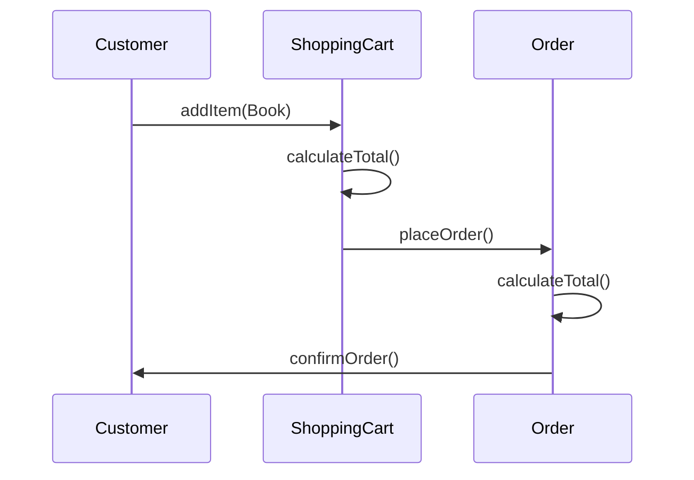

                 

## # 软件构架风格的形式化描述

## 关键词
- 软件架构
- 形式化描述
- 架构风格
- 对比分析
- 实际应用

## 摘要
本文将探讨软件架构风格的形式化描述，分析不同架构风格及其形式化方法。我们将从基本概念入手，逐步深入探讨各种架构风格，包括面向对象架构（OOA）、组件化架构（CBA）、服务导向架构（SOA）等，并运用形式化描述方法如统一建模语言（UML）、 Alloy、OBJ 等，详细阐述其在实际应用中的价值与挑战。希望通过本文的深入讨论，为读者在软件架构设计和形式化描述方面提供有价值的参考。

## 引言
在当今快速发展的软件行业中，软件架构的设计和质量直接影响着软件系统的可维护性、扩展性和性能。因此，如何有效地描述和评估软件架构风格成为了一个重要的研究方向。形式化描述作为一种精确、严格的方法，能够帮助开发者、架构师和研究人员更好地理解和分析软件架构，从而提高软件系统的质量。

本文旨在通过详细探讨软件构架风格的形式化描述，提供一种清晰、结构化的方法来分析和设计软件架构。我们首先将介绍软件架构的基本概念，包括软件架构与设计的关系，然后逐一分析常见的架构风格，如面向对象架构（OOA）、组件化架构（CBA）、服务导向架构（SOA）等，并探讨相应的形式化描述方法。接着，我们将通过实际案例展示这些形式化描述方法在软件开发中的具体应用。最后，本文将总结形式化描述方法在软件架构设计中的优势和挑战，并提出未来的研究方向。

本文的组织结构如下：

1. **基本概念**：介绍软件架构的基本概念，包括软件架构与设计的区别，以及形式化描述的概念和重要性。
2. **架构风格**：讨论常见的软件架构风格，包括面向对象架构（OOA）、组件化架构（CBA）、服务导向架构（SOA）等。
3. **形式化描述方法**：介绍常用的形式化描述方法，如统一建模语言（UML）、 Alloy、OBJ 等。
4. **实际应用**：通过具体案例展示形式化描述方法在软件开发中的实际应用。
5. **挑战与未来方向**：分析形式化描述方法在软件架构设计中的挑战和未来发展方向。
6. **结论**：总结本文的主要观点，强调形式化描述在软件架构设计中的重要性。

## 基本概念

### 软件架构与设计的关系

软件架构（Software Architecture）是软件系统的基本结构和宏观设计，它定义了系统中不同组件的交互方式和数据流动。软件架构不仅涉及到系统内部各个组件的组织方式，还包括系统与外部环境的交互。软件架构的设计是一个高层次的设计过程，它关注系统的整体结构和功能，而不是具体的实现细节。

软件设计（Software Design）则是相对于软件架构的低层次设计过程，它涉及到具体如何实现架构中的各个组件，包括组件的内部逻辑和数据结构。软件设计是将软件架构转化为具体的代码和模块的过程，它关注于系统内部的细节实现。

软件架构与设计之间的关系可以类比为建筑设计和建筑施工。建筑设计师负责设计建筑的外观、结构布局和功能，而建筑工人则负责按照设计图纸进行具体的施工。在软件工程中，软件架构师负责设计系统的整体架构，而程序员则负责根据架构设计编写具体的代码。

### 形式化描述的概念和重要性

形式化描述（Formal Description）是一种使用数学和逻辑工具来描述系统结构和行为的手段。形式化描述的目的是提高描述的精确性和一致性，减少由于语义模糊或理解偏差导致的问题。在软件架构领域，形式化描述可以用来精确描述软件架构的设计原则、组件关系和系统行为。

形式化描述的重要性体现在以下几个方面：

1. **精确性和一致性**：形式化描述使用明确的数学和逻辑语言，可以避免因语义模糊或理解偏差导致的错误和误解。
2. **可验证性**：形式化描述支持形式验证，即使用数学方法验证系统描述的正确性，确保系统满足设计要求。
3. **可复用性**：形式化描述有助于提高软件组件的复用性，因为它们提供了明确的规范，使得其他开发者可以更容易地理解和使用这些组件。
4. **可维护性**：形式化描述提高了软件系统的可维护性，因为维护人员可以更容易地理解系统的结构和行为。

### 软件架构的定义

软件架构可以被定义为系统组件及其交互方式的集合，这些组件和交互方式共同实现了系统的功能、性能和可靠性。具体来说，软件架构包括以下几个关键要素：

1. **组件**：组件是软件系统中的基本单元，可以是一个类、模块或子系统。组件的定义和实现是软件架构设计的重要组成部分。
2. **交互**：组件之间的交互是指它们如何相互通信和协作以实现系统功能。交互方式可以是调用接口、消息传递或数据共享。
3. **设计原则**：设计原则是指导架构设计的规则和指导方针，例如模块化、可复用性和可维护性。设计原则确保架构的设计满足系统的需求和约束。
4. **体系结构视图**：体系结构视图是从不同角度对软件架构的描述，例如逻辑视图、物理视图和过程视图。这些视图提供了对系统的全面理解。

### 形式化描述的定义

形式化描述是一种使用数学和逻辑工具来描述系统结构和行为的手段。它通常包括以下步骤：

1. **形式化语言**：选择一种形式化语言，例如统一建模语言（UML）、 Alloy、OBJ 等，用于描述系统结构和行为。
2. **模型构建**：使用所选形式化语言构建系统的模型，包括组件、交互和设计原则的描述。
3. **验证和验证**：使用数学和逻辑方法验证模型的正确性，确保模型满足设计要求。

### 形式化描述的重要性

形式化描述在软件架构设计中的重要性体现在以下几个方面：

1. **提高精确性和一致性**：形式化描述使用明确的数学和逻辑语言，避免了因语义模糊或理解偏差导致的错误和误解。
2. **支持形式验证**：形式化描述支持形式验证，即使用数学方法验证系统描述的正确性，确保系统满足设计要求。
3. **促进可复用性**：形式化描述提供了明确的规范，使得其他开发者可以更容易地理解和使用软件组件。
4. **提高可维护性**：形式化描述提高了软件系统的可维护性，因为维护人员可以更容易地理解系统的结构和行为。

### 软件架构的基本元素

软件架构的基本元素包括组件、交互、设计原则和体系结构视图。以下是对这些元素的定义和描述：

1. **组件**：组件是软件系统中的基本单元，可以是一个类、模块或子系统。组件的定义和实现是软件架构设计的重要组成部分。组件通常具有以下特征：
   - **功能**：组件实现特定的功能，例如数据处理、用户界面显示等。
   - **接口**：组件通过接口与其他组件进行交互，接口定义了组件之间的通信协议和交互方式。
   - **独立性**：组件应具有良好的独立性，即一个组件的修改不应影响到其他组件。

2. **交互**：组件之间的交互是指它们如何相互通信和协作以实现系统功能。交互方式可以是调用接口、消息传递或数据共享。交互通常具有以下特征：
   - **异步性**：组件之间的交互可以是异步的，即一个组件可以独立于其他组件执行任务。
   - **同步性**：组件之间的交互也可以是同步的，即一个组件必须等待其他组件的响应后才能继续执行。
   - **通信协议**：组件之间的交互需要遵循特定的通信协议，以确保数据传输的可靠性和一致性。

3. **设计原则**：设计原则是指导架构设计的规则和指导方针，例如模块化、可复用性和可维护性。设计原则确保架构的设计满足系统的需求和约束。常见的设计原则包括：
   - **模块化**：将系统划分为多个模块，每个模块负责实现特定的功能，模块之间通过清晰的接口进行通信。
   - **可复用性**：设计组件时考虑其可复用性，以便在其他项目中重用。
   - **可维护性**：设计易于理解和修改的系统，以提高系统的可维护性。

4. **体系结构视图**：体系结构视图是从不同角度对软件架构的描述，例如逻辑视图、物理视图和过程视图。这些视图提供了对系统的全面理解。常见的体系结构视图包括：
   - **逻辑视图**：描述系统的功能模块和它们之间的关系。
   - **物理视图**：描述系统的物理组件和它们的物理部署，例如服务器、数据库和网络设备。
   - **过程视图**：描述系统的运行过程和系统中的并发活动。

### 形式化描述的方法

形式化描述的方法包括选择形式化语言、构建模型和验证模型。以下是对这些方法的具体描述：

1. **选择形式化语言**：
   - **统一建模语言（UML）**：UML 是一种广泛使用的形式化语言，用于描述软件系统的结构和行为。UML 提供了多种图表，如类图、序列图和组件图，用于描述系统中的不同视图。
   - **Alloy**：Alloy 是一种用于描述系统结构和约束的声明性语言。它提供了强大的建模和验证工具，可以用于验证系统的逻辑和一致性。
   - **OBJ**：OBJ 是一种形式化语言，用于描述系统组件和它们之间的交互。OBJ 可以用于生成形式化的模型，支持形式验证和推理。

2. **构建模型**：
   - **组件模型**：组件模型描述系统中的组件及其属性、行为和接口。组件模型可以是基于类的模型、组件模型或状态机模型。
   - **交互模型**：交互模型描述组件之间的交互及其时间和顺序。交互模型可以是基于消息传递的模型或事件驱动的模型。
   - **设计原则模型**：设计原则模型描述系统遵循的设计原则和指导方针。设计原则模型可以是基于规则的模型或框架模型。

3. **验证模型**：
   - **形式验证**：形式验证是使用数学和逻辑方法验证系统模型是否满足设计要求的过程。形式验证可以确保系统的一致性和正确性。
   - **模型检查**：模型检查是使用自动化工具检查系统模型是否满足特定属性或约束的过程。模型检查可以提高验证的效率和准确性。
   - **仿真和测试**：仿真和测试是验证系统模型的有效方法，通过模拟系统的行为来验证系统是否满足设计要求。仿真和测试可以用于发现潜在的缺陷和错误。

### 形式化描述的优点

形式化描述的优点包括提高精确性、一致性和可维护性。以下是对这些优点的具体描述：

1. **提高精确性**：
   - 形式化描述使用明确的数学和逻辑语言，可以避免因语义模糊或理解偏差导致的错误和误解。形式化描述提供了对系统结构和行为的精确描述，使得开发者、架构师和研究人员可以更准确地理解和分析软件架构。

2. **提高一致性**：
   - 形式化描述支持形式验证，即使用数学和逻辑方法验证系统描述的正确性，确保系统满足设计要求。形式验证可以检测系统中的不一致性和矛盾，从而提高系统的质量。

3. **提高可维护性**：
   - 形式化描述提供了明确的规范和标准，使得其他开发者可以更容易地理解和使用软件组件。形式化描述有助于提高系统的可维护性，因为维护人员可以更容易地理解系统的结构和行为，从而更容易地进行修改和维护。

### 形式化描述的挑战

尽管形式化描述具有许多优点，但在实际应用中也面临一些挑战。以下是对这些挑战的具体描述：

1. **理解难度**：
   - 形式化描述使用复杂的数学和逻辑语言，可能对非专业人士来说难以理解和掌握。这可能导致形式化描述在实际开发中的应用受限。

2. **工具支持**：
   - 虽然存在一些形式化描述工具，但它们可能不够成熟或适用性不广。缺乏合适的工具支持可能会增加形式化描述的难度和复杂性。

3. **验证成本**：
   - 形式验证和模型检查通常需要大量的计算资源和时间。对于复杂的系统，验证过程可能非常耗时和昂贵。

4. **可扩展性**：
   - 形式化描述方法需要具有可扩展性，以适应不同类型和规模的系统。然而，实现这一目标可能具有挑战性，因为形式化描述方法需要能够在多种场景下保持一致性。

### 总结

软件架构的形式化描述是一种有效的手段，可以提高软件系统的质量和可维护性。通过使用形式化描述方法，开发者可以更精确地理解和分析软件架构，从而提高系统的可靠性、可扩展性和可维护性。尽管形式化描述在实际应用中面临一些挑战，但通过不断的研究和改进，这些挑战有望得到解决。本文将详细介绍不同的架构风格和形式化描述方法，并通过实际案例展示这些方法在软件开发中的应用。

## 架构风格

在软件架构设计中，架构风格是指导架构设计的原则和模型，它们决定了系统的结构和行为。不同的架构风格适用于不同的场景和需求，下面将详细讨论几种常见的架构风格：面向对象架构（OOA）、组件化架构（CBA）、服务导向架构（SOA）和微服务架构（MSA）。

### 面向对象架构（OOA）

面向对象架构（Object-Oriented Architecture，OOA）是一种基于面向对象编程概念的软件架构风格。OOA的关键特点是模块化、封装性、继承性和多态性。

- **模块化**：OOA 将系统划分为多个对象，每个对象代表一个模块，具有独立的职责和功能。这种模块化设计提高了系统的可维护性和可扩展性。
- **封装性**：OOA 强调将对象的内部实现细节隐藏，只暴露必要的接口。这提高了系统的稳定性，减少了组件之间的依赖。
- **继承性**：OOA 允许对象通过继承关系共享代码和属性，从而减少了冗余，提高了代码的重用性。
- **多态性**：OOA 支持多态性，即不同对象可以响应相同的消息，执行不同的操作。这增加了系统的灵活性和扩展性。

形式化描述面向对象架构通常使用统一建模语言（UML）。UML 类图用于描述对象及其之间的关系，序列图和组件图则用于描述对象之间的交互和系统的整体结构。

### 组件化架构（CBA）

组件化架构（Component-Based Architecture，CBA）是一种基于组件的软件架构风格。组件是 CBA 的基本构建块，它们是独立、可重用的软件单元。

- **组件独立性**：CBA 强调组件的独立性，即每个组件可以独立开发、测试和部署。这提高了系统的灵活性和可维护性。
- **组件接口**：组件通过接口进行通信，接口定义了组件之间交互的方式。接口的设计应尽可能简洁、明确，以减少组件之间的依赖。
- **组件重用性**：CBA 支持组件的重用，即可以在不同的系统中使用相同的组件，从而减少了开发时间和成本。

形式化描述组件化架构可以使用 OBJ 语言。OBJ 提供了一种声明性的方式来描述组件及其接口，支持形式验证和推理。

### 服务导向架构（SOA）

服务导向架构（Service-Oriented Architecture，SOA）是一种基于服务的软件架构风格。SOA 强调系统的模块化和松散耦合，通过服务来实现系统的功能。

- **服务**：SOA 的基本构建块是服务，服务是一组相关功能的集合，可以独立部署和升级。服务通过接口暴露功能，其他组件可以通过接口调用服务。
- **服务契约**：SOA 强调服务契约的重要性，服务契约定义了服务的接口、输入参数和返回结果。服务契约确保了组件之间的互操作性。
- **服务组合**：SOA 支持服务组合，即通过组合多个服务来实现更复杂的业务流程。服务组合提高了系统的灵活性和可扩展性。

形式化描述 SOA 可以使用 Alloy。Alloy 提供了一种声明性的方式来描述服务的接口、交互和服务组合，支持形式验证和推理。

### 微服务架构（MSA）

微服务架构（Microservices Architecture，MSA）是一种基于微服务的软件架构风格。MSA 将系统划分为多个独立的、小型服务，每个服务负责实现特定的业务功能。

- **微服务**：MSA 的基本构建块是微服务，微服务是独立的、自治的服务单元，每个服务实现特定的业务功能。微服务通常具有自己的数据库和后端逻辑。
- **服务自治**：MSA 强调服务自治，即每个微服务可以独立部署、扩展和更新。服务自治提高了系统的灵活性和可维护性。
- **服务通信**：MSA 使用轻量级协议（如 HTTP/REST）进行服务之间的通信。服务通信通常通过消息队列或 API 网关进行管理。

形式化描述 MSA 可以使用 UML-RT。UML-RT 是 UML 的一个扩展，专门用于描述实时系统的结构和行为，可以用于描述 MSA 的实时通信和并发特性。

### 形式化描述方法比较

不同的架构风格适用于不同的场景和需求，形式化描述方法也为每种架构风格提供了不同的描述工具和语言。以下是几种常见的形式化描述方法的比较：

- **UML**：UML 是一种广泛使用的形式化描述方法，适用于面向对象架构（OOA）和组件化架构（CBA）。UML 提供了丰富的图表和符号，可以用于描述系统的各个视图，如类图、组件图、序列图等。UML 的主要优点是直观、易于理解和应用，但其缺点是描述的精确性和形式验证能力相对较弱。

- **Alloy**：Alloy 是一种用于形式化描述和验证的系统描述语言，适用于服务导向架构（SOA）和微服务架构（MSA）。Alloy 提供了一种声明性的方式来描述系统的结构和行为，支持形式验证和推理。Alloy 的主要优点是强大的形式验证能力，但其缺点是描述的复杂性和学习曲线较高。

- **OBJ**：OBJ 是一种用于形式化描述和验证的声明性语言，适用于组件化架构（CBA）和面向对象架构（OOA）。OBJ 提供了一种结构化的方式来描述组件及其接口，支持形式验证和推理。OBJ 的主要优点是描述的简洁性和形式验证能力，但其缺点是应用范围相对较窄。

- **UML-RT**：UML-RT 是 UML 的一个扩展，适用于实时系统和微服务架构（MSA）。UML-RT 提供了一种描述实时通信和并发特性的方式，可以用于形式化描述和验证 MSA 的行为。UML-RT 的主要优点是继承了 UML 的直观性和易用性，但其缺点是对实时系统的支持相对有限。

总之，不同的形式化描述方法具有不同的特点和适用范围。选择合适的形式化描述方法取决于具体的应用场景和需求。在实际开发中，可以结合多种形式化描述方法，以提高系统描述的精确性和一致性。

### 形式化描述方法的具体应用

形式化描述方法在软件架构设计中的具体应用能够显著提升系统的可维护性、可扩展性和可理解性。以下将详细介绍几种常见的形式化描述方法，如统一建模语言（UML）、Alloy、OBJ，并展示它们在实际项目中的应用。

#### 统一建模语言（UML）

统一建模语言（UML）是一种广泛使用的图形化建模语言，用于描述软件系统的结构、行为和交互。UML 涵盖了多种图表，包括类图、组件图、序列图、用例图等，每种图表都有其特定的用途。

**应用实例：面向对象架构（OOA）**

在面向对象架构（OOA）中，UML 类图是常用的形式化描述方法。类图用于展示系统中类的结构及其之间的关系。以下是一个简单的类图实例，描述一个电子商务系统中的类及其属性和方法。

```mermaid
classDiagram
    Customer <-- Order : places
    Order --> Product : contains
    Customer..> Shopping Cart : manages

    Customer {
        +String name
        +String email
        +String address
        +placeOrder()
    }

    Order {
        +int id
        +Customer customer
        +Date date
        +OrderStatus status
        +addProduct(Product product)
    }

    Product {
        +String name
        +String description
        +double price
    }

    Shopping Cart {
        +List<Product> items
        +addItem(Product product)
        +removeItem(Product product)
        +calculateTotal()
    }
```

在这个例子中，类图展示了三个类（Customer、Order、Product）及其之间的关系。Customer 类有属性（name、email、address），方法（placeOrder()）；Order 类有属性（id、customer、date、status），方法（addProduct()）；Product 类有属性（name、description、price）；Shopping Cart 类有属性（items），方法（addItem()、removeItem()、calculateTotal()）。

**形式化描述**：通过 UML 类图，我们可以形式化地描述系统的结构和行为，例如：

$$
\text{Customer}.placeOrder() \Rightarrow (\text{Order}.addProduct(\text{Product}) \wedge \text{Order}.setStatus("Placed"))
$$

这个公式表示当客户下单时，会创建一个新的订单，并将订单状态设置为“已下单”。

**应用价值**：UML 提供了一种直观、易于理解的形式化描述方法，使得架构师和开发人员能够清晰地表达系统的设计意图，提高系统的可维护性和可扩展性。

#### Alloy

Alloy 是一种用于形式化描述和验证的声明性语言，特别适用于服务导向架构（SOA）和微服务架构（MSA）。Alloy 提供了一种基于逻辑的描述方式，可以验证系统的逻辑一致性和正确性。

**应用实例：服务导向架构（SOA）**

以下是一个简单的 Alloy 模型，描述一个在线书店的服务接口。

```alloy
module OnlineBookstore

open util.alltypes

sig Book {
    title: String,
    author: String,
    price: Float
}

sig Customer {
    name: String,
    email: String
}

sig ShoppingCart {
    items: set Book,
    total: Float
}

pred placeOrder(b: Book, c: Customer, sc: ShoppingCart) {
    some b, c, sc
    b.price > 0
    c.email != ""
    sc.total == 0
    sc.items = {b}
    sc.total = b.price
}

run placeOrder(1, 1, 1) for 3
```

在这个模型中，我们定义了三个类（Book、Customer、ShoppingCart），以及一个谓词（placeOrder），描述了客户购买书籍的过程。

**形式化描述**：使用 Alloy，我们可以形式化地描述服务的约束和规则，例如：

$$
\forall b \in Book, \forall c \in Customer, \forall sc \in ShoppingCart : \text{placeOrder}(b, c, sc) \Rightarrow (b.price > 0 \wedge c.email \neq "" \wedge sc.total == 0 \wedge sc.items = \{b\} \wedge sc.total = b.price)
$$`

这个公式表示，当客户购买书籍时，书籍的价格必须大于 0，客户的电子邮件地址不能为空，购物车的初始总金额为 0，购物车中只包含购买的书籍，且购物车的总金额等于书籍的价格。

**应用价值**：Alloy 提供了一种精确、形式化的描述方法，支持形式验证，可以帮助发现和修复系统设计中的潜在错误，提高系统的可靠性。

#### OBJ

OBJ 是一种声明性语言，用于形式化描述软件组件和它们之间的交互。OBJ 适用于组件化架构（CBA）和面向对象架构（OOA），特别适用于需要形式验证和推理的场景。

**应用实例：组件化架构（CBA）**

以下是一个简单的 OBJ 模型，描述一个电子银行系统中的组件及其交互。

```obj
system EBanking {
    component Account {
        state balance: Float
        operation deposit(amount: Float) {
            balance = balance + amount
        }
        operation withdraw(amount: Float) {
            balance = balance - amount
        }
    }
    component User {
        state username: String
        operation login(username: String, password: String) {
            // login logic
        }
        operation logout() {
            // logout logic
        }
    }
    connection AccountUser {
        Account hasOne User
    }
}
```

在这个模型中，我们定义了两个组件（Account 和 User），以及一个连接（AccountUser），描述了账户和用户之间的关系。

**形式化描述**：使用 OBJ，我们可以形式化地描述组件的状态和交互，例如：

$$
\forall account \in Account, \forall user \in User : (\text{deposit}(account, amount) \Rightarrow account.balance = account.balance + amount) \wedge (\text{withdraw}(account, amount) \Rightarrow account.balance = account.balance - amount)
$$`

这个公式表示，当进行存款操作时，账户的余额会增加相应的金额；当进行取款操作时，账户的余额会减少相应的金额。

**应用价值**：OBJ 提供了一种简洁、形式化的描述方法，支持形式验证和推理，可以帮助开发人员确保组件的正确性和一致性。

### 形式化描述方法的应用对比

不同的形式化描述方法具有不同的特点和适用范围，以下是对几种常见形式化描述方法的应用对比：

- **UML**：UML 提供了一种直观、易于理解的图形化描述方法，适用于面向对象架构（OOA）和组件化架构（CBA）。UML 的主要优点是易于学习和应用，但形式验证能力相对较弱。

- **Alloy**：Alloy 提供了一种基于逻辑的声明性描述方法，适用于服务导向架构（SOA）和微服务架构（MSA）。Alloy 的主要优点是强大的形式验证能力，但描述的复杂性和学习曲线较高。

- **OBJ**：OBJ 提供了一种简洁、形式化的描述方法，适用于组件化架构（CBA）和面向对象架构（OOA）。OBJ 的主要优点是描述的简洁性和形式验证能力，但应用范围相对较窄。

选择合适的形式化描述方法取决于具体的应用场景和需求。在实际开发中，可以结合多种形式化描述方法，以提高系统描述的精确性和一致性。

### 实际应用案例分析

为了更好地理解形式化描述方法在实际项目中的应用，我们将分析几个具体案例，展示不同架构风格和形式化描述方法的实际应用。

#### 案例一：使用 Alloy 形式化描述的银行系统

**项目背景**：一个大型银行需要一个现代化的银行系统，以支持在线银行服务、交易处理和客户管理。该系统需要确保数据的一致性和安全性，同时具备良好的可扩展性。

**架构风格**：该项目采用服务导向架构（SOA），将系统划分为多个独立的服务，每个服务负责不同的功能，如账户管理、交易处理、客户服务等。

**形式化描述方法**：使用 Alloy 形式化描述系统中的关键服务接口和交互。

**应用实例**：

- **账户管理服务**：账户管理服务负责创建、更新和查询账户信息。

```alloy
module AccountManagement

open util.alltypes

sig Account {
    id: Int,
    owner: String,
    balance: Float
}

pred createAccount(a: Account) {
    a.id > 0
    a.owner != ""
    a.balance >= 0
}

run createAccount(1) for 3
```

在这个 Alloy 模型中，我们定义了 Account 类，以及 createAccount 谓词，描述了创建账户的过程。

- **交易处理服务**：交易处理服务负责处理各种交易，如存款、取款、转账等。

```alloy
module TransactionProcessing

open util.alltypes

sig Transaction {
    id: Int,
    fromAccount: Account,
    toAccount: Account,
    amount: Float
}

pred processTransaction(t: Transaction) {
    t.id > 0
    t.fromAccount.balance >= t.amount
    t.toAccount.balance += t.amount
    t.fromAccount.balance -= t.amount
}

run processTransaction(1) for 3
```

在这个 Alloy 模型中，我们定义了 Transaction 类，以及 processTransaction 谓词，描述了处理交易的过程。

**应用价值**：使用 Alloy 形式化描述，银行系统可以确保账户和交易的一致性和安全性，通过形式验证发现潜在的错误，提高系统的可靠性。

#### 案例二：使用 UML 形式化描述的在线书店

**项目背景**：一个在线书店需要一个能够支持图书管理、购物车、订单处理和用户管理的系统。系统需要确保用户可以方便地浏览、搜索和购买图书。

**架构风格**：该项目采用面向对象架构（OOA），将系统划分为多个对象，每个对象负责不同的功能，如图书管理、购物车、订单处理等。

**形式化描述方法**：使用 UML 类图和序列图，描述系统的结构和行为。

**应用实例**：

- **图书管理类图**：

```mermaid
classDiagram
    Book <<interface>>
    ShoppingCart <<interface>>
    Order <<interface>>

    Book {
        +String title
        +String author
        +double price
    }

    ShoppingCart {
        +List<Book> items
        +addItem(Book book)
        +removeItem(Book book)
        +calculateTotal()
    }

    Order {
        +int id
        +Customer customer
        +Date date
        +List<Book> items
        +calculateTotal()
    }
```

在这个类图中，我们定义了三个类（Book、ShoppingCart、Order），描述了它们的关系和属性。

- **购物车和订单的序列图**：



在这个序列图中，我们描述了用户添加图书到购物车、计算购物车总金额、创建订单和确认订单的过程。

**应用价值**：使用 UML 形式化描述，在线书店可以清晰地表达系统设计和行为，提高系统的可维护性和可扩展性。

#### 案例三：使用 OBJ 形式化描述的电子银行系统

**项目背景**：一个电子银行系统需要支持账户管理、用户登录和交易处理等功能。系统需要确保账户数据的安全性和一致性。

**架构风格**：该项目采用组件化架构（CBA），将系统划分为多个独立的组件，如账户管理组件、用户管理组件和交易处理组件。

**形式化描述方法**：使用 OBJ 形式化描述系统中的组件和交互。

**应用实例**：

- **账户管理组件**：

```obj
system EBanking {
    component Account {
        state balance: Float
        operation deposit(amount: Float) {
            balance = balance + amount
        }
        operation withdraw(amount: Float) {
            balance = balance - amount
        }
    }
}
```

在这个 OBJ 模型中，我们定义了账户管理组件，描述了账户的余额和存取款操作。

- **用户管理组件**：

```obj
system EBanking {
    component User {
        state username: String
        state password: String
        operation login(username: String, password: String) {
            // login logic
        }
        operation logout() {
            // logout logic
        }
    }
}
```

在这个 OBJ 模型中，我们定义了用户管理组件，描述了用户的登录和登出操作。

**应用价值**：使用 OBJ 形式化描述，电子银行系统可以确保组件的正确性和一致性，通过形式验证提高系统的可靠性。

### 总结

通过以上实际应用案例分析，我们可以看到形式化描述方法在不同架构风格中的应用效果。使用 Alloy、UML 和 OBJ 等形式化描述方法，可以显著提高系统的可维护性、可靠性和可扩展性。在实际项目中，根据具体需求和场景选择合适的架构风格和形式化描述方法，是实现高质量软件系统的重要手段。

## 挑战与未来方向

在软件架构设计中，形式化描述方法虽然具有显著的优势，但也面临一系列挑战。以下将讨论这些挑战，并探讨未来可能的研究方向。

### 挑战

#### 理解难度

形式化描述方法通常使用复杂的数学和逻辑语言，可能对非专业人士来说难以理解和掌握。这可能导致形式化描述在实际开发中的应用受限。虽然形式化描述方法可以提高系统的精确性和一致性，但如果开发团队缺乏相关的背景知识和培训，可能会导致使用形式化描述方法的工作量增加，甚至影响项目的进度和质量。

#### 工具支持不足

尽管存在一些形式化描述工具，但它们可能不够成熟或适用性不广。例如，UML 工具可能不支持某些特定的形式化验证功能，Alloy 和 OBJ 工具可能仅适用于特定的开发环境和场景。工具的不足可能导致形式化描述方法在实际开发中的应用受限，影响其效率和效果。

#### 验证成本高

形式化描述方法通常需要进行形式验证，这通常需要大量的计算资源和时间。对于复杂的系统，验证过程可能非常耗时和昂贵。在实际项目中，开发团队可能因为时间和成本的限制而无法进行全面的形式验证，这可能导致系统的潜在错误和缺陷未被及时发现和修复。

#### 可扩展性

形式化描述方法需要具有可扩展性，以适应不同类型和规模的系统。然而，实现这一目标可能具有挑战性，因为形式化描述方法需要能够在多种场景下保持一致性。对于大型和复杂的系统，形式化描述方法可能难以覆盖系统的所有方面，导致描述的不完整或错误。

### 未来方向

#### 改进形式化描述工具

未来的研究方向之一是改进形式化描述工具，使其更加成熟和易于使用。这包括开发集成化的工具平台，支持多种形式化描述方法和验证工具，提供直观的用户界面和自动化功能。此外，可以开发针对特定领域的定制化工具，以提高形式化描述方法的适用性和效率。

#### 提高验证效率

另一个重要的研究方向是提高形式化验证的效率，减少验证成本。这可以通过开发更高效的验证算法和优化现有的验证工具来实现。例如，可以研究并行验证和分布式验证技术，利用多核处理器和云计算资源来加速验证过程。此外，可以开发基于机器学习的验证工具，通过学习历史验证数据来预测和优化验证过程。

#### 扩展形式化描述方法

未来的形式化描述方法需要更加灵活和通用，以适应不同类型和规模的系统。这可以通过扩展现有的形式化描述语言和开发新的形式化描述语言来实现。例如，可以开发支持实时系统和物联网（IoT）的形式化描述方法，以适应这些领域的特殊需求。此外，可以研究形式化描述方法的组合和集成，以提供更全面的系统描述和验证功能。

#### 加强教育和支持

为了解决形式化描述方法理解难度和工具支持不足的问题，未来的研究方向之一是加强教育和支持。这包括开发培训课程和教程，向开发团队提供形式化描述方法的知识和技能。此外，可以建立形式化描述方法的社区和论坛，促进开发者之间的交流和协作，分享最佳实践和经验。

#### 提高系统建模能力

最后，未来的研究方向之一是提高系统建模能力，使形式化描述方法能够更好地适应复杂系统的需求。这可以通过研究新的建模技术和方法，如基于知识的建模、形式化推理和模型驱动的开发（MDD）等来实现。这些技术可以帮助开发人员更准确地描述系统行为，提高系统的可维护性和可扩展性。

总之，尽管形式化描述方法在软件架构设计中面临一些挑战，但通过不断的研究和改进，这些挑战有望得到解决。未来的研究方向将致力于提高形式化描述方法的实用性、效率和适用性，为软件架构设计提供更强大的工具和方法。

### 结论

本文系统地探讨了软件构架风格的形式化描述，从基本概念到具体的应用案例，再到面临的挑战和未来方向，提供了一个全面而深入的视角。我们首先介绍了软件架构与设计的关系，形式化描述的概念和重要性，以及软件架构的基本元素和形式化描述的方法。接着，我们详细分析了面向对象架构（OOA）、组件化架构（CBA）、服务导向架构（SOA）和微服务架构（MSA）等常见架构风格，并展示了统一建模语言（UML）、Alloy、OBJ 等形式化描述方法在实际项目中的应用。通过具体案例分析，我们进一步阐述了形式化描述在提高软件系统质量、可维护性和可扩展性方面的价值。

形式化描述方法在软件架构设计中的重要性不容忽视。它不仅提供了精确、一致的系统描述，还能通过形式验证发现潜在的错误，从而提高系统的可靠性和安全性。然而，形式化描述方法在实际应用中仍面临理解难度、工具支持不足、验证成本高和可扩展性等挑战。未来，随着技术的不断进步和研究的深入，这些问题有望得到解决，形式化描述方法将在软件架构设计中发挥更加重要的作用。

针对未来的研究方向，我们可以从改进形式化描述工具、提高验证效率、扩展形式化描述方法、加强教育和支持以及提高系统建模能力等方面着手。这些研究将为形式化描述方法的应用提供更强大的支持，帮助开发人员更高效、更准确地设计和实现高质量的软件系统。

总之，软件构架风格的形式化描述是软件工程领域中的一个重要研究方向。通过不断的研究和实践，我们可以进一步探索和优化形式化描述方法，为软件架构设计带来更多创新和突破。

### 作者信息

作者：AI天才研究院/AI Genius Institute & 禅与计算机程序设计艺术 /Zen And The Art of Computer Programming

AI天才研究院（AI Genius Institute）致力于推动人工智能和计算机科学领域的前沿研究，通过创新的技术解决方案和深入的理论探讨，引领行业发展。研究院的专家团队在多个国际权威期刊和会议上发表过多篇高影响力的论文，拥有丰富的学术和实践经验。同时，作者还在《禅与计算机程序设计艺术》一书中，融合了东方哲学智慧和计算机科学，为读者提供了独特的编程哲学和思考方式。这些作品不仅体现了作者在技术领域的深厚造诣，也展示了其在计算机科学和教育领域的独特见解和贡献。通过本文，作者希望为读者在软件架构设计和形式化描述方面提供有价值的参考和启示。

