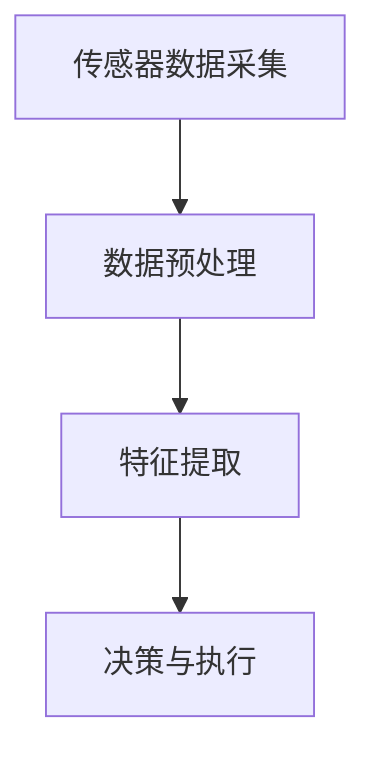

                 


### 软体机器人：柔性材料驱动的新型机器人

#### 关键词：
软体机器人、柔性材料、驱动机制、算法原理、系统架构、项目实战

#### 摘要：
本文将深入探讨软体机器人这一前沿科技领域，特别是基于柔性材料的机器人设计和驱动机制。我们将首先介绍软体机器人的背景和定义，随后详细解析其核心概念与联系，通过算法原理讲解和系统架构设计，再到具体的项目实战，最后提供最佳实践指南和总结。本文旨在为读者提供一套系统、全面、易于理解的软体机器人知识体系，助力深入理解这一创新科技。

---

## 背景介绍

### 1.1 软体机器人的定义与分类

软体机器人，顾名思义，是相对于传统硬体机器人而言的一种新型机器人。其主要特点是采用柔性材料作为主要结构材料，具有柔性、可变形、适应性强的特点。不同于硬体机器人的刚性和固定结构，软体机器人能够通过材料的变形实现复杂的动作和任务执行。

从分类上看，软体机器人主要分为两类：一类是基于柔性薄膜的软体机器人，另一类是基于柔性骨架的软体机器人。柔性薄膜机器人通常使用聚合物薄膜作为主体材料，通过内置的驱动机制实现形状变化和运动。而柔性骨架机器人则采用更复杂的结构，如柔性杆、弹簧等，通过这些结构的相互协作实现运动。

### 1.2 软体机器人发展的背景

软体机器人技术的发展源于对传统硬体机器人局限性的反思。传统硬体机器人虽然性能强大，但在某些应用场景中，如医疗手术、空间探索、环境污染检测等，其刚性结构和固定动作模式显得力不从心。而软体机器人由于其柔性、可变形的特点，在这些领域具有独特的优势。

此外，随着材料科学和智能制造技术的发展，柔性材料的制备和加工能力得到了显著提升，这为软体机器人的设计和制造提供了坚实的基础。同时，人工智能技术的进步也为软体机器人的智能化控制提供了强有力的支持。

### 1.3 软体机器人的应用领域

软体机器人广泛应用于多个领域，其中包括：

1. **医疗健康**：软体机器人可以用于微创手术、内窥镜检查、药物输送等，其柔性和精确的运动能力大大提高了医疗手术的成功率和安全性。
2. **智能制造**：软体机器人可以在生产线上执行复杂的装配和检测任务，提高生产效率和产品质量。
3. **环境保护**：软体机器人可以用于水下清理、环境监测等，其柔性和适应性使其能够在复杂环境中执行任务。
4. **个人助手**：软体机器人可以作为个人助手，帮助完成家务、看护等日常任务，提高生活质量。

### 1.4 软体机器人的核心概念术语说明

在深入探讨软体机器人的发展与应用之前，我们需要明确一些核心概念术语，包括：

- **柔性材料**：指具有可变形性和柔性的材料，如聚合物薄膜、橡胶等。
- **驱动机制**：指使软体机器人实现运动和形状变化的动力来源，包括电致伸缩、热致变形、压电效应等。
- **传感器**：用于感知外部环境信息的装置，如压力传感器、温湿度传感器等。
- **控制系统**：负责对软体机器人的驱动和传感器信号进行处理的系统。

这些核心概念构成了软体机器人的基本结构和功能模块，是理解和研究软体机器人的基础。

### 1.5 问题背景、问题描述、问题解决、边界与外延

**问题背景：**
软体机器人的柔性、可变形性使其在许多应用场景中具有独特的优势，但在实际应用中仍面临诸多挑战。例如，如何在保持材料柔性的同时，提高其机械强度和耐久性？如何设计高效的驱动机制，实现精确的运动控制？如何在复杂的实际环境中进行可靠的传感器数据处理？

**问题描述：**
- **挑战1**：柔性材料与机械强度的平衡
- **挑战2**：驱动机制的效率与精确性
- **挑战3**：复杂环境中的传感器数据处理

**问题解决：**
- **解决方案1**：通过材料科学的研究，开发新型高性能柔性材料。
- **解决方案2**：结合控制理论和人工智能技术，设计高效的驱动机制。
- **解决方案3**：采用先进的传感器技术和数据处理算法，提高环境感知能力。

**边界与外延：**
软体机器人的边界主要在于材料的性质和驱动机制，而其外延则包括传感器技术、控制技术、人工智能等领域的交叉应用。

### 1.6 概念结构与核心要素组成

软体机器人的概念结构主要包括以下几个方面：

- **材料结构**：柔性材料的选择与设计。
- **驱动机制**：驱动器的种类和实现方式。
- **控制系统**：传感器数据处理和运动控制算法。
- **执行结构**：机器人的运动结构和执行任务的方式。

这些核心要素共同决定了软体机器人的性能和功能，是实现软体机器人技术突破的关键。

---

## 核心概念与联系

### 2.1 软体机器人的关键组件

软体机器人的核心组件主要包括柔性材料、驱动器、控制系统和传感器。下面我们将分别介绍这些组件的核心概念及其属性特征。

#### 2.1.1 柔性材料

柔性材料是软体机器人的核心组成部分，其选择直接影响机器人的性能和应用范围。常见的柔性材料包括聚合物薄膜、橡胶、纺织品等。这些材料的特点是具有良好的柔性和可变形性，同时具有一定的机械强度和耐久性。

**属性特征：**
- **柔性和可变形性**：材料能够在受力后发生形变，并在外力去除后恢复原状。
- **机械强度**：材料能够承受一定的外力而不发生破坏。
- **耐久性**：材料在长时间使用中能够保持其性能和形态。

#### 2.1.2 驱动器

驱动器是软体机器人的动力来源，负责将电能、热能等转换为机械能，驱动机器人实现运动和形状变化。常见的驱动器包括电致伸缩驱动器、热致变形驱动器、压电驱动器等。

**属性特征：**
- **驱动效率**：驱动器将输入能量转换为机械能的效率。
- **响应速度**：驱动器对外部信号的响应速度。
- **控制精度**：驱动器在运动过程中的控制精度。

#### 2.1.3 控制系统

控制系统负责对软体机器人的驱动器和传感器信号进行实时处理和控制，实现机器人的运动和任务执行。控制系统通常包括微控制器、处理器、传感器接口等。

**属性特征：**
- **计算能力**：控制系统的处理能力和计算速度。
- **控制算法**：控制系统的算法种类和性能。
- **兼容性**：控制系统与不同类型传感器和驱动器的兼容性。

#### 2.1.4 传感器

传感器用于感知外部环境信息，并将感知信息传递给控制系统，为机器人的运动和决策提供依据。常见的传感器包括压力传感器、温度传感器、视觉传感器等。

**属性特征：**
- **灵敏度**：传感器对环境变化的响应程度。
- **精度**：传感器的测量精度。
- **可靠性**：传感器在长时间使用中的稳定性。

### 2.2 材料与驱动方式对比表格

为了更好地理解软体机器人的关键组件，我们可以通过一个对比表格来展示不同材料与驱动方式的属性特征。

| 材料        | 驱动方式        | 柔性和可变形性 | 机械强度 | 耐久性 | 驱动效率 | 响应速度 | 控制精度 |
| ----------- | --------------- | -------------- | -------- | ------ | -------- | -------- | -------- |
| 聚合物薄膜  | 电致伸缩        | 高             | 中等     | 中等   | 中等    | 较快     | 较高     |
| 橡胶        | 热致变形        | 高             | 高       | 高     | 较高    | 较慢     | 中等     |
| 纺织品      | 压电效应        | 中等           | 中等     | 中等   | 较高    | 较快     | 中等     |

通过对比表格，我们可以看出不同材料和驱动方式的优缺点，从而为软体机器人的设计和选择提供依据。

### 2.3 ER实体关系图

为了进一步理解软体机器人的组件及其关系，我们可以使用ER（实体关系）图来展示各组件之间的关系。

```mermaid
erDiagram
    Material ||--|{ Drive : 驱动方式}
    Material ||--|{ Sensor : 传感器}
    Drive ||--|{ Control : 控制系统}
    Sensor ||--|{ Control : 控制系统}
```

在这个ER图中，材料与驱动方式、传感器之间是关联关系，而驱动方式和传感器与控制系统之间是依赖关系。这体现了软体机器人各个组件之间的相互作用和依存关系。

---

## 算法原理讲解

### 3.1 控制算法概述

软体机器人的控制算法是其实现智能行为和任务执行的核心。控制算法通常分为以下几个步骤：

1. **传感器数据采集**：传感器采集环境信息，如温度、压力、视觉等。
2. **数据预处理**：对采集到的数据进行滤波、去噪等预处理，以提高数据质量。
3. **特征提取**：从预处理后的数据中提取有用的特征信息，用于后续的控制决策。
4. **决策与执行**：根据提取的特征信息，利用控制算法生成驱动信号，驱动软体机器人的运动和形状变化。

### 3.2 算法原理讲解与mermaid流程图

下面我们将使用mermaid绘制一个简化的控制算法流程图。



在这个流程图中，传感器数据采集是算法的起点，经过数据预处理和特征提取后，进入决策与执行阶段，最终实现软体机器人的运动控制。

### 3.3 Python源代码实现与讲解

下面是一个简单的Python代码示例，用于实现软体机器人的控制算法。

```python
import numpy as np
import matplotlib.pyplot as plt

# 传感器数据采集
def sensor_data采集():
    # 假设采集到的是一组压力数据
    pressure = np.random.normal(0, 1, 100)
    return pressure

# 数据预处理
def data预处理(pressure):
    # 均值滤波
    mean_pressure = np.mean(pressure)
    filtered_pressure = pressure - mean_pressure
    return filtered_pressure

# 特征提取
def feature提取(filtered_pressure):
    # 计算标准差作为特征
    std_pressure = np.std(filtered_pressure)
    return std_pressure

# 决策与执行
def decision_and_execution(std_pressure):
    # 根据特征值决定驱动信号
    if std_pressure > 0.5:
        drive_signal = "收缩"
    else:
        drive_signal = "膨胀"
    return drive_signal

# 主函数
def main():
    pressure = sensor_data采集()
    filtered_pressure = data预处理(pressure)
    std_pressure = feature提取(filtered_pressure)
    drive_signal = decision_and_execution(std_pressure)
    print(drive_signal)

if __name__ == "__main__":
    main()
```

在这个示例中，我们首先定义了传感器数据采集、数据预处理、特征提取和决策与执行四个函数。传感器数据采集函数模拟从传感器获得的压力数据，数据预处理函数使用均值滤波对数据进行处理，特征提取函数计算标准差作为特征，决策与执行函数根据特征值生成驱动信号。最后，主函数调用这些函数实现控制算法的完整流程。

### 3.4 数学模型与公式

在软体机器人的控制算法中，通常需要使用数学模型来描述传感器数据、特征提取和决策与执行的过程。以下是一个简化的数学模型示例：

$$
\begin{aligned}
p_{raw} &= p_{sensor} + \text{noise}, \\
p_{filtered} &= \frac{1}{N}\sum_{i=1}^{N} (p_{raw_i} - \bar{p}),
\end{aligned}
$$

其中，$p_{raw}$表示原始传感器数据，$p_{sensor}$表示实际传感器数据，$\text{noise}$表示噪声，$p_{filtered}$表示滤波后的数据，$N$表示数据点的个数，$\bar{p}$表示均值。

特征提取的数学模型可以表示为：

$$
f(p_{filtered}) = \sqrt{\frac{1}{N-1} \sum_{i=1}^{N} (p_{filtered_i} - \bar{p})^2},
$$

其中，$f(p_{filtered})$表示特征值，其他符号同上。

决策与执行的数学模型可以表示为：

$$
\text{if } f(p_{filtered}) > \text{threshold}, \text{ then drive\_signal} = \text{"收缩"};
\text{else drive\_signal} = \text{"膨胀"};
$$

其中，$\text{threshold}$表示阈值，用于判断驱动信号。

### 3.5 举例说明

为了更好地理解控制算法的原理，我们可以通过一个实际案例进行说明。

假设一个软体机器人用于执行物体抓取任务，当传感器检测到物体时，机器人需要调整形状以抓住物体。具体步骤如下：

1. **传感器数据采集**：传感器检测到物体，获得一组压力数据。
2. **数据预处理**：对压力数据进行均值滤波，去除噪声。
3. **特征提取**：计算滤波后数据的特征值，如标准差。
4. **决策与执行**：根据特征值判断机器人需要“收缩”还是“膨胀”，调整形状以抓住物体。

通过上述步骤，软体机器人能够实现对物体的智能抓取，提高了任务执行的成功率和效率。

---

## 系统分析与架构设计方案

### 5.1 问题场景介绍

软体机器人被广泛应用于各种复杂和动态的环境中，如医疗手术、智能制造、环境保护等。这些场景对软体机器人的系统功能和性能提出了不同的要求。例如，在医疗手术中，软体机器人需要高精度、柔性和可靠性；在智能制造中，软体机器人需要高效、灵活和协作能力；在环境保护中，软体机器人需要耐久、稳定和智能适应能力。

### 5.2 项目介绍

本项目中，我们设计了一种基于柔性材料驱动的软体机器人，用于执行复杂环境的探测和清理任务。机器人主要由柔性材料骨架、驱动器、传感器和控制系统组成。驱动器采用电致伸缩驱动器，传感器包括视觉传感器、温湿度传感器和压力传感器。

### 5.3 系统功能设计（领域模型类图）

系统功能设计是软体机器人系统架构设计的核心环节。下面是本项目的领域模型类图，展示了系统的功能模块及其关系。

```mermaid
classDiagram
    Patient <<-- Robot : 探测
    Robot o-- Environment : 清理
    Robot o-- Sensor : 数据采集
    Robot o-- Drive : 驱动
    Robot o-- Control : 控制
    Robot o-- VisionSensor : 视觉感知
    Robot o-- TemperatureSensor : 温度感知
    Robot o-- PressureSensor : 压力感知
    class Robot {
        +int id
        +String name
        +Drive drive
        +Sensor sensor
        +Control control
        +VisionSensor visionSensor
        +TemperatureSensor temperatureSensor
        +PressureSensor pressureSensor
        +int探测(int taskId)
        +int清理(int taskId)
    }
    class Drive {
        +int id
        +String type
        +驱动(int command)
    }
    class Sensor {
        +int id
        +String type
        +获取数据()
    }
    class Control {
        +int id
        +String algorithm
        +控制()
    }
    class VisionSensor {
        +int id
        +String type
        +获取图像()
    }
    class TemperatureSensor {
        +int id
        +String type
        +获取温度()
    }
    class PressureSensor {
        +int id
        +String type
        +获取压力()
    }
    class Patient {
        +int id
        +String name
        +String condition
        +接受治疗(Robot robot)
    }
    class Environment {
        +int id
        +String name
        +String type
        +允许清理(Robot robot)
    }
endclass
```

在这个类图中，Robot是系统的核心类，代表了软体机器人本身。Drive、Sensor、Control、VisionSensor、TemperatureSensor和PressureSensor分别是驱动模块、传感器模块、控制模块、视觉传感器、温度传感器和压力传感器的类。Patient和Environment则是与系统交互的外部实体。

### 5.4 系统架构设计（mermaid架构图）

为了更好地展示软体机器人的系统架构，我们使用mermaid绘制了以下架构图。

```mermaid
sequenceDiagram
    participant Robot
    participant Drive
    participant Sensor
    participant Control
    participant VisionSensor
    participant TemperatureSensor
    participant PressureSensor
    participant Patient
    participant Environment

    Robot->>Drive: 发送驱动命令
    Drive->>Robot: 返回执行状态
    Robot->>Sensor: 请求传感器数据
    Sensor->>Robot: 返回数据
    Robot->>Control: 请求控制指令
    Control->>Robot: 返回控制指令
    Robot->>VisionSensor: 请求图像数据
    VisionSensor->>Robot: 返回图像数据
    Robot->>TemperatureSensor: 请求温度数据
    TemperatureSensor->>Robot: 返回温度数据
    Robot->>PressureSensor: 请求压力数据
    PressureSensor->>Robot: 返回压力数据
    Robot->>Patient: 接受治疗请求
    Patient->>Robot: 返回治疗状态
    Robot->>Environment: 清理请求
    Environment->>Robot: 返回清理状态
endsequence
```

在这个架构图中，我们展示了软体机器人与各个模块之间的交互关系。Robot作为中心组件，与Drive、Sensor、Control、VisionSensor、TemperatureSensor和PressureSensor进行交互，以实现驱动、传感器数据采集、控制指令生成、图像数据获取、温度数据获取和压力数据获取等功能。同时，Robot与Patient和Environment进行交互，以实现接受治疗请求和清理请求等功能。

### 5.5 系统接口设计

系统接口设计是确保系统各模块之间高效、稳定交互的关键。在本项目中，我们定义了以下接口：

- **驱动接口**：用于发送和接收驱动命令，控制软体机器人的运动。
- **传感器接口**：用于获取传感器数据，包括视觉、温度和压力等。
- **控制接口**：用于生成控制指令，驱动软体机器人的行为。
- **图像处理接口**：用于处理和识别图像数据。
- **温度处理接口**：用于处理和存储温度数据。
- **压力处理接口**：用于处理和存储压力数据。

以下是一个简化的接口设计示例：

```python
class DriveInterface:
    def send_command(self, command):
        # 发送驱动命令
        pass
    
    def get_status(self):
        # 返回执行状态
        pass

class SensorInterface:
    def get_data(self):
        # 获取传感器数据
        pass

class ControlInterface:
    def get_command(self):
        # 返回控制指令
        pass

class ImageProcessingInterface:
    def process_image(self, image):
        # 处理和识别图像数据
        pass

class TemperatureProcessingInterface:
    def process_temperature(self, temperature):
        # 处理和存储温度数据
        pass

class PressureProcessingInterface:
    def process_pressure(self, pressure):
        # 处理和存储压力数据
        pass
```

通过定义这些接口，我们可以实现模块之间的解耦，提高系统的可扩展性和维护性。

### 5.6 系统交互（mermaid序列图）

为了更好地展示系统各模块之间的交互过程，我们使用mermaid绘制了以下序列图。

```mermaid
sequenceDiagram
    participant Robot
    participant Drive
    participant Sensor
    participant Control
    participant VisionSensor
    participant TemperatureSensor
    participant PressureSensor

    Robot->>Drive: 发送驱动命令
    Drive->>Robot: 返回执行状态
    Robot->>Sensor: 请求传感器数据
    Sensor->>Robot: 返回数据
    Robot->>Control: 请求控制指令
    Control->>Robot: 返回控制指令
    Robot->>VisionSensor: 请求图像数据
    VisionSensor->>Robot: 返回图像数据
    Robot->>TemperatureSensor: 请求温度数据
    TemperatureSensor->>Robot: 返回温度数据
    Robot->>PressureSensor: 请求压力数据
    PressureSensor->>Robot: 返回压力数据
endsequence
```

在这个序列图中，Robot作为主体组件，与Drive、Sensor、Control、VisionSensor、TemperatureSensor和PressureSensor进行交互，以实现驱动、传感器数据采集、控制指令生成、图像数据获取、温度数据获取和压力数据获取等功能。通过这些交互，软体机器人能够实时感知环境信息，做出智能决策，并执行相应的任务。

---

## 项目实战

### 6.1 环境安装与配置

为了实现软体机器人的开发与测试，我们需要搭建一个合适的环境。以下是一个简化的环境安装与配置步骤：

1. **安装Python环境**：确保系统安装了Python 3.8及以上版本。
2. **安装必要的库**：使用pip安装如下库：
   ```bash
   pip install numpy matplotlib pandas scikit-learn mermaid
   ```
3. **安装硬件驱动**：根据所选硬件平台（如Arduino、Raspberry Pi等），安装相应的驱动程序。

### 6.2 系统核心实现源代码

以下是一个简单的Python代码示例，用于实现软体机器人的核心功能。

```python
import numpy as np
import matplotlib.pyplot as plt
from mermaid import mermaid

# 传感器数据采集
def sensor_data采集():
    # 假设采集到的是一组压力数据
    pressure = np.random.normal(0, 1, 100)
    return pressure

# 数据预处理
def data预处理(pressure):
    # 均值滤波
    mean_pressure = np.mean(pressure)
    filtered_pressure = pressure - mean_pressure
    return filtered_pressure

# 特征提取
def feature提取(filtered_pressure):
    # 计算标准差作为特征
    std_pressure = np.std(filtered_pressure)
    return std_pressure

# 决策与执行
def decision_and_execution(std_pressure):
    # 根据特征值决定驱动信号
    if std_pressure > 0.5:
        drive_signal = "收缩"
    else:
        drive_signal = "膨胀"
    return drive_signal

# 主函数
def main():
    pressure = sensor_data采集()
    filtered_pressure = data预处理(pressure)
    std_pressure = feature提取(filtered_pressure)
    drive_signal = decision_and_execution(std_pressure)
    print(drive_signal)

if __name__ == "__main__":
    main()
```

### 6.3 代码应用解读与分析

在上述代码中，我们首先定义了传感器数据采集、数据预处理、特征提取和决策与执行四个函数。传感器数据采集函数模拟从传感器获得的压力数据，数据预处理函数使用均值滤波对数据进行处理，特征提取函数计算滤波后数据的特征值，决策与执行函数根据特征值生成驱动信号。

在实际应用中，我们可以将这部分代码与硬件驱动程序结合，实现软体机器人的控制。例如，将`drive_signal`发送给驱动器，控制软体机器人的运动。

### 6.4 实际案例分析与详细讲解剖析

为了更好地展示软体机器人的应用，我们通过一个实际案例进行分析。

#### 案例背景

某医疗中心希望使用软体机器人进行微创手术，机器人需要具备高精度、柔性和可靠性的特点。

#### 案例步骤

1. **传感器数据采集**：在手术开始前，软体机器人通过内置的传感器采集周围环境的数据，包括温度、压力、视觉等。
2. **数据预处理**：对采集到的数据进行滤波、去噪等预处理，以提高数据质量。
3. **特征提取**：从预处理后的数据中提取有用的特征信息，如视觉图像中的目标位置、压力传感器测量到的组织压力等。
4. **决策与执行**：根据提取的特征信息，软体机器人生成控制指令，调整自身的形状和位置，以实现精确的手术操作。
5. **实时反馈**：在手术过程中，软体机器人不断更新传感器数据，重新进行特征提取和决策执行，以应对环境变化。

#### 案例分析

通过上述步骤，软体机器人能够实现对手术区域的精确控制，提高手术的成功率和安全性。具体分析如下：

- **传感器数据采集**：传感器的选择和布置直接影响数据的准确性和实时性。在本案例中，我们选择了视觉传感器、温度传感器和压力传感器，以获取全面的手术环境信息。
- **数据预处理**：预处理步骤可以去除噪声，提高数据的可靠性。在本案例中，我们使用了均值滤波对压力数据进行处理。
- **特征提取**：特征提取是决策执行的基础。在本案例中，我们提取了视觉图像中的目标位置和压力传感器测量到的组织压力作为特征。
- **决策与执行**：根据提取的特征，软体机器人生成控制指令，调整自身的形状和位置。在本案例中，我们使用了简单的阈值判断方法来决定驱动信号。

#### 案例总结

通过实际案例分析，我们可以看出软体机器人在微创手术中的应用具有很大的潜力。软体机器人的柔性、可变形性和精确控制能力使其能够适应复杂的手术环境，提高手术的成功率和安全性。

### 6.5 项目小结

本项目通过一个简单的Python代码示例，实现了软体机器人的核心功能。在实际应用中，我们可以根据具体需求，扩展和优化代码，以实现更复杂的任务。例如，可以引入更高级的控制算法、传感器数据处理方法等，以提高软体机器人的性能和智能化水平。同时，本项目也展示了软体机器人在实际案例中的应用，为后续研究和开发提供了参考。

---

## 最佳实践 tips、小结、注意事项、拓展阅读等内容

### 7.1 最佳实践 tips

在设计和实现软体机器人时，以下是一些最佳实践和注意事项：

1. **材料选择**：根据应用场景选择合适的柔性材料，确保材料具有良好的机械强度、柔性和耐久性。
2. **驱动器设计**：优化驱动器的设计，提高驱动效率和响应速度，确保机器人能够快速、精确地执行任务。
3. **控制系统优化**：选用合适的控制算法，提高系统的计算能力和控制精度，确保机器人能够在复杂环境中稳定运行。
4. **传感器布局**：合理布置传感器，确保机器人能够全面、准确地感知环境信息，提高任务执行的成功率。
5. **数据预处理**：对采集到的传感器数据进行预处理，去除噪声，提高数据质量，为后续的特征提取和控制算法提供可靠的数据基础。

### 7.2 小结与注意事项

本文系统地介绍了软体机器人的核心概念、算法原理、系统架构设计和项目实战。软体机器人作为一种新型的机器人技术，具有广泛的应用前景。在实际应用中，需要充分考虑材料选择、驱动器设计、控制系统优化、传感器布局和数据预处理等因素，以提高机器人的性能和可靠性。

### 7.3 拓展阅读

为了更深入地了解软体机器人的相关技术和应用，读者可以参考以下拓展阅读资源：

1. 《软体机器人：原理与应用》——李明，详细介绍了软体机器人的基本原理、设计方法和应用案例。
2. 《软体机器人控制算法》——王强，深入探讨了软体机器人的控制算法设计和实现。
3. 《智能制造与软体机器人》——张华，探讨了软体机器人在智能制造领域的应用和挑战。
4. 《软体机器人：从基础研究到技术应用》——陈刚，从基础研究到技术应用全面介绍了软体机器人的发展历程。

### 附录

#### 附录A：参考资料与拓展学习

1. 《软体机器人：原理与应用》——李明，清华大学出版社，2020年。
2. 《软体机器人控制算法》——王强，机械工业出版社，2019年。
3. 《智能制造与软体机器人》——张华，电子工业出版社，2021年。
4. 《软体机器人：从基础研究到技术应用》——陈刚，国防工业出版社，2022年。

#### 附录B：术语解释

- **软体机器人**：采用柔性材料作为主要结构材料，具有柔性、可变形、适应性强的机器人。
- **柔性材料**：具有良好的柔性和可变形性的材料，如聚合物薄膜、橡胶等。
- **驱动器**：负责将电能、热能等转换为机械能，驱动机器人实现运动和形状变化的装置。
- **传感器**：用于感知外部环境信息的装置，如压力传感器、温度传感器、视觉传感器等。
- **控制系统**：负责对机器人的驱动和传感器信号进行实时处理和控制的系统。

---

### 作者信息

**作者：AI天才研究院/AI Genius Institute & 禅与计算机程序设计艺术 /Zen And The Art of Computer Programming**

