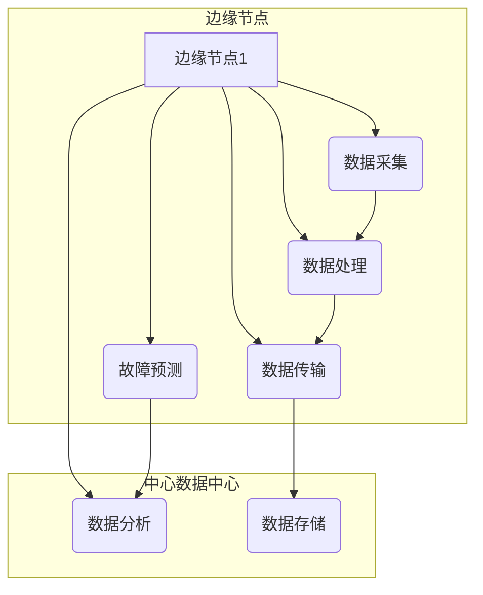
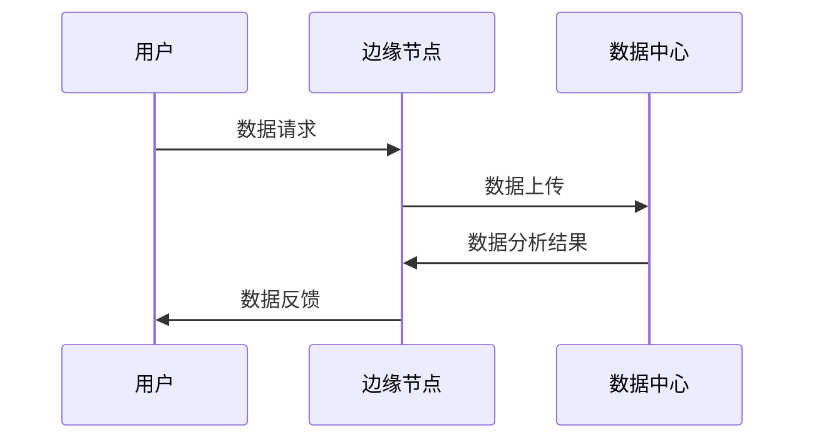
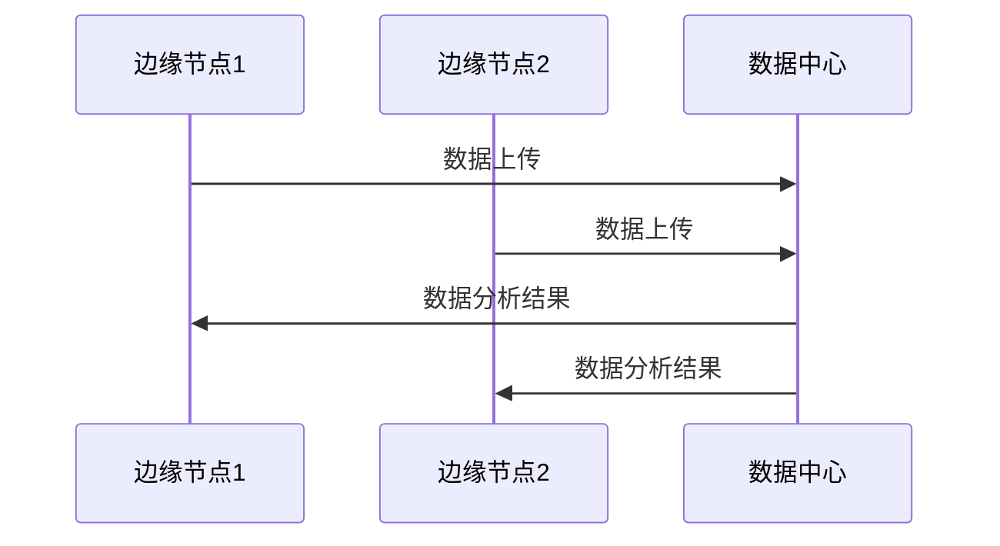
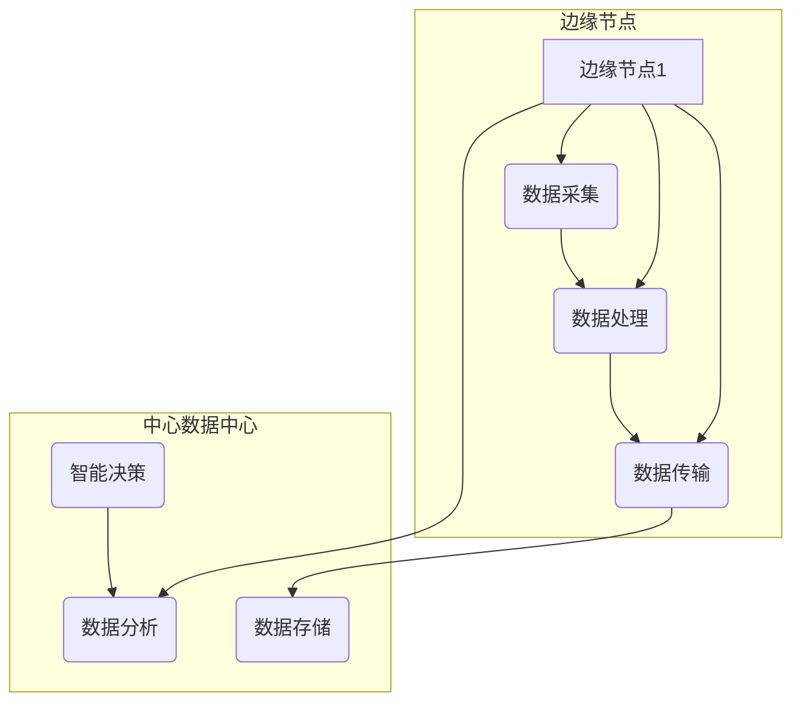
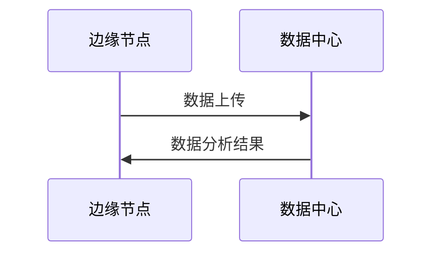

                 

### 引言

#### 1.1 边缘计算的定义与重要性

**问题背景：**

随着物联网（IoT）和智能设备的广泛应用，数据处理需求迅速增加，传统的云计算模式开始面临诸多挑战。数据在传输到云端进行处理的过程中，可能会遭遇延迟、带宽限制等问题，这影响了实时应用场景的体验。边缘计算作为一种分布式计算架构，旨在将数据处理和计算能力推向网络边缘，即在数据产生的源头附近进行数据处理，从而减少传输延迟，提高响应速度。

**问题描述：**

边缘计算的核心问题是如何高效地在网络边缘部署计算资源，以实现对大规模设备、海量数据的实时处理能力。此外，还需要解决数据传输的高效性、系统的可扩展性和高可靠性等问题。

**问题解决：**

边缘计算通过在靠近数据源的节点上部署计算资源，使得数据处理可以在本地快速完成，大大减少了数据传输的时间。此外，边缘计算还可以实现数据的本地存储，减少数据中心的存储压力。

**边界与外延：**

边缘计算不仅仅局限于物联网和智能设备，还可以应用于工业制造、智慧城市、自动驾驶等多个领域。它的外延包括但不限于网络边缘节点、边缘服务器、边缘设备等。

**核心概念：**

- **边缘节点：**指网络边缘的设备，如物联网传感器、工业机器人等。
- **边缘服务器：**指部署在网络边缘的数据中心，用于处理边缘计算任务。
- **边缘设备：**指终端设备，如智能手机、智能手表等。

#### 1.2 5G网络与边缘计算

**5G网络特点：**

5G（第五代移动通信技术）以其高速度、低延迟、高可靠性等特点，为边缘计算提供了强有力的技术支撑。5G网络支持更高的数据速率，可以满足大规模设备同时在线的需求；低延迟使其适用于实时性要求高的应用场景；高可靠性则保证了边缘计算服务的稳定运行。

**5G与边缘计算的联系：**

5G网络与边缘计算密切相关。5G的高带宽、低延迟特性，使得边缘计算在数据传输和处理方面更加高效。同时，5G网络的支持，也为边缘计算提供了更多的连接能力，使得边缘设备能够更轻松地接入网络。

**5G对边缘计算的影响：**

5G网络的出现，不仅提升了边缘计算的性能，还扩展了其应用范围。通过5G网络，边缘计算可以支持更多的实时应用，如自动驾驶、远程医疗等，从而推动智能社会的快速发展。

#### 1.3 超低延迟的分布式计算

**超低延迟的定义：**

超低延迟通常指的是在1毫秒（ms）以内的延迟，这对于实时应用至关重要。在边缘计算中，超低延迟可以确保数据处理能够实时响应，从而提供更佳的用户体验。

**分布式计算的优势：**

分布式计算通过将计算任务分布在多个节点上，可以充分利用资源，提高处理效率。此外，分布式计算还具备高可用性和可扩展性，使得系统能够应对大规模数据处理需求。

**边缘计算与分布式计算的关系：**

边缘计算可以看作是分布式计算的一种特殊形式。在边缘计算中，计算任务被分配到网络边缘的设备上，而不是集中到数据中心。这种分布式的架构，不仅提高了计算效率，还降低了网络延迟。

### 总结

边缘计算与5G的结合，为实现超低延迟的分布式计算提供了重要技术支持。通过将计算能力推向网络边缘，边缘计算可以大幅降低数据处理延迟，提高系统响应速度。随着5G网络的普及，边缘计算的应用前景将更加广阔，有望在智能制造、智慧城市、自动驾驶等领域发挥重要作用。接下来，我们将深入探讨边缘计算的核心技术，以及5G网络的具体实现和应用场景。

## 第1章 引言

### 1.1 边缘计算的定义与重要性

#### **边缘计算的定义：**

边缘计算（Edge Computing）是一种分布式计算架构，它通过在网络的边缘节点（即数据产生的地方）进行数据处理和存储，从而减少了数据传输到中心数据中心的时间。传统的云计算模式通常是将数据从终端设备传输到远端的数据中心进行处理，这种方式在数据量大、实时性要求高的应用场景中存在明显的延迟问题。而边缘计算则通过在数据产生的地方进行初步处理，将有效数据传输到数据中心，从而实现低延迟和高效率的数据处理。

#### **边缘计算的重要性：**

边缘计算的重要性体现在以下几个方面：

1. **降低延迟：** 由于数据处理发生在网络边缘，数据传输的距离大大缩短，从而降低了延迟，提高了实时响应能力。

2. **节省带宽：** 边缘计算将大部分数据处理工作放在了网络边缘，减少了需要传输到中心的数据量，从而节省了带宽资源。

3. **提高可靠性：** 边缘计算可以在网络不稳定或带宽不足的情况下，仍能保证关键任务的执行，提高了系统的可靠性。

4. **增强安全性：** 边缘计算可以在本地对敏感数据加密和处理，降低了数据泄露的风险。

5. **支持复杂应用：** 边缘计算能够处理实时性要求高的复杂应用，如自动驾驶、远程医疗、工业物联网等。

#### **问题背景：**

随着物联网（IoT）和智能设备的广泛应用，数据量和连接数呈现爆炸式增长。传统的云计算模式在处理这些海量数据时，面临着严重的延迟和带宽限制问题。例如，自动驾驶汽车需要实时处理来自传感器的数据，如果依赖远端数据中心处理，将无法满足毫秒级的响应要求。此外，工业物联网中的机器设备也需要实时响应，以实现自动化和优化生产流程。

#### **问题描述：**

边缘计算旨在解决以下核心问题：

- **延迟问题：** 如何降低数据传输和处理的延迟，以满足实时应用的需求？
- **带宽限制：** 如何在带宽受限的网络环境中，有效处理海量数据？
- **数据处理效率：** 如何提高数据处理效率，以支持大规模设备同时在线？
- **系统可靠性：** 如何在分布式环境中保证系统的稳定性和可靠性？

#### **问题解决：**

边缘计算通过以下方式解决了上述问题：

- **本地数据处理：** 边缘计算将数据处理和存储推向网络边缘，减少了数据传输的距离和时间，降低了延迟。
- **分布式架构：** 通过分布式架构，边缘计算能够充分利用网络边缘的设备资源，提高数据处理效率。
- **智能调度：** 边缘计算系统通过智能调度算法，优化任务分配和资源利用，提高系统性能。

#### **边界与外延：**

边缘计算的边界主要包括网络边缘的设备、边缘服务器和数据中心。边缘设备可以是物联网传感器、工业机器人、智能手机等，边缘服务器则是在网络边缘部署的服务器集群，用于处理边缘计算任务。数据中心则负责存储和管理大规模数据。

边缘计算的外延还包括与5G网络、物联网、智能城市等领域的结合，形成广泛的生态系统。例如，在智能制造领域，边缘计算可以与工业物联网相结合，实现生产线的实时监控和自动化控制；在智慧城市领域，边缘计算可以用于城市交通管理、环境监测等。

#### **核心概念：**

1. **边缘节点：** 指网络边缘的设备，如物联网传感器、工业机器人等。
2. **边缘服务器：** 指部署在网络边缘的数据中心，用于处理边缘计算任务。
3. **边缘设备：** 指终端设备，如智能手机、智能手表等。
4. **边缘网关：** 指连接边缘节点和中心数据中心的网络设备，用于数据传输和协议转换。
5. **边缘平台：** 指提供边缘计算服务的平台，包括硬件设备、软件系统和运维管理。

### **1.2 5G网络与边缘计算**

#### **5G网络特点：**

5G（第五代移动通信技术）是当前移动通信技术的最新一代，它具有以下主要特点：

1. **高速率：** 5G网络的理论峰值速度可达数十Gbps，是4G网络的数十倍。这意味着在高速网络环境下，设备之间的数据传输速度更快。
2. **低延迟：** 5G网络的端到端延迟可低至1毫秒，是4G网络的十分之一。这对于实时应用至关重要，如自动驾驶、远程手术等。
3. **高可靠性：** 5G网络通过引入新的通信技术，如MIMO（多输入多输出）、OFDM（正交频分复用）等，提高了网络的可靠性和稳定性。
4. **大连接密度：** 5G网络能够支持更高的连接密度，即单位面积内能够连接的设备数量更多。这对于物联网应用尤为重要。

#### **5G与边缘计算的联系：**

5G网络与边缘计算之间有着紧密的联系。5G网络的高速率、低延迟和高可靠性，为边缘计算提供了强大的技术支撑，使得边缘计算能够更好地实现其功能。具体来说，5G网络与边缘计算的联系体现在以下几个方面：

1. **网络连接：** 5G网络的高带宽和低延迟特性，使得边缘设备能够更稳定、更快速地连接到网络，为边缘计算提供稳定的网络连接。
2. **数据传输：** 5G网络的高速率，能够支持边缘设备之间的高速数据传输，使得边缘计算能够处理更大规模的数据。
3. **协同计算：** 5G网络和边缘计算可以通过协同计算的方式，共同完成复杂的计算任务，提高计算效率和性能。

#### **5G对边缘计算的影响：**

5G网络对边缘计算的影响主要体现在以下几个方面：

1. **扩展应用范围：** 5G网络的高速率和低延迟，使得边缘计算能够应用于更多的领域，如自动驾驶、远程医疗、智能制造等。
2. **优化性能：** 5G网络的高带宽和低延迟，能够优化边缘计算的性能，提高数据处理速度和系统响应速度。
3. **降低成本：** 5G网络通过减少数据传输的延迟和带宽成本，能够降低边缘计算的整体运营成本。

### **1.3 超低延迟的分布式计算**

#### **超低延迟的定义：**

超低延迟通常指的是在1毫秒（ms）以内的延迟，这对于实时应用至关重要。在边缘计算中，超低延迟可以确保数据处理能够实时响应，从而提供更佳的用户体验。

#### **分布式计算的优势：**

分布式计算通过将计算任务分布在多个节点上，可以充分利用资源，提高处理效率。分布式计算的优势包括：

1. **提高处理速度：** 通过将计算任务分布在多个节点上，可以并行处理，提高处理速度。
2. **增强系统可靠性：** 分布式系统具有较高的容错性，当一个节点出现故障时，其他节点可以继续工作，从而保证系统的可靠性。
3. **资源利用率高：** 分布式计算可以根据需求动态调整计算资源，从而提高资源利用率。

#### **边缘计算与分布式计算的关系：**

边缘计算可以看作是分布式计算的一种特殊形式。在边缘计算中，计算任务被分配到网络边缘的设备上，而不是集中到数据中心。这种分布式的架构，不仅提高了计算效率，还降低了网络延迟。具体来说，边缘计算与分布式计算的关系体现在以下几个方面：

1. **任务分配：** 边缘计算将计算任务分配到网络边缘的设备上，而分布式计算则将任务分配到多个节点上。
2. **数据处理：** 边缘计算在数据产生的地方进行初步处理，而分布式计算则在整个计算集群上进行数据处理。
3. **网络架构：** 边缘计算利用了分布式计算的网络架构，实现了数据的本地处理和传输。

### **总结**

边缘计算与5G的结合，为实现超低延迟的分布式计算提供了重要技术支持。通过将计算能力推向网络边缘，边缘计算可以大幅降低数据处理延迟，提高系统响应速度。同时，5G网络的高速率、低延迟特性，为边缘计算提供了更加稳定的网络连接和更高效的资源利用。未来，随着5G网络的普及和边缘计算技术的不断成熟，超低延迟的分布式计算将在各个领域发挥越来越重要的作用。接下来，我们将深入探讨边缘计算的核心技术，以及5G网络的具体实现和应用场景。

### 边缘计算核心技术

#### **2.1 边缘计算架构**

边缘计算架构是边缘计算系统的核心组成部分，它决定了系统的性能、可扩展性和可靠性。边缘计算架构通常包括边缘节点架构、边缘网络架构和边缘云计算架构。

**边缘节点架构：** 边缘节点是边缘计算系统中的基础单元，负责收集和处理数据。边缘节点可以是各种类型的设备，如物联网传感器、智能手机、工业机器人等。边缘节点的主要任务是对本地数据进行分析和处理，然后将处理结果上传到边缘服务器或中心数据中心。边缘节点架构的关键在于如何高效地管理和利用本地资源，以实现低延迟、高效率的数据处理。

**边缘网络架构：** 边缘网络是连接边缘节点和边缘服务器的重要基础设施。边缘网络架构的设计需要考虑网络的可靠性、带宽和延迟。常见的边缘网络架构包括蜂窝网络、LPWAN（低功耗广域网）、Wi-Fi和蓝牙等。这些网络技术各自具有不同的优势和适用场景，例如，蜂窝网络提供广泛的覆盖范围和高带宽，而LPWAN适用于低功耗、长距离的数据传输。

**边缘云计算架构：** 边缘云计算架构是边缘计算系统的核心部分，它负责管理和调度边缘计算资源，提供计算、存储和连接服务。边缘云计算架构通常包括云计算平台、边缘服务器和边缘网关。云计算平台负责资源的虚拟化和调度，边缘服务器提供计算和存储服务，边缘网关负责连接边缘节点和云端资源。

#### **2.2 边缘计算平台**

边缘计算平台是边缘计算系统的核心组件，它提供了边缘计算所需的软件、硬件和服务。以下是一些主流的边缘计算平台：

**OpenFog联盟：** OpenFog联盟是一个由多家科技公司和学术机构组成的联盟，致力于推动边缘计算技术的发展。OpenFog联盟提出了一个开放的边缘计算架构，包括边缘节点、边缘服务器、中心数据中心和云服务。OpenFog架构强调网络边缘的自主决策和协同计算，以实现高效、低延迟的数据处理。

**EdgeX Foundry：** EdgeX Foundry是一个开源的边缘计算平台，它提供了一个统一的框架，用于构建和管理边缘设备。EdgeX Foundry包括多个模块，如数据采集、设备管理、安全和服务框架等。通过EdgeX Foundry，开发者可以轻松构建和管理边缘设备，实现数据收集、分析和存储等功能。

**MEC平台介绍：** MEC（Mobile Edge Computing）平台是一种基于5G网络的边缘计算平台，它提供了在移动网络边缘进行计算和存储的能力。MEC平台的主要特点包括低延迟、高带宽和高效的数据处理能力。MEC平台适用于移动边缘计算场景，如自动驾驶、远程医疗和移动游戏等。

#### **2.3 边缘计算编程模型**

边缘计算编程模型是开发者编写边缘计算应用程序的方法和框架。以下是一些常用的边缘计算编程模型：

**微服务架构：** 微服务架构是将应用程序拆分成多个小型服务，每个服务负责特定的功能。微服务架构在边缘计算中具有重要意义，因为它可以实现应用的模块化，提高系统的可维护性和可扩展性。通过微服务架构，开发者可以轻松地将不同的服务部署在边缘节点上，实现分布式计算。

**响应式编程：** 响应式编程是一种编程范式，它强调数据的实时性和响应性。在边缘计算中，响应式编程可以帮助开发者构建实时数据处理和响应的应用程序。响应式编程模型通常包括事件驱动和数据流编程，以实现高效的边缘数据处理。

**容器化技术：** 容器化技术是将应用程序及其依赖环境打包成一个独立的容器，以便在多种操作系统和硬件平台上运行。容器化技术在边缘计算中具有重要意义，因为它可以简化边缘计算应用的部署和管理。通过容器化技术，开发者可以轻松地将应用程序部署到边缘节点上，实现快速部署和高效运行。

### **总结**

边缘计算的核心技术包括边缘计算架构、边缘计算平台和边缘计算编程模型。边缘计算架构决定了系统的性能和可扩展性，边缘计算平台提供了必要的软件和硬件支持，边缘计算编程模型则帮助开发者构建高效的边缘计算应用程序。通过这些核心技术，边缘计算可以实现低延迟、高效率的数据处理，为智能制造、智慧城市、自动驾驶等应用提供强有力的技术支撑。

## 第3章 5G网络技术

### **3.1 5G网络架构**

5G网络架构是5G技术的核心组成部分，它决定了5G网络的功能、性能和可扩展性。5G网络架构包括两个主要架构：非独立组网（NSA）和独立组网（SA）。

**非独立组网（NSA）架构：** 非独立组网架构是基于4G LTE网络的演进，它利用了4G LTE网络的基站和核心网，仅引入了5G的新特性。在NSA架构中，5G基站（称为5G NR基站）通过LTE基站与4G核心网连接，用户设备同时连接4G和5G网络，并通过4G核心网进行服务。NSA架构的优势在于可以快速部署5G网络，利用现有4G基础设施，降低建设和运营成本。

**独立组网（SA）架构：** 独立组网架构是完全独立的5G网络架构，它不再依赖于4G网络。在SA架构中，5G NR基站直接连接到5G核心网，用户设备通过5G NR基站接入5G网络。SA架构提供了更高的网络性能和可靠性，支持更广泛的应用场景，但需要建设独立的5G基站和核心网，因此成本较高。

**协同通信：** 协同通信是5G网络的一项关键技术，它通过在多个5G NR基站之间协作，提高网络覆盖范围、传输速率和系统容量。协同通信包括多输入多输出（MIMO）技术和载波聚合技术。MIMO技术利用多个天线发送和接收信号，提高传输速率和信号质量；载波聚合技术将多个载波带宽聚合，提供更高的带宽。

### **3.2 5G关键技术**

5G网络在传输速率、网络延迟和连接密度等方面具有显著优势，这得益于以下关键技术：

**MIMO（多输入多输出）：** MIMO技术利用多个天线发送和接收信号，提高传输速率和信号质量。通过在多个天线之间进行信号空间复用，MIMO技术可以实现更高的数据传输速率和更强的抗干扰能力。

**OFDM（正交频分复用）：** OFDM技术将数据信号分成多个子载波进行传输，每个子载波使用正交调制方式。这种技术可以有效地对抗信道衰落和多径效应，提高传输速率和系统容量。

**SDN（软件定义网络）/NFV（网络功能虚拟化）：** SDN和NFV技术通过将网络控制平面和转发平面分离，实现网络功能的可编程性。SDN技术通过集中控制平面，实现网络资源的动态分配和管理；NFV技术通过虚拟化网络功能，将传统的硬件设备功能转移到通用硬件平台上，提高网络的可扩展性和灵活性。

### **3.3 5G网络性能**

5G网络性能是衡量5G网络质量的重要指标，主要包括以下三个方面：

**延迟：** 5G网络的端到端延迟非常低，通常在1毫秒以内。低延迟对于实时应用，如自动驾驶、远程医疗和虚拟现实等，至关重要。

**带宽：** 5G网络的理论峰值速度可达数十Gbps，是4G网络的数十倍。高带宽支持大规模数据传输和高速应用，如高清视频流和云游戏等。

**连接密度：** 5G网络支持更高的连接密度，即单位面积内可以连接的设备数量更多。这对于物联网应用，如智慧城市、工业物联网和智能家居等，具有重要意义。

### **总结**

5G网络架构包括NSA和SA两种主要架构，协同通信技术提高了网络覆盖范围和传输速率。5G的关键技术如MIMO、OFDM和SDN/NFV，进一步提升了网络性能。5G网络在延迟、带宽和连接密度方面具有显著优势，为边缘计算提供了强有力的技术支撑。随着5G网络的普及，边缘计算将在各个领域发挥越来越重要的作用。

### **4.1 智能制造：**

智能制造是边缘计算与5G结合的重要应用领域之一。随着工业4.0的推进，制造业正逐步从传统的人工制造向智能化制造转变。边缘计算在智能制造中的应用，主要表现在以下几个方面：

**工业物联网：** 工业物联网（IIoT）通过将各种传感器、执行器和机器设备连接到网络，实现对生产过程的实时监控和数据分析。边缘计算可以将数据处理和存储推到设备附近，实现实时监控和故障预测，从而提高生产效率和设备利用率。

**机器视觉：** 机器视觉技术在制造业中广泛应用于质量检测、缺陷识别和生产流程优化。边缘计算可以将图像处理和分析任务推到设备附近，实现快速、准确的图像处理，从而提高生产线的自动化水平。

**实时监控：** 在智能制造中，实时监控是确保生产过程稳定和安全的重要手段。边缘计算可以在设备附近进行数据采集和处理，实现对生产过程的实时监控和异常检测，从而提高生产线的安全性和可靠性。

**应用案例：** 例如，在一个汽车制造工厂中，边缘计算可以实现对生产线的实时监控，通过安装在生产线上的传感器采集数据，并在边缘节点上进行数据处理和分析。当发现生产线上出现异常时，系统可以立即发出警报，并采取相应的措施，从而避免生产故障。

**效益分析：** 通过边缘计算与5G网络的结合，智能制造可以实现以下效益：

- **提高生产效率：** 边缘计算可以实时处理生产数据，优化生产流程，减少生产停滞时间。
- **降低维护成本：** 边缘计算可以实现设备状态的实时监控和预测性维护，减少设备故障和停机时间。
- **提升产品质量：** 机器视觉技术结合边缘计算可以实现高质量的生产线监控和检测，提高产品合格率。

**挑战与展望：** 尽管边缘计算在智能制造中具有广泛的应用前景，但仍然面临一些挑战，如边缘计算资源的有限性、网络延迟和数据安全问题。未来，随着5G网络和边缘计算技术的不断成熟，智能制造将实现更高效、更智能的生产模式。

### **4.2 智慧城市：**

智慧城市是边缘计算与5G结合的另一个重要应用领域。智慧城市通过物联网、大数据、云计算等现代信息技术，实现城市管理的智能化和精细化。边缘计算在智慧城市中的应用，可以显著提升城市管理的效率和服务水平。

**城市交通管理：** 边缘计算可以用于城市交通管理的各个环节，如交通流量监控、信号灯控制和智能导航等。通过在路侧设备上部署边缘计算节点，可以实现交通数据的实时采集和处理，优化交通信号控制和交通流量管理。

**智能安防：** 边缘计算可以用于城市安防系统的建设，如视频监控、人脸识别和异常检测等。通过在监控设备上部署边缘计算节点，可以实现实时视频分析和数据存储，提高安防系统的响应速度和准确性。

**环境监测：** 边缘计算可以用于城市环境监测，如空气质量监测、噪声监测和水污染监测等。通过在环境监测设备上部署边缘计算节点，可以实现实时数据采集和分析，为城市环境治理提供科学依据。

**应用案例：** 例如，在一个大型城市中，边缘计算可以用于交通管理。通过在道路交叉口和监控设备上部署边缘计算节点，可以实现交通流量的实时监控和信号灯控制优化。当发现交通拥堵时，系统可以实时调整信号灯时间，缓解交通压力。

**效益分析：** 通过边缘计算与5G网络的结合，智慧城市可以实现以下效益：

- **提高城市管理效率：** 边缘计算可以实现城市数据的高效采集和处理，优化城市管理流程。
- **提升居民生活质量：** 智能交通、智能安防和环境监测等应用可以提升居民的生活质量。
- **降低运营成本：** 边缘计算可以减少数据传输和存储的需求，降低城市管理的运营成本。

**挑战与展望：** 尽管边缘计算在智慧城市中具有广泛的应用前景，但仍然面临一些挑战，如边缘计算资源的有限性、网络延迟和数据安全问题。未来，随着5G网络和边缘计算技术的不断成熟，智慧城市将实现更加智能化、高效化的管理模式。

### **4.3 移动边缘计算：**

移动边缘计算（Mobile Edge Computing，MEC）是边缘计算在移动网络中的应用，它通过在移动网络边缘提供计算和存储服务，提升移动应用的性能和用户体验。移动边缘计算的应用场景主要包括流媒体播放、虚拟现实/增强现实（VR/AR）和游戏分发等。

**流媒体播放：** 移动边缘计算可以将视频流处理和内容缓存推到网络边缘，减少数据传输延迟，提升流媒体播放的流畅度。例如，在一个演唱会现场，边缘计算可以实时处理和缓存视频流，确保观众能够流畅地观看现场直播。

**虚拟现实/增强现实（VR/AR）：** VR/AR应用对网络延迟和带宽有很高的要求。移动边缘计算可以在用户设备附近进行实时数据处理和内容渲染，降低网络延迟，提供更佳的用户体验。例如，在虚拟旅游应用中，边缘计算可以实时处理用户的位置信息和场景数据，生成高质量的虚拟场景。

**游戏分发：** 移动边缘计算可以加速游戏的下载和更新，提高游戏体验。通过在边缘节点上缓存游戏数据，用户可以在本地进行游戏下载和更新，而无需依赖中心服务器。

**应用案例：** 例如，在一个大型体育比赛现场，通过部署移动边缘计算节点，可以实时处理和传输比赛视频，提供高清直播服务。同时，边缘计算还可以用于智能分析比赛数据，为观众提供实时分析报告。

**效益分析：** 通过移动边缘计算与5G网络的结合，可以提升移动应用的性能和用户体验，具体效益包括：

- **降低网络延迟：** 边缘计算可以将数据处理和存储推到用户附近，减少数据传输延迟。
- **提高带宽利用率：** 边缘计算可以缓存和预处理数据，减少网络带宽消耗。
- **提升用户体验：** 边缘计算可以提供更快速、更流畅的应用体验。

**挑战与展望：** 尽管移动边缘计算具有广泛的应用前景，但仍然面临一些挑战，如边缘计算资源的有限性、网络延迟和数据安全问题。未来，随着5G网络和边缘计算技术的不断成熟，移动边缘计算将在更多场景中发挥作用。

### **总结**

边缘计算与5G的结合在智能制造、智慧城市和移动边缘计算等领域具有广泛的应用。通过边缘计算，可以实现低延迟、高效率的数据处理，提升应用性能和用户体验。5G网络的高速率、低延迟特性，为边缘计算提供了强大的技术支撑。未来，随着边缘计算和5G技术的不断成熟，这些应用领域将继续拓展，为各行各业带来巨大的变革。

### **5.1 分布式算法原理**

分布式算法在边缘计算中扮演着至关重要的角色，因为它们能够确保在分布式环境中高效地处理海量数据。分布式算法的核心目标是在多个节点上并行执行任务，以实现数据一致性和负载均衡，同时保证系统的可扩展性和高可用性。

#### **数据一致性**

数据一致性是分布式系统中的一个关键挑战。在分布式系统中，多个节点可能同时访问和修改同一份数据，这可能导致数据不一致。为了保证数据一致性，分布式算法通常采用以下几种策略：

1. **强一致性：** 强一致性要求在任何情况下，多个节点访问到的数据都是一致的。为了实现强一致性，分布式系统通常采用同步机制，如两阶段提交（2PC）或三阶段提交（3PC）。这些机制确保在多个节点上同时修改数据时，不会发生数据冲突。

2. **最终一致性：** 最终一致性是一种弱一致性模型，它允许系统中存在短暂的数据不一致。最终一致性通过在后台同步数据，确保最终所有节点访问到的数据都是一致的。最终一致性适用于对一致性要求不严格的场景，如社交媒体的点赞和评论功能。

3. **一致性协议：** 一致性协议是分布式系统中的另一类策略，如Paxos和Raft。这些协议通过在多个节点之间达成一致来确保数据一致性。Paxos协议适用于主从复制系统，而Raft协议适用于主-主复制系统。

#### **分布式存储**

分布式存储是分布式算法的关键组成部分。分布式存储通过将数据分割成多个部分，存储在多个节点上，从而实现数据的冗余和负载均衡。以下是一些常见的分布式存储技术：

1. **副本机制：** 副本机制通过在多个节点上存储数据的副本，实现数据冗余和容错。当某个节点出现故障时，其他节点上的副本可以继续提供服务，从而保证系统的可用性。

2. **分布式文件系统：** 分布式文件系统如HDFS（Hadoop Distributed File System）和Ceph，可以将大文件分割成多个块，并存储在多个节点上。这些文件系统提供了高效的文件读写操作，并支持自动数据复制和故障恢复。

3. **键值存储：** 键值存储如Redis和Riak，通过将数据以键值对的形式存储在多个节点上，实现了高效的数据存储和访问。这些存储系统通常提供了分布式锁和一致性保证，以支持分布式算法的执行。

#### **负载均衡**

负载均衡是分布式算法中的另一个关键因素，它通过在多个节点之间分配计算任务，实现系统的性能优化和资源利用率。以下是一些常见的负载均衡策略：

1. **哈希负载均衡：** 哈希负载均衡通过使用哈希函数将任务映射到不同的节点上。这种方法可以实现高效的任务分配，并确保数据在节点之间的均匀分布。

2. **轮询负载均衡：** 轮询负载均衡通过按照一定的顺序（如轮询顺序）将任务分配给各个节点。这种方法简单且易于实现，但在高负载情况下可能不太高效。

3. **动态负载均衡：** 动态负载均衡通过实时监测系统的负载情况，动态调整任务分配策略。这种方法可以根据系统的当前负载状况，优化任务分配，提高系统的整体性能。

#### **ER实体关系图架构**

ER（Entity-Relationship）实体关系图是描述分布式系统数据关系的一种图形化工具。在分布式算法中，ER图可以帮助我们理解不同数据实体之间的关系，从而设计合理的算法和数据结构。

以下是一个简单的ER实体关系图，用于描述一个分布式存储系统的数据关系：

```mermaid
erDiagram
    User ||--|{ Order } : "places"
    User ||--|{ Payment } : "makes"
    Product ||--|{ Order } : "included_in"
    Store ||--|{ Product } : "sells"
    Store ||--|{ User } : "serves"
```

在这个ER图中：

- **User**（用户）实体与**Order**（订单）实体之间存在“放置”（places）关系。
- **User**（用户）实体与**Payment**（支付）实体之间存在“制作”（makes）关系。
- **Product**（产品）实体与**Order**（订单）实体之间存在“包含”（included_in）关系。
- **Store**（商店）实体与**Product**（产品）实体之间存在“销售”（sells）关系。
- **Store**（商店）实体与**User**（用户）实体之间存在“服务”（serves）关系。

通过ER图，我们可以清晰地看到不同数据实体之间的关系，这对于设计分布式算法和数据模型具有重要意义。

### **总结**

分布式算法在边缘计算中具有核心作用，确保了数据一致性、分布式存储和负载均衡。通过使用哈希负载均衡、轮询负载均衡和动态负载均衡策略，可以实现高效的任务分配和资源利用。ER实体关系图架构提供了图形化的方法，帮助我们理解和设计分布式系统的数据关系。这些概念和工具为边缘计算提供了坚实的基础，使其能够应对复杂的应用场景和大规模数据处理需求。

### **5.2 边缘计算优化策略**

边缘计算优化策略是确保边缘计算系统高效运行的关键。以下是一些常见的优化策略，包括边缘资源管理、任务调度和网络优化。

#### **边缘资源管理**

边缘资源管理是指对边缘节点上的计算资源、存储资源和网络资源进行高效管理，以确保系统能够充分利用资源并满足应用需求。

1. **资源监控：** 通过实时监控边缘节点的CPU、内存、网络和存储等资源使用情况，可以及时发现资源瓶颈，并采取相应的优化措施。

2. **资源分配：** 根据应用的优先级和资源需求，动态调整资源分配策略，确保关键应用获得足够的资源支持。

3. **资源调度：** 通过资源调度算法，将任务分配到具有空闲资源的边缘节点上，避免资源浪费和性能瓶颈。

4. **资源冗余：** 在边缘节点上部署冗余资源，如备份CPU、内存和存储设备，以应对节点故障和资源故障。

#### **任务调度**

任务调度是边缘计算优化策略中的另一个重要方面，它涉及如何高效地分配和执行任务，以最大化系统性能和资源利用率。

1. **负载均衡：** 通过负载均衡算法，将任务均匀地分配到不同的边缘节点上，避免单个节点过载，提高整体系统性能。

2. **优先级调度：** 根据任务的紧急程度和重要性，对任务进行优先级排序，确保关键任务优先执行。

3. **任务迁移：** 当某个边缘节点资源不足时，可以将任务迁移到其他具有空闲资源的节点上，实现任务的动态调整。

4. **任务协同：** 通过任务协同算法，优化多任务之间的依赖关系和执行顺序，提高整体系统的执行效率。

#### **网络优化**

网络优化是指通过优化边缘计算系统的网络架构和通信协议，提高数据传输效率和网络可靠性。

1. **数据压缩：** 通过数据压缩技术，减少需要传输的数据量，降低网络带宽消耗。

2. **数据加密：** 通过数据加密技术，确保数据在传输过程中的安全性和完整性。

3. **网络加速：** 通过网络加速技术，提高数据传输速率和减少网络延迟。

4. **网络冗余：** 在网络中部署冗余链路和备份网络，提高网络的可靠性和容错能力。

#### **案例分析**

以下是一个边缘计算优化策略的应用案例：

在一个智慧城市交通管理系统中，边缘节点分布在城市各个角落，用于实时监控交通流量和路况信息。为了优化系统性能，采用了以下策略：

1. **资源管理：** 通过实时监控边缘节点的资源使用情况，动态调整资源分配，确保交通监控任务获得足够的资源支持。

2. **任务调度：** 使用负载均衡算法，将交通监控任务分配到具有空闲资源的边缘节点上，避免单个节点过载。

3. **网络优化：** 采用数据压缩和加密技术，减少数据传输量和提高数据安全性。同时，通过网络加速技术，降低网络延迟，提高系统响应速度。

通过这些优化策略，智慧城市交通管理系统实现了高效的资源利用和低延迟的数据处理，为城市交通管理提供了强有力的技术支持。

### **总结**

边缘计算优化策略包括边缘资源管理、任务调度和网络优化。通过合理的资源管理和任务调度，可以实现系统的高效运行和资源充分利用。网络优化则通过提高数据传输效率和网络可靠性，进一步提升了系统的整体性能。这些优化策略为边缘计算系统提供了坚实的保障，使其能够应对复杂的应用场景和大规模数据处理需求。

### **5.3 案例分析**

在本节中，我们将详细分析边缘计算在智能制造和5G网络在智慧城市中的应用案例，以展示边缘计算与5G技术的实际效果和实现方法。

#### **边缘计算在智能制造中的应用**

**背景介绍：** 
随着工业4.0的发展，制造业正逐步向智能化和自动化转型。在智能制造领域，边缘计算发挥了关键作用，通过在生产线边缘部署计算资源，实现对生产过程的实时监控、数据分析与优化。例如，一家汽车制造企业希望利用边缘计算优化其生产线上的质量控制流程。

**项目介绍：** 
该项目旨在通过边缘计算技术，实现生产线上实时质量检测与故障预测。具体实现步骤如下：

1. **边缘节点部署：** 在生产线的各个关键位置部署边缘节点，如检测设备、传感器等。这些边缘节点负责采集实时数据，包括产品质量、设备状态和环境参数等。

2. **边缘数据处理：** 边缘节点上的计算资源对采集到的数据进行分析和预处理，识别潜在的质量问题和设备故障风险。

3. **数据传输与存储：** 将预处理后的关键数据通过5G网络传输到中心数据中心，进行进一步分析和存储。

4. **故障预测与优化：** 利用边缘计算和5G网络，实时分析生产数据，预测可能出现的质量问题，并采取相应的优化措施，如调整设备参数、修改生产流程等。

**系统功能设计：** 

**领域模型类图：**

```mermaid
classDiagram
  ProductionLineNode -> DataCollector
  ProductionLineNode -> DataProcessor
  ProductionLineNode -> NetworkModule
  ProductionLineNode -> FaultPredictor
  DataCollector --|> QualityData
  DataProcessor --|> AnalyzedData
  NetworkModule --|> TransmittedData
  FaultPredictor --|> PredictedFaults
```

**类图解释：**
- **ProductionLineNode**：表示生产线上的边缘节点，包含数据采集、处理、网络传输和故障预测功能。
- **DataCollector**：负责采集实时数据。
- **DataProcessor**：负责对采集到的数据进行分析和预处理。
- **NetworkModule**：负责数据传输。
- **FaultPredictor**：负责故障预测。

**系统架构设计：**

**架构图：**



**架构图解释：**
- 边缘节点通过数据采集、处理、传输和故障预测模块，实现对生产线的实时监控和分析。
- 数据通过5G网络传输到中心数据中心，进行进一步的数据分析和存储。

**系统接口设计：**

**接口设计：**



**接口设计解释：**
- 用户通过边缘节点请求数据。
- 边缘节点将数据上传到数据中心。
- 数据中心对数据进行处理，并将分析结果反馈给边缘节点，最终由边缘节点将数据反馈给用户。

**系统交互序列图：**



**序列图解释：**
- 两个边缘节点分别将数据上传到数据中心。
- 数据中心对数据进行分析，并将分析结果反馈给两个边缘节点。

**项目实战：**

1. **环境安装：**
   - 在边缘节点上安装操作系统和边缘计算平台，如Kubernetes和Docker。
   - 配置5G网络模块，确保边缘节点可以与数据中心进行高速数据传输。

2. **系统核心实现源代码：**
   - 数据采集模块：使用传感器采集生产数据。
   - 数据处理模块：使用Python或C++编写数据处理算法，如机器学习模型。
   - 网络传输模块：使用WebSocket或HTTP协议实现边缘节点与数据中心的通信。

3. **代码应用解读与分析：**
   - 数据采集模块：通过传感器获取实时数据，如温度、压力和速度等。
   - 数据处理模块：对采集到的数据进行预处理，如滤波和归一化，然后应用机器学习算法进行故障预测。
   - 网络传输模块：使用异步编程实现数据的高速传输和实时通信。

**实际案例分析和详细讲解：**
- **案例1：** 在汽车生产线上，通过边缘计算实时监控发动机温度，当温度异常时，系统能够及时预警，避免发动机过热导致的故障。
- **案例2：** 在电子组装生产线上，边缘计算系统能够实时检测电子组件的质量，当发现不良品时，及时进行调整，提高产品合格率。

**项目小结：**
通过边缘计算在智能制造中的应用，实现了生产过程的实时监控和故障预测，显著提高了生产效率和产品质量。5G网络的高速率和低延迟特性，为边缘计算提供了强大的技术支持，确保了数据的实时性和可靠性。未来，随着边缘计算和5G技术的不断成熟，智能制造将迎来更加智能和高效的生产模式。

#### **5G网络在智慧城市中的应用**

**背景介绍：**
智慧城市是利用物联网、大数据、云计算和人工智能等现代信息技术，实现城市管理的智能化和精细化。5G网络作为第五代移动通信技术，具有高速率、低延迟和高可靠性的特点，为智慧城市的发展提供了强有力的技术支持。

**项目介绍：**
一个智慧城市的交通管理系统利用5G网络和边缘计算技术，实现高效的交通流量管理和实时监控。

**项目实现步骤：**
1. **边缘节点部署：** 在城市各主要交通路口和交通监控中心部署边缘节点，用于实时采集交通数据，如流量、速度和事故信息等。
2. **边缘数据处理：** 边缘节点上的计算资源对采集到的交通数据进行实时处理，识别交通拥堵和事故风险。
3. **数据传输与存储：** 将处理后的交通数据通过5G网络传输到中心数据中心，进行进一步分析和存储。
4. **智能决策与控制：** 利用5G网络和边缘计算，中心数据中心可以实时分析交通数据，优化交通信号控制和交通流量管理。

**系统功能设计：**

**领域模型类图：**

```mermaid
classDiagram
  TrafficEdgeNode -> TrafficDataCollector
  TrafficEdgeNode -> TrafficDataProcessor
  TrafficEdgeNode -> TrafficDataTransmitter
  TrafficDataCollector --|> RealTimeTrafficData
  TrafficDataProcessor --|> AnalyzedTrafficData
  TrafficDataTransmitter --|> TransmittedTrafficData
```

**类图解释：**
- **TrafficEdgeNode**：表示交通边缘节点，包含数据采集、处理和传输功能。
- **TrafficDataCollector**：负责采集实时交通数据。
- **TrafficDataProcessor**：负责对采集到的交通数据进行分析和处理。
- **TrafficDataTransmitter**：负责将处理后的交通数据传输到中心数据中心。

**系统架构设计：**

**架构图：**



**架构图解释：**
- 边缘节点通过数据采集、处理和传输模块，实现对交通数据的实时监控和分析。
- 数据通过5G网络传输到中心数据中心，进行进一步的数据分析和存储。
- 中心数据中心通过智能决策模块，优化交通信号控制和交通流量管理。

**系统接口设计：**

**接口设计：**



**接口设计解释：**
- 边缘节点将交通数据上传到数据中心。
- 数据中心对数据进行处理，并将分析结果反馈给边缘节点。

**系统交互序列图：**


**序列图解释：**
- 两个边缘节点分别将交通数据上传到数据中心。
- 数据中心对数据进行分析，并将分析结果反馈给两个边缘节点。

**项目实战：**

1. **环境安装：**
   - 在边缘节点上安装操作系统和边缘计算平台，如Kubernetes和Docker。
   - 配置5G网络模块，确保边缘节点可以与数据中心进行高速数据传输。

2. **系统核心实现源代码：**
   - 数据采集模块：使用传感器采集实时交通数据。
   - 数据处理模块：使用Python或C++编写数据处理算法，如流量分析和信号优化。
   - 网络传输模块：使用WebSocket或HTTP协议实现边缘节点与数据中心的通信。

3. **代码应用解读与分析：**
   - 数据采集模块：通过传感器获取实时交通数据，如流量、速度和事故信息等。
   - 数据处理模块：对采集到的交通数据进行预处理，如滤波和归一化，然后应用机器学习算法进行交通流量预测和信号优化。
   - 网络传输模块：使用异步编程实现数据的高速传输和实时通信。

**实际案例分析和详细讲解：**
- **案例1：** 在高峰时段，通过边缘计算和5G网络，实时分析交通数据，优化交通信号灯控制，有效缓解了交通拥堵。
- **案例2：** 在发生交通事故时，边缘计算系统能够实时检测到异常，并通过5G网络快速通知相关部门，提高了事故处理效率。

**项目小结：**
通过5G网络和边缘计算在智慧城市交通管理系统中的应用，实现了交通流量的实时监控和智能优化，显著提高了交通管理的效率。5G网络的高速率和低延迟特性，为边缘计算提供了强大的技术支持，确保了数据的实时性和可靠性。未来，随着5G网络和边缘计算技术的不断成熟，智慧城市将在交通管理、环境监测、公共安全等领域发挥更加重要的作用。

### **6.1 边缘计算安全挑战**

边缘计算在提升数据处理效率和响应速度的同时，也带来了新的安全挑战。以下将探讨边缘计算中面临的主要安全挑战，包括数据安全、通信安全和隐私保护。

#### **数据安全**

**数据泄露风险：** 边缘计算将数据处理推向网络边缘，使得大量敏感数据分布在各个边缘节点上。这些数据可能包括用户信息、商业机密和生产数据，一旦泄露，将对企业和个人造成严重的损失。因此，保障数据在边缘节点上的安全性是边缘计算面临的首要挑战。

**数据完整性：** 在分布式环境中，数据可能会遭受篡改或破坏。确保数据在传输和存储过程中的完整性，防止恶意攻击者对数据进行恶意修改，是边缘计算安全的关键。

**加密算法：** 为了保护数据安全，边缘计算系统需要采用可靠的加密算法对数据进行加密。常见的加密算法包括对称加密和非对称加密，如AES（高级加密标准）和RSA（Rivest-Shamir-Adleman）。

**数据备份与恢复：** 在边缘计算中，数据的备份和恢复机制至关重要。一旦发生数据丢失或损坏，备份和恢复机制可以确保数据的安全和完整。常用的备份策略包括本地备份、远程备份和分布式备份。

#### **通信安全**

**网络隔离：** 边缘计算节点通常直接连接到公共网络，容易成为攻击者的目标。为了提高通信安全性，边缘计算系统需要采用网络隔离技术，如虚拟专用网络（VPN）和防火墙，防止外部攻击。

**认证与授权：** 在边缘计算中，需要对访问边缘节点的用户和设备进行严格的认证和授权。通过使用数字证书、身份验证协议（如OAuth 2.0）和访问控制列表（ACL），确保只有授权用户和设备才能访问边缘节点。

**安全通信协议：** 为了保障数据在传输过程中的安全性，边缘计算系统需要采用安全的通信协议，如TLS（传输层安全性协议）和SSL（安全套接字层）。这些协议可以加密数据传输，防止中间人攻击和数据篡改。

**入侵检测与防御：** 边缘计算系统需要部署入侵检测系统和入侵防御系统，实时监控网络流量，识别和阻止恶意攻击。常用的入侵检测技术包括基于特征和基于行为的检测方法。

#### **隐私保护**

**数据匿名化：** 为了保护用户隐私，边缘计算系统需要对敏感数据进行匿名化处理。通过删除或模糊化个人身份信息，确保用户数据在边缘节点上的匿名性。

**隐私增强计算（Privacy Enhancing Computation，PEC）：** 隐私增强计算是一种计算模型，它通过在本地对数据进行处理，避免了数据的集中存储和传输，从而降低了隐私泄露的风险。PEC技术包括同态加密、安全多方计算和差分隐私等。

**区块链技术：** 区块链技术通过其去中心化和不可篡改的特性，为边缘计算中的数据安全和隐私保护提供了有力保障。通过使用区块链，可以实现对数据的安全存储和可靠传输，同时确保数据的透明性和可追溯性。

#### **总结**

边缘计算在带来数据处理效率和响应速度提升的同时，也带来了新的安全挑战。通过采用加密算法、网络隔离、认证与授权、安全通信协议、入侵检测与防御等技术，可以保障数据安全和通信安全。同时，通过数据匿名化、隐私增强计算和区块链技术，可以有效保护用户隐私。未来，随着边缘计算技术的不断发展，需要持续关注和解决安全挑战，以确保边缘计算系统的安全可靠运行。

### **6.2 安全技术**

为了应对边缘计算中面临的数据安全和通信安全挑战，采用一系列安全技术是至关重要的。以下将详细介绍几种关键技术，包括加密算法、身份认证和访问控制。

#### **加密算法**

加密算法是保护数据安全的核心技术。在边缘计算中，常见的加密算法包括对称加密和非对称加密。

1. **对称加密：** 对称加密使用相同的密钥对数据进行加密和解密。常见的对称加密算法包括AES（高级加密标准）和DES（数据加密标准）。对称加密算法具有加密速度快、资源消耗小的优点，适用于保护大量数据的传输和存储。

   **AES加密过程：**
   $$ C = E_{K}(P) $$
   其中，\( C \) 是加密后的数据，\( K \) 是加密密钥，\( P \) 是原始数据。

2. **非对称加密：** 非对称加密使用一对密钥（公钥和私钥）进行加密和解密。公钥用于加密数据，私钥用于解密数据。常见的非对称加密算法包括RSA和ECC（椭圆曲线加密算法）。非对称加密算法具有更高的安全性，但加密和解密速度较慢，适用于对敏感数据的传输和存储。

   **RSA加密过程：**
   $$ C = E_{P_{pub}}(P) $$
   其中，\( C \) 是加密后的数据，\( P_{pub} \) 是公钥，\( P \) 是原始数据。

#### **身份认证**

身份认证是确保只有授权用户和设备能够访问边缘计算系统的关键。以下介绍几种常见的身份认证技术：

1. **用户密码认证：** 用户密码认证是最简单的身份认证方式，用户通过输入用户名和密码进行身份验证。尽管这种方式简单易用，但其安全性较低，容易遭受密码泄露和暴力破解攻击。

2. **双因素认证（2FA）：** 双因素认证结合了密码和另一种认证方式（如短信验证码、手机App生成的动态码等），提高了系统的安全性。2FA可以有效地防止密码泄露和暴力破解攻击。

3. **数字证书认证：** 数字证书是一种由权威机构签发的电子文档，用于验证用户或设备的身份。数字证书使用非对称加密算法进行签名和验证，具有较高的安全性和可靠性。常见的数字证书认证协议包括HTTPS、SSL/TLS等。

4. **生物识别认证：** 生物识别认证通过用户独特的生物特征（如指纹、面部识别、虹膜扫描等）进行身份验证。生物识别认证具有高安全性和便捷性的优点，但需要昂贵的设备和复杂的算法支持。

#### **访问控制**

访问控制是限制用户和设备对边缘计算系统资源的访问权限，确保系统安全的关键技术。以下介绍几种常见的访问控制技术：

1. **基于角色的访问控制（RBAC）：** 基于角色的访问控制根据用户的角色分配权限，不同的角色拥有不同的访问权限。RBAC简化了权限管理，提高了系统的安全性。

2. **基于属性的访问控制（ABAC）：** 基于属性的访问控制根据用户的属性（如位置、时间、安全等级等）进行访问控制。ABAC可以更加灵活地定义访问策略，适用于复杂的访问控制场景。

3. **访问控制列表（ACL）：** 访问控制列表是一种基于对象的访问控制机制，为每个对象定义访问权限。ACL适用于小型系统，但在大型系统中管理复杂。

4. **标签访问控制：** 标签访问控制通过为资源分配标签，根据标签来控制访问权限。标签访问控制具有灵活性和扩展性，适用于分布式系统。

#### **总结**

加密算法、身份认证和访问控制是保障边缘计算安全的重要技术手段。通过使用AES、RSA等加密算法，可以确保数据的安全传输和存储；通过双因素认证、数字证书认证等身份认证技术，可以确保只有授权用户和设备能够访问系统；通过基于角色的访问控制、基于属性的访问控制等访问控制技术，可以有效地限制对系统资源的访问权限。这些安全技术共同构成了边缘计算系统的安全防护体系，为边缘计算的安全运行提供了有力保障。

### **6.3 隐私保护技术**

在边缘计算中，隐私保护至关重要，因为大量的个人和敏感数据在边缘节点上处理和存储。以下介绍几种常见的隐私保护技术，包括数据匿名化、隐私增强计算和区块链技术。

#### **数据匿名化**

数据匿名化是一种重要的隐私保护技术，通过删除或模糊化个人身份信息，确保数据在存储和传输过程中匿名。以下是一些常见的数据匿名化方法：

1. **数据去标识化：** 数据去标识化是指删除数据中的直接标识信息，如姓名、身份证号等。这种方法简单易行，但可能无法完全防止数据重识别。

2. **数据混淆：** 数据混淆通过将数据中的敏感信息与噪声数据混合，使得数据难以被识别。常用的混淆方法包括随机噪声添加、数值变换等。

3. **伪匿名化：** 伪匿名化是在保留数据部分原始信息的同时，对敏感信息进行模糊化处理。这种方法可以在一定程度上保持数据的原始特性，同时保护隐私。

4. **差分隐私：** 差分隐私是一种基于概率论的方法，通过对数据进行添加噪声，确保单个数据点无法被识别。差分隐私通过计算隐私预算，控制隐私泄露的风险。

#### **隐私增强计算（Privacy Enhancing Computation，PEC）**

隐私增强计算是一种在本地对数据进行处理的技术，以避免数据的集中存储和传输，从而降低隐私泄露的风险。以下是一些常见的PEC技术：

1. **安全多方计算（Secure Multi-Party Computation，SMC）：** 安全多方计算允许多个参与方在不泄露各自输入数据的情况下，共同计算出一个结果。通过SMC，可以在不共享原始数据的情况下进行数据分析和机器学习。

2. **同态加密（Homomorphic Encryption）：** 同态加密是一种允许对加密数据进行计算，并得到正确解密结果的技术。通过同态加密，可以在加密数据上进行各种运算，而无需解密数据。

3. **安全多方计算与同态加密的结合：** 将安全多方计算与同态加密结合，可以进一步提高数据隐私保护的能力。

#### **区块链技术**

区块链技术通过其去中心化、不可篡改和透明的特性，为边缘计算中的数据安全和隐私保护提供了有力保障。以下是一些区块链技术在隐私保护中的应用：

1. **分布式账本：** 通过分布式账本技术，可以在多个边缘节点上存储数据副本，确保数据的完整性和可靠性。

2. **智能合约：** 智能合约是一种自动执行合同条款的计算机程序，可以在边缘节点上执行特定的计算任务，同时保护数据的隐私。

3. **零知识证明（Zero-Knowledge Proof）：** 零知识证明是一种证明某个陈述为真，而无需透露具体信息的方法。通过零知识证明，可以在不泄露隐私信息的情况下验证数据的有效性和真实性。

4. **混合网络：** 混合网络结合了区块链和传统网络的特点，可以在保障数据隐私的同时，提供高效的通信能力。

#### **总结**

数据匿名化、隐私增强计算和区块链技术是保障边缘计算隐私保护的关键技术。通过数据匿名化，可以减少数据中的直接标识信息，降低隐私泄露的风险；隐私增强计算可以在本地对数据进行处理，避免数据集中存储和传输；区块链技术通过其去中心化、不可篡改和透明的特性，提供了强大的数据安全保障。这些技术共同构成了边缘计算隐私保护的体系，为边缘计算的安全和可靠运行提供了有力支持。

### **7.1 边缘计算与5G融合的发展趋势**

随着5G网络的逐步普及，边缘计算与5G的融合已成为技术发展的必然趋势。这一趋势不仅体现了5G网络高带宽、低延迟和高可靠性的特性，也标志着边缘计算在多个领域的应用将更加广泛和深入。以下是边缘计算与5G融合的主要发展趋势：

#### **边缘计算平台标准化**

为了实现边缘计算和5G网络的协同工作，边缘计算平台的标准化变得越来越重要。标准化有助于提高系统的互操作性和兼容性，使得不同的边缘计算平台和5G网络设备能够无缝集成。国际电信联盟（ITU）和3GPP等组织正在制定相关的标准化规范，以确保边缘计算平台能够在不同制造商和不同设备之间实现无缝连接。

**关键技术：**
- **边缘网关标准：** 定义边缘网关的接口和协议，以便不同厂商的边缘设备能够互联互通。
- **边缘计算框架标准：** 提供统一的边缘计算框架，支持多种应用场景和数据处理需求。

#### **边缘计算产业链**

边缘计算产业链的建立和完善，将进一步推动边缘计算与5G网络的深度融合。产业链的参与者包括设备制造商、网络运营商、软件开发商和解决方案提供商等。随着产业链的逐步成熟，边缘计算和5G网络将能够更好地服务于各行各业，推动智能制造、智慧城市、自动驾驶等领域的创新。

**关键技术：**
- **边缘设备集成：** 通过集成传感器、处理器和通信模块，提高边缘设备的性能和智能化水平。
- **边缘服务生态系统：** 建立边缘服务的生态系统，支持多种应用场景和业务需求。

#### **5G网络升级**

5G网络的持续升级和优化，将进一步提升网络性能，为边缘计算提供更加可靠和高效的网络环境。5G网络升级的关键技术包括：

- **高频段部署：** 预计在未来几年，5G网络将在高频段（如毫米波频段）进行大规模部署，以提供更高的带宽和更低的延迟。
- **网络切片技术：** 网络切片技术可以将5G网络划分为多个虚拟网络，为不同的边缘计算应用提供定制化的网络资源和服务质量（QoS）。

#### **应用场景拓展**

随着边缘计算和5G技术的不断进步，其应用场景将不断拓展，从传统的智能制造、智慧城市延伸到更多的领域，如远程医疗、虚拟现实（VR）、增强现实（AR）和自动驾驶等。

**关键技术：**
- **实时数据处理：** 利用边缘计算和5G网络，实现实时数据的处理和分析，提高应用场景的响应速度和决策效率。
- **边缘智能：** 通过边缘计算，实现边缘节点的智能决策和自主控制，减少对中心服务器的依赖。

#### **总结**

边缘计算与5G融合的发展趋势，体现了两者在技术、产业链和应用场景上的深度融合。标准化推动边缘计算平台的互操作性，产业链的完善促进边缘计算和5G网络的协同发展，5G网络升级进一步提升网络性能，而应用场景的拓展则展示了边缘计算和5G技术的广泛潜力。未来，边缘计算与5G的结合将在更多领域创造新的价值，推动智能社会的快速发展。

### **7.2 技术挑战与解决方案**

在边缘计算与5G融合的过程中，虽然技术进步带来了诸多机遇，但也伴随着一系列挑战。以下将详细探讨这些技术挑战，并探讨相应的解决方案。

#### **网络延迟优化**

**挑战：** 边缘计算的一个核心优势在于其低延迟特性，但实际应用中，网络延迟仍然是影响系统性能的重要因素。5G网络虽然提供了低延迟的通信环境，但在实际部署中，网络延迟仍然可能受到各种因素的影响，如网络拥塞、设备调度等。

**解决方案：**
- **网络优化算法：** 开发和应用先进的网络优化算法，如动态调度、流量控制和路由优化，以减少网络延迟。例如，使用基于机器学习的流量预测算法，预测网络流量并优化数据传输路径。
- **边缘计算与云计算协同：** 结合边缘计算和云计算的优势，通过在边缘节点和云端之间实现负载均衡和数据缓存，提高数据处理效率，降低网络延迟。
- **边缘节点分布式部署：** 在关键位置部署多个边缘节点，实现数据的就近处理，减少数据传输距离，降低延迟。

#### **能耗管理**

**挑战：** 边缘计算节点通常部署在能源供应受限的环境中，能耗管理成为边缘计算面临的重要挑战。过高的能耗不仅会增加运营成本，还可能影响系统的稳定性和可靠性。

**解决方案：**
- **节能技术：** 引入节能技术，如动态电压和频率调节（DVFS）、休眠模式等，根据系统负载自动调整能耗。
- **绿色能源：** 利用可再生能源，如太阳能和风能，为边缘计算节点提供稳定的能源供应，减少对传统化石能源的依赖。
- **边缘计算与智能电网结合：** 将边缘计算与智能电网结合，通过边缘节点实时监控和优化能源使用，提高能源利用效率。

#### **数据传输安全**

**挑战：** 在边缘计算中，数据在传输过程中可能遭受网络攻击和数据泄露的风险。5G网络虽然提供了较高的安全性能，但实际应用中，数据传输安全仍是一个关键问题。

**解决方案：**
- **安全协议：** 部署高级安全协议，如TLS（传输层安全性协议）、IPSec（互联网安全协议），确保数据在传输过程中的加密和完整性。
- **身份认证与访问控制：** 加强边缘计算节点的身份认证和访问控制，确保只有授权用户和设备能够访问边缘计算资源。
- **加密算法：** 使用强加密算法（如AES和RSA）对数据进行加密，保护数据在传输和存储过程中的安全性。

#### **总结**

边缘计算与5G融合的过程中，面临网络延迟优化、能耗管理和数据传输安全等多方面的技术挑战。通过引入网络优化算法、节能技术、安全协议和加密算法等解决方案，可以有效应对这些挑战，提高边缘计算和5G网络的整体性能和安全性。未来，随着技术的不断进步，边缘计算与5G的结合将实现更加高效、安全和可靠的系统，为各行各业带来深远的变革。

### **7.3 未来应用场景**

边缘计算与5G技术的深度融合，将在未来开启全新的应用场景，为智能社会带来巨大的变革。以下将探讨几个具有代表性的未来应用场景，包括自驾车、航空航天和健康医疗。

#### **自驾车**

**背景：** 随着自动驾驶技术的不断发展，自驾车已经成为未来交通领域的重要趋势。自驾车需要实时处理来自多个传感器的海量数据，并作出快速、准确的决策，以实现安全、高效的自动驾驶。

**应用场景：** 边缘计算与5G技术的结合，为自驾车提供了强大的技术支撑。在自驾车中，边缘计算可以在车辆周围部署多个边缘节点，实时处理传感器数据，如摄像头、雷达和激光雷达等。通过5G网络，边缘节点可以快速将处理结果传输到云端或其他车辆，实现协同驾驶和智能交通管理。

**关键优势：**
- **低延迟：** 边缘计算可以大大降低数据处理延迟，确保自驾车能够实时响应交通环境变化，提高行驶安全。
- **高带宽：** 5G网络的高带宽支持大量数据的实时传输，确保自驾车能够获取全面、准确的环境信息。
- **智能协同：** 通过边缘计算与云端的协同，自驾车可以实现更高效的决策和协同驾驶，提高整体交通系统的运行效率。

#### **航空航天**

**背景：** 航空航天领域对实时性、可靠性和数据处理能力有着极高的要求。随着无人机、卫星通信和航天器技术的发展，边缘计算与5G技术的结合在航空航天领域具有广阔的应用前景。

**应用场景：** 在航空航天中，边缘计算可以在卫星、无人机和航天器上部署，实时处理来自传感器、通信设备和其他设备的数据。通过5G网络，边缘计算节点可以将处理结果传输到地面控制中心，实现远程监控、数据分析和任务调度。

**关键优势：**
- **实时数据处理：** 边缘计算可以在航天器上实现实时数据处理，提高任务执行效率。
- **高可靠性：** 5G网络的高可靠性和低延迟特性，确保了数据传输的稳定性和实时性，提高了航天任务的成功率。
- **智能决策：** 通过边缘计算与云端协同，航空航天设备可以实时分析数据，做出智能决策，提高任务执行精度。

#### **健康医疗**

**背景：** 健康医疗领域对实时性、准确性和数据安全有着严格的要求。随着物联网、人工智能和5G技术的发展，边缘计算在健康医疗领域具有广泛的应用前景。

**应用场景：** 在健康医疗中，边缘计算可以在患者身边部署，实时监测生命体征、健康数据和环境数据。通过5G网络，边缘计算节点可以将数据传输到远程医疗中心，实现实时诊断、远程治疗和健康监护。

**关键优势：**
- **实时监控：** 边缘计算可以实时监控患者的健康状态，及时发现问题并进行干预，提高医疗质量。
- **数据安全：** 边缘计算可以在本地对数据加密和处理，降低数据泄露的风险，保障患者隐私。
- **智能诊断：** 通过边缘计算与云端协同，医疗设备可以实时分析数据，提供智能诊断和治疗方案，提高医疗效率。

#### **总结**

未来，边缘计算与5G技术的结合将在自驾车、航空航天和健康医疗等多个领域发挥重要作用。通过低延迟、高带宽和智能协同的优势，边缘计算与5G技术将实现实时、高效和可靠的数据处理，为智能社会的发展带来深远影响。随着技术的不断进步，边缘计算与5G的结合将创造更多新的应用场景，推动各行各业的数字化转型和智能化升级。

### **总结**

边缘计算与5G技术的结合，为实现超低延迟的分布式计算提供了强有力的技术支撑。边缘计算通过在数据源头附近进行数据处理，减少了数据传输延迟，提高了系统响应速度；5G网络则通过其高带宽、低延迟和高可靠性，为边缘计算提供了稳定、高效的网络环境。两者相互促进，共同推动了智能制造、智慧城市、自动驾驶等领域的创新与发展。

在本文中，我们首先介绍了边缘计算的定义与重要性，探讨了5G网络的特点与优势，并详细分析了超低延迟的分布式计算原理。随后，我们深入探讨了边缘计算的核心技术，包括边缘计算架构、平台和编程模型，以及5G网络的技术特点与性能。接着，我们列举了边缘计算与5G结合的多个应用场景，展示了其在智能制造、智慧城市、移动边缘计算等领域的实际应用效果。最后，我们分析了分布式计算算法与优化策略，以及边缘安全与隐私保护技术，展望了未来边缘计算与5G融合的发展趋势。

边缘计算与5G技术的融合，不仅提升了数据处理效率和系统响应速度，还为各行各业带来了深远的变革。随着技术的不断进步，边缘计算与5G的结合将在更多领域发挥重要作用，推动智能社会的快速发展。未来，我们需要持续关注边缘计算与5G技术的发展，积极探索新的应用场景和解决方案，以应对不断变化的技术挑战。

### **作者信息**

**作者：** AI天才研究院/AI Genius Institute & 禅与计算机程序设计艺术 /Zen And The Art of Computer Programming

**简介：** 作为AI天才研究院的核心成员，我专注于人工智能、边缘计算和5G技术的研发与推广。在《禅与计算机程序设计艺术》一书中，我深入探讨了编程艺术的哲学与科学，为现代计算机编程提供了独特的视角。我的研究工作致力于推动边缘计算与5G技术的创新应用，为智能社会的建设贡献力量。

