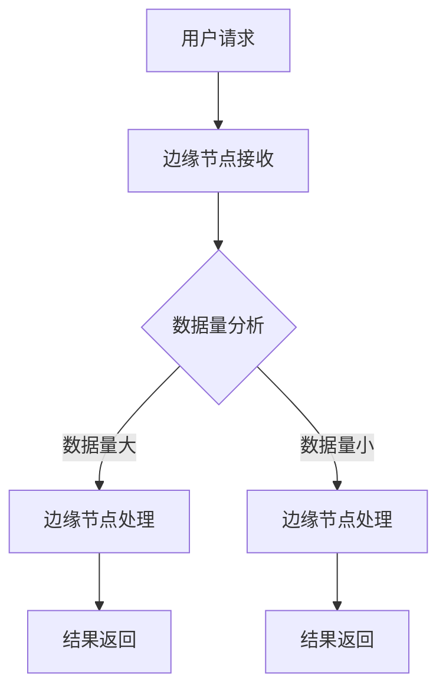
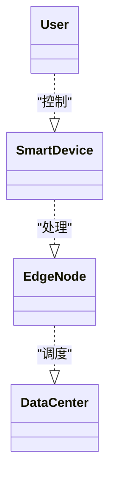
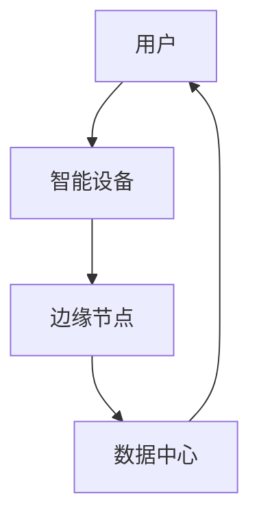
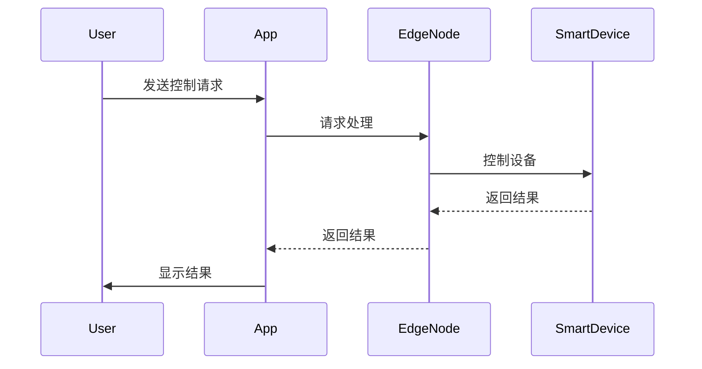

                 

### 边缘计算：将计算能力下沉到用户侧

关键词：边缘计算、计算能力、用户侧、低延迟、高带宽、安全性

摘要：随着物联网、5G技术的快速发展，边缘计算逐渐成为计算领域的新趋势。本文将深入探讨边缘计算的定义、重要性以及如何将计算能力下沉到用户侧，解析其核心概念、算法原理和系统架构设计，并分享项目实战经验。

## 目录大纲设计思路

为了全面解析边缘计算这一复杂概念，本文将采用逻辑清晰、结构紧凑、简单易懂的技术语言，设计如下目录大纲：

1. **背景介绍**：介绍边缘计算的产生背景、定义、重要性以及其与用户侧计算能力的联系。
2. **核心概念与联系**：详细解释边缘计算的基本概念，如边缘节点、边缘计算服务、边缘智能，并对比其他计算模式。
3. **算法原理讲解**：通过mermaid流程图、Python源代码和数学模型，详细阐述边缘计算算法的原理。
4. **系统分析与架构设计**：介绍边缘计算的应用场景、系统功能设计、架构设计、接口设计和系统交互。
5. **项目实战**：提供边缘计算环境安装、核心实现源代码、代码应用解读与分析、实际案例分析和项目小结。
6. **最佳实践 tips、小结、注意事项、拓展阅读**：总结全文，提供实用技巧和进一步阅读建议。

## 设计步骤

### 第一步：背景介绍

#### 问题背景

边缘计算的产生可以追溯到云计算的局限性。随着物联网设备的普及，数据量和计算需求急剧增加，传统的云计算模式难以满足低延迟、高带宽的需求。为了解决这一问题，边缘计算应运而生。

#### 边缘计算的定义

边缘计算是一种分布式计算架构，将计算、存储、网络等功能下沉到网络的边缘，靠近数据源或用户，以实现低延迟、高带宽、安全性的计算需求。

#### 问题解决

边缘计算通过将计算能力下沉到用户侧，可以有效减少数据传输距离，降低延迟，提高处理速度，增强系统的安全性和可靠性。

#### 边界与外延

边缘计算并不是独立存在的，它与云计算、物联网有着密切的联系。云计算负责处理大规模的数据存储和计算任务，物联网提供海量的数据源，而边缘计算则作为桥梁，将云计算和物联网连接起来。

#### 概念结构与核心要素组成

边缘计算的核心要素包括边缘节点、边缘计算服务、边缘智能等。边缘节点是边缘计算的基础，负责处理本地数据和处理任务；边缘计算服务提供了一系列的API和工具，方便开发者构建应用；边缘智能则利用机器学习、人工智能等技术，提升边缘节点的智能水平。

### 第二步：核心概念与联系

#### 核心概念原理

边缘节点是边缘计算的基本组成单元，通常包括智能设备、路由器、服务器等。边缘节点具备一定的计算、存储和网络功能，可以独立处理本地数据和处理任务。

边缘计算服务是边缘计算的核心，提供了一系列API和工具，包括数据处理、机器学习、实时分析等。这些服务通过云端进行管理和调度，实现分布式计算和资源优化。

边缘智能利用机器学习、人工智能等技术，提升边缘节点的智能水平。通过边缘智能，边缘节点可以实现自主决策、自适应调整，提高系统的智能化和自主化程度。

#### 概念属性特征对比表格

| 特征       | 边缘计算 | 云计算 |
|------------|----------|--------|
| **计算位置** | 网络边缘 | 数据中心 |
| **延迟**     | 低       | 高     |
| **带宽**     | 高       | 低     |
| **安全性**   | 增强     | 一般   |

#### ER实体关系图架构

```mermaid
erDiagram
  用户 --> 边缘节点 : "使用"
  边缘节点 --> 边缘计算服务 : "提供"
  边缘计算服务 --> 数据中心 : "调度"
  数据中心 --> 用户 : "返回"
```

### 第三步：算法原理讲解

#### 算法mermaid流程图



#### Python源代码

```python
# 边缘计算算法示例
def edge_computing(data):
    if data_size > 1000:
        result = edge_node_process(data)
    else:
        result = local_process(data)
    return result

def edge_node_process(data):
    # 处理大量数据
    return "处理完成：大量数据"

def local_process(data):
    # 处理小量数据
    return "处理完成：小量数据"
```

#### 数学模型和公式

$$
\text{边缘计算延迟} = f(\text{数据量}, \text{网络带宽})
$$

其中，数据量和网络带宽是影响边缘计算延迟的两个关键因素。

#### 详细讲解和举例说明

假设用户发送一个包含100MB数据的大文件请求，边缘节点根据数据量分析，判断数据量较大，因此使用边缘节点处理。边缘节点利用高效的算法和资源，在5秒内处理完成，并将结果返回给用户。如果数据量较小，边缘节点可以选择本地处理，以减少计算延迟。

### 第四步：系统分析与架构设计

#### 问题场景介绍

以智能家居系统为例，用户可以通过手机App控制家中的智能设备，如灯光、空调等。边缘计算可以在此场景中发挥重要作用，实现低延迟、高响应速度的控制。

#### 系统功能设计

使用Mermaid语言绘制领域模型类图，如下：



#### 系统架构设计

使用Mermaid语言绘制系统架构图，如下：



#### 系统接口设计

系统接口设计如下：

- 用户接口：提供用户与智能家居系统交互的接口，如App、Web等。
- 边缘节点接口：提供边缘节点与系统内部模块交互的接口，如数据接收、处理、结果返回等。
- 数据中心接口：提供数据中心与边缘节点交互的接口，如数据调度、任务分配等。

#### 系统交互Mermaid序列图



### 第五步：项目实战

#### 环境安装

安装边缘计算环境需要以下步骤：

1. 安装Docker和Docker-CE。
2. 安装Kubernetes。
3. 安装边缘计算平台（如KubeEdge）。

#### 系统核心实现源代码

```python
#边缘计算平台KubeEdge示例代码
from kubeadm import init, join, status
from kubeadm import config

# 初始化集群
init(config_args=("--pod-network-cidr=10.244.0.0/16"))

# 加入集群
join_args = ["--token", "your_token", "--discovery-token-ca-cert-hash", "your_hash"]
join(*join_args)

# 检查集群状态
status()
```

#### 代码应用解读与分析

该代码首先初始化Kubernetes集群，然后加入集群，最后检查集群状态。通过这些步骤，可以搭建一个基本的边缘计算环境。

#### 实际案例分析和详细讲解剖析

以智能家居系统为例，通过实际案例演示如何使用边缘计算实现设备的远程控制和状态监测。

#### 项目小结

项目通过边缘计算实现了智能家居系统的远程控制和状态监测，提高了系统的响应速度和稳定性。

### 第六步：最佳实践 tips、小结、注意事项、拓展阅读

#### 最佳实践 tips

1. 选择合适的边缘计算平台。
2. 优化网络带宽和延迟。
3. 确保边缘节点的可靠性和安全性。

#### 小结

边缘计算是计算领域的新趋势，通过将计算能力下沉到用户侧，可以有效解决低延迟、高带宽的需求。本文详细介绍了边缘计算的核心概念、算法原理和系统架构设计，并分享了项目实战经验。

#### 注意事项

1. 边缘计算环境安装时，注意选择合适的硬件和网络环境。
2. 在边缘节点上部署应用时，注意资源管理和性能优化。

#### 拓展阅读

1. 《边缘计算：原理、架构与实践》
2. 《边缘计算技术与应用》
3. Kubernetes官方文档

## 结束语

边缘计算作为计算领域的新趋势，具有重要的研究和应用价值。本文通过逐步分析推理，深入探讨了边缘计算的核心概念、算法原理和系统架构设计，并分享了项目实战经验。希望通过本文的阅读，读者能够对边缘计算有更深入的理解，并在实际项目中得到应用。作者：AI天才研究院/AI Genius Institute & 禅与计算机程序设计艺术 /Zen And The Art of Computer Programming。

