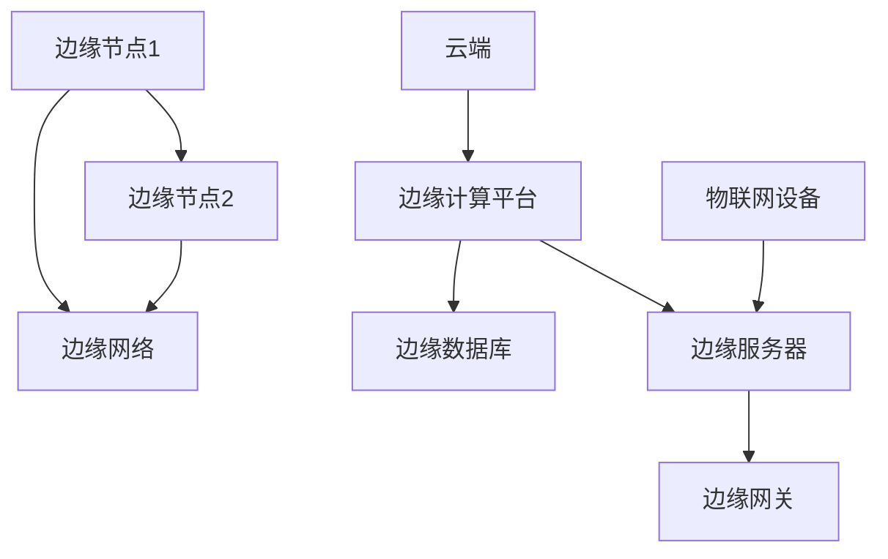
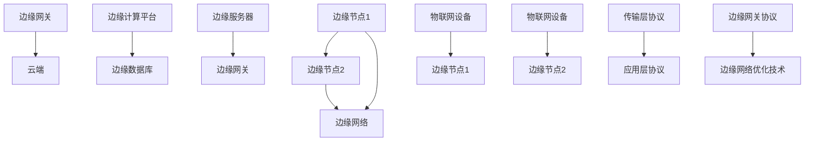
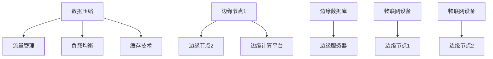

                 

# 边缘计算：物联网时代的分布式计算模型

> 关键词：边缘计算、物联网、分布式计算、智能交通、智慧城市、安全与隐私保护

> 摘要：边缘计算作为一种新兴的分布式计算模型，正逐步改变物联网时代的数据处理模式。本文将深入探讨边缘计算的兴起背景、技术架构、应用场景、安全挑战及未来展望，为读者提供一个全面的技术解读。

## 目录大纲设计

### 第一部分：边缘计算概述与背景

- **第1章：边缘计算的兴起与背景**
  - **1.1 边缘计算的概念与定义**
  - **1.2 物联网时代的挑战与边缘计算的作用**
  - **1.3 边缘计算的核心要素**
  - **1.4 边缘计算的发展趋势与未来前景**

### 第二部分：边缘计算的技术架构

- **第2章：边缘计算的网络架构**
  - **2.1 边缘计算网络的基本结构**
  - **2.2 边缘网络协议与通信**
  - **2.3 边缘计算中的网络优化技术**

### 第三部分：边缘计算的应用场景

- **第3章：工业自动化中的边缘计算**
  - **3.1 工业自动化的需求与挑战**
  - **3.2 边缘计算在工业自动化中的应用实例**

- **第4章：智能交通系统的边缘计算**
  - **4.1 智能交通系统的背景与需求**
  - **4.2 边缘计算在智能交通系统中的应用实例**

- **第5章：智慧城市的边缘计算应用**
  - **5.1 智慧城市的发展趋势**
  - **5.2 边缘计算在智慧城市中的应用实例**

### 第四部分：边缘计算的安全与隐私保护

- **第6章：边缘计算中的安全挑战与应对策略**
  - **6.1 边缘计算的安全风险**
  - **6.2 边缘计算的安全机制**
  - **6.3 边缘计算隐私保护**

### 第五部分：边缘计算的未来发展

- **第7章：边缘计算的未来展望与挑战**
  - **7.1 边缘计算技术的创新方向**
  - **7.2 边缘计算的商业化应用**
  - **7.3 边缘计算的教育与人才培养**

### 结论

- **边缘计算的发展现状与未来趋势**
- **边缘计算在物联网时代的重要性**
- **对未来边缘计算发展的展望**

## 第一部分：边缘计算概述与背景

### 第1章：边缘计算的兴起与背景

#### 1.1 边缘计算的概念与定义

边缘计算（Edge Computing）是指将数据处理的任务从云端转移到网络边缘，即靠近数据源的地方进行处理。这一概念的核心在于减少数据传输的延迟，提高数据处理的速度和效率。与传统云计算不同，边缘计算更加注重在本地进行数据分析和处理，从而满足实时性和低延迟的要求。

#### 1.2 物联网时代的挑战与边缘计算的作用

物联网（IoT）的快速发展带来了海量数据的产生和传输，这对传统的云计算模式提出了巨大的挑战。随着物联网设备的数量和种类不断增加，数据处理的需求也在迅速增长。传统的云计算中心难以满足实时性、可靠性和安全性的要求，边缘计算因此成为解决这一问题的有效手段。

边缘计算在物联网中的应用主要体现在以下几个方面：

1. **实时数据处理**：边缘计算可以在数据产生的地方进行实时处理，从而降低数据传输的延迟，满足物联网设备对实时响应的需求。
2. **带宽优化**：通过在边缘进行数据预处理，可以减少需要传输到云端的数据量，从而优化网络带宽的使用。
3. **数据安全**：边缘计算可以减少数据在传输过程中的暴露风险，增强数据的安全性。
4. **降低成本**：边缘计算可以减少对中心化数据中心的依赖，从而降低维护和运营成本。

#### 1.3 边缘计算的核心要素

边缘计算的核心要素包括：

1. **边缘设备**：这些设备包括各种物联网设备、智能终端和边缘服务器等，它们是数据采集和初步处理的关键。
2. **边缘网络**：边缘网络是指连接边缘设备和云端的通信网络，它需要具备高带宽、低延迟和高可靠性的特点。
3. **边缘计算平台**：边缘计算平台提供了运行应用程序和服务的环境，它需要支持多样化的计算需求和应用场景。
4. **边缘数据库**：边缘数据库用于存储和处理边缘设备产生的数据，它需要具备快速读写和数据安全性的特点。

#### 1.4 边缘计算的发展趋势与未来前景

随着技术的不断进步，边缘计算正逐步走向成熟。未来，边缘计算的发展趋势包括：

1. **边缘人工智能**：边缘计算与人工智能（AI）的结合将成为一个重要方向，通过在边缘设备上进行AI模型的部署和运行，可以实现更加智能化的数据处理和分析。
2. **智能网联**：边缘计算与5G、物联网等技术的结合，将推动智能网联技术的发展，为智能交通、智慧城市等领域提供强有力的支持。
3. **开放生态**：边缘计算的标准化和开放生态将逐步建立，推动更多开发者参与其中，共同推动边缘计算技术的发展。
4. **商业应用**：边缘计算在工业自动化、智能交通、智慧城市等领域的商业化应用将不断拓展，为行业带来新的增长点。

边缘计算在物联网时代的重要性不言而喻。它不仅能够解决物联网时代面临的挑战，还能够为各行业带来创新和发展的机遇。未来，边缘计算将继续发挥其重要作用，成为推动物联网时代发展的重要引擎。

## 第二部分：边缘计算的技术架构

### 第2章：边缘计算的网络架构

#### 2.1 边缘计算网络的基本结构

边缘计算网络的基本结构可以看作是一个分布式计算体系，它由多个边缘节点组成，这些节点分布在网络边缘，靠近数据源。边缘节点通过边缘网络连接，形成一个有机的整体，共同完成数据处理任务。边缘计算网络的基本结构包括以下几个关键部分：

1. **边缘节点**：边缘节点是边缘计算网络的核心组成部分，它可以是物联网设备、智能终端或边缘服务器等。边缘节点负责数据的采集、预处理和初步分析，然后将数据传输到云端或进行本地处理。

2. **边缘网络**：边缘网络是连接边缘节点的通信网络，它需要具备高带宽、低延迟和高可靠性的特点。边缘网络通常采用多种通信技术，如Wi-Fi、LoRa、NB-IoT等，以满足不同应用场景的需求。

3. **边缘计算平台**：边缘计算平台提供了运行应用程序和服务的环境，它需要支持多样化的计算需求和应用场景。边缘计算平台通常包括操作系统、中间件、数据库等软件组件，以及硬件设备如边缘服务器、边缘网关等。

4. **边缘数据库**：边缘数据库用于存储和处理边缘设备产生的数据，它需要具备快速读写和数据安全性的特点。边缘数据库可以是关系型数据库，如MySQL、PostgreSQL，也可以是非关系型数据库，如MongoDB、Redis等。

边缘计算网络的基本结构图如下所示：



#### 2.2 边缘网络协议与通信

边缘网络的协议和通信机制对于边缘计算的性能和效率至关重要。边缘网络通常采用以下几种协议和通信机制：

1. **传输层协议**：传输层协议负责边缘节点之间的数据传输，如TCP（传输控制协议）和UDP（用户数据报协议）。TCP提供了可靠的数据传输，但可能会引入较高的延迟和开销，而UDP则提供了更高效的数据传输，但可靠性较低。

2. **应用层协议**：应用层协议定义了边缘计算的应用程序如何进行通信和数据交换，如HTTP/2、MQTT（消息队列遥测传输协议）等。MQTT是一种轻量级的消息传递协议，非常适合物联网应用，它可以在低带宽和不稳定的网络环境中高效运行。

3. **边缘网关协议**：边缘网关是边缘计算网络中的关键组件，它负责将边缘节点的数据转发到云端或本地数据中心。边缘网关通常采用标准的网关协议，如OPC UA（开放平台通信统一架构）、BACnet（建筑自动化和控制系统网络协议）等，以支持多种设备和应用场景。

4. **边缘网络优化技术**：为了提高边缘网络的数据传输效率和稳定性，可以采用多种网络优化技术，如数据压缩、流量管理、负载均衡等。数据压缩可以减少传输的数据量，流量管理可以优化网络资源分配，负载均衡可以将数据处理任务分布到多个边缘节点上，提高整体性能。

边缘网络协议与通信的架构图如下所示：



#### 2.3 边缘计算中的网络优化技术

在边缘计算中，网络优化技术对于提高数据处理效率和用户体验至关重要。以下是一些常见的网络优化技术：

1. **数据压缩**：数据压缩是一种减少数据传输量的技术，通过将数据压缩为更小的文件，可以显著降低带宽使用和传输时间。常用的数据压缩算法包括Huffman编码、LZ77和LZ78等。

2. **流量管理**：流量管理是一种优化网络流量分配的技术，通过动态调整流量路径和资源分配，可以提高网络的整体性能和可靠性。流量管理技术包括流量整形、流量优先级和流量工程等。

3. **负载均衡**：负载均衡是一种将数据处理任务分布到多个边缘节点的技术，通过均匀分配任务，可以避免单个节点过载，提高系统的整体性能和可靠性。常用的负载均衡算法包括轮询、最少连接和响应时间等。

4. **缓存技术**：缓存技术是一种存储常用数据的技术，通过将数据缓存到边缘节点，可以减少数据访问的延迟，提高数据处理速度。常用的缓存技术包括内存缓存、磁盘缓存和分布式缓存等。

边缘计算中的网络优化技术框架图如下所示：



通过上述网络优化技术，边缘计算网络可以显著提高数据传输效率和系统性能，为物联网应用提供更加稳定和高效的支持。

## 第三部分：边缘计算的应用场景

### 第3章：工业自动化中的边缘计算

#### 3.1 工业自动化的需求与挑战

工业自动化是指通过自动化设备和控制系统实现生产过程的自动化，从而提高生产效率和产品质量。随着物联网和人工智能技术的快速发展，工业自动化正在进入一个全新的阶段。然而，工业自动化也面临着一些挑战：

1. **实时性要求**：工业自动化对实时性要求极高，生产过程需要迅速响应和调整，任何延迟都可能导致生产线的停顿和产品质量下降。

2. **数据传输带宽**：传统云计算模式依赖于将大量数据传输到云端进行集中处理，这在工业自动化场景中可能会导致带宽不足，增加数据传输延迟。

3. **数据安全**：工业自动化系统通常涉及敏感数据和关键设备，数据泄露和网络攻击可能导致严重后果，因此数据安全和系统安全至关重要。

4. **系统稳定性**：工业环境复杂多变，系统需要具备高可靠性和稳定性，以应对各种突发情况。

#### 3.2 边缘计算在工业自动化中的应用实例

边缘计算在工业自动化中的应用能够有效解决上述挑战，以下是一些具体的实例：

1. **智能生产线**：

   边缘计算可以将生产数据在本地进行实时分析和处理，快速调整生产参数，从而提高生产效率。例如，在汽车制造过程中，边缘计算可以实时监控设备状态，预测故障，提前进行维护，避免生产停顿。

   边缘计算架构图如下所示：

   ```mermaid
   graph TD
   A[物联网设备] --> B[边缘节点]
   B --> C[边缘计算平台]
   C --> D[边缘数据库]
   D --> E[边缘服务器]
   E --> F[云端]
   G[传感器数据] --> H[边缘节点]
   ```

2. **实时数据处理**：

   在工业自动化过程中，实时数据处理至关重要。边缘计算可以在生产现场对采集到的数据进行即时处理，生成实时报告和决策支持，提高生产过程的智能化水平。

   实时数据处理流程如下：

   - 数据采集：物联网设备采集生产数据，如温度、压力、振动等。
   - 数据预处理：边缘节点对采集到的数据进行初步处理，去除噪声和异常值。
   - 实时分析：边缘计算平台对预处理后的数据进行实时分析，如趋势预测、故障诊断等。
   - 决策支持：根据分析结果，系统生成实时报告和决策建议，指导生产操作。

   实时数据处理架构图如下所示：

   ```mermaid
   graph TD
   A[物联网设备] --> B[边缘节点]
   B --> C[边缘计算平台]
   C --> D[边缘数据库]
   D --> E[边缘服务器]
   E --> F[云端]
   G[传感器数据] --> H[边缘节点]
   I[实时报告] --> J[生产操作]
   ```

3. **设备预测性维护**：

   边缘计算可以通过对设备运行数据的实时分析，预测设备可能的故障点，提前进行维护，从而减少设备故障率和停机时间。例如，在机械加工过程中，边缘计算可以实时监测刀具磨损情况，预测刀具更换时间，避免生产中断。

   设备预测性维护流程如下：

   - 数据采集：物联网设备采集设备运行数据，如温度、振动、电流等。
   - 数据分析：边缘计算平台对采集到的数据进行分析，建立设备状态模型。
   - 预测性维护：根据设备状态模型，预测设备可能的故障点，提前进行维护。

   设备预测性维护架构图如下所示：

   ```mermaid
   graph TD
   A[物联网设备] --> B[边缘节点]
   B --> C[边缘计算平台]
   C --> D[边缘数据库]
   D --> E[边缘服务器]
   E --> F[云端]
   G[传感器数据] --> H[边缘节点]
   I[设备状态模型] --> J[维护计划]
   ```

通过上述应用实例，边缘计算在工业自动化中发挥着重要作用，它不仅提高了生产效率，降低了维护成本，还增强了系统的稳定性和安全性。

### 第4章：智能交通系统的边缘计算

#### 4.1 智能交通系统的背景与需求

智能交通系统（ITS）是指利用先进的信息通信技术、电子技术、控制技术等，对交通运输系统进行管理和优化，以提高交通效率、减少交通事故和降低环境污染。随着城市化进程的加快和汽车保有量的不断增加，智能交通系统的需求日益迫切。

智能交通系统的主要需求包括：

1. **交通流量管理**：通过实时监控和调节交通流量，提高道路通行效率，减少交通拥堵。
2. **交通事故预防**：利用传感器和监控系统，提前预警潜在的事故风险，预防交通事故的发生。
3. **车辆调度与管理**：对公共交通工具进行实时调度和管理，提高公共交通服务的质量和效率。
4. **环境保护**：通过优化交通流量和减少车辆排放，降低环境污染。

#### 4.2 边缘计算在智能交通系统中的应用实例

边缘计算在智能交通系统中发挥着关键作用，以下是一些具体的应用实例：

1. **智能交通信号控制**：

   边缘计算可以在交通信号控制节点上实现实时数据处理和智能决策，从而优化交通信号配置，提高道路通行效率。例如，在交叉路口，边缘计算系统可以实时采集交通流量数据，分析交通状况，动态调整信号灯周期，实现交通流量的最佳分配。

   智能交通信号控制的架构图如下所示：

   ```mermaid
   graph TD
   A[传感器] --> B[边缘节点]
   B --> C[边缘计算平台]
   C --> D[边缘数据库]
   D --> E[信号控制器]
   E --> F[信号灯]
   ```

2. **车辆实时监控与调度**：

   边缘计算可以实时监控车辆状态和位置信息，实现对车辆的实时调度和管理。例如，在公共交通系统中，边缘计算系统可以实时分析公交车和乘客的数据，根据实时需求调整公交车的行驶路线和班次，提高公共交通服务的质量和效率。

   车辆实时监控与调度的架构图如下所示：

   ```mermaid
   graph TD
   A[车辆传感器] --> B[边缘节点]
   B --> C[边缘计算平台]
   C --> D[边缘数据库]
   D --> E[调度中心]
   E --> F[公交车调度]
   ```

3. **交通事故预警与处理**：

   边缘计算可以通过对车辆和道路传感器的数据进行分析，提前预警潜在的交通事故风险。例如，在道路弯道处，边缘计算系统可以实时分析车辆速度、距离和方向等信息，提前发出预警信号，提醒驾驶员减速或采取避让措施，从而预防交通事故的发生。

   交通事故预警与处理的架构图如下所示：

   ```mermaid
   graph TD
   A[传感器] --> B[边缘节点]
   B --> C[边缘计算平台]
   C --> D[边缘数据库]
   D --> E[预警系统]
   E --> F[驾驶员提醒]
   ```

4. **智能停车场管理系统**：

   边缘计算可以实现对停车场的实时监控和管理，提高停车场的使用效率。例如，在停车场入口，边缘计算系统可以实时检测车辆进入和离开的信息，动态更新停车位状态，为车主提供实时导航服务，减少寻找停车位的时间。

   智能停车场管理系统的架构图如下所示：

   ```mermaid
   graph TD
   A[车辆传感器] --> B[边缘节点]
   B --> C[边缘计算平台]
   C --> D[边缘数据库]
   D --> E[停车场管理系统]
   E --> F[车位导航]
   ```

通过上述应用实例，边缘计算在智能交通系统中发挥着重要作用，它不仅提高了交通效率，减少了交通事故，还提升了公共交通服务的质量和效率。

### 第5章：智慧城市的边缘计算应用

#### 5.1 智慧城市的发展趋势

智慧城市是指利用信息技术、物联网、云计算等先进技术，对城市资源、环境、公共服务等进行智能化管理和优化，以提高城市运行效率、改善居民生活质量。随着城市化进程的加快和技术的进步，智慧城市的发展趋势日益明显：

1. **数字化管理**：智慧城市通过数字化手段，对城市各类资源进行实时监控和管理，提高城市管理的精细化和智能化水平。
2. **智能化服务**：智慧城市通过人工智能和大数据分析，提供个性化、智能化的公共服务，如智能交通、智慧医疗、智慧教育等。
3. **可持续性发展**：智慧城市注重环境保护和资源利用，通过智能化手段减少污染、降低能耗，实现城市的可持续发展。
4. **智慧基础设施**：智慧城市构建完善的智能基础设施，如智能电网、智能水务、智能交通等，提高城市的整体运营效率。

#### 5.2 边缘计算在智慧城市中的应用实例

边缘计算在智慧城市中发挥着关键作用，以下是一些具体的应用实例：

1. **城市安全监控**：

   边缘计算可以实现对城市各个角落的实时监控，快速发现和处理安全隐患。例如，在城市的街道、公园和交通枢纽等关键位置安装视频监控设备，边缘计算平台可以实时分析视频数据，识别异常行为和潜在危险，及时报警和处理。

   城市安全监控的架构图如下所示：

   ```mermaid
   graph TD
   A[视频监控设备] --> B[边缘节点]
   B --> C[边缘计算平台]
   C --> D[边缘数据库]
   D --> E[监控中心]
   E --> F[报警系统]
   ```

2. **城市资源管理**：

   边缘计算可以实时监控和管理城市的各类资源，如水资源、能源和公共设施等。例如，在城市供水系统中，边缘计算平台可以实时监测水源水质和用水量，优化水资源分配，提高供水效率。

   城市资源管理的架构图如下所示：

   ```mermaid
   graph TD
   A[传感器] --> B[边缘节点]
   B --> C[边缘计算平台]
   C --> D[边缘数据库]
   D --> E[资源管理系统]
   E --> F[资源分配]
   ```

3. **智慧交通系统**：

   边缘计算可以实现对城市交通的实时监控和管理，提高交通效率和安全性。例如，在城市的各个路口和道路安装智能交通监控设备，边缘计算平台可以实时分析交通流量数据，优化交通信号配置，减少交通拥堵。

   智慧交通系统的架构图如下所示：

   ```mermaid
   graph TD
   A[交通监控设备] --> B[边缘节点]
   B --> C[边缘计算平台]
   C --> D[边缘数据库]
   D --> E[交通管理系统]
   E --> F[信号灯控制]
   ```

4. **智慧能源管理**：

   边缘计算可以实现对城市能源的实时监控和管理，提高能源利用效率。例如，在城市的各个能源供应点安装智能传感器，边缘计算平台可以实时监测能源使用情况，优化能源分配，降低能源消耗。

   智慧能源管理的架构图如下所示：

   ```mermaid
   graph TD
   A[能源传感器] --> B[边缘节点]
   B --> C[边缘计算平台]
   C --> D[边缘数据库]
   D --> E[能源管理系统]
   E --> F[能源分配]
   ```

5. **智慧环保监测**：

   边缘计算可以实时监测城市的空气质量、水质等环境指标，提供环保预警和治理建议。例如，在城市的各个监测点安装环境传感器，边缘计算平台可以实时分析环境数据，识别污染源，提出治理措施。

   智慧环保监测的架构图如下所示：

   ```mermaid
   graph TD
   A[环境传感器] --> B[边缘节点]
   B --> C[边缘计算平台]
   C --> D[边缘数据库]
   D --> E[环保监测系统]
   E --> F[污染预警]
   ```

通过上述应用实例，边缘计算在智慧城市中发挥着重要作用，它不仅提高了城市管理的效率，改善了居民生活质量，还推动了城市的可持续发展。

### 第四部分：边缘计算的安全与隐私保护

#### 第6章：边缘计算中的安全挑战与应对策略

随着边缘计算的广泛应用，其安全问题也日益凸显。边缘计算涉及到海量数据的采集、传输和处理，数据的安全性和隐私保护成为关注的焦点。本章节将探讨边缘计算中面临的几个主要安全挑战，并提出相应的应对策略。

#### 6.1 边缘计算的安全风险

1. **数据泄露风险**：

   边缘计算涉及到大量敏感数据的传输和存储，这些数据包括用户个人信息、工业生产数据、交通监控数据等。数据泄露可能导致用户隐私泄露、商业机密丢失和国家安全风险。

2. **网络安全风险**：

   边缘计算网络通常连接大量的物联网设备，这些设备可能存在安全漏洞，成为网络攻击的入口。攻击者可以通过入侵边缘设备，进一步渗透到内部网络，对系统进行恶意攻击。

3. **设备篡改风险**：

   边缘设备可能在供应链环节被篡改，植入恶意软件或后门，从而对系统造成潜在威胁。设备篡改可能导致数据被篡改、系统功能异常或无法正常工作。

4. **通信中断风险**：

   边缘计算网络可能受到恶意攻击，导致通信中断，影响系统的正常运行。通信中断可能对关键应用，如智能交通信号控制、工业自动化等造成严重影响。

#### 6.2 边缘计算的安全机制

为了应对边缘计算中的安全挑战，可以采用以下几种安全机制：

1. **数据加密技术**：

   数据加密技术是保护数据安全的基本手段。在边缘计算中，对数据进行加密可以防止数据在传输和存储过程中被窃取或篡改。常用的加密算法包括对称加密（如AES）和非对称加密（如RSA）。

2. **安全通信协议**：

   安全通信协议可以确保边缘设备之间的通信安全，防止中间人攻击和数据篡改。常用的安全通信协议包括TLS（传输层安全协议）、IPSec（互联网协议安全）等。

3. **设备认证与访问控制**：

   设备认证与访问控制可以确保只有授权设备才能访问系统资源。通过使用数字证书和身份认证机制，可以验证设备的合法性和身份，防止未授权设备接入网络。

4. **安全更新与补丁管理**：

   定期对边缘设备进行安全更新和补丁管理，可以修复已知的安全漏洞，防止设备被攻击者利用。安全更新和补丁管理需要建立完善的流程和机制，确保及时部署。

5. **安全监测与响应**：

   通过部署安全监测系统，可以实时监测边缘计算网络的异常行为和潜在威胁。一旦发现安全事件，可以及时采取响应措施，隔离和处理受影响的设备。

#### 6.3 边缘计算隐私保护

边缘计算中的隐私保护尤为重要，因为它涉及到大量的个人数据。以下是一些隐私保护技术：

1. **匿名化处理**：

   对采集到的个人数据进行匿名化处理，去除可以直接识别个人身份的信息，如姓名、身份证号等。匿名化处理可以减少隐私泄露的风险。

2. **数据加密与完整性保护**：

   在数据传输和存储过程中，对数据加密和完整性保护，确保数据在传输过程中不被篡改或泄露。

3. **隐私计算**：

   隐私计算是一种在数据不离开原始环境的情况下进行数据处理和分析的技术。通过在边缘设备上进行隐私计算，可以避免数据在传输过程中被泄露。

4. **隐私计算框架**：

   隐私计算框架如联邦学习、安全多方计算等，可以在保证数据隐私的前提下，进行数据共享和联合分析，提高数据利用效率。

通过上述安全机制和隐私保护技术，可以有效应对边缘计算中的安全挑战和隐私风险，确保边缘计算系统的安全可靠运行。

### 第五部分：边缘计算的未来发展

#### 第7章：边缘计算的未来展望与挑战

边缘计算作为物联网时代的关键技术，正在不断推动着各行各业的发展。未来，边缘计算将继续发挥重要作用，但其发展也将面临诸多挑战。

#### 7.1 边缘计算技术的创新方向

1. **边缘人工智能**：

   边缘人工智能（Edge AI）是边缘计算与人工智能（AI）的深度融合。通过在边缘设备上部署AI模型，可以实现更加实时、高效的智能数据处理和分析，提升系统的智能化水平。未来的边缘人工智能将朝着更低功耗、更高性能和更广泛的应用场景发展。

2. **智能网联**：

   边缘计算与5G、物联网等技术的结合，将推动智能网联技术的发展。智能网联可以实现设备之间的智能连接和协同工作，为智慧城市、智能交通等领域提供更加全面和高效的解决方案。

3. **边缘数据库优化**：

   随着边缘计算应用的扩展，边缘数据库的规模和复杂度将不断增加。未来的边缘数据库将朝着更高效、更安全和更易用的方向发展，支持大规模数据的实时存储、处理和分析。

4. **边缘安全与隐私保护**：

   随着边缘计算应用的普及，数据安全和隐私保护将越来越受到重视。未来的边缘计算将在安全机制和隐私保护技术方面不断创新，确保数据的完整性和安全性。

#### 7.2 边缘计算的商业化应用

边缘计算的商业化应用将不断拓展，以下是一些主要的商业化方向：

1. **智能工厂**：

   边缘计算可以在智能工厂中实现生产过程的实时监控、预测性维护和优化生产流程，提高生产效率和质量。

2. **智慧交通**：

   边缘计算可以用于智慧交通系统中，实现交通流量管理、车辆调度和事故预警等，提高交通效率和安全性。

3. **智慧城市**：

   边缘计算可以用于智慧城市中的城市安全监控、资源管理和环保监测等，提高城市运行效率和居民生活质量。

4. **远程医疗**：

   边缘计算可以在远程医疗中实现实时医疗数据传输、分析和诊断，为偏远地区提供高质量的医疗服务。

5. **智能家居**：

   边缘计算可以用于智能家居中，实现设备之间的智能连接和协同工作，为用户提供便捷、智能的家居体验。

#### 7.3 边缘计算的教育与人才培养

边缘计算的发展离不开人才的支撑。以下是一些关于边缘计算教育和人才培养的建议：

1. **课程设置**：

   高等教育机构应设置边缘计算相关的专业课程，培养学生对边缘计算的理论和实践知识。

2. **实习机会**：

   企业应提供实习机会，让学生在实际项目中锻炼和提升技能。

3. **培训项目**：

   政府和企业可以合作开展边缘计算培训项目，为在职人员提供继续教育和技能提升机会。

4. **学术研究**：

   鼓励学术研究机构开展边缘计算的基础研究和应用研究，推动技术的创新和发展。

边缘计算的未来充满机遇和挑战。随着技术的不断进步和应用的深入，边缘计算将继续发挥重要作用，推动物联网时代的发展。

## 结论

边缘计算作为物联网时代的分布式计算模型，正逐步改变着数据处理和通信的模式。本文从边缘计算的概述与背景、技术架构、应用场景、安全与隐私保护以及未来发展等多个方面进行了详细分析，揭示了边缘计算在物联网时代的重要性。

边缘计算不仅能够解决传统云计算在实时性、带宽和安全等方面的挑战，还能够为工业自动化、智能交通、智慧城市等领域带来创新和发展的机遇。随着边缘人工智能、智能网联等技术的不断发展，边缘计算的应用将更加广泛，其商业价值和社会影响力也将不断上升。

在未来，边缘计算将继续朝着智能化、安全化、高效化的方向发展，为物联网时代的发展提供强大的技术支持。面对边缘计算带来的机遇和挑战，我们应积极推动技术创新，完善安全机制，培养专业人才，共同推进边缘计算技术的进步和应用。让我们携手迎接边缘计算的美好未来。

