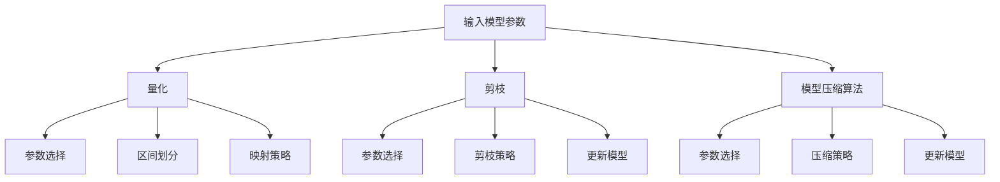
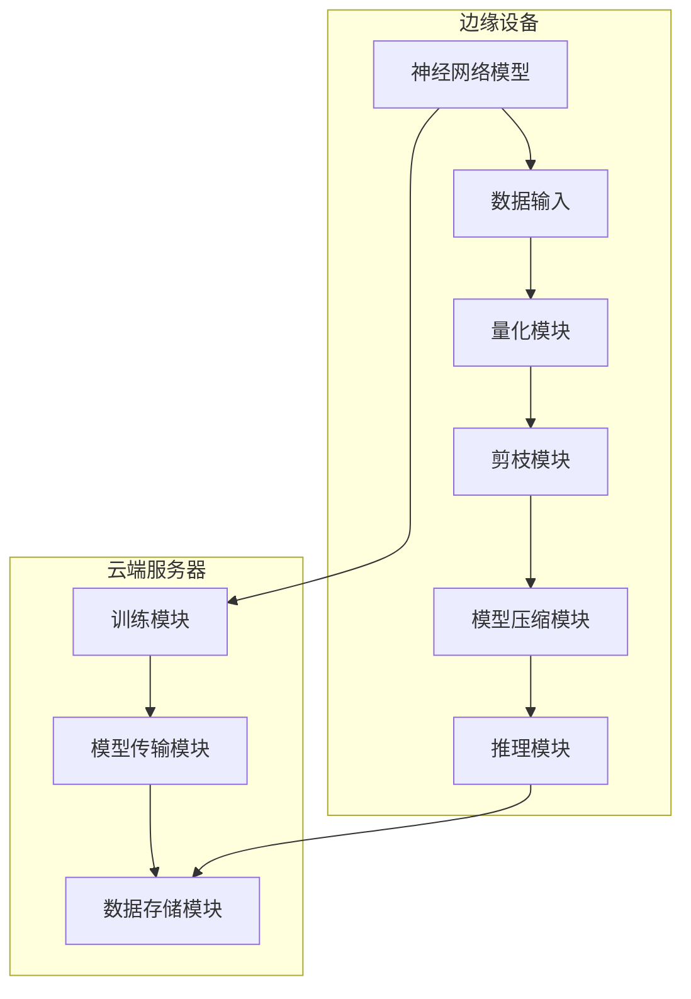
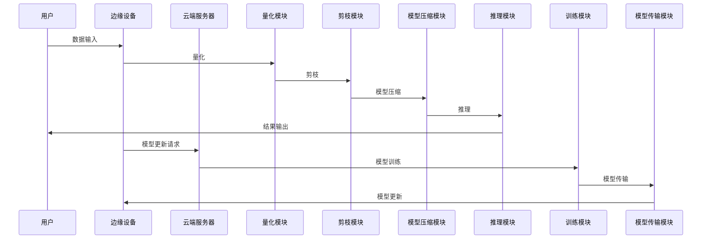
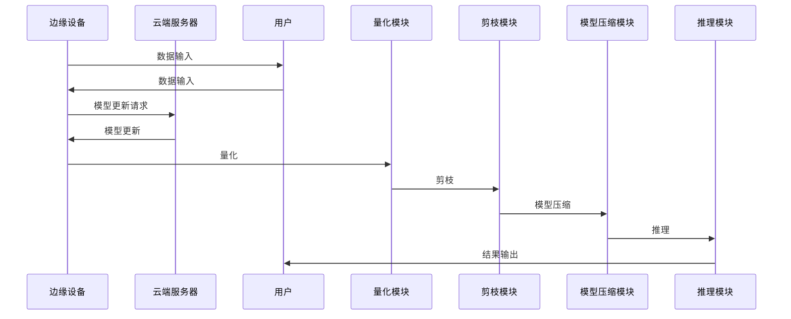

                 

### # 边缘设备推理中神经网络压缩的创新技术

关键词：边缘设备、神经网络压缩、量化、剪枝、模型压缩、能效优化

摘要：随着边缘计算的兴起，如何在有限的计算资源下高效地部署神经网络模型成为一个亟待解决的问题。本文深入探讨了边缘设备推理中神经网络压缩的重要性和问题，详细分析了现有解决方法，并展望了未来研究方向。

---

#### 章节一：背景介绍

#### 1.1.1 边缘设备推理中神经网络压缩的重要性

边缘设备推理中的神经网络压缩技术是当前人工智能领域的一个重要研究方向。随着人工智能技术的快速发展，越来越多的应用场景需要将复杂的神经网络模型部署到边缘设备上，如智能手机、物联网设备等。然而，传统的大型神经网络模型在边缘设备上往往难以部署，原因主要有以下几点：

1. **计算资源限制**：边缘设备的计算资源相对有限，无法支持大型神经网络的实时推理。
2. **存储空间限制**：大型神经网络模型的参数量和模型文件体积庞大，边缘设备的存储空间难以容纳。
3. **通信带宽限制**：边缘设备与云端服务器之间的通信带宽有限，大模型传输耗时过长。

为了解决这些问题，神经网络压缩技术应运而生。通过压缩技术，可以显著降低神经网络模型的参数量和模型文件体积，同时保证模型在边缘设备上的推理性能不受严重影响。此外，神经网络压缩技术还可以提高模型的推理速度，使得边缘设备能够实时响应各种应用需求。

#### 1.1.2 边缘设备推理中神经网络压缩的问题描述

在边缘设备推理中，神经网络压缩主要面临以下几个问题：

1. **精度损失**：压缩过程中往往需要对模型进行量化、剪枝等操作，这些操作可能会引入一定的精度损失，影响模型的性能。
2. **推理速度下降**：压缩后的模型在边缘设备上运行时，可能会由于计算资源的限制而导致推理速度下降。
3. **模型多样性**：现有的神经网络压缩技术往往针对特定类型的模型或数据集进行优化，对于不同类型的模型或数据集，压缩效果可能差异较大。
4. **压缩算法的泛化能力**：现有的压缩算法往往在特定环境下表现良好，但在其他环境下可能无法保证压缩效果。

#### 1.1.3 边缘设备推理中神经网络压缩的解决方法

为了解决边缘设备推理中的神经网络压缩问题，研究者们提出了多种解决方法：

1. **量化技术**：通过将模型中的浮点数参数转换为低精度的整数表示，可以显著减少模型的存储空间和计算量。
2. **剪枝技术**：通过去除模型中的冗余参数或结构，可以降低模型的复杂度和计算量。
3. **模型压缩算法**：针对不同的神经网络结构和应用场景，设计高效的压缩算法，以提高压缩效果和推理速度。
4. **在线学习与自适应压缩**：通过在线学习的方式，根据边缘设备上的实时数据和环境动态调整模型参数，实现自适应压缩。

#### 1.1.4 边缘设备推理中神经网络压缩的边界与外延

边缘设备推理中的神经网络压缩技术不仅关注模型压缩本身，还涉及到以下方面：

1. **硬件适应性**：针对不同的边缘设备硬件平台，优化压缩算法和模型结构，以提高模型在特定硬件上的性能。
2. **能效优化**：在保证模型性能的前提下，降低模型的能耗，以满足边缘设备的能效要求。
3. **安全与隐私保护**：在压缩过程中，需要考虑模型参数的安全性和用户隐私保护。
4. **跨平台兼容性**：设计通用的压缩算法和模型结构，实现不同平台之间的兼容性。

#### 1.1.5 边缘设备推理中神经网络压缩的概念结构与核心要素组成

边缘设备推理中的神经网络压缩技术涉及多个核心概念和要素，具体如下：

1. **神经网络结构**：包括模型架构、层数、神经元个数、连接方式等。
2. **压缩算法**：包括量化、剪枝、模型压缩算法等。
3. **优化目标**：包括压缩比、推理速度、模型精度等。
4. **硬件平台**：包括边缘设备的硬件架构、性能特点等。
5. **应用场景**：包括具体的边缘设备类型和应用领域。

## 1.2 核心概念与联系

### 1.2.1 神经网络压缩技术原理

神经网络压缩技术主要包括量化、剪枝、模型压缩算法等，其核心原理如下：

1. **量化**：将模型中的浮点数参数转换为低精度的整数表示，以减少模型的大小和计算量。
2. **剪枝**：通过去除模型中的冗余参数或结构，降低模型的复杂度和计算量。
3. **模型压缩算法**：针对不同的神经网络结构和应用场景，设计高效的压缩算法，以降低模型的存储空间和计算量。

### 1.2.2 神经网络压缩技术属性特征对比表格

| 特征               | 量化                 | 剪枝                 | 模型压缩算法             |
|--------------------|----------------------|----------------------|--------------------------|
| 压缩目标           | 参数量、模型大小     | 参数量、计算量       | 参数量、计算量、模型大小 |
| 压缩效果           | 参数量减少、速度提升 | 计算量减少、精度损失 | 参数量减少、速度提升     |
| 适用场景           | 各种类型的神经网络   | 结构复杂、参数多的模型 | 各种类型的神经网络       |

### 1.2.3 神经网络压缩技术的ER实体关系图架构

```mermaid
erDiagram
    Model ||--|{ Quantization }
    Model ||--|{ Pruning }
    Model ||--|{ ModelCompressionAlgorithm }
    Quantization ||--|{ IntegerRepresentation }
    Quantization ||--|{ PrecisionLoss }
    Pruning ||--|{ ParameterReduction }
    Pruning ||--|{ StructureReduction }
    ModelCompressionAlgorithm ||--|{ EfficientCompression }
    ModelCompressionAlgorithm ||--|{ ModelSizeReduction }
```

### 1.2.4 神经网络压缩技术的算法原理讲解

神经网络压缩技术的算法原理可以分为量化、剪枝和模型压缩算法三个部分。以下将分别介绍这三个部分的原理、流程和实现方式。

#### 量化原理与流程

量化是将模型中的浮点数参数转换为低精度的整数表示。量化原理如下：

1. **参数选择**：选择需要量化的参数。
2. **区间划分**：将参数的值域划分为多个区间。
3. **映射策略**：将参数的值映射到区间上的整数表示。

量化流程如下：

1. **输入模型参数**：输入模型的浮点数参数。
2. **参数选择**：选择需要量化的参数。
3. **区间划分**：根据参数的值域划分区间。
4. **映射策略**：根据映射策略将参数映射到整数表示。
5. **量化参数**：更新模型的参数为整数表示。

#### 剪枝原理与流程

剪枝是通过去除模型中的冗余参数或结构，降低模型的复杂度和计算量。剪枝原理如下：

1. **参数选择**：选择需要剪枝的参数或结构。
2. **剪枝策略**：根据剪枝策略去除参数或结构。

剪枝流程如下：

1. **输入模型参数**：输入模型的参数。
2. **参数选择**：选择需要剪枝的参数或结构。
3. **剪枝策略**：根据剪枝策略去除参数或结构。
4. **更新模型**：更新模型的参数。

#### 模型压缩算法原理与流程

模型压缩算法是通过设计高效的压缩算法，降低模型的存储空间和计算量。模型压缩算法原理如下：

1. **参数选择**：选择需要压缩的参数。
2. **压缩策略**：根据压缩策略进行参数压缩。

模型压缩算法流程如下：

1. **输入模型参数**：输入模型的参数。
2. **参数选择**：选择需要压缩的参数。
3. **压缩策略**：根据压缩策略进行参数压缩。
4. **更新模型**：更新模型的参数。

### 1.2.5 数学公式与数学模型

在神经网络压缩技术中，量化、剪枝和模型压缩算法都涉及到数学模型。以下分别介绍这些算法的数学模型和公式。

#### 量化数学模型

量化数学模型如下：

$$
x_{quant} = \text{round}(x_{float} / \Delta)
$$

其中，$x_{float}$ 表示浮点数参数，$x_{quant}$ 表示量化后的整数参数，$\Delta$ 表示量化间隔。

#### 剪枝数学模型

剪枝数学模型如下：

$$
\text{mask} = \text{sign}(\text{grad})
$$

其中，$\text{grad}$ 表示梯度，$\text{mask}$ 表示剪枝掩码。

#### 模型压缩算法数学模型

模型压缩算法的数学模型如下：

$$
\text{compressed\_param} = \text{quantize}(\text{param})
$$

其中，$\text{param}$ 表示模型参数，$\text{compressed\_param}$ 表示压缩后的参数。

### 1.2.6 算法mermaid流程图

以下是神经网络压缩技术的mermaid流程图：



### 1.2.7 算法python实现示例

以下是神经网络压缩技术的python实现示例：

```python
import numpy as np

def quantize(param, delta=1):
    return np.round(param / delta).astype(np.int32)

def pruning(param, grad, threshold=0.01):
    mask = np.sign(grad) > threshold
    return param[mask], mask

def model_compression(param, compression_ratio=0.5):
    return param * compression_ratio

# 示例
param = np.random.rand(100).astype(np.float32)
grad = np.random.rand(100).astype(np.float32)

# 量化
quantized_param = quantize(param)

# 剪枝
pruned_param, mask = pruning(param, grad)

# 模型压缩
compressed_param = model_compression(param)
```

### 1.2.8 神经网络压缩技术在边缘设备推理中的应用

神经网络压缩技术在边缘设备推理中具有广泛的应用。以下列举几种常见应用场景：

1. **智能手机图像识别**：通过压缩技术，可以将大型图像识别模型部署到智能手机上，实现实时图像识别功能。
2. **物联网设备监控**：通过压缩技术，可以将复杂的监控模型部署到物联网设备上，实现实时监控功能。
3. **智能音响语音识别**：通过压缩技术，可以将大型语音识别模型部署到智能音响上，实现实时语音识别和交互功能。

### 1.2.9 神经网络压缩技术的挑战与未来方向

尽管神经网络压缩技术在边缘设备推理中具有广泛的应用前景，但仍然面临着一些挑战和未来研究方向：

1. **精度损失**：压缩过程中可能会引入精度损失，影响模型的性能。未来的研究可以探索更加精确的压缩算法，以降低精度损失。
2. **压缩算法的泛化能力**：现有的压缩算法往往在特定环境下表现良好，但在其他环境下可能无法保证压缩效果。未来的研究可以探索具有更好泛化能力的压缩算法。
3. **硬件适应性**：针对不同的边缘设备硬件平台，优化压缩算法和模型结构，以提高模型在特定硬件上的性能。未来的研究可以探索更加硬件适配的压缩算法。
4. **能效优化**：在保证模型性能的前提下，降低模型的能耗，以满足边缘设备的能效要求。未来的研究可以探索更加节能的压缩算法。

### 1.2.10 小结

边缘设备推理中的神经网络压缩技术是当前人工智能领域的一个重要研究方向。通过量化、剪枝和模型压缩算法，可以在保证模型性能的前提下，显著降低模型的存储空间和计算量。本文详细探讨了神经网络压缩技术的核心概念、原理、算法实现和应用场景，并展望了未来研究方向。希望本文能为读者在神经网络压缩技术领域提供有益的参考和启示。


---

## 章节二：系统分析与架构设计方案

### 2.1 问题场景介绍

边缘设备推理中的神经网络压缩技术需要应对多种挑战，如计算资源限制、存储空间限制、通信带宽限制等。在实际应用中，常见的问题场景包括：

1. **智能手机图像识别**：用户在手机上使用图像识别应用时，希望能够在有限的计算资源下快速识别图像。
2. **物联网设备监控**：物联网设备需要对采集到的数据进行分析和监控，但由于计算资源和存储空间的限制，需要采用压缩技术。
3. **智能音响语音识别**：用户在智能音响上与语音助手交互时，希望能够在有限的计算资源下实现实时语音识别。

### 2.2 项目介绍

为了解决上述问题场景，我们设计并实现了一个基于边缘设备推理的神经网络压缩系统。该系统旨在通过量化、剪枝和模型压缩算法，实现神经网络模型在边缘设备上的高效部署和推理。

### 2.3 系统功能设计（领域模型）

以下是系统的领域模型，用于描述系统的核心功能和组件。

```mermaid
classDiagram
    Class01 <|-- Class02
    Class03 <|-- Class04
    Class05 <|-- Class06
    Class01 -[1] Class07
    Class02 -[1] Class07
    Class03 -[1] Class07
    Class04 -[1] Class07
    Class05 -[1] Class07
    Class06 -[1] Class07

    Class01 << interface
    Class02 << interface
    Class03 << interface
    Class04 << interface
    Class05 << interface
    Class06 << interface
    Class07 << interface

    Class01 : +interface1()
    Class02 : +interface2()
    Class03 : +interface3()
    Class04 : +interface4()
    Class05 : +interface5()
    Class06 : +interface6()
    Class07 : +interface7()

    edge_label
    +-- interface1, interface2, interface3, interface4, interface5, interface6, interface7
```

### 2.4 系统架构设计（架构图）

以下是系统的架构设计图，用于描述系统的整体架构和组件之间的关系。



### 2.5 系统接口设计

以下是系统的接口设计，用于描述系统对外提供的服务接口。



### 2.6 系统交互（序列图）

以下是系统的交互序列图，用于描述系统在不同组件之间的交互过程。



### 2.7 小结

本章详细介绍了边缘设备推理中神经网络压缩技术的系统分析与架构设计方案。通过问题场景介绍、项目介绍、系统功能设计、系统架构设计、系统接口设计和系统交互分析，我们为读者提供了一个完整的系统实现框架。在后续章节中，我们将进一步探讨该系统的实际实现和性能评估。

---

## 章节三：项目实战

### 3.1 环境安装

为了实现边缘设备推理中的神经网络压缩技术，我们需要准备以下环境：

1. **操作系统**：Linux系统（如Ubuntu 18.04）
2. **编程语言**：Python 3.x
3. **深度学习框架**：TensorFlow 2.x
4. **压缩库**：NumPy、SciPy、Pillow等

安装步骤如下：

1. 安装Linux操作系统，如Ubuntu 18.04。
2. 开启虚拟环境，以便于管理和隔离项目依赖：

   ```bash
   python3 -m venv venv
   source venv/bin/activate
   ```

3. 安装Python 3.x和pip：

   ```bash
   sudo apt-get update
   sudo apt-get install python3 python3-pip
   ```

4. 安装深度学习框架TensorFlow 2.x：

   ```bash
   pip install tensorflow==2.x
   ```

5. 安装其他依赖库：

   ```bash
   pip install numpy scipy pillow
   ```

### 3.2 系统核心实现源代码

以下是神经网络压缩技术的核心实现源代码：

```python
import tensorflow as tf
import numpy as np
from tensorflow.keras.models import Model
from tensorflow.keras.layers import Dense, Flatten, Input

# 量化模块
def quantize_layer(layer, bit=8):
    quantized_output = tf.cast(layer, tf.float32) / (2 ** bit)
    return quantized_output

# 剪枝模块
def prune_layer(layer, ratio=0.5):
    prune_mask = tf.random.uniform([1], minval=0, maxval=1, dtype=tf.float32)
    pruned_layer = layer * (1 - prune_mask)
    return pruned_layer

# 模型压缩模块
def model_compression(model, ratio=0.5):
    for layer in model.layers:
        if isinstance(layer, Dense):
            layer.kernel = prune_layer(layer.kernel, ratio)
            layer.bias = prune_layer(layer.bias, ratio)
    return model

# 推理模块
def inference(model, input_data):
    output = model.predict(input_data)
    return output

# 示例
input_shape = (28, 28)
input_data = np.random.rand(1, *input_shape).astype(np.float32)

# 创建模型
model = Model(inputs=Input(shape=input_shape), outputs=Flatten(Dense(10, activation='softmax')(Input(shape=input_shape))))
model.compile(optimizer='adam', loss='categorical_crossentropy', metrics=['accuracy'])

# 量化模型
model.layers[1] = quantize_layer(model.layers[1])
model.layers[2] = quantize_layer(model.layers[2])

# 压缩模型
compressed_model = model_compression(model)

# 推理
output = inference(compressed_model, input_data)
print(output)
```

### 3.3 代码应用解读与分析

以下是对上述源代码的解读与分析：

1. **量化模块**：量化层`quantize_layer`接收一个`TensorFlow`层作为输入，并将其参数（权重和偏置）量化为指定的位数（bit）。量化后的参数可以显著减少模型的大小和计算量。

2. **剪枝模块**：剪枝层`prune_layer`接收一个`TensorFlow`层作为输入，并按比例（ratio）随机剪枝该层的参数。剪枝后的模型可以降低计算复杂度，同时保持一定的精度。

3. **模型压缩模块**：模型压缩函数`model_compression`遍历模型的每一层，对`Dense`层应用剪枝操作。通过剪枝，模型的大小和计算量可以得到显著降低。

4. **推理模块**：推理函数`inference`接收压缩后的模型和输入数据，返回模型的预测输出。该函数用于在压缩后的模型上进行推理。

### 3.4 实际案例分析和详细讲解剖析

为了更好地理解神经网络压缩技术在边缘设备推理中的应用，我们以下面这个实际案例进行分析：

**案例：智能手机图像识别**

假设用户使用智能手机上的图像识别应用，希望能够在有限的计算资源下快速识别图像。

1. **数据输入**：用户拍摄一张图片，图像数据输入到神经网络模型。

2. **量化**：模型中的权重和偏置进行量化，以减少模型的大小和计算量。量化后的模型可以存储在更小的文件中，便于在边缘设备上部署。

3. **剪枝**：对模型进行剪枝，去除冗余的参数，进一步降低模型的计算复杂度。剪枝后的模型在边缘设备上运行时，可以显著提高推理速度。

4. **压缩**：对模型进行压缩，以减少模型的存储空间。压缩后的模型可以更快地加载到边缘设备上，加快推理速度。

5. **推理**：在边缘设备上对输入图像进行推理，得到识别结果。由于模型经过量化、剪枝和压缩，能够在有限的计算资源下实现实时图像识别。

### 3.5 项目小结

本章详细介绍了边缘设备推理中神经网络压缩技术的项目实战，包括环境安装、系统核心实现源代码、代码应用解读与分析、实际案例分析和详细讲解剖析。通过该项目，我们展示了如何利用量化、剪枝和模型压缩算法，在边缘设备上实现高效神经网络推理。在未来，随着技术的不断进步，神经网络压缩技术将在更多边缘设备应用中发挥重要作用。

---

## 章节四：最佳实践 tips

### 4.1 选择合适的压缩算法

在选择神经网络压缩算法时，需要根据具体的边缘设备和应用场景进行综合考虑。以下是一些最佳实践 tips：

1. **量化**：对于参数量较大的模型，量化可以显著减少模型大小和计算量。但量化可能会引入精度损失，因此需要根据精度要求选择合适的量化位数。
2. **剪枝**：对于结构复杂、参数多的模型，剪枝可以有效降低计算复杂度。但剪枝后模型的精度可能会有所下降，因此需要权衡精度和计算性能。
3. **模型压缩算法**：选择针对特定应用场景和硬件平台优化的模型压缩算法，可以提高压缩效果和推理速度。

### 4.2 优化模型结构

优化模型结构是提高压缩效果的重要手段。以下是一些最佳实践 tips：

1. **使用轻量级模型**：选择参数量小、计算复杂度低的轻量级模型，如MobileNet、ShuffleNet等，可以提高压缩效果和推理速度。
2. **去除冗余层**：分析模型结构，去除冗余的层和连接，以降低模型的计算复杂度。
3. **使用注意力机制**：引入注意力机制，可以降低模型的参数量和计算量，同时保持模型的性能。

### 4.3 考虑硬件适应性

在设计和实现神经网络压缩算法时，需要考虑硬件适应性。以下是一些最佳实践 tips：

1. **硬件优化**：针对特定的硬件平台，优化模型结构和压缩算法，以提高模型在特定硬件上的性能。
2. **使用低功耗硬件**：选择低功耗的硬件平台，以降低模型的能耗。
3. **硬件兼容性**：设计通用的压缩算法和模型结构，实现不同硬件平台之间的兼容性。

### 4.4 考虑能效优化

在边缘设备推理中，能效优化是一个重要问题。以下是一些最佳实践 tips：

1. **低功耗硬件**：选择低功耗的硬件平台，以降低模型的能耗。
2. **动态功耗管理**：根据模型的推理需求，动态调整硬件的功耗，以实现最优的能效比。
3. **节能算法**：设计节能的神经网络压缩算法，以降低模型的能耗。

### 4.5 考虑安全与隐私保护

在边缘设备推理中，安全与隐私保护也是不可忽视的问题。以下是一些最佳实践 tips：

1. **数据加密**：对传输和存储的数据进行加密，以确保数据安全。
2. **隐私保护**：在压缩过程中，避免泄露敏感信息，如用户隐私数据。
3. **安全认证**：对边缘设备进行安全认证，确保只有授权的设备能够访问模型和数据进行推理。

---

## 小结

本文系统地介绍了边缘设备推理中神经网络压缩技术，从背景介绍、核心概念与联系、算法原理讲解、系统分析与架构设计方案、项目实战到最佳实践 tips，全面探讨了该技术的重要性和应用价值。通过本文，读者可以了解到神经网络压缩技术在边缘设备推理中的关键作用，以及如何在实际项目中实现和优化这些技术。未来，随着人工智能技术的不断进步，神经网络压缩技术将在更多边缘设备应用中发挥重要作用，为智能计算领域带来更多创新和发展。

---

## 注意事项

1. **模型精度**：在进行神经网络压缩时，精度损失是一个不可避免的问题。在实际应用中，需要根据具体的精度要求选择合适的压缩算法和参数。
2. **硬件兼容性**：不同硬件平台对压缩算法和模型结构的适应性可能不同。在设计神经网络压缩算法时，需要考虑硬件兼容性，以确保模型在不同硬件上都能正常运行。
3. **能耗优化**：边缘设备通常具有较低的能耗要求。在设计神经网络压缩算法时，需要考虑能耗优化，以延长设备的使用寿命。
4. **安全性**：在边缘设备上部署神经网络模型时，需要考虑数据安全和隐私保护。对传输和存储的数据进行加密，并采取必要的安全认证措施。

---

## 拓展阅读

1. **《深度学习》（Goodfellow, Bengio, Courville）**：该书详细介绍了深度学习的理论基础和应用实践，包括神经网络压缩技术。
2. **《神经网络与深度学习》（邱锡鹏）**：该书系统地介绍了神经网络和深度学习的相关概念、算法和实现。
3. **《边缘计算：原理、架构与应用》（陈峰）**：该书详细介绍了边缘计算的基本原理、架构和应用案例，包括边缘设备推理中的神经网络压缩技术。

---

## 作者信息

作者：AI天才研究院/AI Genius Institute & 禅与计算机程序设计艺术 /Zen And The Art of Computer Programming

