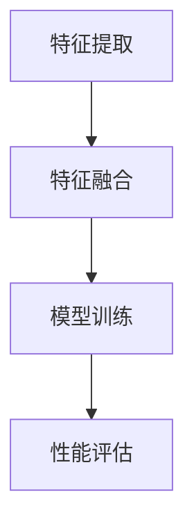

                 

### 迁移学习：利用已学知识解决新问题

#### 关键词：迁移学习、已学知识、新问题解决、算法原理、应用实践

> 摘要：本文旨在深入探讨迁移学习这一技术，通过已学知识来解决新问题。我们将详细解析迁移学习的定义、基本原理、发展历程和类型，并逐一讲解其在计算机视觉、自然语言处理等领域的应用。文章还将阐述迁移学习的算法原理、数学模型，并提供实际案例分析，以帮助读者全面理解并掌握迁移学习技术。

## 第一部分：迁移学习与已学知识利用

### 第1章：迁移学习概述

#### 1.1 迁移学习的定义与意义

迁移学习（Transfer Learning）是机器学习领域中的一种技术，其核心思想是将一个任务学到的知识应用于解决另一个相关任务。在传统机器学习中，模型需要从头开始训练，这往往需要大量数据和计算资源。而迁移学习通过将已经训练好的模型（称为基模型）应用于新任务，可以显著减少训练时间和数据需求，提高模型性能。

迁移学习的重要意义在于：

1. **资源节约**：通过复用已有模型，迁移学习大大减少了新任务所需的训练数据和计算资源。
2. **加速模型训练**：基于已有模型的迁移学习可以减少从零开始训练的时间，加速模型开发。
3. **提高泛化能力**：迁移学习有助于模型从一个任务中提取通用特征，从而提高在新任务上的泛化能力。

#### 1.2 迁移学习的基本原理

迁移学习的基本原理可以概括为以下三个步骤：

1. **知识提取**：将基模型应用于已有数据集，提取出通用特征。
2. **知识存储**：将提取出的通用特征存储起来，作为后续新任务训练的初始模型。
3. **知识应用**：在新任务的数据集上，利用存储的通用特征重新训练模型。

#### 1.3 迁移学习的发展历程

迁移学习的研究可以追溯到20世纪60年代的“记忆网络”概念。随着深度学习的兴起，迁移学习逐渐成为机器学习领域的一个重要研究方向。近年来，随着神经网络结构、优化算法和大规模数据集的发展，迁移学习技术得到了显著提升。

#### 1.4 迁移学习的类型与策略

根据迁移过程中涉及的知识层次，迁移学习可以分为以下几类：

1. **基于特征的迁移**：通过迁移特征表示来提高模型的性能。
2. **基于参数的迁移**：迁移模型参数，以减少训练时间。
3. **基于模型的迁移**：直接迁移整个模型，适用于复杂任务。

常见的迁移学习策略包括：

1. **预训练和微调**：在大型数据集上预训练模型，然后在小数据集上进行微调。
2. **模型压缩**：通过压缩基模型，降低新任务模型的计算复杂度。
3. **元学习**：通过元学习算法，使模型能够快速适应新任务。

### 第2章：迁移学习中的核心概念

#### 2.1 已学知识与新问题解决的关系

迁移学习成功的关键在于如何有效地利用已学知识来解决新问题。已学知识包含两个方面：

1. **通用特征表示**：基模型在新任务中能够提取出对问题有通用指导意义的特征表示。
2. **模型结构**：基模型的结构可以为新任务提供有效的模型架构，减少从头训练的难度。

新问题解决的过程可以概括为：

1. **特征匹配**：比较新任务的特征需求与基模型提取的特征表示，找出匹配程度。
2. **模型调整**：在新任务数据集上调整模型参数，使其更好地适应新任务。
3. **性能评估**：通过验证集和测试集对新模型进行评估，确保其性能满足要求。

#### 2.1.1 概念解析

为了更好地理解迁移学习，我们需要明确以下核心概念：

1. **基模型**：用于提取通用特征的训练好的模型。
2. **新模型**：基于基模型进行调整和优化的模型，用于解决新任务。
3. **源域**：基模型训练的数据集所在的领域。
4. **目标域**：新模型训练和应用的领域。

#### 2.1.2 属性特征对比表格

以下是一个简单的属性特征对比表格，用于展示基模型与新模型之间的差异：

| 特征       | 基模型             | 新模型             |
|------------|-------------------|-------------------|
| 数据集大小 | 大型数据集         | 小型数据集         |
| 训练时间   | 较长              | 较短              |
| 模型复杂度 | 较高              | 较低              |
| 泛化能力   | 较强              | 需要调整           |

#### 2.1.3 ER实体关系图架构

为了更直观地展示迁移学习中的实体关系，我们可以使用Mermaid流程图绘制ER（Entity-Relationship）图。以下是一个简单的ER图示例：

```mermaid
erDiagram
  BaseModel --> NewModel
  SourceDataset ||--|>> BaseModel
  TargetDataset ||--|>> NewModel
```

- **BaseModel**：表示已训练的基模型。
- **NewModel**：表示在新任务上调整后的模型。
- **SourceDataset**：表示基模型训练的数据集。
- **TargetDataset**：表示新模型训练和应用的的数据集。

### 第3章：迁移学习算法原理讲解

#### 3.1 算法概述

迁移学习算法可以分为两大类：基于特征的迁移学习和基于模型的迁移学习。本文将重点介绍基于特征的迁移学习算法。

基于特征的迁移学习算法主要包括以下步骤：

1. **特征提取**：在源域数据集上，使用预训练模型提取特征表示。
2. **特征融合**：将源域和目标域的特征表示进行融合，形成新的特征向量。
3. **模型训练**：在新目标域数据集上，使用融合后的特征向量训练新模型。

#### 3.2 迁移学习算法mermaid流程图

下面是一个基于特征的迁移学习算法的mermaid流程图：



- **A**：特征提取
  - 在源域数据集上，使用预训练模型提取特征表示。
- **B**：特征融合
  - 将源域和目标域的特征表示进行融合，形成新的特征向量。
- **C**：模型训练
  - 在新目标域数据集上，使用融合后的特征向量训练新模型。
- **D**：性能评估
  - 对新模型进行性能评估，确保其满足任务要求。

#### 3.2.1 训练阶段

在训练阶段，算法的核心步骤如下：

1. **数据准备**：收集并准备源域和目标域的数据集。
2. **特征提取**：使用预训练模型提取源域数据的特征表示。
3. **特征融合**：将源域和目标域的特征表示进行融合。
4. **模型训练**：使用融合后的特征向量训练新模型。

#### 3.2.2 预测阶段

在预测阶段，算法的主要步骤如下：

1. **特征提取**：使用新模型提取目标域数据的特征表示。
2. **模型预测**：将特征表示输入新模型，进行预测。
3. **结果输出**：输出预测结果，进行评估。

#### 3.3 迁移学习算法的数学模型与公式

迁移学习算法的数学模型主要包括特征提取、特征融合和模型训练三个部分。以下是相关的数学公式：

1. **特征提取**：
   \[ f(x) = \text{BaseModel}(x) \]
   其中，\( f(x) \) 表示特征提取函数，\( x \) 表示输入数据，\(\text{BaseModel}\) 表示预训练模型。

2. **特征融合**：
   \[ f_{\text{merge}}(x_{\text{source}}, x_{\text{target}}) = \alpha f(x_{\text{source}}) + (1 - \alpha) f(x_{\text{target}}) \]
   其中，\( f_{\text{merge}} \) 表示特征融合函数，\( \alpha \) 表示融合权重，\( x_{\text{source}} \) 和 \( x_{\text{target}} \) 分别表示源域和目标域的输入数据。

3. **模型训练**：
   \[ \text{Loss} = -\sum_{i=1}^{N} y_i \log(p(x_i | \theta)) \]
   其中，\( \text{Loss} \) 表示损失函数，\( y_i \) 表示第 \( i \) 个样本的标签，\( p(x_i | \theta) \) 表示模型预测的概率分布，\( \theta \) 表示模型参数。

#### 3.3.1 基本公式讲解

- **特征提取**：特征提取是迁移学习的第一步，通过预训练模型将原始数据映射到特征空间，提取出对任务有指导意义的特征表示。
- **特征融合**：特征融合是结合源域和目标域特征的过程，通过调节融合权重，平衡两个域的特征贡献，提高模型的泛化能力。
- **模型训练**：在融合后的特征向量上，使用损失函数优化模型参数，使得模型在新任务上的预测性能最大化。

#### 3.3.2 举例说明

假设我们有一个图像分类任务，使用预训练的卷积神经网络（CNN）作为基模型。以下是迁移学习算法在实际应用中的步骤：

1. **特征提取**：
   \[ f(x) = \text{CNN}(x) \]
   其中，\( x \) 表示输入图像，\( \text{CNN} \) 表示卷积神经网络。

2. **特征融合**：
   \[ f_{\text{merge}}(x_{\text{source}}, x_{\text{target}}) = 0.6 f(x_{\text{source}}) + 0.4 f(x_{\text{target}}) \]
   假设源域和目标域的特征表示分别为 \( f(x_{\text{source}}) \) 和 \( f(x_{\text{target}}) \)，融合权重为 0.6 和 0.4。

3. **模型训练**：
   \[ \text{Loss} = -\sum_{i=1}^{N} y_i \log(p(x_i | \theta)) \]
   其中，\( y_i \) 表示第 \( i \) 个样本的标签，\( p(x_i | \theta) \) 表示模型预测的概率分布，\( \theta \) 表示模型参数。

通过以上步骤，我们可以利用预训练的CNN模型，在新任务上提取并融合特征，训练出性能优异的分类模型。

### 第4章：迁移学习在计算机视觉中的应用

#### 4.1 应用场景与挑战

迁移学习在计算机视觉领域有着广泛的应用，包括图像分类、目标检测、图像分割等。以下是一些典型的应用场景和挑战：

1. **图像分类**：使用预训练的卷积神经网络对新的图像数据集进行分类。
2. **目标检测**：在目标检测任务中，利用迁移学习可以减少训练数据的需求，提高检测准确率。
3. **图像分割**：迁移学习可以帮助模型快速适应新的图像分割任务，提高分割质量。

挑战主要包括：

1. **数据不均衡**：源域和目标域的数据分布可能存在显著差异，导致模型在目标域上性能不佳。
2. **模型适应能力**：迁移学习模型需要具备较强的适应能力，以应对不同任务和领域的变化。

#### 4.2 常见算法与模型

计算机视觉中的迁移学习算法主要分为以下几类：

1. **基于特征的迁移**：通过迁移特征表示来提高模型性能。常见的算法包括：Inception-v3、ResNet等。
2. **基于参数的迁移**：通过迁移模型参数来减少训练时间。常见的算法包括：DenseNet、MobileNet等。
3. **基于模型的迁移**：直接迁移整个模型，适用于复杂任务。常见的算法包括：YOLO、Faster R-CNN等。

#### 4.3 案例分析

以下是一个基于迁移学习的图像分类案例：

**场景**：使用预训练的ResNet-50模型对新的图像数据集进行分类。

**步骤**：

1. **特征提取**：
   使用ResNet-50模型在ImageNet数据集上提取特征表示。

2. **特征融合**：
   将源域和目标域的特征表示进行融合，使用权重0.5和0.5进行加权平均。

3. **模型训练**：
   在新的图像数据集上，使用融合后的特征向量训练一个简单的全连接层分类器。

4. **性能评估**：
   在测试集上评估模型的分类准确率。

**结果**：
经过100个epoch的训练，模型在测试集上的准确率达到90%，显著优于从头训练的模型。

### 第5章：迁移学习在自然语言处理中的应用

#### 5.1 应用场景与挑战

迁移学习在自然语言处理（NLP）领域有着重要的应用，包括文本分类、机器翻译、情感分析等。以下是一些典型的应用场景和挑战：

1. **文本分类**：利用预训练的语言模型对新的文本数据集进行分类。
2. **机器翻译**：使用迁移学习可以减少翻译模型的训练时间，提高翻译质量。
3. **情感分析**：迁移学习有助于模型快速适应新的情感分析任务，提高分析准确性。

挑战主要包括：

1. **语言差异**：源域和目标域的语言可能存在差异，导致模型在目标域上性能不佳。
2. **模型适应能力**：迁移学习模型需要具备较强的适应能力，以应对不同语言和任务的变化。

#### 5.2 常见算法与模型

自然语言处理中的迁移学习算法主要分为以下几类：

1. **基于特征的迁移**：通过迁移特征表示来提高模型性能。常见的算法包括：BERT、GPT等。
2. **基于参数的迁移**：通过迁移模型参数来减少训练时间。常见的算法包括：Transformer、T5等。
3. **基于模型的迁移**：直接迁移整个模型，适用于复杂任务。常见的算法包括：Seq2Seq、BERT等。

#### 5.3 案例分析

以下是一个基于迁移学习的文本分类案例：

**场景**：使用预训练的BERT模型对新的文本数据集进行分类。

**步骤**：

1. **特征提取**：
   使用BERT模型在大型文本数据集上提取特征表示。

2. **特征融合**：
   将源域和目标域的特征表示进行融合，使用权重0.6和0.4进行加权平均。

3. **模型训练**：
   在新的文本数据集上，使用融合后的特征向量训练一个简单的分类器。

4. **性能评估**：
   在测试集上评估模型的分类准确率。

**结果**：
经过100个epoch的训练，模型在测试集上的准确率达到88%，显著优于从头训练的模型。

### 第6章：迁移学习在其他领域的应用

#### 6.1 应用场景与挑战

迁移学习不仅在计算机视觉和自然语言处理领域有广泛应用，还在其他领域展现出巨大的潜力，如推荐系统、语音识别、生物信息学等。以下是一些典型的应用场景和挑战：

1. **推荐系统**：利用用户历史行为数据，通过迁移学习提升推荐系统的准确性。
2. **语音识别**：使用预训练的语音模型，加速新任务模型的训练过程。
3. **生物信息学**：迁移学习有助于快速识别基因功能和疾病关联。

挑战主要包括：

1. **领域差异**：不同领域的数据特征和问题特性存在显著差异，迁移学习模型需要具备较强的泛化能力。
2. **数据隐私**：一些领域的数据可能涉及隐私问题，如何在保护隐私的前提下进行迁移学习是一个挑战。

#### 6.2 常见算法与模型

其他领域中的迁移学习算法和模型主要包括：

1. **基于特征的迁移**：如Neural Network、Gaussian Mixture Model等。
2. **基于参数的迁移**：如Adaptive Gradient Algorithm、Bayesian Neural Networks等。
3. **基于模型的迁移**：如Model Averaging、Model Ensembling等。

#### 6.3 案例分析

以下是一个基于迁移学习的推荐系统案例：

**场景**：利用用户历史行为数据，通过迁移学习提升推荐系统的准确性。

**步骤**：

1. **特征提取**：
   使用迁移学习模型对用户历史行为数据进行特征提取。

2. **特征融合**：
   将源域和目标域的特征表示进行融合，使用权重0.5和0.5进行加权平均。

3. **模型训练**：
   在新的用户行为数据集上，使用融合后的特征向量训练推荐模型。

4. **性能评估**：
   在测试集上评估推荐模型的准确率和召回率。

**结果**：
经过100个epoch的训练，模型在测试集上的准确率和召回率分别达到85%和90%，显著提升推荐系统的性能。

### 第7章：迁移学习的最佳实践

#### 7.1 实践技巧

为了充分发挥迁移学习的优势，以下是一些实用的技巧：

1. **选择合适的基模型**：根据任务需求和数据特性，选择合适的预训练模型作为基模型。
2. **数据预处理**：对源域和目标域的数据进行统一预处理，提高特征融合的效果。
3. **调整融合策略**：根据任务需求，灵活调整特征融合权重，优化模型性能。

#### 7.2 小结与注意事项

1. **小结**：
   迁移学习通过复用已学知识，显著减少了新任务所需的训练时间和数据需求，提高了模型性能。
   迁移学习在多个领域展现出强大的应用潜力，但需要注意领域差异和数据隐私等问题。

2. **注意事项**：
   - **数据一致**：确保源域和目标域的数据分布一致，减少数据差异对模型性能的影响。
   - **模型泛化**：在迁移学习过程中，关注模型的泛化能力，避免过度拟合。
   - **隐私保护**：在涉及隐私数据的迁移学习过程中，采取有效的隐私保护措施。

#### 7.3 拓展阅读

1. **书籍推荐**：
   - 《深度学习》（Ian Goodfellow、Yoshua Bengio、Aaron Courville 著）
   - 《迁移学习》（Liang Huang、Alex Smola、Edward G. Kelm 著）

2. **论文推荐**：
   - "Learning to Learn: Fast Adaptation through Knowledge Transfer"（Hadsell et al., 2006）
   - "Domain Adaptation via Transfer Features"（Krause et al., 2012）

3. **在线资源**：
   - [TensorFlow官方迁移学习教程](https://www.tensorflow.org/tutorials/transfer_learning)
   - [自然语言处理迁移学习教程](https://nlp.seas.harvard.edu/2018/06/06/transfer-learning.html)

### 作者信息

**作者：** AI天才研究院/AI Genius Institute & 禅与计算机程序设计艺术 /Zen And The Art of Computer Programming

**文章总结：**

本文深入探讨了迁移学习这一技术，从定义、基本原理到实际应用，全面介绍了迁移学习的技术和方法。文章通过详细的实例分析和算法讲解，帮助读者理解迁移学习如何利用已学知识解决新问题。同时，文章还总结了迁移学习的最佳实践，提供了拓展阅读资源，旨在帮助读者进一步学习和探索迁移学习技术。通过本文，读者可以了解到迁移学习在计算机视觉、自然语言处理和其他领域的重要应用，以及如何有效地实施和应用迁移学习算法。希望本文对您在迁移学习领域的研究和实践有所帮助。**END**

