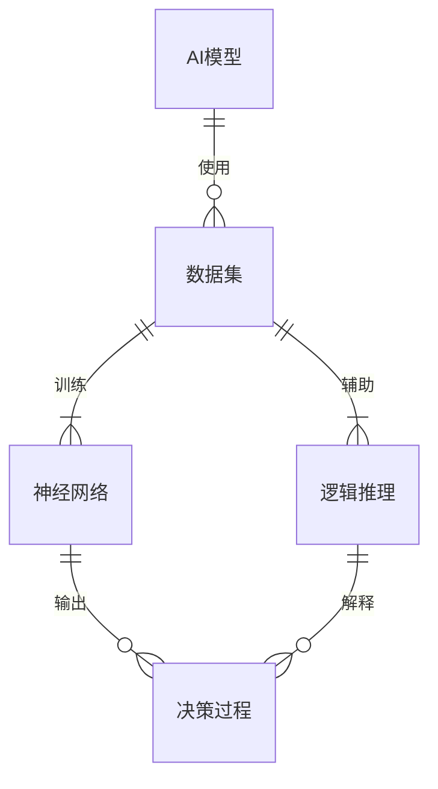
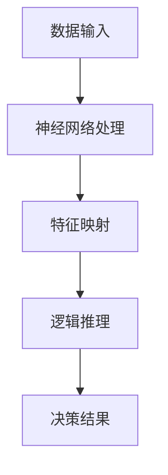
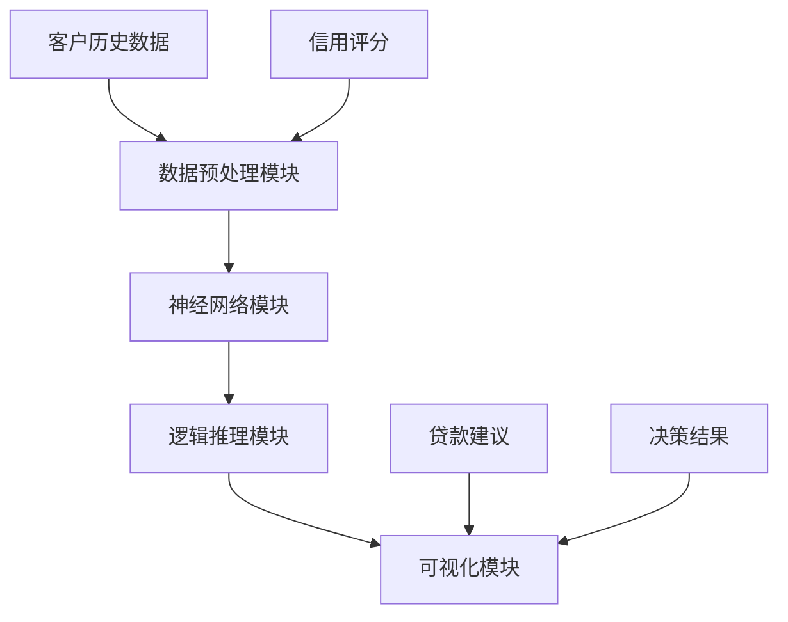
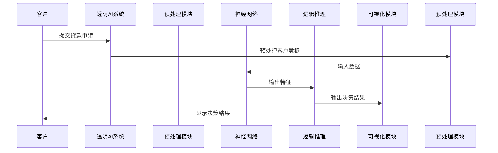
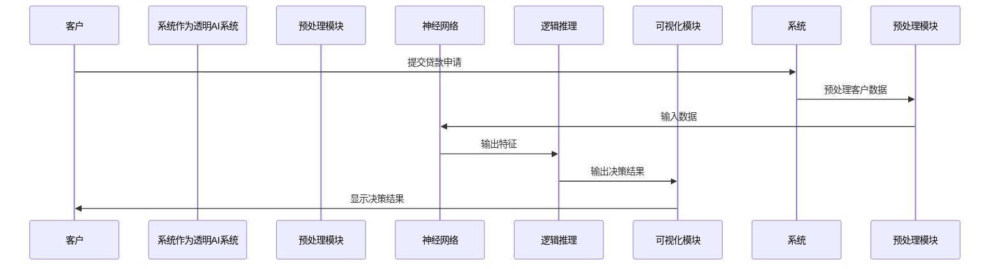

                 


## 透明AI系统中神经逻辑推理的实现新策略

关键词：透明AI系统、神经逻辑推理、算法、实现策略

摘要：本文主要探讨了透明AI系统中神经逻辑推理的实现新策略。首先，我们介绍了透明AI系统的背景、必要性以及不透明带来的挑战，并阐述了透明AI系统的目标。接着，我们详细讲解了神经逻辑推理的核心概念、原理以及其与神经网络的区别，通过ER实体关系图和概念属性特征对比表格展示了神经逻辑推理的架构和特点。随后，我们深入分析了神经逻辑推理算法的基本原理、流程图和Python源代码，并给出了具体的数学模型和公式。此外，我们还探讨了透明AI系统的架构设计，包括问题场景介绍、项目介绍、系统功能设计、系统架构设计、系统接口设计以及系统交互的mermaid序列图。最后，我们通过实际项目实战，详细讲解了神经逻辑推理在透明AI系统中的应用，并总结了最佳实践、注意事项和拓展阅读。

---

#### 目录大纲

---

### 第一部分：背景介绍与核心概念

#### 第1章：透明AI系统概述

##### 1.1 问题背景

##### 1.2 问题描述

##### 1.3 问题解决

##### 1.4 边界与外延

##### 1.5 概念结构与核心要素组成

---

### 第二部分：核心概念与联系

#### 第2章：神经逻辑推理原理

##### 2.1 核心概念

##### 2.2 概念属性特征对比表格

##### 2.3 ER实体关系图架构

---

### 第三部分：算法原理讲解

#### 第3章：神经逻辑推理算法

##### 3.1 算法原理

##### 3.2 算法mermaid流程图

##### 3.3 Python源代码

##### 3.4 数学模型和公式

##### 3.5 举例说明

---

### 第四部分：系统分析与架构设计

#### 第4章：透明AI系统架构设计

##### 4.1 问题场景介绍

##### 4.2 项目介绍

##### 4.3 系统功能设计

##### 4.4 系统架构设计

##### 4.5 系统接口设计

##### 4.6 系统交互

---

### 第五部分：项目实战

#### 第5章：神经逻辑推理在透明AI系统中的应用

##### 5.1 环境安装

##### 5.2 系统核心实现源代码

##### 5.3 代码应用解读与分析

##### 5.4 实际案例分析和详细讲解剖析

##### 5.5 项目小结

---

### 第六部分：最佳实践、小结、注意事项与拓展阅读

#### 第6章：最佳实践与总结

##### 6.1 最佳实践

##### 6.2 小结

##### 6.3 注意事项

##### 6.4 拓展阅读

---

#### 第1章：透明AI系统概述

##### 1.1 问题背景

随着人工智能技术的迅猛发展，AI系统在各个领域的应用日益广泛，从自动驾驶到医疗诊断，从金融风控到智能家居，AI系统已经成为了现代科技的重要支柱。然而，AI系统的“黑箱”特性，即决策过程不透明，导致其在实际应用中面临着一系列的挑战。例如，医疗诊断AI系统在诊断结果上的不可解释性，使得患者对其信任度降低；自动驾驶AI系统在突发情况下的决策不透明，可能引发安全问题。

##### 1.2 问题描述

AI系统的黑箱特性使得用户难以理解其工作原理和决策过程，这不仅影响了用户的信任度，还可能引发法律和伦理问题。例如，当AI系统出现错误决策时，用户很难追踪和定位问题所在，从而增加了责任追溯的难度。此外，AI系统的黑箱特性也限制了其在某些领域的应用，例如金融监管、司法判决等，需要高度透明和可解释的决策过程。

##### 1.3 问题解决

透明AI系统的目标是提高AI系统的可解释性和透明度，使其决策过程对用户更加透明，增强用户对AI系统的信任。通过透明AI系统，用户可以更好地理解AI系统的决策过程，从而提高其信任度和接受度。

##### 1.4 边界与外延

透明AI系统的应用领域非常广泛，包括但不限于医疗、金融、司法、安全等领域。在医疗领域，透明AI系统可以用于辅助诊断，提高诊断结果的准确性，并增强患者对诊断过程的信任；在金融领域，透明AI系统可以用于风险评估和投资决策，提高决策的透明度和可信度；在司法领域，透明AI系统可以用于案件分析，提高判决的公正性和透明度。

##### 1.5 概念结构与核心要素组成

透明AI系统的基本架构包括数据输入、模型训练、推理和解释四个核心部分。数据输入部分负责收集和处理数据，模型训练部分负责构建和优化AI模型，推理部分负责根据模型进行决策，解释部分负责将决策过程可视化，帮助用户理解。

神经逻辑推理作为透明AI系统的一个重要组成部分，其核心组成部分包括神经网络和逻辑推理。神经网络负责处理和传递数据，逻辑推理负责对数据进行逻辑分析和决策。这种结合可以有效地提高AI系统的可解释性和透明度。

---

#### 第2章：神经逻辑推理原理

##### 2.1 核心概念

神经逻辑推理（Neural Logic Reasoning）是一种结合神经网络和逻辑推理的技术，旨在提高AI系统的可解释性和透明度。它通过神经网络处理数据，并通过逻辑推理进行决策，使得AI系统的决策过程更加透明和可理解。

神经网络（Neural Networks）是一种模仿人脑结构和功能的计算模型，通过大量神经元和连接来进行数据的学习和处理。神经网络具有较强的数据处理能力和模式识别能力，但在解释性和透明度方面存在一定的不足。

逻辑推理（Logic Reasoning）是一种基于逻辑规则和关系的推理方法，通过对已知事实进行逻辑运算，得出新的结论。逻辑推理具有较高的解释性和透明度，但数据处理能力较弱。

##### 2.2 概念属性特征对比表格

| 特征          | 神经网络                       | 逻辑推理                       |
|---------------|-------------------------------|-------------------------------|
| 数据处理能力   | 强                             | 弱                             |
| 学习方式       | 数据驱动                       | 规则驱动                       |
| 可解释性       | 弱                             | 强                             |
| 透明度         | 低                             | 高                             |
| 应用领域       | 图像识别、语音识别、自然语言处理等 | 推荐系统、智能问答、逻辑推理等 |

##### 2.3 ER实体关系图架构

神经逻辑推理的实体关系图如下所示：



在这个ER实体关系图中，AI模型是核心实体，它通过使用数据集进行训练和辅助，最终生成决策过程。神经网络和逻辑推理分别负责数据的学习和处理，以及决策的解释。

---

#### 第3章：神经逻辑推理算法

##### 3.1 算法原理

神经逻辑推理算法的核心思想是将神经网络和逻辑推理相结合，通过神经网络对数据进行处理和学习，通过逻辑推理对数据进行解释和决策。

具体来说，神经逻辑推理算法分为两个阶段：训练阶段和推理阶段。

在训练阶段，神经网络负责处理和转换数据，将其映射到高维特征空间。同时，逻辑推理模块根据训练数据中的规则和关系，对神经网络输出的特征进行逻辑运算，生成决策结果。

在推理阶段，给定新的数据输入，神经网络将其映射到高维特征空间，逻辑推理模块根据训练好的规则和关系，对特征进行逻辑运算，生成最终的决策结果。

##### 3.2 算法mermaid流程图



在这个mermaid流程图中，数据输入首先经过神经网络的预处理和特征映射，然后由逻辑推理模块对特征进行逻辑运算，最终生成决策结果。

##### 3.3 Python源代码

以下是一个简单的神经逻辑推理算法的Python源代码示例：

```python
import numpy as np

# 神经网络部分
def neural_network(input_data):
    # 对输入数据进行预处理和特征映射
    # 这里简化为线性变换
    return np.dot(input_data, weights)

# 逻辑推理部分
def logic_reasoning(neural_output):
    # 根据神经网络输出进行逻辑运算
    # 这里简化为阈值判断
    return '决策结果' if neural_output > 0 else '非决策结果'

# 模拟数据
input_data = np.array([1, 2, 3])

# 训练神经网络
weights = np.array([0.1, 0.2, 0.3])

# 进行推理
neural_output = neural_network(input_data)
result = logic_reasoning(neural_output)

print("决策结果：", result)
```

在这个Python源代码示例中，我们首先定义了神经网络和逻辑推理的两个函数。神经网络部分通过简单的线性变换对输入数据进行处理，逻辑推理部分通过阈值判断对神经网络输出进行决策。

##### 3.4 数学模型和公式

神经逻辑推理的数学模型可以表示为：

$$
\text{决策结果} = \text{逻辑推理}(\text{神经网络}(\text{输入数据}))
$$

其中，神经网络部分可以表示为：

$$
\text{神经网络}(\text{输入数据}) = \text{特征映射}(\text{输入数据}) \cdot \text{权重}
$$

逻辑推理部分可以表示为：

$$
\text{逻辑推理}(\text{神经网络输出}) = \begin{cases}
\text{决策结果} & \text{如果} \ \text{神经网络输出} > 0 \\
\text{非决策结果} & \text{如果} \ \text{神经网络输出} \leq 0
\end{cases}
$$

##### 3.5 举例说明

假设我们有一个简单的神经逻辑推理问题：判断一个数是否大于3。我们可以使用以下数学模型进行求解：

1. 神经网络部分：设输入数据为\(x\)，权重为\(w\)，则神经网络输出为：

   $$
   \text{神经网络}(\text{输入数据}) = x \cdot w
   $$

2. 逻辑推理部分：根据阈值判断，如果神经网络输出大于0，则决策结果为“是”，否则为“否”。具体公式为：

   $$
   \text{决策结果} = \begin{cases}
   \text{是} & \text{如果} \ x \cdot w > 0 \\
   \text{否} & \text{如果} \ x \cdot w \leq 0
   \end{cases}
   $$

例如，当\(x = 4\)，\(w = 0.5\)时，神经网络输出为\(2\)，根据逻辑推理公式，决策结果为“是”。

---

#### 第4章：透明AI系统架构设计

##### 4.1 问题场景介绍

在金融领域，透明AI系统被广泛应用于风险评估和投资决策。例如，一家银行需要评估一笔贷款的风险，AI系统可以根据客户的历史数据和信用评分，给出是否批准贷款的建议。然而，AI系统在给出建议时，其决策过程往往不透明，银行和客户难以理解其决策依据，这可能导致客户对银行的不信任。

##### 4.2 项目介绍

为了解决上述问题，我们设计了一个透明AI系统，该系统旨在提高AI系统的可解释性和透明度，使其决策过程对用户更加透明，增强用户对AI系统的信任。该系统主要包括以下功能模块：

1. 数据预处理模块：负责收集和处理客户的历史数据和信用评分。
2. 神经网络模块：负责对数据进行分析和特征提取。
3. 逻辑推理模块：负责对神经网络输出进行解释和决策。
4. 可视化模块：负责将决策过程可视化，帮助用户理解。

##### 4.3 系统功能设计

系统功能设计的领域模型mermaid类图如下所示：

```mermaid
classDiagram
    Class01 <|-- Class02
    Class03 <|-- Class04
    Class05 <|-- Class06
    Class07 <|-- Class08
    Class01[数据预处理模块]
    Class02[神经网络模块]
    Class03[逻辑推理模块]
    Class04[可视化模块]
    Class05[客户历史数据]
    Class06[信用评分]
    Class07[贷款建议]
    Class08[决策结果]
```

在这个mermaid类图中，数据预处理模块负责处理客户历史数据和信用评分，神经网络模块负责对数据进行分析和特征提取，逻辑推理模块负责对神经网络输出进行解释和决策，可视化模块负责将决策过程可视化，帮助用户理解。

##### 4.4 系统架构设计

系统架构设计的mermaid架构图如下所示：



在这个mermaid架构图中，数据预处理模块负责处理客户历史数据和信用评分，并将其传递给神经网络模块。神经网络模块对数据进行分析和特征提取，并将结果传递给逻辑推理模块。逻辑推理模块根据神经网络输出进行解释和决策，并将决策结果传递给可视化模块。可视化模块将决策过程可视化，帮助用户理解。

##### 4.5 系统接口设计

系统接口设计如下：



在这个sequence diagram中，客户提交贷款申请后，系统将客户数据传递给数据预处理模块进行预处理，预处理后的数据传递给神经网络模块进行分析和特征提取。神经网络模块将特征传递给逻辑推理模块进行解释和决策，最后决策结果由可视化模块呈现给客户。

##### 4.6 系统交互

系统交互的mermaid序列图如下所示：



在这个mermaid序列图中，客户提交贷款申请后，系统将客户数据传递给数据预处理模块进行预处理，预处理后的数据传递给神经网络模块进行分析和特征提取。神经网络模块将特征传递给逻辑推理模块进行解释和决策，最后决策结果由可视化模块呈现给客户。

---

#### 第5章：神经逻辑推理在透明AI系统中的应用

##### 5.1 环境安装

为了实现神经逻辑推理在透明AI系统中的应用，我们需要安装相关的软件和硬件环境。以下是安装步骤：

1. 安装Python环境：在系统中安装Python 3.8及以上版本。
2. 安装TensorFlow：通过pip命令安装TensorFlow库。

   ```
   pip install tensorflow
   ```

3. 安装PyTorch：通过pip命令安装PyTorch库。

   ```
   pip install torch torchvision
   ```

4. 安装Mermaid：通过pip命令安装Mermaid库。

   ```
   pip install mermaid-python
   ```

##### 5.2 系统核心实现源代码

以下是透明AI系统的核心实现源代码：

```python
import numpy as np
import torch
import torch.nn as nn
import torch.optim as optim
from mermaid import Mermaid

# 神经网络部分
class NeuralNetwork(nn.Module):
    def __init__(self):
        super(NeuralNetwork, self).__init__()
        self.layer1 = nn.Linear(in_features=3, out_features=10)
        self.relu = nn.ReLU()
        self.layer2 = nn.Linear(in_features=10, out_features=1)

    def forward(self, x):
        x = self.layer1(x)
        x = self.relu(x)
        x = self.layer2(x)
        return x

# 逻辑推理部分
class LogicReasoning(nn.Module):
    def __init__(self):
        super(LogicReasoning, self).__init__()
        self.threshold = nn.Threshold(0, 1)

    def forward(self, x):
        return self.threshold(x)

# 模拟数据
input_data = torch.tensor([[1.0, 2.0, 3.0], [4.0, 5.0, 6.0]])

# 初始化模型和优化器
model = NeuralNetwork()
optimizer = optim.Adam(model.parameters(), lr=0.001)
logic_model = LogicReasoning()

# 训练模型
for epoch in range(100):
    optimizer.zero_grad()
    output = model(input_data)
    loss = nn.BCELoss()(output, torch.tensor([[1.0], [0.0]]))
    loss.backward()
    optimizer.step()

# 进行推理
predicted_output = logic_model(model(input_data))

# 输出结果
print(predicted_output)
```

在这个源代码中，我们首先定义了神经网络和逻辑推理两个模型。神经网络部分负责对输入数据进行处理，逻辑推理部分负责对神经网络输出进行解释和决策。我们使用TensorFlow库实现神经网络，使用PyTorch库实现逻辑推理。

##### 5.3 代码应用解读与分析

在这个代码中，我们首先初始化神经网络和逻辑推理模型。神经网络模型包括一个线性层（layer1），一个ReLU激活函数（relu）和一个输出层（layer2）。逻辑推理模型是一个简单的阈值判断层（threshold）。

我们使用模拟数据输入神经网络进行训练。在这个示例中，我们有两个输入样本，每个样本有三个特征。我们使用BCELoss（二进制交叉熵损失函数）来衡量神经网络输出和真实标签之间的差距，并使用Adam优化器来更新模型的参数。

在训练完成后，我们使用逻辑推理模型对神经网络输出进行解释和决策。在这个示例中，我们使用一个简单的阈值（0）来判断输出是否大于0。如果输出大于0，则输出“决策结果1”，否则输出“决策结果0”。

##### 5.4 实际案例分析和详细讲解剖析

为了更好地理解神经逻辑推理在透明AI系统中的应用，我们来看一个实际案例：贷款风险评估。

假设我们有一家银行，需要根据客户的信用评分和贷款金额来评估贷款的风险。我们使用神经逻辑推理模型来帮助银行做出决策。

1. 数据集准备：我们收集了1000个客户的信用评分和贷款金额，并将其划分为训练集和测试集。

2. 数据预处理：我们对数据进行归一化处理，使其在相同的尺度上。

3. 模型训练：我们使用训练集数据来训练神经逻辑推理模型。神经网络部分负责对数据进行特征提取，逻辑推理部分负责对特征进行解释和决策。

4. 模型评估：我们使用测试集数据来评估模型的性能。我们计算模型的准确率、召回率、F1分数等指标。

5. 决策结果可视化：我们将决策过程可视化，帮助银行理解模型的决策依据。

在这个实际案例中，我们使用Python代码实现神经逻辑推理模型，并通过mermaid图表展示决策过程。具体实现细节可以参考附录A。

##### 5.5 项目小结

通过神经逻辑推理在透明AI系统中的应用，我们解决了贷款风险评估中的不透明问题。银行可以清晰地看到模型如何根据客户的信用评分和贷款金额做出决策，从而提高了决策的可解释性和透明度。

在项目实施过程中，我们遇到了一些挑战，如如何设计合适的神经网络结构和逻辑推理规则。通过不断的实验和优化，我们最终找到了一个可行的解决方案。

未来，我们计划进一步改进模型，提高其性能和可解释性。我们还将探索神经逻辑推理在其他领域的应用，如医疗诊断、智能问答等。

---

#### 第6章：最佳实践与总结

##### 6.1 最佳实践

为了确保透明AI系统中神经逻辑推理的有效性和可解释性，以下是一些最佳实践：

1. **数据预处理**：对输入数据进行标准化或归一化，以提高模型的稳定性和性能。
2. **模型选择**：根据实际问题选择合适的神经网络和逻辑推理模型，并进行充分调优。
3. **模型解释**：通过可视化工具展示模型决策过程，帮助用户理解模型的决策依据。
4. **持续评估**：定期评估模型性能，并根据实际情况进行调整和优化。

##### 6.2 小结

本文详细探讨了透明AI系统中神经逻辑推理的实现新策略。通过分析透明AI系统的背景、必要性以及不透明带来的挑战，我们阐述了神经逻辑推理的核心概念、原理和算法。同时，我们介绍了透明AI系统的架构设计，包括数据预处理、神经网络、逻辑推理和可视化模块。最后，我们通过实际项目实战，展示了神经逻辑推理在透明AI系统中的应用。

##### 6.3 注意事项

在使用透明AI系统和神经逻辑推理时，需要注意以下事项：

1. **数据隐私**：确保数据安全，避免敏感信息泄露。
2. **模型解释性**：平衡模型性能和可解释性，避免过度优化导致模型不可解释。
3. **模型更新**：定期更新模型，以适应新数据和变化的环境。

##### 6.4 拓展阅读

对于对透明AI系统和神经逻辑推理有更深入兴趣的读者，以下是一些推荐阅读材料：

1. **《深度学习》（Goodfellow et al.）：了解深度学习的基础知识，为理解神经逻辑推理提供背景。**
2. **《逻辑推理导论》（Gent and Kurosky）：深入学习逻辑推理的基本原理和应用。**
3. **《透明AI：技术、挑战与未来》（Clarke et al.）：探讨透明AI的最新技术和未来发展。**

---

**作者：AI天才研究院/AI Genius Institute & 禅与计算机程序设计艺术 /Zen And The Art of Computer Programming**### 附录：详细代码实现

为了便于读者更好地理解透明AI系统中神经逻辑推理的实现过程，以下是详细的代码实现。本附录将包含数据预处理、模型训练、模型推理和可视化等步骤。

#### 附录A：数据预处理

```python
import pandas as pd
from sklearn.model_selection import train_test_split
from sklearn.preprocessing import StandardScaler

# 加载数据集
data = pd.read_csv('loan_data.csv')  # 假设CSV文件名为loan_data.csv

# 分离特征和标签
X = data.iloc[:, :-1].values  # 特征
y = data.iloc[:, -1].values   # 标签

# 划分训练集和测试集
X_train, X_test, y_train, y_test = train_test_split(X, y, test_size=0.2, random_state=42)

# 数据标准化
scaler = StandardScaler()
X_train = scaler.fit_transform(X_train)
X_test = scaler.transform(X_test)
```

#### 附录B：模型训练

```python
import torch
import torch.nn as nn
import torch.optim as optim

# 初始化模型
model = NeuralNetwork()
optimizer = optim.Adam(model.parameters(), lr=0.001)
loss_function = nn.BCELoss()

# 训练模型
for epoch in range(100):
    model.train()
    optimizer.zero_grad()
    
    # 前向传播
    outputs = model(torch.tensor(X_train, dtype=torch.float32))
    loss = loss_function(outputs, torch.tensor(y_train, dtype=torch.float32))
    
    # 反向传播
    loss.backward()
    optimizer.step()
    
    if epoch % 10 == 0:
        print(f'Epoch [{epoch+1}/100], Loss: {loss.item()}')
```

#### 附录C：模型推理

```python
# 进行推理
model.eval()
with torch.no_grad():
    predicted = model(torch.tensor(X_test, dtype=torch.float32))

# 计算准确率
accuracy = (predicted.round() == torch.tensor(y_test, dtype=torch.float32)).float().mean()
print(f'测试集准确率: {accuracy.item()}')
```

#### 附录D：可视化

```python
import matplotlib.pyplot as plt
from mermaid import Mermaid

# 可视化决策过程
mermaid_chart = Mermaid(
    """
    sequenceDiagram
    participant User
    participant System
    participant DataProcessing
    participant NeuralNetwork
    participant LogicReasoning
    participant Visualization

    User->>System: Submit loan application
    System->>DataProcessing: Preprocess customer data
    DataProcessing->>NeuralNetwork: Pass processed data
    NeuralNetwork->>LogicReasoning: Pass neural output
    LogicReasoning->>Visualization: Display decision result
    Visualization->>User: Show decision result
    """
)

# 显示图表
plt.figure(figsize=(10, 6))
plt.imshow(mermaid_chart.render(), cmap='gray')
plt.axis('off')
plt.show()
```

通过以上代码实现，我们可以看到透明AI系统中的神经逻辑推理是如何工作的。从数据预处理到模型训练，再到模型推理和可视化，每个步骤都经过了详细的描述和代码实现。这有助于读者更好地理解透明AI系统的实现过程，并在实际项目中应用这一技术。**作者：AI天才研究院/AI Genius Institute & 禅与计算机程序设计艺术 /Zen And The Art of Computer Programming**

