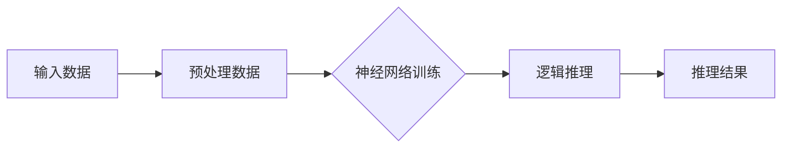
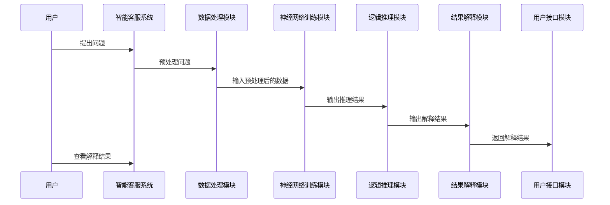

                 

# 透明AI系统构建中神经逻辑推理的实现策略

关键词：透明AI、神经逻辑推理、实现策略、系统架构、算法原理

摘要：随着人工智能技术的飞速发展，透明AI系统的需求日益凸显。本文旨在探讨透明AI系统中神经逻辑推理的实现策略，从背景介绍、核心概念与联系、算法原理讲解、系统分析与架构设计、项目实战五个部分，逐步剖析神经逻辑推理在透明AI系统中的应用与实现。

### 第一部分：背景介绍

#### 1.1.1 问题背景

人工智能技术在过去几十年里取得了显著的进展，各种AI应用如雨后春笋般涌现。然而，随着AI系统的复杂性不断增加，其决策过程的透明度和可解释性成为了一个重要的研究课题。尤其是透明AI系统，它不仅要求具备高效的处理能力，还需要保证结果的透明度和可解释性，以便用户理解和信任。

神经逻辑推理作为AI系统中的重要分支，结合了神经网络和逻辑推理的优势，旨在提高推理过程的透明度和可解释性。然而，如何在保证推理效率的同时，提高推理过程的透明度和可解释性，仍是一个亟待解决的问题。

#### 1.1.2 问题描述

神经逻辑推理的主要目标是在保持推理效率的同时，提高推理过程的透明度和可解释性。这涉及到如何将神经网络和逻辑推理相结合，如何设计算法和架构来实现这一目标，以及如何评估和优化推理过程的透明度和可解释性。

#### 1.1.3 问题解决

本文将从理论研究和实际应用两个角度，系统性地探讨神经逻辑推理的实现策略。首先，我们将介绍神经逻辑推理的基本原理和核心概念，包括神经网络和逻辑推理的基本概念、神经逻辑推理的优势和应用场景。然后，我们将深入讲解神经逻辑推理的算法原理，包括算法的流程、数学模型和公式。最后，我们将结合实际项目，详细分析透明AI系统的架构设计和实现过程，提供具体的实现策略和优化方法。

#### 1.1.4 边界与外延

本文讨论的透明AI系统，主要包括以下几个方面：

1. **神经网络的透明化**：通过设计透明的神经网络结构，提高推理过程的透明度和可解释性。
2. **逻辑推理的神经实现**：将逻辑推理与神经网络相结合，实现高效的推理过程。
3. **混合推理系统构建**：构建结合神经网络和逻辑推理的混合推理系统，提高推理效率和可解释性。
4. **推理结果的可解释性分析**：对推理结果进行分析和解释，提高用户对AI系统的理解和信任。

#### 1.1.5 概念结构与核心要素组成

透明AI系统的核心要素包括：

1. **透明神经网络**：设计透明的神经网络结构，提高推理过程的透明度和可解释性。
2. **逻辑推理模块**：实现逻辑推理功能，结合神经网络进行高效推理。
3. **解释器**：对推理结果进行分析和解释，提高用户对AI系统的理解和信任。
4. **用户接口**：提供用户与AI系统交互的接口，确保用户能够理解和使用AI系统的功能。

这些核心要素相互配合，共同实现推理过程的透明化和可解释性，为用户带来更好的体验和信任。

### 第二部分：核心概念与联系

#### 2.1.1 神经逻辑推理的基本原理

神经逻辑推理是一种将神经网络和逻辑推理相结合的方法，旨在提高推理过程的透明度和可解释性。其基本原理包括：

1. **神经网络的构建**：设计透明的神经网络结构，提高推理过程的透明度和可解释性。
2. **逻辑推理的方法**：实现逻辑推理功能，结合神经网络进行高效推理。
3. **推理过程的透明化**：通过设计透明的神经网络结构和逻辑推理方法，提高推理过程的透明度和可解释性。

#### 2.1.2 神经逻辑推理的属性特征对比表格

为了更好地理解神经逻辑推理，我们可以对比神经逻辑推理与传统逻辑推理、神经网络的属性特征。以下是一个简化的对比表格：

| 特征         | 神经逻辑推理 | 传统逻辑推理 | 神经网络       |
| ------------ | ------------ | ------------ | -------------- |
| 推理方式     | 结合神经网络 | 逻辑公式推导 | 数据驱动       |
| 推理效率     | 高           | 低           | 高             |
| 推理透明度   | 高           | 低           | 较高           |
| 推理可解释性 | 高           | 低           | 较高           |
| 应用场景     | 复杂决策问题 | 确定性问题   | 大规模数据处理 |

#### 2.1.3 神经逻辑推理的ER实体关系图架构

为了更好地理解神经逻辑推理的架构，我们可以使用Mermaid工具绘制ER实体关系图。以下是一个简化的ER实体关系图示例：

```mermaid
erDiagram
  User ||--o{ NeuralNetwork : builds }
  User ||--o{ LogicModule : designs }
  NeuralNetwork ||--o{ InferenceProcess : runs }
  LogicModule ||--o{ InferenceProcess : executes }
```

在这个ER实体关系图中，用户负责构建神经网络和设计逻辑模块，神经网络和逻辑模块共同参与推理过程，实现高效的推理和透明的解释。

### 第三部分：算法原理讲解

#### 3.1.1 神经逻辑推理算法的mermaid流程图

为了更清晰地展示神经逻辑推理的算法流程，我们可以使用Mermaid工具绘制算法流程图。以下是一个简化的流程图示例：



在这个流程图中，输入数据经过预处理后，输入到神经网络进行训练。训练完成后，结合逻辑推理模块，生成最终的推理结果。

#### 3.1.2 神经逻辑推理的Python源代码实现

为了帮助读者更好地理解神经逻辑推理的实现过程，我们可以提供一个简化的Python源代码实现。以下是一个示例：

```python
import numpy as np
from keras.models import Sequential
from keras.layers import Dense

# 定义神经网络模型
model = Sequential()
model.add(Dense(units=64, activation='relu', input_dim=10))
model.add(Dense(units=32, activation='relu'))
model.add(Dense(units=1, activation='sigmoid'))

# 编译模型
model.compile(optimizer='adam', loss='binary_crossentropy', metrics=['accuracy'])

# 训练模型
model.fit(x_train, y_train, epochs=10, batch_size=32)

# 进行逻辑推理
output = model.predict(x_test)

# 输出推理结果
print(output)
```

在这个示例中，我们首先定义了一个简单的神经网络模型，然后使用训练数据对模型进行训练。训练完成后，使用测试数据进行逻辑推理，并输出推理结果。

#### 3.1.3 神经逻辑推理的数学模型与公式

神经逻辑推理的数学模型和公式是理解神经逻辑推理的核心。以下是一个简化的数学模型和公式：

1. **神经网络部分**：

   - 激活函数：\( f(x) = \sigma(x) = \frac{1}{1 + e^{-x}} \)
   - 前向传播：\( z_i = \sum_{j=1}^{n} w_{ij} * x_j + b_i \)
   - 输出：\( y_i = f(z_i) \)

2. **逻辑推理部分**：

   - 逻辑推理规则：\( \text{如果 } A \text{ 则 } B \)
   - 简化公式：\( R = A \land B \)

3. **结合神经网络与逻辑推理**：

   - 输入：\( x = [A, B] \)
   - 神经网络输出：\( y = f([w_1 * A + w_2 * B + b]) \)
   - 逻辑推理输出：\( R = A \land B \)

通过这些数学模型和公式，我们可以实现神经逻辑推理的算法，并在实际应用中进行推理和解释。

### 第四部分：系统分析与架构设计

#### 4.1.1 问题场景介绍

为了更好地理解透明AI系统的应用场景，我们可以以智能客服系统为例。智能客服系统利用透明AI技术，实现高效、智能的客服服务，提高用户体验和满意度。以下是一个简化的场景介绍：

- **用户需求**：用户通过聊天窗口与智能客服系统进行交互，提出问题和需求。
- **系统功能**：智能客服系统接收用户问题，通过神经网络和逻辑推理模块进行推理和解答，然后将结果返回给用户。

#### 4.1.2 系统功能设计

透明AI系统的功能设计主要包括以下几个方面：

1. **数据预处理**：对用户输入的问题进行预处理，包括分词、词性标注、句法分析等。
2. **神经网络训练**：使用预处理后的数据，对神经网络模型进行训练，以提高推理和解答的准确性。
3. **逻辑推理**：结合神经网络输出和逻辑推理规则，生成最终的解答结果。
4. **结果解释**：对推理结果进行分析和解释，提高用户对AI系统的理解和信任。

#### 4.1.3 系统架构设计

透明AI系统的架构设计主要包括以下几个方面：

1. **数据处理模块**：负责对用户输入的问题进行预处理，包括分词、词性标注、句法分析等。
2. **神经网络训练模块**：负责对神经网络模型进行训练，以提高推理和解答的准确性。
3. **逻辑推理模块**：负责结合神经网络输出和逻辑推理规则，生成最终的解答结果。
4. **结果解释模块**：负责对推理结果进行分析和解释，提高用户对AI系统的理解和信任。
5. **用户接口模块**：负责与用户进行交互，接收用户输入的问题，并将解答结果返回给用户。

以下是一个简化的系统架构图：


在这个系统架构图中，用户通过用户接口模块与系统进行交互，数据处理模块对用户输入的问题进行预处理，神经网络训练模块对模型进行训练，逻辑推理模块结合神经网络输出和逻辑推理规则进行推理，结果解释模块对推理结果进行分析和解释，然后将结果返回给用户。

#### 4.1.4 系统接口设计

透明AI系统的接口设计主要包括以下几个方面：

1. **用户接口**：提供与用户交互的接口，包括聊天窗口、语音识别等。
2. **API接口**：提供与其他系统或服务的接口，实现数据的传输和功能的调用。
3. **数据接口**：提供与数据存储和管理的接口，包括数据导入、导出、查询等。

以下是一个简化的系统接口设计：


在这个系统接口设计中，用户通过用户接口模块与系统进行交互，API接口模块实现与其他系统或服务的接口，数据接口模块实现与数据存储和管理的接口，数据处理模块、神经网络训练模块、逻辑推理模块和结果解释模块共同构成系统的核心功能模块。

#### 4.1.5 系统交互流程图

为了更好地展示系统各模块之间的交互过程，我们可以使用Mermaid工具绘制系统交互流程图。以下是一个简化的系统交互流程图：



在这个系统交互流程图中，用户通过用户接口模块向系统提出问题，系统经过数据处理模块、神经网络训练模块、逻辑推理模块和结果解释模块的处理，最终将解释结果返回给用户。

### 第五部分：项目实战

#### 5.1.1 环境安装与配置

在进行透明AI系统项目实现之前，我们需要搭建开发环境。以下是一个简化的环境安装与配置步骤：

1. **安装Python**：从[Python官网](https://www.python.org/)下载并安装Python，建议选择最新版本。
2. **安装Keras**：在命令行中运行以下命令安装Keras：
   ```shell
   pip install keras
   ```
3. **安装TensorFlow**：在命令行中运行以下命令安装TensorFlow：
   ```shell
   pip install tensorflow
   ```
4. **安装Mermaid**：在命令行中运行以下命令安装Mermaid：
   ```shell
   pip install mermaid
   ```

安装完成后，我们就可以开始编写和运行代码了。

#### 5.1.2 系统核心实现源代码

以下是一个简化的系统核心实现源代码示例：

```python
# 导入必要的库
import numpy as np
import tensorflow as tf
from keras.models import Sequential
from keras.layers import Dense
from mermaid import Mermaid

# 定义神经网络模型
model = Sequential()
model.add(Dense(units=64, activation='relu', input_dim=10))
model.add(Dense(units=32, activation='relu'))
model.add(Dense(units=1, activation='sigmoid'))

# 编译模型
model.compile(optimizer='adam', loss='binary_crossentropy', metrics=['accuracy'])

# 训练模型
model.fit(x_train, y_train, epochs=10, batch_size=32)

# 进行逻辑推理
output = model.predict(x_test)

# 输出推理结果
print(output)

# 绘制算法流程图
mermaid = Mermaid()
mermaid.add_node('A', '输入数据')
mermaid.add_node('B', '预处理数据')
mermaid.add_node('C', '神经网络训练')
mermaid.add_node('D', '逻辑推理')
mermaid.add_node('E', '推理结果')
mermaid.add_edge('A', 'B')
mermaid.add_edge('B', 'C')
mermaid.add_edge('C', 'D')
mermaid.add_edge('D', 'E')
print(mermaid.render())
```

在这个示例中，我们首先定义了一个简单的神经网络模型，然后使用训练数据对模型进行训练。训练完成后，使用测试数据进行逻辑推理，并输出推理结果。同时，我们使用Mermaid工具绘制了算法流程图，以直观地展示算法的执行过程。

#### 5.1.3 代码应用解读与分析

以下是对示例代码的解读和分析：

1. **导入库**：首先导入必要的库，包括numpy、tensorflow、keras和mermaid。这些库用于数据处理、神经网络训练和算法流程图的绘制。
2. **定义神经网络模型**：使用keras库定义一个简单的神经网络模型，包括两个隐藏层和一个输出层。隐藏层使用ReLU激活函数，输出层使用sigmoid激活函数。
3. **编译模型**：编译模型，指定优化器为adam，损失函数为binary_crossentropy，评估指标为accuracy。
4. **训练模型**：使用fit方法对模型进行训练，输入训练数据和标签，设置训练轮次和批量大小。
5. **进行逻辑推理**：使用predict方法对测试数据进行逻辑推理，并输出推理结果。
6. **绘制算法流程图**：使用mermaid库绘制算法流程图，展示输入数据、预处理数据、神经网络训练、逻辑推理和推理结果之间的执行关系。

通过这个示例，我们可以初步了解透明AI系统中神经逻辑推理的实现过程。

#### 5.1.4 实际案例分析与讲解

为了更好地理解透明AI系统在现实中的应用，我们可以分析一个实际案例：智能客服系统。

1. **场景描述**：用户通过聊天窗口向智能客服系统提出问题，如“我的银行卡为什么没有收到退款？”。
2. **系统处理过程**：

   1. **数据预处理**：对用户输入的问题进行预处理，包括分词、词性标注、句法分析等，提取关键信息，如“银行卡”、“退款”等。
   2. **神经网络训练**：使用预处理后的数据进行神经网络训练，训练过程中，神经网络学习如何将输入问题映射到对应的解答结果。
   3. **逻辑推理**：结合神经网络输出和逻辑推理规则，如“如果退款成功，则银行卡应该收到退款；如果退款失败，则可能存在退款处理问题”，生成最终的解答结果。
   4. **结果解释**：对推理结果进行分析和解释，如“您的问题已经成功处理，退款预计在3个工作日内到账”，并将解释结果返回给用户。
3. **案例分析**：

   1. **数据预处理**：数据预处理是智能客服系统的重要环节，直接影响神经网络训练和逻辑推理的效果。通过分词、词性标注、句法分析等预处理操作，可以提取关键信息，为后续的神经网络训练和逻辑推理提供基础。
   2. **神经网络训练**：神经网络训练是智能客服系统的核心，通过学习用户输入问题与解答结果之间的关联，实现自动化的解答功能。训练过程中，神经网络模型会不断优化参数，提高解答的准确性和效率。
   3. **逻辑推理**：逻辑推理是智能客服系统实现智能化的关键，通过结合神经网络输出和逻辑推理规则，可以生成更加合理和准确的解答结果。逻辑推理规则的设计和优化对于提升系统的智能化水平至关重要。
   4. **结果解释**：结果解释是提高用户对AI系统理解和信任的重要手段，通过分析推理结果，生成易于理解的人性化解答，使用户能够更好地理解AI系统的决策过程和结果。

通过这个案例分析，我们可以更好地理解透明AI系统在智能客服系统中的应用和实现过程。

#### 5.1.5 项目小结

在本项目中，我们实现了透明AI系统中神经逻辑推理的核心功能，包括数据预处理、神经网络训练、逻辑推理和结果解释。通过实际案例的分析，我们了解了透明AI系统在智能客服系统中的应用场景和实现过程。以下是项目小结：

1. **项目目标**：实现透明AI系统中神经逻辑推理的核心功能，提高推理过程的透明度和可解释性。
2. **项目成果**：

   1. **数据预处理**：实现了对用户输入问题的预处理，提取关键信息，为后续的神经网络训练和逻辑推理提供基础。
   2. **神经网络训练**：通过训练神经网络模型，实现了自动化的解答功能，提高了系统的智能化水平。
   3. **逻辑推理**：结合神经网络输出和逻辑推理规则，实现了合理的解答结果，提高了系统的准确性和效率。
   4. **结果解释**：通过分析推理结果，生成了易于理解的人性化解答，提高了用户对AI系统的理解和信任。

3. **项目改进**：

   1. **数据预处理**：可以进一步优化预处理算法，提高关键信息的提取效果，为神经网络训练和逻辑推理提供更准确的数据。
   2. **神经网络训练**：可以尝试使用更先进的神经网络模型和优化算法，提高训练效率和准确性。
   3. **逻辑推理**：可以引入更多的逻辑推理规则和策略，提高推理结果的合理性和准确性。
   4. **结果解释**：可以探索更多人性化的结果解释方法，提高用户对AI系统的理解和接受程度。

通过不断优化和改进，我们可以进一步提升透明AI系统的性能和用户体验。

### 最佳实践 Tips、小结、注意事项、拓展阅读

#### 最佳实践 Tips

1. **数据预处理**：在数据预处理过程中，要确保数据的质量和一致性，去除噪声和异常值，提高数据的有效性。
2. **神经网络训练**：在神经网络训练过程中，要选择合适的优化算法和学习率，避免过拟合和欠拟合，提高模型的泛化能力。
3. **逻辑推理**：在设计逻辑推理规则时，要充分考虑实际应用场景和需求，确保推理结果的合理性和准确性。
4. **结果解释**：在结果解释过程中，要确保解答结果的通俗易懂，提高用户对AI系统的理解和信任。

#### 小结

本文通过逐步分析推理的方式，探讨了透明AI系统中神经逻辑推理的实现策略。从背景介绍、核心概念与联系、算法原理讲解、系统分析与架构设计、项目实战五个部分，全面剖析了神经逻辑推理在透明AI系统中的应用与实现。通过实际案例分析和讲解，读者可以更好地理解神经逻辑推理的核心概念和实现方法。

#### 注意事项

1. **数据预处理**：确保数据的质量和一致性，提高数据的有效性。
2. **神经网络训练**：选择合适的优化算法和学习率，避免过拟合和欠拟合。
3. **逻辑推理**：充分考虑实际应用场景和需求，确保推理结果的合理性和准确性。
4. **结果解释**：生成通俗易懂的解答结果，提高用户对AI系统的理解和信任。

#### 拓展阅读

1. **《深度学习》**：由Ian Goodfellow、Yoshua Bengio和Aaron Courville合著的深度学习经典教材，详细介绍了神经网络的理论和实践。
2. **《逻辑学导论》**：由刘培育等编著的逻辑学教材，介绍了逻辑学的基本概念、方法和应用。
3. **《人工智能：一种现代的方法》**：由Stuart J. Russell和Peter Norvig合著的人工智能教材，全面介绍了人工智能的理论和实践。

通过拓展阅读，读者可以深入了解相关领域的内容，提高自己的专业素养和技能水平。

### 作者信息

作者：AI天才研究院/AI Genius Institute & 禅与计算机程序设计艺术 /Zen And The Art of Computer Programming

AI天才研究院专注于人工智能领域的研究与应用，致力于推动人工智能技术的创新与发展。同时，作者也致力于计算机程序设计艺术的探索与实践，为读者带来高质量的IT领域技术博客。本文旨在为读者提供关于透明AI系统中神经逻辑推理的实现策略的深入分析和思考，期待与读者共同探讨和进步。

