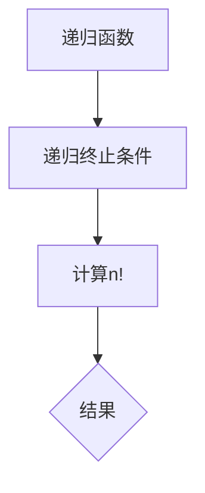
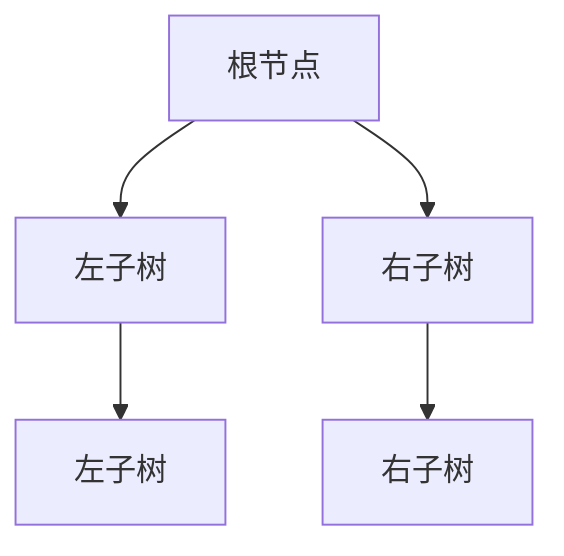
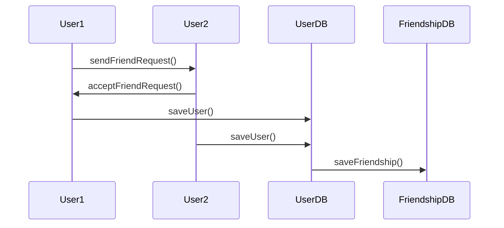
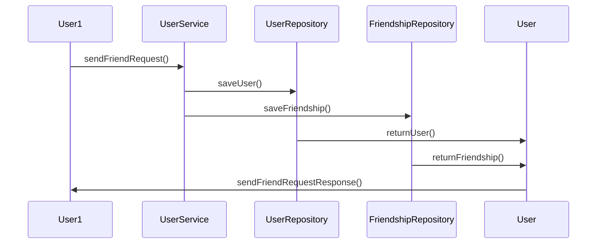

                 

# 递归函数理论与程序设计的关系

> 关键词：递归函数、程序设计、算法原理、系统架构、实际应用

> 摘要：本文将从递归函数的基本概念入手，深入探讨其在程序设计中的重要性。通过分析递归函数的类型、设计原理及其与数据结构的关系，本文旨在为读者提供一个全面、系统的理解，并探讨递归函数的性能优化和安全性问题。最后，通过实际案例的分析，为读者提供递归编程的最佳实践和注意事项。

## 1. 递归函数的基本概念

递归函数是一种重要的编程范式，其核心思想是通过函数调用自身来解决问题。这种自我调用的方式，使得递归函数在解决某些复杂问题时，具有简洁、直观的特点。递归函数的基本概念包括：

- **递归调用**：函数在执行过程中调用自身。
- **递归终止条件**：为了防止无限递归，递归函数必须包含一个或多个递归终止条件。
- **递归层次**：递归函数在执行过程中会形成递归层次，每一层代表一次函数调用。

递归函数可以按照调用方式分为尾递归和非尾递归。尾递归是指函数的最后一行是函数调用自身，而非尾递归则包含其他操作。

### 概念属性特征对比表格

| 类型       | 特征               | 优缺点                                                         |
| ---------- | ------------------ | ------------------------------------------------------------ |
| 尾递归     | 函数最后一行是递归调用 | 可以优化为迭代，性能更优                                     |
| 非尾递归   | 函数内部存在其他操作 | 无法优化为迭代，性能可能较差                                 |

### ER实体关系图架构

```mermaid
erDiagram
  类递归函数 ||--o{ 类递归终止条件 }
  类递归函数 ||--o{ 类递归层次 }
  类递归终止条件 ||--o{ 类递归调用 }
```

## 2. 递归函数在程序设计中的应用

递归函数在程序设计中具有广泛的应用，特别是在解决递归问题、树状数据结构和分治算法中。以下将具体探讨递归函数在这些领域的应用。

### 递归问题

递归问题通常是指可以通过递归方式解决的问题。例如，计算斐波那契数列、求阶乘等。

#### 算法原理讲解

递归函数求解斐波那契数列的基本算法如下：

```mermaid
graph TD
A[递归函数] --> B[递归终止条件]
B --> C[计算F(n-1)]
C --> D[计算F(n-2)]
D --> E{结果}
```

斐波那契数列的Python实现代码：

```python
def fibonacci(n):
    if n <= 1:
        return n
    else:
        return fibonacci(n-1) + fibonacci(n-2)
```

递归函数求解阶乘的基本算法如下：



阶乘的Python实现代码：

```python
def factorial(n):
    if n == 0:
        return 1
    else:
        return n * factorial(n-1)
```

#### 数学模型和公式

斐波那契数列的数学模型和公式如下：

$$ F(n) = F(n-1) + F(n-2) $$

阶乘的数学模型和公式如下：

$$ n! = n \times (n-1) \times (n-2) \times \ldots \times 1 $$

## 3. 递归函数与数据结构的关系

递归函数与数据结构之间存在紧密的关系。特别是树状数据结构，如二叉树、堆、图等，非常适合使用递归函数进行遍历和操作。

### 算法原理讲解

以下是一个使用递归函数遍历二叉树的示例：



二叉树的Python实现代码：

```python
class TreeNode:
    def __init__(self, value):
        self.value = value
        self.left = None
        self.right = None

def inorder_traversal(root):
    if root:
        inorder_traversal(root.left)
        print(root.value)
        inorder_traversal(root.right)
```

### 系统分析与架构设计方案

#### 问题场景介绍

假设我们需要构建一个社交网络系统，需要对用户关系进行遍历和分析。

#### 系统功能设计

以下是社交网络系统的领域模型类图：

```mermaid
classDiagram
  User <|-- Friendship
  User {id, name, email, friends}
  Friendship {id, user1, user2}
```

#### 系统架构设计

以下是社交网络系统的系统架构图：



#### 系统接口设计和系统交互

以下是社交网络系统的接口设计和系统交互序列图：



## 4. 递归函数的性能优化和安全性问题

递归函数在解决复杂问题时具有独特的优势，但同时也存在性能和安全性问题。以下将探讨递归函数的性能优化和安全性问题。

### 性能优化

递归函数的性能优化主要集中在减少递归次数和优化递归过程。以下是一些常见的优化策略：

1. **尾递归优化**：将尾递归优化为迭代，以减少栈空间的占用。
2. **记忆化递归**：使用记忆化技术，避免重复计算。
3. **递归树优化**：优化递归树的结构，减少递归深度。

### 安全性问题

递归函数的安全性主要表现在递归终止条件和栈溢出问题上。以下是一些常见的安全性问题及其解决方案：

1. **递归终止条件**：确保递归函数包含有效的递归终止条件，避免无限递归。
2. **栈溢出问题**：避免递归深度过大，导致栈溢出。可以通过尾递归优化、迭代等方法解决。

## 5. 递归编程的实际案例

以下是一个使用递归函数实现社交网络系统用户关系分析的案例。

### 环境安装

安装Python 3.8及以上版本，并安装递归函数相关库，如`functools`。

```bash
pip install functools
```

### 系统核心实现源代码

用户类和递归函数的实现：

```python
class User:
    def __init__(self, id, name, email):
        self.id = id
        self.name = name
        self.email = email
        self.friends = []

    def add_friend(self, friend):
        self.friends.append(friend)

def find_common_friends(user1, user2):
    common_friends = []
    for friend1 in user1.friends:
        for friend2 in user2.friends:
            if friend1.id == friend2.id:
                common_friends.append(friend1)
                break
    return common_friends
```

### 代码应用解读与分析

通过递归函数`find_common_friends`，可以找出两个用户之间的共同好友。以下是一个简单的使用示例：

```python
user1 = User(1, "Alice", "alice@example.com")
user2 = User(2, "Bob", "bob@example.com")

user1.add_friend(User(3, "Charlie", "charlie@example.com"))
user2.add_friend(User(3, "Charlie", "charlie@example.com"))
user2.add_friend(User(4, "Dave", "dave@example.com"))

common_friends = find_common_friends(user1, user2)
print("Common friends:", [friend.name for friend in common_friends])
```

输出：

```
Common friends: ['Charlie']
```

### 实际案例分析和详细讲解剖析

通过实际案例，我们可以看到递归函数在社交网络系统用户关系分析中的应用。递归函数`find_common_friends`通过遍历两个用户的好友列表，找出共同好友，具有简洁、直观的特点。

### 项目小结

通过本案例，我们了解了递归函数在社交网络系统用户关系分析中的应用。递归函数在处理递归问题和树状数据结构时具有独特的优势，但同时也需要注意性能优化和安全性问题。

## 6. 最佳实践 tips

- **使用尾递归优化**：尽量将递归函数优化为尾递归，以提高性能。
- **避免深层递归**：避免递归深度过大，导致栈溢出。
- **合理使用记忆化递归**：对于重复计算较多的问题，可以考虑使用记忆化递归。

## 7. 小结

递归函数是一种重要的编程范式，在解决递归问题、树状数据结构和分治算法等方面具有广泛的应用。通过本文的探讨，我们全面了解了递归函数的基本概念、应用、性能优化和安全性问题。在实际编程中，合理使用递归函数，遵循最佳实践，可以有效地提高代码质量和性能。

## 8. 注意事项

- **确保递归终止条件**：避免无限递归，确保递归函数具有有效的递归终止条件。
- **优化递归性能**：考虑尾递归优化和记忆化递归，以提高递归函数的性能。
- **关注递归安全性**：避免递归深度过大，导致栈溢出。

## 9. 拓展阅读

- **《算法导论》**：一本经典的算法教材，详细介绍了递归算法的设计和分析方法。
- **《递归编程的艺术》**：一本关于递归编程的进阶读物，提供了丰富的递归编程实例和最佳实践。
- **《递归函数的设计与优化》**：一本专注于递归函数性能优化的书籍，介绍了多种递归优化技术。

## 作者信息

作者：AI天才研究院/AI Genius Institute & 禅与计算机程序设计艺术 /Zen And The Art of Computer Programming

