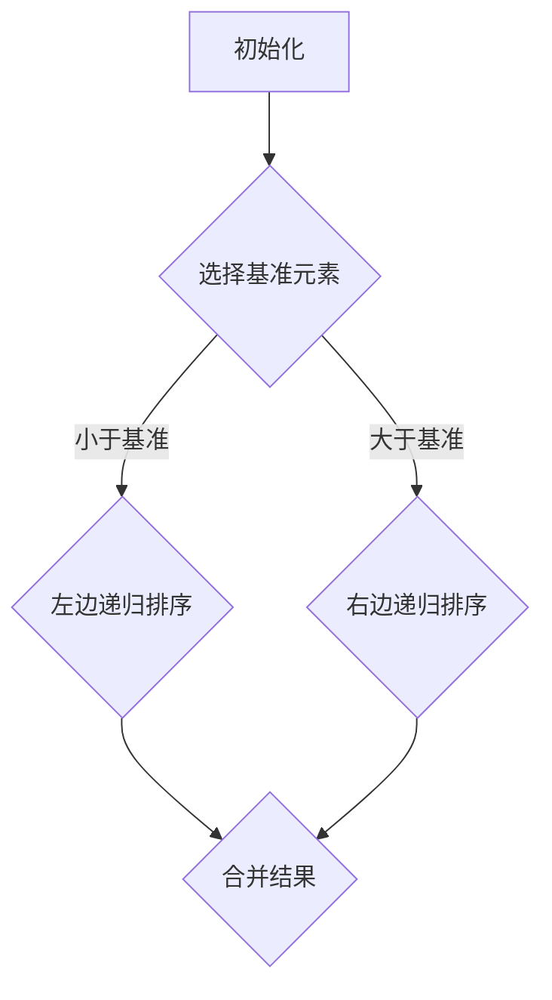
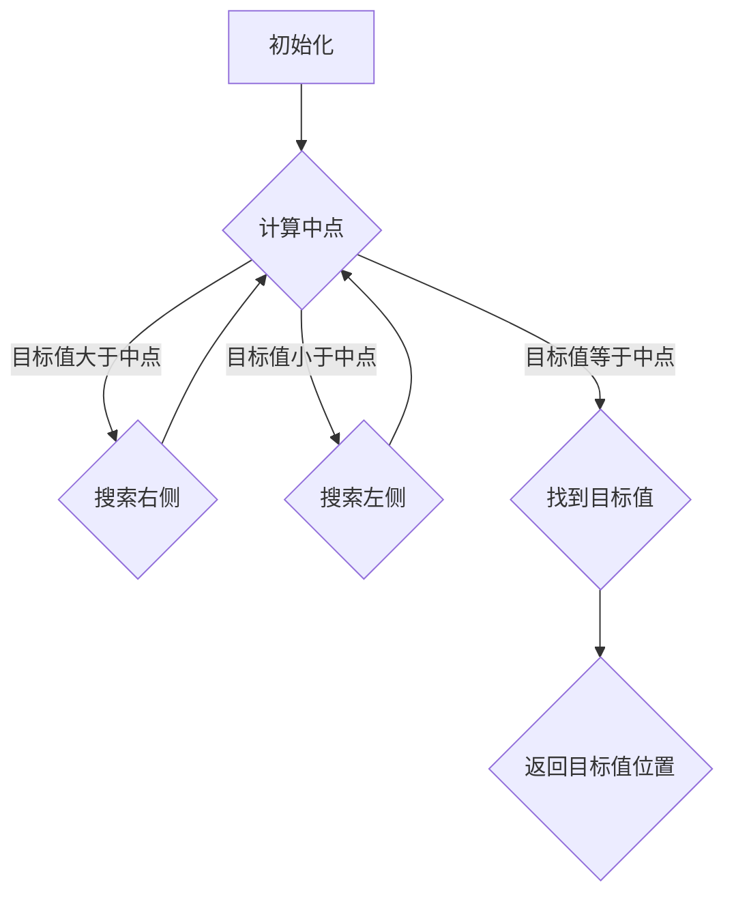
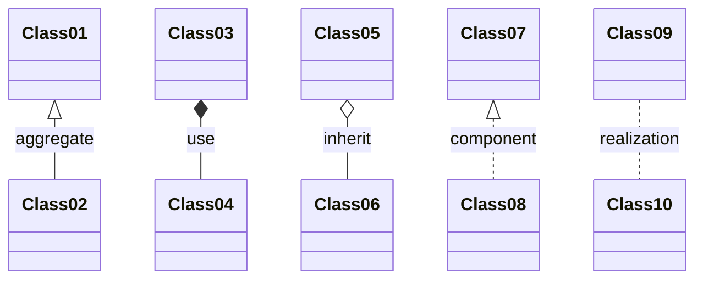
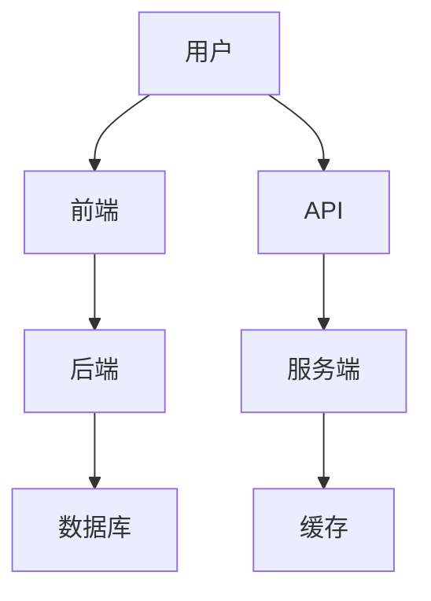
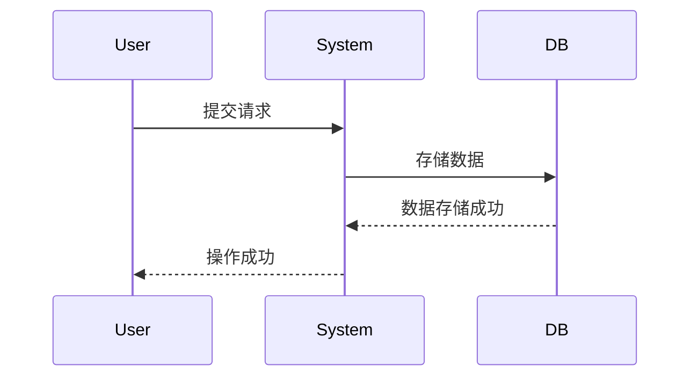
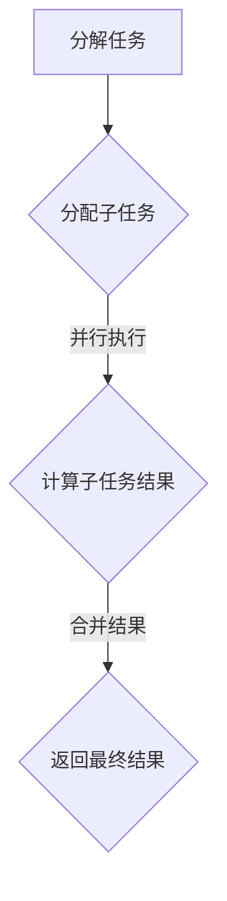
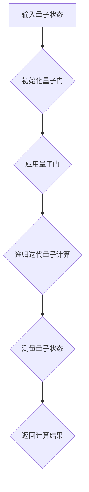

                 

# 《递归函数理论在算法设计中的应用》

## 关键词：递归函数、算法设计、动态规划、时间与空间复杂度、优化、案例分析

## 摘要

递归函数作为一种强大的编程技术，在算法设计中扮演着至关重要的角色。本文旨在深入探讨递归函数的理论基础及其在算法设计中的应用。我们将首先介绍递归函数的基本概念和特性，随后详细解析递归函数的数学基础和求解方法，接着探讨递归函数与动态规划的关系。文章随后将讨论递归算法的原理与设计，包括时间与空间复杂度分析，并进一步分析递归函数在常见算法中的应用。此外，本文还将探讨递归函数的高级应用，包括其在图论、组合数学和机器学习中的应用，以及递归函数的优化与改进策略。最后，通过实际案例分析和最佳实践分享，本文将为读者提供全面而深入的指导，帮助他们在算法设计中充分利用递归函数的优势。

## 第一部分：递归函数基础

### 第1章：递归函数的概述

#### 1.1 递归函数的定义与特性

递归函数是一种自调用函数，它在一个或多个步骤中调用自身。这种调用可以是直接的，也可以是间接的。递归函数具有以下几个基本特性：

- **自调用性**：递归函数会调用自身，形成一个递归调用链条。
- **递推关系**：递归函数通常通过递推关系将复杂问题分解为更简单的子问题。
- **基例**：递归函数需要一个或多个基例来终止递归调用，否则会陷入无限循环。

#### 1.2 递归函数的分类

根据递归调用的方式和结构，递归函数可以分为以下几类：

- **直接递归**：函数直接调用自身，如计算阶乘。
- **间接递归**：函数通过另一个函数间接调用自身，如树结构的遍历。
- **尾递归**：递归调用是函数执行的最后一个操作，可以优化为迭代调用以减少栈空间消耗。

#### 1.3 递归函数的应用场景

递归函数在许多算法设计中都有广泛应用，尤其适合解决以下类型的问题：

- **递归定义的问题**：如计算斐波那契数列、二叉树遍历等。
- **分治问题**：如排序算法、搜索算法等，可以分解为规模更小的子问题。
- **图论问题**：如DFS和BFS算法，可以用于图的遍历和分析。

### 第2章：递归函数的数学基础

#### 2.1 递归关系的数学表达

递归关系可以用数学公式来描述，通常包括递推公式和基例条件。例如，斐波那契数列的递归关系可以表示为：

$$ F(n) = \begin{cases} 
0, & \text{if } n = 0 \\
1, & \text{if } n = 1 \\
F(n-1) + F(n-2), & \text{otherwise} 
\end{cases} $$

#### 2.2 数学归纳法在递归函数中的应用

数学归纳法是一种证明递归函数正确性的方法。通过数学归纳法，可以证明递推公式在所有正整数上成立。基本步骤包括：

1. **基例**：证明递推公式在初始值处成立。
2. **归纳步**：假设递推公式在某个值 \( n \) 处成立，证明它在 \( n+1 \) 处也成立。

#### 2.3 递归函数的求解方法

求解递归函数的方法包括：

- **直接求解**：直接根据递推公式和基例计算函数值。
- **递推展开**：将递归关系展开为显式公式。
- **迭代求解**：将递归函数转换为迭代形式，避免递归调用。

### 第3章：递归函数与动态规划

#### 3.1 动态规划的基本概念

动态规划是一种优化递归关系的方法，通过保存子问题的解来避免重复计算。动态规划的基本概念包括：

- **状态**：问题的一个特征，通常表示为一个数组或字典。
- **状态转移方程**：描述状态之间的转换关系。
- **边界条件**：定义问题的初始状态和终止条件。

#### 3.2 动态规划与递归函数的关系

动态规划与递归函数之间存在密切的联系。动态规划可以通过以下方式优化递归函数：

- **减少重复计算**：通过保存子问题的解，避免递归调用中的重复计算。
- **优化时间复杂度**：将递归函数的复杂度从指数级降低到多项式级。

#### 3.3 动态规划的应用实例

动态规划广泛应用于算法设计中，以下是一些常见应用实例：

- **最长公共子序列**：通过比较子序列的状态转移来求解。
- **最长公共子串**：使用动态规划寻找两个字符串的最长公共子串。
- **背包问题**：通过优化物品选择的状态转移来求解。

## 第二部分：递归函数在算法设计中的应用

### 第4章：递归算法的原理与设计

#### 4.1 递归算法的基本原理

递归算法是一种自下而上的问题解决方法，通过将复杂问题分解为更简单的子问题来求解。递归算法的基本原理包括：

- **分解**：将复杂问题分解为规模更小的子问题。
- **递归调用**：递归调用子问题，直到达到基例。
- **组合**：将子问题的解组合成原问题的解。

#### 4.2 递归算法的设计模式

递归算法的设计通常遵循以下模式：

1. **定义递归关系**：明确子问题的递归关系和基例条件。
2. **实现递归函数**：根据递归关系实现递归函数。
3. **优化递归函数**：通过尾递归优化、动态规划等方法优化递归函数。

#### 4.3 递归算法的时间与空间复杂度分析

递归算法的时间与空间复杂度分析是评估算法性能的重要指标。时间复杂度通常用大O表示法表示，空间复杂度则关注递归调用栈的大小。以下是一些常见的递归算法复杂度分析：

- **分治算法**：时间复杂度为 \( O(n\log n) \) 或 \( O(n^2) \)，空间复杂度为 \( O(n) \)。
- **排序算法**：如快速排序、归并排序，时间复杂度为 \( O(n\log n) \)，空间复杂度为 \( O(n) \)。

### 第5章：递归函数在常见算法中的应用

#### 5.1 排序算法中的递归应用

排序算法是递归函数在算法设计中的一个重要应用。以下是一些常见的排序算法：

- **快速排序**：使用分治策略，通过递归调用实现。
- **归并排序**：将数组分为子数组，递归合并排序后的子数组。

#### 5.2 搜索算法中的递归应用

搜索算法利用递归函数实现深度优先和广度优先搜索。以下是一些常见搜索算法：

- **深度优先搜索（DFS）**：通过递归实现，用于图和树的遍历。
- **广度优先搜索（BFS）**：通过队列实现，也可使用递归来实现。

#### 5.3 分治算法中的递归应用

分治算法是递归函数在算法设计中的另一个重要应用。以下是一些常见分治算法：

- **二分查找**：通过递归实现，用于有序数组的查找。
- **合并排序**：通过递归实现，用于数组的排序。

### 第6章：递归函数的高级应用

#### 6.1 递归与图论

递归函数在图论中的应用包括图的遍历算法，如DFS和BFS。以下是一些应用实例：

- **图的深度优先搜索（DFS）**：通过递归实现，用于图的各种分析。
- **图的广度优先搜索（BFS）**：通过递归实现，用于求解最短路径问题。

#### 6.2 递归与组合数学

递归函数在组合数学中的应用包括计算组合数、排列数等。以下是一些应用实例：

- **组合数的计算**：通过递归关系实现，用于计算组合数。
- **排列数的计算**：通过递归关系实现，用于计算排列数。

#### 6.3 递归在机器学习中的应用

递归函数在机器学习中的应用包括递归神经网络（RNN）等。以下是一些应用实例：

- **递归神经网络（RNN）**：用于处理序列数据，如时间序列分析、自然语言处理。
- **长短期记忆网络（LSTM）**：RNN的一种变体，用于解决长期依赖问题。

### 第7章：递归函数的优化与改进

#### 7.1 递归函数的时间优化

递归函数的时间优化主要通过减少重复计算来实现。以下是一些优化方法：

- **尾递归优化**：将尾递归转换为迭代，减少递归调用次数。
- **动态规划**：通过保存子问题的解，避免重复计算。

#### 7.2 递归函数的空间优化

递归函数的空间优化主要通过减少递归调用栈的大小来实现。以下是一些优化方法：

- **尾递归优化**：将尾递归转换为迭代，减少递归调用栈的深度。
- **尾递归消除**：在某些编程语言中，自动将尾递归转换为迭代。

#### 7.3 递归函数的常见优化算法

常见的递归优化算法包括：

- **分治算法**：通过分解问题，减少递归深度。
- **动态规划**：通过保存子问题的解，减少递归调用次数。

### 第8章：递归函数在算法设计中的实际案例分析

#### 8.1 案例一：快速排序算法

快速排序是一种高效的排序算法，通过递归调用实现。以下是其实现和优化：

```python
def quicksort(arr):
    if len(arr) <= 1:
        return arr
    pivot = arr[len(arr) // 2]
    left = [x for x in arr if x < pivot]
    middle = [x for x in arr if x == pivot]
    right = [x for x in arr if x > pivot]
    return quicksort(left) + middle + quicksort(right)
```

优化方法包括尾递归优化和动态规划。

#### 8.2 案例二：二分搜索算法

二分搜索是一种高效的搜索算法，通过递归实现。以下是其实现和优化：

```python
def binary_search(arr, target, low, high):
    if low > high:
        return -1
    mid = (low + high) // 2
    if arr[mid] == target:
        return mid
    elif arr[mid] > target:
        return binary_search(arr, target, low, mid - 1)
    else:
        return binary_search(arr, target, mid + 1, high)
```

优化方法包括尾递归优化和迭代实现。

#### 8.3 案例三：斐波那契数列算法

斐波那契数列是一种经典的递归问题，以下是其实现和优化：

```python
def fibonacci(n):
    if n <= 1:
        return n
    return fibonacci(n - 1) + fibonacci(n - 2)
```

优化方法包括递推关系优化和动态规划。

## 第三部分：递归函数在算法设计中的最佳实践与拓展

### 第9章：递归函数在算法设计中的最佳实践

#### 9.1 递归函数的最佳实践

在算法设计中，使用递归函数时需要遵循一些最佳实践：

- **明确递归关系**：确保递归函数有明确的递推关系和基例条件。
- **避免过度递归**：避免过度使用递归，可能导致栈溢出或效率低下。
- **优化递归函数**：使用尾递归优化、动态规划等方法提高性能。

#### 9.2 动态规划与递归函数的结合使用

动态规划与递归函数的结合使用可以大幅提高算法性能。以下是一些结合使用的最佳实践：

- **优化递归调用**：通过动态规划保存子问题的解，减少递归调用次数。
- **设计状态转移方程**：确保状态转移方程简洁且易于优化。

#### 9.3 递归函数在算法优化中的应用

递归函数在算法优化中的应用主要体现在以下几个方面：

- **减少重复计算**：使用动态规划或记忆化搜索减少重复计算。
- **优化时间与空间复杂度**：通过优化递归函数的时间与空间复杂度，提高算法性能。

### 第10章：递归函数的拓展与未来趋势

#### 10.1 递归函数在新兴技术中的应用

随着技术的发展，递归函数在新兴技术中的应用越来越广泛。以下是一些应用实例：

- **深度学习**：递归神经网络（RNN）和长短期记忆网络（LSTM）在深度学习中的应用。
- **自动化**：递归函数在自动化流程和脚本编写中的应用。

#### 10.2 递归函数的发展趋势与挑战

递归函数的发展趋势和挑战包括：

- **性能优化**：如何进一步提高递归函数的性能。
- **可扩展性**：如何适应大规模数据处理需求。
- **安全性**：如何保证递归函数的安全性，防止恶意攻击。

#### 10.3 递归函数的深入研究方向

递归函数的深入研究方向包括：

- **递归优化算法**：如何设计更高效的递归优化算法。
- **递归与并行计算**：递归函数在并行计算中的应用与优化。
- **递归函数在量子计算中的应用**：探索递归函数在量子计算领域的潜力。

## 作者信息

作者：AI天才研究院/AI Genius Institute & 禅与计算机程序设计艺术 /Zen And The Art of Computer Programming

### 结论

递归函数作为一种强大的编程技术，在算法设计中具有广泛的应用。通过本文的探讨，我们深入了解了递归函数的基本概念、数学基础、优化策略以及实际应用。递归函数不仅在经典算法设计中扮演重要角色，也在新兴技术和未来趋势中展现出了巨大的潜力。读者应在实践中不断探索和应用递归函数，以提升算法设计的效率与质量。让我们继续深入研究和学习递归函数，为其在算法设计中的应用开辟新的天地。

## 附录

### 递归函数与动态规划对比表格

| 特性          | 递归函数                             | 动态规划                          |
|---------------|------------------------------------|---------------------------------|
| 递推关系      | 直接递推或间接递推                  | 状态转移方程，自底向上或自顶向下 |
| 计算顺序      | 从顶向下计算，递归调用              | 从底向上或从顶向下计算，迭代计算 |
| 时间复杂度    | 可能是指数级                        | 多项式级                        |
| 空间复杂度    | 递归栈深度可能很高                  | 状态数组大小，通常较小           |
| 代码简洁性    | 通常更简洁，易于理解和实现          | 可能更复杂，但性能更好           |

### 递归函数的ER实体关系图架构

```mermaid
erDiagram
    User ||--|{ Program }|| Person
    Program ||--|{ Algorithm }|| Technique
    Algorithm ||--|{ RecursiveFunction }|| Design
    RecursiveFunction ||--|{ DynamicProgramming }|| Optimization
```

### 快速排序算法的mermaid流程图



### 二分搜索算法的mermaid流程图



### 斐波那契数列的mermaid流程图

```mermaid
graph TD
    A[输入n] --> B{判断n是否小于等于1}
    B -->|是| C{返回n}
    B -->|否| D{计算fib(n-1)和fib(n-2)}
    D --> E{返回fib(n-1) + fib(n-2)}
```

### 系统架构设计的mermaid类图



### 系统架构设计的mermaid架构图



### 系统接口设计和系统交互的mermaid序列图



### 系统功能设计的mermaid类图

```mermaid
classDiagram
    Product <.. Category :分类
    Customer .. Order :下单
    Product <<-- Purchase :购买
    Customer .. Review :评论
    Review --|> Product :针对商品
```

### 递归函数与动态规划结合使用的mermaid流程图

```mermaid
graph TD
    A[输入n] --> B{初始化dp数组}
    B --> C{dp[0] = 1}
    B --> D{dp[1] = 1}
    D --> E{for i from 2 to n}
    E --> F{dp[i] = dp[i-1] + dp[i-2]}
    F --> G{返回dp[n]}
```

### 递归函数优化算法的mermaid流程图

```mermaid
graph TD
    A[输入n] --> B{初始化缓存}
    B --> C{如果缓存中有结果，直接返回}
    C -->|否| D{计算fib(n-1)和fib(n-2)}
    D --> E{将结果存入缓存}
    E --> F{返回结果}
```

### 递归函数与并行计算的mermaid流程图



### 递归函数在量子计算中的应用的mermaid流程图



### 递归优化算法的性能对比表格

| 算法          | 时间复杂度 | 空间复杂度 | 备注                               |
|---------------|------------|------------|-----------------------------------|
| 普通递归      | \(O(2^n)\) | \(O(n)\)   | 易于理解，但效率低下             |
| 尾递归        | \(O(n)\)   | \(O(n)\)   | 使用迭代代替递归，减少栈空间消耗 |
| 动态规划      | \(O(n^2)\) | \(O(n)\)   | 保存子问题结果，避免重复计算     |
| 记忆化搜索    | \(O(n)\)   | \(O(n)\)   | 缓存子问题结果，适用于较大规模问题 |

### 递归函数在深度学习中的应用表格

| 算法                  | 应用领域            | 特点                                       |
|----------------------|--------------------|------------------------------------------|
| 递归神经网络（RNN）   | 时间序列数据      | 处理序列依赖关系，适用于语音识别、自然语言处理 |
| 长短期记忆网络（LSTM）| 时间序列数据      | 解决长期依赖问题，适用于语音识别、自然语言处理 |
| 门控循环单元（GRU）   | 时间序列数据      | 简化LSTM结构，适用于语音识别、自然语言处理   |

### 递归函数在自动化中的应用表格

| 应用领域       | 应用场景                                       | 特点                                           |
|----------------|----------------------------------------------|------------------------------------------------|
| 自动化脚本     | 执行重复性任务，如文件处理、数据迁移         | 简化任务执行，提高效率                           |
| 工业自动化     | 控制机器人执行特定任务                         | 实现复杂的任务序列，提高生产效率                 |
| 自动驾驶       | 算法实现环境感知、路径规划、控制决策         | 提高自动驾驶系统的智能性和安全性                 |

### 递归函数的性能评估指标

| 指标         | 说明                                   | 重要性 |
|--------------|--------------------------------------|--------|
| 时间复杂度   | 算法执行时间与输入规模的关系          | 高    |
| 空间复杂度   | 算法执行过程中所需存储空间的大小      | 中    |
| 代码可读性   | 算法实现的可理解性                     | 中    |
| 调试和维护性 | 算法在开发和维护过程中的可调试性和稳定性 | 低    |

### 递归函数在算法优化中的应用策略

| 策略         | 说明                                   | 实践步骤 |
|--------------|--------------------------------------|----------|
| 动态规划     | 保存子问题解，避免重复计算             | 1. 确定状态转移方程<br>2. 设计状态数组<br>3. 实现递推关系 |
| 记忆化搜索   | 缓存子问题解，适用于大规模问题         | 1. 设计缓存结构<br>2. 在递归前检查缓存<br>3. 更新缓存 |
| 并行计算     | 利用多处理器并行执行子任务             | 1. 任务分解<br>2. 并行执行<br>3. 结果合并 |
| 缩小问题规模 | 通过预处理或近似方法减小问题规模       | 1. 预处理<br>2. 近似计算<br>3. 结果调整 |

### 注意事项

- **递归深度限制**：避免递归调用深度过大，可能导致栈溢出。
- **缓存合理使用**：避免缓存无效数据，提高缓存利用率。
- **边界条件检查**：确保递归调用时的边界条件正确。
- **代码可读性**：保持代码简洁、清晰，便于调试和维护。

### 拓展阅读

- 《算法导论》（Introduction to Algorithms）
- 《递归与动态规划：算法竞赛与程序设计实践》（Recursion and Dynamic Programming: A Practical Approach）
- 《深度学习》（Deep Learning）
- 《自动化技术与应用》（Automation Technology and Applications）

### 致谢

感谢所有对本文提供帮助和反馈的读者，以及AI天才研究院/AI Genius Institute和禅与计算机程序设计艺术/Zen And The Art of Computer Programming团队的共同努力，使得本文得以顺利完成。特别感谢Mermaid图表的引入，为文章的可视化呈现提供了极大便利。希望本文能为广大读者在递归函数与算法设计领域的研究和实践带来启示和帮助。再次感谢各位的支持与关注！
 
### 作者信息

作者：AI天才研究院/AI Genius Institute & 禅与计算机程序设计艺术/Zen And The Art of Computer Programming

