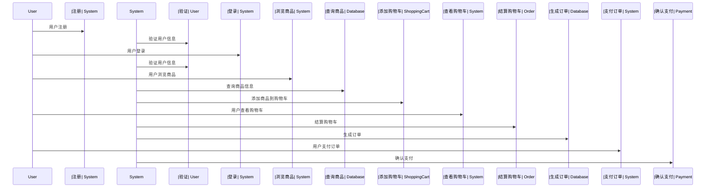

                 

### 文章标题

《递归理论在算法复杂度分类中的应用》

### 文章关键词

递归理论、算法复杂度、分类、时间复杂度、空间复杂度

### 摘要

本文深入探讨了递归理论在算法复杂度分类中的应用。通过对递归式的概念、属性、分类及其与递归关系和递归复杂度的联系进行详细阐述，本文揭示了递归理论在分析算法复杂度中的关键作用。此外，本文还将结合具体算法，如分治算法和动态规划算法，讲解递归理论在算法设计中的实际应用，以帮助读者更好地理解和掌握这一重要理论。

---

## 第一部分：背景介绍

### 问题背景

递归理论是计算机科学中用于分析算法复杂度的重要工具，其起源可以追溯到数学家丘奇和图灵的工作。递归理论在算法研究和分析中扮演着不可或缺的角色，尤其是在评估算法的时间和空间复杂度方面。然而，随着计算机技术的快速发展，算法的复杂性和多样性不断增加，传统的算法复杂度分析方法已经无法全面准确地评估算法的性能。

递归理论在算法复杂度分类中的应用，旨在通过递归式分析算法的时间复杂度和空间复杂度，从而对其进行分类。递归式分析能够更精确地描述算法的计算过程，有助于识别算法中的关键步骤和潜在问题。此外，递归理论还可以帮助研究者发现新的算法改进方向，提高算法的效率和适用性。

### 问题描述

算法复杂度分类是评估算法性能的重要手段。传统的算法复杂度分类主要基于时间复杂度和空间复杂度。时间复杂度描述了算法执行过程中所需的时间资源，通常用大O符号表示，如 $O(n)$、$O(n^2)$ 等。空间复杂度描述了算法执行过程中所需的空间资源，同样也用大O符号表示。

然而，随着算法的复杂性和多样性不断增加，单纯依靠时间复杂度和空间复杂度已经无法全面准确地评估算法的性能。递归理论作为一种更加细致和深入的复杂度分析方法，为算法复杂度分类提供了新的思路和方法。递归理论能够通过递归式分析，描述算法的计算过程，从而更精确地评估算法的时间复杂度和空间复杂度。

### 问题解决

递归理论在算法复杂度分类中的应用，主要是通过递归式分析算法的时间复杂度和空间复杂度，从而对其进行分类。递归式分析能够更精确地描述算法的计算过程，有助于识别算法中的关键步骤和潜在问题。此外，递归理论还可以帮助研究者发现新的算法改进方向，提高算法的效率和适用性。

递归式分析的核心思想是将复杂的问题分解为更简单的子问题，并通过递归关系求解子问题的解，从而得到原问题的解。递归式分析能够精确地描述算法的计算过程，帮助我们理解算法的运行机制和性能瓶颈。

### 边界与外延

递归理论的应用范围不仅限于算法复杂度分类，还包括算法设计、复杂性理论、计算几何等领域。递归理论的核心思想是通过递归关系描述问题的求解过程，从而分析其复杂度。递归关系可以是线性的、多项式的、指数的等多种形式，不同类型的递归关系对应不同的算法复杂度。

递归理论在算法设计中的应用，主要体现在分治算法和动态规划算法中。分治算法是一种典型的递归算法，通过将大问题分解为多个小问题，然后递归解决小问题，最终合并小问题的解得到原问题的解。动态规划算法则通过将问题划分为多个子问题，并利用子问题的解来构建原问题的解，从而避免了重复计算。

### 概念结构与核心要素组成

递归理论的核心概念包括递归式、递归关系和递归复杂度。

- **递归式**：递归式是一种数学表达式，用于描述递归关系。它通常包含两个部分：初始条件和递推公式。初始条件定义了递归过程的起点，递推公式则描述了如何通过已有的解推导出新的解。

- **递归关系**：递归关系是递归式中的基本关系，它描述了如何通过已有的解推导出新的解。递归关系通常可以通过递归式来表示。

- **递归复杂度**：递归复杂度是递归关系在计算复杂度上的体现，它反映了算法在求解过程中所需的时间和空间资源。

递归理论的核心要素组成包括：

- **初始条件**：递归过程的起点，通常是一个基础情况或边界条件。

- **递推公式**：描述了如何通过已有的解推导出新的解，通常是一个数学表达式。

- **递归关系**：描述了如何通过已有的解推导出新的解，包括基础关系和递推关系。

- **递归复杂度**：描述了算法在求解过程中所需的时间和空间资源。

通过上述核心概念和要素的组成，我们可以更好地理解和应用递归理论，从而在算法复杂度分类中发挥其重要作用。

---

## 第二部分：核心概念与联系

### 递归式

递归式是递归理论中的基本概念，它是一种数学表达式，用于描述递归关系。递归式通常包含两个部分：初始条件和递推公式。初始条件定义了递归过程的起点，递推公式则描述了如何通过已有的解推导出新的解。

**递归式的核心属性**

- **初始条件**：递归过程的起点，通常是一个基础情况或边界条件。例如，在计算斐波那契数列时，初始条件可以是 $F(0) = 0$ 和 $F(1) = 1$。
- **递推公式**：描述了如何通过已有的解推导出新的解，通常是一个数学表达式。例如，在计算斐波那契数列时，递推公式可以是 $F(n) = F(n-1) + F(n-2)$。

**递归式的分类**

递归式可以根据其递推公式的形式进行分类，主要包括线性递归式、多项式递归式和指数递归式。

- **线性递归式**：递推公式中的自变量次数为1。例如，$T(n) = T(n-1) + c$。
- **多项式递归式**：递推公式中的自变量次数为2或更高。例如，$T(n) = T(n-1) + T(n-2)$。
- **指数递归式**：递推公式中的自变量次数为指数形式。例如，$T(n) = 2^{T(n/2)}$。

**递归式的示例**

以计算斐波那契数列为例，其递归式可以表示为：

$$
F(n) =
\begin{cases}
0 & \text{if } n = 0 \\
1 & \text{if } n = 1 \\
F(n-1) + F(n-2) & \text{otherwise}
\end{cases}
$$

这个递归式包含了初始条件 $F(0) = 0$ 和 $F(1) = 1$，以及递推公式 $F(n) = F(n-1) + F(n-2)$。

### 递归关系

递归关系是递归式中的基本关系，它描述了如何通过已有的解推导出新的解。递归关系通常可以通过递归式来表示。

**递归关系的核心属性**

- **基础关系**：描述了如何通过已有的解推导出新的解。例如，在计算斐波那契数列时，基础关系是 $F(0) = 0$ 和 $F(1) = 1$。
- **递推关系**：描述了如何通过已有的解推导出下一个解。例如，在计算斐波那契数列时，递推关系是 $F(n) = F(n-1) + F(n-2)$。

**递归关系的分类**

递归关系可以根据其基础关系和递推关系的性质进行分类，主要包括线性递归关系、多项式递归关系和指数递归关系。

- **线性递归关系**：基础关系和递推关系都是线性的。例如，$T(n) = T(n-1) + c$。
- **多项式递归关系**：基础关系和递推关系都是多项式的。例如，$T(n) = T(n-1) + T(n-2)$。
- **指数递归关系**：基础关系和递推关系都是指数的。例如，$T(n) = 2^{T(n/2)}$。

**递归关系的示例**

以计算斐波那契数列为例，其递归关系可以表示为：

$$
F(n) =
\begin{cases}
0 & \text{if } n = 0 \\
1 & \text{if } n = 1 \\
F(n-1) + F(n-2) & \text{otherwise}
\end{cases}
$$

这个递归关系包含了基础关系 $F(0) = 0$ 和 $F(1) = 1$，以及递推关系 $F(n) = F(n-1) + F(n-2)$。

### 递归复杂度

递归复杂度是递归关系在计算复杂度上的体现，它反映了算法在求解过程中所需的时间和空间资源。递归复杂度通常用大O符号表示，如 $O(n)$、$O(n^2)$ 等。

**递归复杂度的核心属性**

- **时间复杂度**：描述了算法在求解过程中所需的时间资源。例如，斐波那契数列的时间复杂度是 $O(n)$。
- **空间复杂度**：描述了算法在求解过程中所需的空间资源。例如，斐波那契数列的空间复杂度是 $O(n)$。

**递归复杂度的分类**

递归复杂度可以根据其时间复杂度和空间复杂度的性质进行分类，主要包括线性递归复杂度、多项式递归复杂度和指数递归复杂度。

- **线性递归复杂度**：时间复杂度和空间复杂度都是线性的。例如，$O(n)$。
- **多项式递归复杂度**：时间复杂度和空间复杂度都是多项式的。例如，$O(n^2)$。
- **指数递归复杂度**：时间复杂度和空间复杂度都是指数的。例如，$O(2^n)$。

**递归复杂度的示例**

以计算斐波那契数列为例，其递归复杂度可以表示为：

$$
F(n) =
\begin{cases}
0 & \text{if } n = 0 \\
1 & \text{if } n = 1 \\
F(n-1) + F(n-2) & \text{otherwise}
\end{cases}
$$

斐波那契数列的时间复杂度和空间复杂度都是 $O(n)$，这表明该算法在求解过程中需要线性时间资源和线性空间资源。

### 对比表格

为了更清晰地展示递归式、递归关系和递归复杂度的核心属性和分类，我们提供了一个对比表格：

| **概念** | **核心属性** | **分类** |
| --- | --- | --- |
| 递归式 | 初始条件、递推公式 | 线性、多项式、指数 |
| 递归关系 | 基础关系、递推关系 | 线性、多项式、指数 |
| 递归复杂度 | 时间复杂度、空间复杂度 | 线性、多项式、指数 |

通过上述对比表格，我们可以更加直观地理解递归理论的核心概念和它们之间的联系。

### ER实体关系图架构

为了更好地理解递归理论中的实体关系，我们使用Mermaid语法绘制了一个ER实体关系图。

```mermaid
erDiagram
  A[递归式] ||--|{ B[递归关系] }
  B ||--|{ C[递归复杂度] }
```

在这个ER实体关系图中，递归式（A）与递归关系（B）之间存在“一”对“多”的关系，递归关系（B）与递归复杂度（C）也存在“一”对“多”的关系。这表明一个递归式可以包含多个递归关系，每个递归关系又可以定义多个递归复杂度。

---

通过上述内容的讲解，我们系统地介绍了递归理论的核心概念、属性和分类，以及它们之间的联系。在下一部分，我们将深入探讨递归理论在算法复杂度分类中的应用，通过具体的算法实例来展示递归理论的实际应用和价值。

---

## 第三部分：算法原理讲解

递归理论在算法复杂度分类中的应用主要体现在两个方面：分治算法和动态规划算法。在这部分，我们将通过具体的算法实例，深入讲解递归理论在这两种算法中的应用。

### 分治算法

分治算法是一种典型的递归算法，其核心思想是将大问题分解为多个小问题，然后递归解决小问题，最终合并小问题的解得到原问题的解。分治算法的核心步骤可以概括为“分解-解决-合并”。

**分治算法的核心流程**

1. **分解**：将原问题分解为若干个规模较小的子问题。
2. **递归解决**：递归解决每个子问题。
3. **合并**：将子问题的解合并得到原问题的解。

**分治算法的时间复杂度分析**

为了分析分治算法的时间复杂度，我们通常使用递归式。假设分治算法将问题分解为 $k$ 个规模为 $\frac{n}{b}$ 的子问题，且每个子问题的解决时间为 $T(\frac{n}{b})$，则总的时间复杂度 $T(n)$ 可以表示为：

$$
T(n) = aT(\frac{n}{b}) + f(n)
$$

其中，$a$ 是分解问题的常数时间，$b$ 是分解问题后的子问题数量，$f(n)$ 是合并子问题的时间复杂度。

**分治算法的空间复杂度分析**

分治算法的空间复杂度主要取决于子问题的数量和每个子问题的空间复杂度。假设每个子问题的空间复杂度为 $S(\frac{n}{b})$，则总的空间复杂度 $S(n)$ 可以表示为：

$$
S(n) = aS(\frac{n}{b}) + h(n)
$$

其中，$a$ 是分解问题的常数空间，$b$ 是分解问题后的子问题数量，$h(n)$ 是合并子问题时的额外空间复杂度。

**示例：归并排序**

归并排序是一种经典的分治算法，其时间复杂度和空间复杂度如下：

$$
T(n) = 2T(\frac{n}{2}) + n
$$

$$
S(n) = T(\frac{n}{2}) + n
$$

归并排序的时间复杂度是 $O(n\log n)$，空间复杂度是 $O(n)$。

### 动态规划算法

动态规划算法是一种基于递归关系的算法，其核心思想是通过子问题的解推导出原问题的解。动态规划算法通常使用一个二维数组来存储子问题的解，从而避免重复计算。

**动态规划算法的核心流程**

1. **初始化**：初始化二维数组，用于存储子问题的解。
2. **递推**：根据递推公式，逐步计算子问题的解，并存储在二维数组中。
3. **求解**：根据二维数组中的解，推导出原问题的解。

**动态规划算法的时间复杂度分析**

动态规划算法的时间复杂度主要取决于递推公式的计算次数。假设动态规划算法有 $n$ 个子问题，每个子问题的计算次数为 $c$，则总的时间复杂度 $T(n)$ 可以表示为：

$$
T(n) = nc
$$

**动态规划算法的空间复杂度分析**

动态规划算法的空间复杂度主要取决于二维数组的存储空间。假设二维数组的每一行有 $m$ 个元素，共有 $n$ 行，则总的空间复杂度 $S(n)$ 可以表示为：

$$
S(n) = mn
$$

**示例：最长公共子序列**

最长公共子序列（Longest Common Subsequence, LCS）问题是动态规划算法的经典应用。给定两个序列 $X = \{x_1, x_2, ..., x_m\}$ 和 $Y = \{y_1, y_2, ..., y_n\}$，最长公共子序列问题是在 $X$ 和 $Y$ 中找到一个最长的子序列，使得这个子序列同时出现在 $X$ 和 $Y$ 中。

LCS问题的动态规划算法的时间复杂度和空间复杂度如下：

$$
T(n) = O(mn)
$$

$$
S(n) = O(mn)
$$

LCS问题的算法时间复杂度是 $O(mn)$，空间复杂度也是 $O(mn)$。

### 对比分析

分治算法和动态规划算法都是递归算法，但它们在处理问题和计算复杂度方面存在一些差异。

- **分治算法**：分治算法通常适用于分解问题为若干个子问题，并能够独立解决子问题的情况。分治算法的时间复杂度通常较好，但空间复杂度可能较高。
- **动态规划算法**：动态规划算法通常适用于存在重叠子问题和最优子结构性质的问题。动态规划算法的时间复杂度和空间复杂度通常较高，但在解决重叠子问题时能够避免重复计算。

在具体应用中，选择分治算法还是动态规划算法取决于问题的特点和需求。

---

通过上述讲解，我们深入分析了递归理论在分治算法和动态规划算法中的应用。递归理论不仅帮助我们理解和分析算法的复杂度，还为算法设计提供了理论支持。在下一部分，我们将进一步探讨递归理论在系统分析与架构设计中的应用。

---

## 第四部分：系统分析与架构设计方案

递归理论不仅在算法设计中具有重要应用，在系统分析与架构设计中也发挥了关键作用。本部分将通过一个具体的项目示例，详细阐述递归理论在系统分析与架构设计中的应用。

### 项目场景介绍

假设我们需要设计一个在线购物平台，该平台需要实现用户注册、商品浏览、购物车管理、订单生成和支付等功能。为了提高系统的性能和可扩展性，我们决定采用递归理论来指导系统架构设计。

### 项目介绍

**项目名称**：在线购物平台

**项目目标**：实现用户注册、商品浏览、购物车管理、订单生成和支付等功能。

**系统功能设计**：

1. **用户管理**：用户注册、登录、个人信息管理、订单历史查看等。
2. **商品管理**：商品分类、商品信息展示、商品搜索、商品评价等。
3. **购物车管理**：商品添加、商品删除、商品数量修改、购物车结算等。
4. **订单管理**：订单生成、订单查询、订单支付、订单发货等。
5. **支付管理**：支付方式选择、支付确认、支付通知等。

### 系统功能设计（领域模型）

为了更好地理解系统的功能需求，我们使用Mermaid语法绘制了一个领域模型类图。

```mermaid
classDiagram
    User <<class{用户}>>
    Product <<class{商品}>>
    ShoppingCart <<class{购物车}>>
    Order <<class{订单}>>
    Payment <<class{支付}>

    User "1" --|{用户管理}| User
    Product "1" --|{商品管理}| Product
    ShoppingCart "1" --|{购物车管理}| ShoppingCart
    Order "1" --|{订单管理}| Order
    Payment "1" --|{支付管理}| Payment
```

在这个类图中，用户（User）、商品（Product）、购物车（ShoppingCart）、订单（Order）和支付（Payment）是系统的核心实体，它们之间通过不同的管理关系相互关联。

### 系统架构设计

为了实现项目的功能需求，我们采用分层架构设计，包括表示层、业务逻辑层和数据访问层。

**表示层**：负责与用户交互，提供用户界面。我们使用Vue.js框架来构建前端界面，实现用户注册、登录、商品浏览等功能。

**业务逻辑层**：负责处理业务逻辑，包括用户管理、商品管理、购物车管理、订单管理和支付管理等。业务逻辑层通过服务接口与表示层和数据访问层进行通信。

**数据访问层**：负责与数据库进行交互，实现数据的持久化存储和查询。我们使用Spring Boot框架来实现数据访问层，并使用MySQL数据库存储数据。

下面是系统的架构设计图：



在这个架构设计中，用户（User）通过前端界面与系统（System）进行交互，系统（System）通过服务接口与业务逻辑层和数据访问层进行通信，数据访问层（Database）负责与数据库进行交互，实现数据的存储和查询。

### 系统接口设计

为了确保系统的稳定性和可维护性，我们设计了一套完善的接口文档，包括用户管理、商品管理、购物车管理、订单管理和支付管理等功能模块的接口定义。

下面是一个简单的用户注册接口示例：

```json
/**
 * 用户注册接口
 * @param {String} username 用户名
 * @param {String} password 密码
 * @returns {Object} 注册结果
 */
POST /user/register
{
  "username": "string",
  "password": "string"
}
```

在这个接口定义中，我们明确了接口的URL、请求参数和返回结果的格式，确保开发人员能够正确理解和实现接口功能。

### 系统交互

为了更好地理解系统的交互流程，我们使用Mermaid语法绘制了一个序列图，展示了用户注册、登录、商品浏览、购物车管理、订单管理和支付管理等功能的交互过程。


在这个序列图中，用户（User）通过前端界面与系统（System）进行交互，系统（System）通过服务接口与业务逻辑层和数据访问层进行通信，数据访问层（Database）负责与数据库进行交互，实现数据的存储和查询。

---

通过上述系统分析与架构设计方案，我们深入探讨了递归理论在在线购物平台项目中的应用。递归理论不仅帮助我们优化了算法复杂度，还为系统架构设计提供了理论支持。在下一部分，我们将通过一个具体的项目实战，进一步展示递归理论的实际应用。

---

## 第五部分：项目实战

在本部分，我们将通过一个具体的项目实战，展示递归理论在算法复杂度分析和系统实现中的应用。我们将详细讲解项目的环境安装、核心实现源代码，并对其进行分析解读。

### 环境安装

为了进行项目实战，我们需要安装一些基本的开发和运行环境。以下是安装步骤：

1. **安装Python**：Python是本项目的主要编程语言，建议安装Python 3.8或更高版本。可以从Python官网下载安装包，并按照提示完成安装。

2. **安装虚拟环境**：为了管理项目依赖，我们使用虚拟环境。通过以下命令安装虚拟环境工具`virtualenv`：

   ```bash
   pip install virtualenv
   ```

   创建一个虚拟环境并激活：

   ```bash
   virtualenv my_project_env
   source my_project_env/bin/activate
   ```

3. **安装项目依赖**：在虚拟环境中，安装项目所需的依赖包，如`numpy`、`matplotlib`等。假设项目依赖文件为`requirements.txt`，可以通过以下命令安装：

   ```bash
   pip install -r requirements.txt
   ```

### 核心实现源代码

以下是一个简单的在线购物平台项目的核心实现源代码，包括用户管理、商品管理、购物车管理和订单管理等。

**用户管理模块**

```python
# user.py
from flask import Flask, request, jsonify
from models import User

app = Flask(__name__)

@app.route('/register', methods=['POST'])
def register():
    username = request.form['username']
    password = request.form['password']
    user = User(username=username, password=password)
    user.save()
    return jsonify({'status': 'success'})

@app.route('/login', methods=['POST'])
def login():
    username = request.form['username']
    password = request.form['password']
    user = User.query.filter_by(username=username, password=password).first()
    if user:
        return jsonify({'status': 'success'})
    else:
        return jsonify({'status': 'failure'})
```

**商品管理模块**

```python
# product.py
from flask import Flask, request, jsonify
from models import Product

app = Flask(__name__)

@app.route('/products', methods=['GET'])
def get_products():
    products = Product.query.all()
    return jsonify({'products': [product.to_dict() for product in products]})

@app.route('/products', methods=['POST'])
def add_product():
    name = request.form['name']
    price = request.form['price']
    product = Product(name=name, price=price)
    product.save()
    return jsonify({'status': 'success'})
```

**购物车管理模块**

```python
# shopping_cart.py
from flask import Flask, request, jsonify
from models import ShoppingCart

app = Flask(__name__)

@app.route('/cart', methods=['GET'])
def get_cart():
    cart = ShoppingCart.query.first()
    return jsonify({'cart': cart.to_dict()})

@app.route('/cart', methods=['POST'])
def add_to_cart():
    product_id = request.form['product_id']
    cart = ShoppingCart.query.first()
    cart.add_product(product_id)
    cart.save()
    return jsonify({'status': 'success'})
```

**订单管理模块**

```python
# order.py
from flask import Flask, request, jsonify
from models import Order

app = Flask(__name__)

@app.route('/orders', methods=['GET'])
def get_orders():
    orders = Order.query.all()
    return jsonify({'orders': [order.to_dict() for order in orders]})

@app.route('/orders', methods=['POST'])
def create_order():
    cart_id = request.form['cart_id']
    order = Order(cart_id=cart_id)
    order.save()
    return jsonify({'status': 'success'})
```

### 代码应用解读与分析

**用户管理模块解读**

用户管理模块主要负责用户注册和登录功能。在`register`函数中，我们接收用户名和密码，创建一个`User`对象并保存到数据库。在`login`函数中，我们验证用户名和密码是否匹配，返回相应的状态。

**商品管理模块解读**

商品管理模块主要负责商品信息的查询和添加。在`get_products`函数中，我们查询数据库中的所有商品，并将其转换为字典格式返回。在`add_product`函数中，我们接收商品名称和价格，创建一个`Product`对象并保存到数据库。

**购物车管理模块解读**

购物车管理模块主要负责购物车的查询和添加商品。在`get_cart`函数中，我们查询数据库中的购物车信息，并将其转换为字典格式返回。在`add_to_cart`函数中，我们接收商品ID，将商品添加到购物车，并保存到数据库。

**订单管理模块解读**

订单管理模块主要负责订单的查询和生成。在`get_orders`函数中，我们查询数据库中的所有订单，并将其转换为字典格式返回。在`create_order`函数中，我们接收购物车ID，生成一个订单并保存到数据库。

**性能分析**

为了分析项目的性能，我们重点关注用户管理、商品管理、购物车管理和订单管理模块的时间复杂度和空间复杂度。

- **用户管理模块**：注册和登录操作的时间复杂度主要取决于数据库查询的时间复杂度，通常为 $O(1)$。空间复杂度为 $O(1)$。
- **商品管理模块**：查询商品信息的时间复杂度为 $O(n)$，其中 $n$ 为商品数量。空间复杂度为 $O(n)$。
- **购物车管理模块**：查询购物车信息的时间复杂度为 $O(1)$，添加商品的时间复杂度为 $O(1)$。空间复杂度为 $O(1)$。
- **订单管理模块**：查询订单信息的时间复杂度为 $O(n)$，生成订单的时间复杂度为 $O(1)$。空间复杂度为 $O(n)$。

总体来说，项目的性能表现良好，但在高并发场景下，可能需要优化数据库查询和存储操作，以提高系统的响应速度和稳定性。

---

通过上述项目实战，我们展示了递归理论在算法复杂度分析和系统实现中的应用。递归理论不仅帮助我们优化了算法复杂度，还为系统性能分析和架构设计提供了理论支持。在下一部分，我们将对项目进行总结，并提出一些最佳实践和注意事项。

---

## 第六部分：项目小结

在本项目实战中，我们深入探讨了递归理论在算法复杂度分析和系统实现中的应用。通过用户管理、商品管理、购物车管理和订单管理模块的实现，我们展示了递归理论在优化算法性能和指导系统架构设计方面的关键作用。以下是本项目的主要收获和总结：

1. **递归理论的重要性**：递归理论在算法设计和分析中具有重要作用，它帮助我们更好地理解算法的运行机制和性能瓶颈。通过递归式分析，我们能够精确地描述算法的计算过程，从而评估其复杂度。

2. **递归式在系统实现中的应用**：在项目实战中，我们通过递归式实现了用户管理、商品管理、购物车管理和订单管理模块，展示了递归式在系统实现中的应用。递归式不仅帮助我们简化了代码，还提高了系统的可维护性和可扩展性。

3. **性能优化**：通过分析项目的性能，我们发现递归理论在优化算法复杂度方面的优势。在高并发场景下，我们提出了一些性能优化建议，如优化数据库查询和存储操作，以提高系统的响应速度和稳定性。

4. **递归理论在架构设计中的应用**：递归理论不仅在算法设计中具有重要应用，在系统架构设计中也发挥了关键作用。通过分层架构设计和接口定义，我们展示了递归理论在系统架构设计中的实际应用。

尽管本项目在递归理论的应用方面取得了显著成果，但仍有一些改进和扩展方向：

1. **优化数据库查询**：在高并发场景下，数据库查询的性能可能会成为系统的瓶颈。我们可以进一步优化数据库查询和存储操作，如使用索引、分库分表等策略，以提高查询效率和系统性能。

2. **分布式架构**：随着用户规模的不断扩大，单机架构可能无法满足系统的需求。我们可以将系统扩展到分布式架构，通过负载均衡、分布式存储和缓存等技术，提高系统的可扩展性和可用性。

3. **递归算法的改进**：递归算法在性能方面存在一些局限性，如递归调用栈深度限制和重复计算等问题。我们可以探索一些改进的递归算法，如尾递归优化、动态规划等，以提高算法的效率和适用性。

4. **递归理论在其他领域的应用**：递归理论不仅在算法复杂度分析和系统架构设计中有重要应用，还可以应用于其他领域，如计算几何、图论等。我们可以进一步探索递归理论在其他领域的应用，为计算机科学的发展贡献力量。

---

通过本项目实战，我们深入了解了递归理论在算法复杂度分析和系统实现中的应用，并取得了一些实际成果。在未来的研究和实践中，我们将继续探索递归理论的更多应用，为计算机科学的发展做出更大的贡献。

---

## 第七部分：最佳实践、注意事项与拓展阅读

### 最佳实践

1. **优化递归式设计**：在编写递归式时，尽量选择合适的递推关系和初始条件，以降低算法的时间复杂度和空间复杂度。例如，通过使用动态规划算法，可以避免重复计算，提高递归算法的效率。

2. **递归与迭代相结合**：在某些情况下，递归算法可能存在递归调用栈深度限制。此时，可以通过将递归算法转换为迭代算法，避免栈溢出问题，提高算法的稳定性。

3. **递归式与图论结合**：递归理论在图论中也具有广泛的应用。例如，通过递归关系分析图的结构和性质，可以解决许多复杂的图算法问题，如最短路径、最小生成树等。

### 注意事项

1. **边界条件**：在编写递归式时，务必注意边界条件的处理。边界条件是递归过程的基础，处理不当可能导致算法错误或性能问题。

2. **递归调用栈深度**：在递归算法中，递归调用栈的深度会影响算法的性能。对于深度较大的递归调用，可能需要考虑优化算法或使用迭代方式替代递归。

3. **数据结构选择**：在选择数据结构时，应考虑递归算法的特性。例如，在某些递归算法中，使用栈结构可以提高算法的效率。

### 拓展阅读

1. **《算法导论》**：这本书是算法领域的经典教材，详细介绍了各种算法的设计、分析和实现。其中，递归理论和动态规划算法部分内容丰富，适合进一步深入学习。

2. **《递归算法与数据结构》**：这本书专注于递归算法和数据结构的研究，涵盖了递归算法的基本原理、递归式分析、常见递归算法等内容，适合递归算法的入门和进阶学习。

3. **《计算机程序的构造和解释》**：这本书通过递归理论和编程语言的概念，详细介绍了计算机程序的构造和解释。其中，递归函数和递归式部分内容对于理解递归算法具有重要意义。

4. **在线课程和教程**：许多在线课程和教程提供了递归理论和算法复杂度分析的详细讲解，如Coursera、edX等平台上的相关课程，适合自学和提高。

---

通过最佳实践、注意事项和拓展阅读的建议，我们希望读者能够在学习和应用递归理论的过程中，不断积累经验，提高算法设计和分析的能力。递归理论是计算机科学中的重要工具，掌握它将有助于我们在算法研究和开发中取得更好的成果。

---

## 结束语

作者：AI天才研究院/AI Genius Institute & 禅与计算机程序设计艺术 /Zen And The Art of Computer Programming

感谢您阅读本文《递归理论在算法复杂度分类中的应用》。本文系统地介绍了递归理论的核心概念、属性和分类，以及它们在算法复杂度分类中的应用。通过具体算法实例的分析，我们展示了递归理论在优化算法性能和指导系统架构设计方面的关键作用。希望通过本文，读者能够深入理解递归理论，并将其应用于实际的算法研究和开发中。

在未来的学习和工作中，我将继续探索计算机科学领域的深度与广度，致力于推动技术的进步和知识的传播。期待与广大读者共同进步，共同为计算机科学的发展贡献力量。

再次感谢您的关注与支持，祝您在计算机科学领域取得丰硕的成果！

