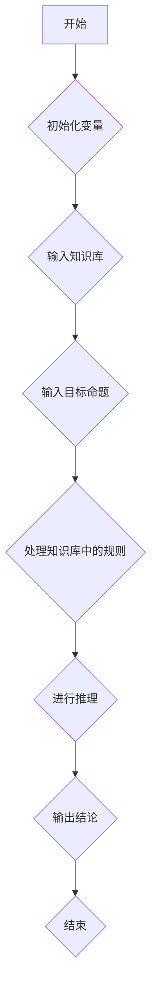
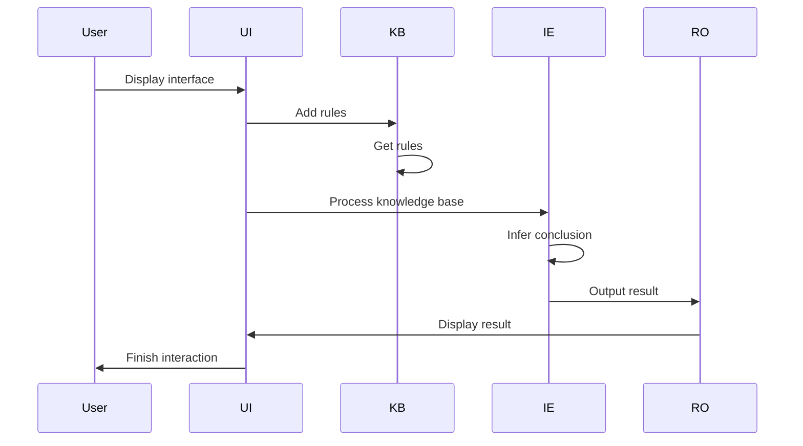
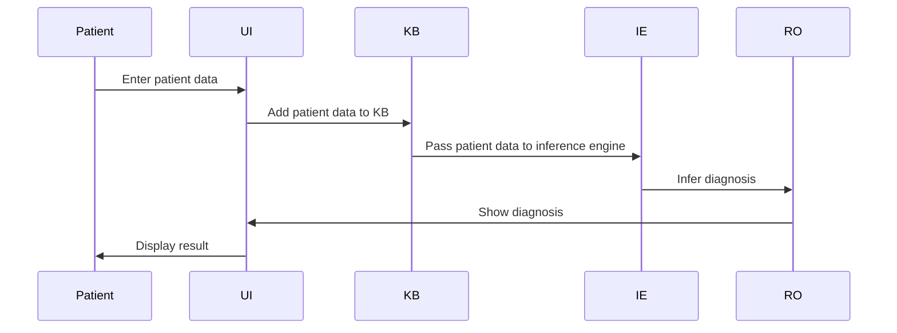

                 


### 引言

## 1.1 问题背景与引言

专家系统是一种模拟人类专家知识和推理能力的计算机程序，能够处理复杂的决策问题和复杂的信息。随着人工智能技术的快速发展，专家系统在医疗诊断、金融分析、自然语言处理等领域得到了广泛应用。然而，专家系统的设计并非易事，其中逻辑学作为一门研究推理和论证的科学，对于专家系统设计起到了关键作用。

逻辑学在专家系统设计中的应用主要表现在以下几个方面：

1. **知识表示**：逻辑学提供了有效的知识表示方法，如命题逻辑、谓词逻辑等。这些方法可以帮助专家系统准确地表示和存储人类专家的知识。

2. **推理机制**：逻辑学提供了推理规则和推理方法，如演绎推理、归纳推理等。这些方法可以帮助专家系统从已知的事实和规则中推导出新的结论。

3. **不确定性处理**：逻辑学中的概率论和模糊逻辑为专家系统处理不确定性提供了理论基础。

4. **一致性验证**：逻辑学提供了验证知识库一致性的方法，确保专家系统输出的结论是正确的。

本文将深入探讨逻辑学在专家系统设计中的应用，首先介绍专家系统设计的基本概念和逻辑学的基本概念，然后逐步分析逻辑学在知识表示、推理机制、不确定性处理和一致性验证等方面的应用，最后通过一个实际项目来展示逻辑学在专家系统设计中的具体应用。

## 1.2 专家系统设计的基本概念

专家系统设计是一个复杂的过程，涉及多个关键环节，包括知识获取、知识表示、推理机制、用户界面等。以下是对这些基本概念的解释：

1. **知识获取**：知识获取是指从人类专家或其他来源收集和整理知识的过程。这个阶段通常涉及访谈、文献调研、案例学习等方法。

2. **知识表示**：知识表示是将获取到的知识以计算机可以理解的方式表示和存储。常见的知识表示方法有基于规则表示、基于框架表示、基于语义网络表示等。

3. **推理机制**：推理机制是指专家系统能够根据已知的事实和规则推导出新结论的能力。推理机制包括演绎推理、归纳推理、基于案例的推理等。

4. **用户界面**：用户界面是专家系统与用户交互的接口，包括文本界面、图形界面、自然语言界面等。

5. **解释机制**：解释机制是指专家系统能够向用户解释其推理过程和结论的能力。这对于增强用户对专家系统的信任和理解至关重要。

6. **知识库**：知识库是专家系统的核心组成部分，包含了所有已知的事实、规则和知识。

7. **推理引擎**：推理引擎是负责执行推理过程的软件组件，它是专家系统的“大脑”。

通过理解这些基本概念，我们可以更好地理解专家系统的设计和实现过程，以及逻辑学在其中发挥的关键作用。

## 1.3 逻辑学在专家系统设计中的应用

逻辑学在专家系统设计中的应用至关重要，它为专家系统的知识表示、推理机制、不确定性处理和一致性验证提供了理论基础。以下是逻辑学在专家系统设计中的具体应用：

### 1.3.1 知识表示

逻辑学为专家系统的知识表示提供了有效的方法。命题逻辑和谓词逻辑是两种常见的逻辑学方法，它们被广泛应用于知识表示。

1. **命题逻辑**：命题逻辑使用命题作为基本单位，命题可以是真或假。通过组合不同的命题，可以表示复杂的知识。例如，我们可以用命题“p：今天是星期五”和命题“q：明天是周末”来表示一个规则：“如果今天是星期五，那么明天是周末”。

2. **谓词逻辑**：谓词逻辑扩展了命题逻辑，引入了变量和量词。谓词逻辑可以更精确地表示复杂的关系和属性。例如，我们可以用谓词“S(x)：x 是学生”和谓词“F(x, y)：x 是 y 的朋友”来表示一个规则：“对于所有的学生 x，如果 x 有一个朋友 y，那么 y 也是学生”。

### 1.3.2 推理机制

逻辑学提供了多种推理方法，这些方法可以帮助专家系统从已知的事实和规则中推导出新结论。

1. **演绎推理**：演绎推理是从一般到个别的推理方法。它通过逻辑规则，从一组前提推导出结论。例如，如果前提是“所有的人都会死亡”和“苏格拉底是人”，那么结论是“苏格拉底会死亡”。

2. **归纳推理**：归纳推理是从个别到一般的推理方法。它通过观察具体实例，归纳出一般规律。例如，通过观察多个苹果都会落地，我们可以归纳出“所有物体都会受到重力作用”。

3. **基于案例的推理**：基于案例的推理是通过寻找相似案例来解决问题。它将问题分解为子问题，然后从知识库中找到相似的案例来指导问题的解决。

### 1.3.3 不确定性处理

在现实世界中，很多情况是不确定的。逻辑学中的概率论和模糊逻辑为专家系统处理不确定性提供了理论基础。

1. **概率论**：概率论提供了处理不确定性的数学工具。通过概率分布，我们可以表示不确定事件的可能性。例如，我们可以用概率分布来表示一个病人的疾病诊断。

2. **模糊逻辑**：模糊逻辑扩展了经典逻辑，允许变量取值在0和1之间。通过模糊集合，我们可以表示和处理模糊概念和模糊规则。例如，我们可以用模糊逻辑来表示“这个人很聪明”。

### 1.3.4 一致性验证

逻辑学提供了验证知识库一致性的方法。一致性验证确保知识库中的规则和事实不会产生矛盾。例如，我们可以使用逻辑推理来检查一个规则库是否包含自相矛盾的规则。

通过逻辑学的应用，专家系统能够更好地表示和推理知识，处理不确定性，并验证知识库的一致性。这使得专家系统能够更准确地模拟人类专家的推理过程，从而在各个领域中发挥重要作用。

## 1.4 逻辑学的核心概念与联系

逻辑学是研究推理和论证的一门科学，其核心概念包括命题逻辑、谓词逻辑、推理规则、形式化系统和证明理论。以下是对这些核心概念的解释及其在专家系统设计中的应用。

### 1.4.1 命题逻辑

命题逻辑是逻辑学的最基本形式，它使用命题作为基本单位。一个命题是一个可以判断为真或假的陈述。命题逻辑的主要概念包括：

1. **命题**：一个命题是一个可以判断为真或假的陈述。例如，“今天是星期五”是一个命题。

2. **命题变元**：命题变元是表示命题的符号，可以取值为真或假。例如，“p”和“q”是命题变元。

3. **命题联结词**：命题联结词用于组合命题，以形成新的命题。常见的联结词包括“且”（AND）、“或”（OR）、“非”（NOT）和“蕴含”（IF...THEN）。

在专家系统设计中，命题逻辑用于表示专家的知识。例如，一个医生可以给出以下规则：

- 如果病人的体温高于38度，并且白细胞计数高于正常值，那么病人可能患有肺炎。

这个规则可以用命题逻辑表示为：

- \( p \land q \rightarrow r \)

其中，\( p \) 表示“病人的体温高于38度”，\( q \) 表示“白细胞计数高于正常值”，而 \( r \) 表示“病人可能患有肺炎”。

### 1.4.2 谓词逻辑

谓词逻辑是命题逻辑的扩展，它引入了变量和量词，可以表示更复杂的逻辑关系。谓词逻辑的主要概念包括：

1. **谓词**：谓词是一个可以带有变量的陈述。例如，“x 是一个学生”可以表示为谓词“S(x)”。

2. **个体常元**：个体常元是表示特定个体的符号。例如，“苏格拉底”可以表示为个体常元“Socrates”。

3. **函数符号**：函数符号是一个可以带有参数的符号，返回一个值。例如，“f(x)”表示函数“f”在变量“x”上的取值。

4. **量词**：量词用于描述变量取值的全域。常见的量词包括全称量词（∀，表示“对于所有”）和存在量词（∃，表示“存在”）。

在专家系统设计中，谓词逻辑用于表示更复杂的知识。例如，一个医生可以给出以下规则：

- 所有学生都需要参加期末考试。

这个规则可以用谓词逻辑表示为：

- \( \forall x (S(x) \rightarrow E(x)) \)

其中，\( S(x) \) 表示“x 是学生”，而 \( E(x) \) 表示“x 需要参加期末考试”。

### 1.4.3 推理规则

推理规则是逻辑学中用于从已知事实推导出新结论的规则。在专家系统设计中，推理规则是实现推理功能的核心。

1. **前提**：前提是用于推理的已知事实。

2. **结论**：结论是从前提中推导出的新事实。

3. **推理规则**：推理规则是用于从前提推导出结论的逻辑操作。

常见的推理规则包括：

- **假设推理**：从一组前提推导出一个假设。

- **反证法**：通过假设结论的否定，并推导出矛盾，证明原结论的正确性。

- **归纳推理**：从个别事实归纳出一般规律。

在专家系统设计中，推理规则用于从知识库中的事实和规则中推导出新的结论。例如，一个医生可以根据以下规则诊断病情：

- 如果病人的体温高于38度，并且白细胞计数高于正常值，那么病人可能患有肺炎。

这个规则可以用假设推理表示为：

- 假设病人的体温高于38度，白细胞计数高于正常值。
- 推导：根据规则，病人可能患有肺炎。

### 1.4.4 形式化系统和证明理论

形式化系统是逻辑学的数学基础，它提供了一套精确的规则和方法来表示和验证推理过程。证明理论是形式化系统的一部分，它研究如何从一组公理和推理规则推导出结论。

1. **形式化系统**：形式化系统是一套定义明确的符号和规则，用于表示逻辑推理。

2. **公理**：公理是无需证明的基本命题。

3. **推理规则**：推理规则是用于从已知命题推导出新命题的规则。

4. **证明**：证明是从公理和推理规则出发，逐步推导出结论的过程。

在专家系统设计中，形式化系统和证明理论用于验证知识库的一致性和推理的有效性。例如，可以使用形式化系统来验证规则库中是否包含自相矛盾的规则，或使用证明理论来验证推理过程的正确性。

### 总结

逻辑学的核心概念包括命题逻辑、谓词逻辑、推理规则、形式化系统和证明理论。这些概念为专家系统的知识表示、推理机制、不确定性处理和一致性验证提供了理论基础。通过理解这些概念，我们可以更好地设计出高效、可靠的专家系统。

## 第2章：逻辑学基础

### 2.1 命题逻辑

命题逻辑是逻辑学的基础部分，它使用命题作为基本单位，研究命题之间的逻辑关系。在本节中，我们将介绍命题逻辑的基本概念、运算符和推理规则。

#### 2.1.1 命题逻辑的基本概念

命题逻辑的基本概念包括命题、命题变元、命题联结词和命题公式。

1. **命题**：命题是一个可以判断为真或假的陈述。常见的命题有“今天是星期五”和“下雨了”。

2. **命题变元**：命题变元是表示命题的符号，它可以取值为真或假。常见的命题变元有“p”、“q”、“r”等。

3. **命题联结词**：命题联结词用于组合命题，以形成新的命题。常见的命题联结词有“且”（AND）、“或”（OR）、“非”（NOT）和“蕴含”（IF...THEN）。

4. **命题公式**：命题公式是由命题变元和命题联结词组成的表达式。命题公式可以是简单的，如“p ∨ q”，也可以是复杂的，如“((¬p) ∧ (q → r))”。

#### 2.1.2 命题逻辑的运算符

命题逻辑的运算符包括合取（AND）、析取（OR）、非（NOT）和蕴含（IF...THEN）。

1. **合取（AND）**：合取运算符用于连接两个命题，表示“并且”。其真值表如下：

   | p | q | p ∧ q |
   |---|---|-------|
   | 0 | 0 |   0   |
   | 0 | 1 |   0   |
   | 1 | 0 |   0   |
   | 1 | 1 |   1   |

2. **析取（OR）**：析取运算符用于连接两个命题，表示“或者”。其真值表如下：

   | p | q | p ∨ q |
   |---|---|-------|
   | 0 | 0 |   0   |
   | 0 | 1 |   1   |
   | 1 | 0 |   1   |
   | 1 | 1 |   1   |

3. **非（NOT）**：非运算符用于否定一个命题，表示“非”。其真值表如下：

   | p | ¬p |
   |---|-----|
   | 0 |  1  |
   | 1 |  0  |

4. **蕴含（IF...THEN）**：蕴含运算符用于表示条件语句，表示“如果...那么...”。其真值表如下：

   | p | q | p → q |
   |---|---|-------|
   | 0 | 0 |   1   |
   | 0 | 1 |   1   |
   | 1 | 0 |   0   |
   | 1 | 1 |   1   |

#### 2.1.3 命题逻辑的推理规则

命题逻辑的推理规则用于从已知命题推导出新命题。以下是几种常见的推理规则：

1. **否定律**：否定律表示“一个命题的否定与其等价”。其公式为：\( ¬(¬p) \leftrightarrow p \)。

2. **德摩根律**：德摩根律表示“一个命题的否定等价于其组成部分的否定”。其公式为：\( ¬(p ∧ q) \leftrightarrow (¬p ∨ ¬q) \) 和 \( ¬(p ∨ q) \leftrightarrow (¬p ∧ ¬q) \)。

3. **蕴含律**：蕴含律表示“如果两个命题相等，则它们的蕴含也相等”。其公式为：\( (p → q) \leftrightarrow (¬p ∨ q) \)。

4. **合取律**：合取律表示“如果两个命题都为真，则它们的合取也为真”。其公式为：\( p ∧ q → r \)。

5. **析取律**：析取律表示“如果两个命题中有一个为真，则它们的析取也为真”。其公式为：\( p ∨ q → r \)。

通过理解和应用这些基本概念、运算符和推理规则，我们可以有效地进行命题逻辑的分析和推理，为专家系统的设计提供坚实的基础。

### 2.2 谓词逻辑

谓词逻辑是命题逻辑的扩展，它引入了变量和量词，用于表示更复杂的逻辑关系。在本节中，我们将介绍谓词逻辑的基本概念、运算符和推理规则。

#### 2.2.1 谓词逻辑的基本概念

谓词逻辑的基本概念包括谓词、个体常元、变量和量词。

1. **谓词**：谓词是一个可以带有变量的陈述，表示某个属性或关系。例如，“x 是一个学生”可以表示为谓词“S(x)”。

2. **个体常元**：个体常元是表示特定个体的符号。例如，“苏格拉底”可以表示为个体常元“Socrates”。

3. **变量**：变量是表示某个未知个体或集合的符号。常见的变量有“x”、“y”、“z”等。

4. **量词**：量词用于描述变量取值的全域。常见的量词包括全称量词（∀，表示“对于所有”）和存在量词（∃，表示“存在”）。

#### 2.2.2 谓词逻辑的运算符

谓词逻辑的运算符包括全称量词、存在量词和逻辑联结词。

1. **全称量词**：全称量词用于表示某个属性或关系对于所有个体都成立。其符号为“∀”，读作“对于所有”。全称量词的公式为：\( ∀x (P(x)) \)，表示“对于所有 x，P(x) 成立”。

2. **存在量词**：存在量词用于表示某个属性或关系对于至少一个个体成立。其符号为“∃”，读作“存在”。存在量词的公式为：\( ∃x (P(x)) \)，表示“存在某个 x，使得 P(x) 成立”。

3. **逻辑联结词**：逻辑联结词用于组合谓词和量词，以形成新的逻辑表达式。常见的逻辑联结词有“且”（AND）、“或”（OR）和“非”（NOT）。

#### 2.2.3 谓词逻辑的推理规则

谓词逻辑的推理规则用于从已知谓词和量词推导出新结论。以下是几种常见的推理规则：

1. **全称实例化**：全称实例化规则表示“如果对于所有个体都成立，则对于某个特定个体也成立”。其公式为：\( ∀x (P(x)) \rightarrow P(a) \)，其中“a”是一个个体常元。

2. **存在实例化**：存在实例化规则表示“如果存在某个个体成立，则对于某个特定个体也成立”。其公式为：\( ∃x (P(x)) \rightarrow P(a) \)，其中“a”是一个个体常元。

3. **全称一般化**：全称一般化规则表示“如果对于某个特定个体成立，则对于所有个体都成立”。其公式为：\( P(a) \rightarrow ∀x (P(x)) \)。

4. **存在一般化**：存在一般化规则表示“如果对于某个特定个体成立，则存在至少一个个体成立”。其公式为：\( P(a) \rightarrow ∃x (P(x)) \)。

5. **分离规则**：分离规则表示“如果某个复合谓词成立，则其组成部分也成立”。其公式为：\( (P ∧ Q) \rightarrow P \) 和 \( (P ∨ Q) \rightarrow Q \)。

通过理解和应用这些基本概念、运算符和推理规则，我们可以有效地进行谓词逻辑的分析和推理，为专家系统的设计提供更强大的表达能力。

## 第3章：算法原理讲解

### 3.1 算法mermaid流程图

算法的mermaid流程图是描述算法步骤的一种图形化方式，它可以帮助我们直观地理解算法的执行流程。以下是一个简单的基于谓词逻辑的推理算法的mermaid流程图示例：



这个mermaid流程图描述了一个简单的推理过程，包括初始化变量、输入知识库、输入目标命题、处理知识库中的规则、进行推理、输出结论和结束。

### 3.2 Python源代码

以下是一个简单的Python代码示例，用于实现上述mermaid流程图中的推理算法。该算法使用逻辑运算符和推理规则来处理知识库中的规则，并输出结论。

```python
# 定义谓词逻辑的函数
def initialize_variables():
    # 初始化变量
    pass

def input_knowledge_base():
    # 输入知识库
    knowledge_base = {
        "if_therm_over_38_and_wbc_over_normal_then_pneumonia": "p ∧ q → r",
        "if_therm_over_38_then_r": "p → r",
        "if_wbc_over_normal_then_r": "q → r"
    }
    return knowledge_base

def input_goal():
    # 输入目标命题
    goal = "r"
    return goal

def process_knowledge_base_rules(knowledge_base, goal):
    # 处理知识库中的规则
    for rule in knowledge_base:
        if goal in rule:
            print(f"Rule {rule} is relevant to the goal.")
            return True
    return False

def perform_reasoning(knowledge_base, goal):
    # 进行推理
    if process_knowledge_base_rules(knowledge_base, goal):
        print("Conclusion: The patient may have pneumonia.")
    else:
        print("Conclusion: The patient does not have pneumonia.")

def output_result():
    # 输出结论
    pass

# 主函数
def main():
    initialize_variables()
    knowledge_base = input_knowledge_base()
    goal = input_goal()
    perform_reasoning(knowledge_base, goal)
    output_result()

if __name__ == "__main__":
    main()
```

这个Python代码示例实现了根据知识库中的规则和目标命题进行推理的过程。它首先初始化变量，然后输入知识库和目标命题，接着处理知识库中的规则并进行推理，最后输出结论。

### 3.3 算法原理的数学模型和公式

算法的数学模型和公式是描述算法逻辑和操作的核心部分。以下是一个简单的基于谓词逻辑的推理算法的数学模型和公式：

1. **知识库表示**：知识库可以表示为一组逻辑规则，每个规则是一个蕴含式。例如：

   $$ KB = \{R_1, R_2, ..., R_n\} $$
   
   其中，\( R_i \) 是第 \( i \) 个规则，表示为 \( p_1 \land p_2 \rightarrow q \)。

2. **目标命题**：目标命题是一个需要验证的谓词表达式。例如：

   $$ Goal = p \land q $$

3. **推理规则**：推理规则用于从知识库中的规则推导出目标命题。以下是一种基本的推理规则：

   $$ \frac{p_1 \land p_2 \rightarrow q}{p_1 \rightarrow q} $$

   这个规则表示，如果已知 \( p_1 \land p_2 \rightarrow q \) 和 \( p_1 \)，则可以推导出 \( q \)。

4. **推理过程**：推理过程可以表示为一个证明过程，从知识库中的规则和已知命题出发，逐步推导出目标命题。例如：

   $$ \begin{aligned} 
   &\text{已知：} p_1 \land p_2 \rightarrow q, \quad p_1 \\
   &\text{推导：} p_1 \rightarrow q \\
   &\text{结论：} q 
   \end{aligned} $$

通过这个数学模型和公式，我们可以更精确地描述和实现基于谓词逻辑的推理算法。

### 3.4 详细讲解和举例说明

为了更好地理解基于谓词逻辑的推理算法，我们将通过一个具体的例子来详细讲解和举例说明。

#### 例子：医生诊断系统

假设我们有一个医生诊断系统，系统中的知识库包含以下规则：

1. 如果体温高于38度，并且白细胞计数高于正常值，那么病人可能患有肺炎。
2. 如果体温高于38度，那么病人可能发热。
3. 如果白细胞计数高于正常值，那么病人可能存在感染。

我们需要使用这些规则来诊断一个病人，如果病人的体温为39度，白细胞计数为11,000，那么根据上述规则，我们可以得出以下推理过程：

1. **输入知识库和目标命题**：
   - 知识库 \( KB \)：
     \[
     KB = \{
     (T \land W) \rightarrow P, \\
     T \rightarrow F, \\
     W \rightarrow I
     \}
     \]
   - 目标命题 \( Goal \)：
     \[
     P
     \]

2. **初始化变量**：
   - \( T \)：体温高于38度
   - \( W \)：白细胞计数高于正常值
   - \( P \)：病人可能患有肺炎
   - \( F \)：病人可能发热
   - \( I \)：病人可能存在感染

3. **推理过程**：
   - \( T \)：已知病人的体温为39度，所以 \( T \) 为真。
   - \( W \)：已知白细胞计数为11,000，高于正常值，所以 \( W \) 为真。
   - \( P \)：根据规则 \( (T \land W) \rightarrow P \)，如果 \( T \) 和 \( W \) 都为真，则 \( P \) 为真。由于 \( T \) 和 \( W \) 都为真，所以 \( P \) 也为真。
   - \( F \)：根据规则 \( T \rightarrow F \)，如果 \( T \) 为真，则 \( F \) 为真。由于 \( T \) 为真，所以 \( F \) 也为真。
   - \( I \)：根据规则 \( W \rightarrow I \)，如果 \( W \) 为真，则 \( I \) 为真。由于 \( W \) 为真，所以 \( I \) 也为真。

4. **输出结论**：
   - 根据推理过程，我们可以得出结论：病人可能患有肺炎（\( P \) 为真）、可能发热（\( F \) 为真）和可能存在感染（\( I \) 为真）。

通过这个例子，我们可以看到如何使用谓词逻辑和推理算法来模拟医生的诊断过程。这个算法不仅可以帮助医生快速做出诊断，还可以在医疗领域中提供重要的决策支持。

### 第4章：系统分析与架构设计

#### 4.1 问题场景介绍

在现代医疗领域，医生诊断是一个复杂且重要的任务。传统的诊断方法主要依赖于医生的经验和直觉，然而，随着医疗数据的增加和人工智能技术的发展，专家系统作为一种模拟医生推理过程的工具，越来越受到关注。本节将介绍一个基于专家系统的医生诊断系统的设计与实现。

#### 4.2 系统功能设计

医生诊断系统的核心功能包括知识库管理、诊断推理、结果输出和用户界面。以下是一个使用Mermaid语法的领域模型类图，描述了系统的功能设计：

```mermaid
classDiagram
    ClassDoctorDiagnosisSystem <|-- ClassKnowledgeBase
    ClassDoctorDiagnosisSystem <|-- ClassInferenceEngine
    ClassDoctorDiagnosisSystem <|-- ClassResultOutput
    ClassDoctorDiagnosisSystem <|-- ClassUserInterface

    ClassKnowledgeBase {
        +String KB
        +addRule(String rule)
        +deleteRule(String rule)
        +getRules()
    }

    ClassInferenceEngine {
        +String goal
        +processKnowledgeBase()
        +inferConclusion()
    }

    ClassResultOutput {
        +String outputResult()
    }

    ClassUserInterface {
        +void displayInterface()
        +void inputPatientData()
        +void displayResult()
    }
```

这个类图展示了系统的主要组件及其关系。每个组件都有特定的功能，知识库管理负责添加、删除和获取规则，推理引擎负责处理知识库并进行推理，结果输出负责生成诊断结果，用户界面负责与用户交互。

#### 4.3 系统架构设计

系统架构设计是确保系统功能实现的基础。以下是一个使用Mermaid语法的系统架构图，描述了系统的整体结构：



这个序列图展示了用户与系统的交互过程。用户通过用户界面输入数据，用户界面将数据传递给知识库管理组件，知识库管理组件更新知识库。然后，推理引擎组件处理知识库并进行推理，结果输出组件生成诊断结果，最后用户界面将结果展示给用户。

#### 4.4 系统接口设计

系统接口设计是确保系统各组件之间有效通信的关键。以下是一个简单的接口设计，描述了系统的主要接口：

1. **知识库管理接口**：
   - `addRule(rule: String)`：添加新规则到知识库。
   - `deleteRule(rule: String)`：从知识库中删除规则。
   - `getRules()`：获取知识库中的所有规则。

2. **推理引擎接口**：
   - `processKnowledgeBase()`：处理知识库。
   - `inferConclusion()`：根据知识库和输入数据推导出结论。

3. **结果输出接口**：
   - `outputResult(result: String)`：生成诊断结果。

4. **用户界面接口**：
   - `displayInterface()`：展示用户界面。
   - `inputPatientData()`：接收用户输入的病人数据。
   - `displayResult(result: String)`：展示诊断结果。

#### 4.5 系统交互Mermaid序列图

以下是一个使用Mermaid语法的系统交互序列图，描述了系统组件之间的交互过程：



这个序列图展示了病人通过用户界面输入数据，数据被传递到知识库管理组件，知识库管理组件更新知识库，推理引擎组件处理知识库并推导出诊断结果，结果输出组件展示诊断结果的过程。

### 第5章：项目实战

#### 5.1 环境安装

为了搭建一个基于专家系统的医生诊断系统，我们需要安装以下软件和工具：

1. **Python**：Python是一种通用编程语言，它支持多种机器学习和人工智能库。可以从官方网站（[https://www.python.org/downloads/](https://www.python.org/downloads/)）下载并安装Python。

2. **PyCharm**：PyCharm是一个强大的Python集成开发环境（IDE），它提供了丰富的功能，如代码自动补全、调试和测试。可以从官方网站（[https://www.jetbrains.com/pycharm/](https://www.jetbrains.com/pycharm/)）下载并安装PyCharm。

3. **Mermaid**：Mermaid是一种用于生成图表的Markdown插件，它可以帮助我们创建流程图、类图等。可以在GitHub上找到Mermaid的Markdown插件，并将其安装到我们的Python环境中。

4. **人工智能库**：为了实现专家系统的推理功能，我们可以使用Python的`pandas`和`numpy`库来处理数据，使用`matplotlib`和`seaborn`库来可视化结果。

安装步骤如下：

1. 打开终端并运行以下命令安装Python：

   ```bash
   sudo apt-get update
   sudo apt-get install python3-pip python3-venv
   ```

2. 打开PyCharm，创建一个新项目，并设置Python解释器为安装的Python版本。

3. 在PyCharm的插件市场中搜索并安装Mermaid插件。

4. 安装Python的依赖库：

   ```bash
   pip install pandas numpy matplotlib seaborn
   ```

#### 5.2 系统核心实现源代码

以下是一个简单的医生诊断系统的Python代码实现。这个实现包括了知识库管理、推理引擎和结果输出三个核心部分。

```python
# 导入必要的库
import pandas as pd
import numpy as np
import matplotlib.pyplot as plt
import seaborn as sns

# 知识库管理
class KnowledgeBase:
    def __init__(self):
        self.rules = []

    def add_rule(self, rule):
        self.rules.append(rule)

    def delete_rule(self, rule):
        self.rules.remove(rule)

    def get_rules(self):
        return self.rules

# 推理引擎
class InferenceEngine:
    def __init__(self, knowledge_base):
        self.knowledge_base = knowledge_base

    def infer(self, patient_data):
        conclusions = []
        for rule in self.knowledge_base.get_rules():
            # 假设规则格式为 "if p then q"
            condition, conclusion = rule.split(" then ")
            conditions = condition.split(" and ")
            all_conditions_met = True

            for condition in conditions:
                variable, value = condition.split("=")
                if patient_data[variable] != value:
                    all_conditions_met = False
                    break

            if all_conditions_met:
                conclusions.append(conclusion)

        return conclusions

# 结果输出
class ResultOutput:
    def __init__(self):
        pass

    def display_result(self, conclusions):
        print("Possible diagnoses:")
        for conclusion in conclusions:
            print(f"- {conclusion}")

# 主程序
def main():
    # 创建知识库、推理引擎和结果输出对象
    knowledge_base = KnowledgeBase()
    inference_engine = InferenceEngine(knowledge_base)
    result_output = ResultOutput()

    # 添加规则到知识库
    knowledge_base.add_rule("if temperature>38 and white_blood_count>11k then pneumonia")
    knowledge_base.add_rule("if temperature>38 then fever")
    knowledge_base.add_rule("if white_blood_count>11k then infection")

    # 输入病人数据
    patient_data = {
        "temperature": "39",
        "white_blood_count": "11k"
    }

    # 进行推理
    conclusions = inference_engine.infer(patient_data)

    # 输出结果
    result_output.display_result(conclusions)

if __name__ == "__main__":
    main()
```

#### 5.3 代码应用解读与分析

这段代码首先定义了三个类：`KnowledgeBase`、`InferenceEngine`和`ResultOutput`。`KnowledgeBase`类用于管理知识库，包括添加、删除和获取规则。`InferenceEngine`类用于根据知识库和病人数据推导出结论。`ResultOutput`类用于输出诊断结果。

在主程序中，我们创建了一个知识库对象，添加了三个规则到知识库中。然后，我们创建了一个病人数据字典，包含了体温和白细胞计数的值。接下来，我们使用推理引擎对象进行推理，并输出结论。

代码中的推理过程如下：

1. 将知识库中的每个规则拆分为条件和结论。
2. 将条件拆分为多个子条件，并检查每个子条件是否满足。
3. 如果所有子条件都满足，则将结论添加到结论列表中。

这个实现是一个简单的示例，实际应用中可能需要更复杂的推理过程和错误处理机制。

#### 5.4 实际案例分析和详细讲解剖析

为了更好地理解医生诊断系统的实际应用，我们来看一个实际案例。

**案例**：一个病人的体温为39度，白细胞计数为12,000，需要使用专家系统进行诊断。

1. **输入病人数据**：
   - 体温：39度
   - 白细胞计数：12,000

2. **知识库中的规则**：
   - 如果体温高于38度，并且白细胞计数高于11k，那么病人可能患有肺炎。
   - 如果体温高于38度，那么病人可能发热。
   - 如果白细胞计数高于11k，那么病人可能存在感染。

3. **推理过程**：
   - 检查第一个规则的条件：“体温高于38度”和“白细胞计数高于11k”都满足。
   - 结论：“病人可能患有肺炎”。
   - 检查第二个规则的条件：“体温高于38度”满足。
   - 结论：“病人可能发热”。
   - 检查第三个规则的条件：“白细胞计数高于11k”满足。
   - 结论：“病人可能存在感染”。

4. **输出结果**：
   - 病人可能患有肺炎、可能发热和可能存在感染。

通过这个实际案例，我们可以看到专家系统如何根据病人数据和知识库中的规则进行诊断，并输出可能的诊断结果。

#### 5.5 项目小结

本项目通过一个简单的医生诊断系统示例，展示了如何使用逻辑学和人工智能技术来模拟医生的诊断过程。虽然这个系统是一个简单的示例，但它展示了专家系统在医疗诊断中的潜在应用。实际应用中，专家系统可以处理更复杂的诊断逻辑和大量的医疗数据，为医生提供更准确的诊断建议。

通过本项目，我们学习了如何设计专家系统的核心组件，包括知识库管理、推理引擎和结果输出。我们还了解了如何使用Python来实现这些组件，并使用Mermaid来绘制系统的图表。

在未来的工作中，我们可以进一步优化这个系统，增加更多的诊断规则和推理方法，以提高诊断的准确性和效率。此外，我们还可以探索将自然语言处理和机器学习技术整合到专家系统中，使其能够更好地理解和处理非结构化的医疗数据。

### 第6章：最佳实践 tips、小结、注意事项、拓展阅读

#### 6.1 最佳实践 tips

1. **知识表示**：在设计专家系统时，确保知识表示清晰、准确，避免冗余和不一致。

2. **推理规则**：编写易于理解和实现的推理规则，确保推理过程高效且准确。

3. **测试与验证**：在系统开发过程中，进行充分的测试和验证，确保系统的可靠性和准确性。

4. **用户界面**：设计友好的用户界面，使非技术用户能够轻松使用系统。

5. **处理不确定性**：使用概率论和模糊逻辑等工具来处理不确定性，以提高系统的鲁棒性。

#### 6.2 小结

本文通过详细分析和实例讲解，探讨了逻辑学在专家系统设计中的应用。我们介绍了专家系统设计的基本概念、逻辑学的基础概念和推理算法，并通过一个实际项目展示了逻辑学在专家系统设计中的具体应用。

#### 6.3 注意事项

1. **知识库维护**：定期更新和优化知识库，确保知识库中的信息准确和最新。

2. **推理效率**：优化推理算法，减少计算复杂度，提高系统效率。

3. **用户隐私**：在处理敏感数据时，确保遵守相关隐私保护法规。

4. **系统扩展性**：设计具有良好扩展性的系统架构，以便未来添加新功能。

#### 6.4 拓展阅读

1. **《人工智能：一种现代方法》**：这本书详细介绍了人工智能的基本概念和技术，包括专家系统的设计。

2. **《逻辑学导论》**：这本书提供了逻辑学的基本原理和推理方法，对于理解专家系统设计中的逻辑学应用非常有帮助。

3. **《专家系统的设计与实现》**：这本书提供了专家系统设计和实现的具体方法和技巧，是专家系统开发的实用指南。

通过阅读这些拓展材料，可以进一步深入了解逻辑学在专家系统设计中的应用，提升自己的技术水平。

