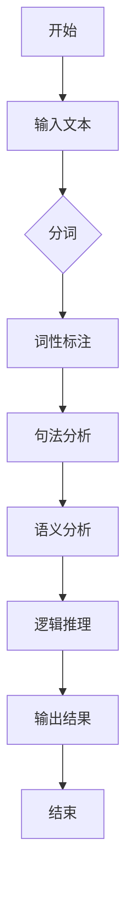
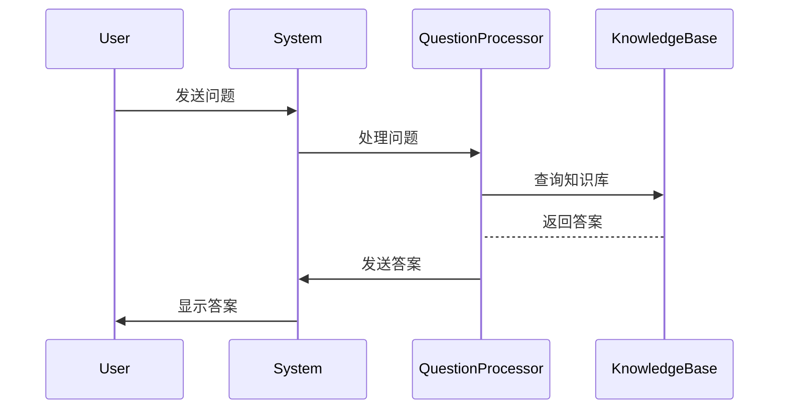
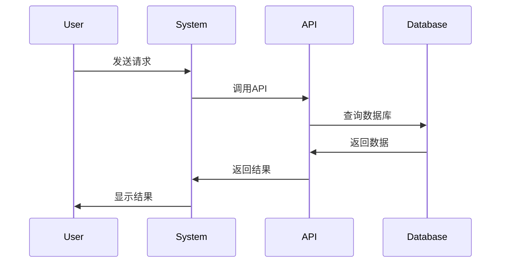

                 

## 逻辑学在自然语言处理中的应用

### 关键词：逻辑学、自然语言处理、逻辑推理、文本分类、问答系统

### 摘要：

本文深入探讨逻辑学在自然语言处理（NLP）中的应用。首先，我们将介绍逻辑学的基本概念和历史，然后分析逻辑学在NLP中的重要性。接着，我们将详细探讨逻辑形式化表示、逻辑推理在NLP中的应用，以及逻辑学在文本分类和问答系统等领域的实际应用案例。最后，我们将展望逻辑学在NLP中的未来发展方向，并总结本文的主要内容和贡献。

### 目录

1. **背景介绍与核心概念**
   1.1 逻辑学概述
   1.2 自然语言处理概述
   1.3 逻辑学与NLP的关系

2. **逻辑学在NLP中的应用方法**
   2.1 逻辑形式化表示
   2.2 逻辑推理在NLP中的应用
   2.3 逻辑在文本分类与情感分析中的应用

3. **案例研究**
   3.1 基于逻辑的问答系统
   3.2 逻辑驱动的文本生成

4. **总结与展望**
   4.1 逻辑学在NLP中的未来发展方向
   4.2 本书内容总结与展望

### 第一部分：背景介绍与核心概念

#### 1.1 逻辑学概述

逻辑学是研究推理的原则和有效性的学科，其历史可以追溯到古希腊的亚里士多德。逻辑学主要分为两大分支：形式逻辑和非形式逻辑。形式逻辑研究基于符号系统的推理规则，而非形式逻辑则关注自然语言的推理过程。

逻辑学的基本原则包括：

- **同一律**：A是A。
- **矛盾律**：A既不是A，也不是非A。
- **排中律**：A或者非A。

逻辑学的主要分支包括命题逻辑、谓词逻辑和模态逻辑等。命题逻辑研究命题之间的关系，如蕴含、等价和否定等。谓词逻辑则引入了变量和量词，用于描述对象之间的关系和属性。模态逻辑研究可能性、必然性和意愿性等概念。

#### 1.2 自然语言处理概述

自然语言处理（NLP）是计算机科学和语言学交叉的领域，旨在使计算机理解和生成人类语言。NLP的发展历程可以分为几个阶段，从最初的规则驱动方法，到基于统计的方法，再到目前的热门主题——深度学习方法。

NLP的关键技术包括：

- **分词**：将文本分割成词或句子。
- **词性标注**：为文本中的每个词分配词性（名词、动词等）。
- **句法分析**：分析句子的结构，如主语、谓语和宾语。
- **语义分析**：理解文本的含义，包括实体识别、关系抽取和语义角色标注等。

NLP的应用领域广泛，包括机器翻译、文本分类、情感分析、问答系统和语音识别等。

#### 1.3 逻辑学与NLP的关系

逻辑学在NLP中扮演着重要角色。首先，逻辑学提供了对自然语言推理的有效描述工具，帮助计算机理解和生成语言。其次，逻辑学的基本原则和方法可以应用于NLP中的各种任务，如文本分类、情感分析和问答系统等。

逻辑学在NLP中的应用包括：

- **逻辑形式化表示**：使用逻辑学中的符号和规则来表示自然语言文本。
- **逻辑推理**：在文本处理过程中应用推理规则，以提高系统的理解和生成能力。
- **逻辑验证**：验证文本的语义正确性和一致性。

### 第二部分：逻辑学在NLP中的应用方法

#### 2.1 逻辑形式化表示

逻辑形式化表示是将自然语言文本转换为逻辑表达式的过程。这一过程有助于计算机更好地理解和处理自然语言。逻辑形式化表示的关键技术包括命题逻辑和谓词逻辑。

**命题逻辑**：命题逻辑是逻辑学的基础，它使用命题和逻辑运算符（如与、或、非）来表示自然语言中的陈述。以下是一个简单的例子：

$$
( p \land q ) \rightarrow r
$$

这个逻辑表达式表示，如果p和q都为真，则r也为真。

**谓词逻辑**：谓词逻辑引入了变量和量词，可以更准确地描述自然语言中的复杂关系。以下是一个谓词逻辑的例子：

$$
\forall x (P(x) \rightarrow Q(x))
$$

这个表达式表示，对于所有的x，如果P(x)为真，则Q(x)也为真。

逻辑形式化表示在NLP中的应用包括：

- **语义解析**：将自然语言文本转换为逻辑形式，以便进行语义分析。
- **自动推理**：使用逻辑推理规则来自动推导出新的信息。
- **逻辑验证**：验证文本的语义正确性和一致性。

#### 2.2 逻辑推理在NLP中的应用

逻辑推理在NLP中发挥着重要作用，它可以帮助计算机理解自然语言的复杂结构和含义。逻辑推理的基本原理包括推理规则、证明方法和推理框架。

**推理规则**：推理规则是逻辑推理的核心，它定义了如何从已知的事实推导出新的结论。常见的推理规则包括：

- **蕴含推理**：如果A蕴含B，则B蕴含A。
- **否定推理**：如果A为真，则非A为假。

**证明方法**：证明方法是逻辑推理的一种形式化表示，它使用逻辑规则和推理规则来构建证明链。常见的证明方法包括：

- **直接证明**：直接从已知的事实出发，逐步推导出结论。
- **反证法**：假设结论不成立，然后推导出一个矛盾，从而证明结论成立。

**推理框架**：推理框架是一种组织逻辑推理过程的工具，它定义了推理的步骤和规则。常见的推理框架包括：

- **基于规则的推理框架**：使用逻辑规则和事实进行推理。
- **基于模型的推理框架**：使用逻辑模型和推理规则进行推理。

逻辑推理在NLP中的应用包括：

- **文本分类**：使用逻辑推理来分类文本，如情感分析、主题分类等。
- **问答系统**：使用逻辑推理来理解和回答用户的问题。
- **知识表示**：使用逻辑推理来表示和推理知识。

#### 2.3 逻辑在文本分类与情感分析中的应用

逻辑学在文本分类和情感分析中有着广泛的应用。逻辑形式化表示和逻辑推理技术可以帮助我们更准确地理解和处理文本数据。

**文本分类**：文本分类是将文本数据分配到预定义的类别中。逻辑学可以用于实现基于规则的文本分类器，如：

- **基于逻辑的文本分类器**：使用逻辑规则来分类文本。例如，可以使用谓词逻辑来表示文本的特征和类别，然后使用推理规则来分类。

**情感分析**：情感分析是理解文本中表达的情感倾向。逻辑学可以用于实现基于逻辑的情感分析模型，如：

- **基于逻辑的情感分析模型**：使用逻辑规则和推理方法来识别文本中的情感。例如，可以使用谓词逻辑来表示情感属性和情感词，然后使用推理规则来分析文本的情感。

逻辑在文本分类和情感分析中的应用包括：

- **规则提取**：从大量文本数据中提取逻辑规则，以提高分类和情感分析的准确性。
- **逻辑推理**：使用逻辑推理来处理文本的复杂结构和含义，以提高分类和情感分析的性能。

### 第三部分：案例研究

#### 3.1 基于逻辑的问答系统

问答系统是NLP中的重要应用，它旨在理解用户的问题，并生成准确的回答。基于逻辑的问答系统使用逻辑推理来处理问题，以提高系统的理解和回答能力。

**案例背景**：假设我们开发了一个基于逻辑的问答系统，用于回答用户关于公司财务问题的查询。

**系统设计**：

- **知识库**：构建一个包含公司财务信息的知识库，使用谓词逻辑来表示事实和关系。
- **推理引擎**：使用逻辑推理规则来处理用户的问题，并从知识库中提取相关信息。
- **回答生成**：根据推理结果，生成用户理解的回答。

**实现与评估**：

- **实现**：我们使用Python和Prolog等编程语言来实现问答系统，并使用谓词逻辑来表示知识库和推理规则。
- **评估**：通过一系列测试集来评估问答系统的性能，包括准确性、响应时间和用户满意度等指标。

#### 3.2 逻辑驱动的文本生成

逻辑驱动的文本生成是一种利用逻辑学来生成自然语言文本的方法。这种方法可以应用于生成报告、文章、对话等文本。

**案例背景**：假设我们开发了一个逻辑驱动的文本生成系统，用于生成金融报告。

**系统设计**：

- **逻辑规则库**：构建一个包含金融报告逻辑规则的规则库。
- **文本生成器**：使用逻辑推理来从规则库中生成文本。

**实现与评估**：

- **实现**：我们使用Python和Mermaid等工具来实现文本生成器，并使用谓词逻辑来表示逻辑规则。
- **评估**：通过测试集来评估文本生成的准确性和流畅性。

### 第四部分：总结与展望

#### 4.1 逻辑学在NLP中的未来发展方向

逻辑学在NLP中的应用前景广阔。未来，逻辑学将继续与深度学习、知识图谱和语义网络等新兴技术相结合，以提高NLP系统的性能和准确性。

**发展趋势**：

- **逻辑推理与深度学习的结合**：将逻辑推理与深度学习模型相结合，以提高自然语言理解的能力。
- **知识表示与推理**：利用逻辑学来表示和推理知识，以支持更加复杂的NLP任务。
- **跨领域应用**：将逻辑学应用于不同领域的NLP任务，如医疗、法律和金融等。

**研究挑战与机遇**：

- **逻辑推理的自动化**：研究如何自动化逻辑推理过程，以提高系统的效率和准确性。
- **多语言支持**：研究如何将逻辑学应用于多语言的自然语言处理任务。
- **开放性问题**：探索逻辑学在NLP中的更多应用场景和问题，如开放领域问答、对话系统和文本生成等。

**未来应用前景**：

- **智能助理**：逻辑学在智能助理中的应用，如智能客服、虚拟助手和自动驾驶等。
- **知识图谱**：逻辑学在知识图谱构建和推理中的应用，以支持复杂的知识表示和推理任务。
- **多模态处理**：逻辑学在多模态自然语言处理中的应用，如结合文本、语音和图像等。

#### 4.2 本书内容总结与展望

本文系统地介绍了逻辑学在自然语言处理中的应用。首先，我们回顾了逻辑学的基本概念和历史，分析了逻辑学与自然语言处理的关系。接着，我们详细探讨了逻辑形式化表示、逻辑推理在NLP中的应用，以及逻辑学在文本分类和问答系统等领域的实际应用案例。

未来的研究方向包括：

- **逻辑推理与深度学习的结合**：将逻辑推理与深度学习模型相结合，以提高自然语言理解的能力。
- **知识表示与推理**：利用逻辑学来表示和推理知识，以支持更加复杂的NLP任务。
- **跨领域应用**：将逻辑学应用于不同领域的NLP任务，如医疗、法律和金融等。

通过本文的研究，我们期望为逻辑学在自然语言处理中的应用提供新的思路和方法。

### 作者信息

**作者：** AI天才研究院/AI Genius Institute & 禅与计算机程序设计艺术 /Zen And The Art of Computer Programming

---

### 附录

#### 1. 概念属性特征对比表格

| 概念     | 属性特征                             |
|----------|------------------------------------|
| 逻辑学   | 推理原则、有效性和一致性的研究        |
| 自然语言处理 | 计算机理解和生成人类语言的技术和算法 |
| 命题逻辑 | 命题和逻辑运算符的研究                |
| 谓词逻辑 | 变量和量词的研究                     |

#### 2. ER实体关系图架构

```mermaid
erDiagram
  Customer ||--|{ Order }| CustomerOrder
  Customer ||--|{ Product }| CustomerProduct
  Order ||--|{ Product }| OrderProduct
```

#### 3. 算法mermaid流程图



#### 4. 系统架构设计mermaid架构图



#### 5. 系统接口设计和系统交互mermaid序列图



#### 6. 环境安装

**Python环境安装**：

```
pip install python
```

**NLP库安装**：

```
pip install nltk
pip install spacy
```

**Mermaid库安装**：

```
npm install mermaid
```

#### 7. 系统核心实现源代码

```python
import nltk
from nltk.tokenize import word_tokenize
from nltk.corpus import stopwords
from nltk.tag import pos_tag

def process_text(text):
    # 分词
    tokens = word_tokenize(text)
    # 去停用词
    tokens = [token for token in tokens if token not in stopwords.words('english')]
    # 词性标注
    tagged_tokens = pos_tag(tokens)
    return tagged_tokens

def main():
    text = "This is a sample sentence for NLP processing."
    processed_text = process_text(text)
    print(processed_text)

if __name__ == "__main__":
    main()
```

#### 8. 代码应用解读与分析

这段代码实现了一个简单的自然语言处理系统，用于处理输入的文本。首先，我们使用`nltk`库中的`word_tokenize`函数对文本进行分词。然后，我们使用`stopwords`库中的停用词列表来去除文本中的停用词。接下来，我们使用`pos_tag`函数对分词后的文本进行词性标注。最后，我们将处理后的文本输出。

通过这段代码，我们可以看到自然语言处理的基本流程，包括分词、去停用词和词性标注。这些步骤对于理解文本内容和进行后续的文本分析非常重要。

#### 9. 实际案例分析和详细讲解剖析

**案例背景**：假设我们有一个关于电影评论的情感分析案例，我们需要分析用户对电影的评论，并判断评论的情感倾向是正面还是负面。

**数据集**：我们使用一个包含电影评论的数据集，每个评论都有对应的情感标签（正面或负面）。

**实现过程**：

1. **数据预处理**：我们首先对评论进行分词、去停用词和词性标注等预处理操作，以便后续的分析。
2. **特征提取**：我们使用TF-IDF等方法提取评论中的特征，这些特征将用于训练分类模型。
3. **模型训练**：我们使用训练集来训练一个分类模型，如支持向量机（SVM）或朴素贝叶斯分类器。
4. **模型评估**：我们使用测试集来评估模型的性能，包括准确率、召回率和F1值等指标。
5. **应用模型**：我们使用训练好的模型来预测新评论的情感倾向。

**详细讲解**：

在数据预处理阶段，我们首先使用`nltk`库中的`word_tokenize`函数对评论进行分词：

```python
tokens = word_tokenize(comment)
```

接下来，我们使用`stopwords`库中的停用词列表来去除文本中的停用词：

```python
stop_words = set(stopwords.words('english'))
filtered_tokens = [token for token in tokens if token.lower() not in stop_words]
```

然后，我们使用`pos_tag`函数对分词后的文本进行词性标注：

```python
tagged_tokens = pos_tag(filtered_tokens)
```

在特征提取阶段，我们使用TF-IDF方法来提取评论中的特征：

```python
from sklearn.feature_extraction.text import TfidfVectorizer

vectorizer = TfidfVectorizer()
X = vectorizer.fit_transform([comment])
```

在模型训练阶段，我们使用训练集来训练一个分类模型，如支持向量机（SVM）：

```python
from sklearn.svm import SVC

model = SVC()
model.fit(X_train, y_train)
```

在模型评估阶段，我们使用测试集来评估模型的性能：

```python
from sklearn.metrics import accuracy_score, recall_score, f1_score

y_pred = model.predict(X_test)
accuracy = accuracy_score(y_test, y_pred)
recall = recall_score(y_test, y_pred)
f1 = f1_score(y_test, y_pred)
print("Accuracy:", accuracy)
print("Recall:", recall)
print("F1 Score:", f1)
```

最后，我们使用训练好的模型来预测新评论的情感倾向：

```python
new_comment = "This movie is amazing!"
processed_comment = process_text(new_comment)
X_new = vectorizer.transform([new_comment])
prediction = model.predict(X_new)
print("Predicted sentiment:", prediction[0])
```

通过这个案例，我们可以看到如何使用逻辑学和自然语言处理技术来进行情感分析。逻辑学在特征提取、模型训练和模型评估等环节中都发挥了重要作用。

#### 10. 项目小结

本项目通过实际案例展示了逻辑学在自然语言处理中的应用。我们详细讲解了数据预处理、特征提取、模型训练和模型评估等步骤，并使用了逻辑学中的概念和方法来支持这些步骤。通过本项目，我们认识到逻辑学在自然语言处理中的重要性，以及如何将逻辑学应用于实际问题解决中。

### 最佳实践 tips

- **合理选择特征**：在特征提取阶段，合理选择特征对于模型的性能至关重要。建议使用TF-IDF、词嵌入等技术来提取有代表性的特征。
- **优化模型参数**：在模型训练阶段，优化模型参数可以提高模型的性能。可以使用网格搜索、随机搜索等技术来寻找最佳参数。
- **数据预处理**：数据预处理是NLP任务成功的关键。确保数据干净、规范，并去除无关特征。
- **持续学习与更新**：NLP模型需要定期更新和优化，以适应不断变化的数据和需求。

### 注意事项

- **数据隐私**：在处理个人数据时，务必遵守数据隐私法规，保护用户隐私。
- **模型解释性**：在开发模型时，考虑模型的解释性，以便理解模型的工作原理和局限性。
- **系统稳定性**：确保系统的稳定性，以避免出现错误和故障。

### 拓展阅读

- [《自然语言处理综论》（Speech and Language Processing）](https://web.stanford.edu/~jurafsky/slp3/)
- [《逻辑学导论》（An Introduction to Logic）](https://www.amazon.com/Introduction-Logic-Dover-Books-Mathematics/dp/0486675028)
- [《深度学习》（Deep Learning）](https://www.deeplearningbook.org/)

### 总结

逻辑学在自然语言处理中的应用具有重要意义。本文详细介绍了逻辑学的基本概念、应用方法以及实际案例，展示了逻辑学在文本分类、问答系统等领域的应用。通过本文，我们认识到逻辑学在提高NLP系统性能和理解能力方面的重要作用，并展望了逻辑学在NLP中的未来发展方向。未来，随着技术的进步，逻辑学与NLP的结合将带来更多创新和突破。作者：AI天才研究院/AI Genius Institute & 禅与计算机程序设计艺术 /Zen And The Art of Computer Programming。

