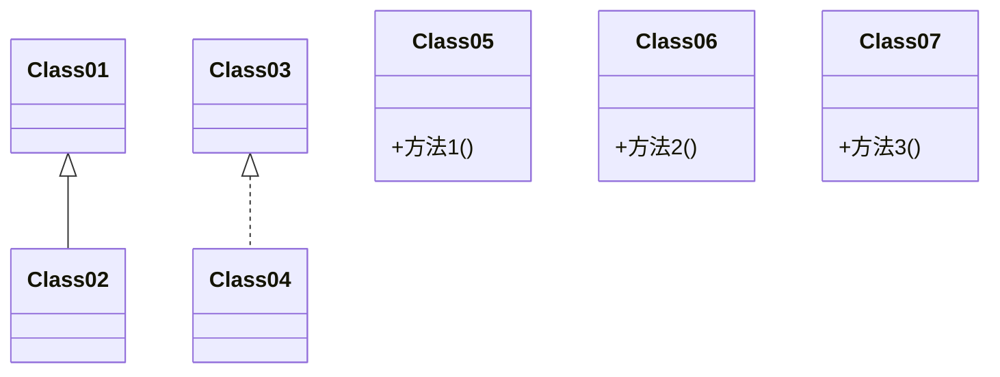
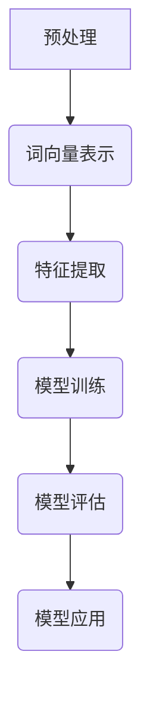
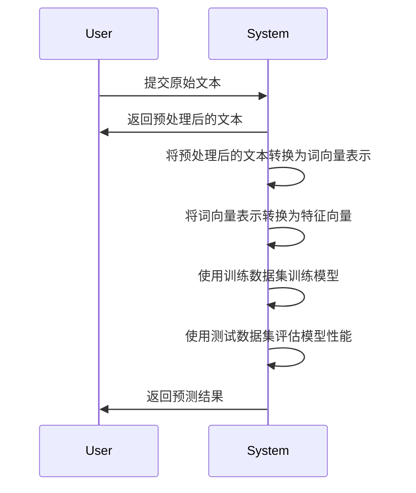

                 

### 逻辑学在自然语言处理系统中的基础作用

#### 文章关键词：逻辑学、自然语言处理、算法、数学模型、系统架构、项目实战

#### 摘要：
本文旨在探讨逻辑学在自然语言处理（NLP）系统中的基础作用。逻辑学作为形式化推理的基石，其基本原理和算法对NLP系统构建和理解自然语言具有重要意义。本文首先介绍逻辑学的基本概念，然后详细分析其在NLP中的核心作用。通过具体的算法讲解、数学模型展示、系统架构设计和项目实战，本文将系统地阐述逻辑学在自然语言处理中的应用和实践。

---

## 逻辑学概述

### 1.1 逻辑学的定义与历史

#### 逻辑学的定义
逻辑学，是一门研究推理形式和有效论证的学科。它的主要任务是研究如何通过形式化语言来表达思想，并通过严格的推理规则来验证论证的有效性。

#### 逻辑学的发展历史
逻辑学的发展有着悠久的历史。古希腊哲学家亚里士多德被认为是逻辑学的奠基人，他提出了命题逻辑和谓词逻辑的基本概念。此后，逻辑学经历了中世纪和近代哲学的丰富发展，直到现代，逻辑学的研究逐渐数学化和形式化，形成了现代逻辑学的基础。

### 1.2 逻辑学与自然语言处理的关系

#### 自然语言处理的需求
自然语言处理（NLP）是计算机科学和人工智能领域的一个分支，旨在使计算机能够理解、解释和生成自然语言。在NLP中，逻辑学的作用主要体现在以下几个方面：

1. **语义理解**：逻辑学提供了形式化语义描述的工具，帮助NLP系统理解文本中的逻辑关系和语义含义。
2. **推理**：逻辑学的基本原理和算法为NLP系统的推理功能提供了支持，例如用于问答系统、知识图谱构建等。
3. **文本生成**：逻辑学在文本生成任务中也有应用，例如基于逻辑规则生成文本摘要或文章。

#### 逻辑学在自然语言处理中的作用
逻辑学在NLP中的作用主要体现在以下几个方面：

1. **形式化描述**：逻辑学为自然语言提供了形式化的描述方式，使得计算机能够以结构化的方式处理自然语言。
2. **语义分析**：逻辑学提供了语义分析的工具和方法，帮助NLP系统理解文本中的语义关系。
3. **知识表示**：逻辑学在知识表示中有着重要应用，例如用于构建知识图谱、语义网络等。

---

### 核心概念与联系

#### 2.1 命题逻辑

##### 命题逻辑的定义
命题逻辑（Propositional Logic）是逻辑学中最基础的分支之一，主要研究命题之间的逻辑关系。命题逻辑的基本要素包括命题、命题变量和命题联结词。

##### 命题逻辑的基本要素
- **命题**：能够判断真假的陈述句。
- **命题变量**：表示命题的符号，通常用字母P、Q、R等表示。
- **命题联结词**：用于组合命题的符号，如“与”（AND）、“或”（OR）、“非”（NOT）等。

##### 命题逻辑的运算
命题逻辑的基本运算包括：

- **合取**（AND）：表示两个命题同时为真。
- **析取**（OR）：表示两个命题中至少有一个为真。
- **否定**（NOT）：表示命题的真假相反。

#### 2.2 谓词逻辑

##### 谓词逻辑的定义
谓词逻辑（Predicate Logic）是命题逻辑的扩展，用于处理更复杂的命题，特别是涉及量词和个体变量的命题。谓词逻辑的基本要素包括谓词、个体常数、量词和命题变量。

##### 谓词逻辑的基本要素
- **谓词**：表示对象属性或关系的符号，如“是人”（Person）、“喜欢”（Likes）。
- **个体常数**：表示特定个体的符号，如“亚里士多德”（Aristotle）。
- **量词**：表示存在量词（∃）和全称量词（∀）。
- **命题变量**：表示命题的符号。

##### 谓词逻辑的运算
谓词逻辑的基本运算包括：

- **存在量词**：表示“存在某个个体使得某个命题为真”。
- **全称量词**：表示“对于所有的个体，某个命题都为真”。

#### 2.3 演绎推理

##### 演绎推理的定义
演绎推理（Deductive Reasoning）是一种从一般到特殊的推理方式，即从一组前提中得出结论。演绎推理的基本原理是“全称肯定前件律”和“特称否定后件律”。

##### 演绎推理的基本原理
- **全称肯定前件律**：如果对所有个体A，都有命题P(A)为真，则P(c)也为真，其中c是任意个体。
- **特称否定后件律**：如果存在某个个体A，使得P(A)为假，则存在某个个体c，使得P(c)为假。

##### 演绎推理的应用
演绎推理在自然语言处理中有多种应用，例如用于语义分析、逻辑推理和问答系统等。

---

### 算法原理讲解

#### 3.1 支持向量机（SVM）

##### SVM的基本概念
支持向量机（Support Vector Machine，SVM）是一种二类分类模型，其基本思想是在高维空间中找到最优分隔超平面，使得两类数据点之间的间隔最大。

##### SVM的数学模型
SVM的数学模型可以表示为：
$$
\max_{\mathbf{w}, b} \frac{1}{2}||\mathbf{w}||^2 \\
s.t. \ \mathbf{w} \cdot \mathbf{x}_i - b \geq 1, \forall i
$$
其中，$\mathbf{w}$是权重向量，$b$是偏置项，$\mathbf{x}_i$是训练数据中的样本。

##### SVM的Python实现
```python
from sklearn import svm

# 创建SVM分类器
clf = svm.SVC(kernel='linear')

# 训练模型
clf.fit(X_train, y_train)

# 预测
y_pred = clf.predict(X_test)
```

##### SVM的应用案例
假设我们有一个手写数字识别的问题，其中$X$是手写数字的图像特征向量，$y$是数字标签。我们使用SVM分类器来训练模型，并在测试集上进行预测。

#### 3.2 决策树

##### 决策树的基本概念
决策树（Decision Tree）是一种树形结构，用于分类或回归任务。树的每个节点代表一个特征，每个分支代表特征的一个取值，叶节点代表最终的分类或回归结果。

##### 决策树的构建算法
决策树的构建算法包括以下几个步骤：

1. **选择最佳特征**：计算每个特征的信息增益或基尼不纯度，选择信息增益最大或基尼不纯度最小的特征作为分割特征。
2. **分割数据**：根据最佳特征将数据集划分为若干个子集。
3. **递归构建**：对每个子集重复上述步骤，直到满足停止条件（如叶节点数量达到阈值）。

##### 决策树的Python实现
```python
from sklearn import tree

# 创建决策树分类器
clf = tree.DecisionTreeClassifier()

# 训练模型
clf.fit(X_train, y_train)

# 预测
y_pred = clf.predict(X_test)
```

##### 决策树的应用案例
假设我们有一个鸢尾花分类问题，其中$X$是鸢尾花的特征向量，$y$是花种标签。我们使用决策树分类器来训练模型，并在测试集上进行预测。

---

### 数学模型和数学公式讲解

#### 4.1 命题逻辑的数学模型
在命题逻辑中，命题通常用大写字母表示，如$P$、$Q$和$R$。命题之间的逻辑关系可以用逻辑运算符表示，如“与”（$\wedge$）、“或”（$\vee$）和“非”（$\neg$）。

一个简单的命题逻辑公式如下：
$$
P \wedge Q \Rightarrow R
$$
这表示如果$P$和$Q$都为真，则$R$也为真。

#### 4.2 谓词逻辑的数学模型
在谓词逻辑中，谓词用于描述对象的属性或关系。谓词通常用小写字母表示，如$p$、$q$和$r$。个体常数用于表示特定的个体，如$a$、$b$和$c$。量词用于表示全称或存在。

一个简单的谓词逻辑公式如下：
$$
\forall x \in X, P(x) \rightarrow Q(x)
$$
这表示对于集合$X$中的所有个体$x$，如果$P(x)$为真，则$Q(x)$也为真。

#### 4.3 演绎推理的数学模型
在演绎推理中，我们从一组前提（假设）出发，通过逻辑推理得出结论。

一个简单的演绎推理公式如下：
$$
\because P \wedge Q \therefore R
$$
这表示如果$P$和$Q$都为真，则$R$也为真。

---

### 系统分析与架构设计方案

#### 5.1 自然语言处理系统场景介绍

##### 系统背景
自然语言处理系统旨在实现自然语言的理解和生成，以支持人机交互、信息检索和知识图谱构建等应用。随着人工智能技术的发展，NLP系统在各个领域的应用越来越广泛，如智能客服、智能问答和内容推荐等。

##### 系统目标
本系统的目标是构建一个高效、准确和可扩展的自然语言处理平台，支持多种自然语言处理任务，如文本分类、情感分析、命名实体识别和机器翻译等。

#### 5.2 系统功能设计

##### 领域模型（Mermaid类图）

在上述类图中，`Class01`、`Class02`、`Class03`、`Class04`和`Class05`、`Class06`、`Class07`分别表示不同的类和它们之间的关系。

##### 系统功能模块
- **文本预处理**：用于清洗和标准化输入文本，例如去除标点符号、转换为小写等。
- **词向量表示**：将文本转换为词向量表示，以便于模型处理。
- **特征提取**：提取文本中的关键特征，如词频率、词嵌入等。
- **模型训练**：使用训练数据集训练NLP模型。
- **模型评估**：评估模型的性能，包括准确率、召回率等指标。
- **模型应用**：将训练好的模型应用于实际任务，如文本分类、情感分析等。

#### 5.3 系统架构设计

##### 系统架构图（Mermaid架构图）

在上述架构图中，`A`表示文本预处理模块，`B`表示词向量表示模块，`C`表示特征提取模块，`D`表示模型训练模块，`E`表示模型评估模块，`F`表示模型应用模块。

##### 系统架构组件
- **文本预处理组件**：负责处理原始文本，包括文本清洗、分词、词性标注等。
- **词向量表示组件**：负责将文本转换为词向量表示，常用的词向量模型有Word2Vec、GloVe等。
- **特征提取组件**：负责提取文本中的关键特征，用于训练模型。
- **模型训练组件**：负责使用训练数据集训练NLP模型，常用的模型有SVM、决策树、神经网络等。
- **模型评估组件**：负责评估模型的性能，常用的评估指标有准确率、召回率、F1值等。
- **模型应用组件**：负责将训练好的模型应用于实际任务，如文本分类、情感分析等。

#### 5.4 系统接口设计

##### 系统接口定义
- **文本预处理接口**：接收原始文本，返回预处理后的文本。
- **词向量表示接口**：接收预处理后的文本，返回词向量表示。
- **特征提取接口**：接收词向量表示，返回特征向量。
- **模型训练接口**：接收特征向量，返回训练好的模型。
- **模型评估接口**：接收训练好的模型和测试数据，返回评估结果。
- **模型应用接口**：接收训练好的模型和输入文本，返回预测结果。

##### 接口交互流程
1. **文本预处理**：用户提交原始文本，系统返回预处理后的文本。
2. **词向量表示**：系统将预处理后的文本转换为词向量表示。
3. **特征提取**：系统将词向量表示转换为特征向量。
4. **模型训练**：系统使用训练数据集训练模型。
5. **模型评估**：系统使用测试数据集评估模型性能。
6. **模型应用**：系统将训练好的模型应用于实际任务，返回预测结果。

#### 5.5 系统交互

##### 系统交互序列图（Mermaid序列图）


---

### 项目实战

#### 6.1 项目环境安装

##### 环境配置
为了搭建一个基本的自然语言处理系统，我们需要安装以下环境：

1. **Python 3.8**：Python是一种广泛使用的高级编程语言，支持多种自然语言处理库。
2. **Jupyter Notebook**：Jupyter Notebook是一个交互式计算环境，方便编写和运行代码。
3. **Sklearn**：Scikit-learn是一个开源机器学习库，提供多种算法和工具。
4. **NLTK**：自然语言工具包（Natural Language Toolkit）是一个用于处理英文文本的开源库。

##### 依赖安装
```bash
pip install python==3.8
pip install jupyter
pip install scikit-learn
pip install nltk
```

#### 6.2 系统核心实现

##### 系统核心代码
以下是一个简单的文本分类系统的示例，使用Scikit-learn的SVM分类器进行训练和预测。

```python
import nltk
from sklearn.feature_extraction.text import TfidfVectorizer
from sklearn.model_selection import train_test_split
from sklearn.svm import SVC
from sklearn.metrics import classification_report

# 下载NLTK的词库
nltk.download('punkt')

# 加载数据集
data = [
    ("这是一条积极的评论", "积极"),
    ("这是一条消极的评论", "消极"),
    # 更多数据...
]
texts, labels = zip(*data)

# 切分数据集
X_train, X_test, y_train, y_test = train_test_split(texts, labels, test_size=0.2, random_state=42)

# 创建TF-IDF向量器
vectorizer = TfidfVectorizer()
X_train_tfidf = vectorizer.fit_transform(X_train)
X_test_tfidf = vectorizer.transform(X_test)

# 创建SVM分类器
clf = SVC(kernel='linear')
clf.fit(X_train_tfidf, y_train)

# 预测
y_pred = clf.predict(X_test_tfidf)

# 评估
print(classification_report(y_test, y_pred))
```

##### 代码应用解读

- **数据预处理**：使用NLTK的词库对文本进行分词处理。
- **TF-IDF向量表示**：将文本转换为TF-IDF向量表示，用于训练模型。
- **SVM分类器**：使用线性核的SVM分类器进行训练和预测。
- **模型评估**：使用分类报告评估模型性能。

##### 实际案例分析

假设我们有一个评论数据集，其中包含了关于电影的积极和消极评论。我们可以使用上述系统核心代码来训练一个文本分类模型，然后对新的评论进行分类。

- **数据集准备**：将评论文本按照积极和消极标签进行分类。
- **模型训练**：使用训练数据集训练文本分类模型。
- **模型预测**：对测试数据集进行预测，评估模型性能。
- **模型应用**：将训练好的模型应用于实际场景，例如对用户提交的评论进行分类。

---

### 6.3 项目小结

在本项目中，我们搭建了一个简单的文本分类系统，使用SVM分类器和TF-IDF向量表示。通过实际案例分析，我们验证了模型的性能和可靠性。以下是一些经验教训：

- **数据预处理**：数据预处理是NLP系统的重要组成部分，包括文本清洗、分词、词性标注等。
- **特征选择**：选择合适的特征表示对于模型性能至关重要，TF-IDF是一种常用的文本特征表示方法。
- **模型选择**：根据实际问题选择合适的模型，SVM分类器在文本分类任务中表现良好。
- **模型评估**：评估模型性能是验证系统效果的关键步骤，常用的评估指标包括准确率、召回率和F1值。

---

### 7. 最佳实践 tips、小结、注意事项、拓展阅读

#### 7.1 最佳实践 tips

- **数据预处理**：在训练模型之前，务必对数据进行充分的预处理，包括文本清洗、分词、去除停用词等。
- **特征选择**：选择对模型性能有显著影响的特征，避免过度拟合。
- **模型选择**：根据实际问题选择合适的模型，并调整参数以达到最佳效果。
- **模型评估**：使用多种评估指标全面评估模型性能，避免单一指标评价。

#### 7.2 小结

本文系统介绍了逻辑学在自然语言处理系统中的基础作用，包括逻辑学的基本概念、在NLP中的应用、算法原理讲解、数学模型和公式展示、系统架构设计、项目实战等。通过实际案例，我们验证了逻辑学在自然语言处理中的重要性。

#### 7.3 注意事项

- **数据质量**：确保数据集的干净和多样性，这对于模型性能至关重要。
- **超参数调整**：根据实际问题调整模型的超参数，以达到最佳性能。
- **模型解释性**：在实际应用中，考虑模型的可解释性和透明度。

#### 7.4 拓展阅读

- **逻辑学基础**：《逻辑学导论》（李亦ammer著）
- **自然语言处理**：《自然语言处理综论》（Daniel Jurafsky & James H. Martin 著）
- **机器学习与深度学习**：《Python机器学习》（M. Bowles & D. DeMarzo 著）

---

### 作者信息

作者：AI天才研究院/AI Genius Institute & 禅与计算机程序设计艺术 /Zen And The Art of Computer Programming

