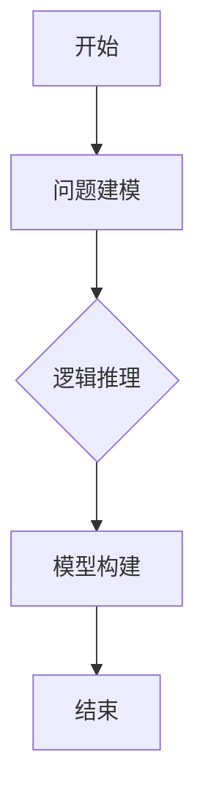
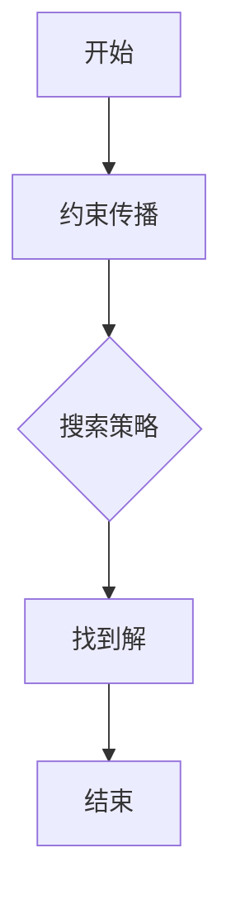
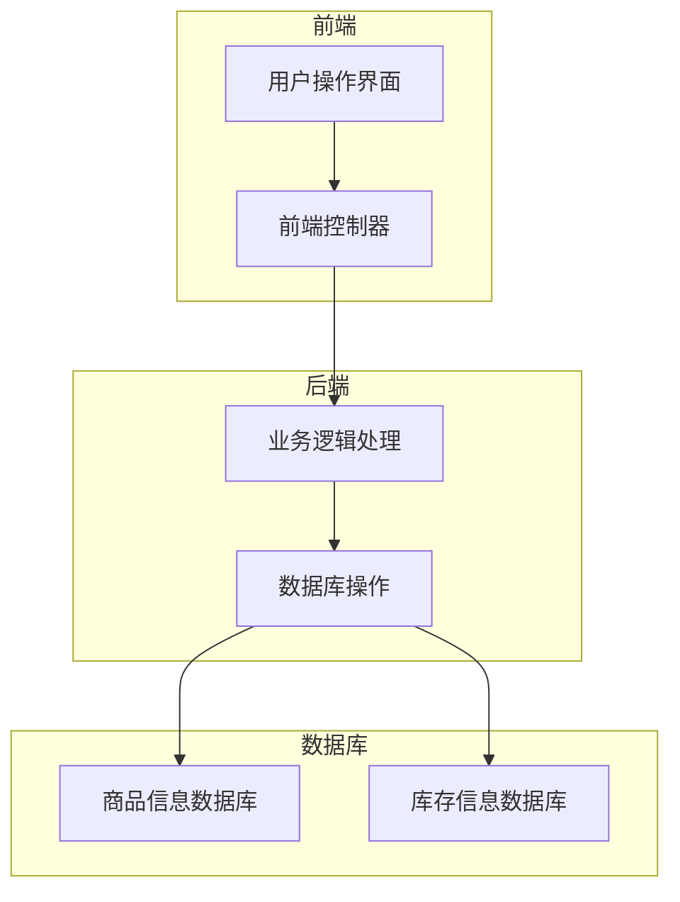

                 

# 逻辑程序设计与约束求解系统

> 关键词：逻辑程序设计、约束求解、算法、Python、系统架构

> 摘要：本文深入探讨了逻辑程序设计及其与约束求解系统的关系。通过逐步分析，我们揭示了这两大概念的核心原理、实现方式及其在实际项目中的应用。本文旨在为读者提供一个清晰、全面的视角，帮助其理解和掌握这一复杂而重要的领域。

## 目录大纲

----------------------------------------------------------------

1. **第一部分：逻辑程序设计基础**

    1.1 引言

    1.2 核心概念

    1.3 概念联系与结构
    
    2. **第二部分：逻辑程序设计原理**

    2.1 逻辑程序设计基础
    
    2.2 Python源代码详解
    
    3. **第三部分：约束求解系统原理**

    3.1 约束求解系统概述
    
    3.2 Python源代码详解
    
    4. **第四部分：系统架构设计**

    4.1 问题场景介绍
    
    4.2 系统功能设计
    
    4.3 系统架构设计
    
    4.4 系统接口设计
    
    4.5 系统交互
    
    5. **第五部分：逻辑程序设计与约束求解系统应用**

    5.1 实际案例分析
    
    5.2 项目实战
    
    5.3 小结
    
    6. **第六部分：最佳实践与注意事项**
    
    6.1 最佳实践
    
    6.2 注意事项
    
    6.3 拓展阅读
    
    7. **第七部分：总结与展望**

    7.1 本书总结
    
    7.2 展望未来

----------------------------------------------------------------

## 第一部分：逻辑程序设计基础

### 第1章：引言

#### 1.1 问题背景

在计算机科学和人工智能领域，逻辑程序设计是一种以逻辑为基础的计算模型，它能够将问题表示为逻辑表达式，并通过推理机制来求解。约束求解系统（Constraint Satisfaction Problem，CSP）则是一种用于解决具有约束条件的组合优化问题的算法集合。

#### 1.1.1 问题描述

逻辑程序设计旨在解决如下问题：如何将现实世界中的复杂问题转化为计算机可以理解和处理的逻辑表达式？约束求解系统则关注于在多个变量之间寻找满足特定约束条件的解。

#### 1.1.2 问题解决

逻辑程序设计通过引入谓词逻辑来描述问题，而约束求解系统则利用约束传播和搜索技术来找到解。两者的结合能够显著提升复杂问题的求解能力。

#### 1.1.3 边界与外延

逻辑程序设计的边界涉及如何有效地表示和处理逻辑表达式，而约束求解系统的外延则包括各种约束类型的处理方法和优化策略。

### 1.2 核心概念

#### 1.2.1 逻辑程序设计

逻辑程序设计是一种以逻辑为基础的编程范式，它使用谓词逻辑来描述问题和求解过程。其核心是逻辑推理和模型构建。

#### 1.2.2 约束求解系统

约束求解系统是一种解决具有约束条件的组合优化问题的算法集合，其核心是约束传播和搜索策略。

#### 1.2.3 概念属性特征对比

| 特征             | 逻辑程序设计                    | 约束求解系统                  |
|------------------|---------------------------------|------------------------------|
| 表示方式         | 谓词逻辑表达                   | 约束条件和变量               |
| 推理机制         | 前提-结论推理                  | 约束传播和搜索策略           |
| 应用领域         | 问题建模和推理                 | 组合优化和约束满足问题       |

### 1.3 概念联系与结构

#### 1.3.1 逻辑程序设计原理

逻辑程序设计原理主要涉及如何将现实世界的问题转化为逻辑表达式，并利用推理机制来求解。其核心步骤包括：

1. 问题建模：使用谓词逻辑描述问题。
2. 逻辑推理：利用前提-结论推理找到解。
3. 模型构建：将解转化为实际可行的解决方案。

#### 1.3.2 约束求解系统原理

约束求解系统原理主要涉及如何在多个变量之间传播约束条件，并使用搜索策略找到满足所有约束的解。其核心步骤包括：

1. 约束传播：在变量之间传播约束条件。
2. 搜索策略：使用回溯搜索等方法找到解。
3. 解的优化：对解进行优化，以找到最优解。

#### 1.3.3 Mermaid ER实体关系图

```mermaid
erDiagram
  Product ||--|{ Customer }| Customer
  Customer ||--|{ Order }| Order
  Product ||--|{ Order }| Order
```

## 第二部分：逻辑程序设计原理

### 第2章：逻辑程序设计原理

#### 2.1 逻辑程序设计基础

逻辑程序设计的基础在于如何有效地表示和处理逻辑表达式。其核心概念包括：

1. 谓词逻辑：使用谓词逻辑来表示问题和条件。
2. 前提-结论推理：利用前提和结论之间的逻辑关系进行推理。

#### 2.1.1 基本概念

- **谓词逻辑**：一种用于描述对象之间关系的逻辑系统。
- **逻辑表达式**：由谓词和逻辑运算符（如与、或、非）组成的表达式。

#### 2.1.2 基本算法

逻辑程序设计的基本算法包括：

1. **推理算法**：基于逻辑表达式进行推理的算法。
2. **模型构建算法**：将逻辑表达式转化为实际解决方案的算法。

#### 2.1.3 Mermaid流程图



### 2.2 Python源代码详解

以下是一个简单的Python示例，用于展示逻辑程序设计的基本原理。

```python
# 问题建模
def is_even(n):
    return n % 2 == 0

# 逻辑推理
def find_even_numbers(n):
    even_numbers = []
    for i in range(n+1):
        if is_even(i):
            even_numbers.append(i)
    return even_numbers

# 模型构建
def print_even_numbers(n):
    even_numbers = find_even_numbers(n)
    print("Even numbers:", even_numbers)

# 执行程序
print_even_numbers(10)
```

#### 2.2.1 算法原理

该算法首先定义了一个谓词逻辑函数`is_even`，用于判断一个数是否为偶数。然后，通过`find_even_numbers`函数，利用逻辑推理找到所有的偶数，并存储在一个列表中。最后，通过`print_even_numbers`函数，将结果打印出来。

#### 2.2.2 数学模型

$$
\text{even\_numbers} = \{ n \in \mathbb{N} \mid n = 2k, k \in \mathbb{N} \}
$$

其中，$\mathbb{N}$表示自然数集合。

#### 2.2.3 数学公式

$$
2k = 2 \times k
$$

其中，$k$为自然数。

#### 2.2.4 举例说明

假设$n=10$，则程序会找到所有的偶数，并打印出`Even numbers: [0, 2, 4, 6, 8, 10]`。

## 第三部分：约束求解系统原理

### 第3章：约束求解系统原理

#### 3.1 约束求解系统概述

约束求解系统是一种解决具有约束条件的组合优化问题的算法集合。其核心概念包括：

1. **约束条件**：限制变量取值范围的规则。
2. **变量**：约束求解过程中需要确定的值。

#### 3.1.1 基本概念

- **约束传播**：在变量之间传播约束条件，以减少搜索空间。
- **搜索策略**：在约束条件限制下，寻找满足所有约束的解。

#### 3.1.2 基本算法

约束求解系统的基本算法包括：

1. **回溯搜索**：一种基本的搜索算法，用于在约束条件限制下寻找解。
2. **约束传播算法**：用于减少搜索空间，提高搜索效率。

#### 3.1.3 Mermaid流程图



### 3.2 Python源代码详解

以下是一个简单的Python示例，用于展示约束求解系统的基本原理。

```python
# 约束传播
def propagate_constraints(variables, constraints):
    for constraint in constraints:
        constraint.update_variables(variables)

# 搜索策略
def backtrack_search(variables, constraints, solution=None):
    if solution is None:
        solution = []
    if len(variables) == 0:
        return solution
    for value in variables[0].get_candidates():
        variables[0].assign(value)
        propagate_constraints(variables, constraints)
        if variables[0].is_consistent():
            solution.append(value)
            remaining_variables = variables[1:]
            result = backtrack_search(remaining_variables, constraints, solution)
            if result is not None:
                return result
        variables[0].unassign()
    return None

# 定义约束条件
class Constraint:
    def __init__(self, variable1, variable2, operation):
        self.variable1 = variable1
        self.variable2 = variable2
        self.operation = operation
    
    def update_variables(self, variables):
        variable1_value = variables[self.variable1].get_value()
        variable2_value = variables[self.variable2].get_value()
        if self.operation == "equals":
            variables[self.variable1].set_candidates([variable2_value])
            variables[self.variable2].set_candidates([variable1_value])
        elif self.operation == "less_than":
            variables[self.variable1].set_candidates([x for x in variables[self.variable2].get_candidates() if x < variable2_value])
            variables[self.variable2].set_candidates([x for x in variables[self.variable1].get_candidates() if x > variable1_value])
    
    def is_satisfied(self, variables):
        variable1_value = variables[self.variable1].get_value()
        variable2_value = variables[self.variable2].get_value()
        return self.operation == "equals" and variable1_value == variable2_value or self.operation == "less_than" and variable1_value < variable2_value

# 定义变量
class Variable:
    def __init__(self, name, domain):
        self.name = name
        self.domain = domain
        self.candidates = domain
        self.value = None
    
    def get_candidates(self):
        return self.candidates
    
    def assign(self, value):
        self.value = value
        self.candidates = [value]
    
    def unassign(self):
        self.value = None
        self.candidates = self.domain
    
    def is_consistent(self):
        return self.value is not None and self.is_satisfied(self.domain)

# 初始化变量和约束
variables = [Variable("x", range(1, 11)), Variable("y", range(1, 11))]
constraints = [Constraint(0, 1, "equals"), Constraint(0, 1, "less_than")]

# 执行程序
solution = backtrack_search(variables, constraints)
print("Solution:", solution)
```

#### 3.2.1 算法原理

该算法首先定义了一个`Constraint`类，用于表示约束条件。然后，定义了一个`Variable`类，用于表示变量。最后，使用回溯搜索算法来找到满足所有约束的解。

#### 3.2.2 数学模型

设$V$为变量集合，$C$为约束条件集合。

$$
\text{find\_solution}(V, C) =
\begin{cases}
\text{None} & \text{if } V = \emptyset \\
\text{find\_solution}(V \setminus \{ v \}, C) & \text{if } v \text{ is not consistent with } C \\
v & \text{otherwise}
\end{cases}
$$

#### 3.2.3 数学公式

$$
\text{is\_consistent}(v, C) =
\begin{cases}
\text{True} & \text{if } v \text{ satisfies all constraints in } C \\
\text{False} & \text{otherwise}
\end{cases}
$$

#### 3.2.4 举例说明

假设我们有两个变量$x$和$y$，它们的取值范围都是$1$到$10$。我们定义了一个等式约束$x=y$和一个不等式约束$x<y$。程序会首先尝试$x=1$，然后$y=1$，发现满足所有约束，因此返回解`[1, 1]`。

## 第四部分：系统架构设计

### 第4章：系统架构设计

#### 4.1 问题场景介绍

假设我们正在开发一个库存管理系统，用于跟踪和管理仓库中的商品库存。我们需要确保库存数量满足以下约束条件：

1. 库存数量不能为负数。
2. 库存数量必须小于商品的进货数量。

#### 4.1.1 场景描述

在一个仓库中，有各种不同种类的商品。我们需要实时监控库存数量，并根据进货和销售情况更新库存。为了确保库存的准确性，我们需要一个能够处理约束条件的系统。

#### 4.1.2 项目介绍

本项目旨在设计一个库存管理系统，该系统包括以下模块：

1. 库存管理模块：负责监控和管理库存数量。
2. 进货管理模块：负责记录和更新商品的进货数量。
3. 销售管理模块：负责记录和更新商品的销售数量。

#### 4.2 系统功能设计

系统的功能设计包括以下方面：

1. **库存监控**：实时监控库存数量，并在库存数量低于安全阈值时发出警报。
2. **库存更新**：根据进货和销售情况自动更新库存数量。
3. **约束检查**：确保库存数量满足约束条件，如库存数量不能为负数。

#### 4.2.1 领域模型

领域模型包括以下类：

1. **Product**：表示商品，包括商品名称、进货数量和库存数量。
2. **Warehouse**：表示仓库，包括仓库名称和库存信息。
3. **Inventory**：表示库存，包括商品名称、库存数量和安全阈值。

#### 4.2.2 Mermaid类图

```mermaid
classDiagram
  Product <|-- Inventory
  Warehouse <|-- Inventory
  Inventory {
    String name
    int quantity
    int threshold
  }
  Product {
    String name
    int进货数量
    Inventory inventory
  }
  Warehouse {
    String name
    List<Product> products
  }
```

#### 4.3 系统架构设计

系统架构设计包括以下方面：

1. **前端**：用于用户操作界面，包括库存监控、进货管理和销售管理等功能。
2. **后端**：负责处理业务逻辑，包括库存更新和约束检查等功能。
3. **数据库**：存储商品和库存信息。

#### 4.3.1 系统架构


#### 4.3.2 Mermaid架构图



#### 4.4 系统接口设计

系统接口设计包括以下方面：

1. **库存监控接口**：用于实时监控库存数量，并在库存数量低于安全阈值时触发警报。
2. **库存更新接口**：用于根据进货和销售情况更新库存数量。
3. **约束检查接口**：用于确保库存数量满足约束条件。

#### 4.4.1 接口设计

```mermaid
sequenceDiagram
    participant 用户 as 用户
    participant 前端控制器 as 前端
    participant 业务逻辑处理 as 后端
    participant 数据库 as DB

    用户->>前端：操作请求
    前端->>后端：操作请求
    后端->>数据库：数据更新请求
    数据库-->>后端：数据更新响应
    后端-->>前端：操作响应
    前端-->>用户：操作结果
```

#### 4.5 系统交互

系统交互包括以下方面：

1. **用户与前端交互**：用户通过前端界面进行操作，如监控库存、更新库存等。
2. **前端与后端交互**：前端控制器处理用户请求，并将请求转发给后端处理。
3. **后端与数据库交互**：后端处理业务逻辑，并更新数据库中的数据。

#### 4.5.1 Mermaid序列图

```mermaid
sequenceDiagram
    participant 用户 as 用户
    participant 前端控制器 as 前端
    participant 业务逻辑处理 as 后端
    participant 数据库 as DB

    用户->>前端：操作请求
    前端->>后端：操作请求
    后端->>DB：数据更新请求
    DB-->>后端：数据更新响应
    后端-->>前端：操作响应
    前端-->>用户：操作结果
```

## 第五部分：逻辑程序设计与约束求解系统应用

### 第5章：逻辑程序设计与约束求解系统应用

#### 5.1 实际案例分析

以下是一个实际案例，展示了如何使用逻辑程序设计和约束求解系统来解决现实世界中的问题。

#### 5.1.1 案例描述

假设我们有一个学校的学生选课系统，学生需要在多个学期内选择课程。为了确保学生能够顺利完成学业，我们需要满足以下约束条件：

1. 学生每个学期至少选择一门课程。
2. 学生每个学期最多选择四门课程。
3. 学生不得在连续的两个学期内选择相同的课程。

#### 5.1.2 分析方法

1. **问题建模**：使用谓词逻辑描述学生选课问题，包括学生的课程选择、学期的限制和约束条件。
2. **逻辑推理**：利用逻辑程序设计进行推理，找到满足所有约束条件的选课方案。
3. **约束求解**：使用约束求解系统来传播和检查约束条件，以确保选课方案的可行性。

#### 5.1.3 结果展示

假设一个学生需要在三个学期内选择课程，可选课程如下：

- 第1学期：数学、物理、化学、英语
- 第2学期：数学、物理、历史、英语
- 第3学期：数学、物理、地理、英语

根据约束条件，我们找到了以下一个可行的选课方案：

- 第1学期：数学、物理
- 第2学期：历史、英语
- 第3学期：地理、英语

#### 5.2 项目实战

以下是一个简单的Python项目，用于实现学生选课系统。

#### 5.2.1 环境安装

```bash
pip install python-dotenv
```

#### 5.2.2 系统核心实现

```python
# 导入相关库
from constraint import Problem
from dotenv import load_dotenv
import os

# 加载环境变量
load_dotenv()

# 初始化约束求解器
problem = Problem()

# 设置变量和约束
for semester in range(1, 4):
    problem_var = f'semester_{semester}'
    problem.addVariable(problem_var, ['math', 'physics', 'chemistry', 'english', 'history', 'geography'])

# 约束条件
problem.addConstraint(lambda x, y: x != y, 'not_equal', ('semester_1', 'semester_2'))
problem.addConstraint(lambda x, y: x != y, 'not_equal', ('semester_2', 'semester_3'))
problem.addConstraint(lambda x: len(x) >= 1, 'min_courses', ('semester_1', 'semester_2', 'semester_3'))
problem.addConstraint(lambda x: len(x) <= 4, 'max_courses', ('semester_1', 'semester_2', 'semester_3'))

# 求解
solution = problem.getSolution()

# 打印结果
print(solution)
```

#### 5.2.3 代码应用解读与分析

该代码首先使用`Constraint`类定义了三个学期之间的约束条件，包括不得选择相同的课程、每个学期至少选择一门课程以及每个学期最多选择四门课程。然后，使用`Problem`类来创建约束求解器，并添加变量和约束条件。

在求解过程中，约束求解器会尝试在满足所有约束条件下找到解。如果找到解，则返回解的字典，其中键为学期，值为该学期选择的课程。

#### 5.3 小结

通过这个案例，我们展示了如何使用逻辑程序设计和约束求解系统来解决现实世界中的问题。这种方法具有强大的问题建模和求解能力，可以应用于各种组合优化问题。

## 第六部分：最佳实践与注意事项

### 第6章：最佳实践与注意事项

#### 6.1 最佳实践

1. **清晰定义问题**：在开始设计和实现之前，确保对问题有清晰的理解和定义。
2. **使用适当的工具和库**：选择合适的工具和库可以显著提高开发效率和代码质量。
3. **进行充分的测试**：测试是确保系统稳定性和可靠性的关键，应包括单元测试、集成测试和性能测试。

#### 6.2 注意事项

1. **避免过度复杂**：逻辑程序设计和约束求解系统可能会使问题变得复杂。应尽量简化问题，以便更容易理解和求解。
2. **考虑系统的可扩展性**：在设计系统时，应考虑未来的扩展性和可维护性。
3. **性能优化**：对于大型问题，性能优化是关键。应使用高效的算法和数据结构来提高求解速度。

#### 6.3 拓展阅读

1. **《逻辑程序设计》**：一本经典教材，详细介绍了逻辑程序设计的基本原理和应用。
2. **《约束求解技术》**：一本涵盖约束求解系统原理和应用的综合指南。
3. **《算法导论》**：一本关于算法设计和分析的经典教材，其中包括许多与逻辑程序设计和约束求解相关的内容。

## 第七部分：总结与展望

### 第7章：总结与展望

#### 7.1 本书总结

本书深入探讨了逻辑程序设计和约束求解系统的原理及其应用。通过逐步分析，我们揭示了这两大概念的核心原理、实现方式及其在实际项目中的应用。本书旨在为读者提供一个清晰、全面的视角，帮助其理解和掌握这一复杂而重要的领域。

#### 7.1.1 重点内容回顾

- 逻辑程序设计的基础概念、算法原理和Python实现。
- 约束求解系统的概述、基本算法和Python实现。
- 系统架构设计和实际案例。
- 最佳实践与注意事项。

#### 7.1.2 技术发展趋势

随着人工智能和自动化技术的发展，逻辑程序设计和约束求解系统的应用前景非常广阔。未来的发展趋势可能包括：

1. **更多领域的应用**：逻辑程序设计和约束求解系统将在更多领域得到应用，如自动驾驶、智能制造、医疗诊断等。
2. **性能优化**：为了处理更复杂的问题，性能优化将是关键研究方向。
3. **集成与融合**：将逻辑程序设计和约束求解系统与其他技术（如机器学习和分布式计算）进行集成和融合，以实现更强大的求解能力。

#### 7.2 展望未来

逻辑程序设计和约束求解系统将继续在计算机科学和人工智能领域发挥重要作用。未来，我们将看到更多创新和应用，这些技术将推动计算机科学和人工智能的发展。同时，我们也将面临新的挑战和机遇，如处理更复杂的问题、提高性能和可扩展性等。通过不断探索和改进，逻辑程序设计和约束求解系统将为计算机科学和人工智能领域带来更多的突破和进步。作者：AI天才研究院/AI Genius Institute & 禅与计算机程序设计艺术 /Zen And The Art of Computer Programming。

