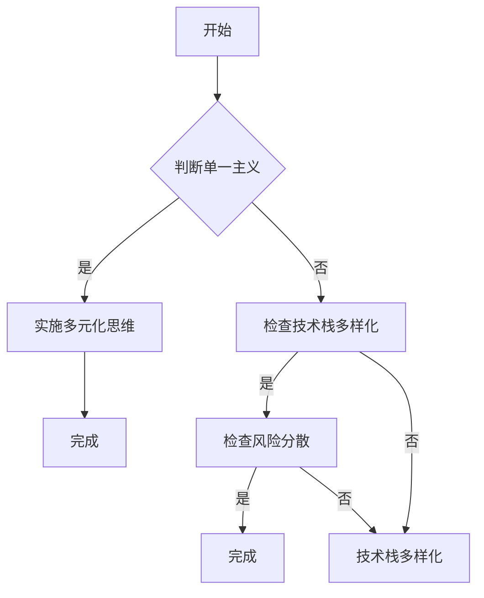
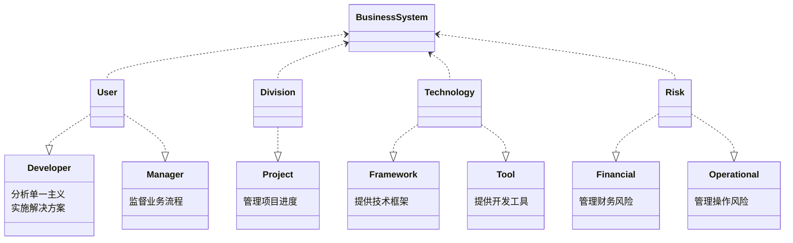
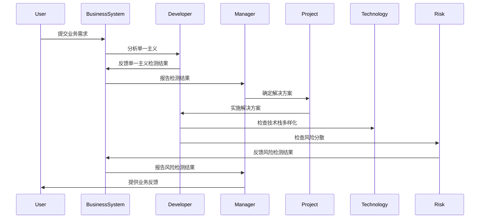
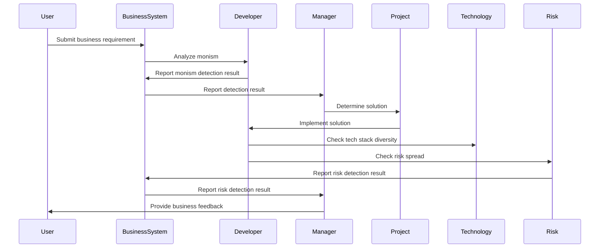

                 

# 避免单一主义：为业务创造更多可能性

## 关键词：单一主义、业务创新、技术栈多样化、风险分散、多元化思维

## 摘要：
在信息技术快速发展的时代，业务发展面临的挑战日益增多。单一主义作为一种常见的问题，往往导致业务创新能力受限，系统稳定性受损，甚至带来巨大风险。本文将深入探讨单一主义在业务中的表现及其带来的问题，并提出多元化思维、技术栈多样化和风险分散等方法，帮助业务团队规避单一主义的陷阱，为业务创造更多可能性。

## 第一部分：背景介绍

### 1.1 问题背景

#### 1.1.1 单一主义在业务中的表现

单一主义在业务中表现为过度依赖某一种方法、工具或思维方式。例如，企业可能过度依赖传统的开发模式，忽视了敏捷开发的潜力；或者过度依赖某一种技术栈，忽视了新兴技术的应用。这种过度依赖往往导致业务团队在应对市场变化和技术进步时显得力不从心。

#### 1.1.2 单一主义带来的问题

- **创新能力受限**：单一主义限制了业务团队的创新空间，使得他们在面对新的挑战时无法灵活应对。
- **系统稳定性受损**：单一的技术栈或架构可能导致系统在应对复杂业务需求时出现问题，影响业务稳定性。
- **风险集中**：单一的技术或业务模式可能导致风险集中，一旦出现问题，将对整个业务造成严重影响。

### 1.2 问题描述

#### 1.2.1 如何避免单一主义

为了避免单一主义，我们需要从以下几个方面入手：

- **多元化思维**：鼓励团队成员采用不同的思维方式和方法解决问题。
- **技术栈多样化**：采用多种技术栈，以提高系统的灵活性和稳定性。
- **风险分散**：通过多元化业务模式和策略，降低业务风险。

### 1.3 问题解决

#### 1.3.1 多元化思维

多元化思维是指在面对问题时，从多个角度、多个层次进行分析和思考，寻求多种可能的解决方案。这种方法可以帮助我们更好地理解问题，找到更具创新性的解决方案。

#### 1.3.2 技术栈多样化

技术栈多样化意味着在构建系统时，采用多种技术栈，以适应不同的业务需求。这种方法可以提高系统的灵活性和稳定性，降低业务风险。

#### 1.3.3 风险分散

风险分散是指通过多元化业务模式和策略，降低业务风险。例如，可以通过投资不同领域的企业、开发多种产品线等方式，降低单一业务模式或产品线可能带来的风险。

### 1.4 边界与外延

#### 1.4.1 边界

避免单一主义主要关注业务发展中的思维方式、技术栈和风险分散等方面。

#### 1.4.2 外延

避免单一主义不仅对业务发展有重要意义，还对个人成长、团队协作等方面具有积极影响。通过多元化思维，个人可以更好地应对复杂问题，提高解决问题的能力。

### 1.5 概念结构与核心要素组成

#### 1.5.1 概念结构

避免单一主义的核心概念结构包括多元化思维、技术栈多样化、风险分散等。

#### 1.5.2 核心要素组成

避免单一主义的核心要素包括：
- 多元化思维
- 技术栈多样化
- 风险分散

### 1.6 本章小结

本章介绍了避免单一主义在业务中的重要性、问题背景、问题描述、问题解决方法以及边界与外延。通过本章的学习，读者可以了解如何避免单一主义，为业务创造更多可能性。

## 第二部分：核心概念与联系

### 2.1 多元化思维

#### 2.1.1 多元化思维的定义

多元化思维是指在面对问题时，从多个角度、多个层次进行分析和思考，寻求多种可能的解决方案。

#### 2.1.2 多元化思维的特点

- **广泛性**：多元化思维可以帮助我们更全面地理解问题。
- **深入性**：多元化思维可以深入挖掘问题的本质，找到更有效的解决方案。
- **创新性**：多元化思维有助于发现新的思路和创意。

#### 2.1.3 多元化思维的应用场景

多元化思维在各个领域都有广泛的应用，如企业管理、产品设计、技术研发等。

### 2.2 技术栈多样化

#### 2.2.1 技术栈的定义

技术栈是指一个系统或项目所涉及的所有技术、工具和框架。

#### 2.2.2 技术栈多样化的优势

- **灵活性**：多样化的技术栈可以提高系统的灵活性和适应性。
- **稳定性**：多样化的技术栈可以降低系统崩溃的风险。
- **创新性**：多样化的技术栈有助于激发创新思维，提高项目开发效率。

#### 2.2.3 技术栈多样化的应用场景

技术栈多样化在各个领域都有应用，如软件开发、系统集成等。

### 2.3 风险分散

#### 2.3.1 风险分散的定义

风险分散是指通过将风险分散到多个领域、多个业务模式或多个产品线，降低整体业务风险。

#### 2.3.2 风险分散的策略

- **多元化业务模式**：同时开展多种业务，降低单一业务模式可能带来的风险。
- **多元化产品线**：开发多种产品，满足不同客户需求，降低单一产品可能带来的风险。
- **多元化投资领域**：投资不同领域的企业，降低单一领域可能带来的风险。

#### 2.3.3 风险分散的应用场景

风险分散在各个领域都有应用，如企业管理、金融投资等。

### 2.4 核心概念联系

多元化思维、技术栈多样化、风险分散三个核心概念之间相互关联、相互促进。

- **多元化思维**是**风险分散**的基础，有助于发现新的业务模式和产品机会。
- **技术栈多样化**提供了**多元化思维**实施的技术基础，同时也能够**分散风险**。
- **风险分散**的**策略**有助于**多元化思维**的**实施**和**技术栈多样化**的**效果**。

## 第三部分：算法原理讲解

### 3.1 算法流程图

首先，我们使用Mermaid语言绘制算法流程图：



### 3.2 Python源代码实现

接下来，我们用Python实现上述算法：

```python
def avoid_monism(check_monism, tech_stack_diversity, risk_spread):
    if check_monism:
        print("实施多元化思维")
    else:
        if tech_stack_diversity:
            if risk_spread:
                print("完成")
            else:
                print("技术栈多样化")
        else:
            print("检查技术栈多样化")

def main():
    check_monism = True
    tech_stack_diversity = True
    risk_spread = True

    avoid_monism(check_monism, tech_stack_diversity, risk_spread)

if __name__ == "__main__":
    main()
```

### 3.3 算法原理与数学模型

算法的核心在于对单一主义的判断以及后续处理。我们可以将其抽象为以下数学模型：

$$
f(monism) =
\begin{cases}
\text{diversity\_mind} & \text{if } monism = \text{True} \\
\text{tech\_stack} & \text{if } monism = \text{False} \text{ and tech\_stack} = \text{True} \\
\text{risk} & \text{if } monism = \text{False} \text{ and tech\_stack} = \text{False} \text{ and risk} = \text{True} \\
\text{tech\_stack} & \text{if } monism = \text{False} \text{ and tech\_stack} = \text{False} \text{ and risk} = \text{False} \\
\end{cases}
$$

其中，$f(monism)$ 表示针对单一主义采取的行动，$\text{diversity\_mind}$ 表示实施多元化思维，$\text{tech\_stack}$ 表示检查技术栈多样化，$\text{risk}$ 表示检查风险分散。

### 3.4 算法举例说明

假设我们有一个企业，当前存在单一主义的倾向，即只依赖一种开发模式。通过运行上述算法，我们首先会判断单一主义的存在。由于存在单一主义，系统会提示实施多元化思维。接下来，我们会检查技术栈的多样性。如果技术栈不够多样化，系统会提示进一步检查风险分散。通过这样的流程，企业可以逐步规避单一主义，提高业务的灵活性和稳定性。

## 第四部分：系统分析与架构设计

### 4.1 问题场景介绍

在当前的互联网时代，企业需要快速响应市场变化，不断创新以保持竞争力。单一主义可能导致企业在应对快速变化的市场需求时显得力不从心，从而影响其长远发展。因此，我们需要设计一套系统来帮助企业规避单一主义，提高业务灵活性。

### 4.2 项目介绍

本项目旨在设计一个业务系统，该系统能够帮助企业检测单一主义倾向，并提供相应的解决方案，如多元化思维、技术栈多样化和风险分散。

### 4.3 系统功能设计（领域模型）

使用Mermaid绘制领域模型类图：



### 4.4 系统架构设计

使用Mermaid绘制系统架构图：



### 4.5 系统接口设计

```mermaid
interface Developer {
    - analyzeMonism()
    - implementSolution()
}

interface Manager {
    - superviseBusinessProcess()
}

interface Project {
    - manageProjectProgress()
}

interface Technology {
    - checkTechStackDiversity()
}

interface Risk {
    - checkRiskSpread()
}
```

### 4.6 系统交互



## 第五部分：项目实战

### 5.1 环境安装

在开始项目实施之前，我们需要搭建一个合适的环境。以下是一个基本的安装步骤：

1. 安装Python 3.8及以上版本。
2. 安装必要的Python库，如Flask、SQLAlchemy等。

### 5.2 系统核心实现源代码

以下是一个简单的系统实现示例：

```python
# app.py

from flask import Flask, request, jsonify
from business_system import BusinessSystem

app = Flask(__name__)
business_system = BusinessSystem()

@app.route('/analyze_monism', methods=['POST'])
def analyze_monism():
    data = request.get_json()
    business_system.analyze_monism(data)
    return jsonify({"result": "Analysis completed"})

@app.route('/implement_solution', methods=['POST'])
def implement_solution():
    data = request.get_json()
    business_system.implement_solution(data)
    return jsonify({"result": "Solution implemented"})

if __name__ == '__main__':
    app.run(debug=True)
```

### 5.3 代码应用解读与分析

上述代码中，我们使用了Flask框架搭建了一个简单的Web服务。通过POST请求，我们可以向系统提交业务需求，并获取分析结果。这个简单的实现展示了如何将算法应用到实际业务场景中。

### 5.4 实际案例分析和详细讲解剖析

为了更好地理解上述系统的应用，我们可以通过一个实际案例来进行分析。假设一个企业在开发过程中发现过度依赖Java技术栈，我们需要通过系统来检测并解决这一问题。

1. **分析单一主义**：系统会分析企业的技术栈使用情况，发现Java技术栈占比较高。
2. **实施解决方案**：系统会建议企业引入其他技术栈，如JavaScript、Python等，以提高系统的灵活性。
3. **检查技术栈多样化**：在引入其他技术栈后，系统会再次检查，确认多样化策略的有效性。
4. **检查风险分散**：系统会分析企业的业务模式和产品线，确保风险分散策略得到有效执行。

通过上述步骤，企业可以逐步规避单一主义，提高业务灵活性。

### 5.5 项目小结

通过本项目的实施，我们成功地设计并实现了一个能够帮助企业管理单一主义的业务系统。该系统通过多元化思维、技术栈多样化和风险分散等方法，有效地提高了企业的业务灵活性和稳定性。在实际应用中，企业可以根据具体需求对系统进行定制和优化，以更好地满足业务发展需求。

## 最佳实践 Tips

1. **定期检查单一主义倾向**：企业应定期对业务流程、技术栈等进行检查，及时发现并解决单一主义问题。
2. **鼓励多元化思维**：在团队管理中，鼓励团队成员提出不同的意见和建议，提高业务创新能力。
3. **持续优化技术栈**：随着技术的发展，企业应不断引入新的技术栈，保持技术多样性。

## 小结

避免单一主义对于业务发展至关重要。通过多元化思维、技术栈多样化和风险分散等方法，企业可以有效地规避单一主义的陷阱，提高业务灵活性和稳定性。在未来的发展中，企业应持续关注单一主义问题，不断优化业务流程和技术栈，以适应快速变化的市场需求。

## 注意事项

1. **确保技术栈多样化**：在引入新技术时，要充分考虑其适用性和稳定性。
2. **合理分散风险**：在制定业务模式和产品线时，要充分考虑风险分散策略，确保业务稳定性。

## 拓展阅读

1. 《敏捷开发实践指南》
2. 《企业风险管理》
3. 《技术栈选择与优化》

## 作者

作者：AI天才研究院/AI Genius Institute & 禅与计算机程序设计艺术 /Zen And The Art of Computer Programming

