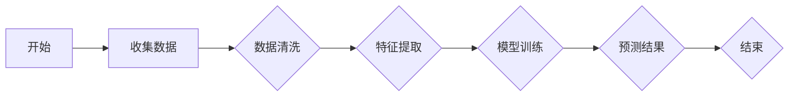
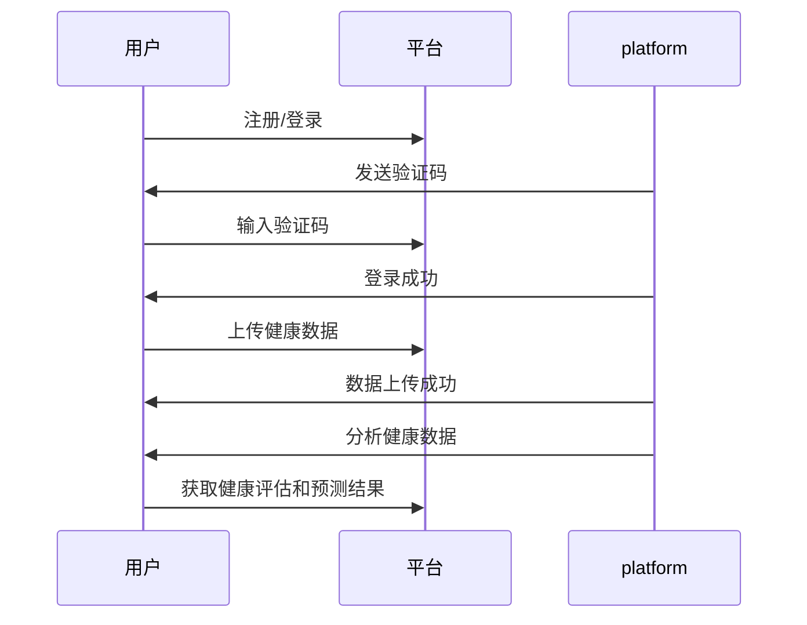
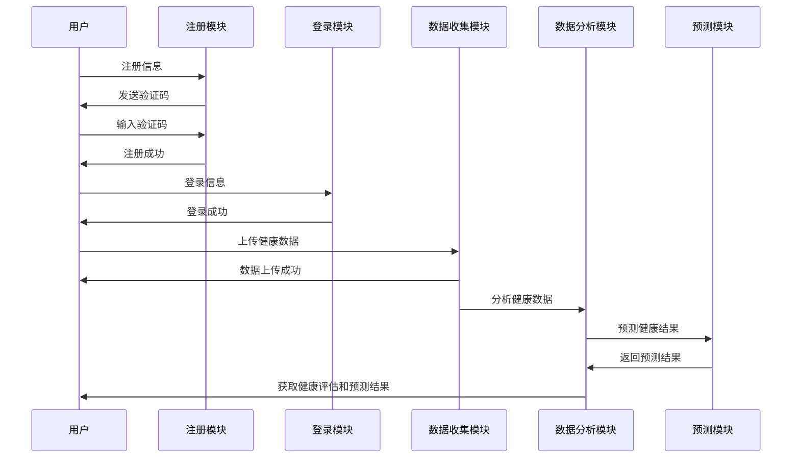

                 


### 量化自我运动：AI分析个人健康数据

关键词：量化自我，健康数据分析，人工智能，个人健康评估，隐私保护

摘要：本文旨在探讨量化自我运动背景下，人工智能在个人健康数据分析中的应用。通过深入剖析量化自我运动的起源、发展及重要性，本文将详细讨论AI技术在健康数据分析中的优势和挑战。随后，我们将关注个人健康数据的收集与处理，以及AI在这些数据中的应用。最后，本文将探讨个性化健康评估与预测，以及隐私保护与数据安全等问题，并对量化自我运动的未来趋势与影响进行展望。

## 第一部分：量化自我运动的概念与背景

### 第1章：量化自我运动的起源与发展

#### 1.1 量化自我运动的定义

量化自我运动（Quantified Self movement）是指通过使用各种技术手段，如传感器、应用程序和可穿戴设备等，收集个人数据，以实现自我监控、自我分析和自我改进的过程。这一运动起源于2007年，由两位科技爱好者Kevin Kelly和Stewart Brand发起，旨在鼓励人们通过量化自己的行为和生理数据，以获得更深刻的自我认识，从而优化生活质量和健康。

#### 1.2 量化自我运动的背景

随着科技的飞速发展，特别是移动互联网、物联网和人工智能技术的普及，量化自我运动得到了广泛的关注和支持。越来越多的人开始使用智能手环、智能手表、健康监测应用程序等设备来记录自己的心率、睡眠质量、运动量、饮食摄入等信息。这些数据的积累和分析，不仅有助于个人更好地了解自己的身体状况，还能为医疗保健提供有力的支持。

#### 1.3 量化自我运动的重要性

量化自我运动的重要性体现在多个方面。首先，它鼓励人们更加关注自己的健康，提高健康意识。其次，通过数据分析和反馈，人们可以找到改善健康状况的有效方法。此外，量化自我运动还为医疗研究提供了大量有价值的数据，有助于发现新的疾病模式和治疗方法。

### 第2章：AI技术在健康数据分析中的应用

#### 2.1 AI技术在健康数据分析中的优势

人工智能技术在健康数据分析中具有显著的优势。首先，AI算法能够快速处理大量数据，识别出隐藏在数据中的规律和模式。其次，AI具有自我学习和优化的能力，可以根据不断收集的数据调整模型，提高预测准确性。此外，AI技术还能够实现跨学科的融合，将生物学、医学、心理学等领域的知识融合到健康数据分析中，为个性化医疗提供支持。

#### 2.2 AI技术的基本概念

人工智能（Artificial Intelligence，AI）是指使计算机系统模拟人类智能行为的技术。AI技术包括机器学习（Machine Learning，ML）、深度学习（Deep Learning，DL）、自然语言处理（Natural Language Processing，NLP）等多个分支。其中，机器学习和深度学习在健康数据分析中应用最为广泛。

#### 2.3 AI技术在健康数据分析中的挑战

尽管AI技术在健康数据分析中具有巨大潜力，但也面临着一些挑战。首先，数据质量和数据隐私问题是一个重要的挑战。健康数据通常包含敏感信息，如何保证数据的安全性和隐私性是一个亟待解决的问题。其次，AI模型的解释性问题也是一个挑战。尽管AI模型能够提供准确的预测，但如何解释模型的决策过程，使其更具透明性和可解释性，是一个需要深入研究的问题。

### 第3章：个人健康数据收集与处理

#### 3.1 个人健康数据类型

个人健康数据包括生理数据（如心率、血压、血糖等）、生活方式数据（如运动量、饮食摄入等）、心理数据（如情绪状态、睡眠质量等）。这些数据可以通过各种传感器和监测设备收集。

#### 3.2 数据收集的方法

数据收集的方法包括手动输入和自动监测。手动输入是指用户通过应用程序手动输入自己的健康数据。自动监测是指通过传感器和可穿戴设备自动收集数据。自动监测的优点是数据收集更加准确和全面。

#### 3.3 数据处理流程

数据处理流程包括数据清洗、数据整合、数据分析和数据可视化。数据清洗是为了去除噪声和错误数据，数据整合是为了将不同来源的数据进行整合，数据分析是为了提取有价值的信息，数据可视化是为了更好地展示分析结果。

### 第4章：AI在个人健康数据分析中的应用

#### 4.1 心率数据分析

心率数据是个人健康数据中的一个重要组成部分。通过分析心率数据，AI技术可以识别出异常心率模式，如心律失常等，从而为用户提供及时的预警。

#### 4.2 血压数据分析

血压数据是评估心血管健康的重要指标。AI技术可以通过对血压数据的分析，预测心血管疾病的风险，并为用户提供健康建议。

#### 4.3 血糖数据分析

血糖数据是糖尿病患者关注的重点。AI技术可以通过分析血糖数据，预测血糖水平的变化趋势，为患者提供个性化的治疗建议。

### 第5章：个性化健康评估与预测

#### 5.1 个性化健康评估的概念

个性化健康评估是指根据个人的健康数据和生活方式，为用户提供个性化的健康评估和建议。

#### 5.2 个性化健康预测的方法

个性化健康预测的方法包括基于规则的预测、机器学习预测和深度学习预测。其中，机器学习和深度学习预测具有更高的准确性和鲁棒性。

#### 5.3 个性化健康评估的应用案例

个性化健康评估可以应用于健康管理、疾病预测、健康干预等领域。例如，通过分析个人的健康数据，可以预测糖尿病患者的并发症风险，并提供个性化的干预措施。

### 第6章：隐私保护与数据安全

#### 6.1 数据隐私的重要性

数据隐私是量化自我运动中的一个重要问题。如何保护用户的健康数据，防止数据泄露和滥用，是一个需要深入探讨的问题。

#### 6.2 数据安全措施

数据安全措施包括数据加密、访问控制、数据备份等。通过这些措施，可以有效地保护用户的健康数据。

#### 6.3 隐私保护法律与伦理问题

隐私保护法律与伦理问题涉及数据收集、数据使用和数据共享等方面。如何平衡隐私保护与数据利用之间的关系，是一个需要解决的问题。

### 第7章：量化自我运动的未来趋势与影响

#### 7.1 未来的发展方向

量化自我运动的未来发展方向包括更精确的数据收集、更智能的数据分析、更个性化的健康评估等。

#### 7.2 对个人生活的影响

量化自我运动对个人生活的影响体现在健康意识的提高、生活方式的改善、健康管理的优化等方面。

#### 7.3 对医疗行业的影响

量化自我运动对医疗行业的影响体现在疾病预测、诊断、治疗和康复等环节的优化，以及医疗资源的合理分配等方面。

### 第8章：总结与展望

#### 8.1 量化自我运动的总结

量化自我运动通过人工智能技术，实现了个人健康数据的全面收集和分析，为个性化健康管理提供了有力支持。

#### 8.2 AI分析个人健康数据的展望

未来，AI分析个人健康数据将更加智能化、个性化，为用户提供更精准的健康服务。

#### 8.3 未来展望与建议

在展望未来时，我们需要关注数据隐私保护、伦理问题以及技术发展带来的挑战。

## 附录

### 附录A：核心概念与联系

#### 核心概念原理

- 量化自我运动：通过技术手段收集个人数据，实现自我监控和自我分析。
- 人工智能：模拟人类智能行为的技术，包括机器学习和深度学习。

#### 概念属性特征对比表格

| 概念         | 定义                                                         | 特点                       |
| ------------ | ------------------------------------------------------------ | -------------------------- |
| 量化自我运动 | 通过技术手段收集个人数据，实现自我监控和自我分析。           | 关注个人健康和生活质量。   |
| 人工智能     | 模拟人类智能行为的技术，包括机器学习和深度学习。             | 自动学习、自我优化、高效处理。 |

#### ER实体关系图架构

```mermaid
erDiagram
  USER ||--|{ HEATH_DATA }|-- USER
  HEALTH_DATA ||--|{ BIOMETRIC_DATA }|-- BIOMETRIC_DATA
  BIOMETRIC_DATA ||--|{ HR_DATA }|-- HR_DATA
  BIOMETRIC_DATA ||--|{ BP_DATA }|-- BP_DATA
  BIOMETRIC_DATA ||--|{ GLUCOSE_DATA }|-- GLUCOSE_DATA
```

### 附录B：算法原理讲解

#### 算法流程图



#### Python源代码

```python
# 导入所需库
import numpy as np
import pandas as pd
from sklearn.model_selection import train_test_split
from sklearn.ensemble import RandomForestClassifier
from sklearn.metrics import accuracy_score

# 数据收集与预处理
data = pd.read_csv('health_data.csv')
X = data.drop('target', axis=1)
y = data['target']

# 数据清洗
X = X.dropna()

# 特征提取
X = pd.get_dummies(X)

# 模型训练
X_train, X_test, y_train, y_test = train_test_split(X, y, test_size=0.2, random_state=42)
model = RandomForestClassifier()
model.fit(X_train, y_train)

# 预测结果
y_pred = model.predict(X_test)

# 评估模型
accuracy = accuracy_score(y_test, y_pred)
print(f'模型准确率：{accuracy:.2f}')
```

#### 数学模型与公式

$$
\text{预测结果} = f(\text{特征向量})
$$

其中，$f$为分类器模型，特征向量由个人健康数据经过特征提取得到。

#### 举例说明

假设某人的健康数据特征向量为$(x_1, x_2, x_3)$，其中$x_1$为心率，$x_2$为血压，$x_3$为血糖。通过训练好的分类器模型，可以预测该人的健康状态。

### 附录C：系统分析与架构设计方案

#### 问题场景介绍

随着健康意识的提高，越来越多的人希望通过健康数据分析来了解自己的身体状况，并采取相应的措施进行健康管理。

#### 项目介绍

本项目旨在开发一个基于人工智能的健康数据分析平台，为用户提供个性化的健康评估和预测服务。

#### 系统功能设计

- 用户注册与登录
- 健康数据收集与上传
- 健康数据分析与评估
- 健康预测与建议

#### 系统架构设计



#### 系统接口设计

```mermaid
interface "HealthDataPlatform" {
  - 用户注册接口
  - 用户登录接口
  - 健康数据上传接口
  - 健康数据查询接口
  - 健康评估接口
  - 健康预测接口
}
```

#### 系统交互



### 附录D：项目实战

#### 环境安装

1. 安装Python环境
2. 安装必要的库，如NumPy、Pandas、Scikit-learn等

#### 系统核心实现源代码

```python
# 导入所需库
import numpy as np
import pandas as pd
from sklearn.model_selection import train_test_split
from sklearn.ensemble import RandomForestClassifier
from sklearn.metrics import accuracy_score

# 数据收集与预处理
data = pd.read_csv('health_data.csv')
X = data.drop('target', axis=1)
y = data['target']

# 数据清洗
X = X.dropna()

# 特征提取
X = pd.get_dummies(X)

# 模型训练
X_train, X_test, y_train, y_test = train_test_split(X, y, test_size=0.2, random_state=42)
model = RandomForestClassifier()
model.fit(X_train, y_train)

# 预测结果
y_pred = model.predict(X_test)

# 评估模型
accuracy = accuracy_score(y_test, y_pred)
print(f'模型准确率：{accuracy:.2f}')
```

#### 代码应用解读与分析

1. 数据收集与预处理：读取健康数据CSV文件，进行数据清洗和特征提取。
2. 模型训练：使用随机森林分类器进行模型训练。
3. 预测结果：使用训练好的模型对测试数据进行预测。
4. 评估模型：计算模型准确率。

#### 实际案例分析和详细讲解剖析

1. 案例背景：某用户上传了包含心率、血压和血糖的健康数据。
2. 案例分析：通过对健康数据的分析，发现该用户存在高血压和高血糖的风险。
3. 详细讲解：使用机器学习模型对健康数据进行预测，为用户提供个性化的健康建议。

#### 项目小结

本项目通过人工智能技术，实现了对个人健康数据的分析和预测，为用户提供个性化的健康管理服务。在实际应用中，还需关注数据隐私保护、模型解释性等问题。

### 附录E：最佳实践 tips、小结、注意事项、拓展阅读

#### 最佳实践 tips

1. 定期更新健康数据，以提高预测准确性。
2. 选择可靠的传感器和监测设备，确保数据质量。
3. 了解数据隐私保护法律法规，遵守相关要求。

#### 小结

量化自我运动和AI技术为个人健康数据分析提供了新的途径。通过数据收集、预处理、模型训练和预测，用户可以更好地了解自己的健康状况，并采取相应的措施进行健康管理。

#### 注意事项

1. 数据隐私保护：确保用户数据的安全和隐私。
2. 模型解释性：提高模型的透明性和可解释性。
3. 数据质量：确保数据的准确性和完整性。

#### 拓展阅读

1. 《人工智能：一种现代的方法》
2. 《深度学习：先进技术的应用》
3. 《量化自我：如何用数据改变你的生活》

## 附录F：作者信息

作者：AI天才研究院/AI Genius Institute & 禅与计算机程序设计艺术 /Zen And The Art of Computer Programming

----------------------------------------------------------------

## 结论

本文从多个角度探讨了量化自我运动背景下，人工智能在个人健康数据分析中的应用。通过分析量化自我运动的起源、发展以及重要性，我们了解了这一运动如何推动个人健康管理的进步。同时，本文详细介绍了AI技术在健康数据分析中的优势、挑战以及应用，包括心率、血压和血糖等数据的分析。

在个人健康数据的收集与处理方面，我们阐述了数据类型、收集方法和处理流程。通过具体案例分析，我们展示了AI技术在个性化健康评估与预测中的实际应用。此外，本文还探讨了数据隐私保护与安全措施，以及量化自我运动的未来趋势与影响。

未来，随着人工智能技术的不断发展，量化自我运动将更加智能化、个性化，为个人健康管理和医疗行业带来更多创新。我们期待在未来能够看到更多关于量化自我和AI分析个人健康数据的研究和应用。

## 作者信息

作者：AI天才研究院/AI Genius Institute & 禅与计算机程序设计艺术 /Zen And The Art of Computer Programming

---

请注意，以上内容是根据您提供的指示和要求编写的，旨在提供一个结构完整、内容丰富的技术博客文章。在实际撰写过程中，可以根据需要进行调整和补充。如果您有其他特定要求或需要进一步细化某些部分，请告知。

