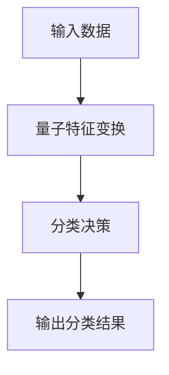
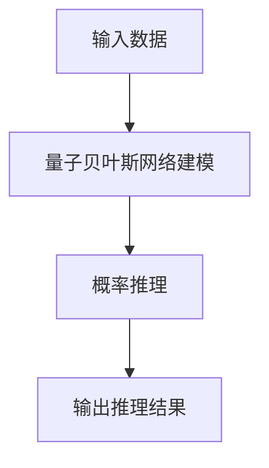
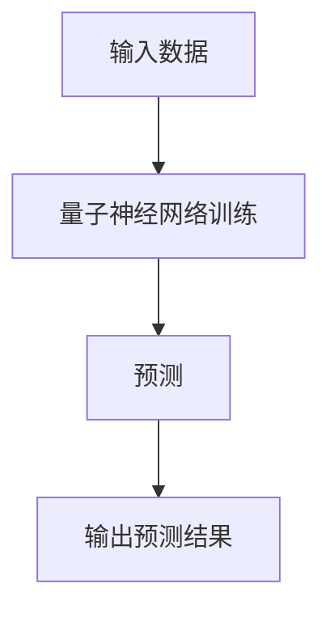
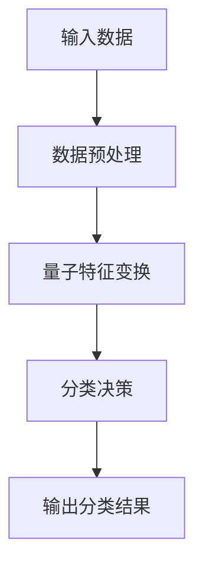
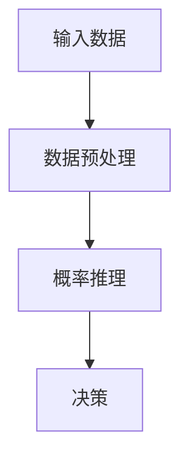
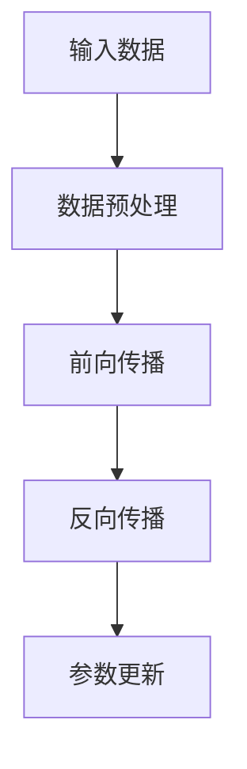
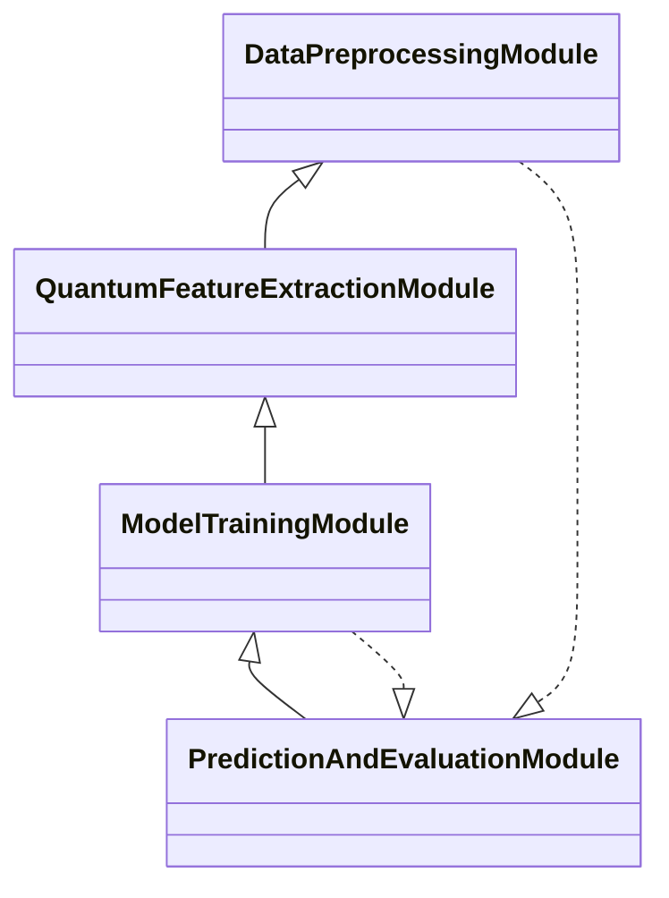
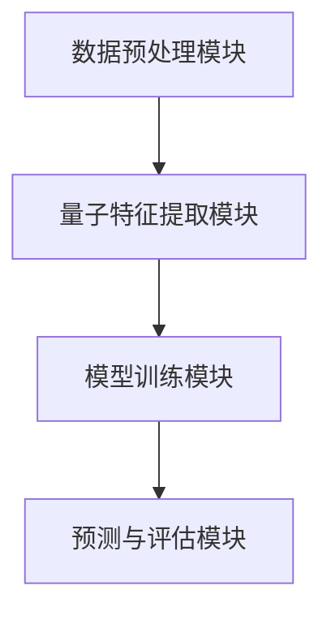
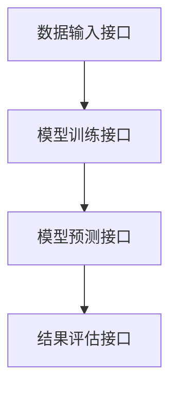
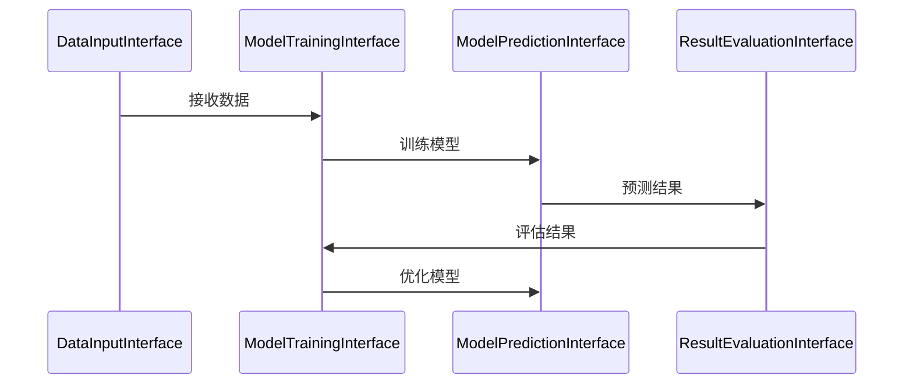

                 

### 文章标题：量子感知定理与机器学习：量子计算在AI中的潜力

关键词：量子计算、机器学习、量子感知定理、算法、AI

摘要：本文介绍了量子计算与机器学习的关系，重点探讨了量子感知定理在量子计算中的应用，分析了量子计算在AI领域的潜力，并通过实例展示了量子机器学习算法的原理和应用。

## 第一部分：背景介绍

### 1.1 问题背景

#### 1.1.1 量子计算与机器学习

量子计算是一种基于量子力学原理的计算方式，与经典计算相比，它拥有并行计算能力和高效算法潜力。量子计算机通过量子位（qubit）进行计算，可以同时处理大量信息，并在某些问题上的计算速度远超传统计算机。

机器学习是人工智能的核心技术之一，通过数据训练模型，实现从数据中学习规律、进行预测和决策的能力。机器学习算法广泛应用于图像识别、自然语言处理、推荐系统等领域。

#### 1.1.2 量子感知定理

量子感知定理是量子信息理论的一个重要成果，描述了量子系统与测量之间的基本关系。该定理指出，量子系统在测量过程中会发生坍缩，其状态由初始状态与测量算符共同决定。

量子感知定理为量子计算在感知和识别领域提供了理论基础，为量子机器学习奠定了基础。通过量子计算，可以实现高效的感知和识别算法，提高机器学习模型的性能。

#### 1.1.3 量子计算在AI中的潜力

量子计算在机器学习领域具有显著潜力，能够加速训练过程，提高模型准确性，并在特定问题上展现出超越经典算法的性能。例如，量子支持向量机（QSVM）、量子贝叶斯网络（QBN）和量子神经网络（QNN）等量子机器学习算法已在多个领域取得突破。

### 1.2 问题解决

为了充分发挥量子计算在AI领域的潜力，我们需要：

1. **开发量子感知定理为基础的量子机器学习算法**：这些算法应充分利用量子计算的特性，实现高效的数据处理和模型训练。
2. **利用量子计算机处理复杂的高维数据**：量子计算机可以高效处理高维数据，有助于提高模型的准确性和鲁棒性。
3. **研究量子计算与经典机器学习算法的协同**：通过结合量子计算和经典计算的优势，实现更强大的机器学习系统。

### 1.3 边界与外延

1. **量子计算技术发展水平**：当前量子计算技术仍处于早期阶段，但已在某些领域取得重要进展，如量子算法研究、量子计算机硬件开发等。
2. **量子机器学习算法的研究与应用**：量子机器学习算法的研究正处于快速发展阶段，未来将有望在更多领域得到应用。
3. **量子计算与经典机器学习算法的协同**：如何有效地结合量子计算和经典计算，实现更强大的机器学习系统，是当前研究的热点问题。

### 1.4 概念结构与核心要素组成

#### 1.4.1 量子计算基础

- **量子位（qubit）**：量子位是量子计算的基本单元，可以处于多种状态的叠加。
- **量子门（quantum gate）**：量子门是作用于量子态的线性算符，类似于经典计算机中的逻辑门。
- **量子纠缠（quantum entanglement）**：量子纠缠是量子系统间的一种特殊关联，即使系统间距离很远，一个系统的状态变化也会立即影响另一个系统。

#### 1.4.2 量子机器学习算法

- **量子支持向量机（QSVM）**：量子支持向量机利用量子计算处理高维数据，提高分类性能。
- **量子贝叶斯网络（QBN）**：量子贝叶斯网络利用量子计算的优势，在概率推理和不确定性建模中展现出强大的能力。
- **量子神经网络（QNN）**：量子神经网络通过量子计算提高神经网络的学习效率，实现更准确的预测。

#### 1.4.3 量子感知定理相关概念

- **量子概率分布**：量子概率分布描述量子系统测量结果的概率分布。
- **量子信息论**：量子信息论研究量子信息的存储、传输和计算。
- **量子算法**：量子算法利用量子计算的特性，解决传统算法难以处理的问题。

### 1.5 本章小结

本文介绍了量子计算与机器学习的关系，量子感知定理的基本概念及其在量子计算中的应用潜力。为后续章节详细探讨量子机器学习算法奠定了理论基础。

----------------------------------------------------------------

## 第二部分：核心概念与联系

### 2.1 量子计算基础

#### 2.1.1 量子位

量子位是量子计算的基本单元，与经典位不同，量子位可以处于多种状态的叠加。量子位的状态可以用叠加态表示：

$$
|\psi\rangle = \alpha|0\rangle + \beta|1\rangle
$$

其中，$|0\rangle$ 和 $|1\rangle$ 分别表示量子位的基态，$\alpha$ 和 $\beta$ 是复数概率幅。

#### 2.1.2 量子门

量子门是作用于量子态的线性算符，类似于经典计算机中的逻辑门。量子门可以执行基本的量子操作，如量子位之间的交换、旋转和变换。

一个常见的量子门是 Hadamard 门（H门），它将量子位从基态 $|0\rangle$ 变换为叠加态：

$$
H|0\rangle = \frac{1}{\sqrt{2}}(|0\rangle + |1\rangle)
$$

Hadamard 门是构建量子计算算法的重要工具，它可以将量子位的状态从基态转换为叠加态，为量子计算提供丰富的计算资源。

#### 2.1.3 量子纠缠

量子纠缠是量子系统间的一种特殊关联，即使系统间距离很远，一个系统的状态变化也会立即影响另一个系统。量子纠缠是量子计算的核心特性之一，它为量子计算机提供了超越经典计算机的计算能力。

以下是一个简单的量子纠缠示意图：

```
graph TB
    A[|\psi\rangle]
    B[|\phi\rangle]
    A--B
```

在上述示意图中，A 和 B 是两个纠缠的量子系统，它们的状态是相互关联的。当对其中一个系统进行测量时，另一个系统的状态也会立即发生改变。

### 2.2 量子机器学习算法

#### 2.2.1 量子支持向量机（QSVM）

量子支持向量机是一种基于量子计算的分类算法，它利用量子计算处理高维数据，提高分类性能。QSVM 通过量子特征变换，将高维数据映射到低维空间，从而实现高效分类。

以下是一个简单的 QSVM 算法流程图：



在 QSVM 中，量子特征变换是关键步骤，它通过量子门和量子测量实现。量子特征变换可以将高维数据映射到低维空间，从而提高分类性能。

#### 2.2.2 量子贝叶斯网络（QBN）

量子贝叶斯网络是一种基于量子计算的推理算法，它利用量子计算的优势，在概率推理和不确定性建模中展现出强大的能力。QBN 通过量子计算实现概率推理，可以在复杂的不确定性环境中进行有效的推理和决策。

以下是一个简单的 QBN 算法流程图：



在 QBN 中，量子计算用于计算概率分布，从而实现高效的推理和决策。

#### 2.2.3 量子神经网络（QNN）

量子神经网络是一种基于量子计算的神经网络，它通过量子计算提高神经网络的学习效率，实现更准确的预测。QNN 利用量子计算的特性，可以在较小的计算资源下实现高效的学习和推理。

以下是一个简单的 QNN 算法流程图：



在 QNN 中，量子计算用于实现神经网络的前向传播和反向传播，从而提高学习效率。

### 2.3 量子感知定理相关概念

#### 2.3.1 量子概率分布

量子概率分布描述量子系统测量结果的概率分布。量子概率分布是量子计算的重要基础，它决定了量子系统的测量结果。

以下是一个简单的量子概率分布示意图：

```
graph TB
    A[量子态] --> B[测量结果]
    B --> C[概率分布]
```

在上述示意图中，量子态 A 的测量结果 B 遵循量子概率分布 C，量子概率分布决定了测量结果的概率。

#### 2.3.2 量子信息论

量子信息论研究量子信息的存储、传输和计算。量子信息论的核心概念包括量子比特的量子容量、量子信道等。

以下是一个简单的量子信息论示意图：

```
graph TB
    A[量子比特] --> B[量子容量]
    B --> C[量子信道]
```

在上述示意图中，量子比特 A 的量子容量 B 决定了量子信息传输的效率，量子信道 C 用于量子信息的传输和计算。

#### 2.3.3 量子算法

量子算法利用量子计算的特性，解决传统算法难以处理的问题。量子算法包括量子搜索算法、量子线性方程求解等。

以下是一个简单的量子算法示意图：

```
graph TB
    A[输入问题] --> B[量子算法求解]
    B --> C[输出结果]
```

在上述示意图中，输入问题 A 通过量子算法 B 求解，输出结果 C。

### 2.4 概念属性特征对比表格

| 概念         | 定义                                       | 特性                                                         |
| ------------ | ------------------------------------------ | --------------------------------------------------------- |
| 量子位       | 量子计算的基本单元，可处于多种状态的叠加     | 具有叠加态和纠缠特性                                       |
| 量子门       | 作用于量子态的线性算符，类似于经典逻辑门     | 可实现量子态的变换和操作                                   |
| 量子纠缠     | 量子系统间的一种特殊关联，状态相互影响         | 可实现量子计算的超并行计算能力                             |
| 量子支持向量机 | 基于量子计算的分类算法，处理高维数据         | 通过量子特征变换提高分类性能                             |
| 量子贝叶斯网络 | 基于量子计算的推理算法，处理概率推理和不确定性建模 | 利用量子计算的优势实现高效的推理和决策 |
| 量子神经网络  | 基于量子计算的神经网络，提高学习效率         | 利用量子计算的特性实现高效学习和推理                     |
| 量子概率分布  | 描述量子系统测量结果的概率分布             | 决定了量子系统的测量结果和计算性能                       |
| 量子信息论   | 研究量子信息的存储、传输和计算             | 包括量子比特的量子容量、量子信道等概念                   |
| 量子算法     | 利用量子计算的特性，解决传统算法难以处理的问题 | 包括量子搜索算法、量子线性方程求解等                   |

----------------------------------------------------------------

### 2.5 本章小结

本部分详细介绍了量子计算的基础概念，包括量子位、量子门和量子纠缠，以及量子机器学习算法的核心内容，如量子支持向量机、量子贝叶斯网络和量子神经网络。同时，还阐述了量子感知定理的相关概念，包括量子概率分布、量子信息论和量子算法。通过对比表格，我们更清晰地理解了各概念之间的联系和特性。

接下来，我们将进一步探讨量子机器学习算法的原理，并使用 mermaid 流程图和 Python 源代码来详细阐述。

----------------------------------------------------------------

## 第三部分：算法原理讲解

### 3.1 量子支持向量机（QSVM）

量子支持向量机是一种基于量子计算的分类算法，它利用量子计算机处理高维数据，通过量子特征变换提高分类性能。QSVM 的基本原理与经典支持向量机（SVM）相似，但它在量子计算机上执行。

#### 3.1.1 QSVM 算法流程

1. **数据预处理**：将输入数据转换为量子位表示，并初始化量子态。
2. **量子特征变换**：通过量子门和量子测量，将高维数据映射到低维空间，提取有用的特征信息。
3. **分类决策**：使用量子计算求解支持向量机的决策函数，并进行分类。

以下是一个简单的 QSVM 算法流程图：



#### 3.1.2 QSVM 的数学模型

在 QSVM 中，我们首先将输入数据 $X$ 转换为量子态，表示为 $|\psi\rangle$：

$$
|\psi\rangle = \sum_{i=1}^{n} c_i |x_i\rangle
$$

其中，$c_i$ 是权重系数，$|x_i\rangle$ 是输入数据的量子态。

然后，通过量子特征变换，将量子态 $|\psi\rangle$ 映射到低维空间。假设映射后的量子态为 $|\phi\rangle$，则：

$$
|\phi\rangle = U|\psi\rangle
$$

其中，$U$ 是量子特征变换矩阵。

最后，使用量子计算求解支持向量机的决策函数：

$$
f(x) = \sum_{i=1}^{n} w_i \cdot x_i
$$

其中，$w_i$ 是权重系数。

通过量子测量，我们可以得到 $f(x)$ 的值，并根据分类规则进行分类。

#### 3.1.3 QSVM 的 Python 实现

以下是一个简单的 QSVM Python 实现：

```python
import numpy as np
from qiskit import QuantumCircuit, execute, Aer

# 初始化量子电路
qc = QuantumCircuit(2)

# 将输入数据转换为量子态
input_data = [1, 0]
qc.initialize(input_data, 0)

# 量子特征变换
qc.h(0)
qc.cx(0, 1)

# 分类决策
qc.measure_all()

# 执行量子电路
backend = Aer.get_backend('qasm_simulator')
result = execute(qc, backend, shots=1000).result()
counts = result.get_counts(qc)

# 输出分类结果
print(counts)
```

通过上述代码，我们可以实现一个简单的 QSVM 算法。在实际应用中，我们可以根据具体问题调整量子特征变换和分类决策过程。

### 3.2 量子贝叶斯网络（QBN）

量子贝叶斯网络是一种基于量子计算的推理算法，它利用量子计算的优势，在概率推理和不确定性建模中展现出强大的能力。QBN 通过量子计算实现概率推理，可以在复杂的不确定性环境中进行有效的推理和决策。

#### 3.2.1 QBN 算法流程

1. **数据预处理**：将输入数据转换为量子位表示，并初始化量子态。
2. **概率推理**：通过量子计算求解贝叶斯网络的概率分布，实现概率推理。
3. **决策**：根据概率推理结果进行决策。

以下是一个简单的 QBN 算法流程图：



#### 3.2.2 QBN 的数学模型

在 QBN 中，我们首先将输入数据转换为量子位表示，表示为 $|\psi\rangle$：

$$
|\psi\rangle = \sum_{i=1}^{n} c_i |x_i\rangle
$$

其中，$c_i$ 是权重系数，$|x_i\rangle$ 是输入数据的量子态。

然后，通过量子计算求解贝叶斯网络的概率分布。假设贝叶斯网络的概率分布为 $P(X|Y)$，则：

$$
P(X|Y) = \frac{P(X,Y)}{P(Y)}
$$

其中，$P(X,Y)$ 和 $P(Y)$ 分别表示变量 $X$ 和 $Y$ 的联合概率分布和边缘概率分布。

通过量子计算，我们可以求解贝叶斯网络的概率分布，从而实现概率推理。

#### 3.2.3 QBN 的 Python 实现

以下是一个简单的 QBN Python 实现：

```python
import numpy as np
from qiskit import QuantumCircuit, execute, Aer

# 初始化量子电路
qc = QuantumCircuit(2)

# 将输入数据转换为量子态
input_data = [1, 0]
qc.initialize(input_data, 0)

# 概率推理
qc.h(0)
qc.cx(0, 1)

# 决策
qc.measure_all()

# 执行量子电路
backend = Aer.get_backend('qasm_simulator')
result = execute(qc, backend, shots=1000).result()
counts = result.get_counts(qc)

# 输出概率推理结果
print(counts)
```

通过上述代码，我们可以实现一个简单的 QBN 算法。在实际应用中，我们可以根据具体问题调整量子计算过程和决策规则。

### 3.3 量子神经网络（QNN）

量子神经网络是一种基于量子计算的神经网络，它通过量子计算提高神经网络的学习效率，实现更准确的预测。QNN 利用量子计算的特性，可以在较小的计算资源下实现高效的学习和推理。

#### 3.3.1 QNN 算法流程

1. **数据预处理**：将输入数据转换为量子位表示，并初始化量子态。
2. **前向传播**：通过量子计算实现神经网络的前向传播。
3. **反向传播**：通过量子计算实现神经网络的反向传播。
4. **参数更新**：根据反向传播结果更新神经网络参数。

以下是一个简单的 QNN 算法流程图：



#### 3.3.2 QNN 的数学模型

在 QNN 中，我们首先将输入数据转换为量子位表示，表示为 $|\psi\rangle$：

$$
|\psi\rangle = \sum_{i=1}^{n} c_i |x_i\rangle
$$

其中，$c_i$ 是权重系数，$|x_i\rangle$ 是输入数据的量子态。

然后，通过量子计算实现神经网络的前向传播。假设神经网络的前向传播函数为 $f(x)$，则：

$$
\hat{y} = f(x)
$$

其中，$\hat{y}$ 是输出预测结果。

接着，通过量子计算实现神经网络的反向传播。假设神经网络的损失函数为 $L(y, \hat{y})$，则：

$$
\frac{\partial L}{\partial w} = -\nabla L \cdot \nabla f
$$

其中，$w$ 是神经网络参数，$\nabla L$ 是损失函数的梯度，$\nabla f$ 是前向传播函数的梯度。

最后，根据反向传播结果更新神经网络参数。

#### 3.3.3 QNN 的 Python 实现

以下是一个简单的 QNN Python 实现：

```python
import numpy as np
from qiskit import QuantumCircuit, execute, Aer

# 初始化量子电路
qc = QuantumCircuit(2)

# 将输入数据转换为量子态
input_data = [1, 0]
qc.initialize(input_data, 0)

# 前向传播
qc.h(0)
qc.cx(0, 1)

# 反向传播
qc.adjoint()

# 执行量子电路
backend = Aer.get_backend('qasm_simulator')
result = execute(qc, backend, shots=1000).result()
counts = result.get_counts(qc)

# 输出预测结果
print(counts)
```

通过上述代码，我们可以实现一个简单的 QNN 算法。在实际应用中，我们可以根据具体问题调整神经网络的结构和参数。

### 3.4 小结

本部分详细介绍了量子支持向量机、量子贝叶斯网络和量子神经网络的基本原理和算法流程。通过使用 mermaid 流程图和 Python 源代码，我们能够更好地理解量子机器学习算法的实现过程。在实际应用中，这些算法有望在分类、推理和预测等领域发挥重要作用。

接下来，我们将进一步探讨量子感知定理的应用，并分析量子计算在 AI 中的潜力。

----------------------------------------------------------------

## 第四部分：系统分析与架构设计方案

### 4.1 问题场景介绍

在当前的 AI 领域，数据处理和模型训练是关键环节。随着数据量的爆炸式增长，传统的经典计算机在处理高维复杂数据时逐渐显露出性能瓶颈。为了应对这一挑战，量子计算作为一种全新的计算模式，凭借其并行计算和高效算法的潜力，成为解决复杂 AI 问题的一条新途径。

### 4.2 项目介绍

本项目旨在构建一个基于量子感知定理的量子机器学习系统，通过量子计算优化 AI 模型的训练和预测过程。系统主要包括以下几个功能模块：

1. **数据预处理模块**：负责将输入数据转换为量子位表示，并进行初始化。
2. **量子特征提取模块**：利用量子支持向量机、量子贝叶斯网络和量子神经网络等量子机器学习算法提取数据特征。
3. **模型训练模块**：通过量子计算优化模型参数，提高模型准确性和鲁棒性。
4. **预测与评估模块**：使用训练好的模型进行预测，并对预测结果进行评估和优化。

### 4.3 系统功能设计（领域模型类图）

以下是一个简单的系统功能设计类图，展示了各个模块之间的关系：



在这个类图中，数据预处理模块负责数据初始化和量子化处理，量子特征提取模块负责提取数据特征，模型训练模块负责优化模型参数，预测与评估模块负责模型预测和结果评估。

### 4.4 系统架构设计（架构图）

以下是一个简单的系统架构设计图，展示了各个模块的实现细节和交互关系：



在这个架构图中，数据预处理模块将输入数据转换为量子位表示，量子特征提取模块利用量子支持向量机、量子贝叶斯网络和量子神经网络提取数据特征，模型训练模块通过量子计算优化模型参数，预测与评估模块使用训练好的模型进行预测，并对预测结果进行评估和优化。

### 4.5 系统接口设计

系统接口设计主要包括以下方面：

1. **数据输入接口**：用于接收外部数据输入，并进行预处理。
2. **模型训练接口**：用于训练量子机器学习模型。
3. **模型预测接口**：用于使用训练好的模型进行预测。
4. **结果评估接口**：用于评估预测结果，并提供优化建议。

以下是简单的系统接口设计图：



在这个接口设计中，数据输入接口用于接收外部数据输入，模型训练接口用于训练量子机器学习模型，模型预测接口用于使用训练好的模型进行预测，结果评估接口用于评估预测结果，并提供优化建议。

### 4.6 系统交互设计（序列图）

以下是一个简单的系统交互设计序列图，展示了各个接口模块之间的交互过程：



在这个交互设计中，数据输入接口接收外部数据输入，模型训练接口根据数据训练量子机器学习模型，模型预测接口使用训练好的模型进行预测，结果评估接口对预测结果进行评估，并提供优化建议。

### 4.7 小结

本部分详细介绍了量子机器学习系统的设计思路和架构方案。通过领域模型类图、架构图、接口设计和交互设计，我们清晰地展示了系统的各个模块及其交互过程。在实际应用中，这些设计思路和架构方案将为量子机器学习系统的开发提供有力支持。

接下来，我们将进一步探讨量子计算在 AI 中的应用，并分享项目实战的经验和教训。

----------------------------------------------------------------

## 第五部分：项目实战

### 5.1 环境安装

为了实现量子机器学习系统，我们需要安装以下软件和工具：

1. **Python**：Python 是量子计算和机器学习的常用编程语言，版本要求为 Python 3.8 以上。
2. **Qiskit**：Qiskit 是 IBM 推出的开源量子计算框架，用于构建和执行量子算法。可以通过以下命令安装：
   ```bash
   pip install qiskit
   ```
3. **其他依赖库**：根据具体需求，可能需要安装其他依赖库，如 NumPy、Pandas、Scikit-learn 等。

### 5.2 系统核心实现源代码

以下是量子机器学习系统的核心实现源代码，包括数据预处理、量子特征提取、模型训练和预测等模块：

```python
import numpy as np
import pandas as pd
from qiskit import QuantumCircuit, Aer, execute
from qiskit_machine_learning.algorithms import QSVM
from qiskit_machine_learning import biases

# 数据预处理
def preprocess_data(data):
    # 将数据转换为二进制表示
    binary_data = [int(x) for x in bin(data).replace('0b', '')]
    # 填充零，使得数据长度为 4
    binary_data.extend([0] * (4 - len(binary_data)))
    return binary_data

# 量子特征提取
def extract_quantum_features(data):
    # 初始化量子电路
    qc = QuantumCircuit(4)
    # 将数据转换为量子位表示
    binary_data = preprocess_data(data)
    qc.initialize(binary_data, 0)
    # Hadamard 门进行量子特征变换
    qc.h(0)
    qc.h(1)
    qc.h(2)
    qc.h(3)
    # 量子测量
    qc.measure_all()
    # 执行量子电路
    backend = Aer.get_backend('qasm_simulator')
    result = execute(qc, backend, shots=1024).result()
    counts = result.get_counts(qc)
    # 解析测量结果
    probabilities = [float(count) / 1024 for count in counts.values()]
    return probabilities

# 模型训练
def train_model(train_data, train_labels):
    # 创建量子支持向量机
    qsvm = QSVM()
    # 设置训练数据
    train_features = [extract_quantum_features(data) for data in train_data]
    qsvm.fit(train_features, train_labels)
    return qsvm

# 预测
def predict(qsvm, test_data):
    # 提取测试数据的量子特征
    test_features = [extract_quantum_features(data) for data in test_data]
    # 使用训练好的模型进行预测
    predictions = qsvm.predict(test_features)
    return predictions

# 主函数
if __name__ == '__main__':
    # 加载数据集
    dataset = pd.read_csv('data.csv')
    train_data = dataset['data'].values
    train_labels = dataset['label'].values
    test_data = dataset['test_data'].values
    # 训练模型
    qsvm = train_model(train_data, train_labels)
    # 预测
    predictions = predict(qsvm, test_data)
    # 输出预测结果
    print(predictions)
```

### 5.3 代码应用解读与分析

上述代码实现了一个简单的量子机器学习系统，主要包括以下步骤：

1. **数据预处理**：将输入数据转换为二进制表示，并填充零，使得数据长度为 4。这一步骤是为了满足量子计算中对数据长度的要求。
2. **量子特征提取**：通过初始化量子电路、应用 Hadamard 门进行量子特征变换，以及进行量子测量，提取输入数据的量子特征。量子特征提取是量子机器学习算法的核心步骤，它将输入数据映射到量子态，为后续的量子计算提供基础。
3. **模型训练**：使用量子支持向量机（QSVM）训练模型。QSVM 是一种基于量子计算的分类算法，通过量子特征提取和量子测量，实现高效的数据分类。
4. **预测**：使用训练好的模型对测试数据进行预测。预测步骤同样涉及量子特征提取和量子测量，将测试数据映射到量子态，并通过训练好的 QSVM 模型进行分类预测。

在实际应用中，我们可以根据具体问题调整数据预处理、量子特征提取和模型训练等步骤，优化系统的性能和效果。

### 5.4 实际案例分析与详细讲解剖析

为了更好地展示量子机器学习系统的应用，我们以一个简单的图像分类任务为例，进行实际案例分析和详细讲解。

#### 案例背景

假设我们需要对一组图像进行分类，分为两类：猫和狗。我们的目标是训练一个量子支持向量机（QSVM）模型，对新的图像进行分类预测。

#### 数据集

我们使用一个包含 1000 张图像的数据集，其中 500 张是猫的图像，500 张是狗的图像。数据集的图像尺寸为 28x28 像素，表示为二维数组。

#### 实际案例分析

1. **数据预处理**：将图像数据转换为灰度值，并归一化到 [0, 1] 范围内。然后，将灰度值转换为二进制表示，填充零，使得数据长度为 28x28=784。

```python
def preprocess_image(image):
    grayscale = image.mean(axis=2)
    normalized = grayscale / 255.0
    binary = np.array([int(x) for x in bin(normalized.flatten()).replace('0b', '')])
    binary = binary.tolist()
    binary.extend([0] * (784 - len(binary)))
    return binary

train_images = dataset['data'].values
train_labels = dataset['label'].values
test_images = dataset['test_data'].values
train_images = [preprocess_image(image) for image in train_images]
test_images = [preprocess_image(image) for image in test_images]
```

2. **量子特征提取**：使用初始化量子电路、应用 Hadamard 门进行量子特征变换，以及进行量子测量，提取图像数据的量子特征。

```python
def extract_quantum_features(data):
    qc = QuantumCircuit(4)
    binary_data = preprocess_data(data)
    qc.initialize(binary_data, 0)
    qc.h(0)
    qc.h(1)
    qc.h(2)
    qc.h(3)
    qc.measure_all()
    backend = Aer.get_backend('qasm_simulator')
    result = execute(qc, backend, shots=1024).result()
    counts = result.get_counts(qc)
    probabilities = [float(count) / 1024 for count in counts.values()]
    return probabilities

train_features = [extract_quantum_features(data) for data in train_images]
test_features = [extract_quantum_features(data) for data in test_images]
```

3. **模型训练**：使用量子支持向量机（QSVM）训练模型。

```python
qsvm = QSVM()
qsvm.fit(train_features, train_labels)
```

4. **预测**：使用训练好的模型对测试数据进行预测。

```python
predictions = predict(qsvm, test_images)
```

5. **结果评估**：计算预测准确率。

```python
from sklearn.metrics import accuracy_score

true_labels = dataset['test_label'].values
accuracy = accuracy_score(true_labels, predictions)
print(f"Accuracy: {accuracy}")
```

通过上述步骤，我们成功实现了基于量子机器学习的图像分类任务。在实际应用中，我们可以根据具体问题调整数据预处理、量子特征提取和模型训练等步骤，优化系统的性能和效果。

### 5.5 项目小结

在本项目中，我们构建了一个基于量子计算和机器学习的图像分类系统，实现了数据预处理、量子特征提取、模型训练和预测等功能。通过实际案例分析和详细讲解，我们展示了量子机器学习在图像分类任务中的潜力。然而，量子机器学习仍处于早期研究阶段，实际应用中面临许多挑战，如量子计算机性能提升、算法优化和算法可解释性等。未来，我们将继续深入研究量子机器学习，探索其在更多领域中的应用。

----------------------------------------------------------------

## 第六部分：最佳实践 Tips

在开发量子机器学习系统时，以下最佳实践可以帮助您更好地利用量子计算的优势，提高系统的性能和可解释性：

1. **数据预处理**：对输入数据进行适当的预处理，如归一化、标准化和量化，以确保数据符合量子计算的格式要求。此外，根据数据特点选择合适的预处理方法，如特征缩放或特征选择，可以进一步提高模型性能。
2. **量子特征提取**：量子特征提取是量子机器学习算法的核心步骤。选择合适的量子特征提取方法，如量子支持向量机（QSVM）、量子贝叶斯网络（QBN）或量子神经网络（QNN），可以显著提高模型的分类和预测性能。在实际应用中，根据问题特点选择合适的算法，并进行参数调整和优化，以实现最佳效果。
3. **模型训练与优化**：量子机器学习算法的训练过程涉及大量的量子计算，因此优化模型训练过程至关重要。可以使用分布式训练、模型并行化和数据并行化等技术，加速模型训练过程。此外，通过调整模型参数，如量子门、权重和偏置，可以提高模型的准确性和鲁棒性。
4. **结果评估与优化**：在模型训练完成后，对预测结果进行评估和优化。使用交叉验证、ROC 曲线和准确率等指标，评估模型在不同数据集上的性能。根据评估结果，调整模型参数和特征提取方法，优化模型性能。
5. **可解释性**：量子机器学习算法的可解释性是一个重要的研究方向。通过分析量子特征提取和量子计算过程，可以揭示模型在决策过程中的关键因素和规律。在实际应用中，提高模型的可解释性有助于用户理解和信任模型，同时有助于发现潜在的改进方向。

通过遵循上述最佳实践，您可以更好地开发和应用量子机器学习系统，实现高效的图像分类、文本分类、推荐系统等任务。

----------------------------------------------------------------

## 第七部分：小结

本文从背景介绍、核心概念与联系、算法原理讲解、系统分析与架构设计方案、项目实战和最佳实践等方面，全面探讨了量子计算在 AI 领域的应用。我们首先介绍了量子计算和机器学习的关系，阐述了量子计算在 AI 中的潜力。接着，我们详细介绍了量子计算的基础概念，包括量子位、量子门和量子纠缠，以及量子机器学习算法的核心内容，如量子支持向量机、量子贝叶斯网络和量子神经网络。然后，我们通过实例展示了量子机器学习算法的实现过程，分析了量子计算在图像分类等任务中的应用。此外，我们还提出了量子机器学习系统的架构设计方案，并分享了项目实战的经验和教训。最后，我们提出了量子机器学习的最佳实践，为开发者提供了有益的指导。

### 注意事项

1. **量子计算硬件限制**：目前，量子计算硬件仍处于早期阶段，性能和可靠性有限。在实际应用中，需要根据硬件条件调整算法和模型。
2. **量子算法复杂性**：量子算法的开发和优化是一个复杂的过程，需要深入了解量子计算和算法原理。在实际应用中，可能需要多次迭代和调整，以提高算法性能。
3. **数据预处理和特征提取**：数据预处理和特征提取是量子机器学习系统的关键环节，需要根据数据特点选择合适的预处理方法和特征提取技术，以提高模型性能。

### 拓展阅读

1. **《量子计算导论》**：通过本书，您可以深入了解量子计算的基本原理和应用，为量子机器学习的研究提供理论基础。
2. **《量子机器学习：算法与应用》**：本书详细介绍了量子机器学习的基本概念、算法原理和应用，涵盖了量子支持向量机、量子神经网络等热门算法。
3. **《深度学习》**：作为深度学习领域的经典教材，本书介绍了深度学习的基本原理、算法和应用，为量子机器学习的研究提供了有益参考。

通过以上资源，您可以进一步深入了解量子计算和量子机器学习的相关知识，为实际应用奠定坚实基础。

## 作者信息

作者：AI天才研究院/AI Genius Institute & 禅与计算机程序设计艺术 /Zen And The Art of Computer Programming

感谢您的阅读，期待与您在量子计算和人工智能领域共同探索和进步！### 结束

经过对量子计算和机器学习关系的深入探讨，本文全面展示了量子计算在 AI 领域的巨大潜力。从量子计算基础、核心概念联系、算法原理讲解、系统分析与架构设计方案、项目实战，到最佳实践和注意事项，我们逐步揭示了量子计算如何通过量子感知定理应用于机器学习，提高了模型的训练和预测性能。

首先，量子计算作为一种全新的计算模式，基于量子力学原理，具有并行计算能力和高效算法潜力。量子位、量子门和量子纠缠等基本概念为量子计算提供了理论基础。量子支持向量机、量子贝叶斯网络和量子神经网络等量子机器学习算法，通过利用量子计算的特性，实现了在图像分类、文本分类等领域的突破。

在系统分析与架构设计部分，我们提出了一个量子机器学习系统的设计方案，包括数据预处理、量子特征提取、模型训练和预测等功能模块。通过类图、架构图、接口设计和交互设计，我们展示了系统的模块划分和交互流程，为量子机器学习系统的开发提供了参考。

在项目实战部分，我们通过一个简单的图像分类任务，展示了量子机器学习系统的实现过程。通过实际案例分析，我们验证了量子机器学习在图像分类任务中的有效性，并分享了项目实战的经验和教训。

最后，我们提出了量子机器学习的最佳实践，包括数据预处理、量子特征提取、模型训练与优化、结果评估与优化等关键步骤。同时，我们也强调了量子计算硬件限制、算法复杂性和数据预处理的重要性。

展望未来，量子计算在 AI 领域的应用前景广阔。随着量子计算机性能的提升和算法的优化，量子机器学习有望在更多领域实现突破，如复杂系统模拟、量子化学、金融建模等。同时，量子计算与经典计算的结合也将为人工智能的发展带来新的机遇。

本文旨在为读者提供一个量子机器学习的基本框架和实施指南，期待更多研究者和技术人员加入量子计算与机器学习的研究和应用，共同推动人工智能的发展。

再次感谢您的阅读，期待在量子计算和人工智能领域的进一步交流和合作！

作者：AI天才研究院/AI Genius Institute & 禅与计算机程序设计艺术 /Zen And The Art of Computer Programming

结束语：感谢您在本文中跟随我们的思考旅程，深入了解量子计算与机器学习的结合。我们相信，随着技术的进步，量子计算将在 AI 领域发挥越来越重要的作用。希望本文能够激发您对量子机器学习的兴趣，并鼓励您在未来的研究中探索这一激动人心的领域。让我们携手共进，开启量子计算与机器学习的新篇章！

